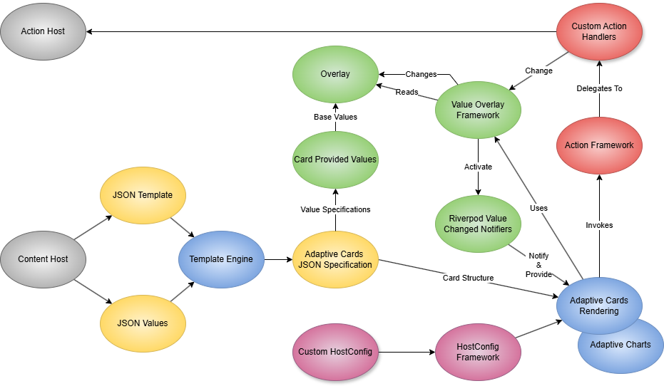
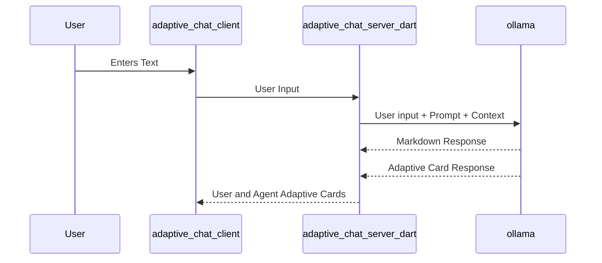

# Flutter Adaptive Cards

This project is a Flutter implementation of the Adaptive Cards specification. The Adaptive Cards project was originally developed by Microsoft and is now an open source project. You can find more information about Adaptive Cards at <https://adaptivecards.io/>. This particular implementation is a fork of a repository whose root ancestor that no longer exist. This project is not affiliated with Microsoft.

## Major Components

 _a draw.io editable png_

## About Adaptive Cards

Adaptive Cards is a way of implementing Server Driven UI (SDUI) using a JSON based schema to deliver user interfaces specifications across platforms.

1. See the [AdaptiveCards Getting Started](/packages/flutter_adaptive_cards_fs/README.md) page for more information about the core AdaptiveCards library.
2. See the [Adaptive Charts Getting Started](/packages/flutter_adaptive_charts_fs/README.md) page for more information about the charts library that can be used with adaptive cards.
3. See the [AdaptiveTemplating Getting Started](/packages/flutter_adaptive_template_fs/README.md) for more info about the templating library that can sit in front of adaptive cards.

## GitHub notes

The default branch has been renamed from the original repository. `master` is now named `main`

If you have a local clone, you can update it by running the following commands.

```bash
git branch -m master main
git fetch origin
git branch -u origin/main main
git remote set-head origin -a
```

## This project: Packages

1. Libraries
   1. The Adaptive Card library is in [packages/flutter_adaptive_cards_fs](/packages/flutter_adaptive_cards_fs/README.md)
   1. The Adaptive Card library CHANGELOG is in [packages/flutter_adaptive_cards_fs/CHANGELOG.md](/packages/flutter_adaptive_cards_fs/CHANGELOG.md)
1. The Adaptive Card Host library is an optional backend invoke bridge (PlainJson and Teams-shaped request/response adapters, HTTP client, and `AdaptiveCardBackendHandlers` wiring). [packages/flutter_adaptive_cards_host_fs](/packages/flutter_adaptive_cards_host_fs/README.md)
   1. The Adaptive Card Host library CHANGELOG is in [packages/flutter_adaptive_cards_host_fs/CHANGELOG.md](/packages/flutter_adaptive_cards_host_fs/CHANGELOG.md)
1. Adaptive Card Charting is an extension that adds charting capabilities and is implemented in its own package so that its third party dependencies are isolated from the core library. [packages/flutter_adaptive_charts_fs](/packages/flutter_adaptive_charts_fs/README.md)
   1. The Adaptive Card Charting library CHANGELOG is in [packages/flutter_adaptive_charts_fs/CHANGELOG.md](/packages/flutter_adaptive_charts_fs/CHANGELOG.md)
1. The Adaptive Card Template library supports merging json data into an Adaptive Card template. It is implemented in its own package [packages/flutter_adaptive_template_fs](/packages/flutter_adaptive_template_fs/README.md)

   1. The Adaptive Card Template library CHANGELOG is in [packages/flutter_adaptive_template_fs/CHANGELOG.md](/packages/flutter_adaptive_template_fs/CHANGELOG.md)
   1. [Adaptive Cards Template specification](https://learn.microsoft.com/en-us/adaptive-cards/authoring-cards/card-templates)

1. azure bot service expressions are not currently supported.
   1. [Adaptive Expressions specification](https://learn.microsoft.com/en-us/azure/bot-service/adaptive-expressions/adaptive-expressions-prebuilt-functions?view=azure-bot-service-4.0)

## Widgetbook

The [widgetbook](widgetbook/) app is a **component gallery** for this project. It renders Adaptive Card JSON samples grouped by element and action type so you can browse layouts, inputs, actions, v1.6 extensions, and chart samples without writing a host app.

### What you can do widgetbook

- Browse use cases in the Widgetbook sidebar (TextBlock, inputs, actions, tables, charts, and more).
- Switch **light / dark** themes and viewport sizes from the Widgetbook toolbar.
- Inspect rendered cards from JSON under `widgetbook/lib/samples/` (each use case points at a sample file).
- Try **interactive host demos** that go beyond static JSON: **TextBlock → Text overlay** (knob-driven `setText`) and **Input.ChoiceSet → dependent country/city** (`valueChangedAction` reset + host `onChange` / `applyUpdates`) — see [form-inputs.md](docs/form-inputs.md#dependent-choiceset-country--city).

### Run Widgetbook from the repo root

```bash
cd widgetbook
fvm flutter pub get
fvm flutter run
```

Pick a desktop, web, or mobile device when prompted. On macOS, enable outgoing network connections in Runner signing if samples load remote images.

### After adding or renaming use cases

Use cases are declared in `widgetbook/lib/adaptive_cards_use_cases.dart`. Regenerate the Widgetbook directory tree, then restart the app:

```bash
cd widgetbook
fvm dart run build_runner build
fvm flutter run
```

### Adding new sample JSON

1. Place files under `widgetbook/lib/samples/` (mirror the existing folder layout).
2. Register the folder in `widgetbook/pubspec.yaml` under `flutter: assets:` if you create a new directory.
3. Add a `@widgetbook.UseCase` in `adaptive_cards_use_cases.dart` and run `build_runner` as above.

More detail: [widgetbook/README.md](widgetbook/README.md).

## adaptive_explorer

The [adaptive_explorer](adaptive_explorer/) app is a **desktop design studio** for authoring and previewing Adaptive Cards. It combines a live preview with JSON editors for template, data, and merged output—useful when you are editing card JSON in an external editor or testing templating.

### What you can do adaptive explorer

- **Open Template** — load an Adaptive Card template or fully resolved card JSON.
- **Open Data** (optional) — load a data file; the app merges template + data with `flutter_adaptive_template_fs` and previews the result.
- Edit template, data, or merged JSON in tabs (`json_editor_flutter`) and save changes.
- Watch the filesystem: when the open template or data file changes on disk, the preview refreshes automatically.
- Resize the split between preview and editor with the divider (preview above editor in portrait, side-by-side in landscape).

### Supported platforms

macOS, Windows, and Linux (desktop only).

### Run adaptive explorer from the repo root

```bash
cd adaptive_explorer
fvm flutter pub get
fvm flutter run
```

On macOS, the app uses `file_picker` and needs appropriate signing and entitlements for file access and network images (see [adaptive_explorer/README.md](adaptive_explorer/README.md#macos-specifics)).

### Typical workflow

1. Start the app.
2. Click **Open Template** and choose a `.json` file (template or resolved card).
3. Optionally click **Open Data** and choose a companion data file.
4. Use the Template / Data / Merged tabs to edit; the preview updates as you work or when files change externally.

More detail: [adaptive_explorer/README.md](adaptive_explorer/README.md).

## adaptive_chat_server_dart + adaptive_chat_client

[`adaptive_chat_server_dart`](adaptive_chat_server_dart/) (a Dart `shelf`
backend) and [`adaptive_chat_client`](adaptive_chat_client/) (a Flutter app)
together are an **end-to-end server-driven UI (SDUI) demo**: every screen the
user sees, including the chat bubbles and the compose box itself, is an
Adaptive Card **authored by the server** and rendered verbatim by the client —
and those cards can be generated dynamically at runtime by a local LLM running
in [Ollama](https://ollama.com).



### What you can do with it

- Run it against a local **Ollama** chat model with the card system prompt and
  get replies as live Adaptive Card fragments (dates, choice sets, FactSets,
  tables, ratings, and more). The client renders whatever shape the server sends
  with no client code change, demonstrating dynamic, LLM-generated SDUI end to
  end.
- Run it in **echo mode** (`--echo`, no LLM) to see the SDUI wiring on its own: the
  server authors right/left chat bubbles as Adaptive Cards, and the compose box is
  an `Input.Text` + `Action.Submit` card wired through
  [`flutter_adaptive_cards_host_fs`](packages/flutter_adaptive_cards_host_fs) — the
  same host-invoke path an in-card form would use.
- Switch the server's **system prompt** (`--system-prompt-file
assets/default_system_prompt.txt`) to compare Markdown replies against cards on
  the same model.

### Run the demo from the repo root

```bash
# Terminal 1: backend — every run names its reply mode; there is no default
ollama pull qwen2.5-coder:7b   # once
ollama serve                   # if not already running
cd adaptive_chat_server_dart
fvm dart pub get
fvm dart run bin/server.dart --system-prompt-file assets/card_system_prompt.txt
# or: fvm dart run bin/server.dart --echo   (no model called at all)

# Terminal 2: client
cd adaptive_chat_client
fvm flutter run -d chrome    # or -d macos
```

That already produces dynamic Adaptive Cards. To pin the model and tuning
explicitly — this is the `Adaptive Chat Server Dart (Ollama qwen2.5-coder:7b)`
launch config in [`.vscode/launch.json`](.vscode/launch.json):

```bash
ollama pull qwen2.5-coder:7b
ollama serve
cd adaptive_chat_server_dart
fvm dart run bin/server.dart \
  --ollama-url http://127.0.0.1:11434 \
  --ollama-model qwen2.5-coder:7b \
  --json-format none \
  --num-ctx 16384 \
  --history-turns 10 \
  --port 8000
```

VS Code users can instead run the `Adaptive Chat Server Dart (Ollama
qwen2.5-coder:7b)` and `Adaptive Chat Client - Web` launch configs together from
the Run and Debug panel. The `, markdown prompt)` variants opt back out to
Markdown replies for comparison.

More detail:
[adaptive_chat_server_dart/README.md](adaptive_chat_server_dart/README.md),
[adaptive_chat_client/README.md](adaptive_chat_client/README.md), and the design
notes in
[docs/superpowers/specs/2026-08-09-adaptive-chat-server-dart-design.md](docs/superpowers/specs/2026-08-09-adaptive-chat-server-dart-design.md).

## Platform Support

| Platform | Status | Notes                       |
| -------- | ------ | --------------------------- |
| Android  | ✅     |                             |
| iOS      | ✅     |                             |
| Web      | ✅     |                             |
| Linux    | ✅     | Only tested on build agents |
| macOS    | ✅     |                             |
| Windows  | ✅     | Video Player not supported  |

## Project Configuration

- Flutter versions are managed using fvm.
- This repository is managed using flutter workspaces via the `pubspec.yaml`

### First-time setup (fresh clone)

The pinned Flutter SDK version lives in `.fvmrc`, but the generated `.fvm/`
symlinks are gitignored — so a fresh clone has no `.fvm/versions/<version>` yet.
The committed VS Code setting `dart.flutterSdkPath` points there, so until you
run fvm once the Dart/Flutter extension can't find an SDK. Run the setup script
from the repo root to create the links (offline if the SDK is already in your
global fvm cache):

```bash
# macOS / Linux
./scripts/setup-workspace.sh

# Windows (PowerShell)
./scripts/setup-workspace.ps1
```

Then reload the VS Code window so the extension picks up the SDK. This wraps
`fvm install`; see the `adaptive-cards-dart-flutter-fvm` skill for switching the
pinned version.

## Defects

Many!

- See [Defects](/packages/flutter_adaptive_cards_fs/README.md#defects)
- [Microsoft learning authoring cards text features](https://learn.microsoft.com/en-us/adaptive-cards/authoring-cards/text-features) may not all be implemented
- **The `dart-flutter` plugin's MCP server ignores FVM.** Its bundled `.mcp.json` launches `dart mcp-server` with a bare `dart`, so the Dart MCP server runs whichever SDK is first on `PATH` rather than the FVM-pinned one. Claude Code has no per-project override for a plugin's MCP entry, so fixing this needs a repo-level `.mcp.json` that shadows it with `fvm dart mcp-server`. Not yet written — until then, treat MCP-server output as advisory and run authoritative `analyze`/`test`/`build` commands yourself through `fvm`. See [docs/AI-Agent-Support.md](docs/AI-Agent-Support.md#two-caveats).

## LLM Agent Support

Claude Code is the only supported agent. ~~Antigravity~~, ~~CoPilot~~ and ~~Cursor~~ were supported until August 2026. Full setup, install commands, and update procedures are in **[docs/AI-Agent-Support.md](docs/AI-Agent-Support.md)**.

### Always-on rules — [AGENTS.md](AGENTS.md)

Always-on project guardrails (FVM, monorepo hygiene, Very Good Analysis, Riverpod document overlays, semantic labels, localization). Derived from the [Flutter team AI rules](https://docs.flutter.dev/ai/ai-rules).

### Task playbooks — [`.claude/skills/`](.claude/skills/)

Modular skills loaded when a task matches. This directory holds the 18 project-authored `adaptive-cards-*` skills; the Dart and Flutter team skills arrive through a plugin instead (see below). Claude Code reads this directory directly — there is no symlink or setup script to run.

> Only built in skills show up when typing `/` in the Claude Code prompt. Superpowers and other customized skills do not show up in the `/` list in the VSCode plugin but do in a terminal command line. Claude itself says that the list shouldn't work but it did this morning in my terminal window

| Source               | Delivery                                                       | Count |
| -------------------- | -------------------------------------------------------------- | ----- |
| Dart + Flutter teams | `dart-flutter` plugin ([flutter/agent-plugins][agent-plugins]) | 22    |
| Project-specific     | Committed to `.claude/skills/`                                 | 18    |

[agent-plugins]: https://github.com/flutter/agent-plugins

#### Project-specific skills

`adaptive-cards-accessibility`, `adaptive-cards-backend-host`, `adaptive-cards-chat-prompt-tuning`, `adaptive-cards-code-review`, `adaptive-cards-dart-flutter-fvm`, `adaptive-cards-diataxis-docs`, `adaptive-cards-element-registry`, `adaptive-cards-flutter-standard-practices`, `adaptive-cards-hostconfig-theme`, `adaptive-cards-localization`, `adaptive-cards-monorepo-workspace`, `adaptive-cards-public-api-docs`, `adaptive-cards-release-engineer`, `adaptive-cards-release-flutter-upgrade-sdk`, `adaptive-cards-spec-compliance`, `adaptive-cards-templating`, `adaptive-cards-testing`, `adaptive-cards-widgetbook-overlay-demos`.

#### Plugins

Claude Code plugins are declared at project scope in [`.claude/settings.json`](.claude/settings.json) and installed by a `SessionStart` hook, so a fresh clone picks them up on first trusted open.

| Plugin          | Marketplace                          | Provides                                                |
| --------------- | ------------------------------------ | ------------------------------------------------------- |
| `dart-flutter`  | `flutter/agent-plugins`              | 12 `dart-*` + 10 `flutter-*` skills, Dart MCP server    |
| `superpowers`   | `anthropics/claude-plugins-official` | Brainstorming, plans, TDD, systematic debugging, review |
| `skill-creator` | `anthropics/claude-plugins-official` | Authoring and evaluating skills                         |

Plugin skills are namespaced where the plugin declares it — invoke `superpowers:brainstorming`, not `brainstorming`.

To use any of these skills in a different tool, or in Claude Code across all your projects, install them at user level — see [docs/ai-agent-skills-install.md](docs/ai-agent-skills-install.md). Do not vendor them back into `.claude/skills/`; Claude Code would then load two copies.

### Quick install (from repo root)

Only needed if the `SessionStart` hook did not run:

```bash
claude plugin marketplace add flutter/agent-plugins
claude plugin install dart-flutter@dart-flutter
```

Update: `claude plugin marketplace update dart-flutter && claude plugin update dart-flutter@dart-flutter`.

## More about adaptive cards and available SDKs

- [Adaptive Cards learning and specification site](https://learn.microsoft.com/en-us/adaptive-cards/)
- [Partners](https://learn.microsoft.com/en-us/adaptive-cards/resources/partners) using adaptive cards
- [Adaptive Cards for Android](https://learn.microsoft.com/en-us/adaptive-cards/sdk/rendering-cards/android/getting-started) is available as a [maven artifact](https://search.maven.org/artifact/io.adaptivecards/adaptivecards-android)
- [Adaptive Cards for ios is available as a pod](https://learn.microsoft.com/en-us/adaptive-cards/sdk/rendering-cards/ios/getting-started)
- [Adaptive Cards for javascript](https://learn.microsoft.com/en-us/adaptive-cards/sdk/rendering-cards/javascript/getting-started) is available via npm
- [Adaptive Cards for Windows WPF](https://learn.microsoft.com/en-us/adaptive-cards/sdk/rendering-cards/net-wpf/getting-started)
- [Adaptives Cards for Image](https://learn.microsoft.com/en-us/adaptive-cards/sdk/rendering-cards/net-image/getting-started) renders into a png
- [Adaptive Cards for Windows UWP](https://learn.microsoft.com/en-us/adaptive-cards/sdk/rendering-cards/uwp/getting-started)
- A community supported [Adaptive Cards for ReactNative](https://learn.microsoft.com/en-us/adaptive-cards/sdk/rendering-cards/react-native/getting-started)

There is also

- A [React Native designer SDK](https://learn.microsoft.com/en-us/adaptive-cards/sdk/designer)
- A [Javascript Templating SDK](https://learn.microsoft.com/en-us/adaptive-cards/templating/sdk) that can be used as a designer

## History of this repository

The last commit in the original repository was in Q1 2020. I picked it up in Q2 of 2023 and updated it to support Flutter 3.0. I mucked it up a bit and stopped work for two years until Q4 of 2025. It kind of languished until LLMs got good at the end of 2025 and into 2026. The current version is highly reshaped by the specs and plans in docs an via the use of LLMs.
