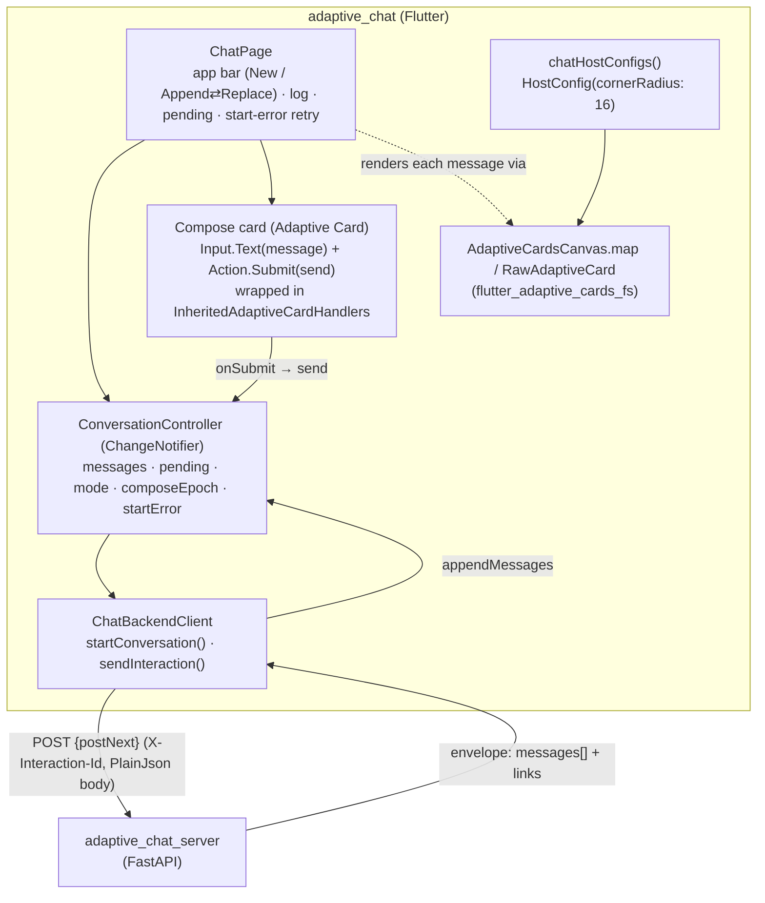

# adaptive_chat

A **server-driven-UI (SDUI) chat demo** for `flutter_adaptive_cards_fs`. The chat
log is a scrolling list of **Adaptive Cards authored entirely by the server**, and
the compose box is itself an Adaptive Card — so the whole conversation is driven by
card JSON, exercising the library's host-invoke patterns end to end.

Pairs with the FastAPI backend in [`../adaptive_chat_server`](../adaptive_chat_server).
Design notes: [`docs/superpowers/specs/2026-07-18-adaptive-chat-sdui-design.md`](../docs/superpowers/specs/2026-07-18-adaptive-chat-sdui-design.md)
and the plan [`docs/superpowers/plans/2026-07-18-adaptive-chat-sdui.md`](../docs/superpowers/plans/2026-07-18-adaptive-chat-sdui.md).

## What makes it "server-driven"

- **The client is deliberately dumb.** It renders only what the server returns and
  never composes bubble UI itself. Bubble **alignment, fill colour, and rounded
  corners are all authored in the card JSON** by the server (a `ColumnSet` with a
  `stretch` spacer pushes a bubble left/right; `Container` `style` + `roundedCorners`
  give it its fill and shape). Swapping the server's card authoring changes the look
  with no client change.
- **The compose box is an Adaptive Card**, not a native widget: an `Input.Text`
  (multiline) + `Action.Submit`, wired through
  [`flutter_adaptive_cards_host_fs`](../packages/flutter_adaptive_cards_host_fs). Its
  submit flows through the exact same host-invoke path that in-card forms would — the
  point of the demo.
- **Rounded bubbles** come from the core library's Teams `roundedCorners` support:
  the server sets `roundedCorners: true` on each bubble `Container`, and
  `chatHostConfigs()` sets a 16 px `HostConfig.cornerRadius`.

## Architecture



### Components (`lib/src/`)

| File | Responsibility |
| --- | --- |
| `chat_models.dart` | `ChatStart`, `ChatEnvelope` (`messages[]` + `links{self, postNext}`), `ChatBackendException` — wire types + `fromJson`. |
| `chat_backend_client.dart` | Transport. Reuses the host package's **request** serialization (`AdaptiveCardInvokeRequest.fromSubmit` + `PlainJsonInvokeAdapter.toMap`) to POST the compose submit, then parses the **chat envelope itself** (the response is cards to append, not an invoke-effect patch). |
| `conversation_controller.dart` | `ChangeNotifier` state: rendered `messages`, `pending`, `mode` (append/replace), `composeEpoch` (resets the compose input), `starting`/`startError` (start-failure surfacing), `ready`. Client-generated interaction ids; follows `postNext`. |
| `chat_page.dart` | The screen: app bar (New conversation, Append⇄Replace `Switch`), the `ListView.builder` bubble log (`ObjectKey(card)` + fade entrance), the pending indicator, the keyed `start-error` retry banner, and the compose card wrapped in `InheritedAdaptiveCardHandlers`. |
| `compose_card.dart` | The compose Adaptive Card map (`Input.Text id=message`, multiline; `Action.Submit id=send`). |
| `chat_host_config.dart` | `chatHostConfigs()` — light/dark `HostConfig(cornerRadius: 16)` so bubbles read as rounded chat bubbles. |

### The wire contract (client view)

1. On launch, `ConversationController.startConversation()` → `POST /conversations` →
   `{ conversationId, links.postNext }`.
2. Compose **Submit** → `controller.send(text)` → `ChatBackendClient.sendInteraction`
   → `POST {postNext}` with header `X-Interaction-Id: <client id>` and a PlainJson
   invoke body (`{ kind, actionId, data: { message } }`).
3. Response is an **envelope** `{ conversationId, interactionId, messages[], links{self, postNext} }`.
   The controller appends `messages[]` to the log (or replaces, in Replace mode) and
   follows the new `postNext` for the next send.
4. Reposting the **same** `X-Interaction-Id` returns the stored envelope
   (idempotent) — protects against double-submit.

A polished pending indicator + fade-in cover the round-trip (the model is
server-authoritative, so nothing renders until the server replies).

## Run

Start the backend first (see [`../adaptive_chat_server`](../adaptive_chat_server)),
then:

```bash
fvm flutter run -d chrome    # or -d macos
```

The client points at `http://localhost:8000` by default. In VS Code use the
**Adaptive Chat - Web** / **Adaptive Chat - Current** run targets, or the
**Adaptive Chat (server + web)** / **Adaptive Chat (Ollama server + web)**
compounds to launch server + app together.

## Test

```bash
fvm flutter test
```

Widget/unit tests cover the backend client (mocked HTTP), the controller state
machine (append/replace/pending/start-error), and the page (bubble append, pending,
Replace, New-conversation, retry).

## Not covered here (by design)

In-card **form** submits (a returned card carrying its own inputs/actions posting
back to its `self` URL) are *designed for* but not built — the envelope's per-card
`self` link is the hook. See the design doc's "Non-goals".
