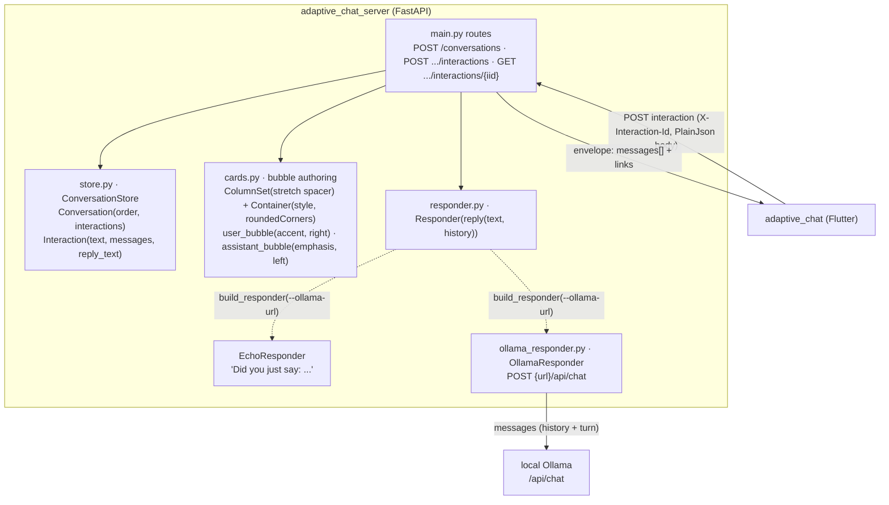

# adaptive_chat_server

FastAPI backend for the **Adaptive Chat** SDUI demo. It authors the chat bubbles
as Adaptive Cards, keeps conversation state in memory, and answers either with a
simple **echo** (default) or a local **Ollama** chat model. Pairs with the Flutter
client in [`../adaptive_chat`](../adaptive_chat).

Design notes: [`docs/superpowers/specs/2026-07-18-adaptive-chat-sdui-design.md`](../docs/superpowers/specs/2026-07-18-adaptive-chat-sdui-design.md).

## Architecture

The server is **authoritative for everything on screen**: it emits pre-styled
Adaptive Cards and the client renders them verbatim. Bubble alignment, fill, and
rounded corners live in the card JSON, so the look is a server concern.



### Wire contract

| Method & path | Purpose | In | Out |
| --- | --- | --- | --- |
| `POST /conversations` | Start a session | — | `{ conversationId, links: { postNext } }` |
| `POST /conversations/{cid}/interactions` | Send one interaction | header `X-Interaction-Id`; PlainJson invoke body (`data.message`) | `200` + **envelope** |
| `GET /conversations/{cid}/interactions/{iid}` | Replay one interaction | — | **envelope** |

**Envelope:** `{ conversationId, interactionId, messages: [<AdaptiveCard>, ...], links: { self, postNext } }`.
`messages` is an ordered list of pre-styled cards (a right-aligned "you" bubble and
a left-aligned reply bubble). **Idempotent by `X-Interaction-Id`:** a repeated id
returns the stored envelope without re-running the responder.

### Components (`app/`)

| File | Responsibility |
| --- | --- |
| `main.py` | FastAPI app, CORS, routes, the `store`/`responder` singletons, `build_responder(url, model)`, and history threading in the send route. |
| `store.py` | In-memory `ConversationStore`; `Interaction` keeps the user `text`, the rendered `messages`, and the plain `reply_text` (so chat **history** can be rebuilt for Ollama). Lost on restart — fine for a demo. |
| `cards.py` | Bubble authoring: a `ColumnSet` with a `stretch` spacer for alignment + a styled, `roundedCorners: true` `Container`; `user_bubble` (accent, right), `assistant_bubble` (emphasis, left), and `envelope(...)`. |
| `responder.py` | `Responder` protocol — `reply(text, history) -> str` — and `EchoResponder`. The seam that lets the reply strategy swap without touching routes. |
| `ollama_responder.py` | `OllamaResponder`: maps history + current turn to Ollama `messages` and POSTs `{url}/api/chat` (`stream: false`); returns `message.content`; falls back to a short message if Ollama is unreachable. |
| `__main__.py` | CLI entrypoint (`python -m app ...`) that selects the responder from `--ollama-url` and runs uvicorn. |

### Responder selection

`build_responder(ollama_url, model)` returns an `OllamaResponder` when an Ollama URL
is present (from `--ollama-url`, bridged via the `OLLAMA_URL`/`OLLAMA_MODEL`
environment so it survives uvicorn `--reload`), otherwise an `EchoResponder`.

## Run

```bash
python3 -m venv .venv
.venv/bin/pip install -r requirements.txt
.venv/bin/uvicorn app.main:app --reload --port 8000
```

CORS is enabled for local dev so the Flutter web client can reach it.

## Test

```bash
.venv/bin/python -m pytest -v
```

Covers the store, bubble authoring, the routes (start/send/replay, idempotency,
validation), responder selection, and the Ollama responder (mocked HTTP — no live
Ollama).

## Ollama (optional)

By default the server runs the echo demo (every reply is `"Did you just say: ..."`).
To answer with a local [Ollama](https://ollama.com) chat model instead, start the
server via the CLI entrypoint with `--ollama-url`:

```bash
ollama pull llama3.2   # once, if you haven't already
ollama serve           # if it isn't already running

.venv/bin/python -m app --ollama-url http://127.0.0.1:11434 [--ollama-model llama3.2]
```

Ollama must already be running locally and the model must be pulled — the server
does not start or manage Ollama itself. Prior turns of the conversation are sent as
chat history so the model has context.

**Use `127.0.0.1`, not `localhost`.** With Ollama's "expose to the network" setting
off, Ollama binds IPv4 `127.0.0.1` only; on macOS `localhost` often resolves to IPv6
`::1` first, so `http://localhost:11434` fails to connect even though Ollama is
running.

**Diagnostics.** Every reply logs to the server console (the uvicorn logger): the
selected responder at startup, each outgoing `POST …/api/chat`, and — on failure —
the full exception with a stack trace. Failures are reported distinctly rather than
all as "unreachable": a connection failure returns
`"(Ollama unreachable at … — <ExceptionType>: …)"`, an HTTP error (e.g. the model
isn't pulled → 404) returns `"(Ollama error HTTP 404 at …: <body>)"`, and an
unexpected 2xx body returns `"(Ollama returned an unexpected response: …)"`.

Omit `--ollama-url` (or run `uvicorn app.main:app` directly, as in **Run** above) to
keep the echo demo. `--ollama-model` defaults to `llama3.2`. `--host`/`--port` are
also available and default to `127.0.0.1`/`8000`.
