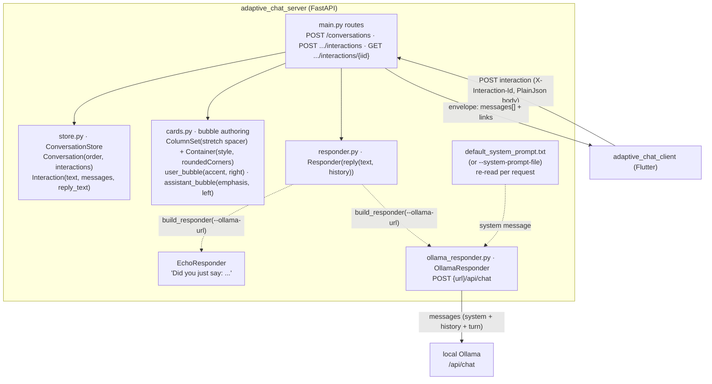
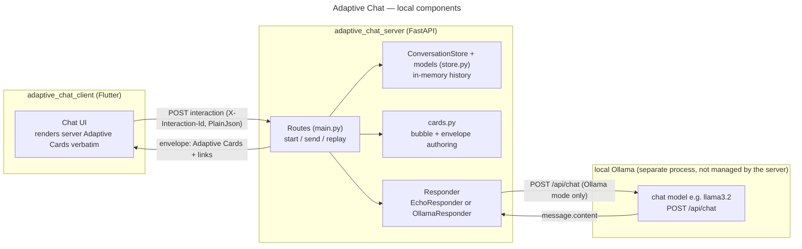
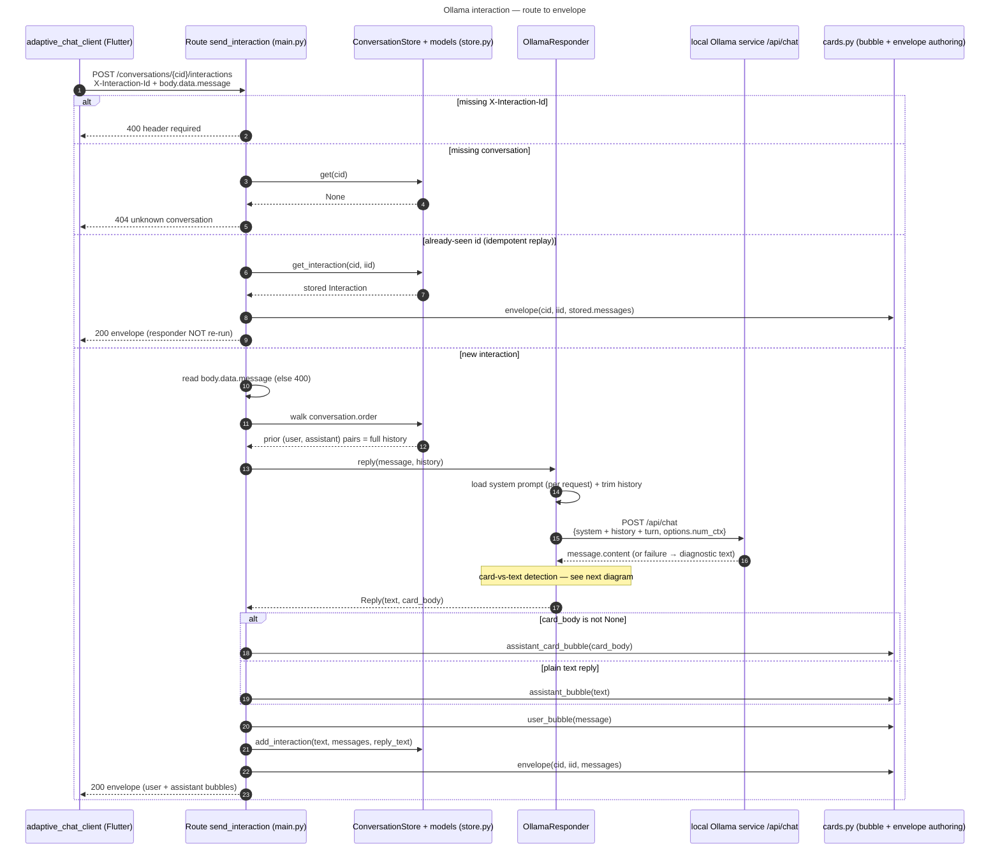
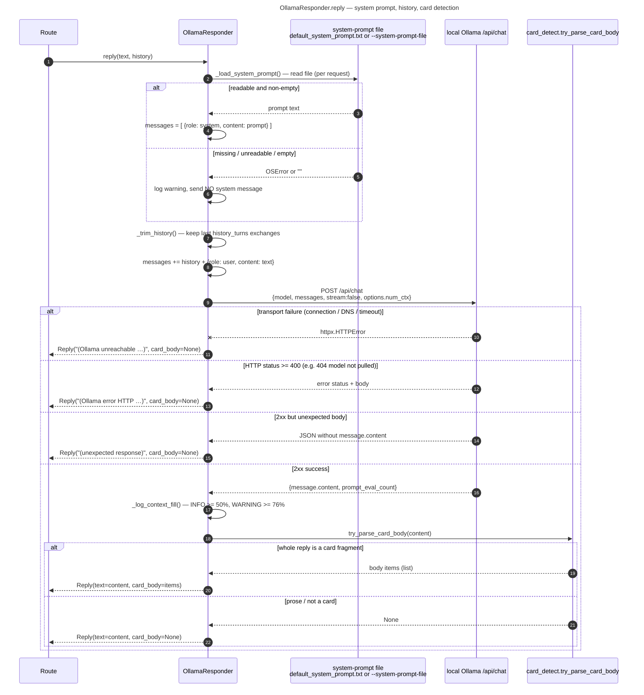

# adaptive_chat_server

FastAPI backend for the **Adaptive Chat** SDUI demo. It authors the chat bubbles
as Adaptive Cards, keeps conversation state in memory, and answers either with a
simple **echo** (default) or a local **Ollama** chat model. Pairs with the Flutter
client in [`../adaptive_chat_client`](../adaptive_chat_client).

Design notes: [`docs/superpowers/specs/2026-07-18-adaptive-chat-sdui-design.md`](../docs/superpowers/specs/2026-07-18-adaptive-chat-sdui-design.md).

## Architecture

The server is **authoritative for everything on screen**: it emits pre-styled
Adaptive Cards and the client renders them verbatim. Bubble alignment, fill, and
rounded corners live in the card JSON, so the look is a server concern.



### Wire contract

| Method & path                                 | Purpose                | In                                                                | Out                                       |
| --------------------------------------------- | ---------------------- | ----------------------------------------------------------------- | ----------------------------------------- |
| `POST /conversations`                         | Start a session        | —                                                                 | `{ conversationId, links: { postNext } }` |
| `POST /conversations/{cid}/interactions`      | Send one interaction   | header `X-Interaction-Id`; PlainJson invoke body (`data.message`) | `200` + **envelope**                      |
| `GET /conversations/{cid}/interactions/{iid}` | Replay one interaction | —                                                                 | **envelope**                              |

**Envelope:** `{ conversationId, interactionId, messages: [<AdaptiveCard>, ...], links: { self, postNext } }`.
`messages` is an ordered list of pre-styled cards (a right-aligned "you" bubble and
a left-aligned reply bubble). **Idempotent by `X-Interaction-Id`:** a repeated id
returns the stored envelope without re-running the responder.

### Components (`app/`)

| File                        | Responsibility                                                                                                                                                                                                                                                                                                                                                                            |
| --------------------------- | ----------------------------------------------------------------------------------------------------------------------------------------------------------------------------------------------------------------------------------------------------------------------------------------------------------------------------------------------------------------------------------------- |
| `main.py`                   | FastAPI app, CORS, routes, the `store`/`responder` singletons, `build_responder(url, model)`, and history threading in the send route.                                                                                                                                                                                                                                                    |
| `store.py`                  | In-memory `ConversationStore`; `Interaction` keeps the user `text`, the rendered `messages`, and the plain `reply_text` (so chat **history** can be rebuilt for Ollama). Lost on restart — fine for a demo.                                                                                                                                                                               |
| `cards.py`                  | Bubble authoring: a `ColumnSet` with a `stretch` spacer for alignment + a styled, `roundedCorners: true` `Container`; `user_bubble` (accent, right), `assistant_bubble` (emphasis, left, Markdown text), `assistant_card_bubble` (emphasis, left, embeds a detected Adaptive Card fragment instead of text), and `envelope(...)`.                                                         |
| `responder.py`              | `Reply(text, card_body)` — a frozen dataclass: `text` is always the raw model output (threaded into Ollama history); `card_body` is the parsed card body items, or `None` for a plain Markdown reply. `Responder` protocol — `reply(text, history) -> Reply` — and `EchoResponder` (always returns `card_body=None`). The seam that lets the reply strategy swap without touching routes. |
| `card_detect.py`            | `try_parse_card_body(raw) -> list \| None` — strict text-vs-card detection: the **whole** reply (after stripping an optional code fence) must be a full `{"type": "AdaptiveCard", "body": [...]}` object or a bare, non-empty JSON array of objects, else it's `None` and the caller falls back to a text reply.                                                                          |
| `ollama_responder.py`       | `OllamaResponder`: prepends the **system prompt** (see below), maps history + current turn to Ollama `messages`, and POSTs `{url}/api/chat` (`stream: false`); runs `try_parse_card_body` on `message.content` and returns a `Reply(text=content, card_body=...)`; falls back to a short message if Ollama is unreachable (always `card_body=None` in that case).                         |
| `default_system_prompt.txt` | Bundled default system prompt, used when no `--system-prompt-file` is given. Resolved relative to the package (not the process cwd).                                                                                                                                                                                                                                                      |
| `card_system_prompt.txt`    | Bundled **card** system prompt — selected the same way, via `--system-prompt-file app/card_system_prompt.txt`. Instructs the model to reply with an Adaptive Card fragment (display-only: no actions). See **Card replies (display-only)** below.                                                                                                                                         |
| `__main__.py`               | CLI entrypoint (`python -m app ...`) that selects the responder from `--ollama-url` and runs uvicorn.                                                                                                                                                                                                                                                                                     |

### Responder selection

`build_responder(ollama_url, model, system_prompt_file)` returns an
`OllamaResponder` when an Ollama URL is present (from `--ollama-url`, bridged via
the `OLLAMA_URL`/`OLLAMA_MODEL`/`OLLAMA_SYSTEM_PROMPT_FILE` environment so it
survives uvicorn `--reload`), otherwise an `EchoResponder`.

### Conversation context

Server state is **keyed by `conversationId`** — the top level of `ConversationStore`
is `dict[cid, Conversation]`, and each `Conversation` holds its `Interaction`s keyed
by `interactionId`. So it is a **two-level key** (`cid` → `iid`): the client-supplied
`X-Interaction-Id` namespace is scoped **inside** one conversation, and the same
`i_0001` can exist in two conversations without collision. All state is in-memory and
lost on restart (fine for a demo; not shared across worker processes).

**How history reaches the model.** On each `POST …/interactions`, the send route
rebuilds the conversation's history from the store — walking `conversation.order` and
emitting a `("user", text)` / `("assistant", reply_text)` pair per prior interaction —
and passes it to `responder.reply(text, history)` with the **full** history.
`OllamaResponder` then sends **system prompt + history + current turn** to
`/api/chat` (see the diagram and **System prompt** below) — trimmed to a
recent window as described next. Because history is built from one
conversation's `order`, each `conversationId` gets an independent context.

**Retained in full; trimmed only on send.** The store keeps the **entire**
conversation (durable log + idempotent replay). What is bounded is only the
prompt **sent to Ollama**: `OllamaResponder` replays just the last
`--history-turns` exchanges (default 10). Nothing is pruned from the store, so
raising `--history-turns` or `--num-ctx` later needs no data migration.

**Context-fill logging.** The server sends an explicit `options.num_ctx`
(default 16384) and, after each reply, logs the actual prompt tokens
(`prompt_eval_count`) against that window: an `INFO` line at ≥ 50% fill and a
`WARNING` at ≥ 76% (leaving headroom for the generated reply). This surfaces the
otherwise-silent truncation Ollama performs once a prompt exceeds `num_ctx`.
(`EchoResponder` ignores history entirely — it only echoes the current turn.)

### System prompt

Every Ollama request is prefixed with a `{"role": "system", ...}` message so the
model's behavior and output formatting can be tuned without code changes. The
prompt text comes from a file:

- **Source.** `--system-prompt-file <path>` (bridged to `OLLAMA_SYSTEM_PROMPT_FILE`).
  When omitted, the bundled [`app/default_system_prompt.txt`](app/default_system_prompt.txt)
  is used.
- **Live reload.** The file is re-read on **every request**, so editing the active
  prompt file takes effect on the next turn without restarting the server.
- **Missing / empty is not fatal.** If the file is unreadable or blank, the server
  logs a warning and sends the request with **no** system message (the original
  behavior) rather than failing the chat.
- **Formatting guidance.** Replies render inside an Adaptive Cards `TextBlock`,
  which supports GitHub-flavored Markdown (headings, bold/italic, links, lists,
  blockquotes, inline/fenced code, and tables). The default prompt tells the model
  to keep replies concise and to use tables sparingly, since bubbles are narrow.
- **Echo mode ignores it.** The system prompt only applies to `OllamaResponder`;
  `EchoResponder` never sends anything to a model.

### Card replies (display-only)

Instead of Markdown text, the model may answer with an Adaptive Card fragment
that gets embedded directly in the assistant bubble (`assistant_card_bubble`),
using the same alignment/fill/rounded-corner chrome as a text reply. Which
shape wins is decided per reply by `card_detect.try_parse_card_body`: the
**entire** message must be a full `{"type": "AdaptiveCard", "body": [...]}`
object or a bare, non-empty JSON array of objects, or it's rendered as
Markdown text instead.

To opt in, select the bundled card system prompt:

```bash
.venv/bin/python -m app --ollama-url http://127.0.0.1:11434 \
  --system-prompt-file app/card_system_prompt.txt
```

The card prompt's palette is intentionally small:

- **Inputs** — `Input.Date`, `Input.ChoiceSet` (`style: compact` / `expanded`,
  `isMultiSelect`), `Input.Text`, `Input.Number`, `Input.Time`.
- **Display** — `TextBlock`, `FactSet`, `Badge`, `Carousel`, `Table`, `Rating`,
  `Icon`, `ProgressBar`, `ProgressRing`, `CodeBlock`, `Image`.

**Display-only.** The prompt forbids `Action`/`ActionSet` elements, so the card
fragment carries no submit button of its own, and any values a user enters
into its inputs do not post back to the server — the fragment is render-only
for now.

### Structured output (`--json-format`)

By default (`--json-format schema`), every Ollama reply is constrained via
Ollama's `format` field against `app/card_schema.json` — a small schema
covering exactly the shapes `card_detect.try_parse_card_body` accepts (a full
card object, a bare element array, a single element, or a plain string for
Markdown replies) so the model cannot emit invalid or leaked-prefix JSON.

```bash
.venv/bin/python -m app --ollama-url http://127.0.0.1:11434 \
  --json-format schema   # default; try --json-format json or --json-format none
```

- `schema` (default) — constrains both syntax and the outer reply shape.
- `json` — constrains syntax only (any valid JSON value); shape is still
  checked by `card_detect.py` after parsing.
- `none` — today's prompt-only behavior, no `format` field sent.

See
[docs/superpowers/specs/2026-07-23-ollama-structured-json-output-design.md](../docs/superpowers/specs/2026-07-23-ollama-structured-json-output-design.md)
for the design rationale.

### Request flow

#### Components (all local)

Three processes run on the same machine. The **client** renders whatever cards
the **server** sends; the server owns conversation state and card authoring and,
in Ollama mode, calls a **local Ollama** process it neither starts nor manages.



**Echo mode (no diagram).** When the server starts **without** `--ollama-url`,
`build_responder` returns an `EchoResponder`. The route (`send_interaction`)
runs exactly as in the first diagram below — validate the header, 404 an unknown
conversation, short-circuit an already-seen `X-Interaction-Id`, then call
`responder.reply(message, history)` — but `EchoResponder.reply` **ignores
`history`, reads no file, and makes no network call**. It returns
`Reply(text="Did you just say: {message}", card_body=None)` synchronously, so the
assistant reply is always a left-aligned Markdown text bubble. None of the
Ollama-specific steps (system-prompt load, history trim, `POST /api/chat`,
card-vs-text detection) run. The two diagrams below therefore cover only the
**Ollama** path.

#### Ollama interaction: route → envelope

The send route validates and de-duplicates the request, rebuilds the
conversation's history from the store, delegates to `OllamaResponder` — which
calls the local **Ollama** service over HTTP — then authors the two chat bubbles
via `cards.py`. `store.py` holds the state models (`Conversation` /
`Interaction` / `Message`); `cards.py` is the server-side card authoring (the
"view"), not a model. The `OllamaResponder.reply` internals — system-prompt
load, history trim, and the card-vs-text decision — are expanded in the
[next diagram](#ollamaresponderreply-system-prompt-history-card-detection).



#### `OllamaResponder.reply`: system prompt, history, card detection

The responder re-reads the system-prompt **file on every request** (so edits
apply on the next turn without a restart), trims history to the outbound window,
POSTs `/api/chat`, and only then decides whether the reply is a card or text. It
**never raises** to the route: transport, HTTP-status, and bad-body failures all
return a short diagnostic `Reply` with `card_body=None`.



## Run

```bash
python3 -m venv .venv
.venv/bin/pip install -r requirements.txt
.venv/bin/uvicorn app.main:app --reload --port 8000
```

CORS is enabled for local dev so the Flutter web client can reach it.

**macOS: allow Chrome on the local network.** The first time the Flutter web
client (running in Chrome) calls this server, macOS may silently block the
connection until Chrome is enabled under **System Settings → Privacy &
Security → Local Network**. If the app loads but every send fails with a
connection error, toggle **Google Chrome** on there.

**macOS native client** (`adaptive_chat_client` run with `-d macos`) hits the same
"unable to connect" symptom for a _different_ reason: its App Sandbox needs the
`com.apple.security.network.client` entitlement to make outbound calls. That is
enabled in the client's `macos/Runner/*.entitlements`; see the client's
[`README`](../adaptive_chat_client/README.md#run) — it requires a full rebuild, not the
system-settings toggle above.

## Test

```bash
.venv/bin/python -m pytest -v
```

Covers the store, bubble authoring, the routes (start/send/replay, idempotency,
validation), responder selection, and the Ollama responder (mocked HTTP — no live
Ollama).

## Ollama (optional)

By default the server runs the echo demo (every reply is `"Did you just say: ..."`).
To answer with a local [Ollama](https://ollama.com) chat model instead, start the
server via the CLI entrypoint with `--ollama-url`:

```bash
ollama pull llama3.2   # once, if you haven't already
ollama serve           # if it isn't already running

.venv/bin/python -m app --ollama-url http://127.0.0.1:11434 [--ollama-model llama3.2]
```

Ollama must already be running locally and the model must be pulled — the server
does not start or manage Ollama itself. Prior turns of the conversation are sent as
chat history so the model has context.

**Use `127.0.0.1`, not `localhost`.** With Ollama's "expose to the network" setting
off, Ollama binds IPv4 `127.0.0.1` only; on macOS `localhost` often resolves to IPv6
`::1` first, so `http://localhost:11434` fails to connect even though Ollama is
running.

**Diagnostics.** Every reply logs to the server console (the uvicorn logger): the
selected responder at startup, each outgoing `POST …/api/chat`, and — on failure —
the full exception with a stack trace. Failures are reported distinctly rather than
all as "unreachable": a connection failure returns
`"(Ollama unreachable at … — <ExceptionType>: …)"`, an HTTP error (e.g. the model
isn't pulled → 404) returns `"(Ollama error HTTP 404 at …: <body>)"`, and an
unexpected 2xx body returns `"(Ollama returned an unexpected response: …)"`.

To override the system prompt (see **System prompt** above), point the server at a
text file:

```bash
.venv/bin/python -m app --ollama-url http://127.0.0.1:11434 \
  --system-prompt-file ./my_prompt.txt
```

The file is re-read on every request, so you can edit `my_prompt.txt` and see the
change on the next turn without restarting. Omit `--system-prompt-file` to use the
bundled default.

**Context window & history.** Two knobs bound and observe the prompt sent to
Ollama (both also read from `OLLAMA_NUM_CTX` / `OLLAMA_HISTORY_TURNS`; `--json-format`
below is likewise bridged via `OLLAMA_JSON_FORMAT`):

```bash
.venv/bin/python -m app --ollama-url http://127.0.0.1:11434 \
  --num-ctx 16384 --history-turns 10
```

- `--num-ctx` (default 16384) — context window sent as `options.num_ctx`. Prompt
  fill is logged against it (INFO ≥ 50%, WARNING ≥ 76%). Ollama silently drops
  the oldest tokens once a prompt exceeds `num_ctx`; the warning surfaces that.
- `--history-turns` (default 10) — how many prior exchanges are replayed to the
  model. Bounds only the outbound prompt; the server retains full history.
- `--json-format` (default `schema`) — `none`/`json`/`schema`; see **Structured
  output** above.

Omit `--ollama-url` (or run `uvicorn app.main:app` directly, as in **Run** above) to
keep the echo demo. `--ollama-model` defaults to `llama3.2`. `--host`/`--port` are
also available and default to `127.0.0.1`/`8000`.
