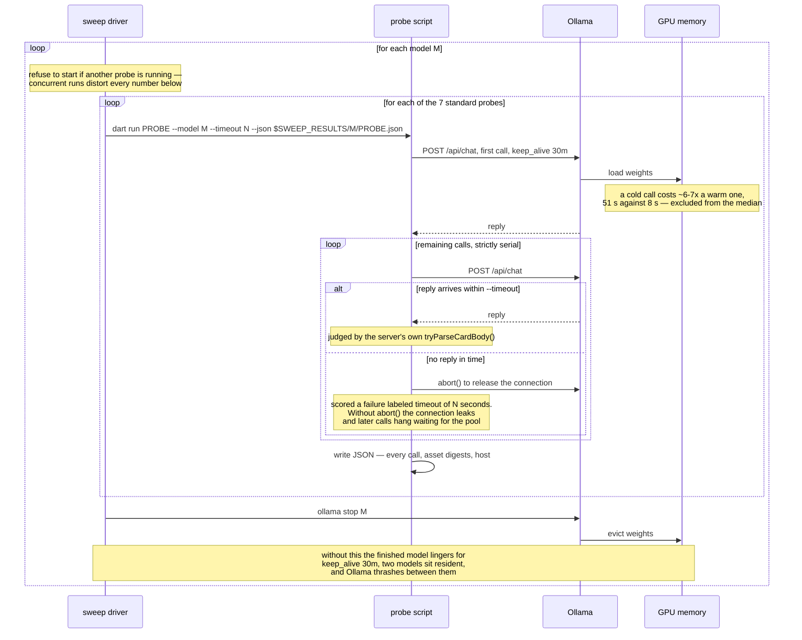

# Model behavior

Which local Ollama models produce renderable Adaptive Cards, what decoding settings they need, and what has already been measured about each.

## What this file is

`adaptive_chat_server_dart` is the backend for an **SDUI demo**. The demo works without any number in this file — pick a model, point the server at it, and it answers in cards. The file exists because the card path turned out to be a strict and discriminating test problem for local models. Answering as an Adaptive Card imposes four constraints at once: strict JSON, a closed element vocabulary the model must not invent from, a shape chosen to fit the question, and format stability across a multi-turn conversation. Each has an unambiguous pass/fail, and most chat benchmarks do not apply all four together. The findings should transfer to any workload that asks a local model for constrained, schema-shaped JSON; the demo is the instrument, not the subject.

Read it as a **lab notebook, not a requirement**. Nothing here is a supported product surface: the probes are hand-run, the numbers age as models and prompts change, and none of it gates the demo working. Every finding was originally recorded in a plan or a design spec — dated documents that are archived when their work ends — and copied here so the result outlives them; when a plan or spec produces a model finding, copy it into this file before the plan is archived, and cite the source so the full context is still findable. Each finding names the model, the setting, and the measurement, because reasoning about model behavior without measuring it has already produced wrong answers here more than once — which is what the probes in [`tool/model_probes/`](tool/model_probes/README.md) exist to prevent.

The vocabulary this file leans on — probe, sweep, case, sample, shape, seed — is defined in the [Glossary](#glossary) at the end. One term matters immediately: most figures here are `--samples 2`, which is why a one-point difference between two models is noise rather than a ranking.

## Key findings

The generalizable results — the ones that should transfer to any workload asking a local model for constrained, schema-shaped JSON, not just this demo. Model-specific numbers live in the [candidate table](#candidate-models) and [per-model results](#per-model-results); this section carries the takeaways.

- **Strict-shaped output is a sharper discriminator than prose benchmarks.** A model can sweep an ordinary chat benchmark and still fail almost every case that demands a specific, correct element type: `llama3-chatqa:8b` scores 21/21 and 10/10 on the easy and stress sets here, then produces a correct card shape on 1 of 25 cases — see [the shape-coverage table](#shape-coverage--all-fifteen-models-as-shipped).
- **A few-shot "seed" prefix is a model-dependent lever, not a universal fix.** Across fifteen models its value ranges from **+10** shapes gained (`nemotron-3-nano:4b`, which is nearly unusable without it) to **−2** (`gpt-oss:20b`, which scores lower with it than without) — see [the card-seed section](#the-card-seed-and-what-it-costs). A high seeded score is not evidence of a good model until read beside its unaided score.
- **Decoding settings dominate model choice.** The single largest quality jump measured on this workload came from sending `temperature: 0` and `think: false`, not from changing model. A model that looks incapable at temp 1 with thinking on can be clean at temp 0.
- **Temperature 0 is not deterministic.** A ~3.5 K-character table produced two different outputs across three calls at `0`. Greedy decoding repeats short replies verbatim, but long generations still diverge. What `0` buys is a _stable failure mode_ — a card the model gets wrong at `0` is usually wrong the same way on retry, so a broken card never self-heals.
- **`format` support is per-model and silent when absent.** Some models ignore it with no error, and ignoring it is not one behavior but two — `qwen3.8:27b-nvfp4` returns the identical good card under `none`/`json`/`schema`, while `gpt-oss:20b` returns an empty body under `json` and prose under `schema`. `qwen2.5-coder:7b` honors it. A model can be strong on every other axis and still be unusable under this one constraint.
- **Redirect a behavior rather than forbidding it.** Asked to explain code, `qwen2.5-coder:7b` emitted a card and then appended the explanation, which makes the whole reply raw text. Telling it harder not to append did not help: it scored the same and stopped producing cards, answering every code question as prose. Telling it where the explanation goes — a `TextBlock` beside the `CodeBlock` — fixed it.
- **Wording moves the failure rate; only the detector makes a shape safe.** Each prompt fix exposes the next failure — once the model sent two elements it began dropping the `[ ]` around them. Prompt wording cut that to near zero at `t=0` but not at `t=0.6`, so `card_detect.dart` repairs the bracketless form as well.
- **Tool-calling support is per-model and silent when absent, the same as `format` — and "can call a tool" is a separate capability from "uses it correctly for a card."** Measured 2026-08-21 across all fifteen models: 8 return a card through Ollama's tool channel cleanly (`supported`), 3 can call a tool but never reach for the card tool at all (`supportedButDeclines`, including `llama3-groq-tool-use:8b`, a model fine-tuned specifically for tool use), 2 call tools freely enough to leak the card tool onto a plain prose question (`overCalls`), and 2 — including `qwen2.5-coder:7b`, the server's own compiled-in default model — expose no tool-calling path at all under an identical prompt and schema. See [the tool-calling canary](#not-a-card-test-the-tool-calling-canary).

### The tuning ledger — everything tried, and whether it helped

Every lever pulled on this workload, in one place, described so it makes sense
without knowing this codebase. "Promoted" means it ships today; **do not retry**
the failures — they are recorded here so the negative results are not
rediscovered. The **Kind** column predicts the outcome better than the specific
change does.

| Kind                 | What was changed                                                                                                                                                                                                        | Verdict                      | Evidence                                                                                                                                                                                                                                       |
| -------------------- | ----------------------------------------------------------------------------------------------------------------------------------------------------------------------------------------------------------------------- | ---------------------------- | ---------------------------------------------------------------------------------------------------------------------------------------------------------------------------------------------------------------------------------------------- |
| **Context assembly** | Point the server at the **card system prompt** — which describes the element palette and the rules for using it — instead of the Markdown-only prompt, which never mentions cards                                       | **Largest effect measured**  | 0/8 → 8/8 cards, same model and same eight questions. Larger than any model or temperature gap.                                                                                                                                                |
| **Context assembly** | Prepend a **seed card**: a synthetic two-turn exchange — a short pick-one question, and a bare card answering it — inserted ahead of the real history, so a card is the established format before any prose accumulates | **Model-dependent**          | +10 shapes to −2 across fifteen models. This spread is why it is now opt-in.                                                                                                                                                                   |
| **Context assembly** | Repeat the instructions in a second `system` message placed _after_ the conversation history, instead of only before it                                                                                                 | **No effect / unmeasurable** | Ollama chat templates vary in whether a second `system` message is delivered to the model at all.                                                                                                                                              |
| **Decoding**         | `temperature: 0` — greedy decoding instead of sampling                                                                                                                                                                  | **Helped, promoted**         | Cleared card failure modes that defeated models outright at their own default temperature.                                                                                                                                                     |
| **Decoding**         | `think: false` — suppress the model's chain-of-thought preamble                                                                                                                                                         | **Helped, promoted**         | `qwen3.5:9b` takes 77 s and invents JSON keys with thinking on; clean and fast with it off.                                                                                                                                                    |
| **Decoding**         | `format: json` / `format: schema` — Ollama's own constrained-decoding flag, which is meant to force valid JSON                                                                                                          | **Per-model, unreliable**    | Honored by some models, silently ignored by others, and _destructive_ on `gpt-oss:20b`.                                                                                                                                                        |
| **Prompt wording**   | Tell the model **where an explanation goes** — a `TextBlock` beside the `CodeBlock` — instead of forbidding it from appending prose after the card                                                                      | **Helped, promoted**         | Hard cases 6/10 → 15/15 at `t=0`. The "redirect, don't forbid" result.                                                                                                                                                                         |
| **Prompt wording**   | Re-key the **escape hatch** — the clause permitting a plain Markdown answer — from _confidence_ ("if you are unsure whether a card helps") to _capability_ ("if no element type fits")                                  | **Helped, promoted**         | Clean on both regression checks; this is the wording shipped today.                                                                                                                                                                            |
| **Prompt wording**   | Teach it that a two-part request ("compare A and B, then tell me which you'd pick") is still a single message                                                                                                           | **Regressed — reverted**     | 8/8 → 7/8, deterministic on repeat. Caught only by the code A/B set.                                                                                                                                                                           |
| **Prompt wording**   | Restate the element-shape rule again at the **end** of the prompt, for recency                                                                                                                                          | **No effect**                | One of three wording edits screened against conversational drift. All three failed.                                                                                                                                                            |
| **Prompt wording**   | Make the Markdown-permission section's heading less prominent, so it reads as a narrow exception rather than an available mode                                                                                          | **No effect**                | Same screening; failed.                                                                                                                                                                                                                        |
| **Prompt wording**   | Narrow the escape-hatch wording further still                                                                                                                                                                           | **No effect**                | Same screening; failed.                                                                                                                                                                                                                        |
| **Server code**      | Repair the bracketless form in `card_detect.dart` — accept two elements emitted without the wrapping `[ ]` that should surround them                                                                                    | **The only durable fix**     | Prompt wording cut that failure to near zero at `t=0` but not at `t=0.6`; the detector covers both.                                                                                                                                            |
| **Output channel**   | Ask for the card through Ollama's **tool channel** — a `render_adaptive_card` function whose arguments carry the body — instead of asking for card JSON in the message body                                             | **Failed — not shipped**     | On the 8 models that can use it at all: 2 wins, 2 unaffected, 4 losses (two by 5 shapes). Malformed JSON went to zero on every model; [declines and weaker element choice cost more](#why-it-did-not-pay--the-failure-decomposition). No code. |

The Kind column groups the outcomes. Every change to _what the model sees
before the question_ moved behavior, one of them more than any other single
factor measured here. Almost every change to _the wording of the instructions_
did not: all three wording edits screened against conversational drift failed,
and a separate wording edit was reverted for causing a regression, while the
seed — a two-turn prefix that changes no instruction — moved some models by ten
shapes. Neither category makes a malformed card safe; only the detector does.

## The models we care about most

The **launch set** is whichever models `.vscode/launch.json` currently launches the server with — those are the ones someone can start from the debugger, so they are the ones worth keeping working. It has held four models since 2026-08-21: two large, and two that fit a 16 GB host.

This set is expected to change. When `launch.json` changes, the priority set changes with it, and this section is describing a pointer rather than a fixed list. Re-derive it rather than trusting the names below:

```bash
grep -A1 '"--ollama-model"' ../.vscode/launch.json |
  grep -v -e 'ollama-model' -e '^--$' | tr -d ' ",' | sort -u
```

At the time of writing that yields `granite4.1:8b`, `qwen2.5-coder:7b`, `qwen3-coder:30b`, and `qwen3.8:27b-nvfp4`. If that list is stale, trust the grep rather than this paragraph.

`qwen2.5-coder:7b` is additionally the server's compiled-in default (`defaultOllamaModel` in `lib/src/ollama_responder.dart`), which is a separate decision from what the debugger launches.

### Why these four, after the 25-case sweep

The set above is the outcome of the sweep, not a historical accident: `qwen3.5:9b` was swapped out for `granite4.1:8b` on 2026-08-19, and `gpt-oss:20b` for `qwen3.8:27b-nvfp4` on 2026-08-20. `launch.json` was edited to match each time.

Read on the shipped configuration, all fifteen candidates rank by with-history shape coverage in [the full table](#shape-coverage--all-fifteen-models-as-shipped), which also carries the cold-start and erosion figures. The four launch-set models score `qwen3.8:27b-nvfp4` 24/25, `qwen3-coder:30b` 23/25, `granite4.1:8b` 21/25, and `qwen2.5-coder:7b` 18/25.

**Among 16 GB-capable models the order is unchanged** — `granite4.1:8b` 21/25, then `qwen3.5:9b` 19/25 and `qwen2.5-coder:7b` 18/25 — so nothing here disturbs the two portable slots. `gpt-oss:20b` at 12.8 GB outranks all three and is the exception the 16 GB column exists to flag.

- **`gpt-oss:20b` — dropped 2026-08-20, replaced by `qwen3.8:27b-nvfp4`, and the full re-measurement complicates that call.** It scores 23/25 warm as shipped against `qwen3.8`'s 24/25, it is the lightest large model at 12.8 GB, and it is the strongest unaided model in the file. The swap is defensible but worth revisiting rather than treating as settled — full detail, including the destructive `format` breakage: [its per-model notes](#gpt-oss20b).
- **`qwen3.8:27b-nvfp4` — added 2026-08-20**, replacing `gpt-oss:20b` on the strength of the **highest as-shipped score in the file, 24/25 warm**, and a seed gain of zero — it neither needs the seed nor is hurt by it. Cost: 16.9 GB, the one axis `gpt-oss:20b` still wins (4.1 GB lighter). Full detail: [its per-model notes](#qwen3827b-nvfp4).
- **`granite4.1:8b` — kept.** 21/25 with history, the best 16 GB-capable model, in 5.0 GB. Full detail: [its per-model notes](#granite418b).
- **`qwen3-coder:30b` — added 2026-08-21 as the second large model, on demo qualities rather than raw coverage.** At **1.6 s/call it is the fastest model measured**, ahead of models a quarter its weight; it **honors `format`**, which neither `nvfp4` build does; and it is the only model that answers **both** cold-start sets entirely in cards — 20/21 everyday and 10/10 stress, never falling back to Markdown. For a demo someone clicks through by hand, those matter more than a single shape point. Its seed gain is **+9** (23/25 seeded, 14/25 unaided) — it had been rejected on that gain alone before the 2026-08-20 sweep added the speed and `format` findings.
- **`qwen2.5-coder:7b` — kept.** Not the strongest (18/25 warm, tenth), but it is the compiled-in default, the model every promotion decision in this file is gated on, and the smallest at 4.4 GB. It is the only model in the file scoring **10/10 stress and 21/21 everyday with every stress pass an actual card**. Full detail: [its per-model notes](#qwen25-coder7b).
- **`qwen3.5:9b` — dropped, though the 2026-08-20 re-measurement narrows the gap.** It scores **19/25 with history against `qwen2.5-coder:7b`'s 18/25** — no longer the exact tie the original decision rested on. Against it: 6.1 GB versus 4.4 GB, **6.9 s/call versus 2.3 s**, and a thinking mode that has to be disabled to be usable at all. One shape does not outweigh three times the latency, so the decision stands, on cost now rather than on a tie. Full detail: [its per-model notes](#qwen359b).

**`nemotron-3.5-lightning:30b` is not the better large model.** It scores 21/25 warm against `qwen3.8:27b-nvfp4`'s 24/25, for 23.7 GB against 16.9 — more weight for less coverage. Its seed dependence is the deciding factor: **13/25 unaided**, a +8 gain, so most of its score comes from a fixed two-turn prefix rather than from the model.

What it is best at is serving as the **regression canary for the seed mechanism itself**: an +8 swing is among the largest in the table, so if `--seed-card` ever silently stops working, this model shows it first. That is a reason to keep probing it, not a reason to launch it.

**`qwen3.6:27b-coding-nvfp4` was the first challenger to survive the seed test, though the slot eventually moved elsewhere.** The gap it needed to close (its 8/10 stress score, the weakest of the four strong large models) closed against it. Full case: [its per-model notes](#qwen3627b-coding-nvfp4).

Two caveats on all of the above. Everyday and stress figures are `--samples 1`, and shape figures `--samples 2`, so a one-shape difference between two models is noise rather than a ranking — the re-measurement moved ten of twelve steady models by ±1 without anything about them changing. And `granite4.1:3b`'s **unaided** figure is not comparable with its earlier one, because a per-call ceiling now bounds the runaway generations it produces without the seed; its seeded figures match what it scored unbounded. See [the timeout note](#a-note-on-the-per-call-timeout).

## Candidate models

Chat models worth probing when they happen to be installed. Check availability before assuming a result applies — the command lists everything Ollama has, so embedding models (`nomic-embed-text`, and anything else that cannot hold a conversation) will show up there and are deliberately absent from the table below:

```bash
curl -s http://127.0.0.1:11434/api/tags | python3 -c "import sys,json;[print(m['name']) for m in json.load(sys.stdin)['models']]"
```

This is the **roster**: what exists, whether you could run it, and why it is on the list. **Role** says why it is here; **Everyday + stress** is the cold-start smoke result, the one measurement that lives only in this table. Shape coverage, seed dependence, cascade, and erosion are deliberately _not_ repeated here — they are in [the shape-coverage table](#shape-coverage--all-fifteen-models-as-shipped), which carries the columns that make them readable. Per-model `format` and tool-channel behavior likewise lives in [the canaries](#not-a-card-test-the-format-canary) and [per-model results](#per-model-results) rather than in cells here.

**16 GB** is a _portability_ signal, not a limit on what can be tested here. It answers "would this model run for someone on a 16 GB Mac or a 16 GB GPU?", which matters for what the server can reasonably recommend as a default. Two hosts are measured: a **64 GB M1 Max**, where every model in this table runs on its own — including the ❌ rows — and a **16 GB M5**, where only the ✅ and ⚠️ rows do. A ❌ means "do not make this the recommended default", not "cannot be probed".

Sorted by model name, and within a family by parameter count ascending (so `nemotron-3-nano:4b` precedes `:30b`), which makes a tag quick to find. Role and verdict, not position, carry the meaning.

| Model                                             | Weights | 16 GB | Role                 | Everyday + stress (cold start)                       | Verdict |
| ------------------------------------------------- | ------- | ----- | -------------------- | ---------------------------------------------------- | ------- |
| gpt-oss:20b                                       | 12.8 GB | ❌    | candidate            | everyday 19/21 · stress 9/10                         | ✅      |
| granite4.1:3b                                     | 2.0 GB  | ✅    | candidate            | everyday 16/21 · stress 7/10                         | ⚠️      |
| granite4.1:8b                                     | 5.0 GB  | ✅    | launch set (16 GB)   | everyday 19/21 · stress 10/10 (6 prose)              | ✅      |
| hf.co/unsloth/Nemotron-3-Nano-30B-A3B-GGUF:latest | 22.9 GB | ❌    | candidate            | everyday 15/21 · stress 5/10                         | ✅      |
| llama3-chatqa:8b                                  | 4.3 GB  | ✅    | candidate            | everyday 21/21 · stress 10/10 — 0 cards, all prose   | ❌      |
| llama3-groq-tool-use:8b                           | 4.3 GB  | ✅    | candidate            | everyday 18/21 · stress 7/10                         | ⚠️      |
| llama3.2:latest                                   | 1.9 GB  | ✅    | candidate            | everyday 19/21 · stress 7/10                         | ⚠️      |
| nemotron-3-nano:4b                                | 2.6 GB  | ✅    | candidate            | everyday 17/21 · stress 5/10                         | ⚠️      |
| nemotron-3-nano:30b                               | 22.6 GB | ❌    | candidate            | everyday 18/21 · stress 6/10                         | ✅      |
| nemotron-3.5-lightning:30b                        | 23.7 GB | ❌    | candidate            | everyday 18/21 · stress 9/10                         | ✅      |
| qwen2.5-coder:7b                                  | 4.4 GB  | ✅    | default + launch set | everyday 21/21 · stress 10/10, all cards             | ⚠️      |
| qwen3-coder:30b                                   | 17.3 GB | ❌    | launch set (large)   | everyday 20/21 · stress 10/10 — all cards, both sets | ✅      |
| qwen3.5:9b                                        | 6.1 GB  | ⚠️    | candidate            | everyday 19/21 · stress 10/10, all cards             | ⚠️      |
| qwen3.6:27b-coding-nvfp4                          | 18.4 GB | ❌    | candidate            | everyday 21/21 · stress 8/10                         | ✅      |
| qwen3.8:27b-nvfp4                                 | 16.9 GB | ❌    | launch set (large)   | everyday 20/21 · stress 9/10                         | ✅      |

**Cold start** is a single-turn probe. **With history** replays prior conversation turns the way the server actually does. These are different measurements and a model can pass one while failing the other — every result recorded before 2026-08-14 is a cold-start number, because no probe sent history at all.

**Verdict** is set from the model's with-history `shapes N/25` figure — the score **as the server ships today**, and the number to read first (✅ ≥ 20/25, ⚠️ 10-19, ❌ < 10). Note it is _not_ derived from the everyday/stress column beside it: `llama3-chatqa:8b` sweeps that column and still earns ❌, which is what [the shape probe](#shape-coverage--all-fifteen-models-as-shipped) exists to catch.

**Cascade** — whether a follow-up turn can edit the card the model just sent — is measured for every model but separates none of them, so it is discussed in [the cascade section](#cascade--editing-the-card-the-model-just-sent) rather than carried here.

The **16 GB** column is not a gate on what gets probed — it records what a constrained host could run. Probing a ❌ model on the 64 GB host is expected and useful; it is how this matrix gets filled in, and the 16 GB host is where the column gets checked rather than asserted. What the column governs is what the server should _recommend_ as a default, since a default that only runs on a 64 GB box is not much of a default.

## Which system prompt produced the number

Every result in this file was measured with **`assets/card_system_prompt.txt`**. The server has no default prompt — every run names one with `--system-prompt-file` (or opts out of models entirely with `--echo`).

Two files exist: `assets/card_system_prompt.txt` carries the card palette and
rules, and `assets/default_system_prompt.txt` is Markdown-only and never
mentions Adaptive Cards.

Measured on `qwen2.5-coder:7b` at `t=0`, the same eight options questions, only the prompt file differing: **0/8 cards / 8/8 prose** with the Markdown prompt versus **8/8 cards / 0/8 prose** with the card prompt, and zero broken cards either way. Six of the eight card-prompt replies contained a real `Input.ChoiceSet`; the other two chose a `FactSet` and a `TextBlock`, which are defensible for those questions. The gap between the two prompts is the largest single effect recorded in this file — larger than any model or temperature difference — which is why the server stopped having a default at all on 2026-08-15 and now makes every run say which prompt it wants.

Its name is misleading: `default_system_prompt.txt` is not a default and never gets loaded unless you ask for it by name. It keeps the name because renaming an asset breaks every `--system-prompt-file` invocation already written down in docs, launch configs, and shell history.

When reading a bug report, still confirm which prompt was loaded — the server logs it at startup. "The model never sends cards" now means someone named the Markdown prompt, or is running a build from before 2026-08-15, when the prompt could be implicit.

## The card test classes

Every score below is "n out of m" against one of three sets. The sets are not interchangeable, and a number quoted without its set is not interpretable — a model has scored **7/7 on the everyday set while failing half the stress set**.

### 1. Everyday set — `temperature_matrix.dart`

Seven ordinary requests, one per common reply shape: a date+time ask (`Input.Date`), a size choice (`Input.ChoiceSet`), labelled specs (`FactSet`), a 4-row table, a 5-slice chart, a 1–5 rating, and a two-sentence prose answer. Run across three temperatures (`0`, `0.2`, `0.6`).

Use it to answer **"is this model usable at all?"** It is a smoke test. Any model being considered should pass it, and passing it proves very little — this is the set that does not discriminate.

### 2. Stress set — `temperature_stress.dart`

Five requests chosen because they are the ones that actually break, run at `t=0` and `t=0.6`:

| Case        | What it stresses                                                         |
| ----------- | ------------------------------------------------------------------------ |
| `codeblock` | Code plus an explanation — the shape that tempts a model to append prose |
| `bigtable`  | A 12-month table — long generation, where truncation shows up            |
| `nested`    | A full form: title, date, amount, 6-choice dropdown, notes, buttons      |
| `multiline` | Escaped `\n` and quoted text inside strings — the invalid-JSON classic   |
| `mixed`     | A table **then** a choice set — two structures in one reply              |

Use it to answer **"which model or setting should we ship?"** This is the set that separates candidates, and the one to re-run after any prompt change. It also counts distinct outputs per cell, which is how "temperature 0 is deterministic" was disproved.

### 3. Prompt A/B set — `prompt_ab.dart`

Eight code-flavoured prompts run against **two prompt files** — the shipped `card_system_prompt.txt` and an edited candidate — printing both pass rates.

Use it to answer **"did my wording change actually help?"** It is the only set that compares prompts rather than models, and it exists because a wording change that fixes the one case you were looking at can quietly break three others.

### 4. Multi-turn set — history replay

The server replays prior turns on every request (`OllamaResponder.reply()`), but sets 1–3 all send a **single turn**. That gap hid a failure class until 2026-08-14.

Measured on `qwen2.5-coder:7b` at `t=0`, asking "what are my options for deployment targets":

With no history it answered with `card[2]`, an `Input.ChoiceSet`. With **one**
prose turn ahead of the same question it answered with 867 characters of
Markdown, and with two, 903 — no card either time.

One prose turn is enough. Once a conversation is flowing in Markdown the model treats that as the established format. Two consequences:

- **A cold-start pass proves less than it looks.** Reproduce with history before concluding a bug is fixed, and say which condition a number came from.
- **"Renderable prose" is not always a pass.** For an options question a tidy Markdown list renders perfectly and still fails the user, because it cannot be clicked. `shape_ab.dart` is the only probe that catches this — it requires the element type that answers the question, not merely a reply that parses.

Two changes were made in response, both still shipped. The card system prompt's escape hatch was re-keyed from _confidence_ ("if you are unsure whether a card helps") to _capability_ ("if no element type fits"), which is why it reads the way it does today. And the model's context now opens with a card-shaped exchange — see the seed below, which is what actually closed most of the gap.

#### Shape coverage — all fifteen models, as shipped

`shape_ab.dart` asks the narrow question the other probes cannot: for each of 25 cases, did the model emit an element type that actually answers it? It runs every case twice — cold-start and after two prose turns — and the difference is the shapes a model loses once a conversation has gone to Markdown.

**This is the current, as-shipped picture**, and the only model comparison in this file that is: all 25 cases, `t=0`, `--samples 2`, both conditions, with the unconditional card seed in place. Six models were measured 2026-08-18, eight more 2026-08-19, and `qwen3.8:27b-nvfp4` on 2026-08-20, all under identical conditions. Sorted by with-history coverage, which is what a user actually experiences.

| Model                                               | Weights | Cold-start | With history | Warm, pre-seed | Seed               | Cascade | Eroded by history                    |
| --------------------------------------------------- | ------- | ---------- | ------------ | -------------- | ------------------ | ------- | ------------------------------------ |
| `qwen3.8:27b-nvfp4`                                 | 16.9 GB | **24/25**  | **24/25**    | 24/25          | no effect (0)      | 3/3     | none                                 |
| `qwen3-coder:30b`                                   | 17.3 GB | **24/25**  | 23/25        | 14/25          | **needs it** (+9)  | 3/3     | `rating_ask`, `time` (2)             |
| `gpt-oss:20b`                                       | 12.8 GB | 23/25      | 23/25        | **25/25**      | _hurts_ (-2)       | 3/3     | `number`, `time` (2)                 |
| `qwen3.6:27b-coding-nvfp4`                          | 18.4 GB | 23/25      | 23/25        | 24/25          | _hurts_ (-1)       | 3/3     | none                                 |
| `hf.co/unsloth/Nemotron-3-Nano-30B-A3B-GGUF:latest` | 22.9 GB | 21/25      | 22/25        | 16/25          | **needs it** (+6)  | 3/3     | none                                 |
| `granite4.1:8b`                                     | 5.0 GB  | 23/25      | 21/25        | 15/25          | **needs it** (+6)  | 3/3     | `carousel`, `codeblock`, `table` (3) |
| `nemotron-3-nano:30b`                               | 22.6 GB | 22/25      | 21/25        | 16/25          | **needs it** (+5)  | 3/3     | `carousel`, `text` (2)               |
| `nemotron-3.5-lightning:30b`                        | 23.7 GB | 20/25      | 21/25        | 13/25          | **needs it** (+8)  | 3/3     | `table` (1)                          |
| `qwen3.5:9b`                                        | 6.1 GB  | 20/25      | 19/25        | 17/25          | helps (+2)         | 3/3     | `badge` (1)                          |
| `qwen2.5-coder:7b`                                  | 4.4 GB  | 20/25      | 18/25        | 18/25          | no effect (0)      | 3/3     | `choice2`, `table` (2)               |
| `nemotron-3-nano:4b`                                | 2.6 GB  | 19/25      | 17/25        | 7/25           | **needs it** (+10) | 3/3     | `carousel`, `gauge` (2)              |
| `llama3-groq-tool-use:8b`                           | 4.3 GB  | 18/25      | 17/25        | 9/25           | **needs it** (+8)  | 3/3     | `date`, `progress`, `toggle` (3)     |
| `granite4.1:3b`                                     | 2.0 GB  | 17/25      | 17/25        | 9/25           | **needs it** (+8)  | 3/3     | `choice4`, `number`, `text` (3)      |
| `llama3.2:latest`                                   | 1.9 GB  | 15/25      | 15/25        | 12/25          | helps (+3)         | 3/3     | `facts` (1)                          |
| `llama3-chatqa:8b`                                  | 4.3 GB  | 4/25       | 1/25         | 3/25           | _hurts_ (-2)       | n/a     | `columnset`, `gauge`, `progress` (3) |

**Warm, pre-seed** is the same measurement without the card seed, and it is the model's seed-dependence — the most useful column here after the score itself, since a model that scores well only with the seed is being held up rather than being robust. That distinction is what the [launch-set rationale](#why-these-four-after-the-25-case-sweep) turns on. The full reading of the **Seed** column — who needs it, who is hurt by it, what it protects, and what it costs — is in [the card-seed section](#the-card-seed-and-what-it-costs).

How to read the rest of it:

- **Weight class does not predict coverage — or speed.** `granite4.1:8b` at 5.0 GB scores 21/25, matching two models four times its size. Weight predicts runtime even less: `qwen3-coder:30b` at 17.3 GB runs a full sweep in 10 minutes while `gpt-oss:20b` at 12.8 GB takes 48 — see [Performance, by host](#performance-by-host).
- **Cold start does not predict with-history, in either direction.** `hf.co/unsloth/…` and `nemotron-3.5-lightning:30b` each gain a shape warm, while `granite4.1:8b`, `qwen2.5-coder:7b`, and `nemotron-3-nano:4b` each lose two. Five models score the same under both. Judge on the with-history column.
- **`llama3-chatqa:8b` is the case this probe exists for.** It sweeps the everyday and stress sets — 21/21 and 10/10 on 2026-08-20 — and produces a correct shape on 1 of 25 cases. Since the stress set began splitting cards from prose, it no longer takes a 100-call shape run to see why: its 10/10 stress score is **0 cards and 10 prose**, and its everyday sweep is 2 cards to 19 prose. The cheap probe now catches what only the expensive one could.
- **Failure is concentrated in nested shapes.** `carousel` (8 of 15 models) and `table` (6) account for most of what models never produce under either condition, almost always as invalid JSON rather than a wrong choice of element. No model measured is free of permanent misses: even `qwen3.8:27b-nvfp4` at 24/25 fails `rating_ask` under both conditions.
- **`rating_ask` is the most-failed case in the file.** **Eleven of the fifteen** answer "ask me to rate this" with a read-only `Rating` display instead of an `Input.*` — the same show-versus-collect substitution, under both conditions, across unrelated model families. A failure that uniform is a prompt problem, and it is the largest remaining lever in `assets/card_system_prompt.txt`. The next most-missed cases are `carousel` (8/15), `text` (7/15), then `time` and `table` (6/15).
- **`gauge` and `progress` never cross-contaminate**, on any model, despite sharing the "72%" wording.

#### Performance, by host

Latency is a property of the model, the box, **and** the runtime, so each recorded run stamps the host and the Ollama version into its result file; a figure that cannot name its machine does not belong here. Two hosts are recorded: **Apple M1 Max / 64 GB**, which every shape, cascade, everyday, and stress figure elsewhere in this file was measured on, and **Apple M5 / 16 GB**, a fanless MacBook Air (`Mac17,3`). The M1 Max columns cover all fifteen models; the M5 columns cover the eight the [roster](#candidate-models) marks 16 GB-capable, and read `—` for the rest.

**Median s/call** is over the fixed 25-case shape sweep, so the case mix cancels and models are comparable. It excludes the first call after a model load, which costs roughly **6-7x** a warm one, and it excludes stalled calls, which measure the ceiling rather than the model. "Warm" there is the **call**, not the machine — a distinct axis. Both columns come from serial sweeps in which each model was measured at a different point, so machine state varies down a column rather than being constant; see the position note below the table. **Full sweep** is the seven standard probes for that model, stalls included — that is wall clock someone waited. The tool-channel run is excluded from it, because only tool-capable models have one and a column that means different things on different rows is not a column.

A second full run is deliberately _not_ taken. Min-of-two is the usual noise filter, but the dominant noise here is the known load event rather than jitter, and a second run is measured on a hotter machine, so min-of-two would trade one uncontrolled bias for another. On the M5 that bias is measured rather than assumed — see the throttling figure below.

Every figure is derived from the recorded runs by [`perf_table.py`](tool/model_probes/perf_table.py) rather than transcribed, so a re-run diffs against the table rather than against somebody's typing. Deriving it caught two figures that had drifted: `qwen3.8:27b-nvfp4` read 4.4 s against a recorded 4339 ms, and `llama3-chatqa:8b` read 0.3 s where 253 ms and 248 ms — a 2% difference — printed as "0.3 s" and "0.2 s" beside a 1.0x ratio.

| Model                                               | Weights | M1 Max s/call | M5 s/call | M1 Max sweep | M5 sweep | M1 Max stalls | M5 stalls |
| --------------------------------------------------- | ------- | ------------- | --------- | ------------ | -------- | ------------- | --------- |
| `llama3-chatqa:8b`                                  | 4.3 GB  | 0.25 s        | 0.25 s    | 3 min        | 5 min    | 0             | 0         |
| `granite4.1:3b`                                     | 2.0 GB  | 1.1 s         | 1.4 s     | 34 min       | 13 min   | 13            | 1         |
| `llama3.2:latest`                                   | 1.9 GB  | 1.4 s         | 1.6 s     | 12 min       | 15 min   | 2             | 2         |
| `qwen3-coder:30b`                                   | 17.3 GB | 1.6 s         | —         | 10 min       | —        | 0             | —         |
| `llama3-groq-tool-use:8b`                           | 4.3 GB  | 1.8 s         | 2.7 s     | 9 min        | 13 min   | 0             | 0         |
| `nemotron-3.5-lightning:30b`                        | 23.7 GB | 2.0 s         | —         | 12 min       | —        | 0             | —         |
| `nemotron-3-nano:30b`                               | 22.6 GB | 2.2 s         | —         | 11 min       | —        | 0             | —         |
| `qwen2.5-coder:7b`                                  | 4.4 GB  | 2.3 s         | 2.9 s     | 18 min       | 22 min   | 0             | 0         |
| `hf.co/unsloth/Nemotron-3-Nano-30B-A3B-GGUF:latest` | 22.9 GB | 2.3 s         | —         | 15 min       | —        | 2             | —         |
| `nemotron-3-nano:4b`                                | 2.6 GB  | 2.6 s         | 3.5 s     | 18 min       | 30 min   | 1             | 4         |
| `granite4.1:8b`                                     | 5.0 GB  | 2.7 s         | 3.3 s     | 14 min       | 17 min   | 0             | 0         |
| `qwen3.8:27b-nvfp4`                                 | 16.9 GB | 4.3 s         | —         | 39 min       | —        | 0             | —         |
| `qwen3.6:27b-coding-nvfp4`                          | 18.4 GB | 6.2 s         | —         | 37 min       | —        | 0             | —         |
| `qwen3.5:9b`                                        | 6.1 GB  | 6.9 s         | 5.6 s     | 34 min       | 29 min   | 0             | 0         |
| `gpt-oss:20b`                                       | 12.8 GB | 7.3 s         | —         | 48 min       | —        | 1             | —         |

**The two column groups were measured on different Ollama versions, and the gap between them is not only hardware.** The M1 Max columns were recorded 2026-08-20/21 on a version the runs did not stamp — result files carried the host but not the runtime until 2026-08-28 — so it is not recoverable. The M5 columns were recorded 2026-08-28 on **Ollama 0.33.1**, against byte-identical prompt and seed digests. A per-row ratio therefore compares two configurations, not two machines. `qwen3.5:9b` is where that shows: it runs **faster** on the smaller host, and two `choice*` cases emit an `Input.ChoiceSet` under 0.33.1 where the M1 Max emitted only a `TextBlock`, consistently across both samples at `t=0` greedy. Re-measuring the M1 Max on 0.33.1 would separate the two.

**The M5 rows cost 1.0-1.5x the M1 Max, and the spread does not track weight.** Seven of the eight sit in that band; `qwen3.5:9b` at 0.8x is the exception the footnote above covers. The two 4.3 GB models land at opposite ends — `llama3-chatqa:8b` at 1.0x and `llama3-groq-tool-use:8b` at 1.5x — so a single "the M5 is 1.2x slower" would be the wrong summary. What drives the per-model spread is not established here.

**The median and the sweep can move in opposite directions, and neither is wrong.** `llama3-chatqa:8b` matches the M1 Max median exactly at 0.25 s while its full sweep goes 3 min to 5. The median is one greedy probe; the sweep is seven, including the two that sample at `t=0.2` and `t=0.6`. `perf_table.py --by-probe` splits them when a row looks contradictory. Read no probe-class rule off that split: it looks large on `llama3-chatqa:8b` (1.30x greedy against 2.16x sampled) and nearly vanishes across all eight models (1.25x against 1.33x), with two running the other way.

**Every M5 row is the run taken at that model's position in one serial sweep, and those positions are not equivalent.** The sweep ran 10:27 to 14:32 — `granite4.1:8b` started at 0:00 on a machine idle for hours, `qwen2.5-coder:7b` at 0:17, and `granite4.1:3b` at 3:52 on a machine that had been generating for nearly four hours — so later rows carry more of whatever sustained load costs, and no row is a "cold" figure except the first. How much that is remains unestablished, and two models disagree: re-running `granite4.1:8b` 13 seconds after the sweep ended made it **1.20x** slower than its own position-0 run, matched call for call with byte-identical labels, while `qwen2.5-coder:7b` — its published figure taken 17 minutes in — measured **1.03x** after 31 minutes idle, slightly _slower_ cold. Two models moving in opposite directions is not a machine property.

**The reproducibility floor is the reason to be careful with all of it.** `granite4.1:8b` was measured a third time after 7h37m idle and came back **1.12x** its first run — two nominally cold measurements, twelve hours apart, differing by 12% with a tight per-call spread (p25 1.07, p75 1.15), so systematic rather than noisy. An effect of 1.20x sitting on a floor of 1.12x is not cleanly separable from it. Thermal throttling remains plausible on a fanless `Mac17,3` and is unproven: no die temperature or clock frequency was read, and Ollama server uptime, ambient temperature, and accumulated OS state all differed between those runs and none was excluded.

Read the M5 column, then, as one sweep's figures with a position-dependent bias of roughly the same size as its reproducibility floor. Comparing two M5 rows that sat far apart in the sweep carries that bias; comparing an M5 row with its M1 Max neighbour carries it too, on top of the runtime difference already noted. No correction factor is applied to any row: a measured bias would be reportable, and this one is not yet measured well enough to correct for.

**`granite4.1:3b` is no longer the file's worst staller, and the M1 Max column is the reason.** It stalls once on the M5 against 13 on the M1 Max, and its sweep is 13 minutes against 34. Its `+3` on unaided with-history follows from that: eleven M1 Max calls hit the 120 s ceiling and scored as failures, so three cases that were ceiling-bound there return real answers here. The seeded figures, where neither host stalled, match exactly.

**One M5 row was an artifact, and re-running it is what established that.** `llama3.2:latest` first recorded 89 minutes and 40 stalls, with unaided cold-start collapsing 15 to 5 and all 28 unaided stalls falling in calls 0-27. Re-run on an idle machine it takes 15 minutes with 2 stalls and reproduces the M1 Max exactly — seeded 15/15, unaided 15/12. Its median barely moved, 1559 ms to 1650 ms, so the model's speed was never what changed. The cause is not identified: co-residency is ruled out, since Ollama logged one resident runner on all 22 loads of the sweep, and a 1.20x throttling factor is far too small to account for the gap. The second run is the one published. This is the second time the "re-run on an idle machine" rule has caught a bad row, after `granite4.1:3b` in August, and it is the reason the rule is stated as a requirement rather than as advice.

**Weight does not predict speed on either host.** On the M1 Max, `qwen3-coder:30b` at 17.3 GB is the fastest real card producer measured — 1.6 s/call, ahead of `qwen2.5-coder:7b` at a quarter its size — while `gpt-oss:20b` at 12.8 GB is the slowest at 7.3 s. `llama3-chatqa:8b` tops the table only because it answers in short prose; a model that never builds a card is quick for the wrong reason.

**Stalls, not token rate, decide how long a sweep takes.** On the M1 Max, `granite4.1:3b` is the second-smallest model here and takes 34 minutes against `qwen3-coder:30b`'s 10 at eight times the weight, because 13 of its calls sit in timeouts rather than generating. Budget a sweep by stall risk, not by gigabytes — and note that **all 13 are in the unaided condition**: seeded it stalls twice in 100 calls, unaided eleven times. Without the seed it stops producing cards and generates at length instead.

#### A note on the per-call timeout

Probes bound each call (`--timeout`, default 180 s; the 2026-08-20 sweep used 120 s for the shape and cascade sets) and score an over-run reply a failure labeled `timeout (Ns)`. Before that bound existed, a runaway generation could hang an entire multi-model sweep: `granite4.1:3b` was observed generating for **16 minutes** on one `table` case without returning.

The bound changes what one figure means, and only for `granite4.1:3b` unaided:

Seeded it scores 17/25 either way. Unaided it falls from 13/25 unbounded to
**9/25** under the 120 s ceiling.

Seeded, the ceiling costs it nothing — it stalls twice in 100 calls and scores exactly what it scored unbounded. Unaided it stalls eleven times and loses four shapes, because without a card in front of the history it answers at length in prose instead of emitting one. That is a real property of the model under that condition, not an artifact: the stalls reproduce on an idle machine with nothing else resident.

The ceiling is kept because the server has no timeout of its own — a real user simply waits — so a card nobody waits for has failed in practice. Nine of fifteen models recorded zero stalls and no other model recorded more than two, so this caveat applies to one row of one column.

**A stalling measurement is easy to misread.** It looks identical whether the model is slow or the machine is busy — `granite4.1:3b`'s [first measurement was wrong for exactly this reason](#granite413b). Before concluding that a model stalls, check `ollama ps` for anything resident that should not be, and re-run on an idle machine.

#### The card seed, and what it costs

`OllamaResponder.reply()` prepends a synthetic card-shaped exchange — a short pick-from-a-set question and a bare card reply — ahead of the trimmed history on every request **that named a `--seed-card-file`**, so a card is the conversation's established format before any prose accumulates. Assembled order: system prompt, seed user turn, seed assistant turn, trimmed history, current user turn. The exchange lives in `assets/seed_card.json` and is read per request; `shape_ab.dart` reads the same asset and seeds by default, so a probe measures what a seeded server sends.

It is the only mechanism that worked. Three prompt edits and one message-assembly alternative were screened against the drift alongside it and all four failed — restating the shape rule last, guarding the Markdown section's heading, narrowing the escape-hatch wording, and injecting a per-turn `system` reminder after the history. **Do not retry them**, and note the general shape of that result: changing _where the model's context starts_ moved behavior; changing _what the system prompt says_ did not, in either direction that mattered. (The per-turn reminder is additionally unmeasurable on some models — Ollama chat templates vary in whether a second `system` message placed after the history reaches the model at all, so a null result there means nothing.)

**It is opt-in as of 2026-08-21: the seed is sent only when `--seed-card-file` names one.** There is no separate boolean and no implicit default, which mirrors how the server already treats `--system-prompt-file` — a run says what it wants or gets nothing. Every figure in this file was measured **with `assets/seed_card.json` passed**, so quoting one against an unseeded server is quoting the wrong configuration.

Making it opt-in rather than unconditional is a measurement result, not a preference. The seed's value is **model-dependent** — see the **Seed** and **Warm, pre-seed** columns of [the shape-coverage table](#shape-coverage--all-fifteen-models-as-shipped) for the full fifteen-model range. The four launch-set models alone span nearly all of it: `qwen3-coder:30b` gains **+9** (23/25 with it, 14/25 without — the seed is most of its score), `granite4.1:8b` gains **+6** (21/25 with it, 15/25 without), `qwen2.5-coder:7b` and `qwen3.8:27b-nvfp4` are unchanged either way, and `gpt-oss:20b` loses **−2** (23/25 with it, **25/25** without — the only 25/25 in this file).

Across all fifteen, the gain runs from **+10** (`nemotron-3-nano:4b`) to **−2** (`gpt-oss:20b`, `llama3-chatqa:8b`); ten of the fifteen models gain something while five gain nothing or lose. Two readings follow, pointing opposite ways. **The seed is worth most on the models that need it most**: `nemotron-3-nano:4b` is unusable without it (7/25) and ordinary with it (17/25), and the whole +8-and-above group gains most of its score from a fixed two-turn prefix. **The models that need it least score highest on the unaided axis** — `gpt-oss:20b` at **25/25**, then `qwen3.8:27b-nvfp4` and `qwen3.6:27b-coding-nvfp4` at 24/25 — so a high seeded score is not evidence of a good model until the **Warm, pre-seed** column is read beside it.

**`gpt-oss:20b` is the strongest case against applying the seed unconditionally.** It is the only model to produce a correct shape on **all 25 cases** under any condition, and it does so without the seed, after two prose turns — the hardest condition in this file. With the seed it scores 23/25. That is the largest negative gain measured (−2) on the model that needs help least, and it is the argument for making the seed conditional rather than unconditional if the server's default ever changes to a model of that class.

**Pre-seed erosion is concentrated in the choice cases.** Five of the eight models measured lose `choice*` shapes to two prose turns without the seed — `hf.co/unsloth/…` loses five of the six — and those are exactly the cases that recover once a card sits in front of the history. This reproduces the original 2026-08-14 finding at full scale and identifies what the seed protects: a pick-from-a-set question is the shape a drifting conversation loses first.

**What the seed repairs is JSON framing, not only shape choice.** `qwen3-coder:30b` shows this most plainly: without the seed, 9 of its 11 with-history failures are `broken` — invalid JSON, the missing-array-brackets signature already on record for it — and four choice cases plus `date` erode that were fine cold. With the seed in front of history, all of that resolves. The seed is not merely establishing "answer with a card"; it is demonstrating a well-formed one, which is why re-tuning `assets/seed_card.json` is pinned by a test rather than left open.

**It is not free on a model that does not need it.** `qwen3.6:27b-coding-nvfp4` scores 24/25 with history unaided and 23/25 with the seed, `qwen3.8:27b-nvfp4` does the same, and `llama3-chatqa:8b` likewise loses a shape to it. `qwen3.8:27b-nvfp4` shows the cost more clearly than a bare score does: unaided it erodes nothing across the 25 shapes, and with the seed in place it newly loses `table` to history — the same nested-shape erosion cost 2 below records, reproduced on a model that had no need of the seed to begin with. Both losses are small enough to be call-to-call variance at `--samples 2` rather than a demonstrated harm, but the direction is consistent with the over-carding cost recorded below.

`.vscode/launch.json` carries a **`qwen3-coder:30b` target with the seed omitted** beside its seeded twin, so the nine-shape difference is two clicks rather than a claim in a document. A mechanism that is most of one model's score, irrelevant to two, and mildly harmful to a fourth is one a configuration should have to ask for.

One side effect worth knowing: the Markdown-prompt launch targets no longer seed at all. Prepending a card-shaped exchange to a server whose prompt asks for Markdown was always working against itself; the opt-in semantics fixed it as a side effect.

Four costs come with it:

1. **It costs tokens on every request, permanently.** This is few-shot priming prepended to each call, not one-time setup, and it counts toward `num_ctx` fill every time. Token cost was never measured directly; wall-clock across two runs showed the seed _faster_, which is uncontrolled and should be read as "not observed to be slower" rather than as evidence the tokens are free.
2. **`table` newly erodes with history on four of the six models it was A/B'd on.** The seed buys cold-start capability on nested shapes and then loses some of it warm.
3. **It over-cards the negative control.** A plain question that wants prose comes back as a card cold-start on five of fifteen models. Confirmed causal, not incidental, by re-running the single case both ways on `granite4.1:3b`: `--no-seed-card` passes it, the seed fails it. It costs at most 1/25 on any model's score, but it is the seed's one visible harm.
4. **It has never been measured above `t=0`.** Every shape run is greedy. `defaultCardTemperature` is `0.0` so an unconfigured server never leaves `t=0`, but this file records prompt fixes that held at `t=0` and failed at `t=0.6`, so the one is not a proxy for the other. Neither standing regression gate can cover this: `temperature_stress.dart` and `prompt_ab.dart` both send a single user turn and no seed history, so running them against the seed measures a file it never touches.

#### Cascade — editing the card the model just sent

The probes above all score one reply. A conversation does not work that way:
the server stores a card reply's raw JSON as `replyText` and replays it
verbatim, so a follow-up turn arrives with the previous card literally in
context. `cascade_ab.dart` scores that — turn 1 asks for a pick-one list, turn
2 asks to widen it to multi-select while referring back ("more than one of
_those_") rather than restating the items. A pass needs the turn-2
`Input.ChoiceSet` to be `isMultiSelect: true` **and** to keep every choice turn
1 offered.

All fifteen models, as the server ships (seed on), `t=0`, `--samples 2`, three
cases each:

Fourteen of the fifteen score **3/3**. The fifteenth, `llama3-chatqa:8b`,
scores `n/a` — turn 1 produced no card to edit.

**This axis does not discriminate, and that is the finding.** Every model that
produces a card at all cascades correctly: flips `isMultiSelect`, keeps 100% of
the turn-1 choices, and renames the input sensibly (`state` → `states`). That
includes the weakest card producers in the table — `llama3.2:latest` (15/25
shapes), `llama3-groq-tool-use:8b` and `nemotron-3-nano:4b` (17/25) all score
3/3, and so does `granite4.1:3b` (17/25), the weakest model that produces
cards at all. The sole exception never produced a first card to edit, so it
fails at turn 1 rather than at the cascade.

So **cascade ability is gated entirely on turn-1 card production**, which the
shape table already measures. It is deliberately _not_ a column here: a column
reading `3/3` fourteen times would take space in the matrix without separating
any two models. The probe earns its place as a regression check — if a prompt
or seed change ever breaks follow-up editing, nothing else in this directory
would notice.

Two caveats on the numbers:

- **A contents-loss failure was observed once and did not reproduce.** During
  development `nemotron-3-nano:4b` returned five states on turn 1 and three on
  turn 2 — the exact silent-drop failure the probe's third pass condition
  exists to catch. At `--samples 2` it scored 3/3 with all five retained. The
  condition is kept because the failure is real and invisible to every other
  probe here, not because this sweep reproduced it.
- **Model knowledge is not shape knowledge.** The `states` case asks for the
  top five US states by population. `granite4.1:8b`, `gpt-oss:20b`, and
  `qwen3.6:27b-coding-nvfp4` answer California/Texas/Florida/New York/
  Pennsylvania, which is correct; `qwen2.5-coder:7b` — the server default —
  and several others substitute Illinois, which is sixth. The probe scores the
  cascade, not the facts, and passes both.

### Not a card test: the `format` canary

`json_format_probe.dart` asks a different question — does this model honor Ollama's `format` constraint at all? Some ignore it silently, with no error, which makes `--json-format json|schema` inert. Check it before trusting the constraint; it is a capability probe, not a quality score.

**Ignoring `format` is not one failure mode but two, and the worse one is on a top-three model.** Measured 2026-08-20: `qwen3.8:27b-nvfp4` ignores the constraint **harmlessly** — the same 444-character card, byte-identical, under `none`, `json`, and `schema` alike, so setting `--json-format` changes nothing. `gpt-oss:20b` ignores it **destructively** — a 401-character card under `none`, an **empty body (0 chars)** under `json`, and 94 characters of prose under `schema` — so reaching for the constraint there does not weaken card production, it eliminates it, worth knowing given it held the large-model slot until 2026-08-20. Check which kind a model exhibits in [its per-model notes](#per-model-results) before relying on the constraint.

Note the probe scores all six of those calls `PASS`, because an empty reply is not a _broken card_ and the pass rule only fails broken cards. That is the judging rule working as designed for card quality and reading misleadingly here — the verdict line, not the PASS, is the output that matters for this probe.

### Not a card test: the tool-calling canary

`tool_call_probe.dart` asks whether a model can return a card through
Ollama's **tool channel** instead of the prose channel. Like `format`, tool
support is per-model and silent when absent, so this is a capability probe,
not a quality score.

Measured 2026-08-21, `--samples 2`, unseeded, `t=0`, all fifteen models.
Every model gave the same result on both samples of a given check, so each
cell below covers 2/2:

| Model                                               | Verdict                | Trivial tool (discriminator) | Card request      | Prose control     |
| --------------------------------------------------- | ---------------------- | ---------------------------- | ----------------- | ----------------- |
| `qwen3-coder:30b`                                   | `supported`            | called                       | tool body renders | answered in prose |
| `qwen3.8:27b-nvfp4`                                 | `supported`            | called                       | tool body renders | answered in prose |
| `qwen3.6:27b-coding-nvfp4`                          | `supported`            | called                       | tool body renders | answered in prose |
| `qwen3.5:9b`                                        | `supported`            | called                       | tool body renders | answered in prose |
| `gpt-oss:20b`                                       | `supported`            | called                       | tool body renders | answered in prose |
| `nemotron-3-nano:30b`                               | `supported`            | called                       | tool body renders | answered in prose |
| `nemotron-3.5-lightning:30b`                        | `supported`            | called                       | tool body renders | answered in prose |
| `nemotron-3-nano:4b`                                | `supported`            | called                       | tool body renders | answered in prose |
| `granite4.1:3b`                                     | `supportedButDeclines` | called                       | no tool_calls     | answered in prose |
| `hf.co/unsloth/Nemotron-3-Nano-30B-A3B-GGUF:latest` | `supportedButDeclines` | called                       | no tool_calls     | answered in prose |
| `llama3-groq-tool-use:8b`                           | `supportedButDeclines` | called                       | no tool_calls     | answered in prose |
| `granite4.1:8b`                                     | `overCalls`            | called                       | tool body renders | **over-called**   |
| `llama3.2:latest`                                   | `overCalls`            | called                       | no tool_calls     | **over-called**   |
| `qwen2.5-coder:7b`                                  | `unsupported`          | **no tool_calls**            | no tool_calls     | answered in prose |
| `llama3-chatqa:8b`                                  | `unsupported`          | **no tool_calls**            | no tool_calls     | answered in prose |

8 `supported`, 3 `supportedButDeclines`, 2 `overCalls`, 2 `unsupported`.

**`qwen2.5-coder:7b` — [`defaultOllamaModel`](lib/src/ollama_responder.dart),
the model every promotion decision in this file is gated on — is
`unsupported`.** It produced zero `tool_calls` on any of its six calls,
including both trivial-tool samples that ask about the current temperature
in Paris, a question it cannot answer without the tool. That is the
discriminator failing: this chat template exposes no tool-calling path for
this model at all, on the server's own compiled-in default.

**"Can call a tool" and "uses the tool channel correctly for a card" are
separate capabilities, not one.** `llama3-groq-tool-use:8b` — named and
fine-tuned specifically for tool use, and one of the weaker card producers
in [the shape table](#shape-coverage--all-fifteen-models-as-shipped) at
17/25 — passes the discriminator cleanly (it can call a tool) but never
once reaches for `render_adaptive_card` on a question that plainly wants
one; tool-use training did not transfer to this schema. `granite4.1:3b`
and `hf.co/unsloth/Nemotron-3-Nano-30B-A3B-GGUF:latest` show the identical
pattern. Meanwhile `granite4.1:8b` and `llama3.2:latest` show the opposite
failure: both call tools freely enough to leak `render_adaptive_card` onto
a plain prose question ("What does SDUI stand for?") that has nothing to
render — `granite4.1:8b` while also rendering a correct card on request,
`llama3.2:latest` without ever rendering one at all.

**The phase-2 gate opened: 8 of 15 models verdict `supported`**, well past
the two-model threshold. Tool-calling support is exactly as per-model and
silent-when-absent as `format` support is, and
"accepts a `tools` array" says nothing about whether a model reaches for it
appropriately: the same discriminator pass covers a model that renders a
perfect card, a model that never touches the card tool, and a model that
fires it where it does not belong. Do not assume a model that can call a
tool will use it for the right thing, or leave it alone for the wrong one,
without running this canary first.

### The tool channel, measured against prose

The canary above answered _availability_. This answers the question that
decides whether to use it: does a card that arrives through the tool channel
come out better than one asked for in the message body?

`shape_ab.dart --channel tool` runs the same 25 shape cases through a
`render_adaptive_card` function and converts its arguments into the reply
string a prose answer would have carried, so both arms are scored by
identical code. Run 2026-08-21 on the 8 `supported` models, `--samples 2`,
unseeded, `t=0`, cold-start and with-history.

**Compared against each model's recorded `shape_ab-unaided` run, never the
seeded one.** The tool arm cannot be seeded — the seed card is a synthetic
assistant turn holding raw card JSON, which is not what a tool-channel
history looks like — so scoring it against a seeded prose baseline would
hand prose an advantage the tool arm structurally cannot have.

A model counts as a **win** only if the tool channel never made it worse on
either condition.

**Reading the variant names.** Each names one dimension and leaves the other
implicit: `seeded` and `unaided` are both **prose**-channel runs differing by
seed, while `channel-tool` is a **tool**-channel run that is always
**unseeded**. So the pairing here is `channel-tool` against `unaided` — the
two unseeded arms. That asymmetry is tolerable at two dimensions; a third
would call for a structured `variant` rather than a longer naming
convention.

| Model                        | Tool cold | Prose cold |   Δ | Tool warm | Prose warm |   Δ | Verdict    |
| ---------------------------- | --------: | ---------: | --: | --------: | ---------: | --: | ---------- |
| `qwen3-coder:30b`            |        19 |         16 |  +3 |        20 |         14 |  +6 | **win**    |
| `qwen3.5:9b`                 |        17 |         17 |   0 |        21 |         17 |  +4 | **win**    |
| `qwen3.6:27b-coding-nvfp4`   |        24 |         23 |  +1 |        24 |         24 |   0 | unaffected |
| `qwen3.8:27b-nvfp4`          |        22 |         23 |  −1 |        24 |         24 |   0 | unaffected |
| `nemotron-3.5-lightning:30b` |        18 |         21 |  −3 |         9 |         13 |  −4 | loss       |
| `gpt-oss:20b`                |        20 |         18 |  +2 |        20 |         25 |  −5 | loss       |
| `nemotron-3-nano:30b`        |        12 |         16 |  −4 |        11 |         16 |  −5 | loss       |
| `nemotron-3-nano:4b`         |         4 |          9 |  −5 |         5 |          7 |  −2 | loss       |

**2 wins, 2 unaffected, 4 losses.**

The two `unaffected` rows are the same result on either side of an arbitrary
line: ±1 is inside this file's own noise floor — the 2026-08-20
re-measurement moved ten of twelve steady models by ±1 with nothing about
them changing. Only `qwen3-coder:30b`'s +6 and `qwen3.5:9b`'s +4 are gains
worth relying on, and only the four losses are large enough to act on.

**Nothing shipped.** There is no `--reply-channel` flag and the server still
asks for card JSON in the message body. Half the models that can use the
channel get materially worse on it, so it could not be a default, and two
beneficiaries out of fifteen roster models did not justify a second code
path through the reply loop. What ships is the measurement:
`tool/model_probes/tool_channel.dart` and `shape_ab.dart --channel tool`,
so the finding is re-checkable when models change.

**Do not re-run this speculatively.** It is ~800 serial model calls across
eight models, three of them 18–25 GB, and it took hours of wall clock. Re-run
it when the roster changes materially or a model's tool support does — not to
re-confirm a result already recorded here.

#### Why it did not pay — the failure decomposition

The table above records what happened. This records why. It is a re-scoring
of the same results JSON, bucketing every failed call by the `label` the
judge already wrote, so it costs no model calls. Each arm is 100 calls —
25 cases × 2 samples × cold and with-history — of which 96 ask for a card and
4 are the negative control. The headline `n/25` counts a case as passing only
when every sample of it passed, so these per-call buckets are a finer view of
the same runs, not a second metric.

Four buckets, by `label` prefix: `malformed` (`broken: invalid JSON`,
`broken: duplicate-key`), `declined` (`label == prose` on a case that wanted a
card), `wrong-shape` (`wrong-shape:`, `no-input:`, `unwanted-card:`), and
`infra` (`broken: HTTP 500`, `broken: timeout`), which is not attributable to
the channel and is listed separately for that reason.

| Model                        | Verdict    | Prose mal / dec / shape / infra | Tool mal / dec / shape / infra | Tool decline rate |
| ---------------------------- | ---------- | ------------------------------: | -----------------------------: | ----------------: |
| `qwen3-coder:30b`            | win        |                 21 / 0 / 18 / 0 |                 0 / 3 / 18 / 0 |                3% |
| `qwen3.5:9b`                 | win        |                 18 / 0 / 14 / 0 |                 0 / 2 / 22 / 0 |                2% |
| `qwen3.6:27b-coding-nvfp4`   | unaffected |                   6 / 0 / 0 / 0 |                  0 / 0 / 4 / 0 |                0% |
| `qwen3.8:27b-nvfp4`          | unaffected |                   0 / 2 / 3 / 0 |                  0 / 4 / 4 / 0 |                4% |
| `nemotron-3.5-lightning:30b` | loss       |                  8 / 16 / 8 / 0 |                0 / 30 / 16 / 0 |               31% |
| `gpt-oss:20b`                | loss       |                   1 / 4 / 3 / 3 |                 0 / 11 / 3 / 5 |               11% |
| `nemotron-3-nano:30b`        | loss       |                 10 / 4 / 22 / 0 |                0 / 20 / 34 / 0 |               21% |
| `nemotron-3-nano:4b`         | loss       |                 6 / 52 / 10 / 0 |                0 / 48 / 32 / 2 |               50% |

**Malformed JSON went to zero on all eight models.** No unexpected-character
errors, no arrays missing their `[ ]`, no cards truncated mid-generation, no
duplicate keys. Moving the card out of the message body removes the
serialization burden, which is what it was expected to do.

Two costs replace it:

1. **Declining to call the tool.** In the prose channel the model has already
   committed to emitting something; the tool channel adds a decision point
   before every card. The four qwen models decline on 0–4% of card cases; the
   four losses decline on 11%, 21%, 31%, and 50%.
2. **Weaker element choice.** Filling a schema argument appears to favour the
   cheapest legal filler. `nemotron-3-nano:30b` gains 12 wrong-shape failures
   — `{TextBlock} want {Chart.Line}`, `{TextBlock} want {CodeBlock}`,
   `{} want {FactSet, Table}` — and `nemotron-3-nano:4b` gains 22.

**The outcome is therefore a subtraction rather than a model category:
malformed failures recovered, minus declines and shape regressions gained.**
That accounts for all eight rows, including the two the ±1 noise floor leaves
unexplained on the headline numbers:

- `qwen3-coder:30b` recovers 21 and pays 3.
- `qwen3.5:9b` recovers 18 and pays 10.
- `qwen3.6:27b-coding-nvfp4` recovers 6 and pays 4; the net falls inside the
  noise floor, which is why it reads as unaffected.
- `qwen3.8:27b-nvfp4` had no malformed failures in prose, so it has nothing to
  recover and only costs to pay. Its "unaffected" is a small loss the noise
  floor absorbs.
- `gpt-oss:20b` had one, with the same result.
- The three nemotrons recover 8, 10, and 6 while paying 22, 28, and 18.

As a rule for the next roster: the tool channel helps a model that selects the
right card but fails to serialize it. It does not help a model whose failures
are about selecting the wrong card, and it costs a model that is reluctant to
commit to a card at all.

**Architecture does not separate the two groups.** `qwen3-coder:30b` (30B, 3B
active) is a win and `nemotron-3-nano:30b` (30B, 3B active) is a loss — same
architecture class, opposite results. The chat template is the better
predictor: `nemotron-3-nano:30b` and
`hf.co/unsloth/Nemotron-3-Nano-30B-A3B-GGUF:latest` are the same base weights
under different packaging, and [the canary](#not-a-card-test-the-tool-calling-canary)
rates one `supported` and the other `supportedButDeclines`; separately,
`llama3-groq-tool-use:8b`, fine-tuned for tool use, does not reach for the
card tool at all. **Thinking is untested rather than ruled out**: every probe
in this file sends `think: false` unconditionally, so all sixteen runs above
are thinking-off. A thinking-on arm is the one variant of this measurement
not yet covered.

**The phase-1 canary over-predicted willingness.** It rated all eight of these
models `supported` on a single card request; across 25 cases, four of them
decline on 11–50% of card requests. "Will call the card tool once" and "will
reach for it reliably" are separate properties, in the same way the canary
itself found "can call a tool" and "uses it for a card" to be separate. A
one-request gate measures the weaker of the two.

**The channel also converts detected failures into silent ones**, which is
worth carrying forward if this is revisited. A malformed prose card is caught
by [`card_detect.dart`](lib/src/card_detect.dart) and surfaces as `broken`. A
tool call carrying an invented element type is well-formed arguments that
render as an invisible blank: `nemotron-3-nano:4b`'s tool arm produced eight
calls labelled `no-input: got {Input, TextBlock}`, where `Input` is not an
element type. The shape probe catches it only because it scores against an
expected element set; a user would see nothing. Zero malformed JSON is not the
same as zero broken cards.

### What counts as a pass

A reply passes if it renders as a card **or** as clean prose. The card system prompt explicitly permits a Markdown answer, so only a _broken_ card is a failure. Verdicts come from the server's own detection, not the probe's opinion — see [How results are produced](#how-results-are-produced).

## Per-model results

Cross-model, generalizable results live in [Key findings](#key-findings); these notes carry what is specific to one model.

### `qwen2.5-coder:7b`

The compiled-in default and the smallest launch-set model. Scores **18/25 with
history** — see [the shape-coverage table](#shape-coverage--all-fifteen-models-as-shipped)
for where that ranks and [the performance table](#performance-by-host)
for its weight and latency. Every prompt experiment in this file is gated on it,
so it has more tuning history than any other model here.

Coder-tuned models are strong at strict JSON syntax, which is where the card
path fails — that is the reason it holds the default slot rather than the size
that originally won it.

**Tuning tried, and what it bought:**

- **`temperature 0` — helped.** Cleared every documented card failure
  mode, including the two that defeated `llama3.2`: checkbox
  `isMultiSelect:true` and the nested-array Carousel.
- **`--json-format json|schema` — available and meaningful.** It honors Ollama's
  `format` constraint, unlike either `nvfp4` build.
- **Prompt edit: give explanations a home _inside_ the card — helped, promoted.**
  Hard cases went 6/10 → 15/15 at `t=0` and 7/10 → 14/15 at `t=0.6`. This is the
  "redirect rather than forbid" result generalised in
  [Key findings](#key-findings).
- **Prompt edit: re-key the escape hatch from _confidence_ to _capability_ —
  helped, promoted.** Clean on both regression checks (stress 10/10 at `t=0` and
  `t=0.6`, code A/B 8/8). See [§4](#4-multi-turn-set--history-replay).
- **Prompt edit: teach it that a two-part request is still one message — did not
  help, reverted.** It tied baseline on the set it targeted (already at ceiling,
  so no headroom to show a gain) and improved one stress cell, but the code A/B
  check caught a real regression it could not see: "what is a closure? show an
  example" went from clean Markdown to `prose-with-card` — raw JSON shown to the
  user — 8/8 → 7/8, deterministic on repeat (baseline 3/3 pass, candidate 0/3).
  Reverted under the promote-only-if-better rule; `assets/card_system_prompt.txt`
  is unchanged. **Do not retry it.**

**A quirk no tuning removed: it fences its card almost every time.** Across two
independent investigations it wrapped its JSON in a ` ```json ` fence in 7/7 and
9/9 replies, despite the prompt forbidding fences in two places. Currently
harmless — `_stripFence` recovers a reply that is _only_ a fence — but the
detector is carrying a load the prompt claims it should not have to, and
fence-stripping has regressed here before (`a13808b`). Anything following the
closing fence defeats the recovery, which is why "nothing after the closing
fence" is the load-bearing rule rather than "no fence".

**Trade-off:** coder models are terser on the plain-prose reply path.
`qwen2.5:7b` (plain instruct) is the better all-rounder if conversational
answers matter more than maximal JSON reliability.

### `granite4.1:8b`

Kept — the best 16 GB-capable model. Scores **21/25 with history** in 5.0 GB, and the reason it replaced `qwen3.5:9b` in `launch.json` on 2026-08-19 (see [the launch-set rationale](#why-these-four-after-the-25-case-sweep)).

Honors Ollama's `format` constraint. The seed is worth **+6** to it (15/25 unaided → 21/25 seeded) — a genuine dependency, not a rounding difference.

**Its 10/10 stress score needs a caveat the pass count does not show: 4 of the 10 passes are actual cards, 6 are prose.** It clears the set largely by answering in Markdown, which the card prompt permits but which isn't what the raw number suggests at a glance.

Erodes `carousel`, `codeblock`, and `table` once a conversation has gone through two prose turns — measured **with** the seed in place, so this is erosion the seed does not prevent. See [the shape-coverage table](#shape-coverage--all-fifteen-models-as-shipped).

### `gpt-oss:20b`

Dropped 2026-08-20 — the strongest unaided model in the file. At 12.8 GB it was the lightest large model and, unaided, the only model in this file to produce a correct shape on **all 25 cases**, the sole 25/25 under any condition. With the seed the server actually sends, it drops to 23/25, the largest negative seed gain measured (**−2**). See [the launch-set rationale](#why-these-four-after-the-25-case-sweep) for why it was swapped for `qwen3.8:27b-nvfp4` anyway, and why that swap is worth revisiting if the seed's unconditional application ever changes.

**It ignores `format` destructively, not harmlessly** — `format=json` returns an empty reply body and `format=schema` non-card prose; see [the format canary](#not-a-card-test-the-format-canary).

A second `system` message placed after conversation history reliably reaches it — the one screening model where that delivery test was confirmed rather than inconclusive (see [Measurement lessons](#measurement-lessons)).

### `qwen3.6:27b-coding-nvfp4`

**Scores worse at its own recommended temperature.** Its Modelfile ships `temperature 0.6`, but it passed 12/15 hard cases at `0` versus 9/15 at `0.6` — the extra failures being long card JSON truncated mid-generation. Both passed 7/7 easy cases, which is why the easy set alone is not a useful signal.

**Silently ignores `format`.** It answers the `format: json` canary with prose and no error, so `--json-format json|schema` is inert for it. Check the canary (`tool/model_probes/json_format_probe.dart`) before relying on the constraint.

**The seed does not help it, and it is the most reliably measured model here.** It scores 23/25 cold and 23/25 with history as the server ships, and 24/25 with history without the seed — a −1 seed gain. Re-measured in full on 2026-08-20 it reproduced **all three figures exactly**, the only model in the file to do so, which makes it the best evidence available that these numbers are stable at all. It erodes nothing under either condition, seeded or not.

**The stress set, the measurement its case was waiting on, came back 8/10 on 2026-08-20** — the weakest of the four strong large models, against 10/10 for `qwen3-coder:30b` and `qwen3.5:9b`. The gap it needed to close closed against it. Combined with 18.4 GB for a score its lighter sibling beats, the `launch.json` case that was once live is now closed: the slot went to `qwen3.8:27b-nvfp4` on 2026-08-20.

### `qwen3.8:27b-nvfp4`

Holds the large-model `launch.json` slot, taken from `gpt-oss:20b` on
2026-08-20. At **16.9 GB** it is the lightest of the `27b`/`30b` class measured
here and still a ❌ for a 16 GB host. Scores **24/25 with history**, the highest
as-shipped figure in the file — see
[the shape-coverage table](#shape-coverage--all-fifteen-models-as-shipped).
Probed end-to-end on 2026-08-20, one model resident throughout.

**`qwen3.8:27b-mlx` is the same weights under a second tag, not a second model.**
Both tags resolve to digest `5642e97495e1`, report quantization `nvfp4`, and
occupy 16.9 GiB; pulling one after the other adds no blobs. The `-mlx` name
invites the reading that it is an Apple MLX build measured separately, and it is
not — every figure recorded here under `qwen3.8:27b-nvfp4` describes both names.
Verified on 2026-09-01 by comparing `/api/tags` digests on a host holding both.

**Tuning tried, and what it bought:**

- **`--seed-card` on / off — no effect, and no harm.** Identical score either
  way; it neither needs the seed nor is hurt by it, one of only two models in
  that position.
- **`--json-format json|schema` — inert.** It ignores `format` silently but
  harmlessly, exactly like `qwen3.6:27b-coding-nvfp4`; treat that as an
  `nvfp4` family trait to check rather than a one-model quirk — see
  [the format canary](#not-a-card-test-the-format-canary).
- **`t=0` vs `0.2` vs `0.6` — no difference in pass rate.** Everyday 7/7 and
  stress 5/5 at every temperature tried.

**Nothing tried fixes `rating_ask`.** It fails on every sample under every
condition, with the `Rating`-instead-of-`Input.*` substitution that
[eleven of the fifteen models make](#shape-coverage--all-fifteen-models-as-shipped)
— a prompt problem, not a model one.

**No nested-shape ceiling**, which is what distinguishes it from its closest
comparators: `Carousel` and `ColumnSet` pass on every sample, where
`gpt-oss:20b` and `qwen3.6:27b-coding-nvfp4` both permanently miss both as
invalid JSON.

Two caveats on the headline numbers. Its stress 5/5 is **four of ten cells
passing as prose** rather than as a card, so it means "nothing broke", not "ten
good cards". And latency is middling: ~4-10 s for a typical card, ~20 s for a
4-row table, ~49 s for the 12-month `bigtable`. Cascade 3/3.

### `granite4.1:3b`

**The largest seed effect measured in this file.** Seeded it scores 17/25 both cold and with history and cascades 3/3, unchanged from its unbounded 2026-08-19 figures. Unaided it falls to 9/25 and **stalls eleven times in 100 calls**, against twice with the seed. Without a card in front of the history it does not merely pick the wrong shape; it answers at length in prose until it hits the ceiling. That is the mechanism behind its +8 seed gain.

It honors `format`, and 3 of its 7 stress passes are prose.

**Its first 2026-08-20 measurement was wrong.** It was recorded as 12/25 seeded with `n/a` on cascade and 52 stalls — a leaked Ollama runner was competing for the GPU throughout, and re-run on an idle machine it scores 17/25 and 3/3. The full account is in [the sweep section](#the-sweep-and-why-the-unload-step-matters); a busy machine and a slow model are indistinguishable from the probe's side.

### `qwen3.5:9b`

Usable **only with thinking disabled**, and even then offers no reliability edge over `qwen2.5-coder:7b` while costing more latency and memory. Its thinking capability is a liability for constrained-JSON output.

With server defaults of the time (temp 1, thinking on) it answered a checkbox request with a `CodeBlock` of raw HTML using invented keys (`codeLanguage`/`content` instead of `codeSnippet`), taking 77 s. The same model with `think:false` + `temperature:0` produced a clean `Input.ChoiceSet` and a clean 4-page Carousel in ~10 s.

On the shape set it scores **20/25 cold and 19/25 with history** (2026-08-20), one shape ahead of `qwen2.5-coder:7b` rather than the exact tie previously recorded — and it matches that model's 10/10 all-cards stress result. What keeps it out of `launch.json` is cost rather than coverage: 6.1 GB against 4.4, and **6.9 s/call against 2.3**, the third-slowest model measured. Probe runs send `think: false` unconditionally, so these are thinking-off figures.

Not recommended as the default for this workload, and no longer in `launch.json` — it was swapped out for `granite4.1:8b` on 2026-08-19.

### `llama3.2` (3.2B — the `llama3.2:latest` tag)

Retired as a default. Failed the shapes that matter: checkbox `isMultiSelect` 1/14, nested-array Carousel 0/5, table 1/4. FactSet and plain prose were reliable. The nested-array corruption family that motivated the duplicate-key guard reads as specific to this 3B model under hot sampling.

**Probed with history for the first time on 2026-08-19** and re-measured in full on 2026-08-20: **15/25 cold, 15/25 with history**, thirteenth of fifteen. It stays retired, but the retirement note above was written against a three-shape sample and reads harsher than the full picture — this is ordinary weakness rather than the near-total failure `llama3-chatqa:8b`'s 1/25 represents. It answers 7/10 stress cases with actual cards and 19/21 everyday, so what it produces is usually a card; there are simply ten shapes it never gets right.

### Superseded: the 2026-08-14 and 2026-08-16 cold-start sweeps

Two dated sweeps — six small models on 2026-08-14, four large ones on
2026-08-16 — ran the everyday and stress sets at `--samples 1`, before the shape
probe existed. **Their per-model numbers are superseded** by the 2026-08-20
re-measurement carried in [the roster](#candidate-models), and disagree with it
on **eight of the ten models**, occasionally by five everyday cases. Nothing
about the models changed; the runs differ in date and sample count. Do not quote
the old figures — they remain in git history and in the `tool/model_probes/`
result files if a provenance question ever needs them.

Three findings outlived the numbers:

- **The easy set does not discriminate.** `nemotron-3-nano:4b` and
  `llama3-groq-tool-use:8b` both scored 6/7 on the everyday set and then
  fell to 2/5 and 1/5 on the cases that matter. Judging either on the easy
  set alone would have been wrong — which is why the stress and shape sets
  exist.
- **Every failure was malformed JSON, not a wrong element choice**, in three
  families that `card_detect.dart` has to survive: **truncation** (`Unexpected
end of input`, scaling with reply length — it dominates the 12-month
  `bigtable` and 4-row `table` cases); **an extra closing bracket** before the
  comma that starts the next sibling element (`}] ,{`), as if the model
  double-wrapped the previous item; and **a missing `{"type":` wrapper** on the
  first array element (`["TextBlock","text":…`).
- **The build is a variable, not just the model family.** The `hf.co/unsloth`
  Nemotron GGUF and the Ollama-library `nemotron-3-nano:30b` scored identically
  on the everyday set and diverged sharply on stress.

## Open questions and future work

The forward-looking items from the sections above, collected so they are not re-derived from scattered asides:

- **`rating_ask` is the largest remaining prompt lever.** Eleven of the fifteen models answer "ask me to rate this" with a read-only `Rating` display instead of an `Input.*`, under both conditions, across unrelated model families — a failure that uniform is a prompt problem, and nothing tried so far fixes it (see [the shape-coverage table](#shape-coverage--all-fifteen-models-as-shipped)).
- **The seed has never been measured above `t=0`.** Every shape run is greedy, and neither standing regression gate covers seeded sampling — `temperature_stress.dart` and `prompt_ab.dart` send a single turn and no seed history (see [the card-seed costs](#the-card-seed-and-what-it-costs)).
- **Conditional seeding.** The seed is applied to every request once `--seed-card-file` is named, but its value spans +10 to −2 by model. If a strong-unaided model ever becomes the server default, a per-model seed policy is the mechanism to consider (see [the card-seed section](#the-card-seed-and-what-it-costs)).
- **The `gpt-oss:20b` swap is worth revisiting.** The strongest unaided model in the file — the only 25/25 under any condition — is no longer in `launch.json`. The swap is defensible, not settled (see [its per-model notes](#gpt-oss20b)).
- **A thinking-on arm of the tool-channel comparison.** Every probe sends `think: false` unconditionally, so thinking is untested rather than ruled out as a variable in the tool-channel result (see [the failure decomposition](#why-it-did-not-pay--the-failure-decomposition)).
- **Re-measure the M1 Max on Ollama 0.33.1.** The M1 Max and M5 performance columns were recorded on different runtime versions, so a per-row ratio compares two configurations rather than two machines (see [Performance, by host](#performance-by-host)).

## How results are produced

All of the above come from [`tool/model_probes/`](tool/model_probes/README.md), whose scripts judge replies with the server's **own** `tryParseCardBody` / `cardParseFailureReason` / `checkNoDuplicateJsonKeys`. A probe that applied its own idea of "looks like a card" could report a pass rate the running server disagrees with, which is worse than no measurement.

### Measurement lessons

Lessons about the harness rather than about any model, each learned from a measurement that went wrong here:

- **Suspect the harness before the model.** A reply blamed on the model contained zero real newlines and 11 correctly escaped ones — valid JSON, corrupted by this server's own fence-stripping heuristic. Dump the bytes before theorising about the model.
- **A failed assertion is sometimes a bad assertion.** One model's "0/3" on tables was a valid, complete, renderable Table laid out as a 2×2 grid; the `rows >= 3` success criterion wrongly penalized a legitimate layout.
- **A second `system` message is not universally delivered.** Ollama chat templates vary in whether a `system` message placed _after_ the conversation history reaches the model at all; some keep only the first. Checked 2026-08-18 on four screening models by injecting an additive reminder and reading the printed type list with and without it. **Delivered** on `gpt-oss:20b`. **Unconfirmed** on `qwen2.5-coder:7b` and `granite4.1:8b` — dropped-by-the-template and arrived-but-ignored are indistinguishable for them. Establish delivery before reading a null result from any candidate that relies on a second `system` message.
- **A delivery probe must not contradict the system prompt.** Asking a model to "disregard the question, reply with only the word BANANA" produced a null on all four models tested — uninformative, because "the model resisted a contradiction" and "the message never arrived" look identical. An additive, prompt-compatible probe (add one harmless, checkable element) removes that confound.

### The sweep, and why the unload step matters

`sweep.sh` walks the model list, runs every probe against one model, unloads it,
and moves on. The diagram below is that loop. Two of its steps look like
housekeeping and are not: the `ollama stop` after each model, and the wait for
the GPU to go idle before the next one starts. Both exist because a probe cannot
tell a slow model from a busy machine — the reply just takes longer — so a
measurement taken while something else is resident is wrong in a way that reads
as a model result.



**Omitting the `ollama stop` after each model produced the file's clearest wrong measurement.** Probes send `keep_alive: 30m`, so a finished model stays resident while the next one loads. The first version of the 2026-08-20 sweep omitted the unload, two models sat in memory together, and Ollama thrashed between them: `granite4.1:3b` recorded **52 stalled calls**, scored 12/25 with history, and returned `n/a` on cascade. Re-run with the unload in place it scores **17/25 and 3/3**, matching its earlier published figures, and the whole sweep takes 7 minutes instead of 124.

Nothing about the model changed. The measurement was wrong, in a way that looked exactly like a slow model — which is why the "one model at a time" rule below is a correctness requirement and not a performance tip.

Every figure here was collected with **one model resident at a time** — load a model, run all of its probes, record, then switch. Interleaving models or running probes concurrently distorts both pass rates and latencies, so a number collected that way is not comparable to anything in this file. The procedure and the reasoning behind it are in [`tool/model_probes/README.md`](tool/model_probes/README.md#run-one-model-at-a-time).

Measured on two M-series Macs against a local Ollama, August 2026 — see [Performance, by host](#performance-by-host) for which figures came from which. Latency figures include model load on a first call; re-run before trusting one.

## Glossary

The vocabulary of this file and of [`tool/model_probes/`](tool/model_probes/README.md), not Adaptive Cards terms. Each entry links to the section that treats it fully.

- **probe** — one script in [`tool/model_probes/`](tool/model_probes/README.md). It sends a fixed set of questions to one model over Ollama's `/api/chat`, judges each reply with the server's own parser, and writes every call to a JSON file. `shape_ab.dart` asks whether the reply used the right element type; `temperature_stress.dart` asks whether hard requests survive three temperatures. Seven of them produce a per-model result; the rest are shared plumbing or debugging aids, and [the README](tool/model_probes/README.md) lists which is which.
- **case** — one question inside a probe. A **sample** is one asking of a case; most figures here are `--samples 2`, which is why a one-point difference between two models is noise rather than a ranking.
- **sweep** — one of two things, usually clear from the number beside it. A model's sweep is its seven probes end to end — that is the `Full sweep` column, minutes. The sweep is all models end to end, one after another, which takes hours.
- **sweep driver** — [`sweep.sh`](tool/model_probes/sweep.sh), which runs all models end to end. Its job is mostly sequencing: one model resident at a time, unload and wait for idle between models, skip any `(model, probe)` already recorded so an interrupted run resumes. Those rules exist because [a sweep that skipped the unload produced a wrong answer that looked like a slow model](#the-sweep-and-why-the-unload-step-matters).
- **shape** — the element type that actually answers a case, as opposed to any reply that parses: an options question answered with a tidy Markdown list has failed its shape. `shapes N/25` figures come from `shape_ab.dart` and [the shape-coverage table](#shape-coverage--all-fifteen-models-as-shipped).
- **cold start / with history** — the two conditions a case runs under: a single turn, versus the same question after prior prose turns replayed the way the server sends history. A model can pass one while failing the other; see [the multi-turn set](#4-multi-turn-set--history-replay).
- **warm** — context-dependent. In shape figures it means the with-history condition ("24/25 warm"). In latency figures it means a call that is not the first after a model load — a cold first call costs roughly 6-7x a warm one and is excluded from the median.
- **seed / card seed** — the synthetic two-turn exchange in `assets/seed_card.json` that `--seed-card-file` prepends ahead of the history, so a card is the conversation's established format before any prose accumulates. See [the card seed, and what it costs](#the-card-seed-and-what-it-costs).
- **seeded / unaided** — run-variant names. Both are prose-channel runs differing only by the seed; `channel-tool` is the tool-channel variant and is always unseeded.
- **erosion** — the shapes a model loses between cold start and with history; the `Eroded by history` column of the shape table.
- **cascade** — a follow-up turn editing the card the model just sent. See [the cascade section](#cascade--editing-the-card-the-model-just-sent).
- **stall** — a call that exceeds the probe's per-call `--timeout` and is scored a failure. See [the timeout note](#a-note-on-the-per-call-timeout).
- **canary** — a capability probe rather than a quality score: it asks whether a model supports something that is silent when absent, such as Ollama's `format` constraint or tool calling.
- **escape hatch** — the card-prompt clause permitting a plain Markdown answer, keyed to capability ("if no element type fits") rather than confidence.
- **card prompt / Markdown prompt** — `assets/card_system_prompt.txt`, which carries the element palette and rules, versus `assets/default_system_prompt.txt`, which never mentions cards. See [which system prompt produced the number](#which-system-prompt-produced-the-number).
- **tool channel / prose channel** — asking for the card as the arguments of a `render_adaptive_card` tool call, versus as JSON in the message body. See [the tool channel, measured against prose](#the-tool-channel-measured-against-prose).
- **negative control** — the case among the 25 that wants a plain prose answer, present to catch over-carding.
- **launch set** — whichever models `.vscode/launch.json` currently launches the server with; a pointer, not a fixed list. See [the models we care about most](#the-models-we-care-about-most).
- **roster** — [the candidate-model table](#candidate-models): what exists, whether a 16 GB host could run it, and why it is on the list.

## Sources

Full context for these findings, in the documents that produced them:

- [`tool/model_probes/README.md`](tool/model_probes/README.md) — the probe scripts and their "What these found" section
- `docs/archive/specs/2026-07-23-ollama-structured-json-output-design.md` — the `llama3.2` / `qwen3.5:9b` / `qwen2.5-coder:7b` comparison and the `format` findings
- `lib/src/ollama_responder.dart` — `defaultOllamaModel`, `defaultCardTemperature`, and `defaultKeepAlive` carry the reasoning for each default
- [`CHANGELOG.md`](CHANGELOG.md) — dated entries with the measurement that justified each change
