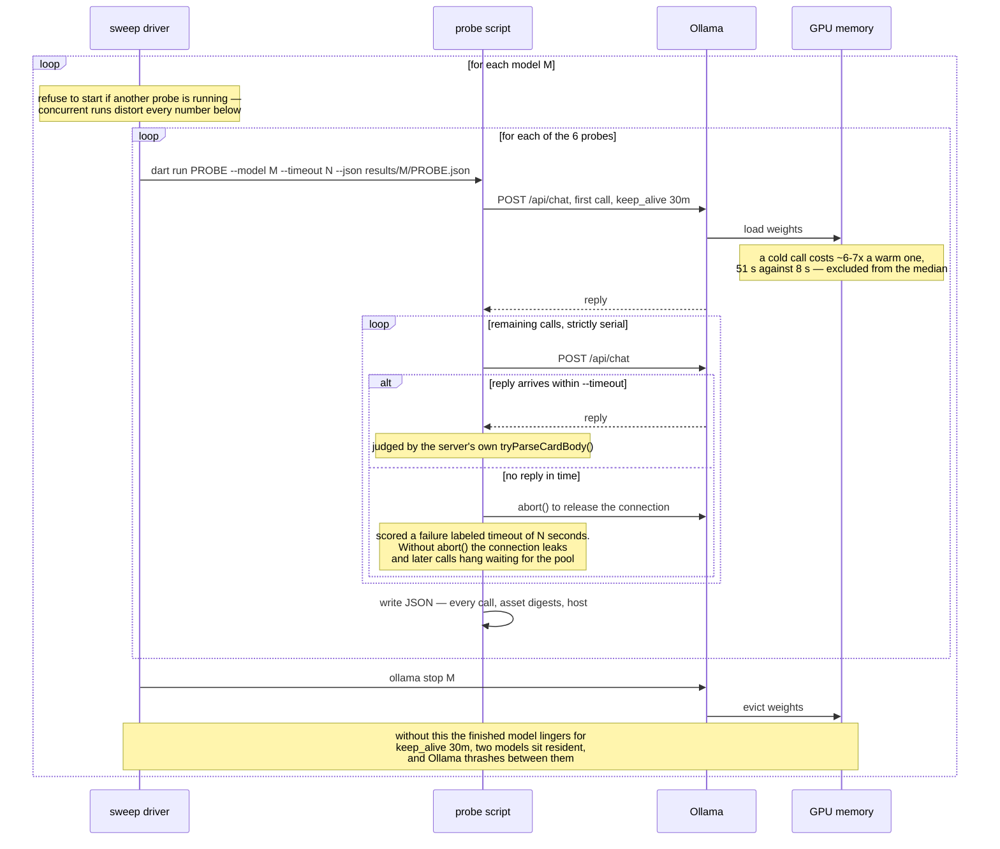

# Model behavior

Which local Ollama models produce renderable Adaptive Cards, what decoding settings they need, and what has already been measured about each.

## Scope: none of this was required to ship the demo

`adaptive_chat_server_dart` is the backend for an **SDUI demo**. The demo works without a single number in this file — pick a model, point the server at it, and it answers in cards. No measurement here was a prerequisite for that, and nobody needs to read this file to run the thing.

It exists because the card path turned out to be an unusually **strict and discriminating test problem** for local models, and the results are worth more than the demo that produced them. Answering as an Adaptive Card demands strict JSON, a closed element vocabulary the model must not invent from, a shape chosen to fit the question, and format stability across a multi-turn conversation — four constraints most chat benchmarks do not apply at once, each with an unambiguous pass/fail. That combination separates models that ordinary prose benchmarks rank as equivalent: the clearest case in this file is a model that sweeps every easy set and produces a correct element type on **1 of 25** shape cases.

So read this as a **lab notebook, not a requirement**. Its findings are about the models, and should transfer to any workload that asks a local model for constrained, schema-shaped JSON — the demo is the instrument, not the subject. What that also means: nothing here is a supported product surface. The probes are hand-run, the numbers age as models and prompts change, and none of it gates the demo working.

## Why this file exists

Every finding here was originally recorded in a plan or a design spec. Those documents are dated records — they describe what was true during one piece of work and are archived when it ends. The _results_ outlive them: knowing that a model ignores `format`, or that its own recommended temperature scores worse than `0`, stays useful long after the plan that discovered it is history.

So results get copied here. When a plan or spec produces a model finding, copy it into this file before the plan is archived. Cite the source so the full context is still findable.

Findings are not opinions. Each one below names the model, the setting, and the measurement, because the whole point of the probes in [`tool/model_probes/`](tool/model_probes/README.md) is that reasoning about model behavior without measuring it has already produced wrong answers here more than once.

## The models we care about most

The **top three** are whichever models `.vscode/launch.json` currently launches the server with — those are the ones someone can start from the debugger, so they are the ones worth keeping working.

This set is expected to change. When `launch.json` changes, the priority set changes with it, and this section is describing a pointer rather than a fixed list. Re-derive it rather than trusting the names below:

```bash
grep -A1 '"--ollama-model"' ../.vscode/launch.json |
  grep -v -e 'ollama-model' -e '^--$' | tr -d ' ",' | sort -u
```

At the time of writing that yields `granite4.1:8b`, `qwen2.5-coder:7b`, and `qwen3.8:27b-nvfp4`. If you find that stale, the grep is right and this paragraph is wrong.

`qwen2.5-coder:7b` is additionally the server's compiled-in default (`defaultOllamaModel` in `lib/src/ollama_responder.dart`), which is a separate decision from what the debugger launches.

### Why these three, after the 25-case sweep

The set above is the outcome of the sweep, not a historical accident: `qwen3.5:9b` was swapped out for `granite4.1:8b` on 2026-08-19, and `gpt-oss:20b` for `qwen3.8:27b-nvfp4` on 2026-08-20. `launch.json` was edited to match each time.

Read on the shipped configuration, all fifteen candidates rank by with-history shape coverage — the [full table](#shape-coverage--all-fifteen-models-as-shipped) carries the cold-start and erosion figures behind these:

`qwen3.8:27b-nvfp4` 24/25 · `gpt-oss:20b` 23/25 · `qwen3-coder:30b` 23/25 · `qwen3.6:27b-coding-nvfp4` 23/25 · `hf.co/unsloth/Nemotron-3-Nano-30B-A3B-GGUF:latest` 22/25 · `granite4.1:8b` 21/25 · `nemotron-3-nano:30b` 21/25 · `nemotron-3.5-lightning:30b` 21/25 · `qwen3.5:9b` 19/25 · `qwen2.5-coder:7b` 18/25 · `llama3-groq-tool-use:8b` 17/25 · `nemotron-3-nano:4b` 17/25 · `llama3.2:latest` 15/25 · `granite4.1:3b` 12/25 · `llama3-chatqa:8b` 1/25.

**Among 16 GB-capable models the order is unchanged** — `granite4.1:8b` 21/25, then `qwen3.5:9b` 19/25 and `qwen2.5-coder:7b` 18/25 — so nothing here disturbs the two portable slots. `gpt-oss:20b` at 12.8 GB outranks all three and is the exception the 16 GB column exists to flag.

- **`gpt-oss:20b` — dropped 2026-08-20, replaced by `qwen3.8:27b-nvfp4`, and the full re-measurement complicates that call.** It scores 23/25 warm as shipped against `qwen3.8`'s 24/25, and it is the lightest large model at 12.8 GB. But the same sweep found it produces a correct shape on **all 25 cases unaided** — the only perfect score anywhere in this file, under any condition — while scoring 23/25 with the seed the server actually sends. It also **ignores `format` destructively**: `json` returns an empty body and `schema` returns prose, so a run that reaches for the constraint on it gets no cards at all (see [the canary section](#not-a-card-test-the-format-canary)). The swap is not obviously wrong, but the strongest unaided model in the file is no longer in `launch.json`, and that is worth revisiting rather than treating as settled.
- **`qwen3.8:27b-nvfp4` — added 2026-08-20.** The **highest as-shipped score in the file at 24/25 warm**, it erodes nothing under either condition, and it is one of only two models whose seed gain is zero or better while still scoring above 20 — it neither needs the seed nor is hurt by it. It ignores `format` harmlessly (byte-identical good cards under all three modes). Its costs are 16.9 GB, a middling 9/10 stress of which **4 of 10 passes are prose**, and a `rating_ask` failure it shares with ten other models.
- **`granite4.1:8b` — kept.** 21/25 with history, the best 16 GB-capable model, in 5.0 GB. It honors `format`, and the seed is worth +6 to it (15/25 → 21/25). One caveat the pass counts used to hide: its perfect 10/10 stress score is **4 cards to 6 prose**, so it clears that set largely by answering in Markdown.
- **`qwen2.5-coder:7b` — kept.** Not the strongest (18/25 warm, tenth), but it is the compiled-in default, the model every promotion decision in this file is gated on, and the smallest at 4.4 GB. It has one distinction nothing else in the file matches: **10/10 stress and 21/21 everyday, with every stress pass an actual card**. It is the most card-committed model measured, which is a better argument for the default than the size that originally won it the slot.
- **`qwen3.5:9b` — dropped, though the 2026-08-20 re-measurement narrows the gap.** It scores **19/25 with history against `qwen2.5-coder:7b`'s 18/25** — no longer the exact tie the original decision rested on — and posts the same 10/10 all-cards stress result. Against it: 6.1 GB versus 4.4 GB, **6.9 s/call versus 2.3 s** (third-slowest model measured), and a thinking mode that has to be disabled to be usable at all (see its [per-model section](#qwen359b)). One shape does not outweigh three times the latency, so the decision stands — but on cost now rather than on a tie.

**Is `nemotron-3.5-lightning:30b` the better large model? No.** It scores 21/25 warm against `qwen3.8:27b-nvfp4`'s 24/25, for 23.7 GB against 16.9 — more weight for less coverage. Its seed dependence is the deciding factor: **13/25 unaided**, a +8 gain, so most of its score comes from a fixed two-turn prefix rather than from the model.

The one thing it is genuinely best at is being the **regression canary for the seed mechanism itself**: an +8 swing is among the largest in the table, so if `--seed-card` ever silently stops working, this model shows it early and loudly. That is a reason to keep probing it, not a reason to launch it.

**Is `qwen3-coder:30b` the better large model? It is the most interesting case in the file.** On the axes this document says to read first it is mid-pack — 23/25 warm, tied with two others — and its seed dependence is severe: **14/25 unaided, a +9 gain**, the second-largest measured. That was the basis on which it was previously rejected, and it reproduces exactly.

What the 2026-08-20 sweep adds is that it is the only model to answer **both** cold-start sets entirely in cards: 20/21 everyday and 10/10 stress, zero prose in either. It honors `format`, which neither `nvfp4` build does. And at **1.6 s/call it is the fastest model measured here**, ahead of models a quarter its weight. A model that is fast, `format`-honoring, and never falls back to Markdown is a different proposition from what the earlier rejection described — the rejection was correct on the evidence available then, and the evidence has changed. Its seed dependence is still the case against it.

**`qwen3.6:27b-coding-nvfp4` was the first challenger to survive the seed test, and it is why the slot eventually moved — though not to it.** It reproduces its published figures **exactly** (23/25 cold, 23/25 warm, 24/25 unaided), the only model in the file to do so on all three, which makes it the most reliably-measured entry here. It erodes nothing under either condition.

Against it: **18.4 GB for 23/25**, against a lighter sibling at 24/25; a stress score of **8/10**, the measurement its case was previously stuck waiting on and the weakest of the four strong large models; and it silently ignores `format`. The gap it was waiting to close closed against it.

**`launch.json` was changed on 2026-08-20: `gpt-oss:20b` out, `qwen3.8:27b-nvfp4` in.** Both the card-prompt and Markdown-prompt configurations were swapped, along with the two compounds that launch them, so the grep at the top of this section still yields exactly three models.

The decision rested on `qwen3.8:27b-nvfp4` leading the figure this file says to read first — 24/25 as shipped, the highest here — and on it neither needing the seed nor being hurt by it. The cost is **4.1 GB**, the one axis `gpt-oss:20b` still wins.

**The full re-measurement on 2026-08-20 gives one reason to revisit it.** `gpt-oss:20b` turns out to produce a correct shape on **all 25 cases unaided**, the only perfect score in this file under any condition, while scoring 23/25 with the seed the server sends. So the outgoing model is the strongest of all on the unaided axis and is being held back by a mechanism applied unconditionally. That does not automatically reverse the swap — 23/25 is what a user actually gets today — but it makes "should the seed be conditional?" a live question rather than a footnote, and `gpt-oss:20b` is the model that would answer it.

Two caveats on all of the above. Everyday and stress figures are `--samples 1`, and shape figures `--samples 2`, so a one-shape difference between two models is noise rather than a ranking — the re-measurement moved ten of twelve steady models by ±1 without anything about them changing. And `granite4.1:3b`'s numbers are not comparable with its earlier ones at all; see [the timeout note](#a-note-on-the-per-call-timeout).

## Candidate models

Chat models worth probing when they happen to be installed. Check availability before assuming a result applies — the command lists everything Ollama has, so embedding models (`nomic-embed-text`, and anything else that cannot hold a conversation) will show up there and are deliberately absent from the table below:

```bash
curl -s http://127.0.0.1:11434/api/tags | python3 -c "import sys,json;[print(m['name']) for m in json.load(sys.stdin)['models']]"
```

**Role** says why the model is on the list. **Cold start** and **With history** are the short version of the [per-model results](#per-model-results) below — `—` means nobody has probed that condition yet, which is an invitation, not a judgement.

**16 GB** is a _portability_ signal, not a limit on what can be tested here. It answers "would this model run for someone on a 16 GB Mac or a 16 GB GPU?", which matters for what the server can reasonably recommend as a default. The current development machine is a **64 GB M1**, where every model in this table runs comfortably on its own — including the ❌ rows. A ❌ means "do not make this the recommended default", not "cannot be probed".

Sorted by model name, and within a family by parameter count ascending (so `nemotron-3-nano:4b` precedes `:30b`), which makes a tag quick to find. Role and verdict, not position, carry the meaning.

| Model                                             | Weights | 16 GB | Role                   | Cold start                                                  | With history        |
| ------------------------------------------------- | ------- | ----- | ---------------------- | ----------------------------------------------------------- | ------------------- |
| gpt-oss:20b                                       | 12.8 GB | ❌    | candidate              | ✅ everyday 19/21 · stress 9/10 · **breaks on `format`**    | ✅ shapes **23/25** |
| granite4.1:3b                                     | 2.0 GB  | ✅    | candidate              | ❌ everyday 16/21 · stress 7/10 · 46 stalls                 | ❌ shapes **12/25** |
| granite4.1:8b                                     | 5.0 GB  | ✅    | top 3 (`launch.json`)  | ✅ everyday 19/21 · stress 10/10 but 6 prose                | ✅ shapes **21/25** |
| hf.co/unsloth/Nemotron-3-Nano-30B-A3B-GGUF:latest | 22.9 GB | ❌    | candidate              | ⚠️ everyday 15/21 · stress 5/10                             | ✅ shapes **22/25** |
| llama3-chatqa:8b                                  | 4.3 GB  | ✅    | candidate              | ❌ everyday 21/21, stress 10/10 — **all prose, 0 cards**    | ❌ shapes **1/25**  |
| llama3-groq-tool-use:8b                           | 4.3 GB  | ✅    | candidate              | ⚠️ everyday 18/21 · stress 7/10                             | ⚠️ shapes **17/25** |
| llama3.2:latest                                   | 1.9 GB  | ✅    | candidate              | ⚠️ everyday 19/21 · stress 7/10 — retired as default        | ⚠️ shapes **15/25** |
| nemotron-3-nano:4b                                | 2.6 GB  | ✅    | candidate              | ⚠️ everyday 17/21 · stress 5/10                             | ⚠️ shapes **17/25** |
| nemotron-3-nano:30b                               | 22.6 GB | ❌    | candidate              | ⚠️ everyday 18/21 · stress 6/10                             | ✅ shapes **21/25** |
| nemotron-3.5-lightning:30b                        | 23.7 GB | ❌    | candidate              | ✅ everyday 18/21 · stress 9/10                             | ✅ shapes **21/25** |
| qwen2.5-coder:7b                                  | 4.4 GB  | ✅    | server default + top 3 | ✅ everyday 21/21 · stress 10/10, all cards                 | ⚠️ shapes **18/25** |
| qwen3-coder:30b                                   | 17.3 GB | ❌    | candidate              | ✅ everyday 20/21 · stress 10/10 — **all cards, both sets** | ✅ shapes **23/25** |
| qwen3.5:9b                                        | 6.1 GB  | ⚠️    | candidate              | ✅ everyday 19/21 · stress 10/10, all cards                 | ⚠️ shapes **19/25** |
| qwen3.6:27b-coding-nvfp4                          | 18.4 GB | ❌    | candidate              | ⚠️ everyday 21/21 · stress 8/10 · ignores `format`          | ✅ shapes **23/25** |
| qwen3.8:27b-nvfp4                                 | 16.9 GB | ❌    | top 3 (`launch.json`)  | ✅ everyday 20/21 · stress 9/10 · ignores `format`          | ✅ shapes **24/25** |

**Cold start** is a single-turn probe. **With history** replays prior conversation turns the way the server actually does. These are different measurements and a model can pass one while failing the other — every result recorded before 2026-08-14 is a cold-start number, because no probe sent history at all.

**Read the `shapes N/25` figure first.** It is the model's with-history score **as the server ships today** — all 25 shapes, `t=0`, `--samples 2`, measured with the unconditional card seed in place (`--seed-card`, promoted 2026-08-18) — so it describes what a user actually gets. Every model carries one, all measured under identical conditions — see [the full table](#shape-coverage--all-fifteen-models-as-shipped) for cold-start, seed-dependence, and per-model erosion. The ✅/⚠️/❌ is set from this figure (✅ ≥ 20/25, ⚠️ 10-19, ❌ < 10).

**Cascade** is a different question and a much smaller one: can a follow-up
turn edit the card the model just sent — widen a pick-one list to multi-select
without losing its items? Fourteen of fifteen score `3/3`, so it separates no
two usable models; it is carried as a column because "we checked, and it works
wherever a card gets produced" is a fact worth being able to see. `n/a` means
the model never produced a first card to edit, so the cascade was never
exercised — not that it cascaded badly. See
[the cascade section](#cascade--editing-the-card-the-model-just-sent).

The **16 GB** column is not a gate on what gets probed — it records what a constrained host could run. Probing a ❌ model on the 64 GB development machine is expected and useful; it is how this matrix gets filled in. What the column governs is what the server should _recommend_ as a default, since a default that only runs on a 64 GB box is not much of a default.

## Which system prompt produced the number

Every result in this file was measured with **`assets/card_system_prompt.txt`**. The server has no default prompt — every run names one with `--system-prompt-file` (or opts out of models entirely with `--echo`).

| File                               | Effect                                        |
| ---------------------------------- | --------------------------------------------- |
| `assets/card_system_prompt.txt`    | The card palette and rules                    |
| `assets/default_system_prompt.txt` | Markdown only — never mentions Adaptive Cards |

Measured on `qwen2.5-coder:7b` at `t=0`, same eight questions, only the prompt file differing: **0/8 cards** with the Markdown prompt, **8/8** with the card prompt. The gap between the two is the largest single effect recorded in this file — larger than any model or temperature difference — which is why the server stopped having a default at all on 2026-08-15 and now makes every run say which prompt it wants.

Its name is misleading: `default_system_prompt.txt` is not a default and never gets loaded unless you ask for it by name. It keeps the name because renaming an asset breaks every `--system-prompt-file` invocation already written down in docs, launch configs, and shell history.

When reading a bug report, still confirm which prompt was loaded — the server logs it at startup. "The model never sends cards" now means someone named the Markdown prompt, or is running a build from before 2026-08-15, when the prompt could be implicit.

Full result, `qwen2.5-coder:7b` at `t=0`, eight options questions, only the
prompt file differing: **0/8 cards / 8/8 prose** on the default prompt versus
**8/8 cards / 0/8 prose** on the card prompt, with zero broken cards either
way. Six of the eight card-prompt replies contained a real `Input.ChoiceSet`;
the other two chose a `FactSet` and a `TextBlock`, which are defensible for
those questions.

## The card test classes

Every score below is "n out of m" against one of three sets. The sets are not interchangeable and quoting a number without naming its set is how a model gets called good when it is not — a model has scored **7/7 on the everyday set while failing half the stress set**.

### 1. Everyday set — `temperature_matrix.dart`

Seven ordinary requests, one per common reply shape: a date+time ask (`Input.Date`), a size choice (`Input.ChoiceSet`), labelled specs (`FactSet`), a 4-row table, a 5-slice chart, a 1–5 rating, and a two-sentence prose answer. Run across three temperatures (`0`, `0.2`, `0.6`).

Use it to answer **"is this model usable at all?"** It is a smoke test. Any model being considered should pass it, and passing it proves very little — this is the set that does not discriminate.

### 2. Stress set — `temperature_stress.dart`

Five requests chosen because they are the ones that actually break, run at `t=0` and `t=0.6`:

| Case        | What it stresses                                                         |
| ----------- | ------------------------------------------------------------------------ |
| `codeblock` | Code plus an explanation — the shape that tempts a model to append prose |
| `bigtable`  | A 12-month table — long generation, where truncation shows up            |
| `nested`    | A full form: title, date, amount, 6-choice dropdown, notes, buttons      |
| `multiline` | Escaped `\n` and quoted text inside strings — the invalid-JSON classic   |
| `mixed`     | A table **then** a choice set — two structures in one reply              |

Use it to answer **"which model or setting should we ship?"** This is the set that separates candidates, and the one to re-run after any prompt change. It also counts distinct outputs per cell, which is how "temperature 0 is deterministic" was disproved.

### 3. Prompt A/B set — `prompt_ab.dart`

Eight code-flavoured prompts run against **two prompt files** — the shipped `card_system_prompt.txt` and an edited candidate — printing both pass rates.

Use it to answer **"did my wording change actually help?"** It is the only set that compares prompts rather than models, and it exists because a wording change that fixes the one case you were looking at can quietly break three others.

### 4. Multi-turn set — history replay

The server replays prior turns on every request (`OllamaResponder.reply()`), but sets 1–3 all send a **single turn**. That gap hid a whole failure class until 2026-08-14.

Measured on `qwen2.5-coder:7b` at `t=0`, asking "what are my options for deployment targets":

| History before the question | Result                           |
| --------------------------- | -------------------------------- |
| none                        | `card[2]` — an `Input.ChoiceSet` |
| 1 prose turn                | prose — 867 chars of Markdown    |
| 2 prose turns               | prose — 903 chars of Markdown    |

One prose turn is enough. Once a conversation is flowing in Markdown the model treats that as the established format. Two consequences worth internalising:

- **A cold-start pass proves less than it looks.** Reproduce with history before concluding a bug is fixed, and say which condition a number came from.
- **"Renderable prose" is not always a pass.** For an options question a tidy Markdown list renders perfectly and still fails the user, because it cannot be clicked. `shape_ab.dart` is the only probe that catches this — it requires the element type that answers the question, not merely a reply that parses.

Two changes were made in response, both still shipped. The card system prompt's escape hatch was re-keyed from _confidence_ ("if you are unsure whether a card helps") to _capability_ ("if no element type fits"), which is why it reads the way it does today. And the model's context now opens with a card-shaped exchange — see the seed below, which is what actually closed most of the gap.

#### Shape coverage — all fifteen models, as shipped

`shape_ab.dart` asks the narrow question the other probes cannot: for each of 25 cases, did the model emit an element type that actually answers it? It runs every case twice — cold-start and after two prose turns — and the difference is the shapes a model loses once a conversation has gone to Markdown.

**This is the current, as-shipped picture**, and the only model comparison in this file that is: all 25 cases, `t=0`, `--samples 2`, both conditions, with the unconditional card seed in place. Six models were measured 2026-08-18, eight more 2026-08-19, and `qwen3.8:27b-nvfp4` on 2026-08-20, all under identical conditions. Sorted by with-history coverage, which is what a user actually experiences.

| Model                                               | Weights | Cold-start | With history | Warm, pre-seed | Cascade | Eroded by history                    |
| --------------------------------------------------- | ------- | ---------- | ------------ | -------------- | ------- | ------------------------------------ |
| `qwen3.8:27b-nvfp4`                                 | 16.9 GB | **24/25**  | **24/25**    | 24/25          | 3/3     | none                                 |
| `qwen3-coder:30b`                                   | 17.3 GB | **24/25**  | 23/25        | 14/25          | 3/3     | `rating_ask`, `time` (2)             |
| `gpt-oss:20b`                                       | 12.8 GB | 23/25      | 23/25        | **25/25**      | 3/3     | `number`, `time` (2)                 |
| `qwen3.6:27b-coding-nvfp4`                          | 18.4 GB | 23/25      | 23/25        | 24/25          | 3/3     | none                                 |
| `hf.co/unsloth/Nemotron-3-Nano-30B-A3B-GGUF:latest` | 22.9 GB | 21/25      | 22/25        | 16/25          | 3/3     | none                                 |
| `granite4.1:8b`                                     | 5.0 GB  | 23/25      | 21/25        | 15/25          | 3/3     | `carousel`, `codeblock`, `table` (3) |
| `nemotron-3-nano:30b`                               | 22.6 GB | 22/25      | 21/25        | 16/25          | 3/3     | `carousel`, `text` (2)               |
| `nemotron-3.5-lightning:30b`                        | 23.7 GB | 20/25      | 21/25        | 13/25          | 3/3     | `table` (1)                          |
| `qwen3.5:9b`                                        | 6.1 GB  | 20/25      | 19/25        | 17/25          | 3/3     | `badge` (1)                          |
| `qwen2.5-coder:7b`                                  | 4.4 GB  | 20/25      | 18/25        | 18/25          | 3/3     | `choice2`, `table` (2)               |
| `nemotron-3-nano:4b`                                | 2.6 GB  | 19/25      | 17/25        | 7/25           | 3/3     | `carousel`, `gauge` (2)              |
| `llama3-groq-tool-use:8b`                           | 4.3 GB  | 18/25      | 17/25        | 9/25           | 3/3     | `date`, `progress`, `toggle` (3)     |
| `granite4.1:3b`                                     | 2.0 GB  | 17/25      | 17/25        | 9/25           | 3/3     | `choice4`, `number`, `text` (3)      |
| `llama3.2:latest`                                   | 1.9 GB  | 15/25      | 15/25        | 12/25          | 3/3     | `facts` (1)                          |
| `llama3-chatqa:8b`                                  | 4.3 GB  | 4/25       | 1/25         | 3/25           | n/a     | `columnset`, `gauge`, `progress` (3) |

**Warm, pre-seed** is the same measurement without the card seed, and it is the model's seed-dependence — the single most useful column here after the score itself, because a model that scores well only with the seed is being held up rather than being robust. That distinction is what the [top-three rationale](#why-these-three-after-the-25-case-sweep) turns on. All fifteen are now measured; the gain runs from **+10** to **−2**:

| Gain from the seed | Models                                                                                                                        |
| ------------------ | ----------------------------------------------------------------------------------------------------------------------------- |
| +8 to +10          | `nemotron-3-nano:4b` (+10), `qwen3-coder:30b` (+9), `llama3-groq-tool-use:8b` (+8), `nemotron-3.5-lightning:30b` (+8)         |
| +5 to +6           | `granite4.1:8b` (+6), `hf.co/unsloth/…` (+6), `nemotron-3-nano:30b` (+5)                                                      |
| +2 to +3           | `granite4.1:3b` (+3), `llama3.2:latest` (+3), `qwen3.5:9b` (+2)                                                               |
| zero or negative   | `qwen2.5-coder:7b` (0), `qwen3.8:27b-nvfp4` (0), `qwen3.6:27b-coding-nvfp4` (−1), `gpt-oss:20b` (−2), `llama3-chatqa:8b` (−2) |

Two readings follow, and they point opposite ways. **The seed earns its keep on the models that need it most**: `nemotron-3-nano:4b` is unusable without it (7/25) and ordinary with it (17/25), and the whole +8-and-above group gains most of its score from a fixed two-turn prefix. **But the models that need it least are the best models on the unaided axis** — `gpt-oss:20b` at **25/25**, then `qwen3.8:27b-nvfp4` and `qwen3.6:27b-coding-nvfp4` at 24/25 — so a high seeded score is not evidence of a good model until this column is read beside it. Five of the fifteen sit at zero or below.

**`gpt-oss:20b` is now the sharpest case against the seed's unconditional application.** It is the only model to produce a correct shape on **all 25 cases** under any condition, and it does it _without_ the seed, after two prose turns — the hardest condition in this file. With the seed it scores 23/25. That is the largest negative gain measured (−2) on the model that needs help least, and it is the argument for making the seed conditional rather than unconditional if the server's default ever changes to a model of that class.

**Pre-seed erosion is concentrated in the choice cases.** Five of the eight models measured here lose `choice*` shapes to two prose turns without the seed — `hf.co/unsloth/…` loses five of the six — and those are exactly the cases that recover once a card sits in front of the history. This reproduces the original 2026-08-14 discovery at full scale and names what the seed is actually protecting: a pick-from-a-set question is the shape a drifting conversation loses first.

**What the seed repairs is JSON framing, not only shape choice.** `qwen3-coder:30b` is the clearest case: without the seed, 9 of its 11 with-history failures are `broken` — invalid JSON, the missing-array-brackets signature already on record for it — and four choice cases plus `date` erode that were fine cold. With the seed in front of history, all of that resolves. The seed is not merely establishing "answer with a card"; it is demonstrating a well-formed one, which is why re-tuning `assets/seed_card.json` is pinned by a test rather than left open.

**It is not free on a model that does not need it.** `qwen3.6:27b-coding-nvfp4` scores 24/25 with history unaided and 23/25 with the seed, `qwen3.8:27b-nvfp4` does the same, and `llama3-chatqa:8b` likewise loses a shape to it. `qwen3.8:27b-nvfp4` shows the cost slightly more sharply than a bare score does: unaided it erodes **nothing** across the 25 shapes, and with the seed in place it newly loses `table` to history — the same nested-shape erosion item 2 above records, reproduced on a model that had no need of the seed to begin with. Both losses are small enough to be call-to-call variance at `--samples 2` rather than a demonstrated harm, but the direction is consistent with the over-carding cost recorded below, and it is the reason the seed's unconditional application is worth revisiting if a strong-unaided model ever becomes the server default.

How to read the rest of it:

- **Weight class does not predict coverage — or speed.** `granite4.1:8b` at 5.0 GB scores 21/25, matching two models four times its size. Weight predicts runtime even less: `qwen3-coder:30b` at 17.3 GB is the **fastest** model measured (1.6 s/call) while `granite4.1:3b` at 2.0 GB is the slowest sweep in the file — see [Performance on this machine](#performance-on-this-machine).
- **Cold start does not predict with-history, in either direction.** `granite4.1:3b` drops five shapes warm while `hf.co/unsloth/…` and `nemotron-3.5-lightning:30b` each gain one. Two models erode nothing at all. Judge on the with-history column.
- **`llama3-chatqa:8b` is why this probe exists.** It sweeps the everyday and stress sets — 21/21 and 10/10 on 2026-08-20 — and produces a correct shape on 1 of 25 cases. Since the stress set began splitting cards from prose, it no longer takes a 100-call shape run to see why: its perfect stress score is **0 cards and 10 prose**, and its everyday sweep is 2 cards to 19 prose. The cheap probe now catches what only the expensive one could.
- **Failure is concentrated in nested shapes.** `carousel` (8 of 15 models) and `table` (6) account for most of what models never produce under either condition, almost always as invalid JSON rather than a wrong choice of element. No model measured is free of permanent misses: even `qwen3.8:27b-nvfp4` at 24/25 fails `rating_ask` under both conditions.
- **`rating_ask` is the most-failed case in the file.** **Eleven of the fifteen** answer "ask me to rate this" with a read-only `Rating` display instead of an `Input.*` — the same show-versus-collect substitution, under both conditions, across unrelated model families. A failure that uniform is a prompt problem, and it is the clearest remaining lever in `assets/card_system_prompt.txt`. The next most-missed cases are `carousel` (8/15), `text` (7/15), then `time` and `table` (6/15).
- **`gauge` and `progress` never cross-contaminate**, on any model, despite sharing the "72%" wording.

#### Performance on this machine

All timings are one host — **Apple M1 Max / 64 GB**, the machine every measurement in this file was taken on. Latency is a property of the model _and_ the box, so each recorded run stamps the host into its result file; a figure that cannot name its machine does not belong here.

**Median s/call** is over the fixed 25-case shape sweep, so the case mix cancels and models are comparable. It excludes the first call after a model load, which costs roughly **6-7x** a warm one, and it excludes stalled calls, which measure the ceiling rather than the model. **Full sweep** is every probe for that model, stalls included — that is real wall clock somebody waited.

A second full run is deliberately _not_ taken. Min-of-two is the usual noise filter, but the dominant noise here is the known load event rather than jitter, and on a laptop the second run is measured on a hotter, throttling machine, so min-of-two would trade one uncontrolled bias for another.

| Model                                               | Weights | Median s/call | Full sweep | Stalls |
| --------------------------------------------------- | ------- | ------------- | ---------- | ------ |
| `llama3-chatqa:8b`                                  | 4.3 GB  | 0.3 s         | 3 min      | 0      |
| `granite4.1:3b`                                     | 2.0 GB  | 1.1 s         | 34 min     | 13     |
| `llama3.2:latest`                                   | 1.9 GB  | 1.4 s         | 12 min     | 2      |
| `qwen3-coder:30b`                                   | 17.3 GB | 1.6 s         | 10 min     | 0      |
| `llama3-groq-tool-use:8b`                           | 4.3 GB  | 1.8 s         | 9 min      | 0      |
| `nemotron-3.5-lightning:30b`                        | 23.7 GB | 2.0 s         | 12 min     | 0      |
| `nemotron-3-nano:30b`                               | 22.6 GB | 2.2 s         | 11 min     | 0      |
| `qwen2.5-coder:7b`                                  | 4.4 GB  | 2.3 s         | 18 min     | 0      |
| `hf.co/unsloth/Nemotron-3-Nano-30B-A3B-GGUF:latest` | 22.9 GB | 2.3 s         | 15 min     | 2      |
| `nemotron-3-nano:4b`                                | 2.6 GB  | 2.6 s         | 18 min     | 1      |
| `granite4.1:8b`                                     | 5.0 GB  | 2.7 s         | 14 min     | 0      |
| `qwen3.8:27b-nvfp4`                                 | 16.9 GB | 4.4 s         | 39 min     | 0      |
| `qwen3.6:27b-coding-nvfp4`                          | 18.4 GB | 6.2 s         | 37 min     | 0      |
| `qwen3.5:9b`                                        | 6.1 GB  | 6.9 s         | 34 min     | 0      |
| `gpt-oss:20b`                                       | 12.8 GB | 7.3 s         | 48 min     | 1      |

**Weight does not predict speed, and the exceptions are not small.** `qwen3-coder:30b` at 17.3 GB is the fastest real card producer measured — 1.6 s/call, ahead of `qwen2.5-coder:7b` at a quarter its size — while `gpt-oss:20b` at 12.8 GB is the slowest at 7.3 s. `llama3-chatqa:8b` tops the table only because it answers in short prose; a model that never builds a card is quick for the wrong reason.

**Stalls, not token rate, decide how long a sweep takes.** `granite4.1:3b` is the second-smallest model here and takes 34 minutes against `qwen3-coder:30b`'s 10 at eight times the weight, because 13 of its calls sit in timeouts rather than generating. Budget a sweep by stall risk, not by gigabytes — and note that **all 13 are in the unaided condition**: seeded it stalls twice in 100 calls, unaided eleven times. Take the card seed away and it stops producing cards and starts rambling.

#### A note on the per-call timeout

Probes bound each call (`--timeout`, default 180 s; the 2026-08-20 sweep used 120 s for the shape and cascade sets) and score an over-run reply a failure labeled `timeout (Ns)`. Before that bound existed, a runaway generation could hang an entire multi-model sweep: `granite4.1:3b` was observed generating for **16 minutes** on one `table` case without returning.

The bound changes what one figure means, and only for `granite4.1:3b` unaided:

| `granite4.1:3b`, warm | Unbounded (≤2026-08-19) | 120 s ceiling |
| --------------------- | ----------------------- | ------------- |
| Seeded                | 17/25                   | 17/25         |
| Unaided               | 13/25                   | **9/25**      |

Seeded, the ceiling costs it nothing — it stalls twice in 100 calls and scores exactly what it scored unbounded. Unaided it stalls eleven times and loses four shapes, because without a card in front of the history it answers at length in prose instead of emitting one. That is a real property of the model under that condition, not an artifact: the stalls reproduce on an idle machine with nothing else resident.

The ceiling is kept because the server has no timeout of its own — a real user simply waits — so a card nobody waits for has failed in practice. Nine of fifteen models recorded zero stalls and no other model recorded more than two, so this caveat applies to one row of one column.

**A caution learned the hard way.** The first version of this sweep reported `granite4.1:3b` at 12/25 seeded and `n/a` on cascade, and both figures were wrong — a leaked Ollama runner process was competing for the GPU (see [the sweep diagram](#the-sweep-and-why-the-unload-step-is-load-bearing)). A stalling measurement looks identical whether the model is slow or the machine is busy. Before concluding that a model stalls, check `ollama ps` for anything resident that should not be, and re-run on an idle machine.

#### The card seed, and what it costs

`OllamaResponder.reply()` prepends a synthetic card-shaped exchange — a short pick-from-a-set question and a bare card reply — ahead of the trimmed history on **every** request, so a card is the conversation's established format before any prose accumulates. Assembled order: system prompt, seed user turn, seed assistant turn, trimmed history, current user turn. There is no flag to disable it. The exchange lives in `assets/seed_card.json` and is read per request; `shape_ab.dart` reads the same asset and seeds by default, so a probe measures what the server sends.

It is the only mechanism that worked. Three prompt edits and one message-assembly alternative were screened against the drift alongside it and all four failed — restating the shape rule last, guarding the Markdown section's heading, narrowing the escape-hatch wording, and injecting a per-turn `system` reminder after the history. **Do not retry them**, and note the general shape of that result: changing _where the model's context starts_ moved behavior; changing _what the system prompt says_ did not, in either direction that mattered. (The per-turn reminder is additionally unmeasurable on some models — Ollama chat templates vary in whether a second `system` message placed after the history reaches the model at all, so a null result there means nothing.)

Four costs come with it and must not be read past:

1. **It costs tokens on every request, permanently.** This is few-shot priming prepended to each call, not one-time setup, and it counts toward `num_ctx` fill every time. Token cost was never measured directly; wall-clock across two runs showed the seed _faster_, which is uncontrolled and should be read as "not observed to be slower" rather than as evidence the tokens are free.
2. **`table` newly erodes with history on four of the six models it was A/B'd on.** The seed buys cold-start capability on nested shapes and then loses some of it warm.
3. **It over-cards the negative control.** A plain question that wants prose comes back as a card cold-start on five of fifteen models. Confirmed causal, not incidental, by re-running the single case both ways on `granite4.1:3b`: `--no-seed-card` passes it, the seed fails it. It costs at most 1/25 on any model's score, but it is the seed's one visible harm.
4. **It has never been measured above `t=0`.** Every shape run is greedy. `defaultCardTemperature` is `0.0` so an unconfigured server never leaves `t=0`, but this file records prompt fixes that held at `t=0` and failed at `t=0.6`, so the one is not a proxy for the other. Neither standing regression gate can cover this: `temperature_stress.dart` and `prompt_ab.dart` both send a single user turn and no seed history, so running them against the seed measures a file it never touches.

#### Cascade — editing the card the model just sent

The probes above all score one reply. A conversation does not work that way:
the server stores a card reply's raw JSON as `replyText` and replays it
verbatim, so a follow-up turn arrives with the previous card literally in
context. `cascade_ab.dart` scores that — turn 1 asks for a pick-one list, turn
2 asks to widen it to multi-select while referring back ("more than one of
_those_") rather than restating the items. A pass needs the turn-2
`Input.ChoiceSet` to be `isMultiSelect: true` **and** to keep every choice turn
1 offered.

All fifteen models, as the server ships (seed on), `t=0`, `--samples 2`, three
cases each:

| Result  | Models                                                 |
| ------- | ------------------------------------------------------ |
| **3/3** | Every model except the one below — fourteen of fifteen |
| `n/a`   | `llama3-chatqa:8b` — turn 1 produced no card to edit   |

**This axis does not discriminate, and that is the finding.** Every model that
produces a card at all cascades correctly: flips `isMultiSelect`, keeps 100% of
the turn-1 choices, and renames the input sensibly (`state` → `states`). That
includes the weakest card producers in the table — `llama3.2:latest` (15/25
shapes), `llama3-groq-tool-use:8b` and `nemotron-3-nano:4b` (17/25) all score
3/3, and so does `granite4.1:3b` (17/25), the weakest model that produces
cards at all. The sole exception never produced a first card to edit, so it
fails at turn 1 rather than at the cascade.

So **cascade ability is gated entirely on turn-1 card production**, which the
shape table already measures. It is deliberately _not_ a column here: a column
reading `3/3` fourteen times would take space in the matrix without separating
any two models. The probe earns its place as a regression check — if a prompt
or seed change ever breaks follow-up editing, nothing else in this directory
would notice.

Two caveats on the numbers:

- **A contents-loss failure was observed once and did not reproduce.** During
  development `nemotron-3-nano:4b` returned five states on turn 1 and three on
  turn 2 — the exact silent-drop failure the probe's third pass condition
  exists to catch. At `--samples 2` it scored 3/3 with all five retained. The
  condition is kept because the failure is real and invisible to every other
  probe here, not because this sweep reproduced it.
- **Model knowledge is not shape knowledge.** The `states` case asks for the
  top five US states by population. `granite4.1:8b`, `gpt-oss:20b`, and
  `qwen3.6:27b-coding-nvfp4` answer California/Texas/Florida/New York/
  Pennsylvania, which is correct; `qwen2.5-coder:7b` — the server default —
  and several others substitute Illinois, which is sixth. The probe scores the
  cascade, not the facts, and passes both.

### Not a card test: the `format` canary

`json_format_probe.dart` asks a different question — does this model honor Ollama's `format` constraint at all? Some ignore it silently, with no error, which makes `--json-format json|schema` inert. Check it before trusting the constraint; it is a capability probe, not a quality score.

**Ignoring `format` is not one failure mode but two, and the worse one is on a top-three model.** Measured 2026-08-20:

| Model               | `format=none` | `format=json`       | `format=schema`   |
| ------------------- | ------------- | ------------------- | ----------------- |
| `qwen3.8:27b-nvfp4` | card, 444c    | card, 444c — same   | card, 444c — same |
| `gpt-oss:20b`       | card, 401c    | **empty reply, 0c** | prose, 94c        |

`qwen3.8:27b-nvfp4` ignores the constraint **harmlessly** — byte-identical valid cards under all three modes, so setting `--json-format` changes nothing. `gpt-oss:20b` ignores it **destructively**: `json` returns a zero-character body and `schema` returns non-card prose, so reaching for the constraint on the currently-shipped large model does not weaken card production, it eliminates it. "Ignored" in the table below covers both; check which kind before relying on a model's entry.

Note the probe scores all six of those calls `PASS`, because an empty reply is not a _broken card_ and the pass rule only fails broken cards. That is the judging rule working as designed for card quality and reading misleadingly here — the verdict line, not the PASS, is the output that matters for this probe.

### What counts as a pass

A reply passes if it renders as a card **or** as clean prose. The card system prompt explicitly permits a Markdown answer, so only a _broken_ card is a failure. Verdicts come from the server's own detection, not the probe's opinion — see [How results are produced](#how-results-are-produced).

## Per-model results

### `qwen2.5-coder:7b` — recommended default (16 GB Mac)

Cleared every documented card failure mode at `temperature 0`, including the two that defeated `llama3.2`: checkbox `isMultiSelect:true` and the nested-array Carousel. ~9 s/call, non-thinking, 4.7 GB. Coder-tuned models are unusually strong at strict JSON syntax, which is exactly where the card path fails.

Honors Ollama's `format` constraint, so `--json-format json|schema` is meaningful for it.

Trade-off: coder models are terser on the plain-prose reply path. `qwen2.5:7b` (plain instruct, ~4.7 GB) is the better all-rounder if conversational answers matter more than maximal JSON reliability.

Measured on the code-explanation failure (August 2026): hard cases 6/10 → 15/15 at `t=0` and 7/10 → 14/15 at `t=0.6` after the card system prompt gave explanations a home inside the card.

**It fences its card almost every time.** Across two independent
investigations on 2026-08-14, the model wrapped its JSON in a ` ```json `
fence in 7/7 and 9/9 replies respectively, despite the prompt forbidding
fences in two places. This is currently harmless — `_stripFence` recovers a
reply that is _only_ a fence — but the detector is carrying a load the prompt
claims it should not have to, and fence-stripping has regressed here before
(see `a13808b`). Anything that follows the closing fence defeats the
recovery, which is why "nothing after the closing fence" is the load-bearing
rule rather than "no fence".

**A negative result, recorded so it isn't retried.** A candidate paragraph
teaching the prompt that a two-part request ("compare A and B, then tell me
which you'd pick") is still one message was measured on `qwen2.5-coder:7b` at
`t=0`. It tied baseline 10/10 on the compare-and-comment set (already at
ceiling under the corrected `judgeReply`, so there was no headroom left to
demonstrate an improvement) and it did improve the stress set's `t=0.6`
"mixed" compare-then-choice-set case (9/10 → 10/10, `t=0` unchanged at
10/10). But the built-in code A/B regression check (`prompt_ab.dart
--samples 1`, `t=0`) caught a real, reproducible regression the
compare-and-comment set could not see: "what is a closure? show an example"
went from a passing plain-Markdown reply to `prose-with-card` (raw JSON shown
to the user), 8/8 → 7/8, confirmed deterministic by repeating that one prompt
3 times against both prompt versions (baseline 3/3 pass, candidate 0/3 pass).
Per the promote-only-if-better rule the wording was reverted, not shipped —
`assets/card_system_prompt.txt` is unchanged (see `CHANGELOG.md`,
"Measured, not promoted").

The escape-hatch re-key that _was_ promoted (see [§4](#4-multi-turn-set--history-replay))
ran the same two regression checks clean — stress 10/10 at both `t=0` and
`t=0.6`, and the code A/B set 8/8 including the exact closure prompt the
compare-and-comment candidate above regressed.

### Six models probed 2026-08-14 (everyday + stress, `--samples 1`)

Run sequentially, one model resident at a time, card system prompt, on the 64 GB M1.

| Model                   | Everyday `t=0` / `0.2` / `0.6` | Stress `t=0` | Stress `t=0.6` |
| ----------------------- | ------------------------------ | ------------ | -------------- |
| llama3-chatqa:8b        | 7/7 · 7/7 · 7/7                | 5/5          | 5/5            |
| gpt-oss:20b             | 6/7 · 5/7 · 6/7                | 5/5          | 4/5            |
| granite4.1:8b           | 6/7 · 6/7 · 5/7                | 5/5          | 4/5            |
| llama3-groq-tool-use:8b | 6/7 · 6/7 · 6/7                | 5/5          | **1/5**        |
| nemotron-3-nano:4b      | 6/7 · 6/7 · 6/7                | **2/5**      | **1/5**        |
| granite4.1:3b           | 4/7 · 4/7 · 5/7                | 4/5          | 3/5            |

Three things this run showed:

- **`llama3-chatqa:8b` swept everything** — 7/7 at all three temperatures and 5/5 stress at both. At 4.3 GB it is the strongest cheap candidate measured so far and deserves a closer look against the default — but see the 2026-08-17 shape-coverage finding in [§4](#4-multi-turn-set--history-replay): on the broader 25-shape probe this model produces a correct card shape on only 1/25 cases cold-start, so this recommendation should not be acted on without reading that first.
- **The everyday set kept its reputation for not discriminating.** `nemotron-3-nano:4b` and `llama3-groq-tool-use:8b` both scored 6/7 everyday, then collapsed to 2/5 and 1/5 on the cases that matter. Judging either on the easy set alone would have been badly wrong.
- **`gpt-oss:20b`, a top-three model, had never been probed at all.** It is respectable but not better than models a third its size, which is worth knowing before recommending it.

All of these are **cold-start** numbers at `--samples 1`. None has been run with conversation history, and a single sample at `t=0.6` is noisy — treat the two 1/5 results as a flag to re-run, not a settled verdict.

### Large candidate models probed 2026-08-16 (everyday + stress, `--samples 1`)

Run one model resident at a time, card system prompt, on the 64 GB M1. This
table is the large-model (17-24 GB) counterpart to the 2026-08-14 table
above — same methodology, different date, extend it as more of these get
probed.

| Model                                             | Everyday `t=0` / `0.2` / `0.6` | Stress `t=0` | Stress `t=0.6` |
| ------------------------------------------------- | ------------------------------ | ------------ | -------------- |
| hf.co/unsloth/Nemotron-3-Nano-30B-A3B-GGUF:latest | 7/7 · 7/7 · 6/7                | 3/5          | 3/5            |
| nemotron-3-nano:30b                               | 7/7 · 7/7 · 6/7                | 2/5          | 1/5            |
| nemotron-3.5-lightning:30b                        | 6/7 · 6/7 · 5/7                | 3/5          | 4/5            |
| qwen3-coder:30b                                   | 7/7 · 6/7 · 7/7                | 5/5          | 5/5            |

`hf.co/unsloth/Nemotron-3-Nano-30B-A3B-GGUF:latest` (22.9 GB) swept the
everyday set at `t=0`/`t=0.2` and only lost one case at `t=0.6` (a truncated
table — `Unexpected end of input`). The stress set is where it struggles:
3/5 at **both** temperatures, with `bigtable` and `mixed` failing at both
`t=0` and `t=0.6`. Those two failures share a pattern distinct from the
truncation above — an extra closing `]` after the last element (e.g.
`"wrap":true}]]}]`), as if the model occasionally double-wraps the final
item in an array. `codeblock`, `nested`, and `multiline` were clean at both
temperatures. Cold start alone would rank this model mid-pack — better than
`granite4.1:3b`, worse than the `llama3-chatqa:8b` / `gpt-oss:20b` /
`granite4.1:8b` tier — with the everyday set again failing to predict the
stress-set weakness, consistent with the 2026-08-14 finding above.

`nemotron-3-nano:30b` (22.6 GB) — the Ollama-library build, not the
`hf.co/unsloth` GGUF above — swept the everyday set identically: 7/7 at
`t=0`/`t=0.2`, and the same single `t=0.6` loss on the same case (`table`,
`Unexpected end of input` — a truncated response). The stress set is where
the two builds diverge: this one managed only 2/5 at `t=0` and 1/5 at
`t=0.6`, worse than the unsloth build's 3/5/3/5. The seven stress failures
do not reduce to one pattern. Two are outright truncation, with the parse
error landing exactly one character past the end of the response
(`bigtable` at `t=0`, `mixed` at `t=0.6`), both reported as `Unexpected end
of input`. A third (`nested` at `t=0.6`) also errors at the very last
character of a short, 171-character response, though the parser labels it
`Unexpected character` rather than `Unexpected end of input`. Three others
are mid-stream malformations inside otherwise-long, otherwise-plausible
responses — an extra closing bracket appears immediately before the comma
that starts the next sibling element (`nested` at `t=0`: `}] ,{`; `bigtable`
at `t=0.6`: `} },{`; `mixed` at `t=0` shows a similar bracket cluster ahead
of a comma, though less cleanly isolated than the other two). The seventh
(`codeblock` at `t=0.6`) is different again: the response opens with
`["TextBlock","text":...`, missing the `{"type":` wrapper on the first
array element entirely — a malformation none of the other six share.
`multiline` was the only stress case clean at both temperatures. Cold start
again fails to predict the with-history result below — and here it fails
in the opposite direction from the unsloth build (see there).

`nemotron-3.5-lightning:30b` (23.7 GB) is the weakest of the three large
candidates on the everyday set: 6/7 at `t=0`/`t=0.2` and 5/7 at `t=0.6`, one
notch below both `nemotron` 30B builds at every temperature. The `table`
case fails at all three temperatures (`Unexpected end of input`, a
truncated response), the only large candidate to lose it at `t=0` and
`t=0.2` as well as `t=0.6`; `t=0.6` adds a second loss on `date`, where the
response's second line switches to a Markdown checklist item
(`- [ ] 2025-01-18`) instead of continuing JSON, reported as `Unexpected
character (at line 2, character 1)`. The stress set inverts the ranking:
3/5 at `t=0` and 4/5 at `t=0.6`, the best stress result of the three large
candidates at either temperature. Of the three stress failures, two are
outright truncation reported as `Unexpected end of input` exactly one
character past the response's end (`bigtable` at both `t=0` and `t=0.6`);
the third (`nested` at `t=0`) is the same last-character variant already
seen in `nemotron-3-nano:30b`'s `nested`@`t=0.6` failure above — the parser
reports `Unexpected character` at the response's very last character rather
than past its end. `codeblock`, `multiline`, and `mixed` were clean at both
temperatures. So a weaker-than-both-siblings everyday score and a
better-than-both-siblings stress score, measured on the same model, land on
opposite sides of the large-candidate ranking — reinforcing rather than
resolving the everyday-set's-not-a-good-predictor finding above.

`qwen3-coder:30b` (17.3 GB, the smallest of the four large candidates by
weight) matches the two `nemotron` 30B builds' everyday total of 20/21
correct — 7/7 at `t=0` and `t=0.6`, with a single loss at `t=0.2` (`rating`,
`Unexpected character (at character 169)`: a `TextBlock` and an
`Input.ChoiceSet` concatenated on one line without the wrapping `[ ]`, the
same missing-array-brackets pattern documented in the with-history results
below) — and then posts a clean 5/5 stress sweep at both temperatures, a
result neither `nemotron` build reached (3/5 `t=0` and 3/5 `t=0.6` for the
unsloth GGUF, 2/5 `t=0` and 1/5 `t=0.6` for the Ollama-library build) and
the best large-candidate stress result on record — the only one of the four
large candidates to pass every stress case at both temperatures. Cold start
alone would rank it at or above every other large candidate.

### `qwen3.6:27b-coding-nvfp4`

**Scores worse at its own recommended temperature.** Its Modelfile ships `temperature 0.6`, but it passed 12/15 hard cases at `0` versus 9/15 at `0.6` — the extra failures being long card JSON truncated mid-generation. Both passed 7/7 easy cases, which is why the easy set alone is not a useful signal.

**Silently ignores `format`.** It answers the `format: json` canary with prose and no error, so `--json-format json|schema` is inert for it. Check the canary (`tool/model_probes/json_format_probe.dart`) before relying on the constraint.

**The seed does not help it, and it is the most reliably measured model here.** It scores 23/25 cold and 23/25 with history as the server ships, and 24/25 with history without the seed — a −1 seed gain. Re-measured in full on 2026-08-20 it reproduced **all three figures exactly**, the only model in the file to do so, which makes it the best evidence available that these numbers are stable at all. It erodes nothing under either condition, seeded or not.

**The stress set, the measurement its case was waiting on, came back 8/10 on 2026-08-20** — the weakest of the four strong large models, against 10/10 for `qwen3-coder:30b` and `qwen3.5:9b`. The gap it needed to close closed against it. Combined with 18.4 GB for a score its lighter sibling beats, the `launch.json` case that was once live is now closed: the slot went to `qwen3.8:27b-nvfp4` on 2026-08-20.

### `qwen3.8:27b-nvfp4`

Probed end-to-end on 2026-08-20 — every script in `tool/model_probes/`, one
model resident throughout, on the 64 GB M1. At **16.9 GB** it is the lightest
of the `27b`/`30b` class measured here and still a ❌ for a 16 GB host.

**It holds the large-model `launch.json` slot**, taken from `gpt-oss:20b` on
2026-08-20 on the strength of the numbers below — see
[the top-three rationale](#why-these-three-after-the-25-case-sweep) for the
comparison and its one cost, 4.1 GB.

**It sweeps both cold-start sets.** Everyday 7/7 at all three temperatures, and
stress **5/5 at `t=0` and 5/5 at `t=0.6`** — a clean sweep of the set that
exists to separate candidates, matched only by `qwen3-coder:30b`. Read that
number with the caveat the set carries: four of the ten stress cells passed as
_prose_ rather than as a card (`nested` and `multiline` at `t=0`, `bigtable`
and `nested` at `t=0.6`). Prose is a pass because the card prompt permits
Markdown, so 5/5 means "nothing broke", not "ten good cards" — the shape figures
below are the ones that assert an element type.

**Shapes, both conditions, both seed settings** (`--samples 2`, `t=0`):

| Condition    | Seeded (as shipped) | Unaided (`--no-seed-card`) |
| ------------ | ------------------- | -------------------------- |
| Cold-start   | **24/25**           | 23/25                      |
| With history | **23/25**           | **24/25**                  |
| Eroded       | `table` (1)         | none                       |

The 24/25 cold-start ties the best in this file (`gpt-oss:20b`,
`qwen3-coder:30b`), and the 24/25 unaided with-history ties the highest
with-history figure recorded under any configuration
(`qwen3.6:27b-coding-nvfp4`). Its seed gain is **−1**, making it one of only
three negative entries — see [the seed section](#the-card-seed-and-what-it-costs)
for why that is the column to read beside a score rather than after it.

**No nested-shape ceiling.** `Carousel` and `ColumnSet` pass on every sample
under all four conditions, and `Table` passes everywhere except one of two
seeded with-history samples, where it answered with a `TextBlock` instead.
That is the distinguishing result against its closest comparators:
`gpt-oss:20b` and `qwen3.6:27b-coding-nvfp4` both permanently miss `carousel`
and `columnset` as invalid JSON. It is **not** free of permanent misses
overall — `rating_ask` fails under both conditions, so `qwen3-coder:30b`
remains the only model in this file with no case it fails under both.

**Its only repeated failure is `rating_ask`**, on every sample under all four
conditions, with the same `Rating`-instead-of-`Input.*` substitution eight
other models make. Nothing model-specific: see the fleet-wide reading in
[the shape section](#shape-coverage--all-fifteen-models-as-shipped).

**Cascade 3/3**, keeping every choice on all three cases (5/5, 4/4, 2/2).

**Silently ignores `format`, exactly like `qwen3.6:27b-coding-nvfp4`.** The
canary comes back as prose with no error, and the card request returns
byte-identical output (444 chars, same shape) under `format=none`,
`format=json`, and `format=schema` — the constraint is not merely unhelpful, it
is inert. `--json-format json|schema` buys nothing here. Two `nvfp4` builds now
share this, so treat it as a family trait to check rather than a one-model
quirk.

**Latency**, warm, on the 64 GB M1: ~4-10 s for a typical card, ~20 s for a
4-row table, ~49 s for the 12-month `bigtable`. The first call after a load
cost 51 s; re-run before trusting a first-call number.

### `granite4.1:3b`

**The clearest case in this file of the seed doing real work.** Seeded it scores 17/25 both cold and with history and cascades 3/3, unchanged from its unbounded 2026-08-19 figures. Unaided it collapses to 9/25 — and, more tellingly, **stalls eleven times in 100 calls**, against twice with the seed. Without a card in front of the history it does not merely pick the wrong shape; it answers at length in prose until it hits the ceiling. That is what a +8 seed gain looks like from the inside.

It honors `format`, and 3 of its 7 stress passes are prose.

**Its first 2026-08-20 measurement was wrong, and the way it was wrong is worth knowing.** It was recorded as 12/25 seeded with `n/a` on cascade and 52 stalls, which read as a model falling apart under a timeout. A leaked Ollama runner was competing for the GPU throughout. Re-run on an idle machine it scores 17/25 and 3/3. See [the sweep diagram](#the-sweep-and-why-the-unload-step-is-load-bearing) — a busy machine and a slow model are indistinguishable from the probe's side.

### `qwen3.5:9b`

Usable **only with thinking disabled**, and even then offers no reliability edge over `qwen2.5-coder:7b` while costing more latency and memory. Its thinking capability is a liability for constrained-JSON output.

With server defaults of the time (temp 1, thinking on) it answered a checkbox request with a `CodeBlock` of raw HTML using invented keys (`codeLanguage`/`content` instead of `codeSnippet`), taking 77 s. The same model with `think:false` + `temperature:0` produced a clean `Input.ChoiceSet` and a clean 4-page Carousel in ~10 s.

On the shape set it scores **20/25 cold and 19/25 with history** (2026-08-20), one shape ahead of `qwen2.5-coder:7b` rather than the exact tie previously recorded — and it matches that model's 10/10 all-cards stress result. What keeps it out of `launch.json` is cost rather than coverage: 6.1 GB against 4.4, and **6.9 s/call against 2.3**, the third-slowest model measured. Probe runs send `think: false` unconditionally, so these are thinking-off figures.

Not recommended as the default for this workload, and no longer in `launch.json` — it was swapped out for `granite4.1:8b` on 2026-08-19.

### `llama3.2` (3.2B — the `llama3.2:latest` tag)

Retired as a default. Failed the shapes that matter: checkbox `isMultiSelect` 1/14, nested-array Carousel 0/5, table 1/4. FactSet and plain prose were reliable. The nested-array corruption family that motivated the duplicate-key guard reads as specific to this 3B model under hot sampling.

**Probed with history for the first time on 2026-08-19** and re-measured in full on 2026-08-20: **15/25 cold, 15/25 with history**, thirteenth of fifteen. It stays retired, but the retirement note above was written against a three-shape sample and reads harsher than the full picture — this is ordinary weakness, not the collapse `llama3-chatqa:8b`'s 1/25 represents. It answers 7/10 stress cases with actual cards and 19/21 everyday, so what it produces is usually a card; there are simply ten shapes it never gets right.

## Cross-model results

- **Decoding settings dominate model choice.** The single largest quality jump measured on this workload came from sending `temperature: 0` and `think: false`, not from changing model. A model that looks incapable at temp 1 with thinking on can be clean at temp 0.
- **Temperature 0 is not deterministic.** A ~3.5 K-character table produced two different outputs across three calls at `0`. Greedy decoding repeats short replies verbatim, but long generations still diverge. What `0` buys is a _stable failure mode_ — a card the model gets wrong at `0` is usually wrong the same way on retry, so a broken card never self-heals.
- **`format` support is per-model and silent when absent.** Some models ignore it with no error, and ignoring it is not one behavior but two — `qwen3.8:27b-nvfp4` returns the identical good card under `none`/`json`/`schema`, while `gpt-oss:20b` returns an empty body under `json` and prose under `schema`. `qwen2.5-coder:7b` honors it. Probe before relying on it, and note that a model can be strong on every card axis and still be wrecked by the constraint.
- **Redirect a behavior rather than forbidding it.** Asked to explain code, `qwen2.5-coder:7b` emitted a card and then appended the explanation, which makes the whole reply raw text. Telling it harder not to append did **not** help — it scored the same and abandoned cards entirely, answering every code question as prose. Telling it where the explanation _goes_ (a `TextBlock` beside the `CodeBlock`) fixed it.
- **Wording moves the failure rate; only the detector makes a shape safe.** Each prompt fix exposes the next failure — once the model sent two elements it began dropping the `[ ]` around them. Prompt wording cut that to near zero at `t=0` but not at `t=0.6`, so `card_detect.dart` repairs the bracketless form as well.
- **Suspect the harness before the model.** A reply blamed on the model contained zero real newlines and 11 correctly escaped ones — valid JSON, corrupted by this server's own fence-stripping heuristic. Dump the bytes before theorising.
- **A failed assertion is sometimes a bad assertion.** One model's "0/3" on tables was a valid, complete, renderable Table laid out as a 2×2 grid; the `rows >= 3` success criterion wrongly penalized a legitimate layout.
- **A second `system` message is not universally delivered.** Ollama chat
  templates vary in whether a `system` message placed _after_ the conversation
  history reaches the model at all; some keep only the first. Checked
  2026-08-18 on the four screening models (`choice1`, cold-start) by injecting
  an additive reminder — "every card you send must also include a Badge
  element with the text 'OK'" — and reading `shape_ab.dart`'s printed type
  list with and without `--reinforce`. **Delivered** on `gpt-oss:20b` (`Badge`
  appears, both conditions). **Unconfirmed** on `qwen2.5-coder:7b` and
  `granite4.1:8b` — dropped-by-the-template and arrived-but-ignored are
  indistinguishable for them. **No suitable case** on `llama3-chatqa:8b`,
  whose only cold-start pass is the `prose` negative control. Consequence: a
  candidate that scores exactly at baseline on a delivery-unconfirmed model
  has not been meaningfully tested on it: "no effect" and "never arrived" are
  the same observation. Establish delivery before reading a null result from
  any candidate that relies on a second `system` message.
- **A delivery probe must not contradict the system prompt.** The first
  version of the check above asked the model to "disregard the question
  entirely, reply with only the single word BANANA" and produced a null on all
  four models — an uninformative null, because "the model resisted a
  contradiction" and "the message never arrived" produce the identical
  observation. An additive, prompt-compatible probe (add one harmless,
  checkable element) removes that confound and is the design to reach for
  first.

## How results are produced

All of the above come from [`tool/model_probes/`](tool/model_probes/README.md), whose scripts judge replies with the server's **own** `tryParseCardBody` / `cardParseFailureReason` / `checkNoDuplicateJsonKeys`. A probe that applied its own idea of "looks like a card" could report a pass rate the running server disagrees with, which is worse than no measurement.

### The sweep, and why the unload step is load-bearing



**The `ollama stop` at the end of each model is not housekeeping.** Probes send `keep_alive: 30m`, so a finished model stays resident while the next one loads. The first version of the 2026-08-20 sweep omitted the unload, two models sat in memory together, and Ollama thrashed between them: `granite4.1:3b` recorded **52 stalled calls**, scored 12/25 with history, and returned `n/a` on cascade. Re-run with the unload in place it scores **17/25 and 3/3**, matching its earlier published figures, and the whole sweep takes 7 minutes instead of 124.

Nothing about the model changed. The measurement was wrong, in a way that looked exactly like a slow model — which is why the "one model at a time" rule below is a correctness requirement and not a performance tip.

A reply passes if it renders as a card **or** as clean prose — the card system prompt explicitly permits a Markdown answer, so only a _broken_ card is a failure.

Every figure here was collected with **one model resident at a time** — load a model, run all of its probes, record, then switch. Interleaving models or running probes concurrently distorts both pass rates and latencies, so a number collected that way is not comparable to anything in this file. The procedure and the reasoning behind it are in [`tool/model_probes/README.md`](tool/model_probes/README.md#run-one-model-at-a-time).

Measured on an M-series Mac against a local Ollama, August 2026. Latency figures include model load on a first call; re-run before trusting one.

## Sources

Full context for these findings, in the documents that produced them:

- [`tool/model_probes/README.md`](tool/model_probes/README.md) — the probe scripts and their "What these found" section
- `docs/archive/specs/2026-07-23-ollama-structured-json-output-design.md` — the `llama3.2` / `qwen3.5:9b` / `qwen2.5-coder:7b` comparison and the `format` findings
- `lib/src/ollama_responder.dart` — `defaultOllamaModel`, `defaultCardTemperature`, and `defaultKeepAlive` carry the reasoning for each default
- [`CHANGELOG.md`](CHANGELOG.md) — dated entries with the measurement that justified each change
