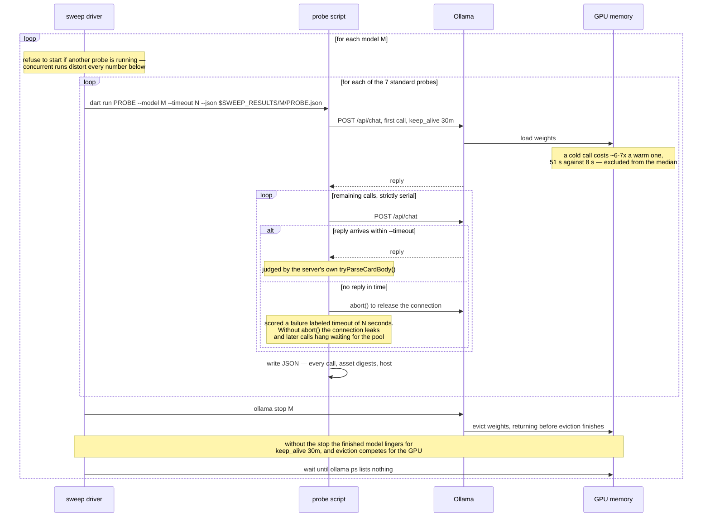

# Model behavior

Which local Ollama models produce renderable Adaptive Cards, what decoding settings they need, and what has already been measured about each.

## What this file is

`adaptive_chat_server_dart` is the backend for an **SDUI demo**. The demo works without any number in this file — pick a model, point the server at it, and it answers in cards. The file exists because the card path turned out to be a strict and discriminating test problem for local models. Answering as an Adaptive Card imposes four constraints at once: strict JSON, a closed element vocabulary the model must not invent from, a shape chosen to fit the question, and format stability across a multi-turn conversation. Each has an unambiguous pass/fail, and most chat benchmarks do not apply all four together. The findings should transfer to any workload that asks a local model for constrained, schema-shaped JSON; the demo is the instrument, not the subject.

Read it as a **lab notebook, not a requirement**. Nothing here is a supported product surface: the probes are hand-run, the numbers age as models and prompts change, and none of it gates the demo working. Every finding was originally recorded in a plan or a design spec — dated documents that are archived when their work ends — and copied here so the result outlives them; when a plan or spec produces a model finding, copy it into this file before the plan is archived, and cite the source so the full context is still findable. Each finding names the model, the setting, and the measurement, because reasoning about model behavior without measuring it has already produced wrong answers here more than once — which is what the probes in [`tool/model_probes/`](tool/model_probes/README.md) exist to prevent.

The vocabulary this file leans on — probe, sweep, case, sample, shape, seed — is defined in the [Glossary](#glossary) at the end. One term matters immediately: most figures here are `--samples 2`, which is why a one-point difference between two models is noise rather than a ranking.

## Key findings

The generalizable results — the ones that should transfer to any workload asking a local model for constrained, schema-shaped JSON, not just this demo. Model-specific numbers live in the [candidate table](#candidate-models) and [per-model results](#per-model-results); this section carries the takeaways.

- **Strict-shaped output is a sharper discriminator than prose benchmarks.** A model can sweep an ordinary chat benchmark and still fail almost every case that demands a specific, correct element type: `llama3-chatqa:8b` scores 21/21 and 10/10 on the easy and stress sets here, then produces a correct card shape on 1 of 25 cases — see [the shape-coverage table](#shape-coverage--all-fifteen-models-as-shipped).
- **A few-shot "seed" prefix is a model-dependent lever, not a universal fix.** Across fifteen models its value ranges from **+10** shapes gained (`nemotron-3-nano:4b`, which is nearly unusable without it) to **−2** (`llama3-chatqa:8b`, which scores lower with it than without) — see [the card-seed section](#the-card-seed-and-what-it-costs). A high seeded score is not evidence of a good model until read beside its unaided score.
- **Decoding settings dominate model choice.** Sending `temperature: 0` and `think: false` moved this workload more than any change of model did; only the switch to the card system prompt itself moved it more. A model that looks incapable at temp 1 with thinking on can be clean at temp 0.
- **Temperature 0 is not deterministic.** A ~3.5 K-character table produced two different outputs across three calls at `0`. Greedy decoding repeats short replies verbatim, but long generations still diverge. What `0` buys is a _stable failure mode_ — a card the model gets wrong at `0` is usually wrong the same way on retry, so a broken card never self-heals.
- **`format` support is per-model _and per-runtime_, and silent when absent.** Ignoring it is not one behavior but two: a model can return the same good card under `none`/`json`/`schema`, or return an empty body under one and prose under the other. The verdict also moves with an Ollama upgrade, so re-run [the canary](#not-a-card-test-the-format-canary) after one before trusting the constraint either way. A model can be strong on every other axis and unusable under this one.
- **A full window costs three of eight models a quarter to a third of their shape coverage, in three different ways.** One stops producing cards, one keeps producing them and substitutes a `TextBlock` for the input a case asked for, and one stops finishing its replies. A check that a reply parsed as a card catches the first and the malformed bodies; the stalls need a timeout, and the substitution passes every structural check. An empty-window score does not predict which way a model moves. See [a filled context](#a-filled-context-an-oversized-history-message-is-dropped-whole-and-a-real-one-costs-some-models-a-third-of-their-shapes).
- **A history message that exceeds the allocated window is dropped whole, not trimmed, and nothing says so.** Ollama allocates `min(requested, trained window)` on both hosts with no counterexample, and a message that does not fit is removed in full rather than cut down. Sizing history in characters is what lets that go undetected: the same text tokenizes at 4.30 chars/token on some families and at 2.74 to 2.99 on others, so a filler sized to one model's tokenizer overflows another's allocation by nearly half. Two `nvfp4` builds are the exception and evaluate thousands of tokens past their own allocation, so the allocation is enforced inconsistently rather than never. The reply reads as a normal answer to a question asked with no history, so the loss is invisible unless `prompt_eval_count` is checked. See [a filled context](#a-filled-context-an-oversized-history-message-is-dropped-whole-and-a-real-one-costs-some-models-a-third-of-their-shapes).
- **Redirect a behavior rather than forbidding it.** Asked to explain code, `qwen2.5-coder:7b` emitted a card and then appended the explanation, which makes the whole reply raw text. Telling it harder not to append did not help: it scored the same and stopped producing cards, answering every code question as prose. Telling it where the explanation goes — a `TextBlock` beside the `CodeBlock` — fixed it.
- **System prompt text moves the failure rate; only the detector makes a shape safe.** Each prompt fix exposes the next failure — once the model sent two elements it began dropping the `[ ]` around them. Prompt wording cut that to near zero at `t=0` but not at `t=0.6`, so `card_detect.dart` repairs the bracketless form as well.
- **Tool-calling support is per-model and silent when absent, the same as `format` — and it is partly a property of the prompt, not only of the model.** Across fifteen models the canary sorts them four ways: return a card through the tool channel cleanly, call tools but never reach for the card tool, leak the card tool onto a plain prose question, or expose no tool-calling path at all. **Four of the fifteen moved, in both directions, when only the canary's system prompt changed**, so that table sorts model-and-prompt pairs rather than models. See [the tool-calling canary](#not-a-card-test-the-tool-calling-canary).

### The tuning ledger — everything tried, and whether it helped

Every lever pulled on this workload, in one place, described so it makes sense
without knowing this codebase. "Promoted" means it ships today; **do not retry**
the failures — they are recorded here so the negative results are not
rediscovered. Outcomes track the **Kind** column — which layer of the system a
change touches — more closely than they track the content of any individual
change.

| Kind                   | What was changed                                                                                                                                                                                                        | Outcome                                   | Evidence                                                                                                                                                                                                                                                                                                                                                                                                                                          |
| ---------------------- | ----------------------------------------------------------------------------------------------------------------------------------------------------------------------------------------------------------------------- | ----------------------------------------- | ------------------------------------------------------------------------------------------------------------------------------------------------------------------------------------------------------------------------------------------------------------------------------------------------------------------------------------------------------------------------------------------------------------------------------------------------- |
| **Context assembly**   | Point the server at the **card system prompt** — which describes the element palette and the rules for using it — instead of the Markdown-only prompt, which never mentions cards                                       | **Largest effect measured**               | 0/8 → 8/8 cards, same model and same eight questions. Larger than any model or temperature gap.                                                                                                                                                                                                                                                                                                                                                   |
| **Context assembly**   | Prepend a **seed card**: a synthetic two-turn exchange — a short pick-one question, and a bare card answering it — inserted ahead of the real history, so a card is the established format before any prose accumulates | **Model-dependent**                       | +10 shapes to −2 across fifteen models. This spread is why it is now opt-in.                                                                                                                                                                                                                                                                                                                                                                      |
| **Context assembly**   | Repeat the instructions in a second `system` message placed _after_ the conversation history, instead of only before it                                                                                                 | **No effect / unmeasurable**              | Ollama chat templates vary in whether a second `system` message is delivered to the model at all.                                                                                                                                                                                                                                                                                                                                                 |
| **Decoding**           | `temperature: 0` — greedy decoding instead of sampling                                                                                                                                                                  | **Helped, promoted**                      | Cleared card failure modes that defeated models outright at their own default temperature.                                                                                                                                                                                                                                                                                                                                                        |
| **Decoding**           | `think: false` — suppress the model's chain-of-thought preamble                                                                                                                                                         | **Helped, promoted**                      | `qwen3.5:9b` takes 77 s and invents JSON keys with thinking on; clean and fast with it off.                                                                                                                                                                                                                                                                                                                                                       |
| **Decoding**           | `format: json` / `format: schema` — Ollama's own constrained-decoding flag, which is meant to force valid JSON                                                                                                          | **Per-model and per-runtime, unreliable** | Honored by some models, silently ignored by others, and _destructive_ on `gpt-oss:20b`. Two ignores flipped to honored between Ollama 0.32.14 and 0.33.2 — re-check the canary per runtime. On `qwen3.6:27b-coding-nvfp4`, the `schema` arm repaired `ColumnSet` (0/6 → 6/6) and did not repair `Carousel`, and eliminated prose replies; the `json` arm did not complete — the runner wedged partway through.                                    |
| **System prompt text** | Tell the model **where an explanation goes** — a `TextBlock` beside the `CodeBlock` — instead of forbidding it from appending prose after the card                                                                      | **Helped, promoted**                      | Hard cases 6/10 → 15/15 at `t=0`. The "redirect, don't forbid" result.                                                                                                                                                                                                                                                                                                                                                                            |
| **System prompt text** | Re-key the **escape hatch** — the clause permitting a plain Markdown answer — from _confidence_ ("if you are unsure whether a card helps") to _capability_ ("if no element type fits")                                  | **Helped, promoted**                      | Clean on both regression checks; this is the wording shipped today.                                                                                                                                                                                                                                                                                                                                                                               |
| **System prompt text** | Teach it that a two-part request ("compare A and B, then tell me which you'd pick") is still a single message                                                                                                           | **Regressed — reverted**                  | 8/8 → 7/8, deterministic on repeat. Caught only by the code A/B set.                                                                                                                                                                                                                                                                                                                                                                              |
| **System prompt text** | Restate the element-shape rule again at the **end** of the prompt, for recency                                                                                                                                          | **No effect**                             | One of three wording edits screened against conversational drift. All three failed.                                                                                                                                                                                                                                                                                                                                                               |
| **System prompt text** | Make the Markdown-permission section's heading less prominent, so it reads as a narrow exception rather than an available mode                                                                                          | **No effect**                             | Same screening; failed.                                                                                                                                                                                                                                                                                                                                                                                                                           |
| **System prompt text** | Narrow the escape-hatch wording further still                                                                                                                                                                           | **No effect**                             | Same screening; failed.                                                                                                                                                                                                                                                                                                                                                                                                                           |
| **Server code**        | Repair the bracketless form in `card_detect.dart` — accept two elements emitted without the wrapping `[ ]` that should surround them                                                                                    | **The only durable fix**                  | Prompt wording cut that failure to near zero at `t=0` but not at `t=0.6`; the detector covers both.                                                                                                                                                                                                                                                                                                                                               |
| **Output channel**     | Ask for the card through Ollama's **tool channel** — a `render_adaptive_card` function whose arguments carry the body — instead of asking for card JSON in the message body                                             | **Helped where used — not shipped**       | Re-measured 2026-09-16 with the system prompt held fixed. On the 7 models that can use it, the reply is better wherever the tool is actually called: 79-100% of calls pass against 62-94% on prose, with 0 malformed JSON across 570 tool calls against 50 on prose. [Adoption is the problem](#tool-adoption-not-card-quality-is-what-the-shape-score-measures) — 4 to 34 calls per 100 never use the tool, and history makes it worse. No code. |

The Kind column groups the outcomes. Two of the three changes to _what the
model sees before the question_ moved behavior, one of them more than any
other single factor measured here; the third is a null that may be a delivery
artifact rather than a result, since Ollama chat templates vary in whether a
second `system` message reaches the model at all. Four of the six changes to
_the system prompt text_ did not ship: the three edits screened against
conversational drift failed, and a fourth was reverted for causing a
regression — while the seed, a two-turn prefix that changes no instruction,
moved some models by ten shapes. Neither category makes a malformed card safe;
only the detector does.

## The models we care about most

The **launch set** is whichever models `.vscode/launch.json` currently launches the server with — those are the ones someone can start from the debugger, so they are the ones worth keeping working. It has held four models since 2026-08-21: two large, and two that fit a 16 GB host.

This set is expected to change. When `launch.json` changes, the priority set changes with it, and this section is describing a pointer rather than a fixed list. Re-derive it rather than trusting the names below:

```bash
grep -A1 '"--ollama-model"' ../.vscode/launch.json |
  grep -v -e 'ollama-model' -e '^--$' | tr -d ' ",' | sort -u
```

At the time of writing that yields `granite4.1:8b`, `qwen2.5-coder:7b`, `qwen3-coder:30b`, and `qwen3.8:27b-nvfp4`. If that list is stale, trust the grep rather than this paragraph.

`qwen2.5-coder:7b` is additionally the server's compiled-in default (`defaultOllamaModel` in `lib/src/ollama_responder.dart`), which is a separate decision from what the debugger launches.

### Why these four, after the 25-case sweep

The set above is the outcome of the sweep, not a historical accident: `qwen3.5:9b` was swapped out for `granite4.1:8b` on 2026-08-19, and `gpt-oss:20b` for `qwen3.8:27b-nvfp4` on 2026-08-20. `launch.json` was edited to match each time.

Read on the shipped configuration, all fifteen candidates rank by with-history shape coverage in [the full table](#shape-coverage--all-fifteen-models-as-shipped), which also carries the cold-start, seed and erosion figures. Among 16 GB-capable models the order is unchanged, so nothing here disturbs the two portable slots; `gpt-oss:20b` at 12.8 GB outranks all three of them and is the exception the 16 GB column exists to flag.

- **`gpt-oss:20b` — dropped 2026-08-20, replaced by `qwen3.8:27b-nvfp4`.** The strongest unaided model in the file under 0.32.14; under 0.33.2 the strongest seeded one and no longer the top unaided. The swap is defensible on either runtime's figures, and the destructive `format` breakage argues against it on both: [its per-model notes](#gpt-oss20b).
- **`qwen3.8:27b-nvfp4` — added 2026-08-20**, on the highest as-shipped score in the file under 0.32.14 and a seed gain of zero: it neither needs the seed nor is hurt by it. Cost: 16.9 GB, the one axis `gpt-oss:20b` still wins. [Per-model notes](#qwen3827b-nvfp4).
- **`granite4.1:8b` — kept.** The best 16 GB-capable model, in 5.0 GB. [Per-model notes](#granite418b).
- **`qwen3-coder:30b` — added 2026-08-21 as the second large model, on demo qualities rather than raw coverage.** It is the fastest model scoring above 20/25, it honors `format` where neither `nvfp4` build did under 0.32.14, and it is the only model scoring 20/21 everyday and 10/10 stress with no Markdown reply in either set. For a demo someone clicks through by hand, those matter more than a single shape point. Its +9 seed gain had disqualified it before the 2026-08-20 sweep added the speed and `format` findings.
- **`qwen2.5-coder:7b` — kept.** Tenth by shape, but the compiled-in default, the smallest at 4.4 GB, and the only model scoring 10/10 stress and 21/21 everyday with every stress pass an actual card. [Per-model notes](#qwen25-coder7b).
- **`qwen3.5:9b` — dropped, though the 2026-08-20 re-measurement narrows the gap.** One shape ahead of `qwen2.5-coder:7b` rather than the tie the original decision rested on, at 6.1 GB against 4.4, twice the latency, and a thinking mode that has to be disabled to be usable. The decision stands on cost rather than on a tie. [Per-model notes](#qwen359b).

**`nemotron-3.5-lightning:30b` is not the better large model.** It scores 21/25 warm against `qwen3.8:27b-nvfp4`'s 24/25 for 23.7 GB against 16.9, more weight for less coverage, and most of that score comes from the seed rather than from the model: 13/25 unaided, a +8 gain. What it is best at is serving as the **regression canary for the seed mechanism itself**, since an +8 swing is among the largest in the table and would show first if `--seed-card` ever silently stopped working. That is a reason to keep probing it, not a reason to launch it.

**`qwen3.6:27b-coding-nvfp4` was the first challenger to survive the seed test, though the slot eventually moved elsewhere.** The gap it needed to close, its 8/10 stress score, closed against it. Full case: [its per-model notes](#qwen3627b-coding-nvfp4).

Two caveats on all of the above. Everyday and stress figures are `--samples 1`, and shape figures `--samples 2`, so a one-shape difference between two models is noise rather than a ranking — the 2026-08-20 re-measurement moved ten of twelve steady models by ±1 without anything about them changing, and that pair of runs is not archived. And `granite4.1:3b`'s **unaided** figure is not comparable with its earlier one, because a per-call ceiling now bounds the runaway generations it produces without the seed; its seeded figures match what it scored unbounded. See [the timeout note](#a-note-on-the-per-call-timeout).

## Candidate models

Chat models worth probing when they happen to be installed. Check availability before assuming a result applies — the command lists everything Ollama has, so embedding models (`nomic-embed-text`, and anything else that cannot hold a conversation) will show up there and are deliberately absent from the table below:

```bash
curl -s http://127.0.0.1:11434/api/tags | python3 -c "import sys,json;[print(m['name']) for m in json.load(sys.stdin)['models']]"
```

This is the **roster**: what exists, whether you could run it, and why it is on the list. **Role** says why it is here; **Everyday + stress** is the cold-start smoke result, the one measurement that lives only in this table. Shape coverage, seed dependence, cascade, and erosion are deliberately _not_ repeated here — they are in [the shape-coverage table](#shape-coverage--all-fifteen-models-as-shipped), which carries the columns that make them readable. Per-model `format` and tool-channel behavior likewise lives in [the canaries](#not-a-card-test-the-format-canary) and [per-model results](#per-model-results) rather than in cells here.

**16 GB** is a _portability_ signal, not a limit on what can be tested here. It answers "would this model run for someone on a 16 GB Mac or a 16 GB GPU?", which matters for what the server can reasonably recommend as a default. Two hosts are measured: a **64 GB M1 Max**, where every model in this table runs on its own — including the ❌ rows — and a **16 GB M5**, where only the ✅ and ⚠️ rows do. A ❌ means "do not make this the recommended default", not "cannot be probed".

Sorted by model name, and within a family by parameter count ascending (so `nemotron-3-nano:4b` precedes `:30b`), which makes a tag quick to find. Role and verdict, not position, carry the meaning.

| Model                                             | Weights | 16 GB | Role                 | Everyday + stress (cold start, Ollama 0.32.14)       | Verdict |
| ------------------------------------------------- | ------- | ----- | -------------------- | ---------------------------------------------------- | ------- |
| gpt-oss:20b                                       | 12.8 GB | ❌    | candidate            | everyday 19/21 · stress 9/10                         | ✅      |
| granite4.1:3b                                     | 2.0 GB  | ✅    | candidate            | everyday 16/21 · stress 7/10                         | ⚠️      |
| granite4.1:8b                                     | 5.0 GB  | ✅    | launch set (16 GB)   | everyday 19/21 · stress 10/10 (6 prose)              | ✅      |
| hf.co/unsloth/Nemotron-3-Nano-30B-A3B-GGUF:latest | 22.9 GB | ❌    | candidate            | everyday 15/21 · stress 5/10                         | ✅      |
| llama3-chatqa:8b                                  | 4.3 GB  | ✅    | candidate            | everyday 21/21 · stress 10/10 — 0 cards, all prose   | ❌      |
| llama3-groq-tool-use:8b                           | 4.3 GB  | ✅    | candidate            | everyday 18/21 · stress 7/10                         | ⚠️      |
| llama3.2:latest                                   | 1.9 GB  | ✅    | candidate            | everyday 19/21 · stress 7/10                         | ⚠️      |
| nemotron-3-nano:4b                                | 2.6 GB  | ✅    | candidate            | everyday 17/21 · stress 5/10                         | ⚠️      |
| nemotron-3-nano:30b                               | 22.6 GB | ❌    | candidate            | everyday 18/21 · stress 6/10                         | ✅      |
| nemotron-3.5-lightning:30b                        | 23.7 GB | ❌    | candidate            | everyday 18/21 · stress 9/10                         | ✅      |
| qwen2.5-coder:7b                                  | 4.4 GB  | ✅    | default + launch set | everyday 21/21 · stress 10/10, all cards             | ⚠️      |
| qwen3-coder:30b                                   | 17.3 GB | ❌    | launch set (large)   | everyday 20/21 · stress 10/10 — all cards, both sets | ✅      |
| qwen3.5:9b                                        | 6.1 GB  | ⚠️    | candidate            | everyday 19/21 · stress 10/10, all cards             | ⚠️      |
| qwen3.6:27b-coding-nvfp4                          | 18.4 GB | ❌    | candidate            | everyday 21/21 · stress 8/10                         | ✅      |
| qwen3.8:27b-nvfp4                                 | 16.9 GB | ❌    | launch set (large)   | everyday 20/21 · stress 9/10                         | ✅      |

**Cold start** is a single-turn probe. **With history** replays prior conversation turns the way the server actually does. These are different measurements and a model can pass one while failing the other — every result recorded before 2026-08-14 is a cold-start number, because no probe sent history at all.

**Verdict** is set from the model's with-history `shapes N/25` figure — the score **as the server ships today**, and the number to read first (✅ ≥ 20/25, ⚠️ 10-19, ❌ < 10). Note it is _not_ derived from the everyday/stress column beside it: `llama3-chatqa:8b` sweeps that column and still earns ❌, which is what [the shape probe](#shape-coverage--all-fifteen-models-as-shipped) exists to catch.

**Cascade** — whether a follow-up turn can edit the card the model just sent — is measured for every model but separates none of them, so it is discussed in [the cascade section](#cascade--editing-the-card-the-model-just-sent) rather than carried here.

The **16 GB** column is not a gate on what gets probed — it records what a constrained host could run. Probing a ❌ model on the 64 GB host is expected and useful; it is how this matrix gets filled in, and the 16 GB host is where the column gets checked rather than asserted. What the column governs is what the server should _recommend_ as a default, since a default that only runs on a 64 GB box is not much of a default.

## Which system prompt produced the number

Every result in this file was measured with **`assets/card_system_prompt.txt`**. The server has no default prompt — every run names one with `--system-prompt-file` (or opts out of models entirely with `--echo`).

Two files exist: `assets/card_system_prompt.txt` carries the card palette and
rules, and `assets/default_system_prompt.txt` is Markdown-only and never
mentions Adaptive Cards.

Measured on `qwen2.5-coder:7b` at `t=0`, the same eight options questions, only the prompt file differing: **0/8 cards / 8/8 prose** with the Markdown prompt versus **8/8 cards / 0/8 prose** with the card prompt, and zero broken cards either way. Six of the eight card-prompt replies contained a real `Input.ChoiceSet`; the other two chose a `FactSet` and a `TextBlock`, which are defensible for those questions. The gap between the two prompts is the largest single effect recorded in this file — larger than any model or temperature difference — which is why the server stopped having a default at all on 2026-08-15 and now makes every run say which prompt it wants.

Its name is misleading: `default_system_prompt.txt` is not a default and never gets loaded unless you ask for it by name. It keeps the name because renaming an asset breaks every `--system-prompt-file` invocation already written down in docs, launch configs, and shell history.

When reading a bug report, still confirm which prompt was loaded — the server logs it at startup. "The model never sends cards" now means someone named the Markdown prompt, or is running a build from before 2026-08-15, when the prompt could be implicit.

## The card test classes

Every score below is "n out of m" against one of three sets. The sets are not interchangeable, and a number quoted without its set is not interpretable — a model has scored **7/7 on the everyday set while failing half the stress set**.

### 1. Everyday set — `temperature_matrix.dart`

Seven ordinary requests, one per common reply shape: a date+time ask (`Input.Date`), a size choice (`Input.ChoiceSet`), labelled specs (`FactSet`), a 4-row table, a 5-slice chart, a 1–5 rating, and a two-sentence prose answer. Run across three temperatures (`0`, `0.2`, `0.6`).

Use it to answer **"is this model usable at all?"** It is a smoke test. Any model being considered should pass it, and passing it proves very little — this is the set that does not discriminate.

### 2. Stress set — `temperature_stress.dart`

Five requests chosen because they are the ones that actually break, run at `t=0` and `t=0.6`:

| Case        | What it stresses                                                         |
| ----------- | ------------------------------------------------------------------------ |
| `codeblock` | Code plus an explanation — the shape that tempts a model to append prose |
| `bigtable`  | A 12-month table — long generation, where truncation shows up            |
| `nested`    | A full form: title, date, amount, 6-choice dropdown, notes, buttons      |
| `multiline` | Escaped `\n` and quoted text inside strings — the invalid-JSON classic   |
| `mixed`     | A table **then** a choice set — two structures in one reply              |

Use it to answer **"which model or setting should we ship?"** This is the set that separates candidates, and the one to re-run after any prompt change. It also counts distinct outputs per cell, which is how "temperature 0 is deterministic" was disproved.

### 3. Prompt A/B set — `prompt_ab.dart`

Eight code-flavoured prompts run against **two prompt files** — the shipped `card_system_prompt.txt` and an edited candidate — printing both pass rates.

Use it to answer **"did my wording change actually help?"** It is the only set that compares prompts rather than models, and it exists because a wording change that fixes the one case you were looking at can quietly break three others.

### 4. Multi-turn set — history replay

The server replays prior turns on every request (`OllamaResponder.reply()`), but sets 1–3 all send a **single turn**. That gap hid a failure class until 2026-08-14.

Measured on `qwen2.5-coder:7b` at `t=0`, asking "what are my options for deployment targets":

With no history it answered with `card[2]`, an `Input.ChoiceSet`. With **one**
prose turn ahead of the same question it answered with 867 characters of
Markdown, and with two, 903 — no card either time.

One prose turn is enough. Once a conversation is flowing in Markdown the model treats that as the established format. Two consequences:

- **A cold-start pass proves less than it looks.** Reproduce with history before concluding a bug is fixed, and say which condition a number came from.
- **"Renderable prose" is not always a pass.** For an options question a tidy Markdown list renders perfectly and still fails the user, because it cannot be clicked. `shape_ab.dart` is the only probe that catches this — it requires the element type that answers the question, not merely a reply that parses.

Two changes were made in response, both still shipped. The card system prompt's escape hatch was re-keyed from _confidence_ ("if you are unsure whether a card helps") to _capability_ ("if no element type fits"), which is why it reads the way it does today. And the model's context now opens with a card-shaped exchange — see the seed below, which is what actually closed most of the gap.

#### Shape coverage — all fifteen models, as shipped

`shape_ab.dart` asks the narrow question the other probes cannot: for each of 25 cases, did the model emit an element type that actually answers it? It runs every case twice — cold-start and after two prose turns — and the difference is the shapes a model loses once a conversation has gone to Markdown.

**This is the current, as-shipped picture**, and the only model comparison in this file that is: all 25 cases, `t=0`, `--samples 2`, both conditions, with the unconditional card seed in place. It derives from the Ollama 0.33.2 runs in [`results-m1max-64gb-ollama0332/`](tool/model_probes/results-m1max-64gb-ollama0332) on the Apple M1 Max: thirteen models swept 2026-09-01 before runner eviction, and `llama3.2:latest` and `granite4.1:3b` re-run 2026-09-02 after runner eviction, otherwise under identical conditions. Sorted by with-history coverage, which is what a user actually experiences.

It was measured against `card_system_prompt.txt` at digest `4bfa327067f8`, before the `Input.Rating` palette edit; the shipped prompt is `8cbfde243266`, and only `granite4.1:3b` has been re-swept under it. `granite4.1:3b`'s row is cascade-damaged and is not a model measurement: its after-eviction unaided run stalls on calls 0-20, the probe's cold opening cases, and again on 89-99 — the queue-cascade signature described in [the cascade section](#stalls-are-a-queueing-cascade-not-a-runtime-difference) — so its 17/25, 12/25, and 9/25 record queued calls scored as failures rather than the model's coverage. Its clean 0.34.0 figures are in [the cascade section](#stalls-are-a-queueing-cascade-not-a-runtime-difference): 17/25 cold and 15/25 with history seeded, 10/25 and 12/25 unaided, cascade 2/3, no stall.

| Model                                               | Weights | Cold-start | With history | Warm, pre-seed | Seed               | Cascade | Eroded by history                                                 |
| --------------------------------------------------- | ------- | ---------- | ------------ | -------------- | ------------------ | ------- | ----------------------------------------------------------------- |
| `gpt-oss:20b`                                       | 12.8 GB | **25/25**  | **25/25**    | 22/25          | helps (+3)         | 3/3     | none                                                              |
| `qwen3.8:27b-nvfp4`                                 | 16.9 GB | 24/25      | 24/25        | **24/25**      | no effect (0)      | 3/3     | none                                                              |
| `qwen3-coder:30b`                                   | 17.3 GB | 24/25      | 23/25        | 14/25          | **needs it** (+9)  | 3/3     | `rating_ask`, `time` (2)                                          |
| `qwen3.6:27b-coding-nvfp4`                          | 18.4 GB | 23/25      | 23/25        | 23/25          | no effect (0)      | 3/3     | none                                                              |
| `hf.co/unsloth/Nemotron-3-Nano-30B-A3B-GGUF:latest` | 22.9 GB | 21/25      | 22/25        | 16/25          | **needs it** (+6)  | 3/3     | none                                                              |
| `granite4.1:8b`                                     | 5.0 GB  | 23/25      | 21/25        | 15/25          | **needs it** (+6)  | 3/3     | `carousel`, `codeblock`, `table` (3)                              |
| `nemotron-3-nano:30b`                               | 22.6 GB | 22/25      | 21/25        | 16/25          | **needs it** (+5)  | 3/3     | `carousel`, `text` (2)                                            |
| `nemotron-3.5-lightning:30b`                        | 23.7 GB | 20/25      | 21/25        | 13/25          | **needs it** (+8)  | 3/3     | `table` (1)                                                       |
| `qwen3.5:9b`                                        | 6.1 GB  | 20/25      | 19/25        | 17/25          | helps (+2)         | 3/3     | `badge` (1)                                                       |
| `qwen2.5-coder:7b`                                  | 4.4 GB  | 20/25      | 18/25        | 18/25          | no effect (0)      | 3/3     | `choice2`, `table` (2)                                            |
| `nemotron-3-nano:4b`                                | 2.6 GB  | 19/25      | 17/25        | 7/25           | **needs it** (+10) | 3/3     | `carousel`, `gauge` (2)                                           |
| `llama3-groq-tool-use:8b`                           | 4.3 GB  | 18/25      | 17/25        | 9/25           | **needs it** (+8)  | 3/3     | `date`, `progress`, `toggle` (3)                                  |
| `llama3.2:latest`                                   | 1.9 GB  | 15/25      | 15/25        | 12/25          | helps (+3)         | 3/3     | `facts` (1)                                                       |
| `granite4.1:3b`                                     | 2.0 GB  | 17/25      | 12/25        | 9/25           | helps (+3)         | n/a     | `badge`, `choice4`, `codeblock`, `number`, `progress`, `text` (6) |
| `llama3-chatqa:8b`                                  | 4.3 GB  | 4/25       | 1/25         | 3/25           | _hurts_ (-2)       | n/a     | `columnset`, `gauge`, `progress` (3)                              |

**Warm, pre-seed** is the same measurement without the card seed, and it is the model's seed-dependence — the most useful column here after the score itself, since a model that scores well only with the seed is being held up rather than being robust. That distinction is what the [launch-set rationale](#why-these-four-after-the-25-case-sweep) turns on. The full reading of the **Seed** column — who needs it, who is hurt by it, what it protects, and what it costs — is in [the card-seed section](#the-card-seed-and-what-it-costs).

How to read the rest of it:

- **Weight class does not predict coverage.** `granite4.1:8b` at 5.0 GB scores 21/25, matching two models four times its size. Weight predicts runtime even less: see [Performance, by host and runtime](#performance-by-host-and-runtime).
- **Cold start does not predict with-history, in either direction.** `hf.co/unsloth/…` and `nemotron-3.5-lightning:30b` each gain a shape warm, while `granite4.1:8b`, `qwen2.5-coder:7b`, and `nemotron-3-nano:4b` each lose two. Four models score the same under both. Judge on the with-history column.
- **`llama3-chatqa:8b` is the case this probe exists for.** It sweeps the everyday and stress sets — 21/21 and 10/10 on 2026-08-20 — and produces a correct shape on 1 of 25 cases. Since the stress set began splitting cards from prose, it no longer takes a 100-call shape run to see why: its 10/10 stress score is **0 cards and 10 prose**, and its everyday sweep is 2 cards to 19 prose. The cheap probe now catches what only the expensive one could.
- **Failure is concentrated in nested shapes.** `carousel` (8 of 15 models) and `table` (6) account for most of what models never produce under either condition, almost always as invalid JSON rather than a wrong choice of element. No model measured is free of permanent misses: even `qwen3.8:27b-nvfp4` at 24/25 fails `rating_ask` under both conditions.
- **`rating_ask` is the most-failed case in the file.** **Eleven of the fifteen** answer "ask me to rate this" with a read-only `Rating` display instead of an `Input.*`, under both conditions, across unrelated model families. A failure that uniform points at the prompt, and [the `Input.Rating` A/B](#inputrating-was-missing-from-the-palette) identifies the mechanism and what the fix repaired. The eleven-of-fifteen figure is the pre-fix measurement and stands until the sweep is re-run. The next most-missed cases are `carousel` (8/15), `text` (7/15), then `time` and `table` (6/15).
- **`gauge` and `progress` never cross-contaminate**, on any model, despite sharing the "72%" wording.

#### `Input.Rating` was missing from the palette

**The most-failed case in the file was failing on an element the prompt never
offered.** `assets/card_system_prompt.txt` documented `Rating` — "a read-only
star rating (not an input; the user cannot change it)" — and listed six inputs,
none of them `Input.Rating`. The element is implemented in the renderer
(`packages/flutter_adaptive_cards_fs/lib/src/cards/inputs/rating.dart`) and was
already in `assets/card_schema.json`, so constrained decoding would have
accepted it; only the palette omitted it. `tool/model_probes/shape_cases.dart`
omitted it too, from `rating_ask`'s accepted set, so a model that produced the
correct element would have been scored a failure.

Measured 2026-09-07 on the M5 host under Ollama 0.33.3, `--samples 2`, seeded,
`--only rating_ask`, old prompt as `--baseline` against the new one as
`--candidate` — in two batches the same day: `qwen2.5-coder:7b` and
`granite4.1:8b` first, then the remaining six models the
[roster](#candidate-models) marks 16 GB-capable. Neither batch was archived:
there is no `results-m5-16gb-ollama0333/` directory; the first batch is
transcribed from terminal output and the second from per-model `--json` files
written outside the repository — the same standing as the M5 readings in [the
prompt-cache
section](#prompt-cache-reuse-and-retry-cost-measured-with-prompt_eval_cached_count).
Archiving them is a re-run on that host, listed under
[Open questions and future work](#open-questions-and-future-work):

| Model                     | Baseline cold        | Baseline warm        | Candidate cold         | Candidate warm         |
| ------------------------- | -------------------- | -------------------- | ---------------------- | ---------------------- |
| `qwen2.5-coder:7b`        | 0/2 — `Rating`       | 0/2 — `Rating`       | **2/2 `Input.Rating`** | **2/2 `Input.Rating`** |
| `granite4.1:8b`           | 0/2 — `Rating`       | 2/2 — `Input.Number` | **2/2 `Input.Rating`** | **2/2 `Input.Rating`** |
| `nemotron-3-nano:4b`      | 0/2 — `Rating`       | 0/2 — `Rating`       | **2/2 `Input.Rating`** | **2/2 `Input.Rating`** |
| `qwen3.5:9b`              | 2/2 — `Input.Rating` | 2/2 — `Input.Rating` | **2/2 `Input.Rating`** | **2/2 `Input.Rating`** |
| `llama3.2:latest`         | 0/2 — `Rating`       | 0/2 — `Rating`       | **2/2 `Input.Rating`** | 0/2 — `Rating`         |
| `granite4.1:3b`           | 0/2 — `Rating`       | 0/2 — `Rating`       | 0/2 — `Rating`         | 0/2 — `Rating`         |
| `llama3-groq-tool-use:8b` | 0/2 — `Rating`       | 0/2 — prose          | 0/2 — `Rating`         | 0/2 — `Rating`         |
| `llama3-chatqa:8b`        | 0/2 — prose          | 0/2 — prose          | 0/2 — prose            | 0/2 — prose            |

`rating_show` was run alongside on the first two models under the new prompt
and stayed 2/2 `Rating` cold and warm, so the added entry did not pull the
read-only case toward an input. It was not run in the second batch.

**The second batch splits the repair.** `nemotron-3-nano:4b` repairs outright.
`llama3.2:latest` repairs cold-start only — both with-history samples still
answer with the read-only `Rating`, so the probe reports the case as eroded by
history. `granite4.1:3b` and `llama3-groq-tool-use:8b` do not move: both keep
producing `Rating` with `Input.Rating` documented. `llama3-chatqa:8b` answers
in prose under either prompt, consistent with its scores everywhere else in
this file. And `qwen3.5:9b` passes every sample under the **old** prompt: it
produced `Input.Rating` without the palette documenting it, which
`card_schema.json` always allowed. Of the eight models measured, the fix
repairs three outright and a fourth on cold start only, leaves three unmoved,
and one never had the failure — the omission was a barrier for some models and
not the whole account.

Three limits on what this establishes. Eight models were measured, not fifteen
— the seven others are exactly the models the roster marks too large for a
16 GB host, so completing the table is an M1 Max run; until then they carry
the pre-fix figure. `granite4.1:8b`'s warm baseline passed here via `Input.Number`,
which is what its run in [the shape-coverage
table](#shape-coverage--all-fifteen-models-as-shipped) records too: that run
passes `rating_ask` warm via `Input.Number` and fails it cold, under 0.33.2 and
in the removed 0.32.14 archive alike. And the prompt edit changes the digest every archived run
recorded. `check_results.dart` reported that as 37 fatal findings; closing the
two superseded archives (see
[Open questions and future work](#open-questions-and-future-work)) left one, on
the archive that is still re-runnable, and re-measuring it on 2026-09-07 cleared
that too — the checker now reports **zero fatal findings** and 145
non-fatal digest notes: 90 in `results-m1max-64gb-ollama0332/` and 48 in
`results-m5-16gb-ollama0331/`, which their `HISTORICAL.md` markers downgrade as
closed archives, and seven in `results-m1max-64gb-ollama0333/` on `qwen3.5:9b`
and `qwen3.6:27b-coding-nvfp4`. A note is fatal only for a model in
`launch.json` whose archive is not closed (`check_results.dart` line 370), so
none of these was ever a gate.

#### Performance, by host and runtime

Latency is a property of the model, the box, **and** the runtime, so each recorded run stamps the host and the Ollama version into its result file; a figure that cannot name its machine does not belong here. Two configurations are recorded here: **Apple M1 Max / 64 GB** on **Ollama 0.33.2**, a MacBook Pro 14-inch (`MacBookPro18,4`), and **Apple M5 / 16 GB** on **Ollama 0.33.1**, a fanless MacBook Air (`Mac17,3`). The M1 Max columns cover all fifteen models; the M5 columns cover the eight the [roster](#candidate-models) marks 16 GB-capable, and read `—` for the rest. The everyday and stress figures elsewhere in this file remain the older **Ollama 0.32.14** measurement on the same M1 Max; [the shape-coverage table](#shape-coverage--all-fifteen-models-as-shipped), including its cascade column, derives from the same 0.33.2 directory as the M1 Max columns below. The M1 Max host has since moved on to **Ollama 0.33.3** for the format-canary re-run and then to **Ollama 0.34.0**, which is what it runs now; neither the latency figures in this section nor the everyday/stress/shape figures have been re-taken on either, apart from `granite4.1:3b` under 0.34.0 ([the cascade section](#stalls-are-a-queueing-cascade-not-a-runtime-difference)).

**Memory bandwidth separates the two hosts more than core speed does.** Single-stream generation reads the model's weights out of memory for every token, so it is bound by memory bandwidth rather than by arithmetic throughput. The M5 is the newer part with the faster cores; the M1 Max has the wider memory bus, and the recorded medians go the M1 Max's way. Apple's published figures for the tiers relevant here:

| Apple Silicon | Rated memory bandwidth |
| ------------- | ---------------------- |
| M1            | 68 GB/s                |
| M1 Pro        | 200 GB/s               |
| M1 Max        | **400 GB/s**           |
| M1 Ultra      | 800 GB/s               |
| M5            | **153 GB/s**           |

The two bolded rows are the hosts measured here. These are vendor specifications transcribed for context, not measurements taken by any probe in this directory — no bandwidth or clock figure was read from either machine — so they are consistent with the direction of the M5-versus-M1-Max medians rather than established as its cause. A tier, not a generation, is what the comparison turns on: a later base-tier part can carry less bandwidth than an older Max-tier one, which is the case here.

**Compute is not the gap; the two hosts' GPU core counts rule that out as the explanation.** `Mac17,3` (the M5 host measured here) reports **8 GPU cores** via `system_profiler SPDisplaysDataType`, confirmed directly on that machine. `MacBookPro18,4` (the M1 Max host) carries the **32-core** GPU configuration, confirmed by its owner. Apple's [MacBook Pro specs page](https://www.apple.com/macbook-pro/specs/) puts the M5 generation's GPU core at a Neural Accelerator per core, which the M1 Max generation does not have, and its [M5 Pro/M5 Max newsroom announcement](https://www.apple.com/newsroom/2026/03/apple-introduces-macbook-pro-with-all-new-m5-pro-and-m5-max/) rates the 32-core **M5 Max** at up to **8x** the M1 Max on AI image generation and up to **6.7x** on LLM prompt processing (prefill, not the single-stream decode measured in this section). Neither figure is for the base M5 measured here; scaling the 8x claim down by the four-fold core-count gap between the 32-core M5 Max and this 8-core M5 puts the base part at roughly parity with or ahead of the M1 Max on compute, not behind it. That scaling is an inference from a marketing multiplier, not a measurement, and it carries the same status as the bandwidth table above: consistent with bandwidth being the bottleneck that explains the recorded medians, not a proof of it.

**Median s/call** is over the fixed 25-case shape sweep, so the case mix cancels and models are comparable. It excludes the first call after a model load, which costs roughly **6-7x** a warm one, and it excludes stalled calls, which measure the ceiling rather than the model. "Warm" there is the **call**, not the machine — a distinct axis. Both columns come from serial sweeps in which each model was measured at a different point, so machine state varies down a column rather than being constant; see the position note below the table. **Full sweep** is the seven standard probes for that model, stalls included — the directory now holds six files each, since the tool-calling canaries were deleted on 2026-09-16 and contributed under 0.1 min — that is wall clock someone waited. The tool-channel run is excluded from it, because only tool-capable models have one and a column that means different things on different rows is not a column.

A second full run is deliberately _not_ taken. Min-of-two is the usual noise filter, but the dominant noise here is the known load event rather than jitter, and a second run is measured on a hotter machine, so min-of-two would trade one uncontrolled bias for another. On the M5 that bias is measured rather than assumed — see the throttling figure below.

Every figure is derived from the recorded runs by [`perf_table.py`](tool/model_probes/perf_table.py) rather than transcribed, so a re-run diffs against the table rather than against somebody's typing. Deriving it caught two figures that had drifted: `qwen3.8:27b-nvfp4` read 4.4 s against a recorded 4339 ms, and `llama3-chatqa:8b` read 0.3 s where 253 ms and 248 ms — a 2% difference — printed as "0.3 s" and "0.2 s" beside a 1.0x ratio.

| Model                                               | Weights | M1 Max s/call | M5 s/call | M1 Max sweep | M5 sweep | M1 Max stalls | M5 stalls |
| --------------------------------------------------- | ------- | ------------- | --------- | ------------ | -------- | ------------- | --------- |
| `llama3-chatqa:8b`                                  | 4.3 GB  | 0.11 s        | 0.25 s    | 3.0 min      | 5 min    | 0             | 0         |
| `granite4.1:3b`                                     | 2.0 GB  | 0.98 s        | 1.4 s     | 124.0 min    | 13 min   | 52            | 1         |
| `llama3.2:latest`                                   | 1.9 GB  | 1.3 s         | 1.6 s     | 12.7 min     | 15 min   | 2             | 2         |
| `qwen3-coder:30b`                                   | 17.3 GB | 1.5 s         | —         | 10.2 min     | —        | 0             | —         |
| `llama3-groq-tool-use:8b`                           | 4.3 GB  | 1.8 s         | 2.7 s     | 8.9 min      | 13 min   | 0             | 0         |
| `nemotron-3.5-lightning:30b`                        | 23.7 GB | 1.9 s         | —         | 13.4 min     | —        | 0             | —         |
| `nemotron-3-nano:30b`                               | 22.6 GB | 2.0 s         | —         | 10.7 min     | —        | 0             | —         |
| `qwen2.5-coder:7b`                                  | 4.4 GB  | 2.4 s         | 2.9 s     | 19.4 min     | 22 min   | 0             | 0         |
| `hf.co/unsloth/Nemotron-3-Nano-30B-A3B-GGUF:latest` | 22.9 GB | 2.1 s         | —         | 17.3 min     | —        | 3             | —         |
| `nemotron-3-nano:4b`                                | 2.6 GB  | 2.5 s         | 3.5 s     | 15.8 min     | 30 min   | 1             | 4         |
| `granite4.1:8b`                                     | 5.0 GB  | 2.8 s         | 3.3 s     | 14.6 min     | 17 min   | 0             | 0         |
| `qwen3.8:27b-nvfp4`                                 | 16.9 GB | 4.0 s         | —         | 30.1 min     | —        | 0             | —         |
| `qwen3.6:27b-coding-nvfp4`                          | 18.4 GB | 5.9 s         | —         | 37.5 min     | —        | 0             | —         |
| `qwen3.5:9b`                                        | 6.1 GB  | 4.9 s         | 5.6 s     | 24.3 min     | 29 min   | 0             | 0         |
| `gpt-oss:20b`                                       | 12.8 GB | 7.2 s         | —         | 42.1 min     | —        | 0             | —         |

**The M1 Max column is a mixed harness.** [`results-m1max-64gb-ollama0332/`](tool/model_probes/results-m1max-64gb-ollama0332) holds 13 models measured **before runner eviction** (the 2026-09-01 sweep) and 2 measured **after** (`llama3.2:latest` and `granite4.1:3b`, re-run 2026-09-02); [the cascade section](#stalls-are-a-queueing-cascade-not-a-runtime-difference) describes the harness change. Eviction is a no-op unless a call times out, and 11 of the 13 recorded zero stalls, the other two within one stall of their 0.32.14 counts, so the split does not touch their rows. `granite4.1:3b`'s sweep and stall cells are its after-eviction run, whose stall positions still carry the cascade signature; only its median should be read.

**The M1 Max was re-measured on Ollama 0.33.2 to test whether an earlier cross-host anomaly was a runtime effect, and it was not.** 13 of the 15 medians land in **0.87-1.05x** of the same host's earlier 0.32.14 figures — no material latency difference. Those earlier figures are no longer in the working tree: the 0.32.14 archive (`results-m1max-64gb-ollama032/`) was removed on 2026-09-03, after every published table had been rederived from a 0.33.x directory, and git history before that date holds its raw runs and `PROVENANCE.md`. That provenance file recovers the archive's runtime as **0.32.14** from a single surviving Ollama server-log line (`Listening on [::]:11434 (version 0.32.14)`, 2026-08-21T13:34:28) — a line that covers only 2026-08-21T13:34 onward, while the archive itself spans runs dated 2026-08-20 and 2026-08-21, so the two earlier server restarts in that window were never independently corroborated.

**The one apparent improvement, and the one apparent cross-runtime behavior change, were both measurement artifacts.** `qwen3.5:9b` measured **0.71x** against the 0.32.14 archive — the second-largest deviation, after `llama3-chatqa:8b`'s **0.42x**, whose 107-253 ms latencies sit close to the noise floor for a model that answers in short prose rather than a card. A same-runtime, hot-versus-cold control re-run of `qwen3.5:9b` alone measured a **1.54x** position bias, larger than the 0.71x effect it was read against: cold (position 0, idle 29 min) medians 4924 ms, hot (7 s after an 8-hour sweep) medians 7563 ms, against the archive's 6903 ms — that control is not archived, and its cold median and the 1.54x figure are recorded in [the 2026-09-01 sweep plan](../docs/superpowers/plans/2026-09-01-m1max-64gb-ollama-033-sweep.md) rather than in a result file — cold-against-archive reads 0.71x and hot-against-archive reads 1.10x, purely from where the model sat in its sweep. Separately, a same-host comparison of 0.32.14 against 0.33.2 for `qwen3.5:9b` found **0 of 100 calls differ** between runtimes — consistent with it being one of 10 of 15 models measured byte-identical (0 label differences) across the two runtimes, counted against the 0.33.2 archive as it now stands — so the runtime is ruled out as the explanation for the `Input.ChoiceSet`-versus-`TextBlock` verdict change previously read against the M5 columns.

**With both columns now on the same runtime line, the host comparison reads cleanly for the first time.** 0.33.2 on the M1 Max and 0.33.1 on the M5 differ only at the patch level, so a per-row ratio is close to a same-runtime, cross-host comparison — the earlier caveat that it "compares two configurations, not two machines" no longer applies beyond that patch difference. Every row is still one point in a serial sweep, and the one model measured for position sensitivity showed a 1.54x hot/cold spread — larger than most of the differences a hardware comparison would want to read — so a single-point row comparison anywhere in this table carries that magnitude of position bias, not only for `qwen3.5:9b`. The per-row ratio band below is derived with `perf_table.py`'s own `read_dir` against the two 0.33.x result directories, at millisecond precision rather than from the rounded s/call figures above, and is the table article 3 of the blog series quotes. Ordered by ratio.

| Model                     | M1 Max median | M5 median | M5 ÷ M1 Max |
| ------------------------- | ------------- | --------- | ----------- |
| `granite4.1:8b`           | 2849 ms       | 3266 ms   | 1.15x       |
| `qwen3.5:9b`              | 4924 ms       | 5648 ms   | 1.15x       |
| `qwen2.5-coder:7b`        | 2379 ms       | 2895 ms   | 1.22x       |
| `llama3.2:latest`         | 1343 ms       | 1650 ms   | 1.23x       |
| `nemotron-3-nano:4b`      | 2537 ms       | 3544 ms   | 1.40x       |
| `granite4.1:3b`           | 976 ms        | 1398 ms   | 1.43x       |
| `llama3-groq-tool-use:8b` | 1846 ms       | 2666 ms   | 1.44x       |
| `llama3-chatqa:8b`        | 107 ms        | 248 ms    | 2.32x       |

`qwen3.5:9b`'s M1 Max median here, 4924 ms, is the cold arm of the position control above: the recorded 0.33.2 run is the one taken at position 0 after 29 minutes idle, so that row's ratio is read against a cold figure where the other seven are read against in-sweep ones.

**The median and the sweep can move in opposite directions, and neither is wrong.** The median is one greedy probe; the full sweep is seven, including two that sample at `t=0.2` and `t=0.6`, so a model fast at `t=0` is not guaranteed to be fast everywhere. `perf_table.py --by-probe` splits the two apart when a row looks contradictory; that breakdown has not been re-run against the 0.33.2 figures, so the specific by-probe ratios published against the earlier 0.32.14 archive are not repeated here.

**Every M5 row is the run taken at that model's position in one serial sweep, and those positions are not equivalent.** The sweep ran 10:27 to 14:32 — `granite4.1:8b` started at 0:00 on a machine idle for hours, `qwen2.5-coder:7b` at 0:17, and `granite4.1:3b` at 3:52 on a machine that had been generating for nearly four hours — so later rows carry more of whatever sustained load costs, and no row is a "cold" figure except the first. How much that is remains unestablished, and two models disagree: re-running `granite4.1:8b` 13 seconds after the sweep ended made it **1.20x** slower than its own position-0 run, matched call for call with byte-identical labels, while `qwen2.5-coder:7b` — its published figure taken 17 minutes in — measured **1.03x** after 31 minutes idle, slightly _slower_ cold. Two models moving in opposite directions is not a machine property.

**The reproducibility floor is the reason to be careful with all of it.** `granite4.1:8b` was measured a third time after 7h37m idle and came back **1.12x** its first run — `results-m5-16gb-ollama0331/` holds one run per model, so this reading and the 1.03x above are terminal figures, and only the 1.20x is recorded outside this file, in [the M5 sweep plan](../docs/superpowers/plans/2026-08-28-m5-16gb-performance-sweep.md) — two nominally cold measurements, twelve hours apart, differing by 12% with a tight per-call spread (p25 1.07, p75 1.15), so systematic rather than noisy. An effect of 1.20x sitting on a floor of 1.12x is not cleanly separable from it. Thermal throttling remains plausible on a fanless `Mac17,3` and is unproven: no die temperature or clock frequency was read, and Ollama server uptime, ambient temperature, and accumulated OS state all differed between those runs and none was excluded.

**All three measurements predate runner eviction, which the heat they were measured against depends on.** The M5 sweep ran 2026-08-28; the unload-on-timeout change came after the 2026-09-01 M1 Max sweep (see [the cascade section](#stalls-are-a-queueing-cascade-not-a-runtime-difference)). `granite4.1:8b` recorded zero stalls, so no unload would have fired on its own calls and its three medians are unaffected directly — but the eight-model sweep that heated the machine carried stalled calls on `llama3.2:latest` (2), `nemotron-3-nano:4b` (4) and `granite4.1:3b` (1), and under the current harness each timeout unloads the runner and leaves the GPU idle. The sustained load behind the 1.20x figure is therefore a property of the pre-eviction harness. Re-taking the control is possible but is not a correction to this column: `results-m5-16gb-ollama0331/` is a closed archive ([hosts, runtimes and archives](#how-results-are-produced)), so a re-run belongs in a new directory as a new measurement. The decisive instrument is a die temperature or clock reading during a sweep rather than a fourth median — two models measured for this already disagree about the sign.

Read the M5 column, then, as one sweep's figures with a position-dependent bias of roughly the same size as its reproducibility floor. Comparing two M5 rows that sat far apart in the sweep carries that bias; comparing an M5 row with its M1 Max neighbour carries it too. No correction factor is applied to any row: a measured bias would be reportable, and this one is not yet measured well enough to correct for.

**One M5 row was an artifact, and re-running it is what established that.** `llama3.2:latest` first recorded 89 minutes and 40 stalls (not archived; recorded in [the M5 sweep plan](../docs/superpowers/plans/2026-08-28-m5-16gb-performance-sweep.md)), with unaided cold-start collapsing 15 to 5 and all 28 unaided stalls falling in calls 0-27. Re-run on an idle machine it takes 15 minutes with 2 stalls and reproduces the M1 Max archive exactly — seeded 15/15, unaided 15/12. Its median barely moved, 1559 ms to 1650 ms, so the model's speed was never what changed. The cause is not identified: co-residency is ruled out, since Ollama logged one resident runner on all 22 loads of the sweep, and a 1.20x throttling factor is far too small to account for the gap. The second run is the one published. This is the second time the "re-run on an idle machine" rule has caught a bad row, after `granite4.1:3b` in August, and it is the reason the rule is stated as a requirement rather than as advice.

**Weight does not predict speed on either host.** On the M1 Max, `qwen3-coder:30b` at 17.3 GB is the fastest model scoring above 20/25 — 1.5 s/call, ahead of `qwen2.5-coder:7b` at a quarter its size — while `gpt-oss:20b` at 12.8 GB is the slowest at 7.2 s. Three lighter models are quicker still and none is a counterexample: `llama3-chatqa:8b` at 0.11 s tops the table because it answers in short prose rather than building a card, and `granite4.1:3b` at 0.98 s and `llama3.2:latest` at 1.3 s score 17/25 and 15/25.

**Stalls, not token rate, decide how long a sweep takes.** `granite4.1:3b` is the second-smallest model here and its 0.33.2 sweep runs over two hours against `qwen3-coder:30b`'s ten minutes at eight times the weight, because most of its calls read as stalled — a queueing cascade rather than 52 independently slow calls, see [the cascade section below](#stalls-are-a-queueing-cascade-not-a-runtime-difference). Budget a sweep by stall risk regardless of mechanism: one runaway generation can cost hours, and gigabytes tell you nothing about which model will produce one.

#### Stalls are a queueing cascade, not a runtime difference

**Stall counts are not comparable across runtimes.** `OLLAMA_NUM_PARALLEL=1` gives this host a single generation slot. When a call times out at the probe's 120 s ceiling, the probe abandons the connection, but the generation keeps running on the server; every later call queues behind it and is scored as its own stall. One runaway generation is recorded as N stalls, and N tracks how long the runaway ran, not how many calls were actually slow.

**Proven directly on `llama3.2:latest`.** The 0.33.2 sweep, before runner eviction, recorded **31 stalls** for this model. A long-timeout re-run of the same probe found exactly **two** genuinely slow calls — 64.4 and 62.1 minutes, both on the `facts` case, both ending in invalid JSON — and its unaided probe, which the sweep recorded as **19** stalls, had **zero** under the long timeout.

How the cascade was identified, since that is the transferable part. The recorded stalls sit in one contiguous block rather than scattering through the run. The server log shows a queue draining: 27 requests completing within 37 s, with start times 120 s apart and durations descending in 2-minute steps. The long-timeout re-run set `--timeout 7200`; that value is confirmed by the author (2026-09-18) and appears in no plan or result file, though the 64.4-minute call it captured bounds it above 3,864 s. Co-residency is excluded for the 2026-09-01 counts: Ollama logged `loaded runners count=1` on all 48 loads that day. The queue-drain reading and the runner count are recorded in the plan that ran the sweep, [`2026-09-01-m1max-64gb-ollama-033-sweep.md`](../docs/superpowers/plans/2026-09-01-m1max-64gb-ollama-033-sweep.md); the server logs themselves have since rotated.

| Model             | Condition | 0.32.14 | 0.33.2 |
| ----------------- | --------- | ------- | ------ |
| `llama3.2:latest` | cold      | 0/50    | 0/50   |
| `llama3.2:latest` | warm      | 2/50    | 12/50  |
| `granite4.1:3b`   | cold      | 0/50    | 0/50   |
| `granite4.1:3b`   | warm      | 2/50    | 14/50  |

Seeded probe, stalls per 50 calls; the 0.33.2 column is the 2026-09-01 sweep, before runner eviction.

| Model             | archive 0.32.14      | 0.33.2 before runner eviction, in-sweep | 0.33.2 before runner eviction, idle re-run | 0.33.2 after runner eviction (on disk) |
| ----------------- | -------------------- | --------------------------------------- | ------------------------------------------ | -------------------------------------- |
| `llama3.2:latest` | 12.3 min / 2 stalls  | 70.6 min / 31 stalls                    | 70.6 min / 31 stalls                       | 12.7 min / 2 stalls                    |
| `granite4.1:3b`   | 33.9 min / 13 stalls | 123.5 min / 52 stalls                   | 79.9 min / 36 stalls (not archived)        | 124.0 min / 52 stalls, cascade-damaged |

**Shape coverage is unchanged once queued calls are excluded.** `llama3.2:latest` under a long timeout returns to the archive's seeded 15/15 and unaided 15/12 exactly; the sweep's 15/12 and 9/12 were queued calls scored as failures, not new failures. Stall onset is positional within the warm sequence — `facts` onward for `llama3.2:latest`, `table` onward for `granite4.1:3b` — after which every remaining case in that probe queues behind it. Under 0.32.14, exactly one case stalled per model.

**Runner eviction reproduced the archive for one model and not the other, and the difference is unexplained.** After the 2026-09-01 sweep the harness was changed to send an unload (`keep_alive: 0`) after a timed-out call, and results are labelled **before runner eviction** and **after runner eviction**, with Ollama 0.33.2, weights, prompt and seed digests, and machine held constant. `llama3.2:latest` after runner eviction reproduces the 0.32.14 archive figure for figure — seeded 12 stalls / 15-12 to 2 stalls / 15-15, unaided 19 stalls / 9-12 to 0 stalls / 15-12 — and the results directory now holds that run: 12.7 min / 2 stalls. The seeded shape probe alone took 26.2 min before eviction and 6.5 min after for `llama3.2:latest`, against 30.1 and 30.0 min for `granite4.1:3b` (`shape_ab-seeded.json` at commits `10ee29a5` and `907d37b1`). `granite4.1:3b` does not move: seeded 14 stalls / 17-12 before and after, and its after-eviction unaided run stalls on calls 0-20 (the probe's opening cases `date`, `time`, `toggle`, …, all cold) and then 89-99, 21 cold and 11 warm, with the first non-stalled call taking 86,414 ms — a queued call draining, not a reload (`llama3.2:latest`'s equivalent after its stalls took 6,499 ms). The two runs stall on the same 52 calls, index for index (before-eviction files at commit `10ee29a5`): seeded calls 86-99, unaided 0-20 and 89-99 (32 before and after, 7/9 coverage both times), and all six cascade calls. Those are two contiguous blocks that cross probe boundaries, 14 + 21 = 35 stalls and then 11 + 6 = 17; the 70-minute generation in the server log accounts for the first at 120 s per stall, and the second block's runaway was not timed, so reading it as a second runaway is an inference. A sweep at `t=0` that replays the same runaway on the same call is also why the count repeats. "Unchanged by eviction" is equally explained by the eviction not taking effect, so nothing about `granite4.1:3b` under 0.33.2 is established by these runs: its 14 seeded and 32 unaided stalls, and the 17/12 seeded and 7/9 unaided coverage they produce, are consistent with a queue cascade and are recorded as cascade-damaged rather than as a model measurement. The nearest clean 0.33.x figures for it are the M5's — Ollama 0.33.1, seeded 17/25 both conditions, cascade 3/3, matching the clean 0.32.14 measurement — see [its per-model notes](#granite413b).

**The unload is not shown to cancel a running generation.** A direct test sent `keep_alive: 0` 3 s into an 18 s `llama3.2:latest` generation and the generation completed at **20.9 s**; `ollama stop` from the CLI gave **16.3 s**. During `granite4.1:3b`'s after-eviction run the server log records 53 unload requests answered in ~8 ms each, and a queue draining behind a generation that ran for 70 minutes (`/api/chat` durations 1h10m45s, 1h7m, 1h5m, 1h3m, … descending in 2-minute steps). During `llama3.2:latest`'s after-eviction run its two `facts` calls terminated server-side at 2m0s, each in the same second as an unload, and no long request followed; whether the unload caused that termination is not established, since the direct test says the unload alone does not cancel and the probe drops its connection in the same second it sends the unload, so the disconnect is an equal candidate, and why it coincided for one model and not the other is unexplained.

**Under Ollama 0.34.0 `granite4.1:3b` records no stall at all.** Re-run 2026-09-18 on the M1 Max through `sweep.sh`, current harness (120 s ceiling on the shape and cascade probes, unload on timeout), into [`results-m1max-64gb-ollama0340/granite4.1_3b/`](tool/model_probes/results-m1max-64gb-ollama0340/granite4.1_3b). The server log for the run shows one loaded runner.

| `granite4.1:3b`              | M1 Max, 0.32.14 archive | M1 Max, 0.33.2 after runner eviction | M5, 0.33.1   | M1 Max, 0.34.0   |
| ---------------------------- | ----------------------- | ------------------------------------ | ------------ | ---------------- |
| stalls, whole sweep          | 13                      | 52, cascade-damaged                  | 1            | **0**            |
| seeded, cold / with history  | 17/25, 17/25            | 17/25, 12/25                         | 17/25, 17/25 | 17/25, **15/25** |
| unaided, cold / with history | 11/25, 9/25             | 7/25, 9/25                           | 11/25, 12/25 | 10/25, 12/25     |
| cascade                      | 3/3                     | —                                    | 3/3          | **2/3**          |
| whole sweep                  | 33.9 min                | 124.0 min                            | 13 min       | 8 min            |

No call timed out, so the unload on timeout never fired, and the longest of the 200 shape calls took 9.2 s. The whole-sweep figure for the 0.34.0 column is `perf_table.py`'s 8 min, the same sum of per-call time as the other columns; the driver's wall clock was 8.5 min, 07:31:16 to 07:39:49. Seeded with-history reads 15/25, two below the 0.32.14 archive and the M5, which is past the ±1 noise floor. The cascade miss is one sample of `loglevel` answering turn 1 with an `Input.Rating` instead of a choice set.

**Two inputs differ between the 0.33.2 and 0.34.0 columns, not one, and a control separates them.** The 0.33.2 and M5 runs sent `card_system_prompt.txt` at digest `4bfa327067f8`; the 0.34.0 sweep sent `8cbfde243266`, which adds `Input.Rating` to the palette (commit `9fcba7af`, 2026-09-07). The same day's control re-ran both shape probes on 0.34.0 with the old prompt passed as `--baseline` (extracted from `9fcba7af^`, digest confirmed as `4bfa327067f8`), `--samples 2`, `--timeout 120`, one model resident:

| `granite4.1:3b`, M1 Max, shape probes | 0.33.2, old prompt | 0.34.0, old prompt | 0.34.0, new prompt |
| ------------------------------------- | ------------------ | ------------------ | ------------------ |
| stalls, seeded / unaided              | 14 / 32            | **1 / 1**          | **0 / 0**          |
| seeded, cold / with history           | 17/25, 12/25       | 17/25, 17/25       | 17/25, 15/25       |
| unaided, cold / with history          | 7/25, 9/25         | 11/25, 12/25       | 10/25, 12/25       |
| wall clock, seeded / unaided          | 30.0 / 67.7 min    | 5.5 / 5.1 min      | 2.7 / 3.3 min      |

With the old prompt the runaway still occurs under 0.34.0, on the known trigger cases: `table` (warm) at seeded call 87 and `facts` (warm) at unaided call 89. Each now costs one stall. The server log shows both requests ending at 2m0s with a 500 in the same second as the probe's disconnect and unload, and the next calls took 13,533 ms and 9,893 ms, so nothing queued. With the new prompt neither case runs away. The two changes therefore removed different things: the move to 0.34.0 stopped a runaway from becoming a cascade, and the prompt edit removed the runaway. Which change inside 0.34.0 lets the probe's disconnect end a generation is not identified, and the prompt's effect on the trigger cases is one run per arm. With the old prompt the 0.34.0 scores match the M5's clean 0.33.1 run on all four figures (17/25, 17/25, 11/25, 12/25), so the 15/25 seeded with-history and the `Input.Rating` cascade miss above travel with the new prompt rather than with the runtime. The control's JSON is under [`tool/model_probes/raw-captures/`](tool/model_probes/raw-captures/README.md), not a `results-*` directory, because `shape_ab.dart` records the digest of the prompt in the tree rather than of the `--baseline` file it sent.

**Under Ollama 0.34.0 an unload still does not cancel a generation, and a client disconnect does.** Re-tested 2026-09-18 on the M1 Max with `llama3.2:latest`, `t=0`, a fixed 1150-token generation (`num_predict` 1150) that runs 18.4 s and 17.2 s undisturbed. Each interruption was sent 3 s in, twice:

| Interruption at 3 s                 | Generation request ends at | Tokens generated | Server log status |
| ----------------------------------- | -------------------------- | ---------------- | ----------------- |
| none (baseline)                     | 18.4 s, 17.2 s             | 1150, 1150       | 200               |
| `keep_alive: 0` via `/api/generate` | 20.5 s, 19.6 s             | 1150, 1150       | 200               |
| `ollama stop` from the CLI          | 20.1 s, 20.0 s             | 1150, 1150       | 200               |
| client closes the connection        | 3.0 s, 3.0 s               | —                | 500               |

The unload requests themselves returned in 8-15 ms, and the generation ran to its full length behind them. The client-disconnect rows are the isolated reproduction that cancels correctly; the sweep's abandoned generations under 0.33.2 did not. A request ending at 3.0 s shows the handler returned, not that the runner stopped, so the slot was checked directly with `OLLAMA_NUM_PARALLEL=1`: a two-token request returns in 0.1 s on an idle server, waits **13.9 s** when sent 3 s into a live generation, and returns in **0.1 s** when sent immediately after the client disconnects, on both of two runs. The disconnect frees the slot. These tests use `curl` against `/api/generate`; the probes use Dart's `HttpClient` `abort()` against `/api/chat`, which was not tested this way. This is a single-host spot measurement taken with `curl`, not an archived probe run.

The mechanism behind the onset itself is not established. Suggestive only: `OLLAMA_CONTEXT_LENGTH=32768` is set on this host, `granite4.1:3b` ran at `n_ctx_slot=16384`, and Ollama logged `num_ctx=32768 n_ctx_train=8192` for another model.

**Calls known to hang, by model — a standing reference.** Recorded so a future stall is checked against a known trigger before being read as a new failure mode, rather than re-derived from scratch each time:

| Model                                               | Probe    | Trigger case       | Reproduces across runtimes              | Measured duration  |
| --------------------------------------------------- | -------- | ------------------ | --------------------------------------- | ------------------ |
| `granite4.1:3b`                                     | seeded   | `table` (warm)     | yes                                     | —                  |
| `hf.co/unsloth/Nemotron-3-Nano-30B-A3B-GGUF:latest` | seeded   | `table` (cold)     | yes                                     | —                  |
| `llama3.2:latest`                                   | seeded   | `facts` (warm)     | yes                                     | 64.4 min, 62.1 min |
| `nemotron-3-nano:4b`                                | everyday | `chart`            | yes                                     | —                  |
| `gpt-oss:20b`                                       | unaided  | `columnset` (cold) | observed on 0.32.14 only                | —                  |
| `granite4.1:3b`                                     | unaided  | `date` (cold)      | no — cascade inheritance, not a trigger | —                  |
| `llama3.2:latest`                                   | unaided  | `date` (cold)      | no — cascade inheritance, not a trigger | —                  |

The first four rows reproduce the same case across both runtimes and are the confirmed hang points as of this sweep: `table` (`granite4.1:3b`, the unsloth Nemotron-3-Nano-30B build), `facts` (`llama3.2:latest`), and `chart` (`nemotron-3-nano:4b`). `date`/`time`/`toggle`/`text` appearing first in an unaided probe are the probe's opening cases inheriting the previous probe's backlog, not hard prompts — `llama3.2:latest`'s unaided probe has zero genuinely slow calls under a long timeout. `llama3.2:latest` + `facts` is the only trigger measured directly, at **64.4 and 62.1 minutes**, both ending in invalid JSON.

**The runaway and the invalid-JSON failure look like the same failure at two severities.** The model does not terminate the structure, and either emits truncated JSON quickly or generates for an hour before doing so:

| Model                        | Cases (count of calls)                       |
| ---------------------------- | -------------------------------------------- |
| `qwen3.5:9b`                 | table×10, rating_show×8, carousel×8, badge×4 |
| `nemotron-3-nano:30b`        | table×11, carousel×4, pie×2, bar×2, nested×2 |
| `nemotron-3-nano:4b`         | facts×10, codeblock×5, time×4, table×4       |
| `granite4.1:3b`              | carousel×8, table×6, facts×4, columnset×4    |
| `nemotron-3.5-lightning:30b` | carousel×8, columnset×4, table×4             |
| `hf.co/…Nemotron-3-Nano-30B` | table×8, carousel×4, bar×2, choice5×2        |
| `qwen3.6:27b-coding-nvfp4`   | columnset×8, carousel×7                      |
| `qwen3-coder:30b`            | time×6, number×4, rating_ask×3               |
| `llama3.2:latest`            | codeblock×4, table×4, date×2, text×2         |
| `llama3-groq-tool-use:8b`    | table×3, codeblock×2, date×2, toggle×2       |
| `qwen2.5-coder:7b`           | carousel×2, mixed×1                          |
| `granite4.1:8b`              | pie×2                                        |
| `gpt-oss:20b`                | text×2, gauge×1, bigtable×1                  |
| `qwen3.8:27b-nvfp4`          | codeblock×1                                  |

`table` and `carousel` dominate, and every runaway trigger is a nested container shape. Two rows predate the 2026-09-02 re-run and are read from the 2026-09-01 sweep (commit `10ee29a5`): the on-disk after-eviction runs read `facts×5` for `granite4.1:3b` and `codeblock×6, table×5` for `llama3.2:latest`.

**The 120 s ceiling was not the problem; the cascade was.** A generation that runs for 60 minutes has already failed for a chat server: a reply that takes more than about a minute is treated here as unusable, and the slowest model on the M1 Max medians 7.2 s per call ([`gpt-oss:20b`](#performance-by-host-and-runtime)), so raising the ceiling to capture a runaway only converts a fast failure into a slow one and buys a number nobody can act on. A longer timeout is not the answer. The harness now sends an unload (`keep_alive: 0`) after a call times out, and results are labelled before and after runner eviction; that unload is not shown to cancel a running generation (above), so under 0.33.2 an abandoned generation was still recorded as many stalls. Under 0.34.0 a client disconnect does end the generation and free the slot, so a runaway costs one stall (above). Why the abandoned generation kept running past `request.abort()` is not established either — an isolated reproduction of the runaway call cancels correctly, and the sweep's did not. 120 s is already 2x that one-minute unusable threshold; the ceiling should stay anchored to usability, and lowering it (60 s would record the same failures for less wall clock) is worth considering, never raising it to accommodate a model. Recording a runaway's true duration, as done above, is a diagnostic exercise done once, off to the side — not a change to the published methodology, which needs to stay identical across runtimes to remain comparable.

#### A note on the per-call timeout

Probes bound each call (`--timeout`, default 180 s; the 2026-08-20 sweep used 120 s for the shape and cascade sets) and score an over-run reply a failure labeled `timeout (Ns)`. Before that bound existed, a runaway generation could hang an entire multi-model sweep: `granite4.1:3b` was observed generating for **16 minutes** on one `table` case without returning, a terminal observation with no archived run behind it.

The bound changes what one figure means, and only for `granite4.1:3b` unaided:

Seeded it scores 17/25 either way. Unaided it falls from 13/25 unbounded to
**9/25** under the 120 s ceiling.

Seeded, the ceiling costs it nothing — it stalls twice in 100 calls and scores exactly what it scored unbounded. Unaided it stalls eleven times and loses four shapes, because without a card in front of the history it answers at length in prose instead of emitting one. That is a real property of the model under that condition on that runtime, not an artifact: the stalls reproduce on an idle machine with nothing else resident. Under Ollama 0.34.0 they do not reproduce: the same probe records no stall with the current prompt and one stall with the prompt those figures were measured against ([the cascade section](#stalls-are-a-queueing-cascade-not-a-runtime-difference)).

The ceiling is kept because the server has no timeout of its own — a real user simply waits — so a card nobody waits for has failed in practice. Ten of fifteen models recorded zero stalls in the 0.32.14 archive as it stood when it was removed (git `2e0a7b8d^`), and no other model recorded more than two, so this caveat applies to one row of one column.

**A stalling measurement is easy to misread.** It looks identical whether the model is slow or the machine is busy — `granite4.1:3b`'s [first measurement was wrong for exactly this reason](#granite413b). Before concluding that a model stalls, check `ollama ps` for anything resident that should not be, and re-run on an idle machine.

#### The card seed, and what it costs

`OllamaResponder.reply()` prepends a synthetic card-shaped exchange — a short pick-from-a-set question and a bare card reply — ahead of the trimmed history on every request **that named a `--seed-card-file`**, so a card is the conversation's established format before any prose accumulates. Assembled order: system prompt, seed user turn, seed assistant turn, trimmed history, current user turn. The exchange lives in `assets/seed_card.json` and is read per request; `shape_ab.dart` reads the same asset and seeds by default, so a probe measures what a seeded server sends.

It is the only mechanism that worked. Three prompt edits and one message-assembly alternative were screened against the drift alongside it and all four failed — restating the shape rule last, guarding the Markdown section's heading, narrowing the escape-hatch wording, and injecting a per-turn `system` reminder after the history. **Do not retry them**, and note the general shape of that result: changing _where the model's context starts_ moved behavior; changing _what the system prompt says_ did not, in either direction that mattered. (The per-turn reminder is additionally unmeasurable on some models — Ollama chat templates vary in whether a second `system` message placed after the history reaches the model at all, so a null result there means nothing.)

**It is opt-in as of 2026-08-21: the seed is sent only when `--seed-card-file` names one.** There is no separate boolean and no implicit default, which mirrors how the server already treats `--system-prompt-file` — a run says what it wants or gets nothing. Every figure in this file was measured **with `assets/seed_card.json` passed**, so quoting one against an unseeded server is quoting the wrong configuration.

Making it opt-in rather than unconditional is a measurement result, not a preference. The seed's value is **model-dependent** — see the **Seed** and **Warm, pre-seed** columns of [the shape-coverage table](#shape-coverage--all-fifteen-models-as-shipped) for the full fifteen-model range. The four launch-set models alone span nearly all of it: `qwen3-coder:30b` gains **+9** (23/25 with it, 14/25 without — the seed is most of its score), `granite4.1:8b` gains **+6** (21/25 with it, 15/25 without), `qwen2.5-coder:7b` and `qwen3.8:27b-nvfp4` are unchanged either way, and `gpt-oss:20b` gains **+3** under 0.33.2 (25/25 with it, 22/25 without — the only 25/25 in this file). Under 0.32.14 this ran the other way — 23/25 with it, 25/25 without.

Across all fifteen, the gain runs from **+10** (`nemotron-3-nano:4b`) to **−2** (`llama3-chatqa:8b`); eleven of the fifteen models gain something while four gain nothing or lose. Two readings follow, pointing opposite ways. **The seed is worth most on the models that need it most**: `nemotron-3-nano:4b` is unusable without it (7/25) and ordinary with it (17/25), and the whole +8-and-above group gains most of its score from a fixed two-turn prefix. **The models that need it least still score highest on the unaided axis, though the roster changed** — `qwen3.8:27b-nvfp4` at **24/25** and `qwen3.6:27b-coding-nvfp4` at 23/25, both with zero seed gain, then `gpt-oss:20b` at 22/25. Under 0.32.14, `gpt-oss:20b` held this top spot at 25/25 unaided with a −2 seed gain; under 0.33.2 it no longer tops the unaided axis and its own gain is positive (+3) — it has moved from the file's clearest zero-gain example to an ordinary "helps" case. A high seeded score is still not evidence of a good model until the **Warm, pre-seed** column is read beside it.

**`gpt-oss:20b` was the strongest case against applying the seed unconditionally, on the 0.32.14 figures; under 0.33.2 that case no longer stands.** It remains the only model to produce a correct shape on **all 25 cases** under any condition, but which condition earns it has reversed: under 0.32.14 that was unaided, after two prose turns, and the seed cost it 2 shapes (23/25); under 0.33.2 it is seeded (25/25 with-history), and the seed now gains it 3 (up from 22/25 unaided). No mechanism for the reversal is established — same machine, same weights, only the Ollama runtime differs. The largest negative seed gain in the current data belongs to `llama3-chatqa:8b` (−2), but that model scores 4/25 or worse under every condition, so it is weak evidence that the seed hurts a good model. On the 0.33.2 figures there is no strong case in this file for making the seed conditional on a model's unaided strength; see [its per-model notes](#gpt-oss20b) for the full comparison.

**Pre-seed erosion is concentrated in the choice cases.** Eight of the fifteen models lose `choice*` shapes to two prose turns without the seed — `hf.co/unsloth/…` loses four of the six — and those are exactly the cases that recover once a card sits in front of the history. This reproduces the original 2026-08-14 finding at full scale and identifies what the seed protects: a pick-from-a-set question is the shape a drifting conversation loses first.

**What the seed repairs is JSON framing, not only shape choice.** `qwen3-coder:30b` shows this most plainly: without the seed, 9 of its 11 with-history failures are `broken` — invalid JSON, the missing-array-brackets signature already on record for it — and three choice cases plus `date` erode that were fine cold. With the seed in front of history, all of that resolves. The seed is not merely establishing "answer with a card"; it is demonstrating a well-formed one, which is why re-tuning `assets/seed_card.json` is pinned by a test rather than left open.

**It is not free on a model that does not need it.** On the 0.33.2 archive `qwen3.6:27b-coding-nvfp4` scores 23/25 with history both with the seed and without it, and `qwen3.8:27b-nvfp4` 24/25 both ways: the seed buys neither of them a shape and costs neither one, and neither erodes a case under either condition. The one model it costs is `llama3-chatqa:8b`, which drops from 3/25 unaided to 1/25 seeded. That loss is small enough to be call-to-call variance at `--samples 2` rather than a demonstrated harm, but the direction is consistent with the over-carding cost recorded below.

`.vscode/launch.json` carries a **`qwen3-coder:30b` target with the seed omitted** beside its seeded twin, so the nine-shape difference is two clicks rather than a claim in a document. A mechanism that is most of one model's score, irrelevant to two, and mildly harmful to a fourth is one a configuration should have to ask for.

One side effect worth knowing: the Markdown-prompt launch targets no longer seed at all. Prepending a card-shaped exchange to a server whose prompt asks for Markdown was always working against itself; the opt-in semantics fixed it as a side effect.

Four costs come with it:

1. **It costs tokens on every request, permanently.** This is few-shot priming prepended to each call, not one-time setup, and it counts toward `num_ctx` fill every time. Token cost was never measured directly; wall-clock across two runs showed the seed _faster_, which is uncontrolled and should be read as "not observed to be slower" rather than as evidence the tokens are free.
2. **`table` newly erodes with history on three of the fifteen models once the seed is in place** — `granite4.1:8b`, `nemotron-3.5-lightning:30b` and `qwen2.5-coder:7b`, identically in the 0.33.2 and removed 0.32.14 archives, where the six-model A/B this was first read from is not archived. The seed buys cold-start capability on nested shapes and then loses some of it warm.
3. **It over-cards the negative control.** A plain question that wants prose comes back as a card cold-start on five of fifteen models. Confirmed causal, not incidental, by re-running the single case both ways on `granite4.1:3b`: `--no-seed-card` passes it, the seed fails it. It costs at most 1/25 on any model's score, but it is the seed's one visible harm.
4. **It has never been measured above `t=0`.** Every shape run is greedy. `defaultCardTemperature` is `0.0` so an unconfigured server never leaves `t=0`, but this file records prompt fixes that held at `t=0` and failed at `t=0.6`, so the one is not a proxy for the other. Neither standing regression gate can cover this: `temperature_stress.dart` and `prompt_ab.dart` both send a single user turn and no seed history, so running them against the seed measures a file it never touches.

#### Cascade — editing the card the model just sent

The probes above all score one reply. A conversation does not work that way:
the server stores a card reply's raw JSON as `replyText` and replays it
verbatim, so a follow-up turn arrives with the previous card literally in
context. `cascade_ab.dart` scores that — turn 1 asks for a pick-one list, turn
2 asks to widen it to multi-select while referring back ("more than one of
_those_") rather than restating the items. A pass needs the turn-2
`Input.ChoiceSet` to be `isMultiSelect: true` **and** to keep every choice turn
1 offered.

All fifteen models, as the server ships (seed on), `t=0`, `--samples 2`, three
cases each:

Thirteen of the fifteen score **3/3** on the 0.33.2 sweep. `llama3-chatqa:8b`
scores `n/a` — turn 1 produced no card to edit — and so does the
cascade-damaged `granite4.1:3b`, whose three cases all timed out at the 120 s
ceiling. That model scores 3/3 on the M5 and in the removed 0.32.14 archive,
and 2/3 under 0.34.0.

**This axis does not discriminate, and that is the finding.** Every model that
produces a card at all cascades correctly: it flips `isMultiSelect`, keeps every
turn-1 choice, and renames the input sensibly (`state` → `states`). That
includes the weakest card producers in the table, `llama3.2:latest`,
`llama3-groq-tool-use:8b`, `nemotron-3-nano:4b` and `granite4.1:3b` on the runs
where its calls completed. The sole exception never produced a first card to
edit, so it fails at turn 1 rather than at the cascade.

So **cascade ability is gated entirely on turn-1 card production**, which the
shape table already measures, and its `Cascade` column separates no two models
that produce a first card. The probe earns its place as a regression check: if
a prompt or seed change ever breaks follow-up editing, nothing else in this
directory would notice.

Two caveats on the numbers:

- **A contents-loss failure was observed once and did not reproduce.** During
  development `nemotron-3-nano:4b` returned five states on turn 1 and three on
  turn 2 — the exact silent-drop failure the probe's third pass condition
  exists to catch. At `--samples 2` it scored 3/3 with all five retained. The
  condition is kept because the failure is real and invisible to every other
  probe here, not because this sweep reproduced it.
- **Model knowledge is not shape knowledge.** The `states` case asks for the
  top five US states by population. `granite4.1:8b`, `gpt-oss:20b`, and
  `qwen3.6:27b-coding-nvfp4` answer California/Texas/Florida/New York/
  Pennsylvania, which is correct; `qwen2.5-coder:7b` — the server default —
  and several others substitute Illinois, which is sixth. The probe scores the
  cascade, not the facts, and passes both.

### A filled context: an oversized history message is dropped whole, and a real one costs some models a third of their shapes

[`context_fill_probe.dart`](tool/model_probes/context_fill_probe.dart) runs the same 25 cases `shape_ab.dart` runs, but replaces the two prose history turns with a large deterministic filler block, to test whether a model still answers in cards once its window is mostly used. It is a standalone diagnostic: `check_results.dart` does not scan its output, and its archives live under [`context_fill_results/`](tool/model_probes/context_fill_results) rather than a `results-*` directory. Every figure below is `--samples 1`, measured under Ollama 0.33.3 on an Apple M1 Max (64 GB) and an Apple M5 (16 GB), except where a paragraph names Ollama 0.34.0: the fixed-filler sweep was repeated on the M1 Max under 0.34.0 on 2026-09-18 and reproduced to the token.

#### Allocation is `min(requested, trained window)`, regardless of host memory

Across thirty-nine runs on both hosts under Ollama 0.33.3, and twenty more on the M1 Max under Ollama 0.34.0 (the fourteen-model fixed-filler sweep, two empty-window runs and four fit-control runs), the runner allocated exactly **`min(requested, trained window)`** with no counterexample: every clamp lands on that model's own trained window, none at an intermediate value, and no model got less than its window could hold.

| Model                     | Trained window | Allocated (35851 requested) | Clamped |
| ------------------------- | -------------- | --------------------------- | ------- |
| `llama3.2:latest`         | 131072         | 35851                       | no      |
| `granite4.1:8b`           | 131072         | 35851                       | no      |
| `granite4.1:3b`           | 131072         | 35851                       | no      |
| `nemotron-3-nano:4b`      | 262144         | 35851                       | no      |
| `qwen3.5:9b`              | 262144         | 35851                       | no      |
| `qwen2.5-coder:7b`        | 32768          | **32768**                   | yes     |
| `llama3-groq-tool-use:8b` | 8192           | **8192**                    | yes     |
| `llama3-chatqa:8b`        | 8192           | **8192**                    | yes     |

Host memory plays no part, which is measured on both hosts rather than inferred from one: the 16 GB M5 and the 64 GB M1 Max return identical allocations for every model, including the three clamps above and six further models too large for the 16 GB host that requested 35851 against windows of 131072 or more and received exactly that. The fit control makes the same point directly: the 16 GB host was granted the full **65536**-token window it requested for `nemotron-3-nano:4b` and `qwen3.5:9b`, and 32768 for `qwen2.5-coder:7b`, identical to the 64 GB host.

The practical form of the rule: `ollama ps` (or `/api/ps`) is the only way to find out what a request actually got, and the value can be smaller than what was asked for with nothing saying so.

#### History that exceeds the allocation is dropped whole, not trimmed

An early sweep asked for a filler sized at 28000 tokens (plus the card system prompt's own ~3755-token estimate and the probe's 4096-token margin, for a 35851-token request) and got very different outcomes across the eight models a 16 GB host can hold. The filler is one user message followed by a one-word assistant reply (`Understood.`), so "history" here is a single oversized message, not a long conversation:

| Model                     | Trained window | Prompt tokens evaluated | History |
| ------------------------- | -------------- | ----------------------- | ------- |
| `llama3.2:latest`         | 131072         | 29546                   | kept    |
| `granite4.1:8b`           | 131072         | 29536                   | kept    |
| `granite4.1:3b`           | 131072         | 29536                   | kept    |
| `nemotron-3-nano:4b`      | 262144         | **4374**                | dropped |
| `qwen3.5:9b`              | 262144         | **3965**                | dropped |
| `qwen2.5-coder:7b`        | 32768          | **3850**                | dropped |
| `llama3-groq-tool-use:8b` | 8192           | **3825**                | dropped |
| `llama3-chatqa:8b`        | 8192           | **3819**                | dropped |

A model that trimmed oversized history to fit would report a prompt count near its window. The five droppers instead report between 3819 and 4374 tokens: the system prompt and the question, and nothing else. The filler was removed in full, not cut down. The Ollama response carries no error and no warning; the reply reads as an ordinary answer to a question asked with no history, so the loss is invisible unless `prompt_eval_count` is checked.

Both hosts return the same outcome for all eight. The M1 Max run in [`m1max-64gb-ollama0333-fill28000/`](tool/model_probes/context_fill_results/m1max-64gb-ollama0333-fill28000) also covers six models too large for the 16 GB host: `gpt-oss:20b` kept the filler (29616 tokens), the two `nvfp4` builds overran their allocation (below), and `qwen3-coder:30b`, `nemotron-3-nano:30b` and `nemotron-3.5-lightning:30b` dropped it (3850, 4027 and 4027 tokens). That is eight droppers of fourteen models on that host. Repeated under Ollama 0.34.0 on 2026-09-18 in [`m1max-64gb-ollama0340-fill28000/`](tool/model_probes/context_fill_results/m1max-64gb-ollama0340-fill28000), all fourteen return the same allocation, the same prompt token range and the same pass count as under 0.33.3, so neither the allocation rule, the whole-message drop nor the `nvfp4` overrun changed between those runtimes.

Two limits on what this shows. The history was one message, so which messages Ollama removes from a conversation of many smaller turns is not measured here. And the behavior is specific to history: an oversized **system prompt** is cut short rather than removed, reporting 4,098 evaluated tokens against an 8,192-token window (see [Measurement lessons](#measurement-lessons)).

The two 8192-window models were always going to drop a 28000-token filler; no tokenizer makes that fit. The other three did not have that excuse on the numbers the probe itself was working from: 28000 tokens against windows of 32768 to 262144 looked like it should fit. It didn't, because the probe sized the filler in **characters**, at an assumed 4.0 characters per token, and that constant only holds for some tokenizers. The 28000-token target becomes a 112,005-character filler; with the card system prompt the prompt is 127,024 characters, identical for every model, and the ratios below divide that by the prompt tokens evaluated:

| Model                      | Tokens for the same text | Characters per token |
| -------------------------- | ------------------------ | -------------------- |
| `llama3.2:latest`          | 29546                    | 4.30                 |
| `granite4.1:8b`            | 29536                    | 4.30                 |
| `gpt-oss:20b`              | 29616                    | 4.29                 |
| `qwen3.5:9b`               | 42540                    | 2.99                 |
| `qwen3.8:27b-nvfp4`        | 42542                    | 2.99                 |
| `qwen3.6:27b-coding-nvfp4` | 42538                    | 2.99                 |
| `nemotron-3-nano:4b`       | 46287                    | 2.74                 |

Three unrelated model families tokenize the filler at 4.29-4.30 characters per token; three Qwen builds render the identical text 44% denser, and `nemotron-3-nano:4b` denser still. The `qwen3.5:9b` and `nemotron-3-nano:4b` counts come from [`m5-16gb-ollama0333-fitcontrol-uncalibrated/`](tool/model_probes/context_fill_results/m5-16gb-ollama0333-fitcontrol-uncalibrated), which sent the same text under a 65536-token request so it fit. `qwen2.5-coder:7b` has no row: its 32768-token trained window cannot hold the text under any request. Its calibration sample measures 3.08 characters per token, which puts the text near 41,000 tokens. The filler text (`filler-term123 means concept861.`) is digit-heavy, and tokenizers split digit strings very differently. Sized against the 4.0 assumption, a filler meant to land at roughly 28000 tokens instead landed at 42,000 to 46,000 tokens for the three larger-window droppers, comfortably over the 35851-token allocation despite the trained window itself being nowhere near the limit. The probe was recording an artifact of its own sizing, not a policy of discarding history that would otherwise fit.

A control confirmed this the direct way: [`m1max-64gb-ollama0333-fitcontrol-calibrated/`](tool/model_probes/context_fill_results/m1max-64gb-ollama0333-fitcontrol-calibrated) sends a short calibration sample first, derives each model's own characters-per-token from `prompt_eval_count`, and sizes the filler to fit the window each model is actually allocated. **All eight models ingested it**: the six that had dropped the fixed filler on the M1 Max and the two `nvfp4` builds. No model dropped a message it had room for; every drop above was a message that genuinely overflowed once sized correctly. The same calibrated control reproduced on the 16 GB M5 to the token and to the case for the three models it can hold. The two 8192-window models were not in it, because they only ever received a filler no sizing fits; [`m1max-64gb-ollama0340-fitcontrol-calibrated/`](tool/model_probes/context_fill_results/m1max-64gb-ollama0340-fitcontrol-calibrated) gave them 2500 tokens under an 8192 request on Ollama 0.34.0, and both kept it (`llama3-chatqa:8b` 6300 prompt tokens, `llama3-groq-tool-use:8b` 6303, against 3819 and 3825 when dropped). That makes ten models given a filler that fits, and ten that kept it.

#### Two builds ignore the limit entirely

`qwen3.8:27b-nvfp4` and `qwen3.6:27b-coding-nvfp4` never dropped the filler, calibrated or not. Under the same 35851-token allocation as every model above, they evaluated 42542 and 42538 tokens, roughly 6,700 tokens past what `/api/ps` reported allocating, and still answered in cards, 17/25 and 21/25.

An earlier version of this paragraph said they crossed the boundary "rather than collapsing the way an overflow predicts". An overflow predicts no such thing: the droppers answer as if asked with no history, and `qwen2.5-coder:7b` scored 22/25 while dropping. Nor did these builds have an empty-window score to compare against, so whether the overrun cost anything was not measured. [`m1max-64gb-ollama0340-fill0/`](tool/model_probes/context_fill_results/m1max-64gb-ollama0340-fill0) supplies one under Ollama 0.34.0, same host and 35851-token request, with the filler as the only change:

That comparison alone cannot say whether a lower score comes from running past the allocation or from a full window, so the same 0.34.0 host also ran the calibrated fit control on both builds: about 48,500 tokens inside a 65536 allocation, reproducing the 0.33.3 control to the token and to the verdict.

| Model                      | Empty window (0.34.0) | Overrun, 28000 filler (0.34.0) | Full window that fits (0.34.0) |
| -------------------------- | --------------------- | ------------------------------ | ------------------------------ |
| `qwen3.8:27b-nvfp4`        | 3972 tokens → 21/25   | 42542 tokens → 17/25           | 48539 tokens → 16/25           |
| `qwen3.6:27b-coding-nvfp4` | 3968 tokens → 23/25   | 42538 tokens → 21/25           | 48535 tokens → 20/25           |

The overrun scores within one case of a full window that fits, so running past the allocation shows no cost of its own; whatever separates the filled runs from the empty one goes with a full window. Against the empty window, `qwen3.8:27b-nvfp4` scores four and five cases lower filled and `qwen3.6:27b-coding-nvfp4` two and three. The five-case drop for `qwen3.8:27b-nvfp4` now rests on a same-runtime comparison — 21/25 empty against 16/25 filled, both under 0.34.0 — and the filled figures reproduce across runtimes and prompt sizes: 16/25 at 48539 tokens under both 0.33.3 and 0.34.0, and 17/25 at 42542 tokens under both. `qwen3.6:27b-coding-nvfp4` corroborates the mechanism rather than the size: the three cases it adds to `broken` on a full window are three of the four that stall on `qwen3.8:27b-nvfp4`. Every figure here is `--samples 1`, so a count could move by a case, but the drop is no longer a single reading. The empty-window figures stay out of the full-window table below because that table is a 0.33.3 run.

So `min(requested, trained window)` describes what the runner allocates, not what it enforces, and on these two builds the two come apart. No mechanism is established. Both are `nvfp4` builds, which this file already records as [flipping their `format` verdict](#not-a-card-test-the-format-canary) between Ollama versions, so a runtime-specific quirk is consistent with the reading without being confirmed from server logs.

#### A window that genuinely fills costs three of eight models a quarter to a third of their shape coverage

A separate question from allocation and dropping: what does a model that actually receives its full history do with it? Each of eight models was given a filler calibrated to its own tokenizer and sized to fill the window it is actually allocated, roughly 48,500 tokens for seven of them and 24,721 for `qwen2.5-coder:7b`, whose trained window is 32768. **Pass** is that run; **Empty window** is the same 25 cases with no history, read from the pre-calibration sweep for six of the eight rows and from a 2026-09-18 Ollama 0.34.0 run for the two `nvfp4` rows.

| Model                        | Prompt tokens (full) | Pass      | Empty window |
| ---------------------------- | -------------------- | --------- | ------------ |
| `qwen3-coder:30b`            | 48459                | 20/25     | 18/25        |
| `qwen3.6:27b-coding-nvfp4`   | 48535                | 20/25     | 23/25\*      |
| `qwen2.5-coder:7b`           | 24721                | 19/25     | 22/25        |
| `qwen3.5:9b`                 | 48537                | 16/25     | 18/25        |
| `qwen3.8:27b-nvfp4`          | 48539                | **16/25** | 21/25\*      |
| `nemotron-3.5-lightning:30b` | 48600                | **13/25** | 20/25        |
| `nemotron-3-nano:30b`        | 48611                | **12/25** | 17/25        |
| `nemotron-3-nano:4b`         | 48559                | **6/25**  | 8/25         |

\* These two builds emptied their window for the first time on 2026-09-18, under Ollama 0.34.0 ([`m1max-64gb-ollama0340-fill0/`](tool/model_probes/context_fill_results/m1max-64gb-ollama0340-fill0)). Their **Empty window** figures are that run, so the two arms come from different runtimes. The pairing holds because the full-window run itself reproduces across those runtimes: [`m1max-64gb-ollama0340-fitcontrol-calibrated/`](tool/model_probes/context_fill_results/m1max-64gb-ollama0340-fitcontrol-calibrated) returns the same 16/25 and 20/25 as this table, to the token and to the verdict. Until that run both rows carried an earlier ~42,500-token reading in this column, which was already full, and both were read as unaffected.

`qwen3-coder:30b`, `qwen3.5:9b` and `qwen3.6:27b-coding-nvfp4` move by one to three cases in either direction: `--samples 1` noise. Three models lose enough to read, and [the three big losses](#the-three-big-losses-are-three-different-failures) below sorts each one by verdict. `qwen2.5-coder:7b` carries only 24721 tokens rather than ~48,500, because its 32768 trained window caps it and a bigger request changes nothing for it; its result is a smaller experiment, not a smaller model failing harder. `nemotron-3-nano:4b`'s 8 to 6 looks like a third loss but is excluded below.

One of the three drops reproduced independently: an uncalibrated run at 46,287 tokens returned the same 6 for `nemotron-3-nano:4b` that the calibrated run at ~48,500 tokens returns. No uncalibrated run for either Nemotron 30B build is in the tree, so their 13 and 12 rest on the calibrated run alone. `qwen3.8:27b-nvfp4` reproduces the same way, at 42542 tokens under 0.34.0 and 48539 under both runtimes: 17/25 and 16/25 against 21/25 empty. Two runs at different prompt sizes landing on the same count is a stronger reading than either alone, and none of the Qwen movements reproduce that way. The three models a 16 GB host can hold were re-measured there too: prompt counts match the M1 Max to the token, and pass counts move by at most one case, so neither the drop nor its size is a property of host memory.

#### The three big losses are three different failures

Sorting each run's 25 judge verdicts by category shows the cost is model-specific, not one mechanism. `prose` is a reply with no card in it; `no-input` is a valid card that shows something where the case asked it to collect something, almost always a `TextBlock` substituted for an `Input.*`; `wrong-shape` is a card using the wrong element; `broken` is a reply the probe could not score as a card at all, either a body that does not parse or a call that ran past the probe's `--timeout`. Each cell reads empty context to full. The two `nvfp4` rows take their empty-context figures from the 0.34.0 run described above; `qwen3.8:27b-nvfp4`'s empty column, `qwen3-coder:30b`'s two columns and `qwen3.5:9b`'s full column each hold one `unwanted-card`, which no column here carries, so those rows sum to 24.

| Model                        | Pass     | `prose`  | `no-input` | `wrong-shape` | `broken` |
| ---------------------------- | -------- | -------- | ---------- | ------------- | -------- |
| `qwen3-coder:30b`            | 18 to 20 | 0 to 0   | 2 to 2     | 2 to 1        | 2 to 1   |
| `qwen3.6:27b-coding-nvfp4`   | 23 to 20 | 0 to 0   | 0 to 0     | 0 to 0        | 2 to 5   |
| `qwen2.5-coder:7b`           | 22 to 19 | 0 to 3   | 2 to 1     | 1 to 2        | 0 to 0   |
| `qwen3.5:9b`                 | 18 to 16 | 0 to 0   | 2 to 5     | 1 to 1        | 4 to 2   |
| `qwen3.8:27b-nvfp4`          | 21 to 16 | 2 to 2   | 0 to 0     | 1 to 0        | 0 to 7   |
| `nemotron-3.5-lightning:30b` | 20 to 13 | 1 to 10  | 1 to 0     | 0 to 0        | 3 to 2   |
| `nemotron-3-nano:30b`        | 17 to 12 | 0 to 0   | 4 to 8     | 2 to 3        | 2 to 2   |
| `nemotron-3-nano:4b`         | 8 to 6   | 14 to 14 | 0 to 0     | 2 to 3        | 1 to 2   |

`nemotron-3.5-lightning:30b` **stops producing cards**: its `prose` count goes 1 to 10, and all eight cases it loses come back as plain text rather than card JSON.

`nemotron-3-nano:30b` **keeps producing cards and picks worse elements**: its `no-input` count goes 4 to 8, uniformly a static `TextBlock` substituted for the interactive input the case asked for (`want {Input.Time}`, `want {Input.ChoiceSet}`, `want {Input.ChoiceSet, Input.Toggle}`).

`qwen3.8:27b-nvfp4` **keeps choosing the right elements and stops finishing its replies**: its `broken` count goes 0 to 7, and those seven are two failures under one verdict. Four (`date`, `time`, `toggle`, `text`) ran past the probe's 180 s `--timeout` and are labelled `broken: timeout (180s)`; three (`choice2`, `rating_show`, `rating_ask`) returned a body that does not parse as JSON. Of the seven cases it loses against the empty window, four are those stalls, two are malformed bodies and one (`choice6`) is prose; `rating_show` was already failing, as prose, on the empty window. `qwen3.6:27b-coding-nvfp4` goes 2 to 5 on the same verdict. Its two empty-window `broken` replies are malformed bodies on `carousel` and `columnset` that recur on the full window, and the three it adds are stalls on `date`, `time` and `toggle`, the cases that stalled on `qwen3.8:27b-nvfp4`. Three cases is within `--samples 1` noise by count; that all three match the larger build's stalls is consistent with a shared cause and does not establish one. A retry addresses the malformed bodies, since the next attempt is a fresh sample of the same request. It is a weak answer to a stall, which has already cost 180 s under the same full window.

`nemotron-3-nano:4b` is not a context casualty. Its `prose` count does not move, 14 to 14, because it was already answering most cases in prose on an empty window; its two lost cases are ordinary single-sample movement.

`qwen2.5-coder:7b` reverts to prose on three cases while carrying 24721 tokens, roughly half what the others carry, the only sign here that the effect can start below a fully-occupied window.

A mechanism consistent with the two Nemotron patterns, and not measured here: both are failures to follow the **system prompt** specifically, the instruction to answer as a card in one case and the element palette in the other, while ordinary question-answering stays intact in both (a `prose` reply and a `TextBlock` card each answer what was asked). That is what degrading instruction adherence over a long context would look like. `qwen3.8:27b-nvfp4` does not fit that account: a reply that stalls or stops parsing is a generation failure rather than an instruction ignored, and it is the pattern both `nvfp4` builds show. Nothing in these runs tests it directly; doing so would mean moving the instruction's position in the prompt, or sweeping the fill across sizes to see whether the loss scales with it.

#### The cost does not scale with how full the window is

The three models a 16 GB host can hold were re-run at a third fill level, each window held at its calibrated value and the fill roughly halved, so occupancy is the only variable. The near-empty column is a lower-occupancy reading from a different, uncalibrated archive rather than a matched control at the same window.

| Model                | Near-empty   | Half fill     | Full fill     |
| -------------------- | ------------ | ------------- | ------------- |
| `nemotron-3-nano:4b` | 4374 → 8/25  | 25065 → 7/25  | 48559 → 6/25  |
| `qwen3.5:9b`         | 3965 → 17/25 | 24813 → 14/25 | 48537 → 16/25 |
| `qwen2.5-coder:7b`   | 3850 → 22/25 | 13966 → 21/25 | 24721 → 20/25 |
| **Pooled**           | **47/75**    | **42/75**     | **42/75**     |

Two models decline by one case per step, and `qwen3.5:9b` does not decline at all (17 to 14 to 16, a three-case spread wider than its endpoints differ, which is `--samples 1` noise). Pooled coverage drops five cases between near-empty and half fill and none at all between half and full, so the cost is neither proportional to occupancy nor a cliff at a particular fill level. Whether the five-case pooled drop is real needs `--samples 2` and more models, not a fourth fill level, and none of the three models here are the large Nemotron builds that carry the losses above.

#### Limits

Every run in this section is `--samples 1`, against the `--samples 2` most of this file carries, so a one-case difference is noise and only the Nemotron drops of five to seven cases, and the pooled five-case half-fill drop, are large enough to read. No pass column here is like-for-like with [the shape-coverage table](#shape-coverage--all-fifteen-models-as-shipped), which was measured on a different runtime with two prose turns as history rather than a filler block; read these figures within this section rather than against that one. Latency medians recorded during these runs did not reproduce across re-measurements of the same host and model and are not used anywhere in this section.

### Not a card test: the `format` canary

`json_format_probe.dart` asks a different question — does this model honor Ollama's `format` constraint at all? Some ignore it silently, with no error, which makes `--json-format json|schema` inert. Check it before trusting the constraint; it is a capability probe, not a quality score.

**Ignoring `format` is not one failure mode but two, and the worse one is on a top-three model.** Measured 2026-08-20 under Ollama 0.32.14: `qwen3.8:27b-nvfp4` ignored the constraint **harmlessly** — the same 444-character card, byte-identical, under `none`, `json`, and `schema` alike, so setting `--json-format` changed nothing. `gpt-oss:20b` ignores it **destructively** — a 401-character card under `none`, an **empty body (0 chars)** under `json`, and 94 characters of prose under `schema` — so reaching for the constraint there does not weaken card production, it eliminates it, worth knowing given it held the large-model slot until 2026-08-20. Check which kind a model exhibits in [its per-model notes](#per-model-results) before relying on the constraint.

**Re-measured under Ollama 0.33.2 in the 2026-09-01 sweep, the two `nvfp4` ignores flipped to `honored`; the other two verdicts did not move.** Under 0.32.14, eleven of the fifteen models honored `format`, three ignored it harmlessly (`qwen3.8:27b-nvfp4`, `qwen3.6:27b-coding-nvfp4`, `hf.co/unsloth/Nemotron-3-Nano-30B-A3B-GGUF:latest`) and one destructively (`gpt-oss:20b`). Under 0.33.2 both `nvfp4` builds read `honored`, while the unsloth GGUF build still ignores harmlessly and `gpt-oss:20b` still ignores destructively. The flip coincides with the Ollama v0.33.1 release note "mlxrunner: add structured output support", which would explain it if the `nvfp4` builds are served by the MLX runner — the `qwen3.8:27b-mlx` alias tag points that way, but the runner was not confirmed from server logs at the time (it was, on 2026-09-21: [the first-four-models record](#ollama-0340-the-first-four-models-2026-09-21)), and the unsloth build's unmoved harmless ignore is a GGUF model, so at least one other mechanism produces the same verdict. Two limits on what the flip establishes: the canary is a property of model **and** runtime, so it needs re-running after any Ollama upgrade before `--json-format` is trusted either way; and `honored` means the constraint is enforced, not that it helps. Measured on `qwen3.6:27b-coding-nvfp4` at `--samples 3` under 0.33.3: the schema arm repairs `ColumnSet` (0/6 → 6/6, both cold and warm) and does not repair `Carousel` (0/7 cold, 3/7 warm with all three passes from a single run that four later same-session and idle-machine attempts did not reproduce) — see [its per-model notes](#qwen3627b-coding-nvfp4) for the full A/B, including the cost the constraint adds elsewhere.

**The verdicts held under Ollama 0.33.3 and again under 0.34.0.** Both `nvfp4` builds were re-run under 0.33.3 (`qwen3.6:27b-coding-nvfp4` on 2026-09-04, `qwen3.8:27b-nvfp4` on 2026-09-07, archived in [`results-m1max-64gb-ollama0333/`](tool/model_probes/results-m1max-64gb-ollama0333)) and read `honored` both times; the 0.34.0 re-run below covers the same two models and `gpt-oss:20b`, so that runtime rather than 0.33.3 is the one to read the verdicts from. The probe scores all six of `gpt-oss:20b`'s calls `PASS`, because an empty reply is not a _broken card_ and the pass rule only fails broken cards: that is the judging rule working as designed for card quality and reading misleadingly here, so the verdict line rather than the PASS is this probe's output. Ollama 0.33.3's changelog also adds "Honor GGUF model defined default parameters."

**Re-measured under Ollama 0.34.0 on 2026-09-24, all three verdicts held.** `gpt-oss:20b`, `qwen3.8:27b-nvfp4` and `qwen3.6:27b-coding-nvfp4` were re-run at `--samples 2` into [`results-m1max-64gb-ollama0340/`](tool/model_probes/results-m1max-64gb-ollama0340), the three models whose verdicts the sections above lean on and the ones that had moved before. `gpt-oss:20b` still ignores destructively: a 401-character two-element card under `none`, an empty body under `json`, and 100 characters of prose under `schema`. Both `nvfp4` builds still honor it, and both lose an element under `json` while keeping two under `schema` — `qwen3.8:27b-nvfp4` returns 444 characters and `card[2]` under `none` and `schema` against 190 to 224 characters and `card[1]` under `json`, and `qwen3.6:27b-coding-nvfp4` 398 to 457 characters and `card[2]` against 137 and `card[1]`. That is one prompt at two samples, so it bounds the constraint's cost rather than measuring it. Two verdicts still have no 0.34.0 reading: the unsloth Nemotron GGUF build's harmless ignore, and the eleven models that honored it under 0.32.14.

**Measured directly on `qwen3.5:9b`, the comparability break is real, and the isolation is reproducible from committed code rather than resting on an ad hoc script.** `gguf_defaults_probe.dart` runs four arms at a fixed seed against the same prompt: `unpinned` sends only `temperature`/`seed` — what the shipped probes send today; `pinned-historical` adds `top_k 40`, `top_p 0.9`, `presence_penalty 0` explicitly, the candidate-set defaults a pre-0.33.3 server applied regardless of the Modelfile; `topk-topp-only` and `presence-penalty-only` each send one half of that set, isolating which one accounts for a divergence. At `t=0.6`, `--samples 3`, `unpinned` and `pinned-historical` produced **different replies in all 3 of 3 samples** — each arm's three samples hashed identically to each other and differently from the other arm — see [`gguf_defaults_probe.json`](tool/model_probes/results-m1max-64gb-ollama0333/qwen3.5_9b/gguf_defaults_probe.json).

A `t=0` greedy run of the same probe, meant as this design's control, disagreed too — see [`gguf_defaults_probe-isolate-t0.json`](tool/model_probes/results-m1max-64gb-ollama0333/qwen3.5_9b/gguf_defaults_probe-isolate-t0.json), `--samples 2`. The disagreement traces to `presence_penalty`: `topk-topp-only` matched `unpinned` byte-for-byte in 2 of 2 samples, and `presence-penalty-only` matched `pinned-historical` (diverging from `unpinned`) in 2 of 2 samples. That narrows the earlier claim that `t=0` figures are shielded from this change: shielded from `top_k`/`top_p`, which constrain a sampling step greedy decoding skips, not from `presence_penalty`, which adjusts logits before the argmax is taken.

On this `t=0` case, the direction favors the upgrade rather than working against it: `unpinned` (the Modelfile's `presence_penalty 1.5` applies) returned a valid one-element card in both samples; `presence-penalty-only` and `pinned-historical` (`presence_penalty` pinned to `0`, the historical default) both returned invalid JSON, truncated at the same character offset in both samples. So on this case, honoring the GGUF default moved card output from broken to working, not the reverse. That direction does not repeat in the `t=0.6` sampled run in the same archive: there, `unpinned` and `pinned-historical` both failed, by different failure modes (truncated JSON versus a duplicate key) — the comparability break is real at `t=0.6`, but neither arm produced a working card to prefer. The `t=0` improvement is two samples of one prompt on one model; it says the upgrade can move a given failure in either direction, not that it improves card reliability generally.

Whether the mechanism is Ollama filling the unset options from `qwen3.5:9b`'s Modelfile, as the changelog entry implies, was not confirmed from server logs — the isolation above localizes the effect to `presence_penalty`, not the cause. One GGUF model on one host, one prompt, is evidence about this path, not a property of every GGUF build; figures sampled at `t=0.2`/`0.6` elsewhere in this file, and any `t=0` figure where `presence_penalty` was not pinned, should be read as not directly comparable across the 0.33.2-to-0.33.3 upgrade until re-measured.

### Not a card test: the tool-calling canary

`tool_call_probe.dart` asks whether a model can return a card through
Ollama's **tool channel** instead of the prose channel. Like `format`, tool
support is per-model and silent when absent, so this is a capability probe,
not a quality score.

Measured 2026-09-16 on Apple M1 Max / 64 GB under Ollama 0.34.0, `--samples 2`,
unseeded, `t=0`, all fifteen models, against `card_tool_prompt_matched.txt`.
Every model gave the same result on both samples of a given check, so each cell
covers 2/2. The final column is the verdict the same probe recorded under the
70-line `card_tool_prompt.txt` it used until 2026-09-16; **bold marks a model
whose verdict moved when only the prompt changed.**

| Model                                               | Verdict                | Trivial tool (discriminator) | Card request      | Prose control        | Was, brief prompt        |
| --------------------------------------------------- | ---------------------- | ---------------------------- | ----------------- | -------------------- | ------------------------ |
| `gpt-oss:20b`                                       | `supported`            | called                       | tool body renders | answered in prose    | supported                |
| `granite4.1:8b`                                     | `supported`            | called                       | tool body renders | answered in prose    | **overCalls**            |
| `nemotron-3-nano:30b`                               | `supported`            | called                       | tool body renders | answered in prose    | supported                |
| `nemotron-3.5-lightning:30b`                        | `supported`            | called                       | tool body renders | answered in prose    | supported                |
| `qwen3-coder:30b`                                   | `supported`            | called                       | tool body renders | answered in prose    | supported                |
| `qwen3.6:27b-coding-nvfp4`                          | `supported`            | called                       | tool body renders | answered in prose    | supported                |
| `qwen3.8:27b-nvfp4`                                 | `supported`            | called                       | tool body renders | answered in prose    | supported                |
| `hf.co/unsloth/Nemotron-3-Nano-30B-A3B-GGUF:latest` | `supportedButDeclines` | called                       | no tool_calls     | answered in prose    | supportedButDeclines     |
| `llama3-groq-tool-use:8b`                           | `supportedButDeclines` | called                       | no tool_calls     | answered in prose    | supportedButDeclines     |
| `nemotron-3-nano:4b`                                | `supportedButDeclines` | called                       | no tool_calls     | answered in prose    | **supported**            |
| `granite4.1:3b`                                     | `overCalls`            | called                       | tool body renders | over-called the tool | **supportedButDeclines** |
| `llama3.2:latest`                                   | `overCalls`            | called                       | tool body renders | over-called the tool | overCalls                |
| `qwen3.5:9b`                                        | `overCalls`            | called                       | tool body renders | over-called the tool | **supported**            |
| `llama3-chatqa:8b`                                  | `unsupported`          | no tool_calls                | no tool_calls     | answered in prose    | unsupported              |
| `qwen2.5-coder:7b`                                  | `unsupported`          | no tool_calls                | no tool_calls     | answered in prose    | unsupported              |

7 `supported`, 3 `supportedButDeclines`, 3 `overCalls`, 2 `unsupported`.

**The verdict is partly a property of the prompt, not only of the model and its
chat template.** Four of fifteen models moved when the canary's system prompt
was replaced, and they moved in both directions: `granite4.1:8b` stopped
over-calling and became `supported`, while `qwen3.5:9b` began over-calling and
`nemotron-3-nano:4b` stopped reaching for the card tool at all. The earlier
reading of this table, that it sorts models by a fixed capability, was too
strong. What it sorts is model-and-prompt pairs.

**`qwen2.5-coder:7b` — [`defaultOllamaModel`](lib/src/ollama_responder.dart),
the model every promotion decision in this file is gated on — is
`unsupported`,** unchanged across both prompts. It produced zero `tool_calls`
on any of its six calls, including both trivial-tool samples that ask about the
current temperature in Paris, a question it cannot answer without the tool.
That is the discriminator failing: this chat template exposes no tool-calling
path for this model at all.

**"Can call a tool" and "uses the tool channel correctly for a card" are
separate capabilities.** `llama3-groq-tool-use:8b` — named and fine-tuned
specifically for tool use — passes the discriminator cleanly but never once
reaches for `render_adaptive_card` on a question that plainly wants one.
`hf.co/unsloth/Nemotron-3-Nano-30B-A3B-GGUF:latest` shows the same pattern, and
shares base weights with `nemotron-3-nano:30b`, which is `supported`: the
packaging differs, not the weights. Three models show the opposite failure,
leaking `render_adaptive_card` onto a plain prose question ("What does SDUI
stand for?") that has nothing to render.

**The gate opens on 7 of 15.** Tool-calling support is as per-model and
silent-when-absent as `format` support is, and "accepts a `tools` array" says
nothing about whether a model reaches for it appropriately. Do not assume a
model that can call a tool will use it for the right thing, or leave it alone
for the wrong one, without running this canary against the prompt you intend
to ship.

### The tool channel, measured against prose

The canary above answered _availability_. This answers the question that
decides whether to use it: does a card that arrives through the tool channel
come out better than one asked for in the message body?

**This measurement was run twice, and the first run answered a different
question than it claimed.** The 2026-09-01 comparison sent
`card_system_prompt.txt` (223 lines) on the prose arm and a 70-line
`card_tool_prompt.txt` on the tool arm. That prompt dropped all 21 worked
element examples along with the raw-JSON-emission mechanics a tool call makes
false, and it had never been tuned against anything, while the prose prompt
carries fourteen levers of tuning. Declines and wrong-shape calls, the two
failure families that run attributed to the channel, are both things the
worked examples plausibly drive. The earlier claim in this section, that
holding the prompt fixed "was not available", was wrong: only about 40 of the
prose prompt's 223 lines are made false by offering a tool. Its figures and the
prompt that produced them were deleted on 2026-09-16; git history holds them.

`assets/card_tool_prompt_matched.txt` replaces it: `card_system_prompt.txt`
with only the emission mechanics rewritten and a **byte-identical element
catalogue**, so a prose/tool delta is a property of the channel.

Re-measured 2026-09-15 and 2026-09-16 on Apple M1 Max / 64 GB under Ollama 0.34.0, both arms
fresh, `--samples 2`, `t=0`, unseeded, cold-start and with-history, on the 7
models the canary rates `supported`. The archived prose baseline could not be
reused: it was taken under Ollama 0.33.2 against a `card_system_prompt.txt`
digest since superseded by the `Input.Rating` palette edit.

**Neither arm is seeded.** The seed card is a synthetic assistant turn holding
raw card JSON, a prose-channel artifact, so the tool arm cannot carry it and
`shape_ab.dart` refuses the combination.

#### The shape scores are close, and they are not the finding

| Model                        | Tool cold | Prose cold |   Δ | Tool warm | Prose warm |   Δ |
| ---------------------------- | --------: | ---------: | --: | --------: | ---------: | --: |
| `qwen3.6:27b-coding-nvfp4`   |        25 |         23 |  +2 |        25 |         23 |  +2 |
| `qwen3.8:27b-nvfp4`          |        24 |         21 |  +3 |        23 |         25 |  -2 |
| `gpt-oss:20b`                |        18 |         15 |  +3 |        22 |         23 |  -1 |
| `granite4.1:8b`              |        20 |         20 |  +0 |        21 |         14 |  +7 |
| `qwen3-coder:30b`            |        22 |         16 |  +6 |        16 |         17 |  -1 |
| `nemotron-3.5-lightning:30b` |        22 |         22 |  +0 |        13 |          9 |  +4 |
| `nemotron-3-nano:30b`        |        15 |         14 |  +1 |        15 |         17 |  -2 |

Cold-start is positive or flat on all seven. With history the column is mixed,
and most rows sit inside this file's ±1 noise floor. Read alone, this table
says the channel is worth little, which is what the 2026-09-01 run concluded.
It is the wrong table.

#### Tool adoption, not card quality, is what the shape score measures

`shape_ab.dart --channel tool` judges a reply the model wrote into
`message.content` by the prose rules, and such a reply can pass. Offering a
tool does not remove the message body. Until 2026-09-16 nothing recorded which
path a reply took, so every tool-channel figure in this file blended two
channels at an unmeasured rate. `shape_ab.dart` now records `toolUsed` per
call.

Splitting the same runs on it:

| Model                        |  Prose arm | Prose arm, same calls | Tool arm, **via tool** | Tool arm, via message body | Tool adoption |
| ---------------------------- | ---------: | --------------------: | ---------------------: | -------------------------: | ------------: |
| `qwen3.6:27b-coding-nvfp4`   | 92% (n=96) |                   92% |        **100% (n=96)** |                          — |        96/100 |
| `qwen3.8:27b-nvfp4`          | 94% (n=96) |                   93% |         **98% (n=92)** |                   0% (n=4) |        92/100 |
| `gpt-oss:20b`                | 80% (n=96) |                   80% |         **96% (n=80)** |                  0% (n=16) |        80/100 |
| `granite4.1:8b`              | 67% (n=96) |                   69% |         **88% (n=90)** |                   0% (n=6) |        90/100 |
| `qwen3-coder:30b`            | 67% (n=96) |                   74% |         **92% (n=76)** |                 25% (n=20) |        78/100 |
| `nemotron-3.5-lightning:30b` | 62% (n=96) |                   79% |         **91% (n=68)** |                 14% (n=28) |        68/100 |
| `nemotron-3-nano:30b`        | 62% (n=96) |                   67% |         **79% (n=66)** |                 13% (n=30) |        66/100 |

Per-call pass rate on the 96 card-asking calls of each arm. The via-tool
column is a subset the model selected, since it chose which calls to answer
through the tool, so the second column scores the prose arm on exactly those
calls: the same case, sample and condition. Both columns are derived from the
archived per-call records.

**Where the tool is actually used it wins on every model**, 79-100% against
62-94% on the whole prose arm and 67-93% on the matched calls. The calls a
model routes through the tool are easier ones on the three models that decline
most, where the matched prose rate runs 5 to 17 points above the whole-arm
rate, and the tool still leads on every row. The blended score looked
unremarkable because between 4 and 34 calls per 100 never used the tool.

The message-body column is a _selected_ subset and should not be read as "the
fallback is broken": these are the calls where the model judged a card was not
wanted, so a low shape score is largely the decline itself being scored as a
failure.

#### Where the failures are

Card cases only, per 100 calls. `infra` (`broken: HTTP 500`, `broken: timeout`)
is not attributable to the channel and is listed separately.

| Model                        | Prose mal / dec / shape / infra | Tool mal / dec / shape / infra |
| ---------------------------- | ------------------------------: | -----------------------------: |
| `qwen3.6:27b-coding-nvfp4`   |                   8 / 0 / 0 / 0 |                  0 / 0 / 0 / 0 |
| `qwen3.8:27b-nvfp4`          |                   1 / 4 / 1 / 0 |                  0 / 6 / 0 / 0 |
| `gpt-oss:20b`                |                  1 / 11 / 2 / 5 |                  0 / 7 / 3 / 9 |
| `granite4.1:8b`              |                  4 / 20 / 4 / 4 |                 0 / 6 / 11 / 0 |
| `qwen3-coder:30b`            |                 18 / 0 / 14 / 0 |                 7 / 4 / 10 / 0 |
| `nemotron-3.5-lightning:30b` |                 6 / 14 / 4 / 12 |                 0 / 28 / 2 / 0 |
| `nemotron-3-nano:30b`        |                 12 / 4 / 20 / 0 |                 0 / 30 / 8 / 2 |
| **total**                    |           **50 / 53 / 45 / 21** |           **7 / 81 / 34 / 11** |

**Malformed JSON: 50 on prose, 7 on the tool arm, and 0 of the 570 genuine
tool calls.** Ollama returns tool arguments already decoded, so a tool call
cannot carry malformed JSON. All 7 are `qwen3-coder:30b` message-body
fallbacks, reproduced live: the model ignored the tool and wrote two
top-level JSON objects separated by a newline, the failure the prose prompt's
"two top-level objects is NOT valid JSON" rule prevents and which the matched
prompt drops as emission mechanics.

**Valid JSON is not a valid card, and the two need separate checks.** An
invented type parses, passes card detection, and renders as an empty blank,
which [`element_types.dart`](lib/src/element_types.dart) describes as the one
failure users see and no probe could score. `shape_ab.dart` now records
`unknownTypes` per call, running the server's own `unknownElementTypes()`
against the vocabulary in `card_schema.json`, so future runs measure it.

**The figure for the two arms above is derived from the judge's labels, not
from that field**, because both arms were recorded before it existed. It is
exact for these runs rather than approximate: every one of the 1,400 calls
carries a label naming the element types it saw, with no opaque `card[n]`
among them, so the derivation has full coverage. On that basis unrenderable
types are **absent from both arms**. A later run will measure it directly and
should be compared against this. The earlier claim here, that the
channel converts detected failures into silent ones, rested on
`nemotron-3-nano:4b`'s eight `no-input: got {Input, TextBlock}` calls in the
deleted run; that model no longer passes the canary and the effect has no
counterpart in current data.

**The dominant remaining failure is the wrong element for the question**, 45
on prose against 34 on the tool arm. That is a prompt-quality problem, not a
channel one, and it is the honest target for further work.

#### Conversation history suppresses tool-calling, and more than it suppresses cards

Excluding the negative control, which legitimately wants prose, genuine
declines split by condition:

| Model                        | Genuine declines | Cold | With history |
| ---------------------------- | ---------------: | ---: | -----------: |
| `qwen3.6:27b-coding-nvfp4`   |                0 |    0 |            0 |
| `qwen3.8:27b-nvfp4`          |                4 |    0 |            4 |
| `gpt-oss:20b`                |               16 |   10 |            6 |
| `granite4.1:8b`              |                6 |    6 |            0 |
| `qwen3-coder:30b`            |               20 |    2 |           18 |
| `nemotron-3.5-lightning:30b` |               28 |    2 |           26 |
| `nemotron-3-nano:30b`        |               30 |   12 |           18 |

All three columns exclude the negative control, so the two condition columns
sum to the first. An earlier version of this table counted the negative
control's four calls in the condition columns, which put every row four over.

`qwen3-coder:30b` goes from 2 non-tool calls cold to 18 with history, while its
prose arm moves +1 across the same boundary and its tool arm drops 6 shapes.
`nemotron-3.5-lightning:30b` goes 2 to 26. Two ordinary conversational turns
are enough to make those models stop reaching for a function they used reliably
on turn one. The effect is not uniform: `gpt-oss:20b` and `granite4.1:8b`
decline less with history than cold, and `qwen3.6:27b-coding-nvfp4` never
declines. This file already records that history erodes card _shape_ on the prose channel, which is what the seed card exists to counter. On three of seven models history erodes tool adoption the same way, and on `qwen3-coder:30b` by far more than it erodes prose shape: 16 tool calls lost against one case gained. The seed cannot be used against it, being a prose-channel artifact.

By question type, the cases that lose the tool most are the ones whose natural
answer is text. Counting the calls that did not use the tool across the seven
models, out of 28 per case: `text` 14, `number` 12 and `codeblock` 12, against
2 each for `carousel`, `badge` and `choice1`.

#### A retry on parse failure recovers 43 of 99 broken cards, and the misses split two ways

[`retry_probe.dart`](tool/model_probes/retry_probe.dart) asks every card case
in prose under `card_system_prompt.txt`, and re-asks only a reply whose label
is `broken: invalid JSON` or `broken: duplicate-key`, discarding the broken
reply and offering `render_adaptive_card` under
`card_tool_prompt_matched.txt` with the same history. Showing the model its own
bad output would measure self-correction as well as the tool channel, so the
retry does not. Measured 2026-09-16 on Apple M1 Max / 64 GB under Ollama
0.34.0, `--samples 2`, `t=0`, unseeded, both conditions, 96 card-asking prose
calls per model. [`retry_sweep.sh`](tool/model_probes/retry_sweep.sh) ran it
over the full roster of fifteen regardless of canary verdict, because an
over-caller may be a good retry candidate: a retry fires only where a card was
wanted. `llama3.2:latest` has no archived run; its runner wedged mid-run and
the run was abandoned rather than recorded as failures. Four models had no
parse failures in their 96 calls and so no retries; they close the table
with `n/a` in the retry columns.

| Model                                               | Canary                 | Parse failures | Retried via tool | Recovered |
| --------------------------------------------------- | ---------------------- | -------------: | ---------------: | --------: |
| `qwen3.6:27b-coding-nvfp4`                          | `supported`            |              7 |                7 |     **7** |
| `granite4.1:8b`                                     | `supported`            |              4 |                4 |     **4** |
| `gpt-oss:20b`                                       | `supported`            |              2 |                2 |     **2** |
| `qwen3-coder:30b`                                   | `supported`            |             18 |               10 |    **12** |
| `qwen3.5:9b`                                        | `overCalls`            |             14 |               14 |     **8** |
| `nemotron-3-nano:4b`                                | `supportedButDeclines` |              6 |                0 |         2 |
| `granite4.1:3b`                                     | `overCalls`            |             14 |                8 |         4 |
| `nemotron-3-nano:30b`                               | `supported`            |             14 |               12 |         4 |
| `hf.co/unsloth/Nemotron-3-Nano-30B-A3B-GGUF:latest` | `supportedButDeclines` |             12 |                0 |         0 |
| `nemotron-3.5-lightning:30b`                        | `supported`            |              8 |                6 |         0 |
| `qwen3.8:27b-nvfp4`                                 | `supported`            |              0 |              n/a |       n/a |
| `llama3-groq-tool-use:8b`                           | `supportedButDeclines` |              0 |              n/a |       n/a |
| `qwen2.5-coder:7b`                                  | `unsupported`          |              0 |              n/a |       n/a |
| `llama3-chatqa:8b`                                  | `unsupported`          |              0 |              n/a |       n/a |

Of the 99 retries, 63 went through the tool and 39 of those recovered, 62%.
The 36 answered in the message body recovered 4, 11%, two each on
`qwen3-coder:30b` and `nemotron-3-nano:4b`. The 24 tool-answered retries that
failed split 18 to 6: in 18 the model called the function with arguments
holding no card (label `prose`), on `nemotron-3-nano:30b` 6,
`nemotron-3.5-lightning:30b` 6, `qwen3.5:9b` 4 and `granite4.1:3b` 2; the other
6 are `wrong-shape` on the `carousel` case.

**The misses are two different failures, and adoption alone does not separate
the halves.** Five models recover half or more, 33 of their 45, and five
recover 10 of 54. Two of the bottom five never call the tool on retry
(`hf.co/unsloth/…` and `nemotron-3-nano:4b`). The other three do, and
`nemotron-3.5-lightning:30b` is the clearest case: 6 of its 8 retries went
through the tool and every one carried an empty call, against a 91% pass rate
where it used the tool in the shape arm. A model can answer the tool and still
have nothing in it, and the canary verdict does not predict which:
`qwen3.5:9b` is `overCalls` and recovers 8 of 14.

The prose phase of this probe is a fresh run, not the shape arm above. Its
parse failures on the seven `supported` models sum to 53 against the shape
arm's 50 malformed calls, which is the run-to-run spread of two `t=0` runs of
the same prompt on the same day.

#### What ships

**Still nothing.** There is no `--reply-channel` flag and the server still asks
for card JSON in the message body. The finding favours the channel, but what it
favours is _tool adoption_, which is a prompt and strategy problem this file has
not solved: four of seven models decline on 16-30 calls per 100, and history
makes it worse. A second code path through the reply loop is not justified by a
benefit that evaporates two turns into a conversation.

**The retry is worth having, conditionally, and the condition is per-model.**
It recovers 43 of 99 broken cards across fourteen models, but the total hides
the split: of the ten models with any parse failures, five recover half or more
(33 of their 45) and five recover 10 of 54. What separates them is partly
whether the retry goes through the tool, the same variable that bounds the
channel itself, and partly whether the tool call carries a card at all, which
`nemotron-3.5-lightning:30b` shows it need not. So the tool channel earns its
place where the prose channel is failing _and_ the model answers a tool with a
card in it when offered one, both of which are measurable on a model before
deciding.

`qwen2.5-coder:7b` has neither property, so this is an argument for a per-model
setting rather than a default, and it bears on the model choice rather than on
the reply loop.

What ships is the measurement: `tool/model_probes/tool_channel.dart`,
`shape_ab.dart --channel tool`, and
[`tool_channel_arms.sh`](tool/model_probes/tool_channel_arms.sh), which runs
the canary over the full roster and both shape arms over whatever it rates
`supported`, plus [`retry_sweep.sh`](tool/model_probes/retry_sweep.sh) for the
retry arm.

**Thinking is untested rather than ruled out**: every probe in this file sends
`think: false` unconditionally, so all of the above is thinking-off.

**Do not re-run this speculatively.** It is roughly 1,400 serial model calls
plus a 15-model canary, and it took about five hours of wall clock; the retry
sweep adds roughly 1,450 more. Re-run it
when the roster changes materially, when a model's tool support does, or when
the tool prompt changes — the canary verdicts move with it.

### What counts as a pass

A reply passes if it renders as a card **or** as clean prose. The card system prompt explicitly permits a Markdown answer, so only a _broken_ card is a failure. Verdicts come from the server's own detection, not the probe's opinion — see [How results are produced](#how-results-are-produced).

## Per-model results

Cross-model, generalizable results live in [Key findings](#key-findings); these notes carry what is specific to one model.

### `qwen2.5-coder:7b`

The compiled-in default and the smallest launch-set model. Scores **18/25 with
history** — see [the shape-coverage table](#shape-coverage--all-fifteen-models-as-shipped)
for where that ranks and [the performance table](#performance-by-host-and-runtime)
for its weight and latency. Every prompt experiment in this file is gated on it,
so it has more tuning history than any other model here.

Coder-tuned models are strong at strict JSON syntax, which is where the card
path fails — that is the reason it holds the default slot rather than the size
that originally won it.

**Tuning tried, and what it bought:**

- **`temperature 0` — helped.** Cleared every documented card failure
  mode, including the two that defeated `llama3.2`: checkbox
  `isMultiSelect:true` and the nested-array Carousel.
- **`--json-format json|schema` — available and meaningful.** It honors Ollama's
  `format` constraint, which neither `nvfp4` build did under 0.32.14; both honor
  it from 0.33.2 on ([the format canary](#not-a-card-test-the-format-canary)).
- **Prompt edit: give explanations a home _inside_ the card — helped, promoted.**
  Hard cases went 6/10 → 15/15 at `t=0` and 7/10 → 14/15 at `t=0.6`. This is the
  "redirect rather than forbid" result generalised in
  [Key findings](#key-findings).
- **Prompt edit: re-key the escape hatch from _confidence_ to _capability_ —
  helped, promoted.** Clean on both regression checks (stress 10/10 at `t=0` and
  `t=0.6`, code A/B 8/8). See [§4](#4-multi-turn-set--history-replay).
- **Prompt edit: teach it that a two-part request is still one message — did not
  help, reverted.** It tied baseline on the set it targeted (already at ceiling,
  so no headroom to show a gain) and improved one stress cell, but the code A/B
  check caught a real regression it could not see: "what is a closure? show an
  example" went from clean Markdown to `prose-with-card` — raw JSON shown to the
  user — 8/8 → 7/8, deterministic on repeat (baseline 3/3 pass, candidate 0/3).
  Reverted under the promote-only-if-better rule; `assets/card_system_prompt.txt`
  is unchanged. **Do not retry it.**

**A quirk no tuning removed: it fences its card almost every time.** Across two
independent investigations it wrapped its JSON in a ` ```json ` fence in 7/7 and
9/9 replies, despite the prompt forbidding fences in two places. Currently
harmless — `_stripFence` recovers a reply that is _only_ a fence — but the
detector is carrying a load the prompt claims it should not have to, and
fence-stripping has regressed here before (`a13808b`). Anything following the
closing fence defeats the recovery, which is why "nothing after the closing
fence" is the load-bearing rule rather than "no fence".

**Trade-off:** coder models are terser on the plain-prose reply path.
`qwen2.5:7b` (plain instruct) is the better all-rounder if conversational
answers matter more than maximal JSON reliability.

### `granite4.1:8b`

Kept — the best 16 GB-capable model. Scores **21/25 with history** in 5.0 GB, and the reason it replaced `qwen3.5:9b` in `launch.json` on 2026-08-19 (see [the launch-set rationale](#why-these-four-after-the-25-case-sweep)).

Honors Ollama's `format` constraint. The seed is worth **+6** to it (15/25 unaided → 21/25 seeded) — a genuine dependency, not a rounding difference.

**Its 10/10 stress score needs a caveat the pass count does not show: 4 of the 10 passes are actual cards, 6 are prose.** It clears the set largely by answering in Markdown, which the card prompt permits but which isn't what the raw number suggests at a glance.

Erodes `carousel`, `codeblock`, and `table` once a conversation has gone through two prose turns — measured **with** the seed in place, so this is erosion the seed does not prevent. See [the shape-coverage table](#shape-coverage--all-fifteen-models-as-shipped).

### `gpt-oss:20b`

Dropped 2026-08-20, on the 0.32.14 figures: at 12.8 GB it was the lightest large model and, unaided (after two prose turns), the only model in this file to produce a correct shape on **all 25 cases**, the sole 25/25 under any condition. With the seed the server actually sends, it scored 23/25 — the largest negative seed gain measured on that runtime (**−2**).

**Re-measured under Ollama 0.33.2, the condition earning the 25/25 reverses.** Cold-start and with-history (seeded) both read **25/25** — still the file's only 25/25 — and its unaided score falls to **22/25**, a **+3** seed gain rather than −2. Same machine, same weights, same prompt and seed digests; only the Ollama runtime differs, and no mechanism for the reversal is established.

See [the launch-set rationale](#why-these-four-after-the-25-case-sweep) for why it was swapped for `qwen3.8:27b-nvfp4` anyway. The 0.33.2 figures weaken one leg of that rationale — `gpt-oss:20b` is no longer the file's strongest unaided model, since `qwen3.8:27b-nvfp4` (24/25 unaided) and `qwen3.6:27b-coding-nvfp4` (23/25 unaided) both now score higher on that axis — while its seeded score (25/25, the file's highest) argues for reconsidering it under the configuration the server actually ships. The swap remains defensible either way; which runtime's figures should govern it is the open question, not settled by either.

**It ignores `format` destructively, not harmlessly** — `format=json` returns an empty reply body and `format=schema` non-card prose; see [the format canary](#not-a-card-test-the-format-canary). The verdict is identical under 0.32.14 and 0.33.2, so the 0.33.1 mlxrunner change did not touch it.

A second `system` message placed after conversation history reliably reaches it — the one screening model where that delivery test was confirmed rather than inconclusive (see [Measurement lessons](#measurement-lessons)).

### `qwen3.6:27b-coding-nvfp4`

**Scores worse at its own recommended temperature.** Its Modelfile ships `temperature 0.6`, but it passed 12/15 hard cases at `0` versus 9/15 at `0.6` — the extra failures being long card JSON truncated mid-generation. Both passed 7/7 easy cases, which is why the easy set alone is not a useful signal.

**Ignored `format` under 0.32.14; honors it under 0.33.2** — see [the format canary](#not-a-card-test-the-format-canary), which carries the flip and what it does and does not establish.

**The now-enforced constraint repairs `ColumnSet`, does not repair `Carousel`, and removes the prose escape hatch.** Measured 2026-09-04 at `--samples 3`, seeded, `t=0` greedy, cold and warm, under 0.33.3: `ColumnSet` goes from 0/6 unconstrained (truncated JSON, `Unexpected end of input`) to 6/6 under `--json-format schema`. `Carousel` stays broken — cold reads 0/7 under schema across three same-session runs, and the one 3/3 warm pass recorded in the first run did not reproduce across four later attempts (0/1, then 0/3, the second on an idle machine), so it reads as an outlier rather than a repair; what the constraint changes is the failure mode, from a 13 to 17 s invalid-JSON reply to a 180 s timeout — the same non-result at roughly 13x the wall clock. `date` and `choice1` are unaffected, 6/6 in both arms, and no reply in any of the 60 calls across both arms failed on duplicate JSON keys. `--json-format` is a per-server flag, not a per-request choice (a constructor parameter of `OllamaResponder`, applied when the request is built), so the same run shows its cost: the constraint forbids the prompt's escape hatch (the clause permitting a plain Markdown answer), and `prose` falls from 6/6 prose-ok to 0/6, every reply an unwanted card — on one reply captured separately with `dump_reply.dart --json-format schema` (seeded, cold-start, single sample), the unwanted card was a single TextBlock whose text carried the full two-sentence answer, so on that sample the cost reads as a shape change rather than established content loss. Whether that trade — a repaired `ColumnSet` against an eliminated prose fallback, server-wide — is worth shipping is not decided here.

Two corrections to the premise this A/B was run against. `Carousel` was already flaky unconstrained, not a permanent miss: the 0332 archive scores it 1/4. And `ColumnSet`'s 0/6 unconstrained is a defect of this model, not a hard shape — 11 of 15 models in the 0332 archive pass it 4/4; the two others that fail it, `granite4.1:3b` and `nemotron-3.5-lightning:30b`, have not been run under the schema constraint, so whether the repair generalizes to them is untested.

**The seed does not help it, and it is the most reliably measured model here.** It scores 23/25 cold and 23/25 with history as the server ships, and 23/25 with history without the seed — no seed effect either way. Re-measured in full on 2026-08-20 it reproduced **all three figures exactly**, the only model in the file to do so, which makes it the best evidence available that these numbers are stable at all. It erodes nothing under either condition, seeded or not.

**The stress set, the measurement its case was waiting on, came back 8/10 on 2026-08-20** — the weakest of the four strong large models, against 10/10 for `qwen3-coder:30b` and `qwen3.5:9b`. The gap it needed to close closed against it. Combined with 18.4 GB for a score its lighter sibling beats, the `launch.json` case that was once live is now closed: the slot went to `qwen3.8:27b-nvfp4` on 2026-08-20.

### `qwen3.8:27b-nvfp4`

Holds the large-model `launch.json` slot, taken from `gpt-oss:20b` on
2026-08-20. At **16.9 GB** it is the lightest of the `27b`/`30b` class measured
here and still a ❌ for a 16 GB host. Scores **24/25 with history**, the highest
as-shipped figure in the file under 0.32.14 — `gpt-oss:20b` reads 25/25 under
0.33.2 — see
[the shape-coverage table](#shape-coverage--all-fifteen-models-as-shipped).
Probed end-to-end on 2026-08-20, one model resident throughout.

**`qwen3.8:27b-mlx` is the same weights under a second tag, not a second model.**
Both tags resolve to digest `5642e97495e1`, report quantization `nvfp4`, and
occupy 16.9 GiB; pulling one after the other adds no blobs. The `-mlx` name
invites the reading that it is an Apple MLX build measured separately, and it is
not — every figure recorded here under `qwen3.8:27b-nvfp4` describes both names.
Verified on 2026-09-01 by comparing `/api/tags` digests on a host holding both.

**Tuning tried, and what it bought:**

- **`--seed-card` on / off — no effect, and no harm.** Identical score either
  way; it neither needs the seed nor is hurt by it, one of only two models in
  that position.
- **`--json-format json|schema` — inert under 0.32.14, enforced under 0.33.2.**
  On 0.32.14 it ignored `format` silently but harmlessly, exactly like
  `qwen3.6:27b-coding-nvfp4`; both flipped to `honored` in the 2026-09-01
  sweep, so what read as an `nvfp4` family trait was a runtime trait — see
  [the format canary](#not-a-card-test-the-format-canary). Enforcement has
  little headroom here either way: its cards were already byte-identical
  under `none`/`json`/`schema` when the constraint was being ignored.
- **`t=0` vs `0.2` vs `0.6` — no difference in pass rate.** Everyday 7/7 and
  stress 5/5 at every temperature tried, on the pre-sweep case set; the
  [roster](#candidate-models) records 20/21 and 9/10 for the full sets.

**`rating_ask` failed on every sample under every condition**, with the
`Rating`-instead-of-`Input.*` substitution that
[eleven of the fifteen models make](#shape-coverage--all-fifteen-models-as-shipped).
The cause — a palette
omission — was found on 2026-09-07, and its fix
[repairs some of the re-measured models but not all](#inputrating-was-missing-from-the-palette);
this model has not been re-measured, because it does not fit the 16 GB host
the A/B ran on.

**No nested-shape ceiling**, which is what distinguishes it from its closest
comparators: `Carousel` and `ColumnSet` pass on every sample, where
`qwen3.6:27b-coding-nvfp4` misses `ColumnSet` on every sample of the 0332
archive and `Carousel` on three of four. `gpt-oss:20b` misses neither: it
scores both 4/4 there.

Two caveats on the headline numbers. Its stress score is **four of ten cells
passing as prose** rather than as a card, so it means "nothing broke", not "ten
good cards". And latency is middling: ~4-10 s for a typical card, ~20 s for a
4-row table, ~49 s for the 12-month `bigtable`, all 0.32.14-era spot readings
against a 0.33.2 median of 4.0 s. Cascade 3/3.

### `granite4.1:3b`

**The largest seed effect measured under 0.32.14, +8.** Seeded it scores 17/25 both cold and with history and cascades 3/3, unchanged from its unbounded 2026-08-19 figures. Unaided it falls to 9/25 and **stalls eleven times in 100 calls**, against twice with the seed. Under 0.34.0 the gain is +3 and no call stalls (below), and `nemotron-3-nano:4b`'s +10 is the largest gain in the file. Without a card in front of the history it does not merely pick the wrong shape; it answers at length in prose until it hits the ceiling. That is the mechanism behind its +8 seed gain.

It honors `format`, and 3 of its 7 stress passes are prose.

**Its first 2026-08-20 measurement was wrong.** It was recorded as 12/25 seeded with `n/a` on cascade and 52 stalls — a leaked Ollama runner was competing for the GPU throughout, and re-run on an idle machine it scores 17/25 and 3/3. The full account is in [the sweep section](#the-sweep-and-why-the-unload-step-matters); a busy machine and a slow model are indistinguishable from the probe's side.

**Under Ollama 0.33.2 its figures are cascade-damaged and open.** The runs [the shape-coverage table](#shape-coverage--all-fifteen-models-as-shipped) now derives from read 17/12 seeded and 7/9 unaided, with 14 seeded and 32 unaided stalls, and re-running it after runner eviction changed none of that — but the re-run's stall positions still carry the queue-cascade signature, and the unload is not shown to cancel a generation, so the figures are not a model measurement and no regression is established (see [the cascade section](#stalls-are-a-queueing-cascade-not-a-runtime-difference)). The 17/25 and 3/3 above are the 0.32.14 figures.

**Under Ollama 0.34.0 on the M1 Max it records no stall in a whole sweep** (2026-09-18): seeded 17/25 cold and 15/25 with history, unaided 10/25 and 12/25, cascade 2/3, 8 minutes. With the pre-`Input.Rating` prompt it records one stall per shape probe and no cascade. See [the cascade section](#stalls-are-a-queueing-cascade-not-a-runtime-difference).

**A clean 0.33.x measurement exists on the other host, and it reproduces the clean figures.** The M5 run (Ollama 0.33.1, 2026-08-28, idle machine, one stall) records seeded **17/25 both cold and with-history** and cascade **3/3** — the same headline figures as the clean 0.32.14 M1 Max measurement — with unaided 11/25 cold and 12/25 with-history against the M1 Max archive's 9/25. It is a different machine, so it does not close the M1 Max question, but no 0.33.x regression is indicated: the cascade-damaged M1 Max rows remain a harness artifact rather than evidence the model changed.

### `qwen3.5:9b`

Usable **only with thinking disabled**, and even then offers no reliability edge over `qwen2.5-coder:7b` while costing more latency and memory. Its thinking capability is a liability for constrained-JSON output.

With server defaults of the time (temp 1, thinking on) it answered a checkbox request with a `CodeBlock` of raw HTML using invented keys (`codeLanguage`/`content` instead of `codeSnippet`), taking 77 s. The same model with `think:false` + `temperature:0` produced a clean `Input.ChoiceSet` and a clean 4-page Carousel in ~10 s.

On the shape set it scores **20/25 cold and 19/25 with history** (2026-08-20), one shape ahead of `qwen2.5-coder:7b` rather than the exact tie previously recorded — and it matches that model's 10/10 all-cards stress result. What keeps it out of `launch.json` is cost rather than coverage: 6.1 GB against 4.4, and **6.9 s/call against 2.3** on the removed 0.32.14 archive, 4.9 against 2.4 on the 0.33.2 latency table, the third-slowest model measured there. Probe runs send `think: false` unconditionally, so these are thinking-off figures.

Not recommended as the default for this workload, and no longer in `launch.json` — it was swapped out for `granite4.1:8b` on 2026-08-19. It has a second role now: it is the GGUF recurrent build the prompt-cache work is read from, in [the recurrent-memory section](#recurrent-memory-models-lose-part-of-a-cached-prefix-on-llama-server-too-the-runner-sets-how-much).

### `llama3.2` (3.2B — the `llama3.2:latest` tag)

Retired as a default. Failed the shapes that matter: checkbox `isMultiSelect` 1/14, nested-array Carousel 0/5, table 1/4. FactSet and plain prose were reliable. The nested-array corruption family that motivated the duplicate-key guard reads as specific to this 3B model under hot sampling.

**Probed with history for the first time on 2026-08-19** and re-measured in full on 2026-08-20: **15/25 cold, 15/25 with history**, thirteenth of fifteen. It stays retired, but the retirement note above was written against a three-shape sample and reads harsher than the full picture — this is ordinary weakness rather than the near-total failure `llama3-chatqa:8b`'s 1/25 represents. It answers 7/10 stress cases with actual cards and 19/21 everyday, so what it produces is usually a card; there are simply ten shapes it never gets right.

### Superseded: the 2026-08-14 and 2026-08-16 cold-start sweeps

Two dated sweeps — six small models on 2026-08-14, four large ones on
2026-08-16 — ran the everyday and stress sets at `--samples 1`, before the shape
probe existed. **Their per-model numbers are superseded** by the 2026-08-20
re-measurement carried in [the roster](#candidate-models), and disagree with it
on **eight of the ten models**, occasionally by five everyday cases. Nothing
about the models changed; the runs differ in date and sample count. Do not quote
the old figures — they remain in git history and in the `tool/model_probes/`
result files if a provenance question ever needs them.

Three findings outlived the numbers:

- **The easy set does not discriminate.** `nemotron-3-nano:4b` and
  `llama3-groq-tool-use:8b` both scored 6/7 on the everyday set and then
  fell to 2/5 and 1/5 on the cases that matter. Judging either on the easy
  set alone would have been wrong — which is why the stress and shape sets
  exist.
- **Every failure was malformed JSON, not a wrong element choice**, in three
  families that `card_detect.dart` has to survive: **truncation** (`Unexpected
end of input`, scaling with reply length — it dominates the 12-month
  `bigtable` and 4-row `table` cases); **an extra closing bracket** before the
  comma that starts the next sibling element (`}] ,{`), as if the model
  double-wrapped the previous item; and **a missing `{"type":` wrapper** on the
  first array element (`["TextBlock","text":…`).
- **The build is a variable, not just the model family.** The `hf.co/unsloth`
  Nemotron GGUF and the Ollama-library `nemotron-3-nano:30b` scored identically
  on the everyday set and diverged sharply on stress.

## Open questions and future work

The forward-looking items from the sections above, collected so they are not re-derived from scattered asides:

- **Closed 2026-09-07: the `Input.Rating` palette edit's archive debt.** The
  edit moved `card_system_prompt.txt` from `4bfa327067f8` to `8cbfde243266`,
  ageing every archived run that recorded the old digest;
  `check_results.dart` now reports 0 fatal findings ([the `Input.Rating`
  section](#inputrating-was-missing-from-the-palette) has the count). Two
  things stay open, neither a gate: seven non-fatal digest notes in
  `results-m1max-64gb-ollama0333/` on `qwen3.5:9b` and
  `qwen3.6:27b-coding-nvfp4`, re-measurable only into the live archive, and
  the A/B itself, which has no archived row and wants an M5 re-run.

- **`rating_ask` is unmeasured seeded on the seven models too large for a
  16 GB host**, so they carry the pre-fix figure in [the shape-coverage
  table](#shape-coverage--all-fifteen-models-as-shipped); [the `Input.Rating`
  A/B](#inputrating-was-missing-from-the-palette) has what the fix did to the
  eight that were re-measured. An unseeded 0.34.0 prose arm exists for four
  of the seven and would answer it without a new run.

- **The seed has never been measured above `t=0`.** Every shape run is greedy, and neither standing regression gate covers seeded sampling — `temperature_stress.dart` and `prompt_ab.dart` send a single turn and no seed history (see [the card-seed costs](#the-card-seed-and-what-it-costs)).
- **Conditional seeding.** The seed is applied to every request once `--seed-card-file` is named, but its value spans +10 to −2 by model. If a strong-unaided model ever becomes the server default, a per-model seed policy is the mechanism to consider (see [the card-seed section](#the-card-seed-and-what-it-costs)).
- **The `gpt-oss:20b` swap is worth revisiting, though the reason changed** between runtimes and [its per-model notes](#gpt-oss20b) carry both readings. What is open is which runtime's figures should govern the slot, and the destructive `format` breakage that argued against it either way.
- **A thinking-on arm of the tool-channel comparison.** Every probe sends `think: false` unconditionally, so thinking is untested rather than ruled out as a variable in the tool-channel result (see [the tool channel](#the-tool-channel-measured-against-prose)).
- **Two zero-cost repairs are untried ahead of the tool-channel retry, and the
  archive bounds what each is worth.** The
  [retry](#a-retry-on-parse-failure-recovers-43-of-99-broken-cards-and-the-misses-split-two-ways)
  recovers 43 of 99 parse failures at one extra model call each; two cheaper
  steps sit in front of it, neither implemented nor measured. First,
  `card_detect.dart`'s bracket repair rescues `{…},{…}` and not `{…}\n{…}`,
  and the `Unexpected character (at line 2, character 1)` signature a second
  top-level object produces is what the tool-arm and prose parse failures
  above mostly carry. Splitting concatenated top-level values on brace depth
  outside strings and joining them inside `[ ]`, kept only when the result
  parses to element maps, would recover about that many at no model call.
  Second, treating a `render_adaptive_card` call with an empty `body` as a
  decline and falling through to `message.content` costs nothing and covers
  most of the retries that failed. Neither count is exact from the archive,
  which keeps reason strings rather than raw replies, so each needs a re-run;
  `qwen3-coder:30b` through `shape_ab.dart --channel tool` (200 calls) is the
  cheapest. Truncation (`Unexpected end of input`) is out of reach of both,
  being a generation limit rather than a formatting fault. The order to try
  is repair, then empty-call fallthrough, then retry on what remains, and
  each step's yield is measurable before the next is built.

- **The prompt-cache figures have never been taken with thinking on.** Every figure in [the prompt-cache section](#prompt-cache-reuse-and-retry-cost-measured-with-prompt_eval_cached_count) describes a short non-thinking reply, capped at `num_predict` 60, which is what the chat server sends. What is untested is whether a thinking model's longer generation changes what the runner keeps: the cache figures are prefill-side and should not move, but a growing conversation replays each reply, so a thinking model's own history would grow faster than these figures show.
- **Can a runaway generation be cancelled at all, and how.** Partly answered for 0.34.0 by [the cascade section](#stalls-are-a-queueing-cascade-not-a-runtime-difference): a client disconnect ends the request and frees the slot, and `granite4.1:3b` re-run behind it records no stall. What is still unshown is a cancellation path for the probes, whose Dart `abort()` was not tested the same way, so `granite4.1:3b`'s 0.33.2 shape and stall figures stay recorded as cascade-damaged rather than as a model measurement. Under 0.33.2 and 0.33.3 nothing cancelled one: `keep_alive: 0` did not (an 18 s generation completed at 20.9 s), nor did `ollama stop` (16.3 s), and 53 unloads did not stop a 70-minute generation during that model's after-eviction run. The schema-constrained `Carousel` timeouts on [`qwen3.6:27b-coding-nvfp4`](#qwen3627b-coding-nvfp4) add three occurrences under 0.33.3, twice under `--json-format schema` and once under `json`: each time the client's 180 s timeout left the runner in `ollama ps`'s `Stopping...` state, holding 10.6 to 22 GB at roughly 19% to 33% CPU for up to 1:02:32, and an acknowledged `keep_alive: 0` unload (`done_reason: "unload"`) did not clear it — only killing the runner process did, with `ollama serve` responsive throughout. No token or character count was captured for the timed-out calls, so a still-generating server-side process is a hypothesis consistent with the evidence rather than a confirmed mechanism; what is established is narrower, that `evictModel()` stopped the timeouts cascading into the next probe within a run without terminating the generation or freeing the runner. The third instance, on 2026-09-05, wedged after 6 calls and produced no comparable pass/fail, so nothing from it was archived.
- **Closed 2026-09-11: nothing drops a history message that fits.** The entry asked what discarded an oversized message when the runner had room for it; [the fit control](#a-filled-context-an-oversized-history-message-is-dropped-whole-and-a-real-one-costs-some-models-a-third-of-their-shapes) shows the premise was false: every drop was a message of 42426 tokens or larger under a 35851-token allocation, and the probe's fixed `fillerCharsPerToken = 4.0` had manufactured the gap by sizing history in characters. Per-model calibration shipped 2026-09-12. What that section leaves open is recorded in its own limits: the pooled half-fill drop is `--samples 1` and needs `--samples 2`, the fill-level readings cover three models on one host, and its latency medians track machine state rather than host or prompt size.

## How results are produced

**Hosts, runtimes and archives, stated once.** The **Apple M1 Max / 64 GB** ran Ollama 0.32.14 for the 2026-08-20 sweep, 0.33.2 for the 2026-09-01 and 2026-09-02 sweeps, 0.33.3 for the format-canary re-run and the first prompt-cache probes, and **0.34.0 from 2026-09-16 onward**, which is what it runs now. The **Apple M5 / 16 GB** ran 0.33.1 for its one sweep on 2026-08-28 and has not been re-measured since. Four archive directories carry those runs, each named for its host and runtime: [`results-m1max-64gb-ollama0340/`](tool/model_probes/results-m1max-64gb-ollama0340) is the live one, and [`results-m1max-64gb-ollama0332/`](tool/model_probes/results-m1max-64gb-ollama0332), [`results-m1max-64gb-ollama0333/`](tool/model_probes/results-m1max-64gb-ollama0333) and [`results-m5-16gb-ollama0331/`](tool/model_probes/results-m5-16gb-ollama0331) are closed, each with a `HISTORICAL.md` marker that tells `check_results.dart` to downgrade its digest notes. The 0.32.14 archive was removed on 2026-09-03 and its runs are recoverable only from git history before that date. A closed archive cannot be re-run in place, because the runtime it names is no longer installed: re-measuring anything in one means a new run in the live directory. Where a figure below is measured on a runtime other than its section's, the runtime is named beside it.

All of the above come from [`tool/model_probes/`](tool/model_probes/README.md), whose scripts judge replies with the server's **own** `tryParseCardBody` / `cardParseFailureReason` / `checkNoDuplicateJsonKeys`. A probe that applied its own idea of "looks like a card" could report a pass rate the running server disagrees with, which is worse than no measurement.

### Prompt-cache reuse and retry cost, measured with `prompt_eval_cached_count`

Ollama 0.33.3 and later report `prompt_eval_cached_count` on every reply: how many prompt tokens the runner served from its prefix cache rather than re-evaluating. The server records it as `cachedPromptTokens` in `/status`. Every figure in this section comes from [`prefill_cache_probe.dart`](tool/model_probes/prefill_cache_probe.dart), a standalone diagnostic rather than one of the seven sweep probes: it scores no cards and `sweep.sh` does not run it, which is also why it is not in `expectedProbes`.

**What the section establishes**, measured across sixteen models on the M1 Max under Ollama 0.34.0 and set out in the two subsections that follow. Every figure was re-measured on 2026-09-23 and 2026-09-24 with `think: false` and one model resident at a time. An exact repeat of the runner's last call, and a growing conversation that extends it, reuse the cache on every model measured. A new conversation on a system prompt the runner already holds does not, and what it costs follows the model's memory type as `llama-server` reports it at load, then the runner:

- attention-only and sliding-window models reuse the prompt;
- four of the five recurrent models on `llama-server` re-process the tokens after the last context checkpoint they can use, a fixed 1,024-token batch, on every new conversation and on every turn of two interleaved ones. The fifth, the unsloth Nemotron GGUF build, saves a checkpoint close enough to the end of the shared prefix to stay warm on most of them;
- a recurrent model on the MLX runner pays one cold prefill for the first new conversation on a system prompt, then reuses it.

A retry after an aborted call waits out whatever of the abandoned call the pause did not cover, on both runners, which `prompt_eval_duration` alone hides.

**What the growing-conversation phase sends**, since `turns 2–3` is a row label in the tables below rather than a description. The phase issues **three** calls, each replaying the whole accumulated history rather than a delta, which is the chat server's own pattern. `turn-1` carries no history, so it is a fresh question against the same system prompt and is not comparable to the two that follow; both tables report `turn-2` and `turn-3` only.

| Call     | Messages sent                                                                                      |
| -------- | -------------------------------------------------------------------------------------------------- |
| `turn-1` | system + `Define alpha-term12.`                                                                    |
| `turn-2` | system + `Define alpha-term12.` + reply + `Now define alpha-term15.`                               |
| `turn-3` | system + `Define alpha-term12.` + reply + `Now define alpha-term15.` + reply + `And alpha-term18?` |

Read from the `history` list in [`prefill_cache_probe.dart`](tool/model_probes/prefill_cache_probe.dart); `system` is `_systemPrompt('alpha')`, the same 300-entry synthetic glossary phases 1 and 2 send.

### Recurrent-memory models lose part of a cached prefix on `llama-server` too; the runner sets how much

The first 0.34.0 run, recorded in [the first-four-models subsection](#ollama-0340-the-first-four-models-2026-09-21) below, left runner, quantization and architecture confounded. Three installed models separate architecture from the other two, all on `llama-server`, all run through the nine-phase probe on 2026-09-23 (M1 Max / 64 GB, Ollama 0.34.0, `t=0`, `num_ctx` 8192, 300 entries, `think: false`, one model resident): `qwen3.5:9b` (`qwen35`, the Qwen3.5 family in GGUF, `Q4_K_M`), `nemotron-3-nano:4b` (`nemotron_h`, `Q4_K_M`) and `gpt-oss:20b` (`gptoss`, `MXFP4`). Archives: `results-m1max-64gb-ollama0340/{qwen3.5_9b,nemotron-3-nano_4b,gpt-oss_20b}/prefill_cache_probe-entries300-ninephase.json`, with the matching `server-log-entries300-ninephase.txt` beside each.

**The memory type comes from `llama-server`'s own load output in the server log, not from the model name.** `qwen3.5:9b` and `nemotron-3-nano:4b` both print `llama_memory_recurrent` (a per-sequence running state, 32 and 42 layers) with `n_swa = 0`. `gpt-oss:20b` prints `n_swa = 128`, sliding-window attention. `llama3.2:latest` and `qwen3-coder:30b` are standard attention.

| Model                | Memory (log)   | Cold first request | Exact repeat | First new conversation, 3 glossaries | Later new conversations, 12         | Original after unrelated |
| -------------------- | -------------- | ------------------ | ------------ | ------------------------------------ | ----------------------------------- | ------------------------ |
| `qwen3.5:9b`         | recurrent      | 3178/0, 8.9–10.7 s | 3178/3174    | 2154 cached on all 3, 3.69–3.98 s    | 2154–2155 on all 12, 3.41–4.20 s    | 3178/2154, 3.76 s        |
| `nemotron-3-nano:4b` | recurrent      | 3478/0, 5.8–6.4 s  | 3478/3474    | 2454 cached on all 3, 1.95–1.99 s    | 2454–2455 on all 12, 1.94–2.12 s    | 3478/2454, 2.06 s        |
| `gpt-oss:20b`        | sliding window | 2187/0, 2.4–3.4 s  | 2187/2186    | 2182 cached on all 3, 67–86 ms       | 2182 on 11 of 12; 1162 once, 1.68 s | 2187/1162, 1.63 s        |

**Both recurrent models re-process the last 1,025 tokens of the shared prefix on every new conversation, the first included, and never fall to a full cold prefill.** `llama-server` logs why. Processing the 3,178-token prompt it writes two context checkpoints, `created context checkpoint 1 of 32 (pos_min = 2153, pos_max = 2153, n_tokens = 2154 …)` and a second at `n_tokens = 3174`; Ollama starts it with `-b 1024 -ub 1024` and the runner echoes `n_batch = 1024`, so the first checkpoint sits one batch before the end. A new conversation then logs the fallback, on `qwen3.5:9b`:

```text
task 51 | checking checkpoint with [3173, 3173] against 3167...
task 51 | checking checkpoint with [2153, 2153] against 3167...
task 51 | restored context checkpoint (pos_min = 2153, pos_max = 2153, n_tokens = 2154, n_past = 2154, size = 50.251 MiB)
```

The request shares 3,167 tokens with the cached prompt, so the checkpoint at 3,173 sits past the divergence and is rejected, and the runner falls back to the one at 2,153. `nemotron-3-nano:4b` restores at `n_tokens = 2454` the same way. The `forcing full prompt re-processing due to lack of cache data (likely due to SWA or hybrid/recurrent memory …)` line belongs to requests with nothing to restore (a first request, an unrelated glossary, the aborted retry call), not to a new conversation. The cost is about a third of a cold prefill at this ~3,200-token prompt size, every time, and the batch section below shows the re-processed count is fixed rather than proportional: 3.41 to 4.20 s against 8.9 to 10.7 s on `qwen3.5:9b`, about 2.0 s against 5.8 to 6.4 s on `nemotron-3-nano:4b`. An exact repeat and a growing conversation's turns 2 and 3 restore the end checkpoint and stay warm. The unrelated request reuses nothing, not even the instruction prefix (`cached=0`), since no checkpoint sits there.

**`gpt-oss:20b`'s sliding-window layers go through the same checkpoint logic, with a milder result.** New conversations were warm on 14 of 15, and twice the runner restored a checkpoint at 1,162 tokens instead (after the unrelated request, and once after an exact repeat). A third rollback to the same checkpoint lands in the interleaved-conversations phase, on the second conversation's first turn. An `MXFP4` 4-bit float quantization on `llama-server` therefore does not by itself produce the miss.

**This reframes the MLX result as the same architecture under a different checkpoint policy.** `qwen3_5` (the safetensors name) and `qwen35` (the GGUF name) are, on the evidence of the family and the naming, the same Qwen3.5 architecture; `llama-server`'s log confirms recurrent memory only for the GGUF build, so the MLX builds' recurrence is inferred from the log alone; the runner source, read below, confirms it. On that reading the behaviors line up by memory type first and runner second, which [the sixteen-model table below](#recurrent-memory-models-lose-part-of-a-cached-prefix-on-llama-server-too-the-runner-sets-how-much) sets out with its model lists.

The MLX runner's `prefix_cache` log lines (`matched=3166 cached=4` on the first new conversation, `matched=3166 cached=3166` after) are consistent with it saving a restorable state only at the end of a processed prompt and adding one at a divergence point once a request has diverged there. That policy was inferred from the log first and is confirmed from the runner source below. `nvfp4` remains unseparated from the MLX runner, since every MLX-served model measured is `nvfp4`; a checkpoint policy is a runner property, so the quantization is not the likely cause, but no run has shown it. A standard-attention model served on MLX would separate the runner's policy from the architecture; none is installed.

**Read from the runner source on 2026-09-24 (ollama/ollama at the `v0.34.0` tag, commit `d8ab4b4f`): the policy above is the MLX runner's design, and the `qwen3_5` builds are recurrent by its model code.** [`x/mlxrunner/prefix_cache.go`](https://github.com/ollama/ollama/blob/v0.34.0/x/mlxrunner/prefix_cache.go) keeps the cache as a trie of token runs. Its header states that sliceable (KV) layers span a node's whole edge while "whole-state layers (recurrent, rotating) keep entries only at node ends", and `begin` schedules a snapshot at the branch point during the current prefill whenever the trie matched further than the caches could restore, "so future requests diverging here can restore instead of re-evaluating". That is the first-divergence cost and its disappearance afterward. [`x/mlxrunner/pipeline.go`](https://github.com/ollama/ollama/blob/v0.34.0/x/mlxrunner/pipeline.go) sets `prefillChunkSize()` to `2 << 10` and checks for a cancelled request only between chunks. `cacheSession.close`, back in `prefix_cache.go`, then attaches the captures a cancelled prefill crossed "for the retry", which is the 2,063 and 2,064 cached retry readings. [`x/models/qwen3_5/qwen3_5.go`](https://github.com/ollama/ollama/blob/v0.34.0/x/models/qwen3_5/qwen3_5.go) registers `Qwen3_5ForCausalLM` and defines `GatedDeltaNet` as "the recurrent linear-attention branch" interleaved with full-attention layers, backed by the runner's `RecurrentCache`, so the three MLX rows' memory type is read from code rather than inferred from the family. Still not in the source: why the abort reached the runner between chunks on one `qwen3.8:27b-nvfp4` run and not the other; that sits in how `ollama serve` propagates the client's cancellation.

**The long retry is a timing effect, not an MLX one.** `qwen3.5:9b` retried with 3475 of 3479 cached and 76 ms of prefill inside an 8.1 s call, against a cold request of 9.6 to 11.3 s total. Its cold prefill, like the MLX builds', outlasts the probe's 0.4 s abort plus 5 s wait. `nemotron-3-nano:4b` (cold prefill about 5.8 to 6.4 s) retried in 2.2 s, and `gpt-oss:20b` (about 2.4 to 3.4 s) in 1.2 s. The wait is visible against a warm call rather than against the retry's own prefill, which stays under 175 ms except on the two chunk-boundary retries below, at 2.09 s and 16.3 s: an exact repeat costs 0.12 to 1.27 s end to end by model, and the retry costs that plus whatever of the abandoned call the 0.4 s abort and 5 s pause did not cover. Three of the eleven `llama-server` models show no gap (`llama3.2:latest` 0.15 s against 0.12 s warm, `granite4.1:3b` 0.17 against 0.13, `gpt-oss:20b` 1.24 against 1.27); the other eight wait 0.13 s (`nemotron-3-nano:30b`, 0.27 against 0.14) to 7.4 s (`qwen3.5:9b`), and the three MLX builds 2.1 s, 33.5 s and 34.4 s. The retry's wall clock tracks how much of the abandoned prefill the wait did not cover, across both runners.

**The remaining eight installed models extend both groups (2026-09-23, same host, runtime and probe, one nine-phase run each).** Server-log memory type first, then prompt / cached per call:

| Model                                               | Memory (log) | Cold first request, prefill | First new conversation, 3 glossaries | Later new conversations, 12                           |
| --------------------------------------------------- | ------------ | --------------------------- | ------------------------------------ | ----------------------------------------------------- |
| `qwen2.5-coder:7b`                                  | standard     | 3174/5–16, 8.6–9.9 s        | 3167 on all 3, 106–137 ms            | 3167–3168 on all 12, 99–142 ms                        |
| `llama3-chatqa:8b`                                  | standard     | 2127/5–16, 4.7–6.2 s        | 2121 on all 3, 103–139 ms            | 2121 on all 12, 76–106 ms                             |
| `llama3-groq-tool-use:8b`                           | standard     | 2133/7–18, 4.7–6.0 s        | 2126 on all 3, 120–136 ms            | 2126 on all 12, 113–137 ms                            |
| `granite4.1:3b`                                     | standard     | 2131/5–16, 2.2–3.3 s        | 2124 on all 3, 49–58 ms              | 2124 on all 12, 46–85 ms                              |
| `granite4.1:8b`                                     | standard     | 2131/5–16, 7.1–8.4 s        | 2124 on all 3, 137–180 ms            | 2124 on all 12, 130–185 ms                            |
| `nemotron-3-nano:30b`                               | recurrent    | 3177/0, 4.1–5.1 s           | 2153 on all 3, 1.34–1.73 s           | 2153–2154 on all 12, 1.50–1.70 s                      |
| `nemotron-3.5-lightning:30b`                        | recurrent    | 3177/0, 4.2–5.4 s           | 2153 on all 3, 1.39–1.79 s           | 2153–2154 on all 12, 1.72–1.80 s                      |
| `hf.co/unsloth/Nemotron-3-Nano-30B-A3B-GGUF:latest` | recurrent    | 3178/0, 4.1–5.4 s           | 2154 on 2 of 3; 3162 once (157 ms)   | 3162 on 9 of 12 (154–183 ms); 2154 on 3 (1.87–1.92 s) |

`granite4.1` is standard attention by the log (`n_swa = 0`, no recurrent memory). Every standard-attention model restored the shared system prompt on every new conversation, the first included. Every Ollama-library recurrent build rolled back to the checkpoint 1,024 tokens before the prompt's end (2,153 of 3,177) on every new conversation. The unsloth build of the same Nemotron weights did so only when the call before was an exact repeat or a growing-conversation turn. Its own prefill writes a third checkpoint 16 tokens from the end (`n_tokens = 3162`), which those two call types do not leave in place; after any other call the checkpoint survives and the next new conversation restores from it, about 0.16 s against 1.9 s. The same checkpoint keeps it warm on all six turns of two interleaved conversations and on all four calls of a second branch, where the other four recurrent builds pay a batch every time. Why `llama-server` places a checkpoint there for this build and not for the Ollama-library ones is not in the log. Its prompt is one token longer (3,178) under its own chat template; why that changes which checkpoint survives is not read from the log here.

**Every 0.34.0 nine-phase run, one row per model.** Prompt / cached tokens, so that each article figure traces to a row here. `Exact repeat` is the immediate repeat in phase 1; `turns 2-3` gives the tokens each growing-conversation turn re-evaluated; `after unrelated` is phase 4's `back-to-a`; `retry` gives prefill and total. Memory type is what `llama-server` printed at load (`llama_memory_recurrent`, `n_swa`); the three MLX rows come from the runner's model code, read below.

| Model                                               | Memory         | Runner         | Exact repeat | turns 2-3 | After unrelated   | Retry                     |
| --------------------------------------------------- | -------------- | -------------- | ------------ | --------- | ----------------- | ------------------------- |
| `llama3.2:latest`                                   | attention      | `llama-server` | 2143/2142    | 16, 15    | 2143/2136, 39 ms  | 2444/2443, 24 ms/0.15 s   |
| `qwen3-coder:30b`                                   | attention      | `llama-server` | 3174/3173    | 17, 16    | 3174/3167, 78 ms  | 3475/3474, 21 ms/3.40 s   |
| `qwen2.5-coder:7b`                                  | attention      | `llama-server` | 3174/3173    | 17, 16    | 3174/3167, 133 ms | 3475/3474, 27 ms/5.72 s   |
| `llama3-chatqa:8b`                                  | attention      | `llama-server` | 2127/2126    | 13, 12    | 2127/2121, 67 ms  | 2428/2427, 29 ms/2.17 s   |
| `llama3-groq-tool-use:8b`                           | attention      | `llama-server` | 2133/2132    | 16, 15    | 2133/2126, 117 ms | 2434/2433, 24 ms/2.07 s   |
| `granite4.1:3b`                                     | attention      | `llama-server` | 2131/2130    | 16, 15    | 2131/2124, 50 ms  | 2432/2431, 27/175 ms      |
| `granite4.1:8b`                                     | attention      | `llama-server` | 2131/2130    | 16, 15    | 2131/2124, 111 ms | 2432/2431, 36 ms/4.76 s   |
| `gpt-oss:20b`                                       | sliding window | `llama-server` | 2187/2186    | 11, 10    | 2187/1162, 1.63 s | 2488/2487, 22 ms/1.24 s   |
| `qwen3.5:9b`                                        | recurrent      | `llama-server` | 3178/3174    | 40, 40    | 3178/2154, 3.76 s | 3479/3475, 76 ms/8.12 s   |
| `nemotron-3-nano:4b`                                | recurrent      | `llama-server` | 3478/3474    | 21, 20    | 3478/2454, 2.06 s | 3779/3775, 54 ms/2.20 s   |
| `nemotron-3-nano:30b`                               | recurrent      | `llama-server` | 3177/3173    | 20, 19    | 3177/2153, 1.65 s | 3478/3474, 49 ms/0.27 s   |
| `nemotron-3.5-lightning:30b`                        | recurrent      | `llama-server` | 3177/3173    | 20, 18    | 3177/2153, 1.76 s | 3478/3474, 54 ms/0.85 s   |
| `hf.co/unsloth/Nemotron-3-Nano-30B-A3B-GGUF:latest` | recurrent      | `llama-server` | 3178/3174    | 20, 19    | 3178/2154, 1.71 s | 3479/3475, 50 ms/0.42 s   |
| `qwen3.8:27b-nvfp4`                                 | recurrent      | MLX            | 3178/3173    | 21, 20    | 3178/3173, 150 ms | 3479/3474, 152 ms/35.15 s |
| `qwen3.6:27b-coding-nvfp4`                          | recurrent      | MLX            | 3178/3174    | 30, 30    | 3178/3174, 164 ms | 3479/3475, 175 ms/34.38 s |
| `mvincig11/semif-qwen3.5-4b-mlx-4bit`               | recurrent      | MLX            | 3178/3174    | 30, 30    | 3178/3174, 35 ms  | 3479/2064, 2.09 s/2.25 s  |

An immediate exact repeat leaves 1 to 5 tokens uncached on every model, and a growing-conversation turn re-evaluates 10 to 40. A repeat that follows the unrelated glossary is a different matter: it stays warm on the seven attention-only builds and on all three MLX builds, and costs the five recurrent `llama-server` builds their new-conversation price again. `gpt-oss:20b` falls back to a checkpoint at 1,162 tokens there, which it otherwise reaches on only one of its fifteen new conversations. The per-model cold, first-new-conversation and later-new-conversation figures are in the two tables above.

Across all sixteen measured models the new-conversation behavior sorts by memory type first and runner second:

| Memory type        | Runner         | Models                                                                                                                                       | A new conversation on a cached system prompt                                                                     |
| ------------------ | -------------- | -------------------------------------------------------------------------------------------------------------------------------------------- | ---------------------------------------------------------------------------------------------------------------- |
| standard attention | `llama-server` | 7: `llama3.2:latest`, `qwen3-coder:30b`, `qwen2.5-coder:7b`, `llama3-chatqa:8b`, `llama3-groq-tool-use:8b`, `granite4.1:3b`, `granite4.1:8b` | warm every time                                                                                                  |
| sliding window     | `llama-server` | 1: `gpt-oss:20b`                                                                                                                             | warm on 14 of 15; a rollback to 1,162 once                                                                       |
| recurrent          | `llama-server` | 5: `qwen3.5:9b`, `nemotron-3-nano:4b`, `nemotron-3-nano:30b`, `nemotron-3.5-lightning:30b`, the unsloth Nemotron GGUF                        | re-processes the last ~1,025 tokens, every time on four of the five; the unsloth build sometimes restores closer |
| recurrent          | MLX            | 3: `qwen3.8:27b-nvfp4`, `qwen3.6:27b-coding-nvfp4`, `mvincig11/semif-qwen3.5-4b-mlx-4bit`                                                    | a full cold prefill the first time, then warm                                                                    |

The retry readings follow the same timing account on all eleven `llama-server` models: the `Retry` column above runs long wherever the cold prefill outlasts the 0.4 s abort plus 5 s wait, and short where it does not.

- Caveat: one nine-phase run per model for these eleven, one client, requests serial. The rollback was one 1,024-token batch at both prompt sizes measured (3,178 and 3,479 tokens), which matches the `-b 1024 -ub 1024` Ollama passes `llama-server`; no run varied the batch size.

### The rollback is one batch, the MLX miss is not the `nvfp4` quantization, and interleaved conversations pay per turn

`prefill_cache_probe.dart` gained two phases on 2026-09-23, `interleaved-conversations` (two conversations alternating on one system prompt, three turns each) and `second-branch` (two divergences from one prompt, then a return to the first). The same change records a digest of every reply, the `num_ctx`, `num_predict` and `OLLAMA_*` settings a run used, and a slice of `ollama serve`'s log beside each archive. Runs below are `prefill_cache_probe-entries<n>-ninephase.json` under [`results-m1max-64gb-ollama0340/`](tool/model_probes/results-m1max-64gb-ollama0340), M1 Max / 64 GB, Ollama 0.34.0, one model resident, `t=0`.

**The `llama-server` rollback is one 1,024-token batch, measured within one model rather than inferred from the launch flags.** `--entries` moved `qwen3.5:9b`'s prompt from 1,008 to 4,812 tokens. The tokens a new conversation re-processes stay fixed:

| Entries | Prompt | Cached on a new conversation | Re-processed | New-conversation prefill | Cold prefill |
| ------- | ------ | ---------------------------- | ------------ | ------------------------ | ------------ |
| 100     | 1008   | 0                            | 1009         | 3570 ms                  | 2227 ms      |
| 150     | 1549   | 525                          | 1025         | 3667 ms                  | 3699 ms      |
| 200     | 2093   | 1069                         | 1025         | 3433 ms                  | 5570 ms      |
| 300     | 3178   | 2154                         | 1025         | 3686 ms                  | 8869 ms      |
| 450     | 4812   | 3788                         | 1025         | 3486 ms                  | 14348 ms     |

`nemotron-3-nano:4b` re-processes 1,025 at both sizes measured (1,700 and 3,479 tokens). Two consequences. A prompt shorter than one batch has no checkpoint before the divergence, so the 100-entry run re-processes everything and its new conversation costs _more_ than its own cold prefill. And "about a third of a cold prefill", recorded in the section above, is a property of a ~3,200-token prompt: the fixed 1,025 tokens are 21% of a 4,812-token prompt and all of a 1,008-token one.

**A second conversation on the same system prompt pays the rollback on every turn, on `llama-server`.** Nothing before this phase measured that shape: the `interleaved` phase switches system prompts, where two users of one chat server share one. Re-evaluated tokens per call, at 300 entries:

| Model                                 | Runner         | Memory    | Interleaved phase         | Second-branch phase |
| ------------------------------------- | -------------- | --------- | ------------------------- | ------------------- |
| `llama3.2:latest`                     | `llama-server` | attention | 7 to 58                   | 7 each              |
| `qwen3-coder:30b`                     | `llama-server` | attention | 8 to 148                  | 8 each              |
| `gpt-oss:20b`                         | `llama-server` | sliding   | 5 to 25, and one 1,025    | 5 each              |
| `qwen3.5:9b`                          | `llama-server` | recurrent | 1,019 to 1,080 every turn | 929 each            |
| `nemotron-3-nano:4b`                  | `llama-server` | recurrent | 1,021 to 1,058 every turn | 957 each            |
| `nemotron-3-nano:30b`                 | `llama-server` | recurrent | 1,024 to 1,056 every turn | 961 each            |
| `nemotron-3.5-lightning:30b`          | `llama-server` | recurrent | 1,024 to 1,050 every turn | 961 each            |
| unsloth Nemotron GGUF                 | `llama-server` | recurrent | 17 to 80                  | 17 each             |
| `qwen3.8:27b-nvfp4`                   | MLX            | recurrent | 13 to 22                  | 5 to 13             |
| `mvincig11/semif-qwen3.5-4b-mlx-4bit` | MLX            | recurrent | 12 to 82                  | 4 to 12             |

The two runners diverge here rather than agreeing. On `llama-server` four of the five recurrent builds re-process a batch on every turn of an interleaved pair, because each turn diverges from the conversation the runner served last, and they pay 929 to 961 tokens on every call of a second branch as well. The unsloth Nemotron build is the exception on both shapes, staying within 80 tokens throughout, which is the same checkpoint placement that keeps its new conversations warm. On the MLX runner the architecture stays warm throughout, which fits the reading that it keeps a checkpoint at each divergence point it has already seen, and a revisited branch point is its cheapest call of all (4 or 5 tokens). A second branch is therefore free on the MLX runner and on attention-only builds, and costs most of a batch on the four recurrent `llama-server` ones.

**The MLX miss is not the `nvfp4` quantization.** `mvincig11/semif-qwen3.5-4b-mlx-4bit` is a safetensors `qwen3_5` build at `int4`, served by the MLX runner (`mlx runner is ready` in its archived log slice). It reproduces the shape the two `nvfp4` builds show: a cold first request (4.56 s), a warm exact repeat (3178/3174, 29 ms), a cold first new conversation (3179/5, 5.33 s), and a warm second one (3179/3167, 68 ms). Two quantizations, one runner, same behavior. Its retry also rolls back to 2,064 of 3,479 tokens, which is the 2,048-token MLX prefill chunk plus the 16 tokens it shares past it.

What remains confounded is the architecture: every model Ollama serves on its MLX runner here is `qwen3_5`. An attention-only control was attempted and is not available on this runtime. `pd95/gptoss-mlx:20b-mxfp4` is a safetensors MXFP4 build of `gpt-oss`; Ollama routes it to the MLX runner and the runner refuses it, `mlx runner failed: Error: unsupported architecture: GptOssForCausalLM`. An MLX 4-bit Llama from `mlx-community` does not import either: `ollama create` rejects its packed tensors with `unknown data type: U32`.

- **Probe defect, found through the reply digests and fixed on 2026-09-23: this probe was the only one here that did not send `think: false`.** `json_format_probe.dart`, `tool_channel.dart`, `tool_call_probe.dart`, `dump_reply.dart`, the shared helper in `probe_support.dart` and `ollama_responder.dart` all send it; `prefill_cache_probe.dart` did not. Nine of the sixteen models measured here declare `thinking` by `ollama show` (`gpt-oss:20b`, `qwen3.5:9b`, the four Nemotron builds, both `nvfp4` builds and the `int4` MLX build), and with thinking left on they spend the whole 60-token `num_predict` budget reasoning: `message.content` comes back empty with `done_reason: length`. The same request with `think: false` answers normally at the same cap. Measured on `qwen3.5:9b`: 229 characters of `thinking` and no content without the flag, a normal reply with it. Every figure in this section was re-measured after the fix, on 2026-09-23 and 2026-09-24.

  The runs before the fix showed it in the reply digests, where `e3b0c44298fc` is the digest of the empty string: every call empty on `qwen3.5:9b` and on the `int4` MLX build, 4 to 38 across the Nemotron and `nvfp4` runs, and none on `llama3.2:latest`, which does not declare `thinking`. Those runs were replaced rather than kept, so the digests in the tree are the post-fix ones.

- **`gpt-oss:20b` ignores the flag, so its replies stay empty either way.** A direct call at `num_predict` 60 returns no content and `done_reason: length` with `think: false` (214 characters of `thinking`) and with `think: true` (223 characters); the same call at `num_predict` 300 answers, `done_reason: stop`, after 438 characters of thinking. Its reply digest is the empty string on all 38 of its completed calls, where the other fifteen models return content on every call. That is a cap effect on one model rather than a cache effect: its prompt-side figures are among the warmest in the file, and its growing-conversation turns (10 and 11 tokens) are the one place where the per-turn increment is still a question without a reply.

- Caveat on the cap itself: `num_predict` is 60 in this probe, so `done_reason` reads `length` on most calls even with thinking off. That is deliberate, since a longer reply only lengthens a run that measures the prompt side, but it means no figure here describes what a model costs to _answer_. A growing conversation replays each reply, so the per-turn increments above are a question plus a reply of a few dozen characters, not a question plus a card.
- Caveat: one run per cell for the sweep and the two new phases. The interleaved phase alternates two conversations; three or more, and concurrent rather than serial clients, are unmeasured.

### The card system prompt reproduces every figure the glossary gave

`--system-file` sends a real system prompt in place of the generated glossary, prefixing a session tag line per prompt so the probe still has five that differ. Run with the chat server's own [`assets/card_system_prompt.txt`](assets/card_system_prompt.txt), 15,124 characters over 223 lines of prose, rules and a JSON schema, against four models on 2026-09-23 and 2026-09-24: `llama3.2:latest` (attention), `qwen3.5:9b` and `nemotron-3-nano:4b` (recurrent on `llama-server`), and `qwen3.8:27b-nvfp4` (recurrent on the MLX runner). Same host, runtime and `num_ctx` 8192 as the glossary runs, so the prompt is the only thing that changes. Archives: `prefill_cache_probe-cardprompt-ninephase.json` per model.

| Model                | Prompt, glossary → card | New conversation, glossary | New conversation, card prompt |
| -------------------- | ----------------------- | -------------------------- | ----------------------------- |
| `llama3.2:latest`    | 2144 → 3832             | 7 to 8 tokens re-evaluated | 7 to 8 tokens                 |
| `qwen3.5:9b`         | 3179 → 3963             | 1025                       | 1025                          |
| `nemotron-3-nano:4b` | 3479 → 4371             | 1025                       | 1025                          |
| `qwen3.8:27b-nvfp4`  | 3179 → 3961             | 3175, then warm            | 3959, then warm               |

Nothing moves. The rollback is 1,025 tokens on a prompt 784 tokens longer whose content is nothing like 300 uniform clauses, which is what a positional checkpoint predicts and a content-sensitive one does not. Exact repeats leave 1 to 5 tokens uncached as before, and interleaved conversations still pay 1,017 to 1,102 per turn on the recurrent `llama-server` builds against 13 to 87 on the MLX build.

The first-divergence phase reproduces too. A second card prompt, unseen in the run, prefills cold (0 cached on `qwen3.5:9b`, 5 on `qwen3.8:27b-nvfp4`, 18 on `llama3.2:latest`, against prompts of 3,831 to 4,370 tokens). Its first new conversation then costs `qwen3.8:27b-nvfp4` a second cold prefill, 5 cached of 3,960, and its second is warm at 3,948. `qwen3.5:9b` and `nemotron-3-nano:4b` fall back one batch on both, and `llama3.2:latest` is warm on both.

**A first version of `--system-file` appended the tag and voided the first-divergence phase.** Five prompts that share every token but the last few are not five prompts for cache purposes: `delta-cold`, the prompt that phase counts as one "no earlier call sent", reused nearly all of its tokens from the alpha prompt's checkpoint, on both runners. Phases 1 to 3, 6, 8 and 9 were unaffected, since they compare a prompt against itself; phase 4's unrelated request and phase 5's aborted call read warm too. The tag now leads, so the prompts diverge at their first line the way the glossaries do. Those runs are not archived, so this is a note on probe design rather than a measurement.

### How this section was arrived at, and what each earlier run still supports

The two subsections below are the measurements this account was built from, in the order they were taken. Their figures stand: each is the only record of its runtime or its host, and the current reading rests on them. What changed is the interpretation, twice, and each subsection now says where its open questions were answered.

**Superseded interpretations, and by what.** The 0.33.3 pair read the cross-question miss as a property of `qwen3.8:27b-nvfp4`, with three candidate causes and no structural explanation; [the memory-type section](#recurrent-memory-models-lose-part-of-a-cached-prefix-on-llama-server-too-the-runner-sets-how-much) shows the cause is recurrent memory and the runner's checkpoint policy. The first 0.34.0 run then read the miss as runner-bound; [the batch section](#the-rollback-is-one-batch-the-mlx-miss-is-not-the-nvfp4-quantization-and-interleaved-conversations-pay-per-turn) rules the quantization out and leaves the architecture confounded. The retry instability recorded in both was resolved the same way: the retry waits out the abandoned call, which the server log shows directly.

#### Ollama 0.33.3, two models on two hosts (2026-09-03 to 2026-09-05)

_Three readings hold on both models; one was recorded as a confirmed miss on the large model, and retry-after-abort as unstable on it. The miss is explained in the memory-type section above: `qwen3.8:27b-nvfp4` is a recurrent build on the MLX runner. The retry is explained by what the abandoned call was still doing._

The probe gained `--json` on 2026-09-05, so the M5 readings below predate it: they are a spot measurement transcribed from terminal output rather than an archived row, and the M5 cannot be re-measured from this host. Measured 2026-09-03 on the Apple M5 / 16 GB under Ollama 0.33.3, `llama3.2:latest`, one model resident, `t=0`, a ~2,100-token system prompt, `num_ctx` 8192:

| Pattern                                                 | prompt tokens | cached      | prefill         |
| ------------------------------------------------------- | ------------- | ----------- | --------------- |
| identical request repeated                              | 2143          | 2142        | 2017 ms → 18 ms |
| same system prompt, different question                  | 2144          | 2136        | 60 ms           |
| growing conversation, turns 2–3                         | 2166 / 2188   | 2150 / 2173 | ~94 ms per turn |
| identical request after an interleaved different prompt | 2143          | 2136        | 55 ms           |
| retry after aborting mid-prefill (400 ms in, 5 s wait)  | 2444          | 2443        | 29 ms           |

Four readings:

- **A conversation turn pays prefill for its new tokens only.** With the full history replayed each request, turns 2–3 re-evaluated ~15 tokens each; history size does not set the per-turn prefill cost.
- **A fresh conversation reusing the same system prompt re-evaluates only the divergent tail** — ~8 tokens here. The per-conversation cost of a large card system prompt is paid once per resident model, not once per conversation.
- **The cache survives interleaving.** An unrelated request between two identical ones did not evict the first sequence (2136 of 2143 still cached, 55 ms), and the unrelated request itself reused the 28-token instruction prefix the two prompts shared. How many sequences the runner retains, and its eviction policy under memory pressure, were not probed.
- **A retry after an aborted call costs a warm repeat, not a cold prefill** — 29 ms against the ~2,000 ms a cold prefill of the same prompt costs. Whether that is 0.33.0's prefill restore points retaining partial work or the abandoned request completing server-side during the 5 s wait was not established at this reading; the two were indistinguishable and the retry price is the same either way. It is the second: [the memory-type section](#recurrent-memory-models-lose-part-of-a-cached-prefix-on-llama-server-too-the-runner-sets-how-much) shows the abandoned call running to completion behind the retry. This bounds the cost of the timeout-and-retry pattern the probes use.

The same probe, run on an Apple M1 Max / 64 GB under the same Ollama 0.33.3, `t=0`, `num_ctx` 8192, against `llama3.2:latest` first — holding the model fixed against the M5 run — then against `qwen3.8:27b-nvfp4` (16.9 GB, too large for the M5's 16 GB), measured 2026-09-04, one model resident at a time. The `qwen3.8:27b-nvfp4` run was repeated in full on an idle machine after its "same system prompt, different question" and "interleaved unrelated request" rows came back as apparent full cold prefills, to rule out a one-off scheduling or GPU-contention artifact before recording them. These 2026-09-04 readings predate the probe's `--json` flag; the stdout captures they were read from are preserved under [`tool/model_probes/raw-captures/`](tool/model_probes/raw-captures/README.md).

Both models were re-measured on 2026-09-05 with `--json`. Those two JSON files were deleted on 2026-09-24 as superseded: the probe had since gained four phases and the `think: false` flag, and 0.33.3 is no longer the runtime installed on this host, so nothing could be re-read or re-run against them. Every figure below is therefore a transcription, and "the archived run" names the 2026-09-05 measurement rather than a file still in the tree. Same host, same Ollama 0.33.3, `t=0`, `num_ctx` 8192, machine confirmed idle before each model, re-run once more to fix a probe-recording defect (below) with no cache-figure changes intended. This is a third observation, not a correction: where it agrees with the two 2026-09-04 readings the table is unchanged; where it disagrees, the reading is added alongside rather than replacing what was measured first. The interleaved phase issues two calls, and the table below gives each its own row: the unrelated request itself (`other`), and the repeat of the original request that follows it (`back-to-a`) — a row that previously carried the `other` figures under a label describing `back-to-a` is corrected here.

| Pattern                                                | `llama3.2:latest` prompt / cached | prefill         | `qwen3.8:27b-nvfp4` prompt / cached   | prefill                      |
| ------------------------------------------------------ | --------------------------------- | --------------- | ------------------------------------- | ---------------------------- |
| identical request repeated                             | 2143 / 2142                       | 2079 ms → 12 ms | 3176 / 3171                           | 37779 ms → 133 ms, 158 ms    |
| same system prompt, different question                 | 2144 / 2136                       | 87 ms           | 3177 / 4, 3177 / 4, 3177 / 4          | 40426 ms, 40377 ms, 37615 ms |
| growing conversation, turns 2–3                        | 2166 / 2150, 2188 / 2173          | 54 ms, 53 ms    | 3207 / 3172, 3237 / 3202              | 812 ms, 804 ms               |
| interleaved: the unrelated request itself              | 2444 / 28                         | 2170 ms         | 3176 / 4, 3176 / 4, 3176 / 4          | 40381 ms, 40604 ms, 37815 ms |
| interleaved: the original request repeated after it    | 2143 / 2136                       | 39 ms           | 3176 / 3171, 3176 / 3171, 3176 / 3171 | 215 ms, 205 ms, 198 ms       |
| retry after aborting mid-prefill (400 ms in, 5 s wait) | 2444 / 2443                       | 30 ms           | 3477 / 3472, 3477 / 2063, 3477 / 3472 | 148 ms, 18154 ms, 142 ms     |

The 2026-09-05 archived runs agree closely with the 2026-09-04 figures already in the table for identical-repeat and growing conversation, and are not re-tabulated for those rows: `llama3.2` read 1900 ms → 11 ms (cached 2142/2143) and turns 2–3 at 2166/2150 → 54 ms, 2188/2173 → 53 ms — the same token counts and millisecond figures as the row above, to the millisecond. `qwen3.8:27b-nvfp4` read 34277 ms → 183 ms (cached 3171/3176) for identical-repeat, and 3207/3172 → 768 ms, 3237/3202 → 770 ms for growing-conversation turns 2–3 — again the same token counts as the row above. The interleaved-repeat row's llama3.2 cell is unchanged from 2026-09-04 (2143/2136 at 39 ms); the archived run reads 2143/2136 at 39 ms too, an exact match. An unarchived same-day rerun of `qwen3.8:27b-nvfp4`'s full five-phase probe (kept in `scratchpad`, not committed, run to check a since-retracted "flip" reading before it was recorded — see the fix history in `CHANGELOG.md`) read `other` at 3176/4, 36601 ms; the repeat at 3176/3171, 165 ms; and retry at 3477/3472, 142 ms — figures cited below as corroboration, not as counted archived points.

**A probe-recording defect, found and fixed the same day.** `prefill_cache_probe.dart` recorded digests for `card_system_prompt.txt` and `seed_card.json` in every archived run, but this probe never reads either file — it generates its own synthetic glossary prompt. Recording those digests anyway would have made `check_results.dart` flag both archives as measured against stale assets the next time either file changes, for a dependency that never existed. Both models above were re-measured after the fix (`assetNames: const []`), which is why their prefill figures differ slightly from an initial archived run taken earlier the same day — normal run-to-run variance, not a correction to any reading.

Read at the time as four results; the italic note above says which two have since been explained.

- **Identical repeat, growing conversation, and the repeat after an unrelated request reuse the cache**, on both models, on every run, on both hosts. The unrelated request itself costs 1.04x to 1.14x of the same run's own cold prefill on both models, which is the expected price of a prompt sharing only the ~28-token instruction prefix `_systemPrompt()` emits, rather than a `qwen3.8` property; the original sequence's slot survives it either way. Turn 1 of a growing conversation is a fresh question rather than an extension and reads higher (405 to 430 ms on `qwen3.8:27b-nvfp4`, 39 ms on `llama3.2:latest`), which is why the tables report turns 2 and 3.
- **A fresh question on a cached system prompt** reuses ~2,136 of ~2,144 tokens on `llama3.2:latest` (87 ms on 2026-09-04, 42 ms on the 2026-09-05 archived run) and 4 of ~3,177 on `qwen3.8:27b-nvfp4`, across three independent runs and one unarchived corroboration. Recorded then as unexplained, with a model- or quantization-specific matching rule, a length effect past ~3,000 tokens, and a limit on retained prefixes as the three candidates; it is the MLX runner's first-divergence cost ([the memory-type section](#recurrent-memory-models-lose-part-of-a-cached-prefix-on-llama-server-too-the-runner-sets-how-much)).
- **A retry after an abort** is a warm repeat on `llama3.2:latest` on every run (30 ms, against 29 ms on the M5); on `qwen3.8:27b-nvfp4` it read 142 to 148 ms with 3,472 of 3,477 cached on three readings and 18,154 ms with 2,063 cached on one. Recorded then as unstable; it is the abandoned call finishing behind the retry, and the 2,063 is the MLX runner's chunk boundary ([the batch section](#the-rollback-is-one-batch-the-mlx-miss-is-not-the-nvfp4-quantization-and-interleaved-conversations-pay-per-turn)).

- Caveat: single-turn-scale replies, and the runner's retention limits and eviction policy under memory pressure, were not probed.

#### Ollama 0.34.0, the first four models (2026-09-21)

_Recorded as: only the first divergence from a cached prefix pays, on the MLX-served `nvfp4` `qwen3_5` builds. The first half holds. The attribution to the `nvfp4` quantization does not: an `int4` MLX build behaves the same way, as the batch section above records. Two more of this subsection's open items have closed since: the remaining models and a second divergence branch were measured on 2026-09-23, and the runner's checkpoint policy was read from the Ollama source on 2026-09-24._

The section above left the cross-question miss on `qwen3.8:27b-nvfp4` with three unconfirmed candidate causes: a matching rule specific to the model or the `nvfp4` quantization, a prompt-length effect above roughly 3,000 tokens, or a limit on how many prefixes the runner keeps. `prefill_cache_probe.dart` gained `--entries` on 2026-09-21 to size the glossary independent of the fixed 300, and two new phases — `ordering` (seven fresh questions, one after each kind of preceding call: `seed`, `after-exact`, `after-question`, `after-question-2`, `after-exact-2`, `extend-base`, `after-extend`) and `first-divergence` (three fresh questions on each of two system prompts no earlier call had sent, one preceded by an exact repeat) — to separate order from content. Every reading below is Apple M1 Max / 64 GB, Ollama 0.34.0 (each archive's `ollama` field recorded it, read from `ollama --version` at write time, and `GET /api/version` agreed), `t=0`, one model resident, `num_ctx` 8192, single run per cell. These five-, six- and seven-phase runs were deleted on 2026-09-24, superseded by the nine-phase runs that the sections above report: the probe had gained four phases and the `think: false` flag, and re-reading the old files against it was no longer possible. The figures below are therefore transcriptions of what those runs recorded, kept because the reasoning that follows rests on them.

**The miss follows which runner serves the model, confirmed from the server log rather than inferred from figures alone.** `ollama serve`'s log records `"mlx runner is ready"` or `"using llama-server for model"` when it starts serving a request, and every call in every run here was covered by exactly one such line:

| Model                      | Runner (server log) | Cross-question read (`prompt`/`cached`) |
| -------------------------- | ------------------- | --------------------------------------- |
| `llama3.2:latest`          | `llama-server`      | 2144 / 2136 — reused                    |
| `qwen3-coder:30b`          | `llama-server`      | 3175 / 3167 — reused                    |
| `qwen3.8:27b-nvfp4`        | MLX runner          | 3177 / 4 — missed                       |
| `qwen3.6:27b-coding-nvfp4` | MLX runner          | 3177 / 5 — missed                       |

`qwen3-coder:30b` rules out the Qwen name as the cause: it is a Qwen build of similar disk size and parameter count, served by `llama-server`, and it reuses the cache the same way `llama3.2:latest` does. It is not a clean control for the runner, though. `ollama show` reports `llama3.2:latest` as `llama` / `Q4_K_M`, `qwen3-coder:30b` as `qwen3moe` (MoE, 30.5B) / `Q4_K_M`, and both MLX-served builds as `qwen3_5` / `nvfp4` with vision and thinking capabilities. Runner, weight format, quantization and architecture move together across these four models, so the split follows all four at once. Separating them needs an `nvfp4` or `qwen3_5` build on `llama-server`, or an attention-only build on the MLX runner. `qwen3.5:9b`, the `qwen35` GGUF build of the same family, was measured the next day and is the basis of [the recurrent-memory section](#recurrent-memory-models-lose-part-of-a-cached-prefix-on-llama-server-too-the-runner-sets-how-much) above; no attention-only model on the MLX runner is installed. `qwen3-coder:30b`'s cold prefill (about 4 s against about 36 s) also shows it is not a like-for-like size match in compute.

**Prompt length is ruled out.** `--entries 450` on `llama3.2:latest` (3,194-token glossary, `llama-server`) still reused: 3194 / 3186. `--entries 200` on `qwen3.8:27b-nvfp4` (2,092-token glossary, MLX runner) still missed: 2092 / 4. The reused prompt is longer than the missed one, so a length threshold cannot be the cause.

**The `ordering` phase (6) came back a near-total hit on both MLX builds and turned out to test the wrong thing:** by the time it runs, phase 2's cross-question call has already spent that prompt's first divergence, so every fresh question in phase 6 is a second or later one, whatever preceded it. That is what motivated phase 7.

**Phase 7 isolates the first divergence, and it is what misses — independent of what came before it.** Two glossaries the model has never seen this run, `delta` and `echo`. `delta` goes straight from a cold prefill to three fresh questions; `echo` takes an exact repeat first, so its first fresh question follows a full cache hit rather than a cold prefill.

| Model                      | Arm   | cold           | exact repeat     | fresh-1 (first divergence) | fresh-2   | fresh-3   |
| -------------------------- | ----- | -------------- | ---------------- | -------------------------- | --------- | --------- |
| `qwen3.8:27b-nvfp4`        | delta | 3176/15, 37.2s | —                | **3176/15, 36.5s**         | 3176/3166 | 3177/3166 |
| `qwen3.8:27b-nvfp4`        | echo  | 3176/15, 36.9s | 3176/3171, 158ms | **3176/15, 36.8s**         | 3176/3166 | 3177/3166 |
| `qwen3.6:27b-coding-nvfp4` | delta | 3176/16, 36.1s | —                | **3176/16, 36.5s**         | 3176/3167 | 3177/3167 |
| `qwen3.6:27b-coding-nvfp4` | echo  | 3176/16, 36.4s | 3176/3172, 168ms | **3176/16, 36.7s**         | 3176/3167 | 3177/3167 |
| `qwen3.5:9b`               | delta | 3176/0, 11.0s  | —                | 3176/2152, 3.4s            | 3176/2152 | 3177/2152 |
| `qwen3.5:9b`               | echo  | 3176/0, 9.9s   | 3176/3172, 73ms  | 3176/2152, 3.4s            | 3176/2152 | 3177/2152 |
| `llama3.2:latest`          | delta | 2143/28, 2.8s  | —                | 2143/2136, 46ms            | 2143/2136 | 2143/2136 |
| `llama3.2:latest`          | echo  | 2143/28, 2.9s  | 2143/2142, 12ms  | 2143/2136, 69ms            | 2143/2136 | 2143/2136 |
| `qwen3-coder:30b`          | delta | 3174/16, 7.1s  | —                | 3174/3167, 84ms            | 3174/3167 | 3175/3167 |
| `qwen3-coder:30b`          | echo  | 3174/16, 5.5s  | 3174/3173, 19ms  | 3174/3167, 109ms           | 3174/3167 | 3175/3167 |

On both MLX-served builds, `fresh-1` costs the same as `cold` — a full prefill, within a few percent, whether or not an exact repeat ran in between — and `fresh-2` and `fresh-3` both reuse almost the whole prompt. `llama3.2:latest` and `qwen3-coder:30b`, both on `llama-server`, show no such split: every fresh question reuses the prompt, `fresh-1` included, in both arms. The `qwen3-coder:30b` row comes from a seven-phase run added on 2026-09-22, same host and runtime, and its nine-phase re-run agrees.

**This resolves the cross-question miss as a property of the first divergence from a cached prefix on the MLX-served `nvfp4` `qwen3_5` builds, not of prompt length or of what request came before it.** The mechanism inside the runner was read from source on 2026-09-24; [the batch section](#the-rollback-is-one-batch-the-mlx-miss-is-not-the-nvfp4-quantization-and-interleaved-conversations-pay-per-turn) carries it.

**Retry-after-abort adds two corrections to the earlier reading.** Across the three `qwen3.8:27b-nvfp4` retry readings at 300 entries taken 2026-09-21 and 2026-09-22 plus one at 200 entries, the retry read `cached=2063` on three of the four and `cached=3472` on the fourth: the earlier section's instability, not a resolution of it. The recurring 2,063 is the MLX runner's chunk boundary, and its log shows why: the aborted call logs `Prompt processing progress processed=2048`, then `Request terminated error="context canceled"`, and the retry logs `matched=2063 cached=2063`, the 2,048 processed tokens plus the 15 already shared. `qwen3.6:27b-coding-nvfp4` showed no such instability, reading `cached=3473` at 142 to 179 ms of prefill on all three readings; `llama3.2:latest` read a full warm repeat on two of its three (`cached=2443`) and a partial one on the third (`cached=2076`, 796 ms), so `llama-server`'s retry is close to deterministic here rather than perfectly so.

**`prompt_eval_duration` understates what the MLX retry cost.** Every retry on both MLX builds took 37.4 to 47.3 s of wall clock, about a full cold request, whether its prefill read 142 ms or 17.6 s, against 2.3 to 5.2 s for a warm identical repeat on the same builds. The 0.33.3 archive reads the same way, a 142 ms prefill inside a 39,693 ms call, so that section's 142–148 ms retries were fast prefills inside slow calls. The server log shows what the retry waits for: the aborted `qwen3.6:27b-coding-nvfp4` request returns `200 | 44.33 s`, and `qwen3.5:9b`'s aborted call finishes an 11.35 s prefill and returns at 13.5 s. That also explained `nemotron-3-nano:30b` waiting 2.2 s on this run although its cold prefill is 4.0 to 5.3 s; its archived nine-phase run, taken after the `think: false` fix, retries in 0.27 s.

**Identical-repeat, cold prefill, and the cross-question miss itself reproduce to the token across all three 0.34.0 archives per model**, confirming the 0.33.3 figures in the section above hold under the newer runtime: `qwen3.8:27b-nvfp4` reads cold 3176/0, identical 3176/3171, cross-question 3177/4 in every one of its three 300-entry runs (five-, six-, seven-phase, all since deleted); `llama3.2:latest` reads cold 2143/17, identical 2143/2142, cross-question 2144/2136 in every one of its three. Only the millisecond figures vary, run to run, as they do elsewhere in this notebook.

- Caveat: this closed the cross-question miss's cause as far as this probe could establish it, with runner, quantization and architecture still confounded at the time. The quantization was ruled out and the runner's logic read from source later the same week; both are in the batch section above.

### Measurement lessons

Lessons about the harness rather than about any model, each learned from a measurement that went wrong here:

- **Suspect the harness before the model.** A reply blamed on the model contained zero real newlines and 11 correctly escaped ones — valid JSON, corrupted by this server's own fence-stripping heuristic. Dump the bytes before theorising about the model.
- **A failed assertion is sometimes a bad assertion.** One model's "0/3" on tables was a valid, complete, renderable Table laid out as a 2×2 grid; the `rows >= 3` success criterion wrongly penalized a legitimate layout.
- **A second `system` message is not universally delivered.** Ollama chat templates vary in whether a `system` message placed _after_ the conversation history reaches the model at all; some keep only the first. Checked 2026-08-18 on four screening models by injecting an additive reminder and reading the printed type list with and without it. **Delivered** on `gpt-oss:20b`. **Unconfirmed** on `qwen2.5-coder:7b` and `granite4.1:8b` — dropped-by-the-template and arrived-but-ignored are indistinguishable for them. Establish delivery before reading a null result from any candidate that relies on a second `system` message.
- **A prompt longer than `num_ctx` is truncated silently, and cache figures measured through it are meaningless.** A probe whose system prompt tokenized to roughly 15k under an 8,192 window reported the same `prompt_eval_count` of 4,098 — half the window plus the template header — on every turn of a growing conversation, and near-zero `prompt_eval_cached_count` on calls that should have reused a long shared prefix. Nothing errors and nothing warns. A prompt count that stays constant while the history grows is the tell; re-size the prompt and re-run before reading any cache number. The server's own detector now warns on this, confirmed against a live server at `num_ctx` 2048 with the shipped card prompt (2026-09-04). Its estimate of what was sent is characters divided by four, the constant the [context-fill section](#a-filled-context-an-oversized-history-message-is-dropped-whole-and-a-real-one-costs-some-models-a-third-of-their-shapes) shows under-counts dense tokenizers by up to a third, and it compares against the requested `num_ctx` rather than the allocated window. Given the 127,024-character context-fill prompt it estimates about 31,750 tokens against a 35851-token request, so it would not have fired on the `nemotron-3-nano:4b`, `qwen3.5:9b` or `qwen2.5-coder:7b` drops.
- **A delivery probe must not contradict the system prompt.** Asking a model to "disregard the question, reply with only the word BANANA" produced a null on all four models tested — uninformative, because "the model resisted a contradiction" and "the message never arrived" look identical. An additive, prompt-compatible probe (add one harmless, checkable element) removes that confound.

### The sweep, and why the unload step matters

`sweep.sh` walks the model list, runs every probe against one model, unloads it,
and moves on. The diagram below is that loop. Two of its steps look like
housekeeping and are not: the `ollama stop` after each model, and the wait for
the GPU to go idle before the next one starts. Both exist because a probe cannot
tell a slow model from a busy machine — the reply just takes longer — so a
measurement taken while something else is resident is wrong in a way that reads
as a model result.



**A runner that never finished evicting produced the file's clearest wrong measurement.** Probes send `keep_alive: 30m`, so a finished model stays resident until something unloads it, and `ollama stop` returns while eviction is still in progress. In the first version of the 2026-08-20 sweep the previous model's runner never reaped: it sat at 168% CPU reporting `Stopping...` while `granite4.1:3b`'s probes ran (commit `286265de`). `granite4.1:3b` recorded **52 stalled calls**, scored 12/25 with history, and returned `n/a` on cascade. Re-run on an idle machine it scores **17/25 and 3/3**, matching its earlier published figures. That re-run of the seeded shape and cascade probes took 7 minutes against 124 for the first attempt's whole sweep; the clean full run of all seven probes, as archived, took **33.9 minutes with 13 stalls**, 2 seeded and 11 unaided ([the cascade section's table](#stalls-are-a-queueing-cascade-not-a-runtime-difference)). The step the sweep driver was missing was the wait for eviction, which `sweep.sh` now performs as `wait_for_idle()`.

**Idle co-residency and active eviction are different hazards.** Across 3,555 calls the slow-but-successful rate was 5.0% against 5.1% whether or not the previous model had been unloaded, so the latency medians stand; only stalls were affected. A probe started during the eviction window measured 3171 ms/call against 1324 ms for the same model and cases on a quiet machine (both from commit `286265de`).

Nothing about the model changed. The measurement was wrong, in a way that looked exactly like a slow model — which is why the "one model at a time" rule below is a correctness requirement and not a performance tip.

Every figure here was collected with **one model resident at a time** — load a model, run all of its probes, record, then switch. Interleaving models or running probes concurrently distorts both pass rates and latencies, so a number collected that way is not comparable to anything in this file. The procedure and the reasoning are in [`tool/model_probes/README.md`](tool/model_probes/README.md#run-one-model-at-a-time).

Measured on two M-series Macs against a local Ollama, August-September 2026; [Performance, by host and runtime](#performance-by-host-and-runtime) says which figures came from which, and latency medians there exclude the first call after a model load.

## Glossary

The vocabulary of this file and of [`tool/model_probes/`](tool/model_probes/README.md), not Adaptive Cards terms. Each entry links to the section that treats it fully.

- **probe** — one script in [`tool/model_probes/`](tool/model_probes/README.md). It sends a fixed set of questions to one model over Ollama's `/api/chat`, judges each reply with the server's own parser, and writes every call to a JSON file. `shape_ab.dart` asks whether the reply used the right element type; `temperature_stress.dart` asks whether hard requests survive three temperatures. Seven of them produce a per-model result in a sweep, named by `expectedProbes` in [`check_results.dart`](tool/model_probes/check_results.dart); the rest are shared plumbing or debugging aids, and [the README](tool/model_probes/README.md)'s script table does not list them all.
- **case** — one question inside a probe. A **sample** is one asking of a case; most figures here are `--samples 2`, which is why a one-point difference between two models is noise rather than a ranking.
- **sweep** — one of two things, usually clear from the number beside it. A model's sweep is its seven probes end to end — that is the `Full sweep` column, minutes. The sweep is all models end to end, one after another, which takes hours.
- **sweep driver** — [`sweep.sh`](tool/model_probes/sweep.sh), which runs all models end to end. Its job is mostly sequencing: one model resident at a time, unload and wait for idle between models, skip any `(model, probe)` already recorded so an interrupted run resumes. Those rules exist because [a sweep that skipped the unload produced a wrong answer that looked like a slow model](#the-sweep-and-why-the-unload-step-matters).
- **shape** — the element type that actually answers a case, as opposed to any reply that parses: an options question answered with a tidy Markdown list has failed its shape. `shapes N/25` figures come from `shape_ab.dart` and [the shape-coverage table](#shape-coverage--all-fifteen-models-as-shipped).
- **cold start / with history** — the two conditions a case runs under: a single turn, versus the same question after prior prose turns replayed the way the server sends history. A model can pass one while failing the other; see [the multi-turn set](#4-multi-turn-set--history-replay).
- **warm** — context-dependent. In shape figures it means the with-history condition ("24/25 warm"). In latency figures it means a call that is not the first after a model load — a cold first call costs roughly 6-7x a warm one and is excluded from the median.
- **seed / card seed** — the synthetic two-turn exchange in `assets/seed_card.json` that `--seed-card-file` prepends ahead of the history, so a card is the conversation's established format before any prose accumulates. See [the card seed, and what it costs](#the-card-seed-and-what-it-costs).
- **seeded / unaided** — run-variant names. Both are prose-channel runs differing only by the seed; `channel-tool-matched` is the tool-channel variant and is always unseeded; the tool-channel runs deleted on 2026-09-16 carried a bare `channel-tool` against a prompt no longer in the tree, and nothing in the tree carries that variant now.
- **erosion** — the shapes a model loses between cold start and with history; the `Eroded by history` column of the shape table.
- **cascade** — a follow-up turn editing the card the model just sent. See [the cascade section](#cascade--editing-the-card-the-model-just-sent).
- **stall** — a call that exceeds the probe's per-call `--timeout` and is scored a failure. See [the timeout note](#a-note-on-the-per-call-timeout).
- **canary** — a capability probe rather than a quality score: it asks whether a model supports something that is silent when absent, such as Ollama's `format` constraint or tool calling.
- **escape hatch** — the card-prompt clause permitting a plain Markdown answer, keyed to capability ("if no element type fits") rather than confidence.
- **card prompt / Markdown prompt** — `assets/card_system_prompt.txt`, which carries the element palette and rules, versus `assets/default_system_prompt.txt`, which never mentions cards. See [which system prompt produced the number](#which-system-prompt-produced-the-number).
- **tool channel / prose channel** — asking for the card as the arguments of a `render_adaptive_card` tool call, versus as JSON in the message body. See [the tool channel, measured against prose](#the-tool-channel-measured-against-prose).
- **negative control** — the case among the 25 that wants a plain prose answer, present to catch over-carding.
- **launch set** — whichever models `.vscode/launch.json` currently launches the server with; a pointer, not a fixed list. See [the models we care about most](#the-models-we-care-about-most).
- **roster** — [the candidate-model table](#candidate-models): what exists, whether a 16 GB host could run it, and why it is on the list.

- **runner** — the process Ollama starts to serve one loaded model: `llama-server` for a GGUF build, the MLX runner for a safetensors one. Ollama's server log names which it started, and the prefix cache belongs to it. See [the prompt-cache sections](#prompt-cache-reuse-and-retry-cost-measured-with-prompt_eval_cached_count).
- **memory type** — how a model's layers hold the context they have read: an attention entry per token, or a recurrent running state. `llama-server` prints `llama_memory_recurrent` and `n_swa` at load; it is a property of the architecture, not of the host's RAM. See [the memory-type section](#recurrent-memory-models-lose-part-of-a-cached-prefix-on-llama-server-too-the-runner-sets-how-much).
- **prefill** — the pass in which the model processes the prompt before producing its first output token. Ollama reports its duration as `prompt_eval_duration`. A **cold** prefill is served almost entirely from scratch; a **warm** call reuses nearly all of its prompt.
- **context checkpoint / snapshot** — a saved copy of a recurrent model's state at one token position, the only thing such a model can resume from. `llama-server` calls it a context checkpoint and logs each one; the MLX runner calls it a snapshot.
- **`prompt_eval_cached_count`** — the Ollama reply field giving how many prompt tokens the runner served from its prefix cache rather than re-evaluating. The server records it as `cachedPromptTokens`.
- **synthetic prompt** — a system prompt `prefill_cache_probe.dart` builds in place of the card one, as a glossary of numbered entries, so its length can be varied and a second prompt can differ from the first by one tag word.
- **queue cascade / cascade-damaged** — unrelated to the cascade probe above: one runaway generation holding the single generation slot while every later call queues behind it and is scored as its own stall. A run whose stall positions carry that signature is cascade-damaged and is not a model measurement. See [the cascade section](#stalls-are-a-queueing-cascade-not-a-runtime-difference).

## Sources

Full context for these findings, in the documents that produced them:

- [`tool/model_probes/README.md`](tool/model_probes/README.md) — the probe scripts and their "What these found" section
- [`../docs/archive/specs/2026-07-23-ollama-structured-json-output-design.md`](../docs/archive/specs/2026-07-23-ollama-structured-json-output-design.md) — the July 2026, pre-shape-probe `llama3.2` / `qwen3.5:9b` / `qwen2.5-coder:7b` comparison and the `format` findings
- `lib/src/ollama_responder.dart` — `defaultOllamaModel`, `defaultCardTemperature`, and `defaultKeepAlive` carry the reasoning for each default
- [`CHANGELOG.md`](CHANGELOG.md) — dated entries with the measurement that justified each change
- [`../docs/superpowers/plans/2026-09-01-m1max-64gb-ollama-033-sweep.md`](../docs/superpowers/plans/2026-09-01-m1max-64gb-ollama-033-sweep.md) and [`../docs/superpowers/plans/2026-08-28-m5-16gb-performance-sweep.md`](../docs/superpowers/plans/2026-08-28-m5-16gb-performance-sweep.md) — the two sweep plans, which hold the position-control and M5 re-run figures that have no archived result file
- the `README.md` and `HISTORICAL.md` beside each `results-*` directory — what that archive covers, and whether it is closed
- [`tool/model_probes/raw-captures/README.md`](tool/model_probes/raw-captures/README.md) — the one-off captures kept outside the sweep archives
