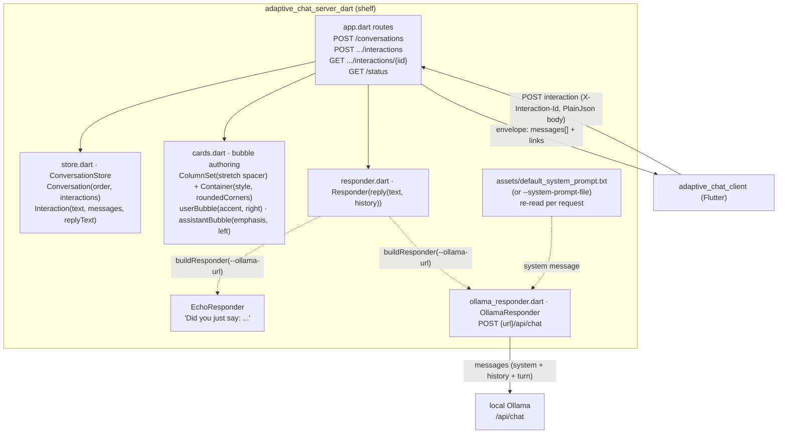
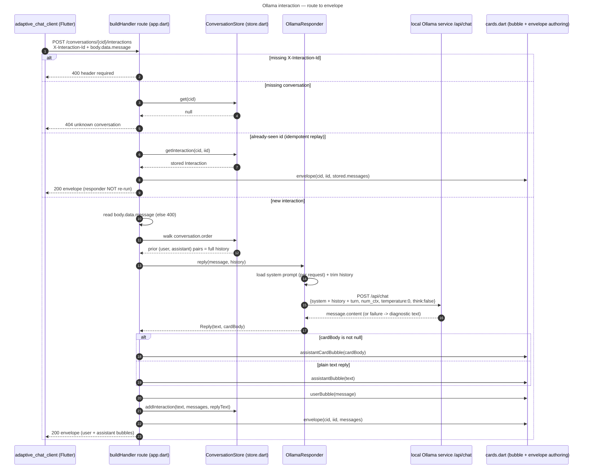

# adaptive_chat_server_dart

A Dart/`shelf` backend for the **Adaptive Chat** SDUI demo — a wire-compatible
port of [`adaptive_chat_server`](../adaptive_chat_server) (Python/FastAPI). It
authors the chat bubbles as Adaptive Cards, keeps conversation state in
memory, and answers either with a simple **echo** (default) or a local
**Ollama** chat model. Pairs with the Flutter client in
[`../adaptive_chat_client`](../adaptive_chat_client) — either backend serves
the same wire contract, so the client needs no changes to talk to this one
instead of the Python original.

Design notes: [`docs/superpowers/specs/2026-08-09-adaptive-chat-server-dart-design.md`](../docs/superpowers/specs/2026-08-09-adaptive-chat-server-dart-design.md).

## Architecture

The server is **authoritative for everything on screen**: it emits pre-styled
Adaptive Cards and the client renders them verbatim. Bubble alignment, fill,
and rounded corners live in the card JSON, so the look is a server concern.



### Wire contract

| Method & path                                 | Purpose                        | In                                                                | Out                                       |
| ---------------------------------------------- | ------------------------------- | ------------------------------------------------------------------ | ------------------------------------------ |
| `POST /conversations`                          | Start a session                 | —                                                                   | `{ conversationId, links: { postNext } }` |
| `POST /conversations/{cid}/interactions`       | Send one interaction             | header `X-Interaction-Id`; PlainJson invoke body (`data.message`) | `200` + **envelope**                       |
| `GET /conversations/{cid}/interactions/{iid}`  | Replay one interaction           | —                                                                   | **envelope**                               |
| `GET /status`                                  | Server + conversation snapshot   | —                                                                   | **status payload**                         |

Identical shape to `adaptive_chat_server`'s wire contract — see that
package's README for the full envelope/idempotency description, which applies
unchanged here.

### Components (`lib/src/`)

| File                     | Responsibility                                                                                                                                                  |
| ------------------------ | ------------------------------------------------------------------------------------------------------------------------------------------------------------- |
| `app.dart`                | shelf `Router`, CORS middleware, the `buildResponder`/`buildHandler` factories used by `bin/server.dart`.                                                     |
| `store.dart`              | In-memory `ConversationStore`; `Interaction` keeps the user `text`, the rendered `messages`, and the plain `replyText` (so chat history can be rebuilt).       |
| `cards.dart`              | Bubble authoring: `userBubble` (accent, right), `assistantBubble` (emphasis, left, Markdown text), `assistantCardBubble` (emphasis, left, embedded card), and `envelope(...)`. |
| `responder.dart`          | `Reply(text, cardBody, stats)`, the `Responder` interface (`Future<Reply> reply(text, history)`, `describe()`), and `EchoResponder`.                          |
| `card_detect.dart`        | `tryParseCardBody(raw) -> List<Map>?` — strict text-vs-card detection, same rules as the Python original.                                                     |
| `stats.dart`               | `InteractionStats` — one Ollama turn's token counts and timing breakdown; `fromOllamaResponse`, `statsToJson`.                                                |
| `status.dart`              | `buildStatus(store, responder)` — assembles the `GET /status` payload.                                                                                          |
| `ollama_responder.dart`    | `OllamaResponder` — system prompt, history trim, `POST /api/chat`, card-vs-text detection, duplicate-JSON-key guard, diagnostic error strings.                 |
| `assets/default_system_prompt.txt` | Bundled default system prompt (content-identical to the Python original).                                                                             |
| `assets/card_system_prompt.txt`    | Bundled **card** system prompt — select via `--system-prompt-file assets/card_system_prompt.txt`.                                                     |
| `assets/card_schema.json`          | Bundled schema for `--json-format schema`.                                                                                                             |
| `bin/server.dart`          | CLI entrypoint (`dart run bin/server.dart ...`) that selects the responder from `--ollama-url` and starts `shelf_io.serve`.                                    |

### Responder selection

`buildResponder(...)` returns an `OllamaResponder` when `--ollama-url` is
given, otherwise an `EchoResponder` — same rule as the Python original, minus
the env-var bridging trick (that existed only to survive uvicorn's `--reload`
subprocess re-import; this server has no `--reload` flag to begin with).

### Conversation context, context-fill logging, system prompt, card replies
(display-only), and structured output (`--json-format`)

All identical in behavior to `adaptive_chat_server` — see that package's
README sections of the same names for the full explanation (history
threading, `num_ctx`/`--history-turns` trimming, the three accepted card
fragment shapes, and the `none`/`json`/`schema` `--json-format` modes). This
port changes no behavior here, only the implementation language.

### Status endpoint

`GET /status` is a read-only operator snapshot, rendered **indented**
(`JsonEncoder.withIndent('  ')`) for human `curl`/browser reading; the chat
routes stay compact. Example payload:

```json
{
  "responder": {
    "kind": "ollama",
    "url": "http://127.0.0.1:11434",
    "model": "qwen2.5-coder:7b",
    "numCtx": 16384,
    "historyTurns": 10,
    "jsonFormat": "none",
    "systemPromptFile": "default_system_prompt.txt"
  },
  "conversationCount": 1,
  "conversations": [
    {
      "conversationRef": "9f2a7c1e4b03",
      "interactionCount": 1,
      "totals": { "promptTokens": 120, "replyTokens": 45, "totalTokens": 165 },
      "lastInteraction": {
        "stats": {
          "promptTokens": 120,
          "replyTokens": 45,
          "totalTokens": 165,
          "totalMs": 900,
          "loadMs": 0,
          "promptEvalMs": 100,
          "evalMs": 800,
          "tokensPerSecond": 56.3
        }
      }
    }
  ]
}
```

No message text and no usable conversation id appear in this payload —
`conversationRef` is a truncated sha256 of the conversation id, and
`systemPromptFile` is reduced to a bare filename. Unauthenticated, CORS
`allow_origins: *` — fine bound to `127.0.0.1` (the default); binding to
`0.0.0.0` would expose configuration metadata and conversation-volume data to
the network.

### Request flow




## Run

```bash
fvm dart pub get
fvm dart run bin/server.dart
```

CORS is enabled for local dev so the Flutter web client can reach it.

## Test

```bash
fvm dart test
```

Covers the store, bubble authoring, the routes (start/send/replay/status,
idempotency, validation), responder selection, card detection, token-stats
capture and the status payload, and the Ollama responder (mocked HTTP — no
live Ollama).

## Ollama (optional)

By default the server runs the echo demo (every reply is `"Did you just say:
..."`). To answer with a local [Ollama](https://ollama.com) chat model
instead:

```bash
ollama pull qwen2.5-coder:7b   # once, if you haven't already (the default model)
ollama serve                   # if it isn't already running

fvm dart run bin/server.dart --ollama-url http://127.0.0.1:11434 [--ollama-model qwen2.5-coder:7b]
```

**Use `127.0.0.1`, not `localhost`** — same IPv4/IPv6 caveat as
`adaptive_chat_server` on macOS.

```bash
fvm dart run bin/server.dart --ollama-url http://127.0.0.1:11434 \
  --system-prompt-file assets/card_system_prompt.txt \
  --json-format none \
  --num-ctx 16384 \
  --history-turns 10 \
  --port 8000
```

- `--num-ctx` (default 16384) — context window sent as `options.num_ctx`.
- `--history-turns` (default 10) — prior exchanges replayed to the model.
- `--json-format` (default `none`) — `none`/`json`/`schema`.
- `--host`/`--port` default to `127.0.0.1`/`8000`. `--log-level` defaults to
  `info`; use `debug` to see the raw model response content and
  card-detection result for each turn.

Omit `--ollama-url` to keep the echo demo.
