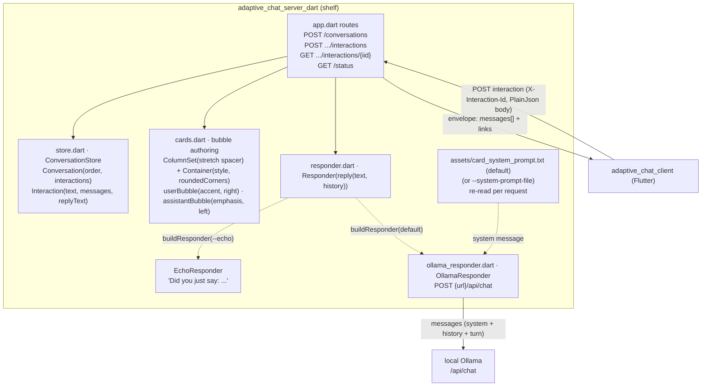
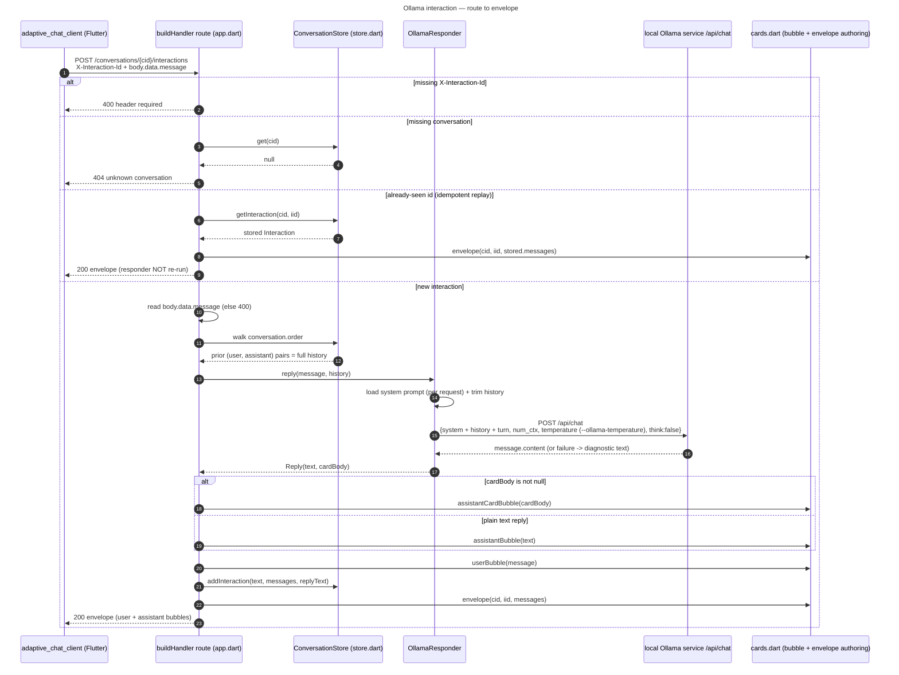
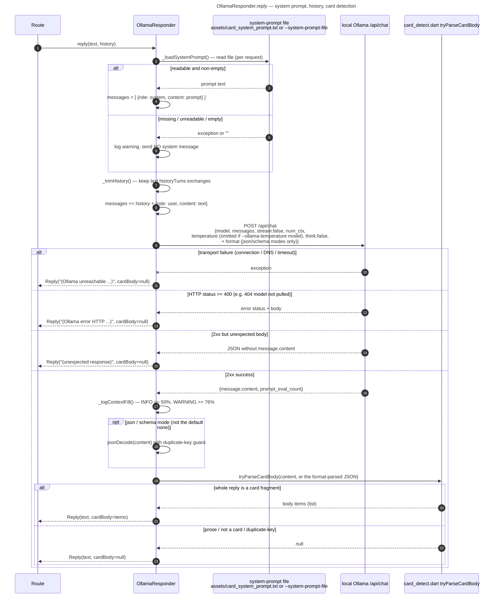

# adaptive_chat_server_dart

A Dart/`shelf` backend for the **Adaptive Chat** SDUI demo. It authors the
chat bubbles as Adaptive Cards, keeps conversation state in memory, and
answers with a local **Ollama** chat model (the default) or, with `--echo`, a
simple echo demo that calls no model at all. Pairs with the Flutter client in
[`../adaptive_chat_client`](../adaptive_chat_client).

This package started as a wire-compatible port of an earlier Python/FastAPI
prototype; that prototype has since been removed, and this Dart
implementation is now the only backend.

Design notes: [`docs/superpowers/specs/2026-08-09-adaptive-chat-server-dart-design.md`](../docs/superpowers/specs/2026-08-09-adaptive-chat-server-dart-design.md).

## Architecture

The server is **authoritative for everything on screen**: it emits pre-styled
Adaptive Cards and the client renders them verbatim. Bubble alignment, fill,
and rounded corners live in the card JSON, so the look is a server concern.



### Wire contract

| Method & path                                 | Purpose                        | In                                                                | Out                                       |
| --------------------------------------------- | ------------------------------ | ----------------------------------------------------------------- | ----------------------------------------- |
| `POST /conversations`                         | Start a session                | optional body `{ userLabel?, assistantLabel?, language? }`        | `{ conversationId, links: { postNext } }` |
| `POST /conversations/{cid}/interactions`      | Send one interaction           | header `X-Interaction-Id`; PlainJson invoke body (`data.message`) | `200` + **envelope**                      |
| `GET /conversations/{cid}/interactions/{iid}` | Replay one interaction         | —                                                                 | **envelope**                              |
| `GET /status`                                 | Server + conversation snapshot | —                                                                 | **status payload**                        |

**Bubble role labels:** `userLabel` / `assistantLabel` set the text shown
above each bubble (`cards.dart`) for the lifetime of the conversation —
sent once at `POST /conversations`, not per interaction, since they never
change mid-conversation. Both default to `user` / `assistant` when omitted.
`language` is stored on the conversation but not yet consumed by any
behavior.

**Expired conversations:** all state is in-memory, so restarting the server
strands any client still holding a `conversationId`. `POST
.../interactions` no longer 404s for an unknown id — it **auto-vivifies** a
fresh `Conversation` under that same id (default `user`/`assistant` labels;
the originals were lost too) and **prepends a "this conversation no longer
exists" notice card** to the envelope, ahead of the usual user/assistant
bubbles, so the transcript itself says what happened. The notice appears
exactly once — the interaction that discovers the id is gone — because every
later send on that id finds the auto-vivified conversation already there.
Its body comes from `assets/expired_conversation_notice.json` (falls back to
a small built-in message if that file is missing or invalid), editable
without recompiling. The **replay** route (`GET .../interactions/{iid}`)
does _not_ auto-vivify — it still 404s for an unknown conversation, since
there is no stored interaction to replay.

**`X-Chat-Notice` header policy:** when a response still carries a normal
`200` + a real card the client can render, but reflects something
noteworthy that happened server-side (not a client-facing error), that's
signalled with the `X-Chat-Notice` response header rather than the status
code or a body field — the status code answers "did the HTTP request
succeed," this header answers "here's extra context about the answer,"
which a client may read, log, or ignore. `conversation-recovered` is the
first value (set whenever the envelope's first message is the expired-
conversation notice, including on an idempotent replay of a stored
interaction that carried one); future cases of this kind should add a new
value here rather than a new header.

**Envelope:** `{ conversationId, interactionId, messages: [<AdaptiveCard>, ...], links: { self, postNext } }`.
`messages` is an ordered list of pre-styled cards (a right-aligned "you" bubble
and a left-aligned reply bubble). **Idempotent by `X-Interaction-Id`:** a
repeated id returns the stored envelope without re-running the responder —
including a retry that arrives while the first call is _still running_, which
joins the in-flight call and answers with its result rather than starting a
second one.

### Components (`lib/src/`)

| File                                      | Responsibility                                                                                                                                                                                                                                            |
| ----------------------------------------- | --------------------------------------------------------------------------------------------------------------------------------------------------------------------------------------------------------------------------------------------------------- |
| `app.dart`                                | shelf `Router`, CORS middleware, the `buildResponder`/`buildHandler` factories used by `bin/server.dart`.                                                                                                                                                 |
| `store.dart`                              | In-memory `ConversationStore`; `Interaction` keeps the user `text`, the rendered `messages`, and the plain `replyText` (so chat history can be rebuilt).                                                                                                  |
| `cards.dart`                              | Bubble authoring: `userBubble` (accent, right), `assistantBubble` (emphasis, left, Markdown text), `assistantCardBubble` (emphasis, left, embedded card), `noticeCard` (attention, no role label — the expired-conversation notice), and `envelope(...)`. |
| `expired_conversation.dart`               | `loadExpiredConversationBodyItems(path)` — reads the bundled notice body, falling back to a built-in message if the asset is missing/invalid.                                                                                                             |
| `responder.dart`                          | `Reply(text, cardBody, stats)`, the `Responder` interface (`Future<Reply> reply(text, history)`, `describe()`), and `EchoResponder`.                                                                                                                      |
| `card_detect.dart`                        | `tryParseCardBody(raw) -> List<Map>?` — strict text-vs-card detection (see **Card replies** below).                                                                                                                                                       |
| `stats.dart`                              | `InteractionStats` — one Ollama turn's token counts and timing breakdown; `fromOllamaResponse`, `statsToJson`.                                                                                                                                            |
| `status.dart`                             | `buildStatus(store, responder)` — assembles the `GET /status` payload.                                                                                                                                                                                    |
| `ollama_responder.dart`                   | `OllamaResponder` — system prompt, history trim, `POST /api/chat`, card-vs-text detection, duplicate-JSON-key guard, diagnostic error strings.                                                                                                            |
| `assets/default_system_prompt.txt`        | Bundled **Markdown** system prompt — opt in via `--system-prompt-file assets/default_system_prompt.txt`.                                                                                                                                                  |
| `assets/card_system_prompt.txt`           | Bundled **card** system prompt — the default; no flag needed.                                                                                                                                                                                             |
| `assets/card_schema.json`                 | Bundled schema for `--json-format schema`.                                                                                                                                                                                                                |
| `assets/expired_conversation_notice.json` | Bundled notice card body for an auto-vivified (expired) conversation.                                                                                                                                                                                     |
| `cli.dart`                                | `buildArgParser()` / `resolveLogLevel()` — the flag set, defaults, and allowed values. In `lib/` so the CLI surface is reachable from tests.                                                                                                              |
| `bin/server.dart`                         | CLI entrypoint (`dart run bin/server.dart ...`) that selects the responder (Ollama by default, echo with `--echo`) and starts `shelf_io.serve`.                                                                                                           |

### Responder selection

`buildResponder(...)` returns an `OllamaResponder` when it is given a URL, and
an `EchoResponder` when the URL is `null`. `--ollama-url` defaults to
`http://127.0.0.1:11434`, so the server talks to Ollama unless you pass
`--echo`, which withholds the URL and selects the echo demo.

### Conversation context

Server state is **keyed by `conversationId`** — the top level of
`ConversationStore` is a map of `cid -> Conversation`, and each `Conversation`
holds its `Interaction`s keyed by `interactionId`. So it is a **two-level key**
(`cid` -> `iid`): the client-supplied `X-Interaction-Id` namespace is scoped
**inside** one conversation, and the same `i_0001` can exist in two
conversations without collision. All state is in-memory and lost on restart
(fine for a demo; not shared across worker processes).

**How history reaches the model.** On each `POST …/interactions`, the route
rebuilds the conversation's history from the store — walking
`conversation.order` and emitting a `(user, text)` / `(assistant, replyText)`
pair per prior interaction — and passes it to `responder.reply(text, history)`
with the **full** history. `OllamaResponder` then sends **system prompt +
history + current turn** to `/api/chat` (see the request-flow diagrams above)
— trimmed to a recent window as described next. Because history is built from
one conversation's `order`, each `conversationId` gets an independent context.

**Retained in full; trimmed only on send.** The store keeps the **entire**
conversation (durable log + idempotent replay). What is bounded is only the
prompt **sent to Ollama**: `OllamaResponder` replays just the last
`--history-turns` exchanges (default 10). Nothing is pruned from the store, so
raising `--history-turns` or `--num-ctx` later needs no data migration.

**Failed turns are excluded.** When a turn fails (Ollama unreachable, timed
out, an HTTP error, or an unreadable response), the user still sees the
diagnostic bubble and the interaction is still stored and replayable — but the
whole exchange is **skipped** when history is rebuilt for the next request.
Otherwise the model would read `"(Ollama unreachable …)"` as something it once
said and carry that into every later turn. The exchange is dropped whole
rather than user-turn-only, so the model is never left an unanswered question
to explain.

**Startup preflight.** When `--ollama-url` is set, the server asks Ollama for
its model list (`/api/tags`) before serving and logs the result: an `INFO`
line naming the model when all is well, or a `SEVERE` line distinguishing
"Ollama unreachable" from "model not pulled" (with the `ollama pull` command
and the list of models that _are_ available). It **starts either way** — an
Ollama brought up after the server still works — but the operator learns
about a misconfiguration at launch rather than on the first message.

**Reply timeout.** `--ollama-timeout` (seconds, default 60) bounds one
`/api/chat` call. It is sized for a model **load**, not a **download**:
`/api/chat` never pulls a missing model (it 404s, which the preflight above
catches first), so the budget only covers reading an already-present model
into memory and generating one reply — a minutes-long `ollama pull` is
out-of-band and never waited on here. A cold load of a large model plus a
full context window can still exceed 60s; raise the flag rather than assuming
the server is unreachable. The effective value is reported by `GET /status`
as `timeoutSeconds`.

**Model residency.** Every request sends `keep_alive` (default `30m`,
`--keep-alive`), overriding Ollama's 5-minute default. An idle chat otherwise
pays a full model reload on its next message — measured at roughly 20× the
warm load time on a 7B model. `--keep-alive 0` unloads immediately;
`--keep-alive -1` keeps the model resident indefinitely.

**Context-fill logging.** The server sends an explicit `options.num_ctx`
(default 16384) and, after each reply, logs the actual prompt tokens
(`prompt_eval_count`) against that window: an `INFO` line at ≥ 50% fill and a
`WARNING` at ≥ 76% (leaving headroom for the generated reply). This surfaces
the otherwise-silent truncation Ollama performs once a prompt exceeds
`num_ctx`. (`EchoResponder` ignores history entirely — it only echoes the
current turn.)

### System prompt

Every Ollama request is prefixed with a `{"role": "system", ...}` message so
the model's behavior and output formatting can be tuned without code changes.
The prompt text comes from a file:

- **Source.** `--system-prompt-file <path>`. When omitted, the bundled
  [`assets/card_system_prompt.txt`](assets/card_system_prompt.txt) is used, so
  replies are Adaptive Cards by default. Pass
  [`assets/default_system_prompt.txt`](assets/default_system_prompt.txt) for
  Markdown-only replies — the two produce entirely different output, measured
  at 8/8 cards versus 0/8 on the same model at `t=0`.
- **Live reload.** The file is re-read on **every request**, so editing the
  active prompt file takes effect on the next turn without restarting the
  server.
- **Missing / empty is not fatal.** If the file is unreadable or blank, the
  server logs a warning and sends the request with **no** system message
  rather than failing the chat.
- **Formatting guidance.** Replies render inside an Adaptive Cards
  `TextBlock`, which supports GitHub-flavored Markdown (headings,
  bold/italic, links, lists, blockquotes, inline/fenced code, and tables).
  The default prompt tells the model to keep replies concise and to use
  tables sparingly, since bubbles are narrow.
- **Echo mode ignores it.** The system prompt only applies to
  `OllamaResponder`; `EchoResponder` never sends anything to a model.

### Card replies (display-only)

Instead of Markdown text, the model may answer with an Adaptive Card fragment
that gets embedded directly in the assistant bubble (`assistantCardBubble`),
using the same alignment/fill/rounded-corner chrome as a text reply. Which
shape wins is decided per reply by `card_detect.dart`'s `tryParseCardBody`:
the **entire** message must be a full `{"type": "AdaptiveCard", "body": [...]}`
object or a bare, non-empty JSON array of objects, or it's rendered as
Markdown text instead.

To opt in, select the bundled card system prompt:

```bash
fvm dart run bin/server.dart --ollama-url http://127.0.0.1:11434 \
  --system-prompt-file assets/card_system_prompt.txt
```

The card prompt's palette is intentionally small:

- **Inputs** — `Input.Date`, `Input.Toggle`, `Input.ChoiceSet` (`style: compact` /
  `expanded`, `isMultiSelect`), `Input.Text`, `Input.Number`, `Input.Time`.
- **Display** — `TextBlock`, `FactSet`, `Badge`, `Carousel`, `ColumnSet`, `Table`,
  `Rating`, `Icon`, `ProgressBar`, `ProgressRing`, `CodeBlock`, `Image`.
- **Charts** — `Chart.Pie`, `Chart.Donut`, `Chart.VerticalBar`,
  `Chart.HorizontalBar`, `Chart.Line`, `Chart.Gauge`. The two multi-series
  types (`Chart.VerticalBar.Grouped`, `Chart.HorizontalBar.Stacked`) are
  deliberately not advertised: they need a nested
  `{legend, values:[{x,y}]}` shape, the most error-prone JSON in the palette.

**Display-only.** The prompt forbids `Action`/`ActionSet` elements, so the
card fragment carries no submit button of its own, and any values a user
enters into its inputs do not post back to the server — the fragment is
render-only for now.

**Charts need a chart-aware client.** `Chart.*` elements render only if the
client registered `flutter_adaptive_charts_fs` — `adaptive_chat_client` does
this in `lib/src/chat_card_registry.dart`. A client without it renders each
chart as a broken-image icon and a `Type Chart.Pie not found` message, not a
blank space, so the failure is visible but ugly.

### Structured output (`--json-format`)

By default (`--json-format none`), card JSON comes from prompt engineering
alone. With a capable model (e.g. `qwen2.5-coder:7b`) at temperature 0 —
which the server sends on every request — the prompt reliably produces valid
cards, so no `format` constraint is needed.

```bash
fvm dart run bin/server.dart --ollama-url http://127.0.0.1:11434 \
  --json-format none   # default; try --json-format schema or --json-format json
```

- `none` (default) — prompt-only, no `format` field sent. Reliable with a
  capable model at temperature 0.
- `json` — constrains syntax only (any valid JSON value); shape is still
  checked by `card_detect.dart` after parsing.
- `schema` — constrains both syntax and the outer reply shape via Ollama's
  `format` field against `assets/card_schema.json` (a small schema covering
  exactly the shapes `tryParseCardBody` accepts). A safety net for
  weaker/other models, at some latency cost.

> [!WARNING] > **`format` is not honored by every model, and Ollama does not say so.**
> Ollama accepts the `format` field for any model but applies it only for
> some; when it doesn't, you get an ordinary `200` with unconstrained text
> and no error. Measured: `format: "json"` with the prompt "Say hello in
> plain English prose" returns `{"text":"Hello!"}` on `qwen2.5-coder:7b` but
> plain prose on `qwen3.6:27b-coding-nvfp4` — so `--json-format json|schema`
> is **inert on that model** and buys nothing over `none`. The responder logs
> a `WARNING` naming the model whenever a reply fails to parse as JSON in
> `json`/`schema` mode, which is the symptom. Check a candidate model with a
> one-line `curl` before relying on the constraint, or run
> [`tool/model_probes/json_format_probe.dart`](tool/model_probes/README.md),
> whose canary answers exactly this question.

### Status endpoint

`GET /status` is a read-only operator snapshot, rendered **indented**
(`JsonEncoder.withIndent('  ')`) for human `curl`/browser reading; the chat
routes stay compact. Example payload:

```json
{
  "responder": {
    "kind": "ollama",
    "url": "http://127.0.0.1:11434",
    "model": "qwen2.5-coder:7b",
    "numCtx": 16384,
    "historyTurns": 10,
    "jsonFormat": "none",
    "systemPromptFile": "card_system_prompt.txt",
    "keepAlive": "30m",
    "timeoutSeconds": 60,
    "temperature": 0.0
  },
  "conversationCount": 1,
  "conversations": [
    {
      "conversationRef": "9f2a7c1e4b03",
      "interactionCount": 1,
      "totals": { "promptTokens": 120, "replyTokens": 45, "totalTokens": 165 },
      "lastInteraction": {
        "stats": {
          "promptTokens": 120,
          "replyTokens": 45,
          "totalTokens": 165,
          "totalMs": 900,
          "loadMs": 0,
          "promptEvalMs": 100,
          "evalMs": 800,
          "tokensPerSecond": 56.3
        }
      }
    }
  ]
}
```

No message text and no usable conversation id appear in this payload —
`conversationRef` is a truncated sha256 of the conversation id, and
`systemPromptFile` is reduced to a bare filename. Unauthenticated, CORS
`allow_origins: *` — fine bound to `127.0.0.1` (the default); binding to
`0.0.0.0` would expose configuration metadata and conversation-volume data to
the network.

### Request flow





## Run

```bash
fvm dart pub get
fvm dart run bin/server.dart
fvm dart run bin/server.dart --help   # every flag, with defaults
```

`--help` (or `-h`) prints the full flag list and exits without starting a
server; an unrecognised flag prints the same usage and exits `2`.

CORS is enabled for local dev so the Flutter web client can reach it.

**macOS: allow Chrome on the local network.** The first time the Flutter web
client (running in Chrome) calls this server, macOS may silently block the
connection until Chrome is enabled under **System Settings → Privacy &
Security → Local Network**. If the app loads but every send fails with a
connection error, toggle **Google Chrome** on there.

**macOS native client** (`adaptive_chat_client` run with `-d macos`) hits the
same "unable to connect" symptom for a _different_ reason: its App Sandbox
needs the `com.apple.security.network.client` entitlement to make outbound
calls. That is enabled in the client's `macos/Runner/*.entitlements`; see the
client's [`README`](../adaptive_chat_client/README.md#run) — it requires a
full rebuild, not the system-settings toggle above.

## Test

```bash
fvm dart test
```

Covers the store, bubble authoring, the routes (start/send/replay/status,
idempotency, validation), responder selection, card detection, token-stats
capture and the status payload, and the Ollama responder (mocked HTTP — no
live Ollama).

## Known gaps

Found while validating this server against a live Ollama. None is a blocker
for the demo; they are recorded so they are not rediscovered from scratch.

**Card detection is over-permissive.** `tryParseCardBody` accepts _any_ JSON
object carrying a non-empty `type` string as a single card element, so a
model reply like `{"type":"greeting","text":"hi"}` renders as an unknown
element instead of falling back to readable text. The fix is small; the open
question is what to validate `type` against — the full Adaptive Cards element
set (precise, but drifts from the library) or the palette the card system
prompt actually advertises (narrower, but couples detection to prompt text).

**Conversation state grows without bound.** `ConversationStore` never evicts:
neither conversations nor the interactions inside them, and `GET /status`
reports every conversation, so that payload grows too. Fine for a demo that
gets restarted; the design question for a fix is that trimming old
interactions breaks idempotent replay for those ids — a client retrying an
evicted `X-Interaction-Id` would re-run the model.

**Card replies inflate the prompt.** A card reply's `replyText` is the raw
card JSON, so it is replayed verbatim as history. Bounded by
`--history-turns` (steady state measured around 5.4k of a 16384 window), so
this is a prompt-evaluation cost rather than a correctness problem.

**Unverified:** `prompt_eval_count` may under-report context fill when Ollama
caches a prompt prefix across turns, which would let the 50% / 76% log tiers
stay quiet while the window fills. A 3-turn run did _not_ show this. Confirm
over a long conversation before acting on it.

### Requested enhancements

Wanted, not yet built.

**A debug flag that logs the outgoing envelope.** `--log-level debug` today
surfaces the raw _model_ content and the card-detection outcome
(`ollama_responder.dart`), but the **response JSON actually sent to the
client** is never logged — so diagnosing a rendering problem means capturing
it from the client or a proxy. Worth its own switch rather than folding into
`debug`, because envelopes embed full card JSON and are large enough to bury
the other debug lines.

### Not planned

**Streaming.** Replies are requested with `stream: false`, so the client shows
nothing until generation completes. Beyond the wire contract, card detection
needs the _complete_ message to decide text-vs-card — a partial card fragment
is invalid JSON — so streaming would benefit text replies only, and would
need either a visible bubble swap when a finished reply turns out to be a
card, or committing to a mode up front. Treated as an enhancement, not a gap.

## Ollama (the default)

The server calls a local [Ollama](https://ollama.com) chat model unless told
otherwise, so it needs one running:

```bash
ollama pull qwen2.5-coder:7b   # once, if you haven't already (the default model)
ollama serve                   # if it isn't already running

fvm dart run bin/server.dart   # --ollama-url defaults to http://127.0.0.1:11434
```

If Ollama is unreachable the server still starts, logs a `SEVERE` preflight
failure naming both remedies, and returns that diagnostic as the reply text —
so the error shows up in the chat bubble rather than as a refused connection.
Fix it by starting Ollama, or run without a model at all:

```bash
fvm dart run bin/server.dart --echo   # every reply is "Did you just say: ..."
```

**Use `127.0.0.1`, not `localhost`.** With Ollama's "expose to the network"
setting off, Ollama binds IPv4 `127.0.0.1` only; on macOS `localhost` often
resolves to IPv6 `::1` first, so `http://localhost:11434` fails to connect
even though Ollama is running.

**Diagnostics.** Every reply logs to the server console: the selected
responder at startup, each outgoing `POST …/api/chat`, and — on failure —
the exception. Failures are reported distinctly rather than all as
"unreachable": a connection failure returns `"(Ollama unreachable at … —
<error>)"`, a **timeout** (Ollama is alive but slow — usually a cold model
load or a long generation) returns `"(Ollama timed out after Ns at …)"`, an
HTTP error (e.g. the model isn't pulled → 404) returns `"(Ollama error HTTP
404 at …: <body>)"`, and an unexpected 2xx body returns `"(Ollama returned an
unexpected response: …)"`.

None of these diagnostics is threaded back into the conversation — see
**Failed turns** under Conversation context.

```bash
fvm dart run bin/server.dart --ollama-url http://127.0.0.1:11434 \
  --system-prompt-file assets/card_system_prompt.txt \
  --json-format none \
  --num-ctx 16384 \
  --history-turns 10 \
  --port 8000
```

- `--num-ctx` (default 16384) — context window sent as `options.num_ctx`.
- `--history-turns` (default 10) — prior exchanges replayed to the model.
- `--json-format` (default `none`) — `none`/`json`/`schema`.
- `--ollama-temperature` (default 0) — sent as `options.temperature`. `0`
  selects greedy decoding, which minimizes malformed card JSON; the trade-off
  is that a card the model gets wrong at 0 is usually wrong the same way on
  every retry. Pass `model` to send no temperature at all, letting the
  model's own Modelfile default apply. The effective value is reported by
  `GET /status`.

  **Prefer the default 0 unless a specific model measures better.** A model's
  shipped temperature is tuned for general chat, not for strict-JSON output.
  Measured on `qwen3.6:27b-coding-nvfp4` (Modelfile default `0.6`) against
  the real `card_detect.dart` bar: 12/15 hard cases at `0` versus 9/15 at
  `0.6`, with `0.6`'s extra failures being long card JSON truncated
  mid-generation. Both settings passed 7/7 easy cases, so the difference only
  shows on large or nested cards. Re-measure for a new model with
  [`tool/model_probes/`](tool/model_probes/README.md) rather than assuming
  either way.

- `--host`/`--port` default to `127.0.0.1`/`8000`. `--log-level` defaults to
  `info`; use `debug` to see the raw model response content and
  card-detection result for each turn.

Omit `--ollama-url` to keep the echo demo.

## Evaluating a model (`tool/model_probes/`)

Whether a given model produces renderable cards, which temperature suits it,
and whether it honors `--json-format` are **empirical** questions — and each
has already produced a wrong answer when reasoned about instead of measured.
[`tool/model_probes/`](tool/model_probes/README.md) holds hand-run scripts
that answer them against a local Ollama, judging replies with this server's
own card detection so the numbers match what the server would do.

```sh
cd adaptive_chat_server_dart
fvm dart run tool/model_probes/temperature_matrix.dart --model <tag>
fvm dart run tool/model_probes/json_format_probe.dart --model <tag>
fvm dart run tool/model_probes/prompt_ab.dart --candidate <edited-prompt.txt>
```

The card system prompt is the server's only lever over reply _shape_, so a
wording change is measured the same way: `prompt_ab.dart` runs the current
`assets/card_system_prompt.txt` and an edited copy over the same prompts and
prints both pass rates.

They are not part of `dart test` and never run in CI: they need a local
Ollama, take minutes, and inform a human decision rather than gating a build.

Results are recorded in [`ModelBehavior.md`](ModelBehavior.md) — which model to
reach for, which ones silently ignore `--json-format`, and which settings beat
their own vendor defaults. Read it before probing: the answer may already be
there, and a finding that contradicts it is worth knowing about.
