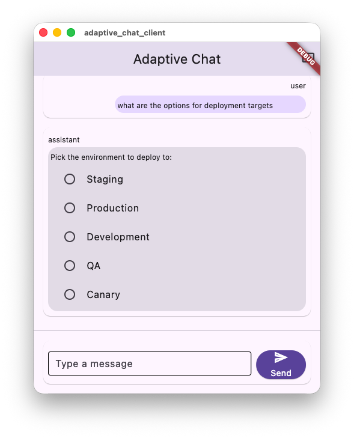

# An SDUI demo that turned into a local-model benchmark

[`freemansoft/Flutter-AdaptiveCards`](https://github.com/freemansoft/Flutter-AdaptiveCards)
is a Flutter renderer for Adaptive Cards. The project includes a demonstration Flutter chat client and Dart chat server.
Enter a question in the client. It goes to the Dart server, which asks a local model running on Ollama
to answer in Adaptive Card JSON. The server decides whether the reply is a card or ordinary text and forwards
the card body; the client renders it as a server-driven UI (SDUI) whose payload was generated by a language
model rather than by a backend programmatic service.

It is a demo architecture and not a production one. A production system
would more likely use the model for intent detection, which would then be
mapped to an API call that returns structured domain data, with a deterministic
mapping layer turning that into a card. The demo is thin without any real application
tier, instead relying on the model for JSON card creation.

## The model's reply is the UI, not text about it

Adaptive card generation works as a test problem for local models, and the
results carry beyond this demo to any workload that asks a local model for
constrained, schema-shaped JSON. The demo became an instrumented test bed. The measurement sweeps execute
probes that run against each model in turn. The sweeps were built to score the models, and what
they turned up kept changing the chat server.

_`qwen2.5-coder:7b`, unedited model output rendered by the demo client in
[`adaptive_chat_client/`](https://github.com/freemansoft/Flutter-AdaptiveCards/tree/main/adaptive_chat_client)._

## Answering in cards applies four constraints at once

Producing an Adaptive Card imposes four response requirements in each reply:

- Strict JSON.
- A closed element vocabulary. An element is an Adaptive Card component type,
  `Input.ChoiceSet`, `Table`, `TextBlock`. The reply may use no others.
- An SDUI component shape chosen to fit the question.
- Format stability across a multi-turn conversation, retaining the use of cards.

Each of the four has pass/fail gates. The JSON parses, or it does not.
The element type is either in the Adaptive Cards palette, or it is not.
The shape either answers
the question, a pick-from-a-set question wants a control the user can click,
or it does not. The format either survives the conversation's prior turns or
drifts back to Markdown. That combination is what made this workload worth
measuring.

## Clean prose on usability sets but one valid card in twenty-five

Two of the three test sets, `everyday` and `stress`, ask only whether a reply
comes back usable. The card system prompt permits a plain Markdown answer when
no element type fits the question, so those sets pass a reply that renders as a
card or as clean prose; only a broken card fails. A model that answers
everything in tidy Markdown clears them without ever building a card.
`llama3-chatqa:8b` does close to that, at **21/21** on the everyday set with 2
cards to 19 prose, **10/10** on the stress set with 0 cards and 10 prose.

The third test set `shape` asks the stricter question: did the reply use the
element type the question called for, a clickable control for a pick-from-a-set
question or a table for tabular data? The same model produces it on **4 of 25**
cases when the question is the first turn, and **1 of 25** when a single
prose exchange precedes it.

The two figures do not conflict; they measure different things. That is the
generalizable result: renderable prose is not always a pass. An options question
answered as a Markdown list renders perfectly and still cannot be clicked, which
no JSON-validity check catches.

## The server decides card-vs-prose; only the client catches a bad element type

The probes send fixed question sets to a model over Ollama's `/api/chat`. Three
different things then inspect the reply, in three different places, and keeping
them straight is what makes the scores below mean anything.

The **server** runs its card detector on every reply in the request path: it
decides card-vs-prose, recasts certain near-miss patterns into a valid card
JSON string, and extracts the body array it forwards to the client. The server
never renders a card, because generation is Ollama's job and rendering is the
client's. The
probe scripts in
[`tool/model_probes`](https://github.com/freemansoft/Flutter-AdaptiveCards/tree/main/adaptive_chat_server_dart/tool/model_probes)
import that same detector rather than reimplementing it, so a probe cannot score
a reply as a card that the running server would have shown as prose. A probe
applying its own definition could report a pass rate the running server disagrees
with, which is worse than no measurement at all.

The **server, and only the server**, then checks the element vocabulary. It
reads the legal type list out of the shipped card schema and walks the body at
any depth. It warns and forwards the card to the client anyway, and no probe
calls it.

The **client** does the real Adaptive Cards interpretation, converting a JSON card into a widget tree, a `type`
into a widget, and it is the only place a bad type is caught, as an invisible
blank. Nothing upstream stops it: an invented type is valid JSON inside a
well-formed card, so it clears the server's detector and scores as a card on
every set except a shape case that names the element it expects. That is the one
user-visible failure no number in this series counts; the measurement-hygiene
article carries the rest.

Neither server-side check was part of the initial server prototype. Both checks
grew out of the sweeps, one observed reply at a time. The detector accepts
three response shapes that can be cards

- a whole
  `AdaptiveCard` object
- a bare array of Adaptive Card elements
- a single Adaptive Card element

because
local models emit all three. It restores missing enclosing brackets, because a
small model asked for two elements often writes them comma-separated with no
array around them. It attempts a plain parse before stripping Markdown fences,
because the fence-stripping itself had truncated a valid card whose own text
opened a fenced code block. It reports why a JSON-looking reply was rejected,
because "not a card" is not a log line anyone can act on. The vocabulary check
exists because sweeps kept producing replies that passed every check and still
rendered blank. Measuring the models rewrote the server as much as it ranked
them.

## Three test sets, and the condition every score carries

Everything here was measured against a local Ollama on an Apple
M1 Max with 64 GB. A later article runs the same benchmark
on a second machine.

Three sets produce the scores:

| Set (script)                         | How the denominator is built                                                | What it asks                                                                                                                                                          | What it is for                               |
| ------------------------------------ | --------------------------------------------------------------------------- | --------------------------------------------------------------------------------------------------------------------------------------------------------------------- | -------------------------------------------- |
| Everyday (`temperature_matrix.dart`) | 7 requests × 3 temperatures (`0`, `0.2`, `0.6`) = **21**                    | One ordinary request per common reply shape                                                                                                                           | Is this model usable at all?                 |
| Stress (`temperature_stress.dart`)   | 5 cases × 2 temperatures (`0`, `0.6`) = **10**                              | The five requests that actually break: code, big table, nested form, escaped strings, two structures in one reply                                                     | Which model or setting should we ship?       |
| Shape (`shape_ab.dart`)              | **25** prompt test cases, scored cold-start and with history, `--samples 2` | Did the reply use one of the element types that would answer this question? Each case names its own accepted set, since more than one element is often equally right. | Does the card do the job the question asked? |

One question from each, to make the escalation concrete:

- **Everyday**: "What size shirt should I order? Offer S, M, L, XL."
- **Stress**: "Build me a full expense report form: a title, a date picker, an
  amount field, a category dropdown with 6 categories, a multiline notes box,
  and submit/cancel buttons."
- **Shape**: "what are my options for deployment targets", whose accepted set
  is a single element: it passes only on an `Input.ChoiceSet`.

**A one-point difference between two models is noise, not a ranking.** A
re-measurement moved ten of twelve otherwise-steady models by ±1 with nothing
about them changing. Shape figures are `--samples 2` where every case is run twice and
scored a pass only if both runs passed, so one borderline call takes the whole
case, while everyday and stress run each case once, at `--samples 1`.

Cold start and with history are the shape probe's two conditions. On
`qwen2.5-coder:7b` at `t=0`, "what are my options for deployment targets"
answers with an `Input.ChoiceSet` when it is the first thing asked. Put
**one** ordinary exchange ahead of it, a question answered in Markdown, and
the same question comes back as 867 characters of Markdown; with two exchanges, 903. No card either time.

Losing the recipe for creating cards does not require a long conversation.
Model replies appear to follow the format the conversation is already in, so a
question that would have produced a card can come back as prose once prose is
what precedes it. That is a per-question effect rather than a latch: the same
model with that same history still produces the right element on 18 of 25
shape cases. A cold-start score therefore describes a condition most users are
not in, which is why every score below carries its condition.

The table has three rows because those are the three sets that score a _model_.
The probe directory holds others that ask different questions: `prompt_ab.dart`
holds the model fixed and A/B-tests two card system prompts against each other
over the same user prompts, which the tuning article uses to catch a prompt edit
that regressed, and `tool_call_probe.dart`, used further down, asks whether a
model will return a card through Ollama's tool channel instead of as message
text.

## Shape coverage runs from 25/25 to 1/25 across fifteen models

Before any score: these are all measured on the configuration the server ships,
`t=0` (temperature zero), `think: false` (no chain-of-thought preamble), and
a synthetic two-turn card seed prepended to the context. What that seed is worth varies by model, from +10 shapes to −2, and a
later article measures it model by model. Read the figures below as seeded
figures.

With-history shape coverage across the fifteen models measured runs from
**25/25 to 1/25**. Six of them:

| Model               | Size    | Cold-start | With history |
| ------------------- | ------- | ---------- | ------------ |
| `gpt-oss:20b`       | 12.8 GB | 25/25      | 25/25        |
| `qwen3.8:27b-nvfp4` | 16.9 GB | 24/25      | 24/25        |
| `granite4.1:8b`     | 5.0 GB  | 23/25      | 21/25        |
| `qwen2.5-coder:7b`  | 4.4 GB  | 20/25      | 18/25        |
| `llama3.2:latest`   | 1.9 GB  | 15/25      | 15/25        |
| `llama3-chatqa:8b`  | 4.3 GB  | 4/25       | 1/25         |

**Model size does not predict shape coverage.** `granite4.1:8b` at 5.0 GB scores
21/25 with history, matching two models four times its size. Size does not
predict speed either, but a speed figure needs its host and its Ollama version
named, so a later article reports that comparison.

**Cold start does not predict with-history performance, in either direction.**
Five of the fifteen score the same under both conditions, two gain a shape with
history
(`hf.co/unsloth/Nemotron-3-Nano-30B-A3B-GGUF:latest` and
`nemotron-3.5-lightning:30b`), and three lose two (`granite4.1:8b`,
`qwen2.5-coder:7b`, and `nemotron-3-nano:4b`). Judge on the with-history column,
because that is the condition a user is in.

Everything above depends on finding JSON inside a text reply. The detector
exists because that is unreliable. Ollama offers a way to avoid it, called tool
calling.

It works like this. The server tells the model about one function,
`render_adaptive_card`, and says the model may call it. A model that takes the
offer does not write a reply at all. It asks to call that function, and the card
is the data it passes to the call. Ollama hands that back in a field of its own,
already parsed, separate from the message text. That field is the tool
channel. Nothing is
left in the text for the server to fish out.

Not every model can do this, and ones that cannot do not say so. The model
answers with ordinary text. A model that _can_ call functions may also never
pick this one. `tool_call_probe.dart` sorts the fifteen models four ways, and
nothing in the scores above predicts where a model lands.

| Models | Offered the card function, the model     | What comes back                   |
| ------ | ---------------------------------------- | --------------------------------- |
| **8**  | calls it                                 | A parsed card, no JSON to recover |
| **3**  | can call functions, but never picks it   | An ordinary text reply            |
| **2**  | calls it even when the question is prose | A card nobody asked for           |
| **2**  | cannot call functions at all             | An ordinary text reply            |

One of the three that never picks the card function was trained specifically for
tool use. One of the two that cannot call functions at all is the model the
server ships as its default.

For low-memory machines, the best-performing model
is `granite4.1:8b`: 21/25 with history in 5.0 GB. Hardware is the
constraint behind that recommendation: seven of the fifteen models do not fit a
16 GB host at all. A later article names those seven and measures what the
smaller machine costs.

## A busy machine and a slow model look identical to a probe

The first version of one shape test sweep omitted the step that unloads each
model before the next one loads. Probes send `keep_alive: 30m`, so the finished
model stayed resident while the next loaded, two models sat in memory together,
and Ollama thrashed between them. `granite4.1:3b` recorded **52 stalled calls**
and scored 12/25 with history where an idle machine gives **17/25**. With the
unload in place the sweep took **7 minutes instead of 124**.

Nothing about the model changed between those two runs. The wrong measurement
looked exactly like a slow model, because from the probe's side a reply that
takes too long is a reply that takes too long, whatever the reason. Every figure
in this article was collected with **one model resident at a time**: load a
model, run all of its probes, record the result, unload, move on.

## Four things generalize past this demo

Test the shape your workload actually
needs rather than a chat benchmark, because a model can sweep one and fail the
other. Judge replies with the same detector your server actually runs, not with
a second definition of correct. Measure with conversation history, not only cold
start, since one prose exchange was enough to change the answer here. And state the
test set and the condition beside every score, because `18/25` without them is
not interpretable.

Four articles follow: the tuning process: fourteen levers tried on this
workload, which shipped, and what is still open; the two-host comparison, the
same benchmark on a 64 GB M1 Max and a 16 GB M5; and then the tool channel and
measurement hygiene.

The project is at
[https://github.com/freemansoft/Flutter-AdaptiveCards](https://github.com/freemansoft/Flutter-AdaptiveCards),
and the lab notebook every figure above is drawn from is at
[https://github.com/freemansoft/Flutter-AdaptiveCards/blob/main/adaptive_chat_server_dart/ModelBehavior.md](https://github.com/freemansoft/Flutter-AdaptiveCards/blob/main/adaptive_chat_server_dart/ModelBehavior.md).
