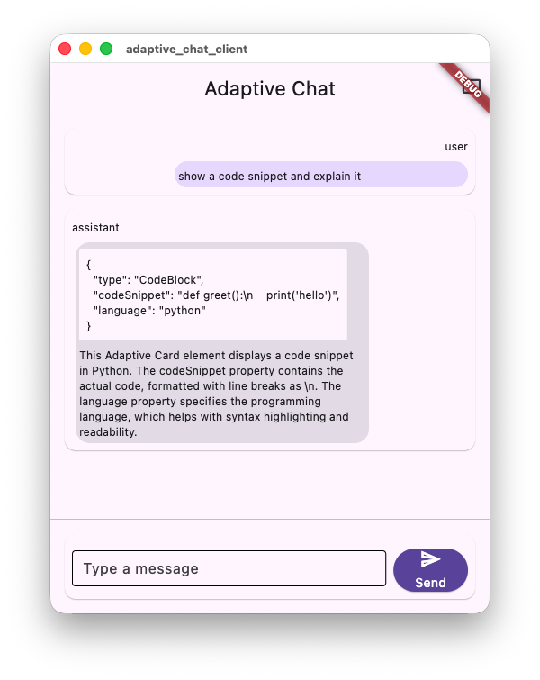
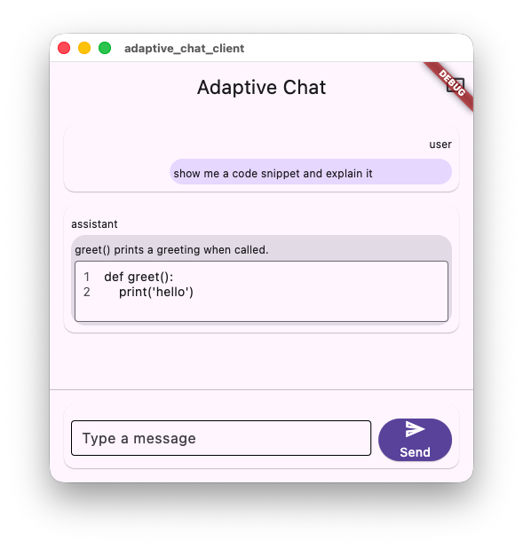

# We tried 14 levers to get reliable card JSON from a local model

In
[`freemansoft/Flutter-AdaptiveCards`](https://github.com/freemansoft/Flutter-AdaptiveCards)
a demonstration Dart chat server hands a question to a local Ollama model, asks for the answer
as Adaptive Card JSON, and a Flutter client app renders the reply. Everything
below is an attempt to make that card generation more reliable and more
faithful to what was asked. The figures are transcribed from
[`ModelBehavior.md`](https://github.com/freemansoft/Flutter-AdaptiveCards/blob/main/adaptive_chat_server_dart/ModelBehavior.md),
a lab notebook in that repository.

## Telling the model where the explanation goes beat forbidding it

`qwen2.5-coder:7b` answered a request to explain a snippet of code with a
valid Adaptive Card, then appended the explanation after it. A reply is either
a card or it is prose, with nothing in between: the client renders a card only
when the entire reply is one, so appending the explanation demoted the whole
thing to text and the user saw raw JSON. The obvious repair — tell the model
harder not to write anything after the card — did not work. It scored the same
and stopped producing cards at all, answering every code question in Markdown.
What worked was telling it _where_ the explanation goes: a `TextBlock` beside
the `CodeBlock`. Redirect a behavior rather than forbidding it.

The tuning is aimed at four failure modes.

- Raw JSON shown to the user as text.
- A card truncated mid-generation.
- Prose appended after an otherwise valid card.
- A conversation that drifts back to Markdown and stays there. One prose
  exchange ahead of an options question was enough to turn a working
  `Input.ChoiceSet` into 867 characters of Markdown on `qwen2.5-coder:7b` at
  `t=0`.

## Context and decoding levers shipped at twice the rate of system prompt text edits

Fourteen levers were pulled against those failures and each one recorded with
its outcome and its evidence, in
[the tuning ledger](https://github.com/freemansoft/Flutter-AdaptiveCards/blob/main/adaptive_chat_server_dart/ModelBehavior.md#the-tuning-ledger--everything-tried-and-whether-it-helped)
of that notebook. The ledger groups each lever by _kind_ — which layer of the
system the change touches, rather than what the change says — because the
outcomes track that grouping more closely than they track the content of any
individual edit:

| Kind               | Levers | Outcome                                                                            |
| ------------------ | ------ | ---------------------------------------------------------------------------------- |
| Context assembly   | 3      | one largest effect measured, one model-dependent and shipped opt-in, one no effect |
| Decoding           | 3      | two promoted, one per-model and unreliable                                         |
| System prompt text | 6      | two promoted, one reverted for a regression, three no effect                       |
| Server code        | 1      | the only durable fix                                                               |
| Output channel     | 1      | failed, not shipped                                                                |

Read down the Outcome column. Of the six levers that change _what the model
sees before the question_ or _how it decodes_, four ship today — one of them
opt-in — and the single largest effect in the notebook is among them. Of the
six that change _the system prompt text_, two ship, one was reverted for a
regression, and three had no measurable effect.

Two hedges on that comparison. Fourteen levers across five kinds is a pattern
in one ledger, not a rate to extrapolate; and one of the three context rows is
itself a null that may be a delivery artifact rather than a result. What the
comparison is good for is ordering what to try next — reach for the context and
decoding levers before rewriting the prompt. None of the three kinds makes a
malformed card safe, which is what the server-code row is for.

## The prompt file and the synthetic card history had the biggest effects

| What was changed                                                                                        | Outcome                  | Evidence                                                                                        |
| ------------------------------------------------------------------------------------------------------- | ------------------------ | ----------------------------------------------------------------------------------------------- |
| Point the server at the card system prompt instead of the Markdown-only prompt                          | Largest effect measured  | 0/8 → 8/8 cards, same model and same eight questions. Larger than any model or temperature gap. |
| Prepend a seed card: a synthetic two-turn exchange whose answer is card JSON, ahead of the real history | Model-dependent          | +10 shapes to −2 across fifteen models. This spread is why it is now opt-in.                    |
| Repeat the instructions in a second `system` message placed after the history                           | No effect / unmeasurable | Ollama chat templates vary in whether a second `system` message is delivered at all.            |

### The card prompt file took the same model from 0/8 to 8/8 cards

Two prompt files exist. One,
[`assets/card_system_prompt.txt`](https://github.com/freemansoft/Flutter-AdaptiveCards/blob/main/adaptive_chat_server_dart/assets/card_system_prompt.txt),
carries the element palette — the Adaptive Card component types the model may
use, `Input.ChoiceSet`, `Table`, `CodeBlock`, and the rest — and the rules for
using it; the other is
Markdown-only and never mentions Adaptive Cards. Measured on
`qwen2.5-coder:7b` at `t=0` over the same eight options questions, with only the
prompt file differing: **0/8 cards** with the Markdown prompt and **8/8 cards**
with the card prompt, and zero broken cards either way. That is the largest
single effect in the notebook, larger than any model or temperature difference,
and the consequence is that the server no longer has a default prompt at all —
every run names one.

### The seed card is worth +10 shapes to −2, so it ships opt-in

The second context lever is the card seed: a synthetic two-turn exchange, a
short pick-one question and a bare card answering it, prepended ahead of the
trimmed history from
[`assets/seed_card.json`](https://github.com/freemansoft/Flutter-AdaptiveCards/blob/main/adaptive_chat_server_dart/assets/seed_card.json),
so a card is the established format before any prose accumulates.

| Model                | Seeded    | Unaided | Seed gain |
| -------------------- | --------- | ------- | --------- |
| `nemotron-3-nano:4b` | 17/25     | 7/25    | **+10**   |
| `qwen3-coder:30b`    | 23/25     | 14/25   | +9        |
| `granite4.1:8b`      | 21/25     | 15/25   | +6        |
| `qwen2.5-coder:7b`   | 18/25     | 18/25   | 0         |
| `qwen3.8:27b-nvfp4`  | 24/25     | 24/25   | 0         |
| `gpt-oss:20b`        | **25/25** | 22/25   | +3        |

_25 shape cases from
[`tool/model_probes/shape_ab.dart`](https://github.com/freemansoft/Flutter-AdaptiveCards/blob/main/adaptive_chat_server_dart/tool/model_probes/shape_ab.dart),
`t=0`, `--samples 2`, with-history condition; "unaided" is the same measurement
without the seed._

Read the last three rows against the noise floor: at `--samples 2` — each case
run twice and scored a pass only if both runs passed — a one-shape difference
is noise, and a re-measurement moved ten of twelve steady models by
±1 with nothing about them changing. The −2 in the range belongs to
`llama3-chatqa:8b`, a model that scores 4/25 or worse under every condition.
`gpt-oss:20b` sits at the other end of the same table: the seed gains it three
shapes, 25/25 seeded against 22/25 unaided, and that seeded **25/25 is the only
25/25 in the notebook under any condition**. A
lever worth +10 to one model and −2 to another is one a configuration should
have to ask for, so the seed ships opt-in.

Four costs come with it. It is few-shot priming paid on every request rather
than one-time setup, and it counts toward context fill each time. `table` newly
erodes with history on four of the six models it was A/B'd on. It over-cards
the negative control — the case that wants prose — on five of fifteen models
cold-start, confirmed causal by re-running that single case both ways on
`granite4.1:3b`. And it has **never been measured above `t=0`**; neither
standing regression gate covers seeded sampling, because both send a single
turn and no seed history.

### A second `system` message measured as nothing, and delivery is unconfirmed

The third context lever failed. Repeating the instructions in a second
`system` message after the history was screened in the same batch as the
system-prompt-text edits below and did not help. The null is weaker than it
looks: Ollama chat templates vary in whether a second `system` message reaches
the model at all, and delivery was confirmed on one of four models checked.

## Decoding settings are cheap, 2/3 had enough value to be retained

All three decoding levers are fields on the `POST /api/chat` request the server sends
Ollama — `options.temperature`, `think`, and `format` — so each is a
configuration change that costs no prompt tokens and no code. That is what
makes them worth trying before any prompt edit.

| What was changed                                         | Outcome                                                              | Evidence                                                                                                                                                                                                                                                                                                                                                                                                                                                                                                                                                                                                                                                                                                                                                                                                                                                                                                                               |
| -------------------------------------------------------- | -------------------------------------------------------------------- | -------------------------------------------------------------------------------------------------------------------------------------------------------------------------------------------------------------------------------------------------------------------------------------------------------------------------------------------------------------------------------------------------------------------------------------------------------------------------------------------------------------------------------------------------------------------------------------------------------------------------------------------------------------------------------------------------------------------------------------------------------------------------------------------------------------------------------------------------------------------------------------------------------------------------------------- |
| `temperature: 0` — greedy decoding instead of sampling   | Helped, promoted                                                     | Cleared card failure modes that defeated models outright at their own default temperature.                                                                                                                                                                                                                                                                                                                                                                                                                                                                                                                                                                                                                                                                                                                                                                                                                                             |
| `think: false` — suppress the chain-of-thought preamble  | Helped, promoted                                                     | `qwen3.5:9b` takes 77 s and invents JSON keys with thinking on; clean and fast with it off.                                                                                                                                                                                                                                                                                                                                                                                                                                                                                                                                                                                                                                                                                                                                                                                                                                            |
| `format: json` / `format: schema` — constrained decoding | Per-model and per-runtime, unreliable — and mixed where it does fire | Honored by some models, silently ignored by others, and destructive on `gpt-oss:20b`. Both `-nvfp4` models flipped from ignoring to honoring between Ollama 0.32.14 and 0.33.2, so the verdict is worth re-checking after a runtime upgrade. Where it is honored, the effect is not uniform: an A/B on `qwen3.6:27b-coding-nvfp4` under 0.33.3 repaired `ColumnSet` (0/6 unconstrained → 6/6) — a defect specific to this model, since 11 of the 15 models in the archived results pass `ColumnSet` unconstrained — but did not repair `Carousel` (0/7 cold, 3/7 with history — all three with-history passes from a single run that four later attempts did not reproduce). The flag is per-server, not per-request, and constraining it removed the prompt's prose fallback everywhere, taking the negative control from 6/6 prose-ok to 0/6 unwanted-card. Neither adopting nor rejecting the lever is supported by this A/B alone. |

Among model and setting choices, sending `temperature: 0` and `think: false` is
the largest jump measured — larger than changing model. The prompt-file swap
above is still the largest effect overall. `qwen3.5:9b` is the clearest case:
with thinking on it takes **77 s** and answers a checkbox request with a
`CodeBlock` of raw HTML using invented keys (`codeLanguage`/`content` instead of
`codeSnippet`); with `think: false` **and** `temperature: 0` together it
produces a clean `Input.ChoiceSet` in ~10 s. The gain belongs to the pair, not
to `think: false` alone.

Temperature 0 is not deterministic. A ~3.5 K-character table produced two
different outputs across three calls at `0`. What it buys is a stable failure
mode: a card the model gets wrong at `0` is usually wrong the same way on
retry, so a broken card never self-heals.

Ollama's `format` flag is the one decoding lever that did not ship, because
ignoring it is not one behavior but two. A canary check — the same request sent
to each model under `format` settings `none`, `json`, and `schema` — sorted the
roster into three behaviors:

| Behavior                 | Example model       | What the canary measured                                                                                                |
| ------------------------ | ------------------- | ----------------------------------------------------------------------------------------------------------------------- |
| Honors it                | `qwen2.5-coder:7b`  | The constraint applies, unlike either `-nvfp4` model.                                                                   |
| Ignores it harmlessly    | `qwen3.8:27b-nvfp4` | The same 444-character card, byte-identical, under `none`, `json`, and `schema`.                                        |
| Ignores it destructively | `gpt-oss:20b`       | A 401-character card under `none`, an **empty body (0 chars)** under `json`, and 94 characters of prose under `schema`. |

Both halves of the last row matter, because `schema` is the mode a reader would
assume is the safe one. This is destructive on the one model where that was
seen; the point is that the flag is silent when unsupported, so it has to be
checked per model rather than assumed.

## We tried six system prompt changes and kept two

System prompt text means the instructions themselves —
[`assets/card_system_prompt.txt`](https://github.com/freemansoft/Flutter-AdaptiveCards/blob/main/adaptive_chat_server_dart/assets/card_system_prompt.txt),
what the model reads ahead of every question. It is a narrower thing than
"the prompt": which prompt file the server loads, and what precedes the
question in the message list, are the context levers above, and neither
rewrites an instruction. Six edits to this text were measured against the
probe sets; two moved a score enough to ship.

| What was changed                                                           | Outcome             | Evidence                                                                     |
| -------------------------------------------------------------------------- | ------------------- | ---------------------------------------------------------------------------- |
| Tell the model where an explanation goes, instead of forbidding prose      | Helped, promoted    | Hard cases 6/10 → 15/15 at `t=0`. The "redirect, don't forbid" result.       |
| Re-key the escape hatch from _confidence_ to _capability_                  | Helped, promoted    | Clean on both regression checks; this is the wording shipped today.          |
| Teach it that a two-part request is still a single message                 | Regressed, reverted | 8/8 → 7/8, deterministic on repeat. Caught only by the code A/B set.         |
| Restate the element-shape rule again at the end of the prompt, for recency | No effect           | One of three system-prompt-text edits screened against conversational drift. |
| Make the Markdown-permission section's heading less prominent              | No effect           | Same screening; failed.                                                      |
| Narrow the escape-hatch wording further still                              | No effect           | Same screening; failed.                                                      |

The redirect edit is the one the article opened on. On `qwen2.5-coder:7b`, the
notebook's hard cases — the requests that were breaking card output at the
time — went **6/10 → 15/15 at `t=0`** and **7/10 → 14/15 at `t=0.6`**. The
denominators differ between the before and after runs, so read each side as a
rate rather than subtracting the counts; the notebook does not say why the
case count changed between the two measurements. The `t=0.6` figure is worth carrying, because a fix
that holds at `t=0` does not always hold hotter, and this one did. Concretely,
the same code question that used to come back as a card followed by an
explanation, rendering as raw text, now comes back as one card with the
explanation in a `TextBlock` next to the `CodeBlock`.

| Before                                                                                                                                      | After                                                                                                                        |
| ------------------------------------------------------------------------------------------------------------------------------------------- | ---------------------------------------------------------------------------------------------------------------------------- |
|  |  |

_`qwen2.5-coder:7b` at `t=0`, unedited model output, before and after the
[`500a1e8` prompt fix](https://github.com/freemansoft/Flutter-AdaptiveCards/commit/500a1e828b130b3412e295f7b0223fc72cf8955b), rendered by the demo client in
[`adaptive_chat_client/`](https://github.com/freemansoft/Flutter-AdaptiveCards/tree/main/adaptive_chat_client)._

The second win re-keyed the escape hatch — the clause permitting a plain
Markdown answer — from _confidence_ ("if you are unsure whether a card helps")
to _capability_ ("if no element type fits"), and it was clean on both
regression checks — the stress set and the code A/B set.

Counted correctly, the losses are three _system-prompt-text_ edits screened
against conversational drift, all failed — restating the shape rule last,
softening the Markdown section's heading, narrowing the escape hatch further.
The fourth change in that screening batch was the second-`system`-message one
covered above. Separately, an edit teaching the model that a two-part request
is one message regressed the code A/B set — the eight code-flavoured questions
`prompt_ab.dart` replays against two prompt files — **8/8 → 7/8**, deterministic on
repeat (baseline 3/3 pass, candidate 0/3), and was reverted under a
promote-only-if-better rule. The notebook marks all of these **do not retry** —
recording a negative result so it is not rediscovered is the ledger's most
transferable convention.

The working rule that fell out: measure every prompt edit on a set it was not
written for. The two-part-request edit tied on the set it targeted and was
caught only by
[`tool/model_probes/prompt_ab.dart`](https://github.com/freemansoft/Flutter-AdaptiveCards/blob/main/adaptive_chat_server_dart/tool/model_probes/prompt_ab.dart).

## The detector is the only fix that held at both temperatures

The detector is
[`lib/src/card_detect.dart`](https://github.com/freemansoft/Flutter-AdaptiveCards/blob/main/adaptive_chat_server_dart/lib/src/card_detect.dart),
the server-side code that decides whether a model reply is a card and
extracts its body — the last thing between Ollama's answer and what the user
sees. It is where the all-or-nothing rule from the opening is enforced: the
whole reply must be the card, once an optional code fence is stripped, or the
reply is handed to the client as text. Nothing is retried or re-prompted: a
reply the detector rejects goes through as Markdown, with the server logging
why — invalid JSON, or valid JSON that is not a renderable card. That silent
degradation is what the user sees as raw JSON on screen.

| What was changed                                                                                           | Outcome              | Evidence                                                                                         |
| ---------------------------------------------------------------------------------------------------------- | -------------------- | ------------------------------------------------------------------------------------------------ |
| Repair the bracketless form in `card_detect.dart` — accept two elements emitted without the wrapping `[ ]` | The only durable fix | Prompt text cut that failure to near zero at `t=0` but not at `t=0.6`; the detector covers both. |

Each prompt fix exposed the next failure. Once the model reliably sent two
elements, it began dropping the `[ ]` that should wrap them. Prompt text cut
that to near zero at `t=0` and not at `t=0.6`, so the fix that held at both
temperatures measured — those two, nothing hotter was tried — was teaching the
detector to accept the bracketless form.

A second failure restates the same point. `qwen2.5-coder:7b` wraps its card in
a ` ```json ` fence in **7/7 and 9/9** replies across two independent
investigations, despite the prompt forbidding fences in two places. `_stripFence`
recovers it, so the quirk is currently harmless — but the detector is carrying a
load the prompt claims it should not have to, and fence-stripping has regressed
there before. It is also why the load-bearing rule is "nothing after the closing
fence" rather than "no fence": anything trailing the fence defeats the recovery.

Neither the system prompt text nor decoding settings make a malformed card
safe. Only the detector does.

## The palette never documented `Input.Rating`, so models had nothing appropriate to pick

**Eleven of the fifteen models answered "ask me to rate this" with a read-only
`Rating` display instead of an `Input.*`** — the same show-versus-collect
substitution, under both the cold-start and with-history conditions, across
unrelated model families. A failure that uniform points at the prompt; even
`qwen3.8:27b-nvfp4`, at 24/25 with history the second-highest
as-shipped score in the notebook, failed it on every sample under every
condition.

The cause was an omission rather than a wording problem. The palette
documented `Rating` — the read-only display — and six `Input.*` types, but not
`Input.Rating`, which the renderer implements and the card schema already
allowed. A model asked to collect a rating was told about exactly one
rating-shaped element, the one that cannot be changed. Adding the entry takes
`rating_ask` from 0/4 to 4/4 samples on `qwen2.5-coder:7b` and from 2/4 to 4/4
on `granite4.1:8b` — four samples per model, two runs in each of the two
conditions — old prompt against new. Re-measuring six more of the models small
enough for a 16 GB host split the repair: `nemotron-3-nano:4b` repaired
outright (0/4 → 4/4), `llama3.2:latest` on cold start only (0/4 → 2/4, both
with-history samples still the read-only `Rating`), `granite4.1:3b` and
`llama3-groq-tool-use:8b` unmoved at 0/4, `llama3-chatqa:8b` answering in
prose under either prompt, and `qwen3.5:9b` at 4/4 under both — it produced
`Input.Rating` the old palette never documented. Documenting the element was
the barrier for some models and not others. The seven models too large for a
16 GB host are unmeasured against the new palette, so the eleven-of-fifteen
count above is the pre-fix figure.

For scale, the next most-missed cases are `carousel` (8 of 15 models), `text`
(7), then `time` and `table` (6). Failure concentrates in nested shapes, and it
usually arrives as invalid JSON rather than as a wrong choice of element.

## The tool channel removed malformed JSON and still lost

The tool channel is Ollama's
[function-calling API](https://github.com/ollama/ollama/blob/main/docs/api.md):
the server declares a `render_adaptive_card` function, and instead of writing
card JSON as text in the message body the model answers by calling that
function, with the card as the call's structured arguments — JSON the runtime
has already parsed.

| What was changed                                                                       | Outcome             | Evidence                                                                                                                                                                            |
| -------------------------------------------------------------------------------------- | ------------------- | ----------------------------------------------------------------------------------------------------------------------------------------------------------------------------------- |
| Ask for the card through Ollama's tool channel, instead of as JSON in the message body | Failed, not shipped | On the 8 models that can use it at all: 2 wins, 2 unaffected, 4 losses (two by 5 shapes). Malformed JSON went to zero on every model; declines and weaker element choice cost more. |

Moving the card into the arguments of a `render_adaptive_card` function drove
malformed JSON to **zero on all eight models that could use the channel**, and
still lost on half of them, to declined calls and weaker element choice. One
caveat stops the zero from reading as an unqualified win: zero malformed JSON
is not zero broken cards. `nemotron-3-nano:4b`'s tool arm produced eight calls
with well-formed arguments naming an element type that does not exist, which
renders as an invisible blank. A later article carries the full decomposition.

## Lessons that generalize

Change what the model sees before the question rather than what the
instructions say — the two context levers here account for the largest effect
measured and for a ten-shape swing on one model, while four of six system
prompt text edits did not ship. When a prompt-text change is needed, redirect
the behavior instead of forbidding it. Regression-test every prompt edit
against a set it was not written for; the one reverted edit tied on its own
set and was caught elsewhere. Put the durable fix in the code that parses the
reply, because that is the only layer that held at both temperatures measured.
And record the negative results so they are not retried — the ledger exists so
the failures stay failed.

The repo is
[https://github.com/freemansoft/Flutter-AdaptiveCards](https://github.com/freemansoft/Flutter-AdaptiveCards),
and the lab notebook every figure above came from is
[https://github.com/freemansoft/Flutter-AdaptiveCards/blob/main/adaptive_chat_server_dart/ModelBehavior.md](https://github.com/freemansoft/Flutter-AdaptiveCards/blob/main/adaptive_chat_server_dart/ModelBehavior.md).
