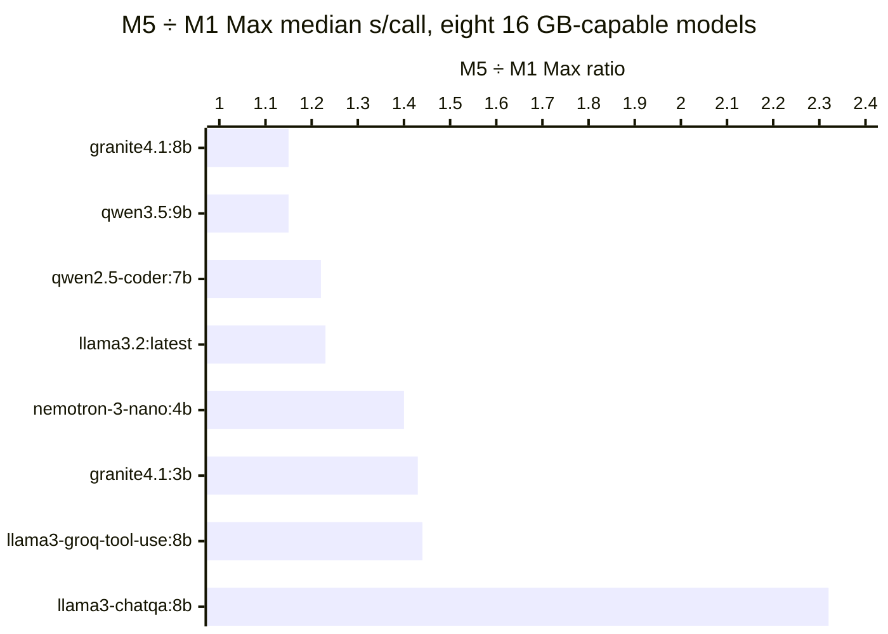

# Running local models for Adaptive Card JSON on a 64 GB M1 Max and a 16 GB M5

In
[`freemansoft/Flutter-AdaptiveCards`](https://github.com/freemansoft/Flutter-AdaptiveCards)
a Dart chat server hands a question to a local Ollama model and asks for the
answer as Adaptive Card JSON — a strict, closed-vocabulary schema — which a
Flutter client renders as interactive UI rather than as text. A directory of
probes measures which of fifteen local models manage that, how well, and how
fast. This article asks what changes when those probes run on a machine a
quarter the size of the one they were built on.

## Two machines, one probe set

Two Apple machines ran the same probes and the same prompts, with the prompt
and seed files confirmed byte-identical by checksum: a 64 GB M1 Max MacBook Pro 14-inch
(`MacBookPro18,4`), the host the probe suite was built on, and a fanless 16 GB
M5 MacBook Air (`Mac17,3`).

A server default that only runs on a 64 GB box is not much of a default, so the
16 GB column answers what can reasonably be recommended, not what can be
measured. Fit comes first below; the rest of the article is latency, under one
caveat that shapes all of it: the same model on the same machine medians **1.54x** slower measured at
the end of a long sweep than at the start. That is larger than most of the
M5-versus-M1-Max gaps below, so those gaps give a direction rather than a
per-model figure, and the 16 GB recommendation rests on which models fit and
which of those scores well.

Every figure below is transcribed from
[`ModelBehavior.md`](https://github.com/freemansoft/Flutter-AdaptiveCards/blob/main/adaptive_chat_server_dart/ModelBehavior.md),
a lab notebook in the
[`freemansoft/Flutter-AdaptiveCards`](https://github.com/freemansoft/Flutter-AdaptiveCards)
repository.
Shape figures are `--samples 2`: every case is run twice and counts as passed
only if both runs passed. That is why a one-point difference between two models
is noise rather than a ranking — one borderline case flips the whole case.

Seven terms carry the figures in this article.

| Term                                      | What it means here                                                                                                                                                                                                                                                                                                                                                                                                                                                                                  |
| ----------------------------------------- | --------------------------------------------------------------------------------------------------------------------------------------------------------------------------------------------------------------------------------------------------------------------------------------------------------------------------------------------------------------------------------------------------------------------------------------------------------------------------------------------------- |
| **Shape score**, `n/25` (`shape_ab.dart`) | 25 prompt test cases — one user question each, paired with the Adaptive Card element types (the schema's UI component types, such as `Input.ChoiceSet` or `Table`) that would acceptably answer it — scored on one thing: did the reply use one of them? "What are my options for deployment targets" passes only on an `Input.ChoiceSet`. Each case is run twice and passes only if both runs did. This is shape coverage, not accuracy — a model can be entirely correct in prose and score 1/25. |
| **Cold start** and **with history**       | The shape probe's two conditions: the question asked first, or asked with ordinary exchanges already in the conversation. The two differ, and a score under one is never quoted against the other. Figures below are with-history unless the text says otherwise.                                                                                                                                                                                                                                   |
| **Seeded** and **unaided**                | Seeded is the configuration the server ships — a synthetic two-turn card exchange prepended to the context. Unaided is the same probe without it. The seed is worth +10 shapes to −2 depending on the model, so a score named without its configuration is half a fact.                                                                                                                                                                                                                             |
| **Median s/call**                         | Median over the 25-case shape sweep, excluding the first call after a model load — roughly 6-7x a warm one — and excluding stalled calls, which measure the timeout rather than the model.                                                                                                                                                                                                                                                                                                          |
| **Full sweep**                            | Wall clock for the seven standard probes against one model, stalls included. That is time someone waited.                                                                                                                                                                                                                                                                                                                                                                                           |
| **Stall**                                 | A call that exceeds the probe's 120 s per-call ceiling and is scored a failure. A stall does not name its cause: a slow model and a busy machine are indistinguishable from the probe's side.                                                                                                                                                                                                                                                                                                       |
| **Position bias**                         | Models are measured one after another for hours, so a model measured first, on an idle machine, is not measured under the same conditions as one measured seven hours in. The latency cost of _when in that run_ a model was measured is what this article calls position bias. A control on one machine puts it at 1.54x — larger than most of the host-to-host differences reported here.                                                                                                         |

## Seven models fit a 16 GB host outright, and one fits marginally

Fit decides which models can be the server's default on the small machine,
before any score is consulted. Both hosts are Apple Silicon Macs with unified
memory, so there is no separate VRAM budget: the number on the box is one pool
shared by macOS, everything else running, and the model's weights. The column
below reads all fifteen against a 16 GB host: ✅ fits, ⚠️ marginal, ❌ does not.

| Model                                               | Weights | 16 GB |
| --------------------------------------------------- | ------- | ----- |
| `gpt-oss:20b`                                       | 12.8 GB | ❌    |
| `granite4.1:3b`                                     | 2.0 GB  | ✅    |
| `granite4.1:8b`                                     | 5.0 GB  | ✅    |
| `hf.co/unsloth/Nemotron-3-Nano-30B-A3B-GGUF:latest` | 22.9 GB | ❌    |
| `llama3-chatqa:8b`                                  | 4.3 GB  | ✅    |
| `llama3-groq-tool-use:8b`                           | 4.3 GB  | ✅    |
| `llama3.2:latest`                                   | 1.9 GB  | ✅    |
| `nemotron-3-nano:4b`                                | 2.6 GB  | ✅    |
| `nemotron-3-nano:30b`                               | 22.6 GB | ❌    |
| `nemotron-3.5-lightning:30b`                        | 23.7 GB | ❌    |
| `qwen2.5-coder:7b`                                  | 4.4 GB  | ✅    |
| `qwen3-coder:30b`                                   | 17.3 GB | ❌    |
| `qwen3.5:9b`                                        | 6.1 GB  | ⚠️    |
| `qwen3.6:27b-coding-nvfp4`                          | 18.4 GB | ❌    |
| `qwen3.8:27b-nvfp4`                                 | 16.9 GB | ❌    |

**Seven models fit outright, one fits marginally — `qwen3.5:9b` at 6.1 GB — and
seven do not.** The marginal row matters later, so it is worth keeping separate
from the seven.

Weights are not the memory budget. `gpt-oss:20b` is **12.8 GB** against a 16 GB
machine and is still a ❌, because those weights share the pool with macOS and
the runtime — the usable ceiling sits below the number on the box. ❌ means "do
not recommend this as the default on a 16 GB host", not "untested": every ❌ row
was measured, on the 64 GB machine.

The ❌ class matters because it is the bill for the smaller machine. The
highest-scoring model measured is `gpt-oss:20b` at **25/25**, and a 16 GB host
cannot run it; the best it can run is `granite4.1:8b` at **21/25 in 5.0 GB**.
Four test cases is what the constraint costs — the notebook's
[roster](https://github.com/freemansoft/Flutter-AdaptiveCards/blob/main/adaptive_chat_server_dart/ModelBehavior.md#candidate-models),
where the ✅/⚠️/❌ marks above come from, calls `gpt-oss:20b` "the exception the
16 GB column exists to flag".

That 21/25 is a _seeded_, with-history figure: unaided, `granite4.1:8b` scores
**15/25**, a **+6** seed gain, while `qwen2.5-coder:7b` scores **18/25** either
way. A 16 GB recommendation has to name the configuration, not just the model.

## All eight rows read slower on the M5, 1.15x to 2.32x

The eight models that clear the 16 GB gate were then measured on both hosts.
Median s/call is the like-for-like column — the same 25 shape cases on each
machine, with the load call and any stalled call excluded — while the sweep and
stall columns describe the run rather than the model, and part company with the
median wherever a call hit the 120 s ceiling. Rows are ordered by ratio.

| Model                     | Size   | M1 Max s/call | M5 s/call | M5 ÷ M1 Max | M1 Max sweep | M5 sweep | M1 Max stalls | M5 stalls |
| ------------------------- | ------ | ------------- | --------- | ----------- | ------------ | -------- | ------------- | --------- |
| `granite4.1:8b`           | 5.0 GB | 2.85 s        | 3.27 s    | 1.15x       | 15 min       | 17 min   | 0             | 0         |
| `qwen3.5:9b`              | 6.1 GB | 4.92 s        | 5.65 s    | 1.15x       | 24 min       | 29 min   | 0             | 0         |
| `qwen2.5-coder:7b`        | 4.4 GB | 2.38 s        | 2.90 s    | 1.22x       | 19 min       | 22 min   | 0             | 0         |
| `llama3.2:latest`         | 1.9 GB | 1.34 s        | 1.65 s    | 1.23x       | 13 min       | 15 min   | 2             | 2         |
| `nemotron-3-nano:4b`      | 2.6 GB | 2.54 s        | 3.54 s    | 1.40x       | 16 min       | 30 min   | 1             | 4         |
| `granite4.1:3b`           | 2.0 GB | 0.98 s        | 1.40 s    | 1.43x       | 124 min      | 13 min   | 52            | 1         |
| `llama3-groq-tool-use:8b` | 4.3 GB | 1.85 s        | 2.67 s    | 1.44x       | 9 min        | 13 min   | 0             | 0         |
| `llama3-chatqa:8b`        | 4.3 GB | 0.11 s        | 0.25 s    | 2.32x       | 3 min        | 5 min    | 0             | 0         |

Both hosts run the same Ollama line — M1 Max on 0.33.2, M5 on 0.33.1, a
patch-level difference — so each row compares two machines rather than two
runtimes. `qwen3.5:9b` is the row to read carefully even so: two M1 Max
measurements of it exist, and which one sits in the table decides that row's
direction at **1.15x**. The caveats below say which one is there and why.

**All eight rows read slower on the M5, 1.15x to 2.32x, seven of them inside
1.0-1.5x.** The M5 is the newer chip with the faster cores, so the direction is
worth accounting for: token generation is dominated by streaming the model's
weights out of memory rather than by arithmetic, which makes single-stream
inference memory-bandwidth-bound, and a Max-tier part still carries the wider
memory bus — about **150 GB/s** on the M5 against about **400 GB/s** on the
M1 Max.

The widest ratio is the least meaningful one. `llama3-chatqa:8b` at **2.32x**
is 0.11 s against 0.25 s: 140 ms of absolute difference on the fastest model
in this table, where load and scheduling overhead are a larger share of the
call than the model's own compute.

`nemotron-3-nano:4b` is the row where the sweep column moves further than the
median does: 16 minutes to 30, against 1.40x on the median. Its stall count
moves the same way, 1 to 4, and a stalled call is wall clock the median excludes
by construction. The notebook records `chart` — a case in the everyday set of
ordinary one-shot requests, asking for a chart element — as a hang trigger for this model that reproduces on both
runtimes, so the extra M5 minutes are consistent with more calls reaching the
120 s ceiling rather than with slower generation throughout.

Three caveats travel with the table rather than any one row.

1. The M1 Max figures for `granite4.1:3b` and `llama3.2:latest` were measured
   **after runner eviction** — a harness change, described in the
   measurement-hygiene article in this series, that sends Ollama an unload after
   a call times out — and the other six **before runner eviction**. Eviction is
   a no-op unless a call times out, and those six recorded zero stalls on both
   hosts, so the comparison holds for them — checked, not assumed.
2. `granite4.1:3b`'s M1 Max sweep and stall cells, 124 minutes and 52, are
   cascade-damaged and are not model figures: that run's stall positions still
   carry the queue-cascade signature, in which one abandoned generation keeps
   running on the server and every later call queues behind it and is scored as
   its own stall, so a stall count tracks how long the runaway ran rather than
   how many calls were slow. The measurement-hygiene article in this series owns
   that account. Read only the median from that row — 0.98 s against 1.40 s,
   faster on the M1 Max.
3. The `qwen3.5:9b` M1 Max figure is the standalone cold position-0 control,
   while the other seven M1 Max figures are in-sweep; measured hot on the same
   host it medians 7563 ms, which would put its row below 1.0x, so its direction
   sits inside the 1.54x position bias measured below and is not a finding
   either way.

Model size does not predict speed on either host: the fastest real card producer
measured is `qwen3-coder:30b` at **1.5 s/call** on the M1 Max, ahead of
`qwen2.5-coder:7b` at a quarter its size, and it is off this table because it
needs 17.3 GB. (`llama3-chatqa:8b` tops the raw table only because it answers
in short prose — quick for the wrong reason.)

### One row was an artifact: 89 minutes became 15

`llama3.2:latest` first recorded **89 minutes and 40 stalls** on the M5, its
unaided cold-start score falling from **15/25 to 5/25**, with all 28 unaided
stalls in one contiguous block at the probe's opening. The cause was never
identified. Co-residency is ruled out — Ollama logged one resident runner on all
22 loads of the sweep — and a 1.20x throttling factor is too small to cover the
gap; the stall block matches a queue cascade, but that run predates runner
eviction and the M5 server log was never checked, so it is a match rather than
proof.

Re-run on an idle machine it takes **15 minutes with 2 stalls**, reproduces the
M1 Max exactly, and medians **1650 ms** against the first run's **1559 ms** —
the model's speed was never what changed. That run is the one published and the
one in the table above. The rule it enforces: re-run a suspicious row on an idle
machine before publishing, because a busy machine and a slow model are
indistinguishable from the probe's side. It is not the first row the rule has
caught; the measurement-hygiene article in this series accounts for the
earlier one.

### The same model runs 1.54x slower late in a sweep than at the start

The probes run models back to back for hours, and every row above is one
measurement taken at whatever point in that run the model came up. The first
model is measured on a cold, idle machine; the last is measured seven hours
into a working session. That difference has a size, and it was measured
directly on one host with everything else held still: `qwen3.5:9b` measured
first, after 29 minutes idle, medians **4924 ms**, and the same model on the
same machine and the same Ollama, measured seven seconds after an eight-hour
sweep, medians **7563 ms**.

**1.54x, from nothing but when the measurement was taken.** That is the number
this article calls the position bias, and it is larger than seven of the eight
host ratios above — so a single row's ratio cannot be separated from where that
model happened to fall in its own sweep, absent a hot/cold control on that
specific row. Behavior did not move with it: 0 of 100 calls differed cold
versus hot, so this is latency only, not coverage.

`llama3-chatqa:8b`'s 2.32x sits outside that band, but on absolute latencies
small enough (0.11 s versus 0.25 s) that overhead, not position, is the likelier
explanation. Only `qwen3.5:9b` has a position control today; read the direction
of the M5-versus-M1-Max comparison, not a per-model figure, until more rows do.

The M5 column carries one more version of the same problem. Its eight rows come
from a single sweep that ran 10:27 to 14:32, so later rows carry more of
whatever sustained load costs. How much is unestablished — the two models
re-measured for it disagree about the sign.

### Thermal throttling stays plausible and unproven

A fanless chassis is the obvious candidate for a sustained-load penalty, so
`granite4.1:8b` was measured twice more against its own in-sweep run: once
thirteen seconds after an eight-model sweep, and once after the machine had sat
idle overnight. On a thermal reading the hot re-run is slow and the idle one
returns to baseline.

| `granite4.1:8b` measurement       | Relative to its position-0 run  |
| --------------------------------- | ------------------------------- |
| In-sweep run at position 0        | 1.00x (the baseline)            |
| Re-run 13 seconds after the sweep | **1.20x**                       |
| Re-run after 7h37m idle           | **1.12x** (p25 1.07 / p75 1.15) |

The 1.20x figure is unreplicated. `qwen2.5-coder:7b`, whose published figure was
taken 17 minutes into the same sweep, measured **1.03x** after 31 minutes idle —
slightly slower cold, in the opposite direction. Two models moving in opposite
directions is not a machine property.

The third row is what a thermal reading does not account for: 7h37m of idle
should have returned the model to baseline, and it came back **1.12x** slower
with a tight interquartile spread rather than a handful of slow calls pulling
an average. Two nominally cold measurements of
`granite4.1:8b`, twelve hours apart, differ by **12%**, with a tight per-call
spread, so systematic rather than noisy. An effect of 1.20x sitting on a floor
of 1.12x is not cleanly separable from it.

A companion figure sharpens this rather than resolving it. The **1.54x**
hot/cold spread measured on the M1 Max just above — a machine with
fans — is larger than either the 1.20x or the 1.12x measured here on the
fanless M5. A swing at least that size shows up without a fanless chassis,
which argues for a position effect that does not depend on thermal throttling.
It does not rule throttling out on the M5; it means a swing this size does not
require a thermal explanation to make sense.

Thermal throttling on a fanless `Mac17,3` remains plausible and unproven, and
stating that means naming what was not measured: **no die temperature or clock
frequency was read**, and Ollama server uptime, ambient temperature, and
accumulated OS state all differed between those runs, none of them excluded.

The harness is uncontrolled as well. All three measurements predate runner
eviction. `granite4.1:8b` stalled zero times, so no unload would have fired on
its own calls, but the eight-model sweep that heated the machine did contain
stalled calls on other models, and under the current harness each of those
would unload the runner and leave the GPU idle — so the heat this **1.20x** was
measured against belongs to the pre-eviction harness. That host has since moved
to a later Ollama, so re-taking the control is a new measurement rather than a
correction to this column.

No correction factor is applied to any row. A measured bias would be reportable;
this one is not yet measured well enough to correct for. Read the M5 column as
one sweep's figures carrying a position-dependent bias of roughly the same size
as its reproducibility floor.

## Fitting is the entry requirement, not the answer

What should a 16 GB Mac run, then? Two parts to the answer:

Size first: **seven of fifteen models do not fit a 16 GB host at
all**, and weights are not the budget, since a 12.8 GB model is out.

Then the part that matters more: **among the eight that do fit, the choice still
decides the outcome.** The top two are `granite4.1:8b` (5.0 GB, 21/25) and
`qwen3.5:9b` (6.1 GB, 19/25); the bottom two are `llama3.2:latest` (1.9 GB,
15/25) and `llama3-chatqa:8b` (4.3 GB, **1/25**) — all seeded, with-history
figures. Every one of those four runs on the small machine, and they are not
interchangeable.

Three measurement rules came out of running the same probes twice on different
hardware. Stamp the host and the runtime version into every result file; a
figure that cannot name its machine and its runtime is not comparable to
anything. Derive published tables from the recorded runs rather than
transcribing them — the measurement-hygiene article records what that caught.
And report a bias you cannot correct for instead of correcting for it.

The repository is
[https://github.com/freemansoft/Flutter-AdaptiveCards](https://github.com/freemansoft/Flutter-AdaptiveCards),
and the lab notebook these figures are read from is
[https://github.com/freemansoft/Flutter-AdaptiveCards/blob/main/adaptive_chat_server_dart/ModelBehavior.md](https://github.com/freemansoft/Flutter-AdaptiveCards/blob/main/adaptive_chat_server_dart/ModelBehavior.md).
