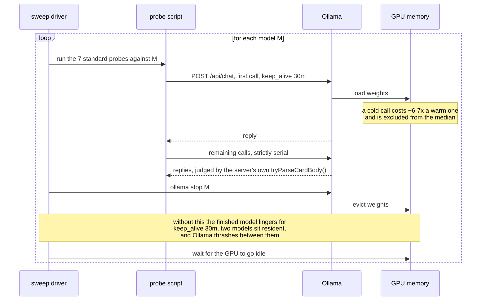

# The measurement was wrong, in a way that looked exactly like a slow model

## Fifty-two stalled calls, and nothing about the model had changed

`granite4.1:3b` came back from a sweep on 2026-08-20 with **52 stalled calls**,
a seeded score of **12/25** on the shape set with conversation history, and
`n/a` on the cascade probe. Read as a model result, that is a 2.0 GB model failing badly.
It was not a model result. Nothing about the model had changed, and nothing
about it needed fixing.

The frame, briefly. In
[`freemansoft/Flutter-AdaptiveCards`](https://github.com/freemansoft/Flutter-AdaptiveCards)
a Dart chat server hands a question to a local Ollama model and asks for the
answer as Adaptive Card JSON, which a Flutter app renders. A directory of probes
measures which models manage it, and the results live in a lab notebook in that
repository. This article is about the harness rather than the models: every
lesson below was learned from a measurement that went wrong. The stall-signature
incident above is the sharpest of them; the rest are smaller and different in
kind — a bad assertion, a probe that can't tell silence from refusal, a table
worth deriving twice.

## One model resident at a time is a correctness requirement

[`sweep.sh`](https://github.com/freemansoft/Flutter-AdaptiveCards/blob/main/adaptive_chat_server_dart/tool/model_probes/sweep.sh)
walks the model list, runs the seven standard probes against one model, unloads
it, and waits for the GPU to go idle before the next one starts. Two of those
steps look like housekeeping and are not.

Probes send `keep_alive: 30m`, so a model that has finished its probes stays
resident for half an hour unless something evicts it. The first version of the
2026-08-20 sweep omitted the `ollama stop`. Two models sat in memory together
and Ollama thrashed between them — the working explanation at the time for the
52 stalls, the 12/25, and the `n/a`. Re-run with the unload in place, on an
idle machine, `granite4.1:3b` scores **17/25 and 3/3**, matching its earlier
published figures, and the whole sweep takes **7 minutes instead of 124**.

That the unload step fixed it is not a hedged inference — the bad numbers came
from one run with the unload missing, the good numbers from the same probes
against the same model with it restored, and the second set matches figures
recorded before either run. Which failure the missing unload actually let
through is less certain than it looked at the time. A later sweep, run
2026-09-01 with co-residency ruled out by the server log, reproduced the exact
same **52 stalls** on this model from a queue cascade: one abandoned
generation kept running past its timeout, and every later call queued behind
it and was scored a stall it never reached the model to earn (the mechanism is
[below](#one-runaway-generation-is-recorded-as-many-stalls)).
A cascade produces the identical signature a co-resident competitor would. The
August run's logs did not survive to check which one applied, so its cause is
not recoverable, and the exact repeat of the count — 52 both times, from two
sweeps eleven days apart — is itself unexplained. Both accounts stay on the
record; neither is the settled winner.

So the rule the notebook states is a correctness requirement rather than a
performance tip: **one model resident at a time** — load a model, run all of its
probes, record, unload, wait, switch. A number collected any other way is not
comparable to anything. The full account is in
[the sweep section](https://github.com/freemansoft/Flutter-AdaptiveCards/blob/ba02fd98/adaptive_chat_server_dart/ModelBehavior.md#the-sweep-and-why-the-unload-step-matters)
of the notebook, and the procedure in
[`tool/model_probes/README.md`](https://github.com/freemansoft/Flutter-AdaptiveCards/blob/main/adaptive_chat_server_dart/tool/model_probes/README.md).

## A stall reads the same whether the model is slow or the machine is busy

A stalling call carries no information about its own cause. The reply just takes
longer, and from the probe's side that is all there is to see. Before concluding
that a model stalls: check `ollama ps` for anything resident that should not be,
and re-run on an idle machine. The two-host article in this series records the
second time that rule caught a bad row.

This section's stalls have a different root cause than the co-residency ones
above — a runaway generation, not a resident competitor — but they surface the
same way: a reply that never comes back. Probes bound each call with
`--timeout` — default 180 s, and the 2026-08-20 sweep used 120 s for the shape
and cascade sets — and score an over-run reply a failure. Before that bound
existed, a runaway generation could hang an entire multi-model sweep:
`granite4.1:3b` was observed generating for **16 minutes** on one `table` case
without returning.

**The bound changes what one figure means, and only for `granite4.1:3b`
unaided.** Seeded — with the synthetic card-shaped exchange the server prepends
to the history — it scores 17/25 either way. Unaided it falls from **13/25**
unbounded to **9/25** under the 120 s ceiling. The reason is visible in the
stall counts: seeded it stalls twice in 100 calls, unaided eleven times. Without
a card in front of the history it does not merely pick the wrong shape; it
answers at length in prose until it hits the ceiling. That is a real property of
the model under that condition, not a harness artifact — the stalls reproduce on
an idle machine with nothing else resident.

The scope is worth stating plainly, because a caveat that sounds general is
easily read as broader than it is. Nine of fifteen models recorded zero stalls,
and no other model recorded more than two. The ceiling caveat applies to one row
of one column.

## One runaway generation is recorded as many stalls

A later Ollama upgrade raised two models' stall counts sharply — one from 2 to
31, the other from 13 to 52 — on the same machine, the same weights, the same
probes. Read as a runtime regression, that looked like a second, larger
version of the ceiling story above. It was not. `OLLAMA_NUM_PARALLEL=1` gives
this host a single generation slot. When a call times out at the probe's
ceiling, the probe abandons the connection, but the generation keeps running
on the server — `request.abort()` frees only the client socket. Every later
call queues behind it and is scored as its own stall. A recorded stall count
tracks how long the runaway ran divided by the timeout, not how many calls
were actually slow: one hour-long runaway under a 120 s ceiling is enough on
its own to cost roughly thirty recorded stalls once the backlog starts
draining.

## Proving a cascade rather than assuming one

A queue cascade leaves fingerprints a genuinely slow model does not. Its
stalls arrive as one contiguous block within a probe rather than scattered
across it, and the server log shows a queue draining rather than dozens of
separate hangs: 27 requests completed within 37 seconds, their start times
exactly 120 s apart, and their durations descending in two-minute steps — the
shape of calls that had been waiting in line, each released the moment the one
ahead of it finally timed out or returned. A long-timeout re-run confirmed it
directly: raising the ceiling to 7200 s on the affected probe resolved **31**
recorded stalls into **2** genuinely slow calls, at 64.4 and 62.1 minutes,
both on the same case and both ending in invalid JSON. Twenty-nine of the
thirty-one were queue, not model.

## The same fix produced an artifact for one model and a regression for another

The fix is to cancel the runaway before continuing: evict the runner
(`keep_alive: 0`) as soon as a call times out, rather than only abandoning the
client connection. Re-running the two affected models with eviction in place —
before and after, everything else held constant — is what separates them.

`llama3.2:latest` recovers exactly. Before eviction: 12 stalls, 26.2 minutes,
seeded coverage 15/12. After: 2 stalls, 6.5 minutes, seeded coverage
**15/15** — full recovery — and its unaided probe drops from 19 stalls to
**0**. Its 31 originally recorded stalls were 2 real ones and 29 queue.

`granite4.1:3b` does not move. Before eviction: 14 stalls, 30.1 minutes,
seeded coverage 17/12. After: 14 stalls, 30.0 minutes, seeded coverage
17/12 — identical wall clock, identical coverage. These are not cascade: they
are 14 independent 120 s timeouts, all in the with-history condition,
beginning at the `table` case and continuing through every case after it.
Eviction is a no-op here because there is no leftover generation to cancel —
each of these calls is its own genuine timeout, not queued behind someone
else's.

One measurement, applied identically to two models, returned opposite
verdicts: an artifact for one, and a real, unresolved failure mode for the
other. That is the reason they cannot be described together as "the stalling
models" — the fix that clears one leaves the other exactly where it was.

## Sweep position moved a number more than the effect it was meant to explain

A separate investigation, into an apparent hardware anomaly, ran the same kind
of control used above — hot against cold, one model, one host, one runtime —
and it belongs here for what it says about single-row comparisons generally.
Measured cold, at position 0 after 29 minutes idle, `qwen3.5:9b` medians
**4924 ms**; measured hot, seven seconds after an eight-hour sweep, it medians
**7563 ms** — a **1.54x** spread from sweep position alone. That control was
built to explain a smaller cross-machine effect and measured a larger one
instead: the same discipline that resolved the stall counts above — isolate
one variable, measure it directly, do not read a mechanism off a net number —
turned out to apply just as well to a plain latency ratio between two
machines. A single row in a serial sweep can be reporting position, not the
thing being compared.

## The timeout ceiling was never the problem

The 120 s ceiling looked like the thing to fix once stall counts spiked. It
was not. A generation that runs for over an hour has already failed for every
purpose a chat server serves — the usability bar here is a reply under a
minute — so raising the ceiling to capture a runaway only converts a fast
failure into a slow one and buys a number nobody can act on. 120 s is already
twice that unusable threshold; lowering it, not raising it, is the change
worth weighing, since it would record the same failures for less wall clock
spent waiting for them. Never raise it to accommodate a model. What needed
fixing was not the ceiling but what happened after it: evict the runner the
moment a call times out, so the abandoned generation actually stops instead of
continuing to block every call queued behind it.

## Two failures blamed on the model belonged to the harness

A stall is a harness mistake in the timing. These two are a harness mistake in
the judging: the reply was fine, and the code around it said otherwise. The
first was a reply that looked like broken JSON from the model. Dumping the
bytes showed it contained zero real newlines and **11 correctly escaped** ones:
valid JSON, corrupted after arrival by this server's own fence-stripping
heuristic in
[`card_detect.dart`](https://github.com/freemansoft/Flutter-AdaptiveCards/blob/main/adaptive_chat_server_dart/lib/src/card_detect.dart).
The model had done its part. Dump the bytes before theorising about what
produced them.

The second is the sharper one, because the harness was working exactly as
written. One model scored **0/3** on tables. The replies were valid, complete,
renderable Tables — one of them laid out as a 2×2 grid, which the probe's
`rows >= 3` success criterion penalized as a failure. The assertion was wrong,
not the model.

The generalization is uncomfortable and holds anyway: a probe encodes an opinion
about what a correct answer looks like, and that opinion can be the thing that
is wrong. A score is a statement about a model _and_ about the criterion that
judged it, and only one of those two is under test at a time.

## A null result means nothing until delivery is established

A wrong judgment at least leaves a reply to inspect. The next mistake is
quieter: a lever that measured as doing nothing, when the real problem was that
its instructions may never have arrived. One of the levers tried against
conversational drift was repeating the
instructions in a second `system` message placed _after_ the conversation
history rather than only before it. It produced nothing measurable. The obvious
reading — that the repetition does not help — is not available, because Ollama
chat templates vary in whether a `system` message placed after the history
reaches the model at all; some keep only the first.

The delivery check was run 2026-08-18 on four screening models, by injecting an
additive reminder and reading the printed element-type list with and without it.
It came back **delivered** on `gpt-oss:20b`, and **unconfirmed** on
`qwen2.5-coder:7b` and `granite4.1:8b`, where dropped-by-the-template and
arrived-but-ignored are indistinguishable from outside. So the lever is recorded
in the tuning ledger as **no effect / unmeasurable** rather than as a clean
negative, and the rule is to establish delivery before reading a null result
from any candidate that depends on a second `system` message.

A second lesson sits underneath that one: a delivery probe must not contradict
the system prompt. A probe that asked the model to "disregard the question,
reply with only the word BANANA" produced a null on all four models tested, and
that result is uninformative:
**"the model resisted a contradiction" and "the message never arrived" look
identical**, so the probe cannot separate the case it exists to separate. The
system prompt tells the model to answer with a card; a probe that tells it not
to is competing with the instruction rather than testing the channel. An
additive, prompt-compatible probe — add one harmless, checkable element to the
list — removes that confound.

## Both the judge and the published table come out of code

Delivery is one way a measurement can be silently wrong; the judge itself is
another. The probes judge replies with the server's **own** `tryParseCardBody`,
`cardParseFailureReason`, and `checkNoDuplicateJsonKeys`. This is not
convenience. A probe that applied its own idea of "looks like a card" could
report a pass rate the running server disagrees with, and a measurement that
disagrees with the thing it is measuring is worse than no measurement.

The performance table gets the same treatment from the other end. Every figure
in it is derived from the recorded runs by
[`perf_table.py`](https://github.com/freemansoft/Flutter-AdaptiveCards/blob/main/adaptive_chat_server_dart/tool/model_probes/perf_table.py)
rather than typed, so a re-run diffs against the table rather than against
somebody's typing. Deriving it caught **two figures that had already drifted**:
`qwen3.8:27b-nvfp4` read 4.4 s against a recorded 4339 ms, and
`llama3-chatqa:8b` read 0.3 s where **253 ms and 248 ms** — a 2% difference —
printed as "0.3 s" and "0.2 s" beside a 1.0x ratio. Both are small. Both were in
a published table, and neither would have been found by re-reading it.

## Ten models' numbers were discarded, and three findings outlived them

Everything above is about keeping a measurement from being wrong. This last one
is about what to do once you already know a batch of them was: discard the
numbers without discarding what they taught. Two dated sweeps — six small models on 2026-08-14, four large ones on
2026-08-16 — ran the everyday and stress sets at `--samples 1`, before the shape
probe existed. Their per-model numbers are superseded by the 2026-08-20
re-measurement and **disagree with it on eight of the ten models**, occasionally
by five everyday cases. Nothing about the models changed; the runs differ in
date and sample count. They are marked do-not-quote in the notebook and kept
only in git history and the result files, where a provenance question can still
reach them.

Three findings survived the numbers, and they are the part worth carrying.

- **The easy set does not discriminate.** In those superseded runs — cited here
  for the methodological point, not as current per-model scores —
  `nemotron-3-nano:4b` and `llama3-groq-tool-use:8b` both scored 6/7 on the
  everyday set and then fell to 2/5 and 1/5 on the cases that break models.
  Judging either on the easy set alone would have been wrong, which is why the
  stress and shape sets exist.
- **Every failure was malformed JSON rather than a wrong element choice**, in
  three families the detector has to survive: truncation, scaling with reply
  length; an extra closing bracket before the comma that starts the next sibling
  element (`}] ,{`), as if the model had double-wrapped the previous item; and a
  missing `{"type":` wrapper on the first array element
  (`["TextBlock","text":…`).
- **The build is a variable, not just the model family.** The `hf.co/unsloth`
  Nemotron GGUF and the Ollama-library `nemotron-3-nano:30b` scored identically
  on the everyday set and diverged sharply on stress.

A failure mode is more durable than the number that first exposed it. Discarding
a sweep's scores does not oblige you to discard what the sweep taught, as long
as the two are recorded separately enough to tell apart later.

## What transfers

Ten rules, each of them the residue of a wrong measurement rather than a
principle arrived at in advance. Keep one model resident at a time. Re-run a
suspicious row on an idle machine before publishing it. When a fix is meant to
resolve a suspected cause, run it on every candidate row, not only the one you
expect it to clear — the same eviction that recovers one model exactly can
leave another untouched, and only running both tells you which you have.
Separate a queued call from a slow one before trusting a stall count: look for
a contiguous block and a queue-drain signature in the log before reading a
figure as N independently slow calls. Do not raise a timeout ceiling to
capture a failure that has already missed the usability bar it exists to
enforce. Control sweep position before reading a single row's ratio as the
effect under test — a same-host, same-runtime hot/cold check found a bias
larger than the cross-machine difference it was meant to explain. Do not trust
an assertion just because it is the one that shipped — a criterion can be the
thing under test, not only the model. Establish that a message reaches the
model before reading a null result about it, and do not let a delivery probe
contradict the instructions it is delivered alongside. Judge with the parser
you ship, and derive published tables from the recorded runs instead of
transcribing them. And record what you threw away and why, so a discarded
number is not quoted back at you later by someone who found it in git
history.

This is the last article in the series. The repository is
[https://github.com/freemansoft/Flutter-AdaptiveCards](https://github.com/freemansoft/Flutter-AdaptiveCards),
and the lab notebook every figure above is read from is at
[https://github.com/freemansoft/Flutter-AdaptiveCards/blob/ba02fd98/adaptive_chat_server_dart/ModelBehavior.md](https://github.com/freemansoft/Flutter-AdaptiveCards/blob/ba02fd98/adaptive_chat_server_dart/ModelBehavior.md).
