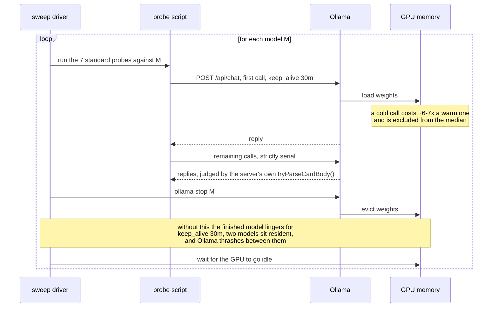

# The measurement was wrong, in a way that looked exactly like a slow model

## Fifty-two stalled calls, and nothing about the model had changed

`granite4.1:3b` came back from a sweep on 2026-08-20 with **52 stalled calls**,
a seeded score of **12/25** on the shape set with conversation history, and
`n/a` on the drift (cascade) probe. Read as a model result, that is a 2.0 GB
model failing badly. It was not a model result. Nothing about the model had
changed, and nothing about it needed fixing — on that 2026-08-20 run.

The frame, briefly. In
[`freemansoft/Flutter-AdaptiveCards`](https://github.com/freemansoft/Flutter-AdaptiveCards)
a Dart chat server hands a question to a local Ollama model and asks for the
answer as Adaptive Card JSON, which a Flutter app renders. A directory of
probes measures which models manage it, and the results live in a lab notebook
in that repository. This article is about the harness rather than the models:
every lesson below was learned from a measurement that went wrong — a queue
cascade, a harness change that half-worked, a ceiling that was never the
problem, a sweep-position bias, a bad assertion, a probe that can't tell
silence from refusal, a silently truncated prompt that read as a broken cache,
a table worth deriving twice.

## One model resident at a time is a correctness requirement

[`sweep.sh`](https://github.com/freemansoft/Flutter-AdaptiveCards/blob/main/adaptive_chat_server_dart/tool/model_probes/sweep.sh)
walks the model list, runs the seven standard probes against one model, unloads
it, and waits for the GPU to go idle before the next one starts. Two of those
steps look like housekeeping and are not.

Probes send `keep_alive: 30m`, so a finished model stays resident for half an
hour unless something evicts it. The first version of the 2026-08-20 sweep
omitted the `ollama stop`; two models sat in memory together and Ollama
thrashed between them — the working explanation at the time for the 52 stalls,
the 12/25, and the `n/a`. Re-run with the unload in place, on an idle machine,
`granite4.1:3b` scores **17/25 and 3/3**, matching its earlier published
figures, and the whole sweep takes **7 minutes instead of 124**.

That the unload step was the cause is an inference the re-run does not
establish. A later sweep, run 2026-09-01 with co-residency ruled out by the
server log, recorded the exact same **52 stalls** on this model, in a pattern
consistent with a queue cascade — one abandoned generation running past its
timeout while every later call queues behind it (the mechanism is
[below](#one-runaway-generation-is-recorded-as-many-stalls)) — and a cascade
produces the identical signature a co-resident competitor would. The August
run's logs did not survive to check which applied, and the exact repeat of the
count, 52 both times from sweeps eleven days apart, is itself unexplained.
Both accounts stay on the record; neither is the settled winner.

So the rule is a correctness requirement rather than a performance tip: **one
model resident at a time** — load, run all of its probes, record, unload,
wait, switch. The full account is in
[the sweep section](https://github.com/freemansoft/Flutter-AdaptiveCards/blob/main/adaptive_chat_server_dart/ModelBehavior.md#the-sweep-and-why-the-unload-step-matters)
of the notebook, and the procedure in
[`tool/model_probes/README.md`](https://github.com/freemansoft/Flutter-AdaptiveCards/blob/main/adaptive_chat_server_dart/tool/model_probes/README.md).

## A stall reads the same whether the model is slow or the machine is busy

A stalling call carries no information about its own cause; the reply just
takes longer. Before concluding that a model stalls: check `ollama ps` for
anything resident that should not be, and re-run on an idle machine — the
two-host article records the second time that rule caught a bad row.

This section's stalls have a different root cause — a runaway generation, not
a resident competitor — but surface the same way. Probes bound each call with
`--timeout` (default 180 s; the 2026-08-20 sweep used 120 s for the shape and
cascade sets) and score an over-run reply a failure. Before that bound
existed, one runaway could hang an entire multi-model sweep: `granite4.1:3b`
was observed generating for **16 minutes** on one `table` case.

**Under Ollama 0.32.14, the bound changes what one figure means, and only for
`granite4.1:3b` unaided.** Seeded — with the synthetic card-shaped exchange
the server prepends to the history — it scores 17/25 either way. Unaided it
falls from **13/25** unbounded to **9/25** under the 120 s ceiling, and the
stall counts say why: seeded it stalls twice in 100 calls, unaided eleven
times, answering at length in prose until it hits the ceiling. That is a real
property of the model under that condition — the stalls reproduce on an idle
machine with nothing else resident.

The scope is narrow: on that runtime, nine of fifteen models recorded zero
stalls and no other model more than two, so the ceiling caveat applies to one
row of one column. The stall counts under the next runtime are a different
story, and the rest of this article is about them.

## One runaway generation is recorded as many stalls

A later Ollama upgrade, from 0.32.14 to 0.33.2, raised two models' recorded
stall counts — one from 2 to 31, the other from 13 to 52 — on the same
machine, weights, and probes. Read as a runtime regression, that looked like a
larger version of the ceiling story. For one model it was not; for the other
the question is still open. `OLLAMA_NUM_PARALLEL=1` gives this host a single
generation slot; when a call times out, the probe abandons the connection but
the generation was observed to keep running server-side (why the disconnect
did not cancel it is not established — an isolated reproduction cancels
correctly), and every later call queues behind it and is scored as its own
stall. A recorded stall count tracks how long the runaway ran divided by the
timeout, not how many calls were slow: one hour-long runaway under a 120 s
ceiling costs roughly thirty recorded stalls on its own.

## Twenty-nine of thirty-one recorded stalls were queue, not model

A queue cascade leaves fingerprints a slow model does not: stalls in one
contiguous block rather than scattered, and a server log showing a queue
draining — 27 requests completed within 37 seconds, start times exactly 120 s
apart, durations descending in two-minute steps. A long-timeout re-run
confirmed it for `llama3.2:latest`: raising the ceiling to 7200 s resolved
**31** recorded stalls into **2** slow calls, at 64.4 and 62.1 minutes, both
on the same case and both ending in invalid JSON. Twenty-nine of the
thirty-one were queue, not model.

## The same harness change reproduced the archive for one model and not the other

The harness change is to send an unload (`keep_alive: 0`) the moment a call
times out, rather than only abandoning the client connection. Runs are
labelled **before runner eviction** and **after runner eviction**; Ollama
0.33.2, the weights, the prompt and seed digests, and the machine are held
constant across the two.

`llama3.2:latest` reproduces the archive exactly: 12 stalls / 26.2 minutes /
seeded 15/12 before runner eviction becomes 2 stalls / 6.5 minutes / **15/15**
after, and its unaided probe drops from 19 stalls to **0**.

`granite4.1:3b` does not move: 14 stalls, 30.1 → 30.0 minutes, seeded 17/12
both before and after. An unchanged count was first read as proof the stalls were
the model's own. It is not: the after-eviction unaided run stalls on calls
0-20 — the probe's opening cases, all cold — and again on 89-99, and the first
call to return after the block took 86 seconds, a queued call draining rather
than a reload. That is the contiguous-block signature above, still present
after the harness change; "unchanged by eviction" is equally explained by the
eviction not taking effect.

The server log supports that reading: the unload is not shown to cancel a
running generation at all. In a direct test, `keep_alive: 0` sent 3 s into an
18 s generation let it run to 20.9 s, and `ollama stop` to 16.3 s; during the
granite run the server answered 53 unloads in about 8 ms each while one
generation ran for 70 minutes with a queue draining behind it. During the
`llama3.2:latest` run its two stalled calls terminated server-side at exactly
2m0s, each in the same second as an unload — whether the unload caused that,
and why it coincided for one model and not the other, is unexplained.

So the contrast is not artifact against regression. Nothing about
`granite4.1:3b` under 0.33.2 is established — its 14 seeded and 32 unaided
stalls, and the coverage figures they produce, are recorded as
cascade-damaged rather than as a model measurement. What is established comes
from the other machine: the M5's clean run under Ollama 0.33.1 records seeded
17/25 both cold and with-history and cascade 3/3, matching the model's clean
0.32.14 figures, so no 0.33.x regression is indicated. The open question is
whether a runaway generation can be cancelled at all, and how.

## The timeout ceiling was never the problem

The 120 s ceiling looked like the thing to fix once stall counts spiked. It
was not. A generation that runs for over an hour has already failed for every
purpose a chat server serves — the usability bar here is a reply under a
minute — so raising the ceiling only converts a fast failure into a slow one.
120 s is already twice that threshold; lowering it is the change worth
weighing, since it records the same failures for less wall clock. What needed
attention was not the ceiling but what happened after it — the abandoned
generation kept running — and the harness change made for that, the unload on
timeout, is not yet shown to stop it.

## Sweep position moved a number more than the effect it was meant to explain

A separate investigation, into an apparent cross-host anomaly — the subject of
the two-host article in this series — ran a hot-against-cold control on one
model, one host, one runtime. Measured cold, at position 0 after 29 minutes
idle, `qwen3.5:9b` medians **4924 ms**; measured hot, seven seconds after an
eight-hour sweep, **7563 ms** — a **1.54x** spread from sweep position alone,
larger than the cross-machine effect the control was built to explain. A
single row in a serial sweep can be reporting position, not the thing being
compared.

## Two failures blamed on the model belonged to the harness

A stall is a harness mistake in the timing; these two are harness mistakes in
the judging. The first was a reply that looked like broken JSON from the
model. Dumping the bytes showed zero real newlines and **11 correctly
escaped** ones: valid JSON, corrupted after arrival by the server's own
fence-stripping heuristic in
[`card_detect.dart`](https://github.com/freemansoft/Flutter-AdaptiveCards/blob/main/adaptive_chat_server_dart/lib/src/card_detect.dart).
Dump the bytes before theorising about what produced them.

The second is the sharper one, because the harness was working exactly as
written. One model scored **0/3** on tables. The replies were valid, complete,
renderable Tables — one of them laid out as a 2×2 grid, which the probe's
`rows >= 3` success criterion penalized as a failure. The assertion was wrong,
not the model.

The generalization holds: a score is a statement about a model _and_ about the
criterion that judged it, and only one of those two is under test at a time.

## A null result means nothing until delivery is established

A wrong judgment at least leaves a reply to inspect. The next mistake is
quieter: a lever that measured as doing nothing, when its instructions may
never have arrived. Repeating the instructions in a second `system` message
placed _after_ the conversation history produced nothing measurable — and the
obvious reading, that repetition does not help, is not available, because
Ollama chat templates vary in whether a second `system` message reaches the
model at all; some keep only the first.

The delivery check, run 2026-08-18 on four screening models by injecting an
additive reminder and reading the printed element-type list with and without
it, came back **delivered** on `gpt-oss:20b` and **unconfirmed** on
`qwen2.5-coder:7b` and `granite4.1:8b`, where dropped-by-the-template and
arrived-but-ignored are indistinguishable from outside. The lever is recorded
as **no effect / unmeasurable** rather than as a clean negative: establish
delivery before reading a null result from anything that depends on it.

A second lesson sits underneath: a delivery probe must not contradict the
system prompt. A probe that asked the model to "disregard the question, reply
with only the word BANANA" produced a null on all four models, and it is
uninformative — **"the model resisted a contradiction" and "the message never
arrived" look identical**. An additive, prompt-compatible probe — add one
harmless, checkable element to the list — removes that confound.

## A silently truncated prompt read as a broken cache

Ollama 0.33.3 added `prompt_eval_cached_count` — how many prompt tokens the
runner served from its prefix cache rather than re-evaluated. The first probe
built on it appeared to show the cache barely working: turn after turn reusing
**4 of 4,098** prompt tokens. The fault was the probe's configuration, not the
cache: its system prompt tokenized to roughly 15k against an 8,192-token
`num_ctx`, and Ollama truncated it to half the window — silently, with no
error and no warning — so every turn was a different slice of the oversized
prompt and nothing matched. The tell was `prompt_eval_count` sitting at
exactly **4,098 on every turn** of a growing conversation: a prompt that grows
cannot keep a constant token count.

Sized to fit, the same probe shows the cache is a large performance effect —
Apple M5 / 16 GB, Ollama 0.33.3, `llama3.2:latest`, `t=0`:

| Pattern                                 | cached / prompt | prefill          |
| --------------------------------------- | --------------- | ---------------- |
| identical request repeated              | 2,142 / 2,143   | 2,017 ms → 18 ms |
| growing conversation, turns 2–3         | all but ~15     | ~94 ms per turn  |
| retry after aborting a call mid-prefill | 2,443 / 2,444   | 29 ms            |

A conversation turn pays prefill for its new tokens only, and a retry after an
aborted call costs a warm repeat rather than a cold prefill — which prices the
timeout-and-retry pattern the probes use (whether that is 0.33.0's prefill
restore points or the abandoned request completing server-side is
indistinguishable from the client; the price is the same either way). The
prefill timings were always readable; what 0.33.3 added is the cached count
saying _why_ a prefill was cheap — which turned a plausible "broken cache"
reading into a measurable configuration error. The full figures, including
cross-conversation reuse and survival across interleaved requests, are in
[the prompt-cache section](https://github.com/freemansoft/Flutter-AdaptiveCards/blob/main/adaptive_chat_server_dart/ModelBehavior.md#prompt-cache-reuse-and-retry-cost-measured-with-prompt_eval_cached_count)
of the notebook.

## Both the judge and the published table come out of code

Delivery is one way a measurement can be silently wrong; the judge is another.
The probes judge replies with the server's **own** `tryParseCardBody`,
`cardParseFailureReason`, and `checkNoDuplicateJsonKeys` — a probe with its
own idea of "looks like a card" could report a pass rate the running server
disagrees with. The performance table gets the same treatment from the other
end: every figure is derived from the recorded runs by
[`perf_table.py`](https://github.com/freemansoft/Flutter-AdaptiveCards/blob/main/adaptive_chat_server_dart/tool/model_probes/perf_table.py)
rather than typed, so a re-run diffs against the table instead of somebody's
typing. Deriving it caught **two figures that had already drifted**:
`qwen3.8:27b-nvfp4` read 4.4 s against a recorded 4339 ms, and
`llama3-chatqa:8b` read 0.3 s where **253 ms and 248 ms** — a 2% difference —
should have printed as "0.3 s" and "0.2 s" beside a 1.0x ratio. Both were in a published table, and
neither would have been found by re-reading it.

## Ten models' numbers were discarded, and three findings outlived them

Everything above is about keeping a measurement from being wrong. This last one
is about what to do once you know a batch of them was: discard the numbers
without discarding what they taught. Two dated sweeps — six small models on
2026-08-14, four large ones on 2026-08-16 — ran the everyday and stress sets at
`--samples 1`, before the shape probe existed. Their per-model numbers are
superseded by the 2026-08-20 re-measurement and **disagree with it on eight of
the ten models**, occasionally by five everyday cases; nothing about the
models changed. They are marked do-not-quote in the notebook and kept only in
git history and the result files, where a provenance question can still reach
them.

Three findings survived the numbers, and they are the part worth carrying.

- **The easy set does not discriminate.** In those superseded runs — cited for
  the methodological point, not as current scores — `nemotron-3-nano:4b` and
  `llama3-groq-tool-use:8b` both scored 6/7 on the everyday set and then fell
  to 2/5 and 1/5 on the cases that break models. The stress and shape sets
  exist because of this.
- **Every failure was malformed JSON rather than a wrong element choice**, in
  three families the detector has to survive: truncation, scaling with reply
  length; an extra closing bracket before the next sibling (`}] ,{`); and a
  missing `{"type":` wrapper on the first array element
  (`["TextBlock","text":…`).
- **The build is a variable, not just the model family.** The `hf.co/unsloth`
  Nemotron GGUF and the Ollama-library `nemotron-3-nano:30b` scored
  identically on the everyday set and diverged sharply on stress.

A failure mode is more durable than the number that first exposed it:
discarding a sweep's scores does not oblige you to discard what it taught.

## What transfers

Eleven rules, each the residue of a wrong measurement rather than a principle
arrived at in advance: keep one model resident at a time; re-run a suspicious
row on an idle machine before publishing it; run a corrective harness change
on every candidate row and confirm in the server log that it took effect;
separate queued calls from slow ones before trusting a stall count; never
raise a timeout ceiling to capture a failure that has already missed the
usability bar the ceiling exists to enforce; control sweep
position before reading a single row's ratio as the effect under test;
distrust a shipped assertion as readily as the model it judges; establish
delivery before reading a null result, with a probe that does not contradict
the prompt it rides beside; check for silent truncation before reading any
token-level number; judge with the parser you ship and derive published
tables from the recorded runs; and record what you threw away and why, so a
discarded number is not quoted back at you from git history.

This is the last article in the series. The repository is
[https://github.com/freemansoft/Flutter-AdaptiveCards](https://github.com/freemansoft/Flutter-AdaptiveCards),
and the lab notebook every figure above is read from is at
[https://github.com/freemansoft/Flutter-AdaptiveCards/blob/main/adaptive_chat_server_dart/ModelBehavior.md](https://github.com/freemansoft/Flutter-AdaptiveCards/blob/main/adaptive_chat_server_dart/ModelBehavior.md).
