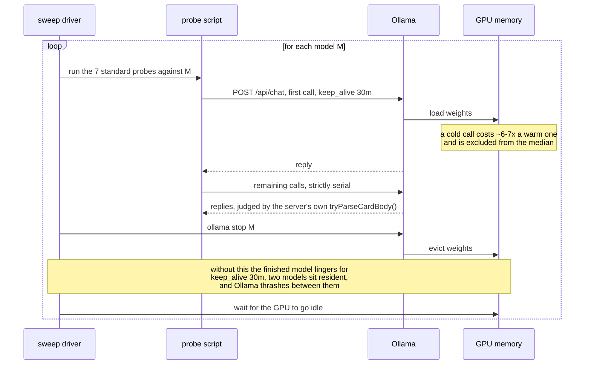

# The measurement was wrong, in a way that looked exactly like a slow model

## Fifty-two stalled calls, and nothing about the model had changed

`granite4.1:3b` came back from a sweep on 2026-08-20 with **52 stalled calls**,
a seeded score of **12/25** on the shape set with conversation history, and
`n/a` on the drift (cascade) probe. Read as a model result, that is a 2.0 GB
model failing badly. It was not: nothing about the model had changed, or
needed fixing, on that 2026-08-20 run.

The frame, briefly. In
[`freemansoft/Flutter-AdaptiveCards`](https://github.com/freemansoft/Flutter-AdaptiveCards)
a Dart chat server hands a question to a local Ollama model and asks for the
answer as Adaptive Card JSON, which a Flutter app renders. A directory of
probes measures which models manage it; the results live in a lab notebook
there. This article is about the harness, not the models: every lesson below
came from a measurement that went wrong.

## One model resident at a time, because a stall does not name its cause

[`sweep.sh`](https://github.com/freemansoft/Flutter-AdaptiveCards/blob/main/adaptive_chat_server_dart/tool/model_probes/sweep.sh)
runs the seven standard probes against one model, unloads it, and waits for the
GPU to idle before the next model starts. The last two steps look like
housekeeping and are not.

Probes send `keep_alive: 30m`, so a finished model stays resident half an hour
unless evicted. The first version of the 2026-08-20 sweep omitted the
`ollama stop`; two models sat in memory together and Ollama thrashed between
them — the working explanation at the time for the first column below.

| 2026-08-20, `granite4.1:3b`     | first run, no `ollama stop` | re-run with unload, idle machine |
| ------------------------------- | --------------------------- | -------------------------------- |
| stalled calls                   | 52                          | —                                |
| shape set, seeded, with history | 12/25                       | **17/25**                        |
| drift (cascade) probe           | `n/a`                       | **3/3**                          |
| wall clock, whole sweep         | 124 min                     | **7 min**                        |

The re-run reproduces the model's earlier published figures.

It does not establish co-residency as the cause. A sweep on 2026-09-01, with
co-residency ruled out by the server log, recorded the same **52 stalls** on
this model, in a pattern consistent with a queue cascade
([mechanism below](#twenty-nine-of-thirty-one-recorded-stalls-were-queue-not-model)).
The exact repeat, 52 both times eleven days apart, is unexplained, and both
accounts stay on the record; either way **one model resident at a time** is a
correctness requirement rather than a performance tip. Full account:
[the sweep section](https://github.com/freemansoft/Flutter-AdaptiveCards/blob/main/adaptive_chat_server_dart/ModelBehavior.md#the-sweep-and-why-the-unload-step-matters)
of the notebook; procedure:
[`tool/model_probes/README.md`](https://github.com/freemansoft/Flutter-AdaptiveCards/blob/main/adaptive_chat_server_dart/tool/model_probes/README.md).

A stalling call carries no information about its own cause; the reply just
takes longer. So check `ollama ps` for anything resident that should not be,
and re-run on an idle machine, before concluding that a model stalls. Probes
bound each call with `--timeout` (default 180 s; the 2026-08-20 sweep used
120 s for the shape and cascade sets) and score an over-run reply a failure —
before that bound existed, `granite4.1:3b` was observed generating for
**16 minutes** on one `table` case, hanging the sweep behind it.

Under Ollama 0.32.14 the bound changes what one figure means, and only for
`granite4.1:3b` unaided; seeded — with the synthetic card-shaped exchange the
server prepends to history — it costs nothing.

| `granite4.1:3b`, Ollama 0.32.14, shape set | unbounded | 120 s ceiling |
| ------------------------------------------ | --------- | ------------- |
| seeded                                     | 17/25     | 17/25         |
| unaided                                    | 13/25     | 9/25          |
| stalls in 100 calls, seeded / unaided      | —         | 2 / 11        |

Unaided, the model answers at length in prose until it hits the ceiling, and
those stalls reproduce on an idle, otherwise empty machine, so that row is the
model's own. The scope is narrow: on that runtime nine of fifteen models
recorded zero stalls and no other more than two.

## Twenty-nine of thirty-one recorded stalls were queue, not model

The upgrade from Ollama 0.32.14 to 0.33.2 raised two models' recorded stall
counts — one from 2 to 31, the other from 13 to 52 — on the same machine,
weights, and probes. `OLLAMA_NUM_PARALLEL=1` gives this host one generation
slot. When a call times out the probe abandons the connection, but the
generation was observed to keep running server-side (why the disconnect did not
cancel it is unestablished; an isolated reproduction cancels correctly), and
every later call queues behind it and is scored as its own stall. A stall count
then measures how long the runaway ran divided by the timeout, not how many
calls were slow: one hour-long runaway under a 120 s ceiling costs roughly
thirty recorded stalls.

A cascade leaves fingerprints a slow model does not: stalls in one contiguous
block rather than scattered, and a server log showing a queue draining — 27
requests completed within 37 seconds, start times exactly 120 s apart,
durations descending in two-minute steps. A long-timeout re-run confirmed it
for `llama3.2:latest`: raising the ceiling to 7200 s resolved **31** recorded
stalls into **2** slow calls, at 64.4 and 62.1 minutes, both on the same case
and both ending in invalid JSON.

The ceiling was never the thing to fix. A generation running over an hour has
already failed for every purpose a chat server serves — the usability bar is a
reply under a minute — so raising the ceiling converts a fast failure into a
slow one. 120 s is already twice that bar, and lowering it would record the
same failures for less wall clock. What needed attention was what happened
after the ceiling: the abandoned generation kept running.

## The same harness change reproduced the archive for one model and not the other

The harness change: send an unload (`keep_alive: 0`) the moment a call times
out, rather than only abandoning the client connection. Runs are labelled
**before runner eviction** and **after runner eviction**, with Ollama 0.33.2,
the weights, the prompt and seed digests, and the machine held constant.

| Before → after runner eviction | `llama3.2:latest` | `granite4.1:3b` |
| ------------------------------ | ----------------- | --------------- |
| seeded stalls                  | 12 → 2            | 14 → 14         |
| seeded wall clock              | 26.2 → 6.5 min    | 30.1 → 30.0 min |
| seeded shape score             | 15/12 → 15/15     | 17/12 → 17/12   |
| unaided stalls                 | 19 → 0            | 32 after        |

`llama3.2:latest` reproduces the archive exactly; `granite4.1:3b` does not
move. The unchanged count was first read as proof the stalls were the model's
own; it is not. Its after-eviction unaided run stalls on calls 0-20 — the
probe's opening cases, all cold — and again on 89-99, the first call after the
block taking 86 seconds, a queued call draining rather than a reload. The
contiguous-block signature is still there, and "unchanged by eviction" is
equally explained by the eviction not taking effect.

Nothing in the server log shows the unload cancelling a running generation.

| Unload evidence, Ollama 0.33.2                   | What the log shows                                                           |
| ------------------------------------------------ | ---------------------------------------------------------------------------- |
| `keep_alive: 0` sent 3 s into an 18 s generation | ran to 20.9 s                                                                |
| `ollama stop` against the same generation        | ran to 16.3 s                                                                |
| 53 unloads during the `granite4.1:3b` run        | answered in about 8 ms each; one generation ran 70 minutes, queue draining   |
| 2 stalled calls during the `llama3.2:latest` run | terminated server-side at exactly 2m0s, each in the same second as an unload |

Whether that last coincidence is cause is unexplained.

So this is not artifact against regression. Nothing about `granite4.1:3b` under
0.33.2 is established, and its 14 seeded / 32 unaided stalls and the coverage
figures they produce are recorded as cascade-damaged rather than as a model
measurement. What is established comes from the other machine: the M5's clean
run under Ollama 0.33.1 records seeded 17/25 both cold and with-history and
cascade 3/3, matching the model's clean 0.32.14 figures, so no 0.33.x
regression is indicated. Two things stay open — whether a runaway generation
can be cancelled at all, and whether the unload on timeout does anything.

## Sweep position moved a number more than the effect it was meant to explain

A hot-against-cold control run for a separate cross-host investigation held
one model, one host, one runtime fixed: cold, at position 0 after 29 minutes
idle, `qwen3.5:9b` medians **4924 ms**; hot, seven seconds after an
eight-hour sweep, **7563 ms** — a **1.54x** spread from sweep position
alone, larger than the cross-machine effect the control was meant to
explain. A single row in a serial sweep can report position, not the thing
compared.

## Two failures blamed on the model belonged to the harness

A stall is a harness mistake in timing; these two are harness mistakes in
judging. The first: a reply that looked like broken JSON from the model.
Dumping the bytes showed zero real newlines and **11 correctly escaped**
ones — valid JSON, corrupted after arrival by the server's own
fence-stripping heuristic in
[`card_detect.dart`](https://github.com/freemansoft/Flutter-AdaptiveCards/blob/main/adaptive_chat_server_dart/lib/src/card_detect.dart).
Dump the bytes before theorising about what produced them.

The second is the sharper one, because the harness was working exactly as
written. One model scored **0/3** on tables. The replies were valid, complete,
renderable Tables — one of them laid out as a 2×2 grid, which the probe's
`rows >= 3` success criterion penalized as a failure. The assertion was wrong,
not the model.

## A null result means nothing until delivery is established

The quieter mistake is a lever that measured as doing nothing when its
instructions may never have arrived. Repeating them in a second `system`
message placed _after_ the conversation history produced nothing measurable,
and the obvious reading — repetition does not help — is not available, because
Ollama chat templates vary in whether a second `system` message reaches the
model at all.

A delivery check on 2026-08-18, injecting an additive reminder into four
screening models, came back **delivered** on `gpt-oss:20b` and **unconfirmed**
on `qwen2.5-coder:7b` and `granite4.1:8b`; dropped-by-the-template and
arrived-but-ignored are indistinguishable from outside, so the lever is
recorded as **no effect / unmeasurable** rather than as a clean negative. The
probe itself
has to be additive: an earlier version asking the model to "disregard the
question, reply with only the word BANANA" nulled on all four models, and
**"the model resisted a contradiction" and "the message never arrived" look
identical**.

## A silently truncated prompt read as a broken cache

Ollama 0.33.3 added `prompt_eval_cached_count` — how many prompt tokens the
runner served from its prefix cache rather than re-evaluated. The first probe
built on it appeared to show the cache barely working: turn after turn reusing
**4 of 4,098** prompt tokens. The fault was the probe's configuration, not the
cache: its system prompt tokenized to roughly 15k against an 8,192-token
`num_ctx`, and Ollama truncated it to half the window silently, with no error
or warning, so every turn was a different slice of the oversized prompt and
nothing matched. The tell: `prompt_eval_count` sitting at exactly **4,098 on
every turn** of a growing conversation — a prompt that grows cannot keep a
constant token count. The server's own overflow detector now warns on this at
request time, confirmed against a live server.

Sized to fit, the same probe shows the cache is a large performance effect —
Apple M5 / 16 GB, Ollama 0.33.3, `llama3.2:latest`, `t=0`:

| Pattern                                 | cached / prompt | prefill          |
| --------------------------------------- | --------------- | ---------------- |
| identical request repeated              | 2,142 / 2,143   | 2,017 ms → 18 ms |
| growing conversation, turns 2–3         | all but ~15     | ~94 ms per turn  |
| retry after aborting a call mid-prefill | 2,443 / 2,444   | 29 ms            |

A conversation turn pays prefill for its new tokens only, and a retry after an
aborted call costs a warm repeat rather than a cold prefill — pricing the
timeout-and-retry pattern the probes use, whether that reflects 0.33.0's
prefill restore points or the abandoned request completing server-side
(indistinguishable from the client; the price is the same either way). The
prefill timings were always readable; what 0.33.3 added is the cached count
saying _why_ a prefill was cheap — turning a plausible "broken cache" reading
into a measurable configuration error.

The pattern reproduces on a second host, and mostly on a second model — Apple
M1 Max / 64 GB, the same Ollama 0.33.3, with `qwen3.8:27b-nvfp4` at ~18 GB too
large for the M5:

| Pattern, M1 Max / 64 GB                 | `llama3.2:latest` | `qwen3.8:27b-nvfp4`                       |
| --------------------------------------- | ----------------- | ----------------------------------------- |
| identical request repeated              | 2079 ms → 12 ms   | agrees                                    |
| growing conversation                    | as on the M5      | agrees                                    |
| fresh question, same system prompt      | 87 ms             | `cached=4` of roughly 3,177 tokens, ~40 s |
| cache survival after interleaving       | 39 ms             | agrees                                    |
| retry after aborting a call mid-prefill | 30 ms (M5: 29 ms) | unstable: 148 ms, then 18,154 ms          |

`llama3.2:latest` reproduced the M5 pattern on every reading.
`qwen3.8:27b-nvfp4` agreed on three of five patterns and, unstably, on
retry-after-abort — most of the prompt cached on one run, under two-thirds on
the repeat, where `llama3.2`'s retry cost was unaffected. Interleaving costs
near a full cold prefill on both, a structural property of an unrelated prompt
rather than a model-specific one. The miss is the fresh question: on an
idle-machine run and its repeat it came back as a full cold prefill,
indistinguishable from the model's first cold call. Reusing a shared system
prompt across a fresh question is a normal chat-server turn; for one model that
reuse is free, for the other it is not.

The full figures, including cross-conversation reuse and the
interleaved-request rows, are in
[the prompt-cache section](https://github.com/freemansoft/Flutter-AdaptiveCards/blob/main/adaptive_chat_server_dart/ModelBehavior.md#prompt-cache-reuse-and-retry-cost-measured-with-prompt_eval_cached_count)
of the notebook.

## Both the judge and the published table come out of code

The probes judge replies with the server's **own** `tryParseCardBody`,
`cardParseFailureReason`, and `checkNoDuplicateJsonKeys` — a probe with its
own idea of "looks like a card" could report a pass rate the running server
disagrees with. The performance table gets the same treatment: every figure
derives from the recorded runs via
[`perf_table.py`](https://github.com/freemansoft/Flutter-AdaptiveCards/blob/main/adaptive_chat_server_dart/tool/model_probes/perf_table.py),
not typing, so a re-run diffs against the table. Deriving it caught **two
figures that had already drifted**:
`qwen3.8:27b-nvfp4` read 4.4 s against a recorded 4339 ms, and
`llama3-chatqa:8b` read 0.3 s where **253 ms and 248 ms** — a 2% difference —
should have printed as "0.3 s" and "0.2 s" beside a 1.0x ratio. Neither would
have been found by re-reading the table.

## Ten models' numbers were discarded, and three findings outlived them

Once a whole batch of measurements is already wrong, the question is what to
keep: discard the numbers, not what they taught. Two dated sweeps — six small
models on 2026-08-14, four large ones on 2026-08-16 — ran the everyday and
stress sets at `--samples 1`,
before the shape probe existed. Their per-model numbers, superseded by the
2026-08-20 re-measurement, **disagree with it on eight of the ten models**,
occasionally by five everyday cases; nothing about the models changed.
Marked do-not-quote in the notebook, they are kept only in git history and
the result files, where a provenance question can still reach them.

Three findings survived them.

- **The easy set does not discriminate.** In those superseded runs — cited for
  the methodological point, not as current scores — `nemotron-3-nano:4b` and
  `llama3-groq-tool-use:8b` scored 6/7 on the everyday set, then fell to 2/5
  and 1/5 on the cases that break models — why the stress and shape sets
  exist.
- **Every failure was malformed JSON, not a wrong element choice**, in three
  families the detector has to survive: truncation, scaling with reply
  length; an extra closing bracket before the next sibling (`}] ,{`); and a
  missing `{"type":` wrapper on the first array element
  (`["TextBlock","text":…`).
- **The build is a variable, not just the model family.** The `hf.co/unsloth`
  Nemotron GGUF and the Ollama-library `nemotron-3-nano:30b` scored
  identically on the everyday set and diverged on stress.

A failure mode outlasts the number that first exposed it.

## What transfers

Eleven rules, each the residue of a wrong measurement rather than a principle
arrived at in advance.

| Rule                                                                                                          | The measurement behind it                                     |
| ------------------------------------------------------------------------------------------------------------- | ------------------------------------------------------------- |
| Keep one model resident at a time                                                                             | 52 stalls with two models sharing the GPU                     |
| Re-run a suspicious row on an idle machine before publishing it                                               | the same row scoring 17/25 and 3/3 once the machine was quiet |
| Run a corrective harness change on every candidate row, and confirm in the server log that it took effect     | eviction fixed one model's run and not the other's            |
| Separate queued calls from slow ones before trusting a stall count                                            | 29 of 31 recorded stalls were queue                           |
| Never raise a timeout ceiling to capture a failure that already missed the usability bar it exists to enforce | a 64.4-minute reply fails at any ceiling                      |
| Control sweep position before reading a single row's ratio as the effect under test                           | a 1.54x spread from position alone                            |
| Distrust a shipped assertion as readily as the model it judges                                                | `rows >= 3` scoring a valid 2×2 Table a failure               |
| Establish delivery before reading a null result, with a probe that does not contradict the prompt             | delivery unconfirmed on two screening models                  |
| Check for silent truncation before reading any token-level number                                             | `prompt_eval_count` pinned at 4,098 every turn                |
| Judge with the parser you ship, and derive published tables from the recorded runs                            | two published figures had already drifted                     |
| Record what you threw away and why, so a discarded number is not quoted back from git history                 | ten models' numbers, marked do-not-quote                      |

This is the last article in the series. The repository is
[https://github.com/freemansoft/Flutter-AdaptiveCards](https://github.com/freemansoft/Flutter-AdaptiveCards),
and the lab notebook every figure above is read from is at
[https://github.com/freemansoft/Flutter-AdaptiveCards/blob/main/adaptive_chat_server_dart/ModelBehavior.md](https://github.com/freemansoft/Flutter-AdaptiveCards/blob/main/adaptive_chat_server_dart/ModelBehavior.md).
