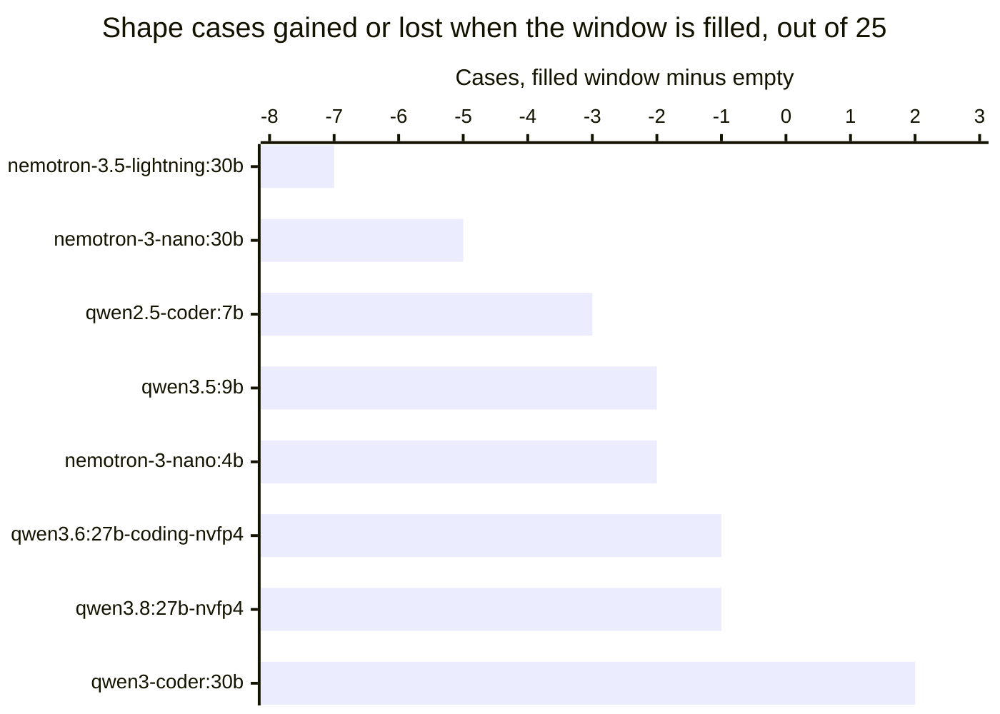

# Ollama drops an oversized history message whole, and nothing tells you

In
[`freemansoft/Flutter-AdaptiveCards`](https://github.com/freemansoft/Flutter-AdaptiveCards)
a demonstration Dart chat server hands a question to a local Ollama model and
asks for the answer as Adaptive Card JSON, a strict, closed-vocabulary schema
that a Flutter client renders as interactive UI rather than as text. A directory
of probes measures which local models manage that and how well. Every one of
those probes had been asking its question into a nearly empty window: a system
prompt, one question, and at most a short seed exchange. This article asks what
changes when the window is actually full, which is what a real conversation
does to it.

Three findings, all on an Apple M1 Max with 64 GB and an Apple M5 with 16 GB,
both running Ollama 0.33.3. A model handed more history than its window holds
does not get a trimmed version of it, it gets none of it, and no error says so.
What the runner allocates follows one rule with no counterexample in
thirty-one runs. And once a window really is full, the cost is not uniform:
three models lose about a third of their shape coverage while four are
unaffected.

Every figure is transcribed from
[`ModelBehavior.md`](https://github.com/freemansoft/Flutter-AdaptiveCards/blob/main/adaptive_chat_server_dart/ModelBehavior.md),
the lab notebook in that repository.

## Terms used in this article

| Term                    | What it means here                                                                                                                                                                                                                                                                        |
| ----------------------- | ----------------------------------------------------------------------------------------------------------------------------------------------------------------------------------------------------------------------------------------------------------------------------------------- |
| **`num_ctx`**           | The context window an Ollama request asks for, in tokens. It is a request, not a guarantee.                                                                                                                                                                                               |
| **Trained window**      | The context length a model was trained at, reported by `ollama show`. `llama3-chatqa:8b` is 8192; `qwen3.5:9b` is 262144.                                                                                                                                                                 |
| **`prompt_eval_count`** | The token count Ollama reports for the prompt it actually evaluated. It is the only way to find out what the model really received, and this article turns on it.                                                                                                                         |
| **Shape score**, `n/25` | 25 test cases, one question each, paired with the Adaptive Card element types that would answer it. Scored on one thing: did the reply use one of them? This is shape coverage, not accuracy, and a model can be entirely correct in prose and score low. Figures here are `--samples 1`. |
| **Filler**              | A block of deterministic nonsense the probe prepends as conversation history, sized to a token target, so a run can ask what a model does with a window that is mostly used.                                                                                                              |

## The allocated window is `min(requested, trained window)`

The probe asks for a window large enough to hold its filler plus the card
system prompt, and then reads Ollama's `/api/ps` to find out what the runner
actually gave it. Requested was 35851 tokens in every row below.

| Model                     | Trained window | Allocated | Clamped |
| ------------------------- | -------------- | --------- | ------- |
| `llama3.2:latest`         | 131072         | 35851     | no      |
| `granite4.1:8b`           | 131072         | 35851     | no      |
| `granite4.1:3b`           | 131072         | 35851     | no      |
| `nemotron-3-nano:4b`      | 262144         | 35851     | no      |
| `qwen3.5:9b`              | 262144         | 35851     | no      |
| `qwen2.5-coder:7b`        | 32768          | **32768** | yes     |
| `llama3-groq-tool-use:8b` | 8192           | **8192**  | yes     |
| `llama3-chatqa:8b`        | 8192           | **8192**  | yes     |

Every clamp lands exactly on that model's own trained window, none at an
intermediate value, and no model was given less than its window could hold.
Thirty-one runs across both hosts produced no counterexample, including six
models too large for the 16 GB machine, which asked for 35851 against windows
of 131072 and above and received exactly that.

Host memory does not enter into it, which is measured rather than inferred. The
16 GB M5 and the 64 GB M1 Max return identical allocations for all eight models,
the three clamps included. The M5 also allocated a full **65536**-token window
on request for a 9B model, which is the reading that retires the idea that a
clamp might be a memory ceiling in disguise.

The practical form of the rule: if you ask for more context than the model was
trained for, you silently get the trained window. Checking `ollama ps` after the
first call is how you find out.

## A message that does not fit is removed, not trimmed

What happens to history that exceeds the allocated window is the finding a
developer is most likely to be bitten by. The probe sent the same filler to
every model under a 35851-token window.

| Model                     | Allocated | Prompt tokens evaluated | History |
| ------------------------- | --------- | ----------------------- | ------- |
| `llama3.2:latest`         | 35851     | 29546                   | kept    |
| `granite4.1:8b`           | 35851     | 29536                   | kept    |
| `granite4.1:3b`           | 35851     | 29536                   | kept    |
| `nemotron-3-nano:4b`      | 35851     | **4374**                | dropped |
| `qwen3.5:9b`              | 35851     | **3965**                | dropped |
| `qwen2.5-coder:7b`        | 32768     | **3850**                | dropped |
| `llama3-groq-tool-use:8b` | 8192      | **3825**                | dropped |
| `llama3-chatqa:8b`        | 8192      | **3819**                | dropped |

A model that trimmed the history to fit would report a prompt count near its
window. The five report between 3819 and 4374 tokens, which is the system prompt
and the question and nothing else. The history message was removed in full.

Nothing errors and nothing warns. The reply comes back looking like a perfectly
good answer to a question asked with no history, because that is exactly what it
is. A chat application built on this would lose its conversation at some length
and carry on answering, and the only visible symptom would be a model that
suddenly seems to have forgotten what it was told.

`prompt_eval_count` is the detection method, and it is cheap: it arrives on every
reply. A count that stays flat while the conversation grows is the tell.

## The measurement that produced this was wrong first

The five drops above look like they split into two groups: two models with an
8192 window that could not have held the history under any policy, and three
with windows of 32768 and above that appear to have had room and discarded it
anyway. That second group was written up as an unexplained behavior, and it was
wrong. The probe caused it.

The filler is sized in **characters**, against an assumed 4.0 characters per
token. Measured against the same 127,020 characters, that constant turns out to
describe some tokenizers and not others.

| Model                      | Tokens for the same text | Characters per token |
| -------------------------- | ------------------------ | -------------------- |
| `llama3.2:latest`          | 29546                    | 4.30                 |
| `granite4.1:8b`            | 29536                    | 4.30                 |
| `gpt-oss:20b`              | 29616                    | 4.29                 |
| `qwen3.8:27b-nvfp4`        | 42542                    | 2.99                 |
| `qwen3.6:27b-coding-nvfp4` | 42538                    | 2.99                 |
| `nemotron-3-nano:4b`       | 46287                    | 2.74                 |

Three unrelated model families agree at about 4.30. Two Qwen builds render the
identical text 44% denser, and `nemotron-3-nano:4b` denser still. The filler
reads `filler-term123 means concept456.`, which is heavy on digits, and
tokenizers split digit strings very differently.

So wherever the constant under-counted, the probe sized a window too small for
its own filler, the prompt overflowed, the message was dropped, and the archive
recorded a model discarding history it appeared to have room for. The control
that settled it gave each model a filler that fits the window it is actually
allocated. All of them kept it. There was never a model that dropped a message
it had room for.

Two habits come out of that, and both are cheaper than the mistake. Size context
in tokens the model reports rather than in a proxy you chose. And when a
measurement produces a behavior with no mechanism, suspect the instrument before
the subject, which is a rule the measurement-hygiene article in this series
arrived at independently.

## A full window costs three models a third of their coverage, and four nothing

With a filler calibrated per model, the window can be filled on purpose and the
question the probe was built for can finally be asked. These runs carry roughly
48,500 tokens in a 65536-token window. The **Was** column is each model's score
when the history was dropped, which is to say the same task with an empty
context.

| Model                        | Prompt tokens | Pass      | Was   |
| ---------------------------- | ------------- | --------- | ----- |
| `qwen3-coder:30b`            | 48459         | 20/25     | 18/25 |
| `qwen3.6:27b-coding-nvfp4`   | 48535         | 20/25     | 21/25 |
| `qwen2.5-coder:7b`           | 24721         | 19/25     | 22/25 |
| `qwen3.5:9b`                 | 48537         | 16/25     | 18/25 |
| `qwen3.8:27b-nvfp4`          | 48539         | 16/25     | 17/25 |
| `nemotron-3.5-lightning:30b` | 48600         | **13/25** | 20/25 |
| `nemotron-3-nano:30b`        | 48611         | **12/25** | 17/25 |
| `nemotron-3-nano:4b`         | 48559         | **6/25**  | 8/25  |

The three bars past minus three are the finding. Everything from minus two
rightward is a single-sample run moving by one or two cases, which is noise.

`qwen2.5-coder:7b`'s minus three is the one bar not to read alongside the
others. It carries 24721 tokens where the rest carry about 48,500, because its
trained window caps it at 32768, so its bar is a smaller experiment rather than
a smaller model failing harder.

The Qwen models move by one or two cases in both directions, which is inside the
noise of a single-sample run. The three Nemotron models lose five, seven and two
cases, and `nemotron-3.5-lightning:30b` and `nemotron-3-nano:30b` give up about a
third of their coverage for nothing but a full window.

`qwen2.5-coder:7b` carries a smaller prompt because it has to. Its trained window
caps it at 32768, so a larger request changes nothing and it takes a smaller
filler instead, running its allocated window about three quarters full.

The Nemotron figures are the ones worth acting on, because they reproduced. An
earlier run of the same control carried between 42,500 and 46,300 tokens and
returned 13, 12 and 6 for those three models; the calibrated run carries 48,500
and returns 13, 12 and 6 again. Two runs at different prompt sizes landing on
the same three counts is a stronger reading than either alone, and none of the
Qwen movements reproduce that way.

### The two big losers fail in opposite ways

A lost case is not one thing. Sorting each run's 25 verdicts by what the judge
said turns the two largest losses into two different problems.

| Model                        | Pass     | No card at all | Card, wrong element |
| ---------------------------- | -------- | -------------- | ------------------- |
| `nemotron-3.5-lightning:30b` | 20 to 13 | **1 to 10**    | 1 to 0              |
| `nemotron-3-nano:30b`        | 17 to 12 | 0 to 0         | **4 to 8**          |
| `qwen2.5-coder:7b`           | 22 to 19 | 0 to 3         | 2 to 1              |
| `nemotron-3-nano:4b`         | 8 to 6   | 14 to 14       | 0 to 0              |

`nemotron-3.5-lightning:30b` **stops producing cards**. All eight cases it loses
come back as prose: it answers the question in plain text rather than emitting
card JSON at all. On an empty window it did that once in twenty-five.

`nemotron-3-nano:30b` keeps producing cards and **picks worse elements**. Its
replies are valid card JSON every time, with a static `TextBlock` substituted
for the interactive input the question called for: `got {TextBlock} want
{Input.Time}`, `want {Input.ChoiceSet}`, `want {Input.Toggle}`. It is asked to
collect something and displays something instead.

The difference matters when choosing a model, because the two fail differently
in production. A model that reverts to prose is caught by any check that asks
whether the reply parsed as a card. A model that returns a well-formed card with
the wrong element type passes that check and reaches the user as a screen that
renders correctly and cannot be filled in.

`nemotron-3-nano:4b` is in the table to be excluded from the finding. Its prose
count does not move, 14 to 14, because it was already answering most cases in
prose on an empty window. Its two lost cases are ordinary single-sample
movement, not a context effect.

`qwen2.5-coder:7b` is the one hint that the effect starts below a full window.
It reverts to prose on three cases while carrying 24721 tokens, roughly half
what the others carry.

**A mechanism consistent with both patterns, and not measured here.** Both
failures are failures to follow the system prompt specifically: the instruction
to answer as a card in one case, the element palette in the other. Ordinary
question answering is intact in both, since a prose reply and a `TextBlock` card
both answer what was asked. That is what degrading instruction adherence over a
long context would look like. Nothing in these runs tests it, and establishing
it would mean moving the instruction or sweeping the fill across sizes to see
whether the loss scales. Neither was run.

The generalizable form: capacity under a full window is not predicted by score
on an empty one. A model chosen on a benchmark that asks short questions can be
the wrong choice for a chat application, and the ranking reorders. On an empty
context `nemotron-3.5-lightning:30b` at 20/25 beats `qwen3.5:9b` at 18/25. On a
full one it loses to it, 13 against 16.

## Two builds ignore the limit entirely

`qwen3.8:27b-nvfp4` and `qwen3.6:27b-coding-nvfp4` never dropped the filler. Under
the same 35851-token allocation as everything else, they evaluated 42542 and
42538 tokens, roughly 6,700 past what `/api/ps` reported allocating, and scored
17/25 and 21/25 rather than collapsing the way an overflow would predict.

Every other model measured loses the whole message at that boundary. These two
crossed it at no cost. So the allocation rule describes what the runner
allocates and not what it enforces, and on these builds the two come apart. No
mechanism is established here. Both are `nvfp4` builds, which the notebook
already records as changing their behavior under Ollama's `format` constraint
between runtime versions, so a runner-specific difference is consistent with the
readings without being shown.

## What to take from this

Four things, in the order a developer hits them.

| Check                                                    | Why                                                                                                                                 |
| -------------------------------------------------------- | ----------------------------------------------------------------------------------------------------------------------------------- |
| Read `prompt_eval_count` on every reply                  | It is the only signal that history was dropped, and a count flat across a growing conversation is the tell.                         |
| Compare `ollama ps` against the `num_ctx` you asked for  | You get `min(requested, trained window)`, silently, and a model's trained window is often far below what you assumed.               |
| Measure a model at the context length you will run it at | Three of eight models here lose about a third of their coverage on a full window, and score on an empty one does not predict it.    |
| Size context in tokens, not in characters or bytes       | The same text is 4.30 characters per token on one tokenizer and 2.74 on another, which is enough to overflow a window sized for it. |

None of this is a criticism of Ollama's defaults. Dropping a message that cannot
fit is a defensible choice, and trimming one has its own failure mode, in which
a model answers confidently from the back half of an instruction it never saw
the front of. What is worth changing is that the choice is invisible from the
client side unless you go looking for it in a token count.

The repository is
[https://github.com/freemansoft/Flutter-AdaptiveCards](https://github.com/freemansoft/Flutter-AdaptiveCards),
and the lab notebook these figures are read from is
[https://github.com/freemansoft/Flutter-AdaptiveCards/blob/main/adaptive_chat_server_dart/ModelBehavior.md](https://github.com/freemansoft/Flutter-AdaptiveCards/blob/main/adaptive_chat_server_dart/ModelBehavior.md).
