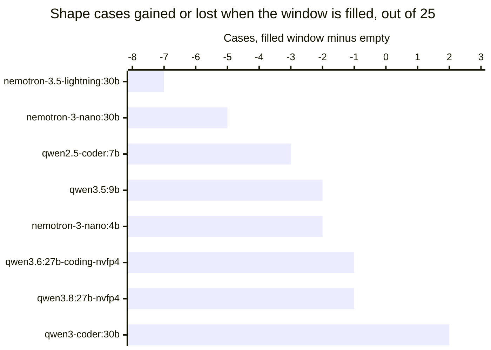

# A full context makes one model stop producing cards and another produce the wrong ones

In
[`freemansoft/Flutter-AdaptiveCards`](https://github.com/freemansoft/Flutter-AdaptiveCards)
a demonstration Dart chat server hands a question to a local Ollama model and
asks for the answer as Adaptive Card JSON, a strict, closed-vocabulary schema
that a Flutter client renders as interactive UI rather than as text. A directory
of probes measures which local models manage that and how well, scoring each
reply on whether it used an element type that would answer the question. Every
one of those probes had been asking into a nearly empty window: a system prompt,
one question, and at most a short seed exchange.

This article asks what a model does when its context is genuinely full, which is
what an ongoing conversation does to it. Eight models were measured twice, once
with an empty window and once carrying roughly 48,500 tokens of history, on an
Apple M1 Max with 64 GB running Ollama 0.33.3. Four are unaffected. Three lose
about a third of their shape coverage, and the two largest losses are opposite
failures that need different defences.

Every figure is transcribed from
[`ModelBehavior.md`](https://github.com/freemansoft/Flutter-AdaptiveCards/blob/main/adaptive_chat_server_dart/ModelBehavior.md),
the lab notebook in that repository.

## Terms used in this article

| Term                    | What it means here                                                                                                                                                                                                                                                                        |
| ----------------------- | ----------------------------------------------------------------------------------------------------------------------------------------------------------------------------------------------------------------------------------------------------------------------------------------- |
| **Shape score**, `n/25` | 25 test cases, one question each, paired with the Adaptive Card element types that would answer it. Scored on one thing: did the reply use one of them? This is shape coverage, not accuracy, and a model can be entirely correct in prose and score low. Figures here are `--samples 1`. |
| **Filler**              | A block of deterministic nonsense the probe prepends as conversation history, sized to a token target, so a run can ask what a model does with a window that is mostly used.                                                                                                              |
| **`prompt_eval_count`** | The token count Ollama reports for the prompt it actually evaluated. It is how each run below proves it delivered the history it meant to.                                                                                                                                                |
| **Empty window**        | The same 25 cases with no history at all. It is the comparison column throughout, and it is the condition nearly every published local-model score is measured under.                                                                                                                     |

**The fill sizes below were verified rather than assumed.** Sizing history is
harder than it looks: the filler is generated text, and the same text runs 4.30
characters per token on one tokenizer and 2.74 on another, which is enough to
overflow a window sized for it and get the whole history silently discarded. A
companion article covers what Ollama does with context parameters, how history
that does not fit is removed whole rather than trimmed, and how that defect was
found and fixed. Every run here reports the token count it actually delivered,
which is the **Prompt tokens** column.

## Four models are unaffected and three lose about a third

Each model was given a filler calibrated to its own tokenizer, sized to fit the
window it is actually allocated. The **Was** column is the same 25 cases with an
empty window.

| Model                        | Prompt tokens | Pass      | Was   |
| ---------------------------- | ------------- | --------- | ----- |
| `qwen3-coder:30b`            | 48459         | 20/25     | 18/25 |
| `qwen3.6:27b-coding-nvfp4`   | 48535         | 20/25     | 21/25 |
| `qwen2.5-coder:7b`           | 24721         | 19/25     | 22/25 |
| `qwen3.5:9b`                 | 48537         | 16/25     | 18/25 |
| `qwen3.8:27b-nvfp4`          | 48539         | 16/25     | 17/25 |
| `nemotron-3.5-lightning:30b` | 48600         | **13/25** | 20/25 |
| `nemotron-3-nano:30b`        | 48611         | **12/25** | 17/25 |
| `nemotron-3-nano:4b`         | 48559         | **6/25**  | 8/25  |

The three bars past minus three are the finding. Everything from minus two
rightward is a single-sample run moving by one or two cases in both directions,
which is noise rather than a ranking.

`nemotron-3.5-lightning:30b` and `nemotron-3-nano:30b` give up about a third of
their coverage for nothing but a full window. `qwen3-coder:30b` gains two cases
carrying the same load.

`qwen2.5-coder:7b`'s minus three is the one bar not to read alongside the
others. It carries 24721 tokens where the rest carry about 48,500, because its
trained window caps it at 32768 and a larger request changes nothing for it. It
takes a smaller filler instead, running its allocated window about three
quarters full, so its bar is a smaller experiment rather than a smaller model
failing harder.

The Nemotron figures are the ones worth acting on, because they reproduced. An
earlier run of the same control carried between 42,500 and 46,300 tokens and
returned 13, 12 and 6 for those three models; the run above carries 48,500 and
returns 13, 12 and 6 again. Two runs at different prompt sizes landing on the
same three counts is a stronger reading than either alone, and none of the Qwen
movements reproduce that way.

## The two big losers fail in opposite ways

A lost case is not one thing. Sorting each run's 25 verdicts by what the judge
said turns the two largest losses into two different problems.

| Model                        | Pass     | No card at all | Card, wrong element |
| ---------------------------- | -------- | -------------- | ------------------- |
| `nemotron-3.5-lightning:30b` | 20 to 13 | **1 to 10**    | 1 to 0              |
| `nemotron-3-nano:30b`        | 17 to 12 | 0 to 0         | **4 to 8**          |
| `qwen2.5-coder:7b`           | 22 to 19 | 0 to 3         | 2 to 1              |
| `nemotron-3-nano:4b`         | 8 to 6   | 14 to 14       | 0 to 0              |

`nemotron-3.5-lightning:30b` **stops producing cards**. All eight cases it loses
come back as prose: it answers the question in plain text rather than emitting
card JSON at all. On an empty window it did that once in twenty-five.

`nemotron-3-nano:30b` keeps producing cards and **picks worse elements**. Its
replies are valid card JSON every time, with a static `TextBlock` substituted
for the interactive input the question called for: `got {TextBlock} want
{Input.Time}`, `want {Input.ChoiceSet}`, `want {Input.Toggle}`. It is asked to
collect something and displays something instead.

The difference decides what defence works. A model that reverts to prose is
caught by any check that asks whether the reply parsed as a card, which is a
check most applications already have. A model that returns a well-formed card
with the wrong element type passes that check and reaches the user as a screen
that renders correctly and cannot be filled in. Catching the second one means
validating the reply against what was asked for, not against the schema.

`nemotron-3-nano:4b` is in the table to be excluded from the finding. Its prose
count does not move, 14 to 14, because it was already answering most cases in
prose on an empty window. Its two lost cases are ordinary single-sample
movement, not a context effect.

`qwen2.5-coder:7b` is the one hint that the effect starts below a full window.
It reverts to prose on three cases while carrying 24721 tokens, roughly half
what the others carry.

**A mechanism consistent with both patterns, and not measured here.** Both
failures are failures to follow the system prompt specifically: the instruction
to answer as a card in one case, the element palette in the other. Ordinary
question answering is intact in both, since a prose reply and a `TextBlock` card
both answer what was asked. That is what degrading instruction adherence over a
long context would look like. Nothing in these runs tests it, and establishing
it would mean moving the instruction or sweeping the fill across sizes to see
whether the loss scales. Neither was run.

## A ranking taken on an empty window reorders on a full one

Capacity under a full window is not predicted by score on an empty one, and the
reordering is large enough to change a choice. On an empty context
`nemotron-3.5-lightning:30b` scores 20/25 and `qwen3.5:9b` scores 18/25. On a
full one the order reverses, 13 against 16.

A model picked from a leaderboard, or from a local benchmark that asks short
questions, is being chosen on the empty-window column. For a chat application
that is the wrong column, and nothing in a published score says which way a
model moves when the window fills.

| Check                                                       | Why                                                                                                                                        |
| ----------------------------------------------------------- | ------------------------------------------------------------------------------------------------------------------------------------------ |
| Measure at the context length you will run at               | Three of eight models here lose about a third of their coverage on a full window, and the empty-window score does not predict which three. |
| Validate the reply against the request, not just the schema | A well-formed card with a `TextBlock` where an input belongs passes every structural check and fails the user.                             |
| Re-measure after a model swap, not just after a prompt edit | The two models that collapse here sit beside four that do not, on the same prompt and the same fill.                                       |

Two caveats travel with all of it. Every figure is a single-sample run, so a
one-case or two-case movement is noise and only the five-case and seven-case
losses are large enough to read. And this is one fill size on one host: the
`qwen2.5-coder:7b` reading suggests the effect begins somewhere below a full
window, but where, and whether it arrives gradually or at a threshold, is
unmeasured.

The repository is
[https://github.com/freemansoft/Flutter-AdaptiveCards](https://github.com/freemansoft/Flutter-AdaptiveCards),
and the lab notebook these figures are read from is
[https://github.com/freemansoft/Flutter-AdaptiveCards/blob/main/adaptive_chat_server_dart/ModelBehavior.md](https://github.com/freemansoft/Flutter-AdaptiveCards/blob/main/adaptive_chat_server_dart/ModelBehavior.md).
