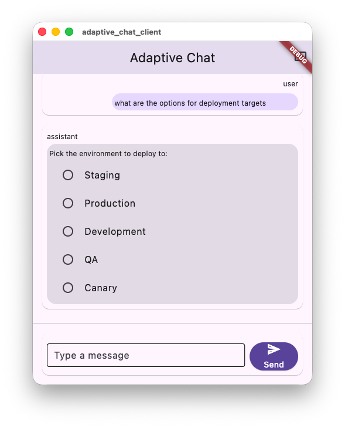

# An SDUI demo that turned into a local-model benchmark

[`freemansoft/Flutter-AdaptiveCards`](https://github.com/freemansoft/Flutter-AdaptiveCards)
is a Flutter renderer for Adaptive Cards. The project includes a demonstration Flutter chat client and Dart chat server.
Enter a question in the client. It goes to the Dart server, which asks a local model running on Ollama
to answer in Adaptive Card JSON. The server decides whether the reply is a card or ordinary text and forwards
the card body; the client renders it as a server-driven UI (SDUI) whose payload was generated by a language
model rather than by a backend programmatic service.

The chat client and server form a demo architecture, not a production one. A production system
would more likely use the model for intent detection, which would then be
mapped to an API call that returns structured domain data, with a deterministic
mapping layer turning that into a card. The demo is thin without any real application
tier, instead relying on the model for JSON card creation.

## Terms used in this article

The first three name parts of the demo. The rest qualify a score. Probe and
flag names are the repository's own.

| Term                                   | What it means here                                                                                                                                                                                                                                                                               |
| -------------------------------------- | ------------------------------------------------------------------------------------------------------------------------------------------------------------------------------------------------------------------------------------------------------------------------------------------------ |
| **Adaptive Card element**              | One component type from the Adaptive Cards schema, such as `Input.ChoiceSet`, `Table` or `TextBlock`. A card body is a list of them, and the client renders each one as a widget.                                                                                                                |
| **Card system prompt** and **palette** | The instructions the chat server sends ahead of every question, [`assets/card_system_prompt.txt`](https://github.com/freemansoft/Flutter-AdaptiveCards/blob/main/adaptive_chat_server_dart/assets/card_system_prompt.txt). Its palette is the list of element types the model may use.           |
| **Detector**                           | The chat server code, [`lib/src/card_detect.dart`](https://github.com/freemansoft/Flutter-AdaptiveCards/blob/main/adaptive_chat_server_dart/lib/src/card_detect.dart), that decides whether a reply is a card or prose and extracts the card body. The probes score replies with this same code. |
| **Probe** and **sweep**                | A probe is one script that sends a fixed question set to one model over Ollama's `/api/chat` and scores each reply. A sweep runs every probe against each model in turn, one model at a time.                                                                                                    |
| **Test set**                           | The questions one probe sends. Three sets score a model here: everyday, stress and shape. Each has its own denominator, given in the table further down.                                                                                                                                         |
| **Shape coverage**, `n/25`             | The shape set's score: how many of its 25 cases the reply answered with one of the element types the question called for. It is not accuracy. A model can answer every question correctly in prose and score 1/25.                                                                               |
| **Cold start** and **with history**    | The shape probe's two conditions. Both open with the seed card exchange. Cold start then asks the question; with history first adds one ordinary prose exchange, replayed the way the chat server sends history.                                                                                 |
| **Seed card**                          | A synthetic two-turn exchange, a pick-one question and a bare card answering it, that the server prepends to the history so a card is the established format. Every shape score here is seeded. The everyday and stress sets send one question with no seed and no history.                      |
| **`--samples 2`**                      | Each shape case runs twice and passes only if both runs pass, so a one-case difference between two models is noise.                                                                                                                                                                              |
| **Tool channel**                       | Ollama's function-calling API. The server declares a `render_adaptive_card` function, and a model that calls it returns the card as the call's arguments, already parsed, instead of as text.                                                                                                    |
| **Stall**                              | A call that exceeds the probe's 120 s per-call ceiling and scores as a failure. A slow model and a busy machine look the same to the probe.                                                                                                                                                      |
| **Resident**                           | Loaded in memory by an Ollama runner. Every figure here was taken with one model resident at a time.                                                                                                                                                                                             |

## The model's reply is the UI, not text about it

Adaptive card generation works as a test problem for local models, and the
results carry beyond this demo to any workload that asks a local model for
constrained, schema-shaped JSON. The demo became an instrumented test bed. The measurement sweeps execute
probes that run against each model in turn. The sweeps were built to score the models, and what
they turned up kept changing the chat server.

_`qwen2.5-coder:7b`, unedited model output rendered by the demo client in
[`adaptive_chat_client/`](https://github.com/freemansoft/Flutter-AdaptiveCards/tree/main/adaptive_chat_client)._

## Answering in cards applies four constraints at once

Producing an Adaptive Card imposes four response requirements in each reply:

- Strict JSON.
- A closed element vocabulary. An element is an Adaptive Card component type,
  `Input.ChoiceSet`, `Table`, `TextBlock`. The reply may use no others.
- An SDUI element type chosen to fit the question.
- Format stability across a multi-turn conversation, retaining the use of cards.

Each of the four has pass/fail gates. The JSON parses, or it does not.
The element type is either one the client renders, or it is not.
The shape either answers
the question, a pick-from-a-set question wants a control the user can click,
or it does not. The format either survives the conversation's prior turns or
drifts back to Markdown. That combination is what made this workload worth
measuring.

## `llama3-chatqa:8b` passes the everyday and stress sets in prose and scores 1/25 on shape

Two of the three test sets, everyday and stress, ask only whether a reply comes
back usable. Each sends one question with no history and no seed card. The card
system prompt permits a plain Markdown answer when no element type fits the
question. Both sets therefore pass a reply that renders as a card or as clean
prose. A reply fails as a broken card, a card with a duplicate key, a card
wrapped in prose, or a stalled call. A model that answers everything in tidy
Markdown clears both sets without building a card. `llama3-chatqa:8b` comes
close to that. It scores **21/21** on the everyday set with 2 cards and 19 prose
replies, and **10/10** on the stress set with 0 cards and 10 prose replies.

The third test set, shape, asks a stricter question: did the reply use the
element type the question called for? A pick-from-a-set question calls for a
clickable control, and tabular data calls for a table. The same model does so on
**4 of 25** cases cold start, with only the seed card exchange ahead of the
question. It does so on **1 of 25** with history, where one prose exchange
follows the seed.

The usability figures and the shape figures measure different things, so they
do not conflict. That is the result that generalizes: renderable prose is not
always a pass. An options question answered as a Markdown list renders and still
cannot be clicked, and no JSON-validity check catches that.

## No score in this series counts an invented element type

Three places inspect a reply in the running system. The chat server never
renders a card: Ollama generates it and the client renders it. The probes, which
send fixed question sets to a model over Ollama's `/api/chat`, reuse the first
two places.

1. **The chat server's card detector** runs on every reply in the request path.
   It decides whether the reply is a card or prose, repairs certain near-miss
   replies so they parse, and extracts the body array the chat server forwards
   to the client. A reply that looks like a card but fails to parse, or repeats
   a JSON key, goes to the client as text. That text is the raw JSON a user
   sees. The probe scripts in
   [`tool/model_probes`](https://github.com/freemansoft/Flutter-AdaptiveCards/tree/main/adaptive_chat_server_dart/tool/model_probes)
   import that same detector rather than reimplementing it. A probe therefore
   cannot score a reply as a card that the running chat server would have shown
   as prose. A probe with its own definition could report a pass rate the
   running chat server disagrees with.
2. **The chat server's element vocabulary check** runs next. It reads the legal
   type list out of the shipped card schema and walks the body at any depth. An
   unknown type draws a logged warning, and the card goes to the client anyway.
   The shape probe records the same check on every call, but no score counts
   it.
3. **The Flutter client** converts the card JSON into a widget tree, one widget
   per `type`. It is the only place an invented type shows, as a red error
   placeholder naming the unknown type.

An invented type is valid JSON inside a well-formed card, so it clears the card
detector and scores as a card on the everyday and stress sets. A shape case
fails it only when no accepted element sits beside it. The placeholder is the
one user-visible failure that no score in this series counts.
[The measurement rules article](https://joe.blog.freemansoft.com/2026/09/eight-measurement-rules-from-local.html)
covers the harness mistakes that did reach the scores.

The first chat server prototype had no card detector. The chat server's detector
arrived before the test probes, and it was iterated on as a result of the evolving tests. It accepts three JSON forms that can hold a card, because local
models emit all three:

- a whole `AdaptiveCard` object
- a bare array of Adaptive Card elements
- a single Adaptive Card element

The chat server's detector restores missing enclosing brackets, because a small model asked for two
elements often writes them comma-separated with no array around them. It
attempts a plain parse before stripping Markdown fences, because the fence
stripping had truncated a valid card whose own text opened a fenced code
block. It reports why it rejected a JSON-looking reply, because "not a card" is
not a log line anyone can act on. The vocabulary check also came from the
sweeps, which kept producing cards that passed the detector and still showed
the user an error placeholder in place of an element.

## Each test set asks a different question of the same reply

Everything here was measured against a local Ollama on an Apple
M1 Max with 64 GB. A later article runs the same benchmark
on a second machine.

Each set asks one question of a model's replies, so a score is only readable
next to the name of its set. Everyday and stress ask whether a reply renders.
Shape asks whether it used the right element type.

| Set (script)                         | What it sends, and how the denominator is built                                                                                     | What it asks of the reply                                                                                                                                             | What it is for                               |
| ------------------------------------ | ----------------------------------------------------------------------------------------------------------------------------------- | --------------------------------------------------------------------------------------------------------------------------------------------------------------------- | -------------------------------------------- |
| Everyday (`temperature_matrix.dart`) | 7 ordinary requests, one per common kind of reply, × 3 temperatures (`0`, `0.2`, `0.6`) = **21**                                    | Does the reply render, as a card or as clean prose?                                                                                                                   | Is this model usable at all?                 |
| Stress (`temperature_stress.dart`)   | 5 hard requests (code, big table, nested form, escaped strings, two structures in one reply) × 2 temperatures (`0`, `0.6`) = **10** | Does the reply still render when the request is hard?                                                                                                                 | Which model or setting should we ship?       |
| Shape (`shape_ab.dart`)              | **25** cases, scored cold start and with history, `--samples 2`                                                                     | Did the reply use one of the element types that would answer this question? Each case names its own accepted set, since more than one element is often equally right. | Does the card do the job the question asked? |

One shape case is a control with an empty accepted set: "In two sentences, why
is the sky blue?" passes only as prose.

One question from each set:

- **Everyday**: "What size shirt should I order? Offer S, M, L, XL."
- **Stress**: "Build me a full expense report form: a title, a date picker, an
  amount field, a category dropdown with 6 categories, a multiline notes box,
  and submit/cancel buttons."
- **Shape**: "what are my options for deployment targets", whose accepted set
  is a single element: it passes only on an `Input.ChoiceSet`.

The table has three rows because those are the three sets that score a _model_.
The probe directory holds others that ask different questions. `prompt_ab.dart`
holds the model fixed and A/B-tests two card system prompts against each other
over the same user questions. The tuning article uses it to catch a prompt edit
that regressed. `tool_call_probe.dart`, used further down, asks whether a model
will return a card through Ollama's tool channel instead of as message text.

## One prose exchange can turn a card answer into Markdown

Cold start and with history are the shape probe's two conditions. Both open
with the seed card exchange. Cold start then asks the question; with history
first adds one ordinary prose exchange.

The effect was first measured before the seed card existed. On 2026-08-14,
`qwen2.5-coder:7b` at `t=0` answered "what are my options for deployment
targets" with an `Input.ChoiceSet` when it was the first thing asked. With
**one** ordinary exchange ahead of it, a question answered in Markdown, the same
question came back as 867 characters of Markdown; with two exchanges, 903. No
card either time. The seed card closed most of that gap, and in the seeded run
`qwen2.5-coder:7b` no longer loses this case to history.

Losing the card format does not require a long conversation. Model replies
appear to follow the format the conversation is already in, so a question that
would have produced a card can come back as prose once prose is what precedes
it. That is a per-question effect rather than a latch: the same model, seeded
and with one prose exchange, still produces the right element on 18 of 25 shape
cases. A cold-start score therefore describes a condition most users are not in,
which is why every score below carries its condition.

## Shape coverage runs from 25/25 to 1/25 across fifteen models

Before any score: these are all measured on the configuration the server ships,
`t=0` (temperature zero), `think: false` (no chain-of-thought preamble), and
a synthetic two-turn card seed prepended to the context. What that seed is worth varies by model, from +10 shapes to −2, and a
later article measures it model by model. Read the figures below as seeded
figures.

**A one-point difference between two models is noise.** A
re-measurement on 2026-08-20 moved ten of twelve otherwise-steady models by ±1
shape with nothing about them changing. Shape figures run at `--samples 2`, so
one borderline call fails the whole case. Everyday and stress run each case
once, at `--samples 1`.

With-history shape coverage across the fifteen models measured runs from
**25/25 to 1/25**. Six of them:

| Model               | Size    | Cold-start | With history |
| ------------------- | ------- | ---------- | ------------ |
| `gpt-oss:20b`       | 12.8 GB | 25/25      | 25/25        |
| `qwen3.8:27b-nvfp4` | 16.9 GB | 24/25      | 24/25        |
| `granite4.1:8b`     | 5.0 GB  | 23/25      | 21/25        |
| `qwen2.5-coder:7b`  | 4.4 GB  | 20/25      | 18/25        |
| `llama3.2:latest`   | 1.9 GB  | 15/25      | 15/25        |
| `llama3-chatqa:8b`  | 4.3 GB  | 4/25       | 1/25         |

**Model size does not predict shape coverage.** `granite4.1:8b` at 5.0 GB scores
21/25 with history, matching two models four times its size. Size does not
predict speed either, but a speed figure needs its host and its Ollama version
named, so a later article reports that comparison.

**Cold start does not predict with-history performance, in either direction.**
Five of the fifteen score the same under both conditions, two gain a shape with
history
(`hf.co/unsloth/Nemotron-3-Nano-30B-A3B-GGUF:latest` and
`nemotron-3.5-lightning:30b`), and three lose two (`granite4.1:8b`,
`qwen2.5-coder:7b`, and `nemotron-3-nano:4b`). Judge on the with-history column,
because that is the condition a user is in.

Everything above depends on finding JSON inside a text reply. The detector
exists because that is unreliable. Ollama offers a way to avoid it, called tool
calling.

Tool calling works like this. The server tells the model about one function,
`render_adaptive_card`, and says the model may call it. A model that takes the
offer does not write a reply at all. It asks to call that function, and the card
is the data it passes to the call. Ollama hands that back in a field of its own,
already parsed, separate from the message text. That field is the tool
channel. Nothing is
left in the text for the server to fish out.

Not every model can do this, and ones that cannot do not say so. The model
answers with ordinary text. A model that _can_ call functions may also never
pick this one. `tool_call_probe.dart` sorts the fifteen models four ways, and
nothing in the scores above predicts where a model lands.

| Models | Offered the card function, the model     | What comes back                   |
| ------ | ---------------------------------------- | --------------------------------- |
| **7**  | calls it                                 | A parsed card, no JSON to recover |
| **3**  | can call functions, but never picks it   | An ordinary text reply            |
| **3**  | calls it even when the question is prose | A card nobody asked for           |
| **2**  | cannot call functions at all             | An ordinary text reply            |

One of the three that never picks the card function was trained specifically for
tool use. One of the two that cannot call functions at all is the model the
server ships as its default.

The split is not a fixed property of a model either. Re-running the probe after
rewording the system prompt, with the same schema and the same question, moved
four of the fifteen models between rows, in both directions. A model that can
be talked into calling the function can be talked out of it again.

For low-memory machines, the best-performing model
is `granite4.1:8b`: 21/25 with history in 5.0 GB. Hardware is the
constraint behind that recommendation: seven of the fifteen models do not fit a
16 GB host at all. A later article names those seven and measures what the
smaller machine costs.

## A busy machine and a slow model look identical to a probe

The first version of one shape test sweep omitted the step that unloads each
model before the next one loads. Probes send `keep_alive: 30m`, so the finished
model stayed resident while the next loaded, two models sat in memory together,
and Ollama thrashed between them. `granite4.1:3b` recorded **52 stalled calls**
and scored 12/25 with history where an idle machine gives **17/25**. With the
unload in place the sweep took **7 minutes instead of 124**.

Nothing about the model changed between those two runs. The wrong measurement
looked exactly like a slow model, because from the probe's side a reply that
takes too long is a reply that takes too long, whatever the reason. Every figure
in this article was collected with **one model resident at a time**: load a
model, run all of its probes, record the result, unload, move on.

## Four things generalize past this demo

Each holds for any workload that asks a local model for schema-shaped JSON.

- Test the shape your workload needs, not a chat benchmark. A model can pass
  one and fail the other.
- Judge replies with the detector your server runs. A second definition of
  correct gives a score the server would disagree with.
- Measure with conversation history, not only from a cold start. One prose
  exchange changed the answer here.
- State the test set and the condition beside every score. `18/25` on its own
  cannot be read.

Seven articles follow this one. [The tuning
process](https://joe.blog.freemansoft.com/2026/09/we-tried-14-levers-to-get-reliable-card.html)
tries fourteen levers on this workload and says which shipped. [The two-host
comparison](https://joe.blog.freemansoft.com/2026/09/benchmarking-local-model-llm-generated.html)
runs the same benchmark on a 64 GB M1 Max and a 16 GB M5. [The tool channel
article](https://joe.blog.freemansoft.com/2026/09/ollamas-tool-channel-produces-better.html)
measures Ollama's tool channel against prose on every model that calls it.
[The measurement
rules](https://joe.blog.freemansoft.com/2026/09/eight-measurement-rules-from-local.html)
collect eight rules from the harness mistakes the sweeps made. [The
context-window
article](https://joe.blog.freemansoft.com/2026/09/ollama-silently-drops-history-message.html)
shows Ollama dropping a history message larger than the window, with no error.
[The full-context
article](https://joe.blog.freemansoft.com/2026/09/a-full-context-breaks-three-local.html)
measures what a filled window costs each model's card coverage. [The
prompt-cache
article](https://joe.blog.freemansoft.com/2026/09/on-ollama-models-memory-type-and-its.html)
explains how much of a cached system prompt a new conversation reuses, by
memory type and runner.

The project is at
[https://github.com/freemansoft/Flutter-AdaptiveCards](https://github.com/freemansoft/Flutter-AdaptiveCards),
and the lab notebook every figure above is drawn from is at
[https://github.com/freemansoft/Flutter-AdaptiveCards/blob/main/adaptive_chat_server_dart/ModelBehavior.md](https://github.com/freemansoft/Flutter-AdaptiveCards/blob/main/adaptive_chat_server_dart/ModelBehavior.md).
