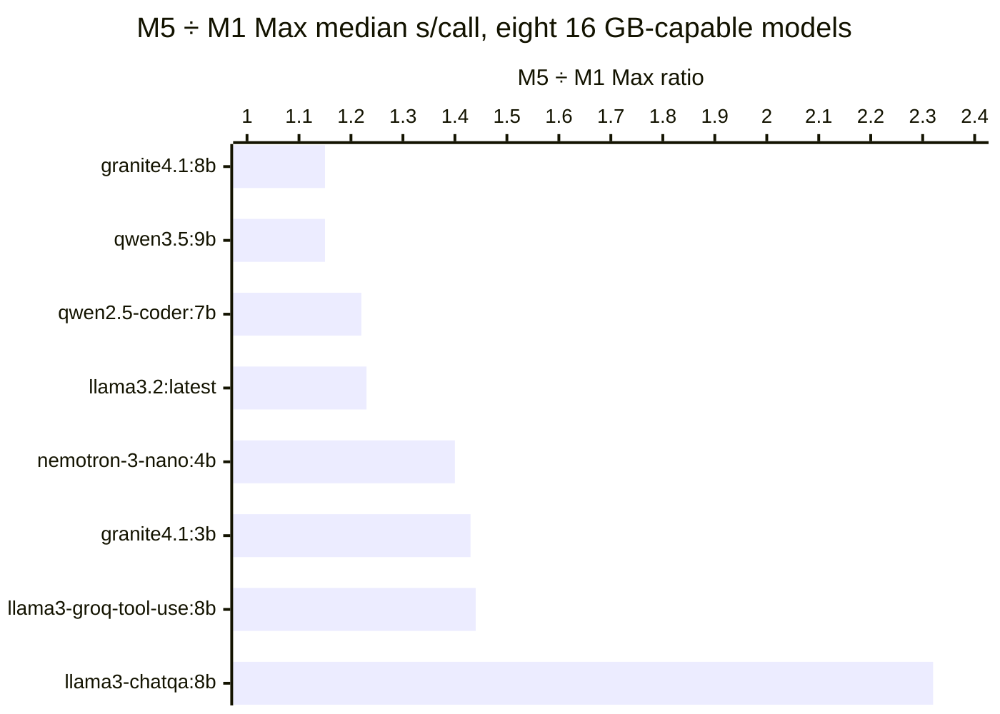

# Benchmarking local LLM generated Adaptive Card JSON on a 64 GB M1 Max and 16 GB M5

In
[`freemansoft/Flutter-AdaptiveCards`](https://github.com/freemansoft/Flutter-AdaptiveCards)
a demonstration Dart chat server hands a question to a local Ollama model and
asks for the answer as Adaptive Card JSON, a strict, closed-vocabulary schema,
which a Flutter client renders as interactive UI rather than as text. A
directory of probes measures which of fifteen local models manage that, how
well, and how fast. We built the probes on a 64 GB machine. What changes when
they run on one a quarter that size?

## Two machines, one set of test probes

Two Apple machines ran the same probes and the same prompts, with the prompt and
seed files confirmed byte-identical by checksum: a 64 GB M1 Max MacBook Pro
14-inch (`MacBookPro18,4`), the host the probe suite was built on, and a fanless
16 GB M5 MacBook Air (`Mac17,3`) used for comparison. The goal was to validate
execution and measure performance differences when running the same models on
two Apple Silicon chips with different memory sizes and bandwidth.

Both hosts ran models back-to-back for hours, so each median below carries
whatever position in that run its model drew. One control on the M1 Max puts a
number on that: the same model runs **1.54x** slower right after an eight-hour
sweep than it does cold, and that single-machine spread is wider than seven of
the eight host-to-host ratios below. A later section shows the control. Read
the ratios as a direction, not a per-model figure. The 16 GB recommendation
rests on fit and shape score.

Every figure below comes from
[`ModelBehavior.md`](https://github.com/freemansoft/Flutter-AdaptiveCards/blob/main/adaptive_chat_server_dart/ModelBehavior.md),
a lab notebook in the
[`freemansoft/Flutter-AdaptiveCards`](https://github.com/freemansoft/Flutter-AdaptiveCards)
repository.

## Terms used in this article

The first term describes a model, the next three qualify a score, and the last
three describe a run.

| Term                                      | What it means here                                                                                                                                                                                                                                                                                                                                                                                                                                                                                                                                                                                |
| ----------------------------------------- | ------------------------------------------------------------------------------------------------------------------------------------------------------------------------------------------------------------------------------------------------------------------------------------------------------------------------------------------------------------------------------------------------------------------------------------------------------------------------------------------------------------------------------------------------------------------------------------------------- |
| **Weights** and the `b` in a model tag    | The weights are the parameter file Ollama loads into memory, and the GB figure in the fit table is that file's size. The `b` in a tag such as `granite4.1:8b` counts parameters in billions, which is a different quantity: quantization decides how many bytes each parameter costs, so the three models tagged `:30b` here range from 17.3 GB to 23.7 GB. Fit is decided by the GB figure, never by the parameter count.                                                                                                                                                                        |
| **Shape score**, `n/25` (`shape_ab.dart`) | 25 prompt test cases, one user question each, paired with the Adaptive Card element types (the schema's UI component types, such as `Input.ChoiceSet` or `Table`) that would acceptably answer it. Each is scored on one thing: did the reply use one of them? "What are my options for deployment targets" passes only on an `Input.ChoiceSet`. Each case is run twice and passes only if both runs did, so a one-point difference between two models is noise: one borderline call flips a case. This is shape coverage, not accuracy: a model can be entirely correct in prose and score 1/25. |
| **Cold start** and **with history**       | The shape probe's two conditions: the question asked first, or asked with ordinary exchanges already in the conversation. The two differ, and a score under one is never quoted against the other. Figures below are with-history unless the text says otherwise.                                                                                                                                                                                                                                                                                                                                 |
| **Seeded** and **unaided**                | Seeded is the configuration the server ships, a synthetic two-turn card exchange prepended to the context. Unaided is the same probe without it. The seed is worth +10 shapes to −2 depending on the model, so a score named without its configuration is half a fact.                                                                                                                                                                                                                                                                                                                            |
| **Median s/call**                         | Median over the 25-case shape sweep, excluding the first call after a model load (roughly 6-7x a warm one) and excluding stalled calls, which measure the timeout rather than the model.                                                                                                                                                                                                                                                                                                                                                                                                          |
| **Full sweep**                            | Wall clock for the seven standard probes against one model, stalls included. That is time someone waited.                                                                                                                                                                                                                                                                                                                                                                                                                                                                                         |
| **Stall**                                 | A call that exceeds the probe's 120 s per-call ceiling and is scored a failure. A stall does not name its cause: a slow model and a busy machine are indistinguishable from the probe's side.                                                                                                                                                                                                                                                                                                                                                                                                     |

## Seven models fit in 16 GB outright, and one marginally fits

Both hosts are Apple Silicon Macs with unified memory, so there is no separate
VRAM budget. The number on the box is one pool shared by macOS, the model and
everything else running on the machine. The table below reads all fifteen
against a 16 GB host: ✅ fits, ⚠️ marginal, ❌ does not. The Weights column
decides a model's fit, meaning the size of the model's parameter file, not the
`b` in its name.

| Model                                               | Weights | 16 GB |
| --------------------------------------------------- | ------- | ----- |
| `gpt-oss:20b`                                       | 12.8 GB | ❌    |
| `granite4.1:3b`                                     | 2.0 GB  | ✅    |
| `granite4.1:8b`                                     | 5.0 GB  | ✅    |
| `hf.co/unsloth/Nemotron-3-Nano-30B-A3B-GGUF:latest` | 22.9 GB | ❌    |
| `llama3-chatqa:8b`                                  | 4.3 GB  | ✅    |
| `llama3-groq-tool-use:8b`                           | 4.3 GB  | ✅    |
| `llama3.2:latest`                                   | 1.9 GB  | ✅    |
| `nemotron-3-nano:4b`                                | 2.6 GB  | ✅    |
| `nemotron-3-nano:30b`                               | 22.6 GB | ❌    |
| `nemotron-3.5-lightning:30b`                        | 23.7 GB | ❌    |
| `qwen2.5-coder:7b`                                  | 4.4 GB  | ✅    |
| `qwen3-coder:30b`                                   | 17.3 GB | ❌    |
| `qwen3.5:9b`                                        | 6.1 GB  | ⚠️    |
| `qwen3.6:27b-coding-nvfp4`                          | 18.4 GB | ❌    |
| `qwen3.8:27b-nvfp4`                                 | 16.9 GB | ❌    |

The marginal model model for 16GB machines is `qwen3.5:9b` at 6.1 GB.
The other seven do not fully fit in within 16GB at all with their size and quant settings.

Model weights are not the whole memory budget. `gpt-oss:20b` is **12.8 GB**
against a 16 GB machine and is still a ❌, because those weights share the pool
with macOS and the runtime, so the usable ceiling sits below the number on the
box. ❌ means "do not recommend this as the default on a 16 GB host", not
"untested". Every one marked as ❌ for 16GB was measured on the 64 GB machine.

The best pick for a 16 GB host is `granite4.1:8b`: 21 of 25 shape cases, in
5.0 GB. A shape score counts only whether the reply used an element type that
would answer the question, so this measures coverage, not accuracy.

`gpt-oss:20b` scores 25 of 25 on the 64 GB machine. It is the only model in the
notebook to do so under any condition, and at 12.8 GB it is still a ❌ for
16 GB. Moving to the smaller machine costs four test cases out of twenty-five.
The notebook's
[roster](https://github.com/freemansoft/Flutter-AdaptiveCards/blob/main/adaptive_chat_server_dart/ModelBehavior.md#candidate-models),
where the ✅/⚠️/❌ marks above come from, calls `gpt-oss:20b` "the exception the
16 GB column exists to flag".

That 21/25 score is a _seeded_, with-history figure. Unaided, `granite4.1:8b`
scores **15/25**, a **+6** seed gain, while `qwen2.5-coder:7b` scores **18/25**
either way. A 16 GB recommendation has to name the configuration, not just the
model.

## All eight models ran slower on the M5, 1.15x to 1.44x with one outlier

The eight models that fit or nearly fit then ran on both hosts, recorded in
[the notebook's per-host performance section](https://github.com/freemansoft/Flutter-AdaptiveCards/blob/main/adaptive_chat_server_dart/ModelBehavior.md#performance-by-host-and-runtime).
Median s/call is the like-for-like column: the same 25 shape cases on each
machine, with the load call and any stalled call excluded. The sweep and stall
columns describe the run rather than the model, and they part company with the
median wherever a call hit the 120 s ceiling. The medians and ratios are the
notebook's derived cross-host table, computed from the recorded runs by its
`perf_table.py` script at millisecond precision and rounded here to two
decimals. Models are ordered by ratio.

| Model                     | Size   | M1 Max s/call | M5 s/call | M5 ÷ M1 Max | M1 Max sweep | M5 sweep | M1 Max stalls | M5 stalls |
| ------------------------- | ------ | ------------- | --------- | ----------- | ------------ | -------- | ------------- | --------- |
| `granite4.1:8b`           | 5.0 GB | 2.85 s        | 3.27 s    | 1.15x       | 15 min       | 17 min   | 0             | 0         |
| `qwen3.5:9b`              | 6.1 GB | 4.92 s        | 5.65 s    | 1.15x       | 24 min       | 29 min   | 0             | 0         |
| `qwen2.5-coder:7b`        | 4.4 GB | 2.38 s        | 2.90 s    | 1.22x       | 19 min       | 22 min   | 0             | 0         |
| `llama3.2:latest`         | 1.9 GB | 1.34 s        | 1.65 s    | 1.23x       | 13 min       | 15 min   | 2             | 2         |
| `nemotron-3-nano:4b`      | 2.6 GB | 2.54 s        | 3.54 s    | 1.40x       | 16 min       | 30 min   | 1             | 4         |
| `granite4.1:3b`           | 2.0 GB | 0.98 s        | 1.40 s    | 1.43x       | 124 min      | 13 min   | 52            | 1         |
| `llama3-groq-tool-use:8b` | 4.3 GB | 1.85 s        | 2.67 s    | 1.44x       | 9 min        | 13 min   | 0             | 0         |
| `llama3-chatqa:8b`        | 4.3 GB | 0.11 s        | 0.25 s    | 2.32x       | 3 min        | 5 min    | 0             | 0         |

Both hosts run the same Ollama line so each model's ratio compares two machines and not
two runtimes. `qwen3.5:9b` is the model to read carefully even so. Its M1 Max
figure is the cold arm of the sweep-position control shown later in this
article, taken at position 0 after 29 minutes idle, where the other seven M1
Max figures are in-sweep measurements. The hot arm of that control would put
the model below 1.0x instead of at 1.15x.

Every model is slower on the M5 just not as much as I expected. Seven of the eight ratios fall inside
1.0-1.5x.** Two hardware differences could account for that, compute and
memory bandwidth, and compute is the less likely.
[The notebook](https://github.com/freemansoft/Flutter-AdaptiveCards/blob/main/adaptive_chat_server_dart/ModelBehavior.md#performance-by-host-and-runtime)
puts this 8-core M5 at roughly parity with or ahead of the 32-core M1 Max on
AI compute, scaling Apple's published core counts and multipliers. Memory
bandwidth is where the two part: **153 GB/s** on the M5 against **400 GB/s\*\*
on the M1 Max. Single-stream token generation spends its time streaming the
model's weights out of memory, not on arithmetic, so it is bandwidth-bound,
and bandwidth is the ratio consistent with these medians.

The widest ratio in the table is the least meaningful one. `llama3-chatqa:8b`
at **2.32x** is 0.11 s against 0.25 s: 140 ms of absolute difference on the
fastest model in this table, where load and scheduling overhead are a larger
share of the call than the model's own compute. It heads the table for the
wrong reason as well. It answers in short prose instead of building a card,
which is what its **1/25** shape score looks like from the latency side.

`nemotron-3-nano:4b` is the model where the sweep column moves further than the
median does: 16 minutes to 30, against 1.40x on the median. Its stall count
moves the same way, 1 to 4, and a stalled call is wall clock the median
excludes by construction. The notebook records `chart`, a case in the everyday
set of ordinary one-shot requests that asks for a chart element, as a hang
trigger for this model that reproduces on both runtimes. The extra M5 minutes
are consistent with more calls reaching the 120 s ceiling, not with slower
generation throughout.

Model size does not predict speed on either host. The fastest real card
producer measured is `qwen3-coder:30b` at **1.5 s/call** on the M1 Max, ahead
of `qwen2.5-coder:7b` at a quarter its size, and it is off this table because
it needs 17.3 GB. The slowest is `gpt-oss:20b` at **7.2 s**, in 12.8 GB.

Four caveats apply to the table.

1. The M1 Max runs for `granite4.1:3b` and `llama3.2:latest` came **after
   runner eviction**, and the other six **before runner eviction**. Runner
   eviction is a harness change, described in the measurement-hygiene article
   in this series, that sends Ollama an unload after a call times out. It is a
   no-op unless a call times out. Five of those six recorded zero M1 Max
   stalls, and the sixth, `nemotron-3-nano:4b`, recorded one, matching its
   count on the earlier runtime, so the comparison holds for them.
2. `granite4.1:3b`'s M1 Max sweep and stall cells, 124 minutes and 52, are
   cascade-damaged and are not model figures. The measurement-hygiene article
   in this series owns that account. Read only the median for that model:
   0.98 s against 1.40 s, faster on the M1 Max.
3. Neither Ollama version here is current. The M1 Max host has since moved to
   **Ollama 0.33.3**, and no figure in this article was re-taken on it.
4. **Every figure in this article was measured against a nearly empty
   context.** A probe call sends the card system prompt, one question, and at
   most a two-turn seed, and a conversation that has filled its window is a
   different measurement on both axes. A later run with roughly 48,000 tokens
   in the window costs three of the fifteen models about a third of their
   shape coverage. Two are 30b models that do not fit 16 GB, and the one in
   the table above is `qwen2.5-coder:7b`, which lost three cases. The
   full-context article in this series owns that account. Read the medians
   here as what a short exchange costs, which is what the demo's own traffic
   looks like, and not as what a long conversation costs.

### Re-running a model on the same machine moves its median by up to 1.54x

Four of the eight models were measured a second time against their own
published run, to find out how far one in-sweep figure can move on its own —
five re-runs in total, since `granite4.1:8b` was tested twice. All five are in
[the same notebook section](https://github.com/freemansoft/Flutter-AdaptiveCards/blob/main/adaptive_chat_server_dart/ModelBehavior.md#performance-by-host-and-runtime).

| Model              | Host   | First run                           | Second run                     | Second ÷ first                  |
| ------------------ | ------ | ----------------------------------- | ------------------------------ | ------------------------------- |
| `llama3.2:latest`  | M5     | in-sweep, 89 min, 40 stalls         | idle machine, 15 min, 2 stalls | 1.06x (1559 ms vs 1650 ms)      |
| `qwen3.5:9b`       | M1 Max | position 0, after 29 min idle       | 7 s after an eight-hour sweep  | **1.54x** (4924 ms vs 7563 ms)  |
| `granite4.1:8b`    | M5     | position 0 of the eight-model sweep | 13 s after that sweep          | **1.20x**                       |
| `granite4.1:8b`    | M5     | position 0 of the eight-model sweep | after 7h37m idle               | **1.12x** (p25 1.07 / p75 1.15) |
| `qwen2.5-coder:7b` | M5     | 17 min into the eight-model sweep   | after 31 min idle              | 1.03x                           |

The published figure is the first run for every model except `llama3.2:latest`,
where it is the second.

The idle re-run of `llama3.2:latest` matched the M1 Max shape scores, and its
median barely moved. The model was never slow; something else on the machine
was, and what it was is not recorded. The second run is the one in the latency
table above. The rule it left behind: re-run a suspicious result on an idle
machine before publishing, because a busy machine and a slow model look the
same from the probe's side.

The `qwen3.5:9b` runs measure what sweep position alone costs, and the replies
did not move with it: 0 of 100 calls differed between the cold and hot runs.
Position moves latency and leaves coverage alone. The M5 column carries the
same exposure, since its eight models come from one sweep that ran 10:27 to
14:32, and models measured later had more sustained load behind them.

The fanless MacBook Air is the obvious place to look for a thermal penalty, so
`granite4.1:8b` was re-run twice to test it. A thermal reading predicts a slow
hot re-run and a baseline idle one. Instead the idle re-run came nearly as
slow, with a tight spread: two nominally cold measurements, twelve hours
apart, differ this much. That reproducibility variance absorbs most
of the hot re-run's gap. `qwen2.5-coder:7b` moved the other way, slower after
idling than in-sweep, and two models moving in opposite directions is not a
machine property. The M1 Max's own hot/cold spread above, on a machine with
fans, is wider than either M5 figure, so a swing this size does not need a
fanless chassis to explain it. Throttling is not ruled out, only unmeasured:
**no run read die temperature or clock frequency**. No figure carries a
correction. Read the M5 column as one sweep's figures carrying a
position-dependent bias about the size of its reproducibility floor.

## The eight models that fit in 16 GB pass from 21/25 to 1/25 of the shape cases

Fit only shortlists the eight, among which `granite4.1:8b` (5.0 GB) scores
21/25 and `qwen3.5:9b` (6.1 GB) 19/25, while `llama3.2:latest` (1.9 GB) scores
15/25 and `llama3-chatqa:8b` (4.3 GB) **1/25**, all seeded, with-history
figures. All four run on the small machine, so the recommendation is
**`granite4.1:8b`**. With 64 GB, `gpt-oss:20b` that is four
test cases better at 25/25.

Three measurement rules came out of running the same probes twice on different
hardware.

1. Record the host and the runtime version into every result file so that the
   data set can be reliably used in later comparisons.
2. Derive published tables from the recorded runs instead of transcribing
   them; the measurement-hygiene article records what that caught.
3. When a measurement carries a bias whose size is only roughly known,
   publish the raw figure and state the bias beside it. The M5 medians are
   skewed by sweep position by an amount the re-runs bound but do not pin
   down, so no model test result was multiplied by a guessed factor. A corrected figure
   would hide that it had been corrected.

The repository is
[https://github.com/freemansoft/Flutter-AdaptiveCards](https://github.com/freemansoft/Flutter-AdaptiveCards),
and the lab notebook these figures come from is
[https://github.com/freemansoft/Flutter-AdaptiveCards/blob/main/adaptive_chat_server_dart/ModelBehavior.md](https://github.com/freemansoft/Flutter-AdaptiveCards/blob/main/adaptive_chat_server_dart/ModelBehavior.md).
