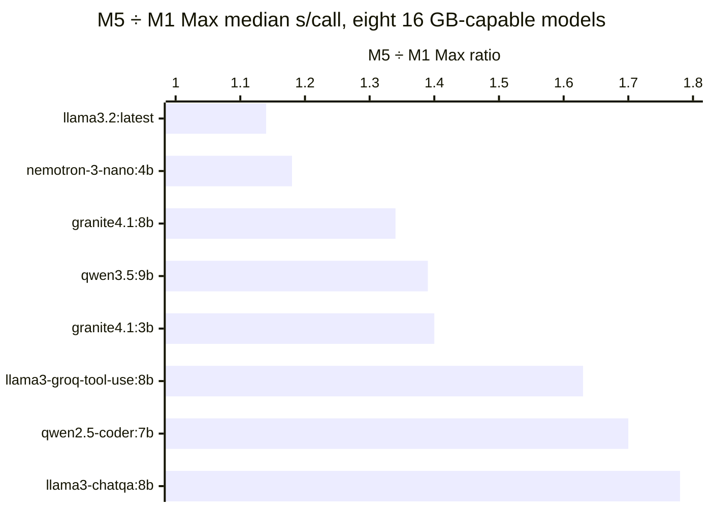

# Benchmarking local LLM generated Adaptive Card JSON on a 64 GB M1 Max and 16 GB M5

In
[`freemansoft/Flutter-AdaptiveCards`](https://github.com/freemansoft/Flutter-AdaptiveCards)
a demonstration Dart chat server hands a question to a local Ollama model. It
asks for the answer as Adaptive Card JSON. Adaptive Cards is a strict,
closed-vocabulary schema. A Flutter client renders the JSON as interactive
UI rather than as text. The project's test probes measure how
well fifteen local models produce that JSON, and how fast. The
project built the probes on a 64 GB M1 Max, then ran them on a 16 GB M5.

Eight of the fifteen models fit, or nearly fit, in 16 GB. On the M5 each model
took 1.14x to 1.78x the M1 Max's median time per call. The median of the eight
ratios is 1.40x. Each model ran once per host, so each ratio gives a direction,
not a per-model figure. The top three models score within one shape-probe case
of each other. Memory fit and per-call time therefore decide the 16 GB choice. That
model is `granite4.1:8b`: 20 of 25 cases on one host and 21 on the other, in 5.0
GB of weights.

Every figure below comes from one matched sweep of the two hosts, recorded in
[`ModelBehavior.md`](https://github.com/freemansoft/Flutter-AdaptiveCards/blob/main/adaptive_chat_server_dart/ModelBehavior.md),
a lab notebook in the repository. The notebook also holds earlier runs this
article does not use.

## Terms used in this article

| Term                                      | What it means here                                                                                                                                                                                                                                                                                                                                                                                                                                                                                                                                                                                                                                  |
| ----------------------------------------- | --------------------------------------------------------------------------------------------------------------------------------------------------------------------------------------------------------------------------------------------------------------------------------------------------------------------------------------------------------------------------------------------------------------------------------------------------------------------------------------------------------------------------------------------------------------------------------------------------------------------------------------------------- |
| **Probe**                                 | A script in the repository that sends a fixed set of questions to one model and records the replies and their timings. This article names four: the shape probe, the cascade probe, and the everyday and stress probes. "The standard probes" means the whole set a sweep runs against one model, which is larger than those four.                                                                                                                                                                                                                                                                                                                  |
| **Weights** and the `b` in a model tag    | The weights are the parameter file Ollama loads into memory, and the GB figure in the tables is that file's size. The `b` in a tag such as `granite4.1:8b` counts parameters in billions, which is a different quantity: quantization decides how many bytes each parameter costs, so the three models tagged `:30b` here range from 17.3 GB to 23.7 GB. The GB figure decides fit; the parameter count does not.                                                                                                                                                                                                                                   |
| **Runner**, **GGUF** and **`nvfp4`**      | Ollama serves each model through a runner process. GGUF builds, which all eight 16 GB candidates are, go to a llama.cpp-based runner, which this article calls the GGUF runner. `nvfp4` in a tag is a 4-bit floating point build.                                                                                                                                                                                                                                                                                                                                                                                                                   |
| **Shape score**, `n/25` (`shape_ab.dart`) | 25 shape cases, one user question each, paired with the Adaptive Card element types (the schema's UI component types, such as `Input.ChoiceSet` or `Table`) that would acceptably answer it. The probe scores each case on one thing: did the reply use one of them? "What are my options for deployment targets" passes only on an `Input.ChoiceSet`. One case inverts the test, wanting prose and failing on a card. The probe runs each case twice and passes it only if both replies used an acceptable type. Re-runs still move a model by about a case. This is shape coverage, not accuracy: a model can be correct in prose and score 1/25. |
| **Cold start** and **with history**       | The shape probe's two conditions: the question asked first, or asked after two ordinary prose turns already in the conversation. This article never compares a score under one condition with a score under the other, and figures are with-history unless the text says otherwise.                                                                                                                                                                                                                                                                                                                                                                 |
| **Seeded** and **unaided**                | The demonstration chat server's card-prompt launch targets run seeded: they prepend a synthetic two-turn card exchange to the context. Unaided is the same probe without it. The seed is worth +12 to −3 shape cases depending on the model, so every score here names its configuration.                                                                                                                                                                                                                                                                                                                                                           |
| **Median s/call**                         | Median time per call over the seeded shape probe's 100 calls (25 cases, two conditions, two samples), excluding the first call after a model load and excluding stalled calls, which measure the per-call ceiling rather than the model. It excludes stall time, so it compares across hosts; the phase table uses the 99 calls it leaves.                                                                                                                                                                                                                                                                                                          |
| **First** and **Repeat**                  | The shape probe sends each case twice back to back. First is the first of the two samples within a condition. Repeat is a byte-identical resend immediately after, which Ollama can answer from its prompt cache. Each condition contributes both samples, so neither column measures the difference between cold start and with history.                                                                                                                                                                                                                                                                                                           |
| **Stall**                                 | A call that exceeds its probe's per-call ceiling, which the probe scores as a failure: 120 s on the shape and cascade probes, 180 s on the others, including the everyday and stress probes. Those two are short sets of one-shot requests. The probe cannot tell a slow model from a busy host.                                                                                                                                                                                                                                                                                                                                                    |
| **Sweep position**                        | Each host measured its models one after another, in a multi-model sweep lasting hours. A model's position is its slot in that order.                                                                                                                                                                                                                                                                                                                                                                                                                                                                                                                |

## The M5 has fewer GPU cores and less memory bandwidth, but a Neural Accelerator in each GPU core

The table gives each machine. The M5's GPU core count comes from its `system_profiler` output; the M1
Max's is the owner's reading of the same report. The bandwidth figures come from Apple documentation.

|                            | M1 Max host                            | M5 host                 |
| -------------------------- | -------------------------------------- | ----------------------- |
| Machine                    | MacBook Pro 14-inch (`MacBookPro18,4`) | MacBook Air (`Mac17,3`) |
| Chip tier                  | M1 Max                                 | M5, base tier           |
| GPU cores                  | 32                                     | 8                       |
| Neural Accelerators in GPU | none                                   | one per GPU core        |
| Unified memory             | 64 GB                                  | 16 GB                   |
| Rated memory bandwidth     | 400 GB/s                               | 153 GB/s                |
| Cooling                    | fans                                   | fanless                 |
| Ollama for these runs      | 0.35.1                                 | 0.35.1                  |

Both hosts swept the same eight models starting 2026-10-03, under Ollama 0.35.1
and the same card system prompt. That prompt asks for Adaptive Card JSON. Each host
left 600 s idle before every model. The latency and phase tables below
therefore compare two machines, not two Ollama versions, at matched sweep
positions.

Ollama does not appear to use the 16-core Neural Engine. Neural Engine
benchmarks such as Geekbench AI do not predict the numbers here.

## Eight of fifteen models fit or nearly fit in 16 GB

Both hosts have unified memory, so macOS, the runtime and the model share a
pool, not a separate VRAM budget. The table reads all fifteen against a 16 GB
host: ✅ fits, ⚠️ marginal, ❌ does not.

| Model                                               | Weights | 16 GB |
| --------------------------------------------------- | ------- | ----- |
| `gpt-oss:20b`                                       | 12.8 GB | ❌    |
| `granite4.1:3b`                                     | 2.0 GB  | ✅    |
| `granite4.1:8b`                                     | 5.0 GB  | ✅    |
| `hf.co/unsloth/Nemotron-3-Nano-30B-A3B-GGUF:latest` | 22.9 GB | ❌    |
| `llama3-chatqa:8b`                                  | 4.3 GB  | ✅    |
| `llama3-groq-tool-use:8b`                           | 4.3 GB  | ✅    |
| `llama3.2:latest`                                   | 1.9 GB  | ✅    |
| `nemotron-3-nano:4b`                                | 2.6 GB  | ✅    |
| `nemotron-3-nano:30b`                               | 22.6 GB | ❌    |
| `nemotron-3.5-lightning:30b`                        | 23.7 GB | ❌    |
| `qwen2.5-coder:7b`                                  | 4.4 GB  | ✅    |
| `qwen3-coder:30b`                                   | 17.3 GB | ❌    |
| `qwen3.5:9b`                                        | 6.1 GB  | ⚠️    |
| `qwen3.6:27b-coding-nvfp4`                          | 18.4 GB | ❌    |
| `qwen3.8:27b-nvfp4`                                 | 16.9 GB | ❌    |

`qwen3.5:9b`, at 6.1 GB, is the one marginal fit. `gpt-oss:20b` at 12.8 GB is a
❌ because macOS and the runtime take enough of the pool that it does not fit.
A ❌ means "do not recommend
this as the default on a 16 GB host", not "untested". The notebook's earlier 64
GB runs measured every ❌ model; the matched sweep here covers only the eight
candidates.

## The M5 took 1.14x to 1.78x the M1 Max's time per call, median 1.40x

[The notebook's matched 0.35.1
re-sweep](https://github.com/freemansoft/Flutter-AdaptiveCards/blob/main/adaptive_chat_server_dart/ModelBehavior.md#matched-ollama-0351-re-sweep-generation-is-112x-to-165x-slower-on-the-m5-against-a-261x-rated-bandwidth-gap)
records both hosts' runs of the eight candidates. `perf_table.py` derives each
median at millisecond precision and rounds it to two decimals. The table orders
models by ratio.

| Model                     | Weights | M1 Max s/call | M5 s/call | M5 ÷ M1 Max |
| ------------------------- | ------- | ------------- | --------- | ----------- |
| `llama3.2:latest`         | 1.9 GB  | 1.31 s        | 1.49 s    | 1.14x       |
| `nemotron-3-nano:4b`      | 2.6 GB  | 2.39 s        | 2.82 s    | 1.18x       |
| `granite4.1:8b`           | 5.0 GB  | 2.83 s        | 3.80 s    | 1.34x       |
| `qwen3.5:9b`              | 6.1 GB  | 4.68 s        | 6.51 s    | 1.39x       |
| `granite4.1:3b`           | 2.0 GB  | 1.00 s        | 1.40 s    | 1.40x       |
| `llama3-groq-tool-use:8b` | 4.3 GB  | 1.89 s        | 3.08 s    | 1.63x       |
| `qwen2.5-coder:7b`        | 4.4 GB  | 2.25 s        | 3.83 s    | 1.70x       |
| `llama3-chatqa:8b`        | 4.3 GB  | 0.12 s        | 0.22 s    | 1.78x       |

Stalls, calls over the per-call ceiling, are excluded from every median.
`nemotron-3-nano:4b` recorded 2 on the M1 Max and 3 on the M5, and
`llama3.2:latest` 4 on the M5. All nine are 180 s everyday-probe timeouts, not
shape-probe calls. `granite4.1:3b` recorded 56 on the M5, covered in limit 1
below. Every other model recorded 0. Full sweep times, which add stall time,
model loading and the other probes, are in the notebook.

```mermaid
xychart-beta horizontal
    title "M5 ÷ M1 Max median s/call, eight 16 GB-capable models"
    x-axis ["llama3.2:latest", "nemotron-3-nano:4b", "granite4.1:8b", "qwen3.5:9b", "granite4.1:3b", "llama3-groq-tool-use:8b", "qwen2.5-coder:7b", "llama3-chatqa:8b"]
    y-axis "M5 ÷ M1 Max ratio" 1.0 --> 1.8
    bar [1.14, 1.18, 1.34, 1.39, 1.40, 1.63, 1.70, 1.78]
```

`llama3-chatqa:8b` pairs the widest ratio, 1.78x, with the smallest absolute
gap, 0.12 s against 0.22 s. It returned an empty reply on 80 of its 99 M5 calls, which is why its shape score is **1/25**. Its per-call time is mostly prompt reading.

The ratio does not track weight. `llama3.2:latest` (1.9 GB) is 1.14x,
`granite4.1:3b` (2.0 GB) is 1.40x, `qwen2.5-coder:7b` (4.4 GB) is 1.70x, and
`granite4.1:8b` (5.0 GB) is 1.34x.

Three limits apply to the latency table.

1. `granite4.1:3b`'s 121-minute M5 sweep and 56 stalls record a queue of calls
   stuck behind one runaway generation. The stalls form one unbroken sequence in
   its unaided configuration. The first call after that sequence took 67.3 s,
   against its 240 ms fastest call on that host. Its seeded shape and cascade
   runs recorded no stall, so its median and its seeded score stand. [The
   measurement-hygiene article in this
   series](https://joe.blog.freemansoft.com/2026/09/eight-measurement-rules-from-local.html)
   covers stall pile-ups.
2. The probes measured every figure here against a nearly empty context. A
   probe call sends the card system prompt, at most a two-turn seed, two prose
   turns, and one question. [The full-context article in this
   series](https://joe.blog.freemansoft.com/2026/09/a-full-context-breaks-three-local.html)
   covers what filling each model's window costs its shape coverage.
3. This sweep measured each model once per host, so the same-host
   reproducibility floor is unmeasured under 0.35.1. [The notebook's
   "Performance, by host and runtime"
   section](https://github.com/freemansoft/Flutter-AdaptiveCards/blob/main/adaptive_chat_server_dart/ModelBehavior.md#performance-by-host-and-runtime)
   holds the earlier same-host re-runs. Those ran under older probes and an older
   harness.

### Most of the M5's extra time goes to generating the reply, not to reading the prompt

A call has two phases.

1. First the model reads the prompt, which exercises GPU
   compute.
2. Then it generates the reply one token at a time, streaming the weights
   out of memory. That phase depends on bandwidth.

Ollama reports the time in
each. The table gives each host's median for each phase, in milliseconds, over
99 calls per model. Generating the reply costs the M5 0.1 to 1.6 s more per call
on every model. On six models that is three to five times its extra prompt time.
The M5's slowdown sits in the memory-bound phase, which fits its lower
bandwidth. The compute-bound phase is harder to read.

| Model                     | Reading the prompt, M1 Max | Reading the prompt, M5 | Generating the reply, M1 Max | Generating the reply, M5 |
| ------------------------- | -------------------------- | ---------------------- | ---------------------------- | ------------------------ |
| `granite4.1:3b`           | 100                        | 179                    | 930                          | 1266                     |
| `granite4.1:8b`           | 175                        | 444                    | 2751                         | 3570                     |
| `llama3-chatqa:8b`        | 116                        | 224                    | n/a                          | n/a                      |
| `llama3-groq-tool-use:8b` | 156                        | 394                    | 1778                         | 2864                     |
| `llama3.2:latest`         | 91                         | 138                    | 1236                         | 1379                     |
| `nemotron-3-nano:4b`      | 1958                       | 1492                   | 1502                         | 2485                     |
| `qwen2.5-coder:7b`        | 138                        | 400                    | 2165                         | 3547                     |
| `qwen3.5:9b`              | 3392                       | 4295                   | 2525                         | 4142                     |

Six models read the prompt in 0.1 to 0.4 s on either host. That is consistent
with Ollama serving most of it from a prompt cache, so they offer little compute
to compare. `nemotron-3-nano:4b` and `qwen3.5:9b` read the prompt in 1.5 to 4.3
s instead, consistent with reprocessing all of it. Those two split. The M5 reads `nemotron-3-nano:4b`'s prompt in 1.5 s against
the M1 Max's 2.0 s. It reads `qwen3.5:9b`'s in 4.3 s against 3.4 s. The newer GPU shows no consistent compute
advantage here. The prompt figures use the first time each case's prompt was
sent. The repeat is a cache hit and differs between hosts by under 70 ms.
`llama3-chatqa:8b` returned an empty reply on 80 of 99 calls: one stop token and
no text. Ollama stamps such a reply with a one-microsecond generation time, so
its generation cells read `n/a`. [The
notebook's matched
re-sweep](https://github.com/freemansoft/Flutter-AdaptiveCards/blob/main/adaptive_chat_server_dart/ModelBehavior.md#matched-ollama-0351-re-sweep-generation-is-112x-to-165x-slower-on-the-m5-against-a-261x-rated-bandwidth-gap)
holds the host ratios and tokens per second.

### Memory bandwidth predicts which host is slower, but overstates by how much

The two hosts' rated memory bandwidth differs by **2.61x**. Generating a token
streams the model's weights out of memory once. A purely bandwidth-bound
generation phase would therefore run 2.61x slower on the M5. It runs 1.12x to 1.65x slower
instead, on the seven models whose generation phase is long enough to time.
Bandwidth predicts which host is slower. It does not predict by how much: the
measured gap is two fifths to two thirds of the rated one.

[Apple's own MLX
measurements](https://machinelearning.apple.com/research/exploring-llms-mlx-m5)
support the premise. They compare the M5 against the M4, one generation apart
rather than four. The accelerators cut time to first token 3.33x to 4.06x. Token
generation, which Apple describes as bandwidth-bound, ran 1.19x to 1.27x
faster.

Three things could make the gap smaller than the rating predicts, and no
measurement here isolates any of them.

- **GPU compute.** [The
  notebook](https://github.com/freemansoft/Flutter-AdaptiveCards/blob/main/adaptive_chat_server_dart/ModelBehavior.md#performance-by-host-and-runtime)
  estimates this 8-core M5 GPU as level with, or ahead of, the older 32-core M1
  Max GPU. That estimate holds only if the runtime uses the Neural Accelerator
  in each M5 GPU core. No measurement here shows whether the GGUF runner does,
  and the phase table shows no consistent compute advantage.
- **Achieved bandwidth.** Neither host reaches its rating. If the M1 Max falls
  further short of 400 GB/s than the M5 does of 153 GB/s, the real ratio is
  under 2.61x.
- **Per-call overhead.** Fixed costs that do not scale with bandwidth dilute
  the ratio.

One thing could make the gap larger than the hardware alone would: the fanless
Air could throttle. This sweep read the M5's GPU clock at 722 to 1,578 MHz over
2,318 GPU-active samples, median 890 MHz. `powermetrics` reported its heaviest
thermal pressure level on 2,198 of them, and the clock showed no downward drift.
The M1 Max carried no such capture. One host's clock with no drift in it cannot
rule out throttling or size its effect. A pressure level and a clock are not a
temperature. Apple Silicon `powermetrics` does not report die temperature.

## `granite4.1:8b` is the 16 GB pick, at 20/25 to 21/25 seeded in 5.0 GB

`granite4.1:8b` is the pick because it balances three things: memory fit,
per-call time and shape coverage. It fits a 16 GB host with headroom and runs
faster than the one model that out-scores it. Its seeded score sits within one
case of the top. The table gives each candidate's with-history shape score,
seeded and unaided, on both hosts.

| Model                     | Weights | M1 Max seeded | M1 Max unaided | M5 seeded | M5 unaided         |
| ------------------------- | ------- | ------------- | -------------- | --------- | ------------------ |
| `qwen3.5:9b`              | 6.1 GB  | 21/25         | 20/25          | 21/25     | 20/25              |
| `granite4.1:8b`           | 5.0 GB  | 21/25         | 14/25          | 20/25     | 15/25              |
| `qwen2.5-coder:7b`        | 4.4 GB  | 20/25         | 19/25          | 20/25     | 19/25              |
| `nemotron-3-nano:4b`      | 2.6 GB  | 18/25         | 6/25           | 18/25     | 6/25               |
| `llama3-groq-tool-use:8b` | 4.3 GB  | 17/25         | 10/25          | 17/25     | 9/25               |
| `llama3.2:latest`         | 1.9 GB  | 16/25         | 11/25          | 15/25     | 13/25              |
| `granite4.1:3b`           | 2.0 GB  | 13/25         | 11/25          | 15/25     | 2/25 (not a score) |
| `llama3-chatqa:8b`        | 4.3 GB  | 1/25          | 4/25           | 1/25      | 4/25               |

`granite4.1:3b`'s M5 unaided cell is not a score. The stall pile-up in the
latency limits above took 56 of its 100 unaided calls. Only 5 of its 50
with-history calls completed, scoring 2 of 25 cases. Only its M1 Max measurement
ran clean; in earlier notebook runs that host stalled instead.

`granite4.1:8b`'s seed is worth seven cases on the M1 Max and five on the M5.
`qwen3.5:9b` matches or leads it on both hosts with a one-case seed dependence.
`qwen3.5:9b` is also the one marginal fit. It is the slowest of the eight, at
6.5 s per call on the M5 against `granite4.1:8b`'s 3.8 s. The pick holds for the
seeded configuration.

## `qwen3.8:27b-nvfp4` in place of `gpt-oss:20b` is the pick for a 64 GB host

The notebook's default model list for a 64 GB host runs `qwen3.8:27b-nvfp4`,
16.9 GB of weights. This sweep did not measure it. It replaced `gpt-oss:20b`.
Shape coverage decided that swap, and `gpt-oss:20b`'s `format` breakage argued
against keeping it. The notebook's earlier 64 GB runs hold both models' figures.

The repository is
[https://github.com/freemansoft/Flutter-AdaptiveCards](https://github.com/freemansoft/Flutter-AdaptiveCards),
and the lab notebook these figures come from is
[https://github.com/freemansoft/Flutter-AdaptiveCards/blob/main/adaptive_chat_server_dart/ModelBehavior.md](https://github.com/freemansoft/Flutter-AdaptiveCards/blob/main/adaptive_chat_server_dart/ModelBehavior.md).
