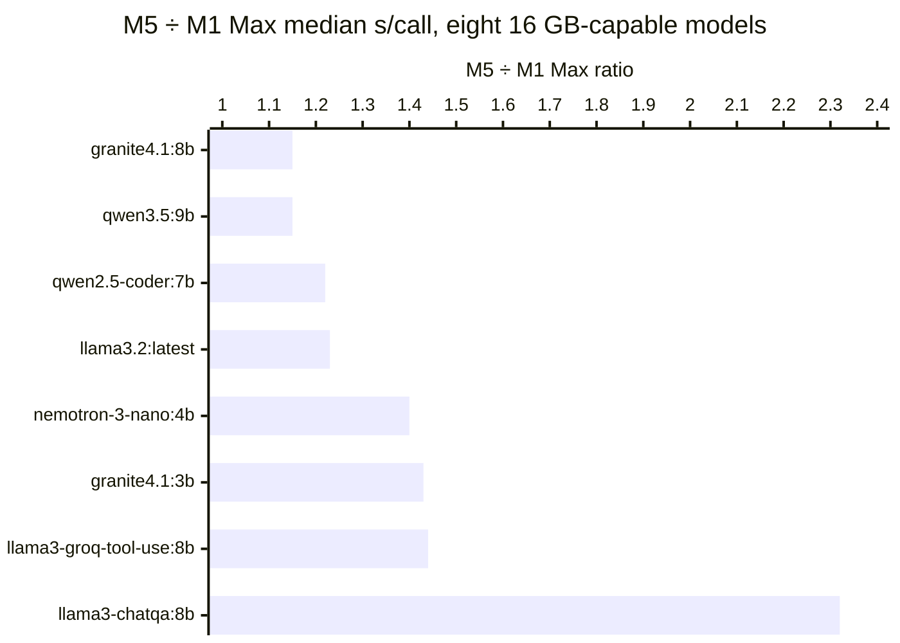

# Benchmarking local LLM generated Adaptive Card JSON on a 64 GB M1 Max and 16 GB M5

In
[`freemansoft/Flutter-AdaptiveCards`](https://github.com/freemansoft/Flutter-AdaptiveCards)
a demonstration Dart chat server hands a question to a local Ollama model and
asks for the answer as Adaptive Card JSON. Adaptive Cards is a strict,
closed-vocabulary schema, and a Flutter client renders the JSON as interactive
UI rather than as text. The project's test probes measure how well fifteen local
models produce that JSON, and how fast. The project built the probes on a 64 GB
M1 Max and ran them there first. It then ran them on a 16 GB M5 with a quarter
of the memory.

Eight of the fifteen models fit, or nearly fit, in 16 GB. On the M5 seven of
those eight took 1.15x to 1.44x the M1 Max's median time per call, and one took
2.32x. The direction matches the M5's lower memory bandwidth, and the gap is
smaller than bandwidth alone predicts, which the M5's newer GPU may partly
explain. Re-running one model on the same host moved its median by up to 1.54x,
so each ratio gives a direction rather than a per-model figure. The 16 GB pick
therefore rests on fit and shape score: `granite4.1:8b`, 21/25 seeded, in 5.0
GB.

Every figure below comes from
[`ModelBehavior.md`](https://github.com/freemansoft/Flutter-AdaptiveCards/blob/main/adaptive_chat_server_dart/ModelBehavior.md),
a lab notebook in the repository.

## Terms used in this article

The first two terms describe a model and how Ollama serves it, the next three
qualify a score, and the last four describe a run.

| Term                                      | What it means here                                                                                                                                                                                                                                                                                                                                                                                                                                                                                                                                                               |
| ----------------------------------------- | -------------------------------------------------------------------------------------------------------------------------------------------------------------------------------------------------------------------------------------------------------------------------------------------------------------------------------------------------------------------------------------------------------------------------------------------------------------------------------------------------------------------------------------------------------------------------------- |
| **Weights** and the `b` in a model tag    | The weights are the parameter file Ollama loads into memory, and the GB figure in the tables is that file's size. The `b` in a tag such as `granite4.1:8b` counts parameters in billions, which is a different quantity: quantization decides how many bytes each parameter costs, so the three models tagged `:30b` here range from 17.3 GB to 23.7 GB. The GB figure decides fit; the parameter count does not.                                                                                                                                                                |
| **Runner**, **GGUF** and **MLX**          | Ollama serves each model through a runner process. GGUF builds, which all eight 16 GB candidates are, go to a llama.cpp-based runner, which this article calls the GGUF runner. MLX builds, such as the two `nvfp4` (4-bit floating point) models, go to Ollama's MLX runner, which uses Apple's MLX framework.                                                                                                                                                                                                                                                                  |
| **Shape score**, `n/25` (`shape_ab.dart`) | 25 shape cases, one user question each, paired with the Adaptive Card element types (the schema's UI component types, such as `Input.ChoiceSet` or `Table`) that would acceptably answer it. The probe scores each case on one thing: did the reply use one of them? "What are my options for deployment targets" passes only on an `Input.ChoiceSet`. The probe runs each case twice and passes it only if both replies did, so a one-case difference between two models is within noise. This is shape coverage, not accuracy: a model can be correct in prose and score 1/25. |
| **Cold start** and **with history**       | The shape probe's two conditions: the question asked first, or asked after ordinary exchanges already in the conversation. This article never compares a score under one condition with a score under the other, and figures are with-history unless the text says otherwise.                                                                                                                                                                                                                                                                                                    |
| **Seeded** and **unaided**                | Seeded is the configuration the server's launch settings use: a synthetic two-turn card exchange prepended to the context. Unaided is the same probe without it. The seed is worth +10 to −2 shape cases depending on the model, so every score here names its configuration.                                                                                                                                                                                                                                                                                                    |
| **Median s/call**                         | Median time per call over the seeded shape probe's 100 calls (25 cases, two conditions, two samples), excluding the first call after a model load (roughly 6-7x a warm one) and excluding stalled calls, which measure the ceiling rather than the model.                                                                                                                                                                                                                                                                                                                        |
| **Full sweep**                            | The summed time of every call in the standard probes against one model, stalls included.                                                                                                                                                                                                                                                                                                                                                                                                                                                                                         |
| **Stall**                                 | A call that exceeds its probe's per-call ceiling, which the probe scores as a failure: 120 s on the shape and cascade probes, 180 s on the everyday and stress probes, which are short sets of one-shot requests. The probe cannot tell a slow model from a busy host.                                                                                                                                                                                                                                                                                                           |
| **Sweep position**                        | Each host measured its models one after another, in a multi-model sweep lasting hours. A model's position is where it fell in that order; position 0 is the first slot, on a host that had been idle.                                                                                                                                                                                                                                                                                                                                                                            |

## The M5 has fewer GPU cores and less memory bandwidth, but a Neural Accelerator in each core

The same probes and prompts ran on two Apple laptops. The table gives each as
Apple specifies it. The M5's GPU core count is that machine's own
`system_profiler` report and the M1 Max's is its owner's. The bandwidth figures
are vendor ratings, not probe measurements.

|                            | M1 Max host                            | M5 host                 |
| -------------------------- | -------------------------------------- | ----------------------- |
| Machine                    | MacBook Pro 14-inch (`MacBookPro18,4`) | MacBook Air (`Mac17,3`) |
| Chip tier                  | M1 Max                                 | M5, base tier           |
| GPU cores                  | 32                                     | 8                       |
| Neural Accelerators in GPU | none                                   | one per GPU core        |
| Unified memory             | 64 GB                                  | 16 GB                   |
| Rated memory bandwidth     | 400 GB/s                               | 153 GB/s                |
| Cooling                    | fans                                   | fanless                 |
| Ollama for these runs      | 0.33.2                                 | 0.33.1                  |

The two Ollama versions differ only at the patch level, so each ratio below
compares two hosts and not two runtimes. The M1 Max host has since moved to
Ollama 0.34.0, and apart from `granite4.1:3b`, no probe has re-taken a figure
here on it.

The table leaves out the 16-core Neural Engine, a separate unit from the GPU's
Neural Accelerators. Ollama's MLX runner uses the accelerators and not the
Neural Engine, and Ollama does not appear to use the Neural Engine on either
chip. Benchmarks that score the Neural Engine, such as Geekbench AI, therefore
say nothing about these medians.

## Eight of fifteen models fit or nearly fit in 16 GB

Both hosts are Apple Silicon Macs with unified memory, so there is no separate
VRAM budget: macOS, the runtime and the model share one pool. The table reads
all fifteen against a 16 GB host: ✅ fits, ⚠️ marginal, ❌ does not.

| Model                                               | Weights | 16 GB |
| --------------------------------------------------- | ------- | ----- |
| `gpt-oss:20b`                                       | 12.8 GB | ❌    |
| `granite4.1:3b`                                     | 2.0 GB  | ✅    |
| `granite4.1:8b`                                     | 5.0 GB  | ✅    |
| `hf.co/unsloth/Nemotron-3-Nano-30B-A3B-GGUF:latest` | 22.9 GB | ❌    |
| `llama3-chatqa:8b`                                  | 4.3 GB  | ✅    |
| `llama3-groq-tool-use:8b`                           | 4.3 GB  | ✅    |
| `llama3.2:latest`                                   | 1.9 GB  | ✅    |
| `nemotron-3-nano:4b`                                | 2.6 GB  | ✅    |
| `nemotron-3-nano:30b`                               | 22.6 GB | ❌    |
| `nemotron-3.5-lightning:30b`                        | 23.7 GB | ❌    |
| `qwen2.5-coder:7b`                                  | 4.4 GB  | ✅    |
| `qwen3-coder:30b`                                   | 17.3 GB | ❌    |
| `qwen3.5:9b`                                        | 6.1 GB  | ⚠️    |
| `qwen3.6:27b-coding-nvfp4`                          | 18.4 GB | ❌    |
| `qwen3.8:27b-nvfp4`                                 | 16.9 GB | ❌    |

`qwen3.5:9b`, at 6.1 GB, is the one marginal fit. `gpt-oss:20b` is 12.8 GB and
still a ❌. Its weights share the pool with macOS and the runtime, so the usable
ceiling sits below the 16 GB on the box. A ❌ means "do not recommend this as the
default on a 16 GB host", not "untested". The probes measured every ❌ model on
the 64 GB host.

## The M5 took 1.15x to 1.44x the M1 Max's time per call on seven of the eight

The eight candidates ran on both hosts, and [the notebook's per-host performance
section](https://github.com/freemansoft/Flutter-AdaptiveCards/blob/main/adaptive_chat_server_dart/ModelBehavior.md#performance-by-host-and-runtime)
records the runs. Median s/call is the like-for-like column. The full-sweep and
stall columns describe the run rather than the model, and they diverge from the
median wherever calls stalled. The notebook's `perf_table.py` script derives the
medians and ratios from the recorded runs at millisecond precision, and this
article rounds them to two decimals. The table orders models by ratio.

| Model                     | Weights | M1 Max s/call | M5 s/call | M5 ÷ M1 Max | M1 Max full sweep | M5 full sweep | M1 Max stalls | M5 stalls |
| ------------------------- | ------- | ------------- | --------- | ----------- | ----------------- | ------------- | ------------- | --------- |
| `granite4.1:8b`           | 5.0 GB  | 2.85 s        | 3.27 s    | 1.15x       | 15 min            | 17 min        | 0             | 0         |
| `qwen3.5:9b`              | 6.1 GB  | 4.92 s        | 5.65 s    | 1.15x       | 24 min            | 29 min        | 0             | 0         |
| `qwen2.5-coder:7b`        | 4.4 GB  | 2.38 s        | 2.90 s    | 1.22x       | 19 min            | 22 min        | 0             | 0         |
| `llama3.2:latest`         | 1.9 GB  | 1.34 s        | 1.65 s    | 1.23x       | 13 min            | 15 min        | 2             | 2         |
| `nemotron-3-nano:4b`      | 2.6 GB  | 2.54 s        | 3.54 s    | 1.40x       | 16 min            | 30 min        | 1             | 4         |
| `granite4.1:3b`           | 2.0 GB  | 0.98 s        | 1.40 s    | 1.43x       | 124 min           | 13 min        | 52            | 1         |
| `llama3-groq-tool-use:8b` | 4.3 GB  | 1.85 s        | 2.67 s    | 1.44x       | 9 min             | 13 min        | 0             | 0         |
| `llama3-chatqa:8b`        | 4.3 GB  | 0.11 s        | 0.25 s    | 2.32x       | 3 min             | 5 min         | 0             | 0         |

```mermaid
xychart-beta horizontal
    title "M5 ÷ M1 Max median s/call, eight 16 GB-capable models"
    x-axis ["granite4.1:8b", "qwen3.5:9b", "qwen2.5-coder:7b", "llama3.2:latest", "nemotron-3-nano:4b", "granite4.1:3b", "llama3-groq-tool-use:8b", "llama3-chatqa:8b"]
    y-axis "M5 ÷ M1 Max ratio" 1.0 --> 2.4
    bar [1.15, 1.15, 1.22, 1.23, 1.40, 1.43, 1.44, 2.32]
```

`qwen3.5:9b`'s M1 Max median comes from position 0 after 29 minutes idle, where
the other seven M1 Max medians are in-sweep figures. Against the same model's
run straight after an eight-hour sweep, its ratio would be 0.75x rather than
1.15x. The re-run section below gives both runs.

`llama3-chatqa:8b` has the widest ratio, 2.32x, and the smallest absolute gap:
0.11 s against 0.25 s, a 141 ms difference. At that scale, load and scheduling
overhead are likely a larger share of the call than the model's own compute.
The model is also fast for a reason unrelated to the hardware. It answers in
short prose instead of building a card, the same behavior behind its **1/25**
shape score.

`nemotron-3-nano:4b`'s full sweep moved further than its median: 16 minutes to
30, against 1.40x on the median. Its stalls account for the difference. All
five are 180 s timeouts in the everyday probe, one on the M1 Max and four on
the M5. Without the stalled calls, the full sweep is 12.8 minutes against 17.8,
1.39x, in line with the median.

The ratio does not track weight. `granite4.1:8b` (5.0 GB) and `qwen3.5:9b`
(6.1 GB) sit at 1.15x, while `granite4.1:3b` (2.0 GB) sits at 1.43x.

Three limits apply to the latency table.

1. Runner eviction, a harness change described in [the measurement-hygiene
   article in this
   series](https://joe.blog.freemansoft.com/2026/09/eight-measurement-rules-from-local.html),
   has Ollama unload the model after a call times out. It does nothing unless a
   call times out. Every M5 run predates it. On the M1 Max, `granite4.1:3b` and
   `llama3.2:latest` ran after it and the other six before it. Five of those six
   recorded no stall and the sixth recorded one, so the change does not separate
   them.
2. `granite4.1:3b`'s M1 Max full-sweep and stall cells, 124 minutes and 52
   stalls, record a queue of calls stuck behind one runaway generation, not the
   model. Only its median is usable. A re-run under Ollama 0.34.0 on the M1 Max
   recorded no stall and an 8-minute full sweep. The measurement-hygiene article
   covers both runs.
3. **The probes measured every figure in this article against a nearly empty
   context.** A probe call sends the card system prompt, one question, and at
   most a two-turn seed. A later run that filled each model's window cost three
   of eight models a quarter to a third of their shape coverage. None of the
   three fits 16 GB. [The full-context article in this
   series](https://joe.blog.freemansoft.com/2026/09/a-full-context-breaks-three-local.html)
   covers that run. The medians here describe a short exchange, which is what
   the demo's own traffic looks like, not a long conversation.

### Bandwidth matches the direction of the ratios, and the M5's newer GPU may narrow their size

Two hardware differences could produce the ratios: GPU compute and memory
bandwidth.

[The
notebook](https://github.com/freemansoft/Flutter-AdaptiveCards/blob/main/adaptive_chat_server_dart/ModelBehavior.md#performance-by-host-and-runtime)
scales Apple's published core counts and multipliers to estimate AI compute. On
that estimate, this 8-core M5 GPU is roughly level with, or ahead of, the
32-core M1 Max GPU. That estimate holds only if the runtime uses the Neural
Accelerator in each M5 GPU core. Ollama's MLX runner does, on macOS 26.2 or
later, but it served only the two `nvfp4` builds, and neither fits 16 GB. All
eight candidates are GGUF builds, and no run checked whether the GGUF runner
uses the accelerators. If it does, compute is near parity and bandwidth is the
stronger candidate. If it does not, the M5's 8 GPU cores meet the M1 Max's 32
without them, and compute stands beside bandwidth. The core count understates
the M5, whose GPU is four generations newer in architecture and includes a
Neural Accelerator in each core.

Memory bandwidth differs more: **153 GB/s** on the M5 against **400 GB/s** on
the M1 Max, a 2.61x rating gap. Single-stream token generation streams the
model's weights out of memory for every token, so it is generally
bandwidth-bound. [Apple's own MLX
measurements](https://machinelearning.apple.com/research/exploring-llms-mlx-m5)
say the same of the M5. Against the M4, its accelerators cut time to first token
3.33x to 3.97x. Token generation, which Apple describes as bounded by memory
bandwidth, gained 1.19x to 1.27x.

The medians go the way bandwidth predicts, but at 1.15x to 1.44x against a rated
2.61x. **Bandwidth accounts for the direction of the ratios, not their size, and
the result reads as a trade-off between the two hosts.** A median call includes
processing the prompt as well as generating the reply, and Apple describes
prompt processing as compute-bound. The M5's newer GPU architecture would
recover part of what its lower bandwidth costs there. Its Neural Accelerators
would add to that if the GGUF runner uses them. Per-call overhead, and the
hosts' achieved bandwidth, which no run measured, could also narrow the gap. No
run separates these effects.

## Re-running a model on the same host should repeat its median, and moved it 1.03x to 1.54x

These re-runs are controls, not updated figures: each measures one model twice
on the same host. Only `llama3.2:latest`'s second run replaced its first, and
the latency table uses it. All five are in [the notebook's per-host performance
section](https://github.com/freemansoft/Flutter-AdaptiveCards/blob/main/adaptive_chat_server_dart/ModelBehavior.md#performance-by-host-and-runtime).

Runner eviction does not explain the movement: the three models re-run for
position recorded no stalls, so eviction never fired on their calls. Both sweeps
behind the hot re-runs predate eviction. Timed-out generations on other models
therefore kept those hosts busy longer, which may add to the load behind them.

| Model              | Host   | First run                           | Second run                    | Second ÷ first              |
| ------------------ | ------ | ----------------------------------- | ----------------------------- | --------------------------- |
| `llama3.2:latest`  | M5     | mid-sweep, 89 min, 40 stalls        | idle host, 15 min, 2 stalls   | 1.06x (1559 ms vs 1650 ms)  |
| `qwen3.5:9b`       | M1 Max | position 0, after 29 min idle       | 7 s after an eight-hour sweep | 1.54x (4924 ms vs 7563 ms)  |
| `granite4.1:8b`    | M5     | position 0 of the eight-model sweep | 13 s after that sweep         | 1.20x                       |
| `granite4.1:8b`    | M5     | position 0 of the eight-model sweep | after 7h37m idle              | 1.12x (p25 1.07 / p75 1.15) |
| `qwen2.5-coder:7b` | M5     | 17 min into the eight-model sweep   | after 31 min idle             | 1.03x                       |

The re-runs spread from 1.03x to 1.54x, as wide as the host-to-host ratios of
1.15x to 1.44x. The latency table therefore gives a direction and not a
per-model figure. The article publishes the medians as measured, with no
correction for sweep position, because the re-runs bound the bias without fixing
its size.

- `qwen3.5:9b` ran 1.54x slower straight after an eight-hour sweep than at
  position 0. The M5's eight models came from one sweep of about four hours, so
  its later positions carry the same kind of bias.
- `granite4.1:8b` ran 1.20x slower 13 s after the M5 sweep, with every reply's
  labels identical call for call. Position moved its latency and not its shape
  coverage.
- `llama3.2:latest` first recorded 40 stalls on the M5. A re-run on an idle host
  recorded 2, and its median moved 1.06x. The model's speed is not what changed,
  and what caused the first run's stalls is not identified.
- The fanless Air was the place to look for throttling, and the two models
  tested disagree on the sign. `granite4.1:8b`'s 1.20x straight after the sweep
  fits throttling. It also came back 1.12x slower after 7h37m idle than its
  equally idle first run, which sets the reproducibility floor.
  `qwen2.5-coder:7b` ran 1.03x slower after idling than mid-sweep. Throttling is
  unmeasured, not ruled out: **no run read die temperature or clock frequency**.

## `granite4.1:8b` is the 16 GB pick, at 21/25 seeded in 5.0 GB

Latency cannot rank the eight candidates, so fit and shape score decide. The
table gives each candidate's with-history shape score, seeded and unaided.

| Model                     | Weights | Seeded     | Unaided    |
| ------------------------- | ------- | ---------- | ---------- |
| `granite4.1:8b`           | 5.0 GB  | 21/25      | 15/25      |
| `qwen3.5:9b`              | 6.1 GB  | 19/25      | 17/25      |
| `qwen2.5-coder:7b`        | 4.4 GB  | 18/25      | 18/25      |
| `nemotron-3-nano:4b`      | 2.6 GB  | 17/25      | 7/25       |
| `llama3-groq-tool-use:8b` | 4.3 GB  | 17/25      | 9/25       |
| `granite4.1:3b`           | 2.0 GB  | 17/25 (M5) | 12/25 (M5) |
| `llama3.2:latest`         | 1.9 GB  | 15/25      | 12/25      |
| `llama3-chatqa:8b`        | 4.3 GB  | 1/25       | 3/25       |

`granite4.1:3b`'s scores come from its M5 run, because the queue of stalled
calls described in the latency limits above also distorted its M1 Max scores.

`granite4.1:8b` scores highest of the eight, and the seed supplies much of that.
Unaided it scores 15/25, a +6 seed gain, while `qwen2.5-coder:7b` scores 18/25
either way. The pick holds for the seeded configuration.

Every shape score here predates a later edit to the card system prompt that
added `Input.Rating`. Of the eight models tested against that edit, it repaired
the `rating_ask` case outright on three and on cold start only on a fourth.
The probes have re-swept only `granite4.1:3b` under the current prompt.

On a 64 GB host the notebook's launch set uses `qwen3.8:27b-nvfp4`, at 24/25 in
16.9 GB with no seed dependence, in place of `gpt-oss:20b`. `gpt-oss:20b` is
the only model to score 25/25 under any condition, and the slowest measured, at
7.2 s per call. The notebook dropped it because it breaks Ollama's `format`
option, returning an empty reply body when asked for JSON.

The repository is
[https://github.com/freemansoft/Flutter-AdaptiveCards](https://github.com/freemansoft/Flutter-AdaptiveCards),
and the lab notebook these figures come from is
[https://github.com/freemansoft/Flutter-AdaptiveCards/blob/main/adaptive_chat_server_dart/ModelBehavior.md](https://github.com/freemansoft/Flutter-AdaptiveCards/blob/main/adaptive_chat_server_dart/ModelBehavior.md).
