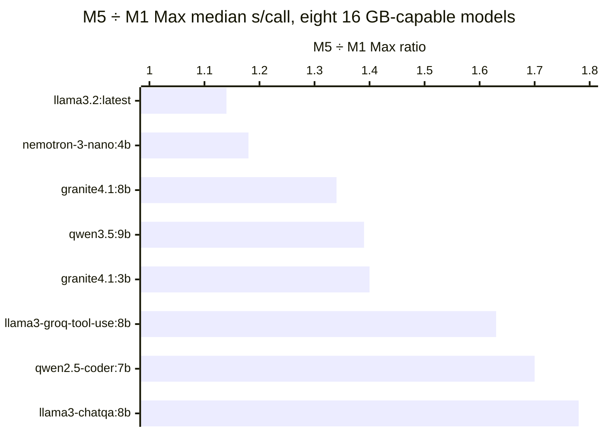

# Benchmarking local LLM generated Adaptive Card JSON on a 64 GB M1 Max and 16 GB M5

In
[`freemansoft/Flutter-AdaptiveCards`](https://github.com/freemansoft/Flutter-AdaptiveCards)
a demonstration Dart chat server hands a question to a local Ollama model and
asks for the answer as Adaptive Card JSON. Adaptive Cards is a strict,
closed-vocabulary schema, and a Flutter client renders the JSON as interactive
UI rather than as text. The project's test probes measure how well fifteen local
models produce that JSON, and how fast. The project built the probes on a 64 GB
M1 Max. It later ran them on a 16 GB M5 with a quarter of the memory.

Eight of the fifteen models fit, or nearly fit, in 16 GB. Both hosts ran those
eight under one Ollama version, in one model order. On the M5 each took 1.14x to
1.78x the M1 Max's median time per call, median 1.40x. Splitting each call into
prompt processing and generation puts the gap in generation, at 1.12x to 1.65x
against a 2.61x gap in rated memory bandwidth. Each model ran once per host, so
each ratio gives a direction rather than a per-model figure. The top shape
scores sit within one case of each other, so fit and per-call time carry the 16
GB pick. That is `granite4.1:8b`, 20/25 to 21/25 seeded, in 5.0 GB.

Every figure below comes from
[`ModelBehavior.md`](https://github.com/freemansoft/Flutter-AdaptiveCards/blob/main/adaptive_chat_server_dart/ModelBehavior.md),
a lab notebook in the repository.

## Terms used in this article

The first two terms describe a model and how Ollama serves it, the next three
qualify a score, and the last four describe a run.

| Term                                      | What it means here                                                                                                                                                                                                                                                                                                                                                                                                                                                                                                                                                               |
| ----------------------------------------- | -------------------------------------------------------------------------------------------------------------------------------------------------------------------------------------------------------------------------------------------------------------------------------------------------------------------------------------------------------------------------------------------------------------------------------------------------------------------------------------------------------------------------------------------------------------------------------- |
| **Weights** and the `b` in a model tag    | The weights are the parameter file Ollama loads into memory, and the GB figure in the tables is that file's size. The `b` in a tag such as `granite4.1:8b` counts parameters in billions, which is a different quantity: quantization decides how many bytes each parameter costs, so the three models tagged `:30b` here range from 17.3 GB to 23.7 GB. The GB figure decides fit; the parameter count does not.                                                                                                                                                                |
| **Runner**, **GGUF** and **`nvfp4`**      | Ollama serves each model through a runner process. GGUF builds, which all eight 16 GB candidates are, go to a llama.cpp-based runner, which this article calls the GGUF runner. `nvfp4` in a tag is a 4-bit floating point build.                                                                                                                                                                                                                                                                                                                                                |
| **Shape score**, `n/25` (`shape_ab.dart`) | 25 shape cases, one user question each, paired with the Adaptive Card element types (the schema's UI component types, such as `Input.ChoiceSet` or `Table`) that would acceptably answer it. The probe scores each case on one thing: did the reply use one of them? "What are my options for deployment targets" passes only on an `Input.ChoiceSet`. The probe runs each case twice and passes it only if both replies did, so a one-case difference between two models is within noise. This is shape coverage, not accuracy: a model can be correct in prose and score 1/25. |
| **Cold start** and **with history**       | The shape probe's two conditions: the question asked first, or asked after ordinary exchanges already in the conversation. This article never compares a score under one condition with a score under the other, and figures are with-history unless the text says otherwise.                                                                                                                                                                                                                                                                                                    |
| **Seeded** and **unaided**                | Seeded is the configuration the server's launch settings use: a synthetic two-turn card exchange prepended to the context. Unaided is the same probe without it. The seed is worth +12 to −3 shape cases depending on the model, so every score here names its configuration.                                                                                                                                                                                                                                                                                                    |
| **Median s/call**                         | Median time per call over the seeded shape probe's 100 calls (25 cases, two conditions, two samples), excluding the first call after a model load and excluding stalled calls, which measure the ceiling rather than the model.                                                                                                                                                                                                                                                                                                                                                  |
| **Full sweep**                            | The summed time of every call in the standard probes against one model, stalls included.                                                                                                                                                                                                                                                                                                                                                                                                                                                                                         |
| **Stall**                                 | A call that exceeds its probe's per-call ceiling, which the probe scores as a failure: 120 s on the shape and cascade probes, 180 s on the everyday and stress probes, which are short sets of one-shot requests. The probe cannot tell a slow model from a busy host.                                                                                                                                                                                                                                                                                                           |
| **Sweep position**                        | Each host measured its models one after another, in a multi-model sweep lasting hours. A model's position is where it fell in that order.                                                                                                                                                                                                                                                                                                                                                                                                                                        |

## The M5 has fewer GPU cores and less memory bandwidth, but a Neural Accelerator in each core

The same probes and prompts ran on two Apple laptops. The table gives each as
Apple specifies it. The M5's GPU core count is that machine's own
`system_profiler` report and the M1 Max's is its owner's. The bandwidth figures
are vendor ratings, not probe measurements.

|                            | M1 Max host                            | M5 host                 |
| -------------------------- | -------------------------------------- | ----------------------- |
| Machine                    | MacBook Pro 14-inch (`MacBookPro18,4`) | MacBook Air (`Mac17,3`) |
| Chip tier                  | M1 Max                                 | M5, base tier           |
| GPU cores                  | 32                                     | 8                       |
| Neural Accelerators in GPU | none                                   | one per GPU core        |
| Unified memory             | 64 GB                                  | 16 GB                   |
| Rated memory bandwidth     | 400 GB/s                               | 153 GB/s                |
| Cooling                    | fans                                   | fanless                 |
| Ollama for these runs      | 0.35.1                                 | 0.35.1                  |

Both hosts swept the same eight models starting 2026-10-03, under Ollama 0.35.1
and the same card system prompt. Each left 600 s idle before every model. The
latency and phase tables below therefore compare two machines and not two
runtimes, at matched sweep positions.

The table leaves out the 16-core Neural Engine, a separate unit from the GPU's
Neural Accelerators. Ollama does not appear to use it on either chip.
Benchmarks that use the Neural Engine, such as Geekbench AI, do not predict the
numbers here.

## Eight of fifteen models fit or nearly fit in 16 GB

Both hosts are Apple Silicon Macs with unified memory, so there is no separate
VRAM budget: macOS, the runtime and the model share one pool. The table reads
all fifteen against a 16 GB host: ✅ fits, ⚠️ marginal, ❌ does not.

| Model                                               | Weights | 16 GB |
| --------------------------------------------------- | ------- | ----- |
| `gpt-oss:20b`                                       | 12.8 GB | ❌    |
| `granite4.1:3b`                                     | 2.0 GB  | ✅    |
| `granite4.1:8b`                                     | 5.0 GB  | ✅    |
| `hf.co/unsloth/Nemotron-3-Nano-30B-A3B-GGUF:latest` | 22.9 GB | ❌    |
| `llama3-chatqa:8b`                                  | 4.3 GB  | ✅    |
| `llama3-groq-tool-use:8b`                           | 4.3 GB  | ✅    |
| `llama3.2:latest`                                   | 1.9 GB  | ✅    |
| `nemotron-3-nano:4b`                                | 2.6 GB  | ✅    |
| `nemotron-3-nano:30b`                               | 22.6 GB | ❌    |
| `nemotron-3.5-lightning:30b`                        | 23.7 GB | ❌    |
| `qwen2.5-coder:7b`                                  | 4.4 GB  | ✅    |
| `qwen3-coder:30b`                                   | 17.3 GB | ❌    |
| `qwen3.5:9b`                                        | 6.1 GB  | ⚠️    |
| `qwen3.6:27b-coding-nvfp4`                          | 18.4 GB | ❌    |
| `qwen3.8:27b-nvfp4`                                 | 16.9 GB | ❌    |

`qwen3.5:9b`, at 6.1 GB, is the one marginal fit. `gpt-oss:20b` is 12.8 GB and
still a ❌. Its weights share the pool with macOS and the runtime, so the usable
ceiling sits below the 16 GB on the box. A ❌ means "do not recommend this as the
default on a 16 GB host", not "untested". The probes measured every ❌ model on
the 64 GB host.

## The M5 took 1.14x to 1.78x the M1 Max's time per call, with a median of 1.40x

The eight candidates ran on both hosts, and [the notebook's matched 0.35.1
re-sweep](https://github.com/freemansoft/Flutter-AdaptiveCards/blob/main/adaptive_chat_server_dart/ModelBehavior.md#matched-ollama-0351-re-sweep-generation-is-112x-to-165x-slower-on-the-m5-against-a-261x-rated-bandwidth-gap)
records the runs. Median s/call is the like-for-like column, derived at
millisecond precision by `perf_table.py` and rounded to two decimals. The table
orders models by ratio.

| Model                     | Weights | M1 Max s/call | M5 s/call | M5 ÷ M1 Max | M1 Max full sweep | M5 full sweep | M1 Max stalls | M5 stalls |
| ------------------------- | ------- | ------------- | --------- | ----------- | ----------------- | ------------- | ------------- | --------- |
| `llama3.2:latest`         | 1.9 GB  | 1.31 s        | 1.49 s    | 1.14x       | 9 min             | 23 min        | 0             | 4         |
| `nemotron-3-nano:4b`      | 2.6 GB  | 2.39 s        | 2.82 s    | 1.18x       | 18 min            | 23 min        | 2             | 3         |
| `granite4.1:8b`           | 5.0 GB  | 2.83 s        | 3.80 s    | 1.34x       | 16 min            | 21 min        | 0             | 0         |
| `qwen3.5:9b`              | 6.1 GB  | 4.68 s        | 6.51 s    | 1.39x       | 24 min            | 35 min        | 0             | 0         |
| `granite4.1:3b`           | 2.0 GB  | 1.00 s        | 1.40 s    | 1.40x       | 9 min             | 121 min       | 0             | 56        |
| `llama3-groq-tool-use:8b` | 4.3 GB  | 1.89 s        | 3.08 s    | 1.63x       | 9 min             | 14 min        | 0             | 0         |
| `qwen2.5-coder:7b`        | 4.4 GB  | 2.25 s        | 3.83 s    | 1.70x       | 20 min            | 31 min        | 0             | 0         |
| `llama3-chatqa:8b`        | 4.3 GB  | 0.12 s        | 0.22 s    | 1.78x       | 3 min             | 5 min         | 0             | 0         |

```mermaid
xychart-beta horizontal
    title "M5 ÷ M1 Max median s/call, eight 16 GB-capable models"
    x-axis ["llama3.2:latest", "nemotron-3-nano:4b", "granite4.1:8b", "qwen3.5:9b", "granite4.1:3b", "llama3-groq-tool-use:8b", "qwen2.5-coder:7b", "llama3-chatqa:8b"]
    y-axis "M5 ÷ M1 Max ratio" 1.0 --> 1.8
    bar [1.14, 1.18, 1.34, 1.39, 1.40, 1.63, 1.70, 1.78]
```

`llama3-chatqa:8b` has the widest ratio, 1.78x, and the smallest absolute gap:
0.12 s against 0.22 s, about 100 ms. At that scale, overhead is likely a larger
share of the call than compute. It also answers in short prose instead of
building a card, which is the behavior behind its **1/25** shape score.

The full-sweep column includes stall time, so do not read it as a second speed
measurement. `nemotron-3-nano:4b` recorded five stalls, two on the M1 Max and
three on the M5, and `llama3.2:latest` four on the M5. All nine are 180 s
everyday-probe timeouts rather than shape-probe calls. Both sweeps move further
than their medians: 18 minutes against 23 at a 1.18x median, and 9 against 23
at 1.14x. `llama3.2:latest`'s four M5 stalls are 12 minutes at the 180 s
ceiling, most of its 14-minute difference.

The ratio does not track weight. `llama3.2:latest` (1.9 GB) sits at 1.14x and
`granite4.1:3b` (2.0 GB) at 1.40x, while `qwen2.5-coder:7b` (4.4 GB) sits at
1.70x and `granite4.1:8b` (5.0 GB) at 1.34x.

Three limits apply to the latency table.

1. `granite4.1:3b`'s M5 full-sweep and stall cells, 121 minutes and 56 stalls,
   record a queue of calls stuck behind one runaway generation. The 56 stalls are
   one unbroken run in its unaided arm. The first call after that run took 67.3 s
   against a 240 ms floor. Its seeded and cascade arms recorded no stall, so its
   median and its seeded score stand. Its M1 Max run is clean, at 9 minutes and
   no stalls, and [the measurement-hygiene article in this
   series](https://joe.blog.freemansoft.com/2026/09/eight-measurement-rules-from-local.html)
   covers the cascade.
2. **The probes measured every figure in this article against a nearly empty
   context.** A probe call sends the card system prompt, one question, and at
   most a two-turn seed. [The full-context article in this
   series](https://joe.blog.freemansoft.com/2026/09/a-full-context-breaks-three-local.html)
   covers what filling each model's window costs its shape coverage. The numbers
   here describe a short exchange, not a long conversation.
3. This sweep measured each model once per host, so the same-host
   reproducibility floor is unmeasured under 0.35.1. [The notebook's per-host
   performance
   section](https://github.com/freemansoft/Flutter-AdaptiveCards/blob/main/adaptive_chat_server_dart/ModelBehavior.md#performance-by-host-and-runtime)
   holds the earlier same-host re-runs, taken under older probes and an older
   harness.

### The M5 loses its time generating tokens, not reading the prompt

This sweep recorded Ollama's per-call phase timings on all 99 timed calls of
every model. The four figure columns are the M5's and the three ratio columns
the M5 over the M1 Max. The shape probe sends each case twice back to back.
**First** is the first time a condition sees that case's prompt. **Repeat** is
a byte-identical resend immediately after, which a prompt-cache hit would
answer. Both samples occur in both conditions, so neither column is a
cold-start-against-with-history cost.

| Model                     | Prompt first ms | Prompt repeat ms | Gen ms | Gen tok/s | Prompt first ratio | Prompt repeat ratio | Gen ratio |
| ------------------------- | --------------- | ---------------- | ------ | --------- | ------------------ | ------------------- | --------- |
| `granite4.1:3b`           | 179             | 29               | 1266   | 39.7      | 1.80x              | 1.53x               | 1.36x     |
| `granite4.1:8b`           | 444             | 58               | 3570   | 18.5      | 2.53x              | 1.52x               | 1.30x     |
| `llama3-chatqa:8b`        | 224             | 41               | <1     | 25.8      | 1.94x              | 1.74x               | n/a       |
| `llama3-groq-tool-use:8b` | 394             | 51               | 2864   | 20.6      | 2.52x              | 1.64x               | 1.61x     |
| `llama3.2:latest`         | 138             | 24               | 1379   | 49.6      | 1.51x              | 1.35x               | 1.12x     |
| `nemotron-3-nano:4b`      | 1492            | 103              | 2485   | 27.3      | 0.76x              | 1.83x               | 1.65x     |
| `qwen2.5-coder:7b`        | 400             | 58               | 3547   | 18.1      | 2.89x              | 1.76x               | 1.64x     |
| `qwen3.5:9b`              | 4295            | 143              | 4142   | 16.1      | 1.27x              | 1.97x               | 1.64x     |

Generation is where the two hosts separate, at 1.12x to 1.65x on time against a
2.61x gap in rated bandwidth. Two models stand apart on the first sample:
`nemotron-3-nano:4b` at 1,492 ms and `qwen3.5:9b` at 4,295 ms. The other six
sit at 138 to 444 ms. That is consistent with those two reprocessing the whole
prompt where the other six reuse a cached prefix, though nothing here measures
cache state. The prompt phase is a material share of a call only on those two
models. On the M1 Max the other six spend 17 to 175 ms there, inside calls of
0.12 to 4.68 s. The one figure the M5 wins is `nemotron-3-nano:4b`'s
first-sample prompt, at 0.76x. `llama3-chatqa:8b`'s gen ratio reads `n/a` for a
different reason. Eighty of its 99 timed M5 calls are one-token replies, as are
81 of 99 on the M1 Max. Its generation median therefore falls below a
millisecond.

### Memory bandwidth predicts which host is slower, but overstates by how much

The M1 Max moves memory at **400 GB/s** and the M5 at **153 GB/s**, a 2.61x
ratio. Generating a token streams the model's weights out of memory once, so a
purely bandwidth-bound generation phase would run 2.61x slower on the M5.

Generation runs 1.12x to 1.65x slower instead, on the seven models whose
generation phase is long enough to time. Isolating that phase tested whether a
compute-bound prompt phase favoring the M5 had absorbed the rest of the gap. The
prompt phase does not account for the shortfall: generation alone lands in the
same band as the whole-call ratios. **Bandwidth gives the direction of the gap
and not its size.**

[Apple's own MLX
measurements](https://machinelearning.apple.com/research/exploring-llms-mlx-m5)
treat generation as the bandwidth-bound phase too. Against the M4, the M5's
accelerators cut time to first token 3.33x to 3.97x. Token generation gained
1.19x to 1.27x, the phase Apple describes as bandwidth-bound.

GPU compute is the other hardware difference, and no run here separates it. [The
notebook](https://github.com/freemansoft/Flutter-AdaptiveCards/blob/main/adaptive_chat_server_dart/ModelBehavior.md#performance-by-host-and-runtime)
scales Apple's published core counts and multipliers to estimate AI compute. On
that estimate, this 8-core M5 GPU is roughly level with, or ahead of, the
32-core M1 Max GPU. The M1 Max's GPU architecture is four generations older. The
estimate holds only if the runtime uses the Neural Accelerator in each M5 GPU
core. No run has checked the GGUF runner that serves all eight candidates.

The fanless Air is a third candidate for the gap, and this sweep read its GPU
clock. The M5 ran at 722 to 1,578 MHz over 2,318 GPU-active samples, median 890
MHz. Heavy thermal pressure held on 2,198 of those samples, and the clock showed
no downward drift across the sweep. The M1 Max carried no such capture, so this
is a one-host reading. Throttling is unmeasured rather than ruled out, because
a one-host clock with no drift in it cannot size the effect. A pressure level
and a clock are not a temperature either, and Apple Silicon `powermetrics` does
not report die temperature.

Per-call overhead and the hosts' achieved bandwidth, which no run measured, stay
unseparated.

## `granite4.1:8b` is the 16 GB pick, at 20/25 to 21/25 seeded in 5.0 GB

The seeded scores at the top sit within one case of each other, so fit and
per-call time carry the pick. The table gives each candidate's with-history
shape score, seeded and unaided, on both hosts.

| Model                     | Weights | M1 Max seeded | M1 Max unaided | M5 seeded | M5 unaided                                                 |
| ------------------------- | ------- | ------------- | -------------- | --------- | ---------------------------------------------------------- |
| `qwen3.5:9b`              | 6.1 GB  | 21/25         | 20/25          | 21/25     | 20/25                                                      |
| `granite4.1:8b`           | 5.0 GB  | 21/25         | 14/25          | 20/25     | 15/25                                                      |
| `qwen2.5-coder:7b`        | 4.4 GB  | 20/25         | 19/25          | 20/25     | 19/25                                                      |
| `nemotron-3-nano:4b`      | 2.6 GB  | 18/25         | 6/25           | 18/25     | 6/25                                                       |
| `llama3-groq-tool-use:8b` | 4.3 GB  | 17/25         | 10/25          | 17/25     | 9/25                                                       |
| `llama3.2:latest`         | 1.9 GB  | 16/25         | 11/25          | 15/25     | 13/25                                                      |
| `granite4.1:3b`           | 2.0 GB  | 13/25         | 11/25          | 15/25     | 2/25 (not a score; 2 of 25 cases and 5 of 50 calls scored) |
| `llama3-chatqa:8b`        | 4.3 GB  | 1/25          | 4/25           | 1/25      | 4/25                                                       |

`granite4.1:3b`'s M5 unaided cell is not a score. The cascade in the latency
limits above took 56 of its 100 unaided calls, leaving 2 of its 25 cases
scored. Its M1 Max run is the clean one here. In earlier runs the same model
stalled on the M1 Max instead.

`granite4.1:8b` scores 21/25 seeded on the M1 Max and 20/25 on the M5. Unaided
it scores 14/25 and 15/25, so the seed is worth five to seven cases to it.
`qwen3.5:9b` scores 21/25 seeded and 20/25 unaided on both hosts, matching or
leading on both with little seed dependence. It is 6.1 GB against 5.0 GB, the
one marginal fit. It is also the slowest of the eight, at 6.5 s per call on the
M5 against 3.8 s. The pick holds for the seeded configuration.

On a 64 GB host the notebook's launch set uses `qwen3.8:27b-nvfp4`, which needs
16.9 GB, in place of `gpt-oss:20b`. The notebook dropped `gpt-oss:20b` because
it breaks Ollama's `format` option, returning an empty reply body when asked for
JSON. Neither model fits 16 GB, and this sweep did not measure either one.

The repository is
[https://github.com/freemansoft/Flutter-AdaptiveCards](https://github.com/freemansoft/Flutter-AdaptiveCards),
and the lab notebook these figures come from is
[https://github.com/freemansoft/Flutter-AdaptiveCards/blob/main/adaptive_chat_server_dart/ModelBehavior.md](https://github.com/freemansoft/Flutter-AdaptiveCards/blob/main/adaptive_chat_server_dart/ModelBehavior.md).
