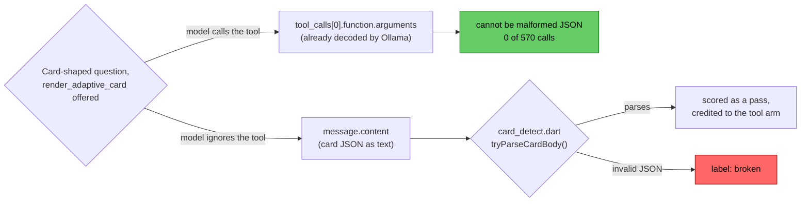

# Ollama's tool channel produces better cards, when the model remembers to use it

In
[`freemansoft/Flutter-AdaptiveCards`](https://github.com/freemansoft/Flutter-AdaptiveCards)
a demonstration Dart chat server hands a question to a local Ollama model. It
asks for the answer as Adaptive Card JSON, a tree of typed UI components called
elements (`TextBlock`, `Table`, `Input.ChoiceSet`). A Flutter client renders
that card as interactive UI rather than as text. By default the card comes back
in the model's message body, as JSON text inside `message.content`, which the
chat server parses to recover the card.

Ollama also offers a second route, the tool channel. The request body declares
a `render_adaptive_card` function and a schema for its arguments, in the
standard tool-calling format. Nothing ever runs that function. It exists only
to give the model a schema to answer into. When the model uses it, the card
arrives in `message.tool_calls[0].function.arguments`, already decoded into a
structure rather than as text the server has to parse.

Every figure below comes from
[`ModelBehavior.md`](https://github.com/freemansoft/Flutter-AdaptiveCards/blob/main/adaptive_chat_server_dart/ModelBehavior.md),
a lab notebook in that repository.

## Terms used in this article

| Term                             | What it means here                                                                                                                                                                                                             |
| -------------------------------- | ------------------------------------------------------------------------------------------------------------------------------------------------------------------------------------------------------------------------------ |
| **Channel**                      | Where the model's reply travels. `prose` puts card JSON as text in `message.content`. `tool` puts it in the arguments of a `render_adaptive_card` call. The name comes from the `--channel` flag of the probe `shape_ab.dart`. |
| **Shape case**, `n/25`           | 25 questions, each paired with the Adaptive Card element types that would answer it. A case passes when the reply uses one of them, so the score measures shape coverage rather than accuracy.                                 |
| **`--samples 2`**                | Every case runs twice and passes only if both runs passed, so one borderline call takes the whole case. The notebook's noise floor is ±1.                                                                                      |
| **Cold-start**, **with-history** | The question asked first, or asked with two ordinary conversational turns already in the conversation.                                                                                                                         |
| **Adoption**                     | How often a model actually called the tool when one was offered, out of 100 calls. Recorded per call by `shape_ab.dart`.                                                                                                       |

## Both arms are judged by the same code, on the same 25 cases

[`tool/model_probes/shape_ab.dart`](https://github.com/freemansoft/Flutter-AdaptiveCards/blob/main/adaptive_chat_server_dart/tool/model_probes/shape_ab.dart)
`--channel tool` runs the 25 shape cases through a `render_adaptive_card`
function. It converts the call's arguments into the reply string a prose
answer would have carried, so identical code judges both arms.

The two arms also share a system prompt, as far as they can. The tool arm's
prompt is the prose prompt with only the raw-JSON-emission rules rewritten,
the ones a tool call genuinely makes false, and a byte-identical element
catalogue. Every instruction about which element answers which question is
word for word the same. A gap between the arms is therefore a property of the
channel rather than of two differently written prompts.

Measured 2026-09-16 on an Apple M1 Max with 64 GB under Ollama 0.34.0,
`--samples 2`, `t=0`, unseeded, cold-start and with-history. The 7 models are
the ones a separate capability probe rates able to use the channel at all. The
first article in this series describes how that roster is derived.

Neither arm is seeded. The seed is a synthetic assistant turn holding raw card
JSON, which is a prose-channel artifact, so the tool arm cannot carry it.
Shape figures elsewhere in this series are seeded unless they say otherwise.
None of the figures below is.

## The shape scores are close, and they are the wrong table

Cases passed out of 25, from
[the tool-channel section](https://github.com/freemansoft/Flutter-AdaptiveCards/blob/main/adaptive_chat_server_dart/ModelBehavior.md#the-tool-channel-measured-against-prose)
of the notebook.

| Model                        | Tool cold | Prose cold |   Δ | Tool warm | Prose warm |   Δ |
| ---------------------------- | --------: | ---------: | --: | --------: | ---------: | --: |
| `qwen3.6:27b-coding-nvfp4`   |        25 |         23 |  +2 |        25 |         23 |  +2 |
| `qwen3.8:27b-nvfp4`          |        24 |         21 |  +3 |        23 |         25 |  −2 |
| `gpt-oss:20b`                |        18 |         15 |  +3 |        22 |         23 |  −1 |
| `granite4.1:8b`              |        20 |         20 |  +0 |        21 |         14 |  +7 |
| `qwen3-coder:30b`            |        22 |         16 |  +6 |        16 |         17 |  −1 |
| `nemotron-3.5-lightning:30b` |        22 |         22 |  +0 |        13 |          9 |  +4 |
| `nemotron-3-nano:30b`        |        15 |         14 |  +1 |        15 |         17 |  −2 |

Cold-start is positive or flat on all seven. With history the column is mixed,
and most rows sit inside the ±1 noise floor. Read alone, this table says the
channel is worth about nothing.

It is the wrong table.

## Offering a tool does not oblige a model to use one

Declaring a function does not remove the message body. A model can ignore the
tool and write card JSON into `message.content` as before. `shape_ab.dart`
judges such a reply by the prose rules, and it can pass.

So a tool-arm score is a blend of two channels unless something records which
path each reply took. `shape_ab.dart` records it per call.

Splitting the same runs on that flag:

| Model                        |  Prose arm | Tool arm, via tool | Tool arm, via message body | Adoption |
| ---------------------------- | ---------: | -----------------: | -------------------------: | -------: |
| `qwen3.6:27b-coding-nvfp4`   | 92% (n=96) |    **100%** (n=96) |                          — |   96/100 |
| `qwen3.8:27b-nvfp4`          | 94% (n=96) |     **98%** (n=92) |                   0% (n=4) |   92/100 |
| `gpt-oss:20b`                | 80% (n=96) |     **96%** (n=80) |                  0% (n=16) |   80/100 |
| `granite4.1:8b`              | 67% (n=96) |     **88%** (n=90) |                   0% (n=6) |   90/100 |
| `qwen3-coder:30b`            | 67% (n=96) |     **92%** (n=76) |                 25% (n=20) |   78/100 |
| `nemotron-3.5-lightning:30b` | 62% (n=96) |     **91%** (n=68) |                 14% (n=28) |   68/100 |
| `nemotron-3-nano:30b`        | 62% (n=96) |     **79%** (n=66) |                 13% (n=30) |   66/100 |

Per-call pass rate on the 96 card-asking calls in each arm.

**Where the tool is actually used it wins on every model**, 79% to 100%
against 62% to 94% on prose. The blended score looked unremarkable because 4
to 34 calls per 100 never used the tool. The shape table was measuring
adoption, not card quality.

One caution on the third column. Those are the calls where the model judged
that no card was wanted. A low score there is largely the decline itself being
counted as a failure, not evidence that the fallback path is broken.

## A tool call cannot carry malformed JSON, and that is most of the gain

Failed calls per 100, card cases only. `infra` covers HTTP 500s and timeouts
and is not attributable to either channel.

| Arm   | malformed | declined | wrong element | infra |
| ----- | --------: | -------: | ------------: | ----: |
| prose |    **50** |       53 |            45 |    21 |
| tool  |     **7** |       81 |            34 |    11 |

Ollama returns tool arguments already decoded, so a tool call cannot carry
malformed JSON. All 7 in the tool arm are `qwen3-coder:30b` message-body
fallbacks. Reproducing one directly shows the mechanism. The model ignored the
tool and wrote two top-level JSON objects separated by a newline, which is not
valid JSON. The prose prompt has a rule against exactly that. The tool prompt
drops it, because it reads as an emission mechanic.

Valid JSON is not a valid card, and the two need separate checks. An invented
element type parses, clears the detector, and renders as an invisible blank
that no pass-or-fail score catches. The server has always run a vocabulary
check for this. No probe did, which is why the check now runs inside
`shape_ab.dart` too.

Counting these runs the slower way, from the element types each judged reply
recorded, unrenderable types are **absent from both arms** across all 1,400
calls. The structured path does not trade a caught failure for a silent one.

The failure that remains is picking the wrong element for the question, 45 on
prose against 34 on tool. That is a prompt-quality problem rather than a
channel one.

## Two conversational turns are enough to make a model forget the tool

Excluding the negative control, one case whose right answer is prose, the
calls where a model declined the tool split sharply by condition.

| Model                        | Declines | Cold | With history |
| ---------------------------- | -------: | ---: | -----------: |
| `nemotron-3-nano:30b`        |       30 |   14 |           20 |
| `nemotron-3.5-lightning:30b` |       28 |    4 |       **28** |
| `qwen3-coder:30b`            |       20 |    2 |       **20** |
| `gpt-oss:20b`                |       16 |   12 |            8 |
| `granite4.1:8b`              |        6 |    8 |            2 |
| `qwen3.8:27b-nvfp4`          |        4 |    2 |            6 |
| `qwen3.6:27b-coding-nvfp4`   |        0 |    2 |            2 |

`qwen3-coder:30b` goes from 2 non-tool calls cold to 20 with history, while
its prose arm moves by one case across the same boundary. Two ordinary
conversational turns are enough to stop a model reaching for a function it
used reliably on turn one.

This series has already documented that history erodes card shape on the
prose channel. That is what the seed card exists to counter. The tool channel
has the same weakness, and on some models a worse one. The seed cannot be used
against it, being a prose-channel artifact.

The cases that lose the tool most are the ones whose natural answer is text.
`number`, `codeblock`, and `text` each go 10 of 24 calls, against 2 for
`carousel` and `badge`.

## Restoring the fallback's rules cost more adoption than it saved

If the message body is still live, the emission rules look like a guard for it
rather than something a tool makes false. A prompt restoring them as a
conditional was measured on the same 7 models. It repaired part of the damage,
taking `qwen3-coder:30b` from 7 malformed calls to 4 and lifting
`nemotron-3-nano:30b`'s adoption by 8. It cost more elsewhere:
`nemotron-3.5-lightning:30b` lost 8 adoption and gained the malformed replies
the change existed to prevent, going from 0 to 2.

Net across seven models: 7 malformed calls repaired against 2 introduced, and
adoption +10 against −8. Every shape score moved inside the noise floor except
that one. The rules guard the fallback, and they also advertise it. The prompt
was rejected.

## The server still asks for card JSON in the message body

Nothing shipped. There is no `--reply-channel` flag. The measurement favors
the channel, but what it favors is bounded by adoption, and adoption is the
part this measurement has not solved. Four of seven models decline on 16 to 30 calls per
100, and history makes it worse. A second code path through the reply loop is
hard to justify on a benefit that fades two turns into a conversation.

The more promising route is narrower. Malformed JSON is the prose channel's
largest failure at 50 calls per 100, and a tool call structurally cannot
produce one. A retry could fire only when the first reply fails to parse. That
converts most of those calls, costs nothing on the ones that already work, and
cannot depress adoption.

What ships is the measurement:
[`tool_channel_arms.sh`](https://github.com/freemansoft/Flutter-AdaptiveCards/blob/main/adaptive_chat_server_dart/tool/model_probes/tool_channel_arms.sh),
which runs the capability probe over the full roster and both shape arms over
whatever it rates supported. Re-run it when the roster changes, when a model's
tool support changes, or when the tool prompt changes. The capability verdicts
move with the prompt. It is roughly 1,400 serial model calls and about five
hours of wall clock.

One variable stays untested. Every probe in the notebook sends `think: false`,
so all of the above is thinking-off.

The repo is
[https://github.com/freemansoft/Flutter-AdaptiveCards](https://github.com/freemansoft/Flutter-AdaptiveCards),
and the lab notebook every figure above came from is
[https://github.com/freemansoft/Flutter-AdaptiveCards/blob/main/adaptive_chat_server_dart/ModelBehavior.md](https://github.com/freemansoft/Flutter-AdaptiveCards/blob/main/adaptive_chat_server_dart/ModelBehavior.md).
