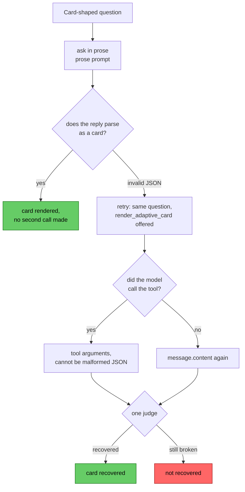

# Ollama's tool channel produces better cards, when the model remembers to use it

In
[`freemansoft/Flutter-AdaptiveCards`](https://github.com/freemansoft/Flutter-AdaptiveCards)
a demonstration Dart chat server hands a question to a local Ollama model. It
asks for the answer as Adaptive Card JSON, a tree of typed UI components
called elements (`TextBlock`, `Table`, `Input.ChoiceSet`). A Flutter client
renders that card as interactive UI rather than as text. By default, the card
comes back in the model's message body, as JSON text inside `message.content`,
which the chat server parses to recover the card.

Ollama also offers a second route, the tool channel. The request body declares
a `render_adaptive_card` function and a schema for its arguments, in the
standard tool-calling format. Nothing ever runs that function. It exists only
to give the model a schema to answer into. When the model uses it, the card
arrives in `message.tool_calls[0].function.arguments`. Ollama has already
decoded it into a JSON object, so there is no text for the chat server to
parse.

We measure the tool channel two ways. The first asks whether it is worth
anything on its own. The hypothesis is that a card which never has to be
written as text should fail less often. The second asks whether a tool-channel
retry can rescue a reply the prose channel got wrong. That is a two-pass
design a server could run. Ask in the message body as usual, and offer the
tool only when that reply fails to parse.

Every figure below comes from
[`ModelBehavior.md`](https://github.com/freemansoft/Flutter-AdaptiveCards/blob/main/adaptive_chat_server_dart/ModelBehavior.md),
a lab notebook in that repository.

## Terms used in this article

| Term                             | What it means here                                                                                                                                                                                                                                                                                                                                                                                                                                                                                                            |
| -------------------------------- | ----------------------------------------------------------------------------------------------------------------------------------------------------------------------------------------------------------------------------------------------------------------------------------------------------------------------------------------------------------------------------------------------------------------------------------------------------------------------------------------------------------------------------- |
| **Channel**                      | Where the model's reply travels. `prose` puts card JSON as text in `message.content`. `tool` puts it in the arguments of a `render_adaptive_card` call. The name comes from the `--channel` flag of the probe `shape_ab.dart`.                                                                                                                                                                                                                                                                                                |
| **Arm**                          | One complete run of the 25 cases in one configuration, and the unit this comparison is built from. That is 100 calls: 25 cases × 2 samples × 2 conditions, so every question is asked twice cold and twice with history. The prose arm asks for the card in the message body; the tool arm offers `render_adaptive_card`. An arm is not the same as a channel: an arm is a whole run, a channel is where one reply travelled, which is why the tool arm turns out to contain replies that came back through the message body. |
| **Roster**                       | The 15 local models this series measures. The tool arm ran on the 7 the canary rates `supported`. The retry ran on all 15, and its table shows the 10 that had any parse failures.                                                                                                                                                                                                                                                                                                                                            |
| **Canary**                       | The capability probe `tool_call_probe.dart`, which sorts each model by what it does when offered a tool. `supported` calls it on a card question and answers a prose question in prose. `supportedButDeclines` can call a tool but never reaches for `render_adaptive_card`. `overCalls` reaches for it on the prose question too. `unsupported` never produces a tool call. The first article covers the split.                                                                                                              |
| **Shape case**, `n/25`           | 25 questions, each paired with the Adaptive Card element types that would answer it. A case passes when the reply uses one of them, so the score measures shape coverage rather than accuracy. One case is a negative control whose right answer is prose, so 96 of an arm's 100 calls ask for a card.                                                                                                                                                                                                                        |
| **`--samples 2`**                | Every case runs twice. A case score out of 25 passes only if both runs passed, so one borderline call takes the whole case, and the notebook's noise floor on that score is ±1 case. Most figures here are per-call rates instead, where a difference of a few calls in 96 is not a ranking either.                                                                                                                                                                                                                           |
| **Cold-start**, **with-history** | The question asked first, or asked with two ordinary conversational turns already in the conversation: a user question about CI/CD and a short Markdown answer.                                                                                                                                                                                                                                                                                                                                                               |
| **Adoption**                     | How often a model called the tool when one was offered, out of 100 calls. Recorded per call by `shape_ab.dart`.                                                                                                                                                                                                                                                                                                                                                                                                               |

## How the two arms are built

[`tool/model_probes/shape_ab.dart`](https://github.com/freemansoft/Flutter-AdaptiveCards/blob/main/adaptive_chat_server_dart/tool/model_probes/shape_ab.dart)
`--channel tool` runs the 25 shape cases through a `render_adaptive_card`
function. Every scoring rule in the probe directory is written against a reply
string. The tool arm's JSON arguments are converted back to a string before
scoring. A single judge scores both arms, rather than two sets of rules that
could drift apart.

The two arms share a system prompt as far as they can. The tool arm's prompt
is the prose prompt with a byte-identical element catalogue. Only the
raw-JSON-emission rules are rewritten, the ones a tool call makes false, which
leaves 178 lines against the prose prompt's 223. Every instruction about which
Adaptive Card element answers which question is word for word the same. Any
remaining gap between the arms comes from which channel the reply took, with
one exception that the malformed-JSON section names.

Measured 2026-09-16 on an Apple M1 Max with 64 GB under Ollama 0.34.0,
`--samples 2` at temperature 0. The 7 models are those the canary rates
`supported`.

Neither arm is seeded. The seed is a synthetic assistant turn holding raw card
JSON, so the tool arm cannot carry it, and `shape_ab.dart` refuses the
combination. Shape figures elsewhere in this series are seeded; none below is.

Declaring a function does not remove the message body, so a model can ignore
the tool and write card JSON into `message.content` as before. That reply
meets the same judge, can pass, and counts toward the tool arm's score. A
tool-arm score is therefore a blend of two channels unless something records
which channel each reply took. `shape_ab.dart` records it per call as
`toolUsed`, and every result below is read through that field.

## The tool wins on every model that calls it

Per-call pass rate on the 96 card-asking calls in each arm, from [the
tool-adoption
section](https://github.com/freemansoft/Flutter-AdaptiveCards/blob/main/adaptive_chat_server_dart/ModelBehavior.md#tool-adoption-not-card-quality-is-what-the-shape-score-measures)
of the notebook. The model chooses which calls go through the tool. The "same
calls" column therefore scores the prose arm on the case, sample and condition
triples where the tool arm used the tool.

| Model                        | Prose arm | Prose arm, same calls | Tool arm, all calls | Tool arm, via tool | Tool arm, via message body | Adoption |
| ---------------------------- | --------: | --------------------: | ------------------: | -----------------: | -------------------------: | -------: |
| `qwen3.6:27b-coding-nvfp4`   |       92% |                   92% |                100% |    **100%** (n=96) |                          — |   96/100 |
| `qwen3.8:27b-nvfp4`          |       94% |                   93% |                 94% |     **98%** (n=92) |                   0% (n=4) |   92/100 |
| `gpt-oss:20b`                |       80% |                   80% |                 80% |     **96%** (n=80) |                  0% (n=16) |   80/100 |
| `granite4.1:8b`              |       67% |                   69% |                 82% |     **88%** (n=90) |                   0% (n=6) |   90/100 |
| `qwen3-coder:30b`            |       67% |                   74% |                 78% |     **92%** (n=76) |                 25% (n=20) |   78/100 |
| `nemotron-3.5-lightning:30b` |       62% |                   79% |                 69% |     **91%** (n=68) |                 14% (n=28) |   68/100 |
| `nemotron-3-nano:30b`        |       62% |                   67% |                 58% |     **79%** (n=66) |                 13% (n=30) |   66/100 |

The "all calls" column is what a comparison reports when it ignores which
channel each reply took. It is level with prose on `qwen3.8:27b-nvfp4` and
`gpt-oss:20b`, and below it on `nemotron-3-nano:30b`. The "via tool" column is
the same runs, counting only the calls that used the tool.

**Where the tool is used, it wins on every model**, 79% to 100% against 62% to
94% on the whole prose arm. On the three models that decline most, the calls
sent through the tool are the easier ones. Their matched prose rate runs 5 to
17 points above their whole-arm rate. The tool still leads on every row
against the matched calls, 67% to 93%. What the blended column measures is
adoption. Between 4 and 34 calls per 100 never used the tool, and those calls
pull the arm back toward its prose score.

One caution on the "via message body" column. Most of those calls are ones
where the model answered in prose. A low score there is largely the decline
itself being counted as a failure. The exception is `qwen3-coder:30b`, which
wrote card JSON into the message body on 20 of its 22 non-tool calls, and 5 of
those passed.

## Malformed JSON accounts for most of the gain

Every failed call in each arm, bucketed by how the judge scored it and summed
over the 7 models' 672 card-asking calls. The figures are from [the failures
section](https://github.com/freemansoft/Flutter-AdaptiveCards/blob/main/adaptive_chat_server_dart/ModelBehavior.md#where-the-failures-are)
of the notebook. `infra` covers HTTP 500s and timeouts and belongs to neither
channel.

| Arm   | malformed | answered in prose | wrong element | infra |
| ----- | --------: | ----------------: | ------------: | ----: |
| prose |    **50** |                53 |            45 |    21 |
| tool  |     **7** |                81 |            34 |    11 |

The tool arm fails 36 fewer times. Malformed JSON falls by 43, wrong element
by 11 and infra by 10, a gross reduction of 64. Prose answers rise by 28 and
offset part of it. Malformed JSON is two-thirds of the gross reduction.

Ollama returns tool arguments already decoded, so a tool call cannot carry
malformed JSON. Across the 570 calls that went through the tool, none did. All
7 in the tool arm are `qwen3-coder:30b` message-body fallbacks. Re-issuing one
by hand shows what happened. The model ignored the tool and wrote two
top-level JSON objects separated by a newline, which is not valid JSON. The
prose prompt has a rule against that. The tool prompt drops it because it
reads as an emission mechanic. These 7 are the one gap the prompts account for
rather than the choice of channel.

Valid JSON is not a valid card. An element type outside the client's
vocabulary parses, passes card detection and renders as a blank, and no
pass-or-fail score sees it. The chat server has checked for that since August.
The probes did not, so `shape_ab.dart` now records it per call. These runs
predate that field, but the judge already records the element types each reply
contained. None of the 1,400 records in either arm names a type the client
cannot render.

The remaining failure is picking the wrong element for the question, 45 on
prose against 34 on tool. That is a prompt-quality problem rather than a
channel one.

## Conversation history suppresses tool-calling

Two ordinary conversational turns are enough to stop three of the seven models
from calling the tool. The table shows the calls where a model did not use the
tool, split by condition, from [the history
section](https://github.com/freemansoft/Flutter-AdaptiveCards/blob/main/adaptive_chat_server_dart/ModelBehavior.md#conversation-history-suppresses-tool-calling-and-more-than-it-suppresses-cards)
of the notebook. All three columns exclude the negative control, so the two
condition columns sum to the first.

| Model                        | Declines | Cold | With history |
| ---------------------------- | -------: | ---: | -----------: |
| `nemotron-3-nano:30b`        |       30 |   12 |           18 |
| `nemotron-3.5-lightning:30b` |       28 |    2 |       **26** |
| `qwen3-coder:30b`            |       20 |    2 |       **18** |
| `gpt-oss:20b`                |       16 |   10 |            6 |
| `granite4.1:8b`              |        6 |    6 |            0 |
| `qwen3.8:27b-nvfp4`          |        4 |    0 |            4 |
| `qwen3.6:27b-coding-nvfp4`   |        0 |    0 |            0 |

`qwen3-coder:30b` goes from 2 non-tool calls cold to 18 with history, and
`nemotron-3.5-lightning:30b` from 2 to 26. Over the same boundary
`qwen3-coder:30b`'s prose case score moves by one, 16 to 17 of 25, inside the
noise floor. Both models used the function reliably on turn one. The effect is
not uniform: `gpt-oss:20b` and `granite4.1:8b` decline less with history than
cold, and `qwen3.6:27b-coding-nvfp4` never declines.

This series has already documented that history erodes card shape on the prose
channel, which the seed card exists to counter. On three of seven models
history erodes tool adoption the same way. On `qwen3-coder:30b` it erodes far
more than prose shape: 16 tool calls lost against one case gained. The seed
cannot help here, being a prose-channel artifact.

The cases that lose the tool most are the ones whose natural answer is text.
Each case gets 28 calls across the seven models. `text` went without the tool
on 14 of them and `number` and `codeblock` on 12 each, against 2 for
`carousel` and `badge`.

## A retry on parse failure recovers 43 of 99 broken cards

The retry is measured by a second probe,
[`retry_probe.dart`](https://github.com/freemansoft/Flutter-AdaptiveCards/blob/main/adaptive_chat_server_dart/tool/model_probes/retry_probe.dart),
with a different design. It asks every card case in prose first, then retries
only the replies that fail to parse. The retry offers `render_adaptive_card`
under the tool prompt, keeps the same history, and discards the broken reply.
Showing the model its own bad output would add self-correction as a second
variable. `llama3.2:latest` wedged its runner mid-run and was abandoned rather
than recorded as failures, so the probe covers fourteen models. The retry
fires on 99 of their 1,344 prose calls, about one in fourteen.

Only the `invalid JSON` branch reaches the retry. A reply that parses the
first time is done at the `card rendered` node. Prose answers and wrong
elements never reach the retry either, and on the prose arm they outnumber
malformed JSON two to one.

The 43 of 99 is a total, and the per-model table below is where the useful
reading is. It comes from [the retry
section](https://github.com/freemansoft/Flutter-AdaptiveCards/blob/main/adaptive_chat_server_dart/ModelBehavior.md#a-retry-on-parse-failure-recovers-43-of-99-broken-cards-and-the-misses-split-two-ways)
of the notebook. Ten of the fourteen models had any parse failures. Five
recover half or more, **33 of their 45**, and three of those recover every
failure. The other five recover 10 of 54.

| Model                        | Canary                 | Parse failures | Retried via tool | Recovered |
| ---------------------------- | ---------------------- | -------------: | ---------------: | --------: |
| `qwen3.6:27b-coding-nvfp4`   | `supported`            |              7 |                7 |     **7** |
| `granite4.1:8b`              | `supported`            |              4 |                4 |     **4** |
| `gpt-oss:20b`                | `supported`            |              2 |                2 |     **2** |
| `qwen3-coder:30b`            | `supported`            |             18 |               10 |    **12** |
| `qwen3.5:9b`                 | `overCalls`            |             14 |               14 |     **8** |
| `nemotron-3-nano:4b`         | `supportedButDeclines` |              6 |                0 |         2 |
| `granite4.1:3b`              | `overCalls`            |             14 |                8 |         4 |
| `nemotron-3-nano:30b`        | `supported`            |             14 |               12 |         4 |
| unsloth Nemotron 30B         | `supportedButDeclines` |             12 |                0 |         0 |
| `nemotron-3.5-lightning:30b` | `supported`            |              8 |                6 |         0 |

The unsloth row is `hf.co/unsloth/Nemotron-3-Nano-30B-A3B-GGUF:latest`, a
second packaging of the same weights as `nemotron-3-nano:30b`.

Adoption separates part of the split. Of the 99 retries, 63 went through the
tool and 39 of those recovered, 62%. The 36 where the model ignored the tool
on the retry recovered 4, 11%. Two of the bottom five never call the tool on
retry.

The other three do, and still recover little. Of the 24 tool-answered retries
that failed, 18 were calls to the function with no card in the arguments. The
other 6 were the wrong element on the `carousel` case.
`nemotron-3.5-lightning:30b` is the clearest row. 6 of its 8 retries went
through the tool and every one arrived empty. The same model passes 91% of the
calls where it uses the tool in the shape arm. A tool call cannot carry
malformed JSON, but it can carry nothing. The canary verdict does not predict
which models do this: `qwen3.5:9b` is rated `overCalls` and recovers 8 of 14.

## The repository chat server does not implement the tool channel

The chat server runs as it did before this work. It asks for card JSON in the
message body, parses what comes back, and falls back to Markdown when that
fails. There is no flag to turn the tool channel on, and the retry needs the
tool channel.

The arm measurement favors the tool channel, but what it favors is bounded by
adoption. Four of seven models decline on 16 to 30 of their 96 card-asking
calls, and on three of them, history makes it worse. A second code path
through the reply loop is hard to justify on a benefit that, on those models,
fades two turns into a conversation.

The retry is the narrower change. It pays on a model that both breaks on prose
and answers a tool with a card in it when offered one. `qwen2.5-coder:7b`, the
model this chat server ships, has neither. It had no parse failures in its 96
retry-probe calls, and no tool calls on the canary. That argues for a
per-model setting rather than a default, and it bears on the choice of model
rather than on the reply loop.

[`tool_channel_arms.sh`](https://github.com/freemansoft/Flutter-AdaptiveCards/blob/main/adaptive_chat_server_dart/tool/model_probes/tool_channel_arms.sh)
runs the canary over all 15 models, then both shape arms over the models it
rated `supported`.
[`retry_sweep.sh`](https://github.com/freemansoft/Flutter-AdaptiveCards/blob/main/adaptive_chat_server_dart/tool/model_probes/retry_sweep.sh)
runs the retry over all 15. Re-run them when the roster changes, when a
model's tool support changes, or when the tool prompt changes. The canary
verdicts move with the prompt. Between them, it is roughly 2,900 serial model
calls.

Every probe in the notebook sends `think: false`, so all of the above is
thinking turned off. Enabling thinking may give different results.

The repo is
[https://github.com/freemansoft/Flutter-AdaptiveCards](https://github.com/freemansoft/Flutter-AdaptiveCards),
and the lab notebook every figure above came from is
[https://github.com/freemansoft/Flutter-AdaptiveCards/blob/main/adaptive_chat_server_dart/ModelBehavior.md](https://github.com/freemansoft/Flutter-AdaptiveCards/blob/main/adaptive_chat_server_dart/ModelBehavior.md).
