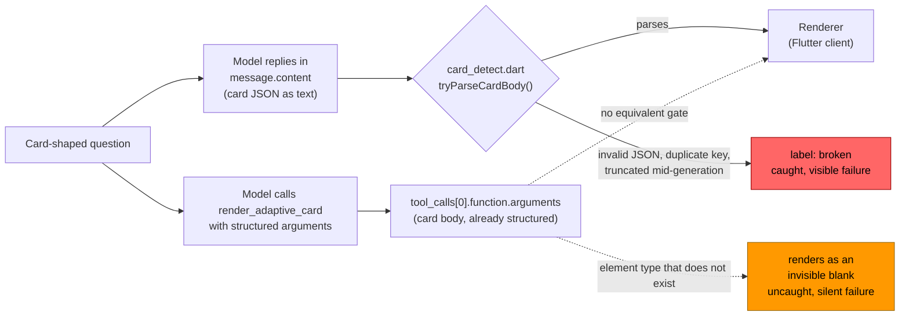

# The tool channel drove malformed JSON to zero and lost on half the models

In
[`freemansoft/Flutter-AdaptiveCards`](https://github.com/freemansoft/Flutter-AdaptiveCards)
a demonstration Dart chat server hands a question to a local Ollama model and
asks for the answer as Adaptive Card JSON, a tree of typed UI components called
elements (`TextBlock`, `Table`, `Input.ChoiceSet`), which a Flutter client
renders as interactive UI rather than as text. That card comes back in the
model's message body: JSON text inside `message.content`, which the server
parses to recover the card.

Every figure below comes from
[`ModelBehavior.md`](https://github.com/freemansoft/Flutter-AdaptiveCards/blob/main/adaptive_chat_server_dart/ModelBehavior.md),
a lab notebook in that repository.

## The tool channel moves the card out of the message body

Ollama offers a second route, the tool channel. Declare a
`render_adaptive_card` function and the model answers by calling it. The card
arrives as that call's arguments, a structure the runtime has already parsed,
with no JSON text left for the server to recover. Same model, same question,
same card. What changes is the slot it travels in.

Moving the card into that slot drove malformed JSON to **zero on all eight
models that could use the channel**. No unexpected-character errors, no arrays
missing their `[ ]`, no cards truncated mid-generation, no duplicate keys. On
four of those same eight models the tool channel still scored worse than prose
did, and nothing shipped. The reason is a subtraction: the channel removed one
failure family and added two others, and on four models the additions outweighed
the removal.

## The same code scores both arms, against the unseeded prose run

[`tool/model_probes/shape_ab.dart`](https://github.com/freemansoft/Flutter-AdaptiveCards/blob/main/adaptive_chat_server_dart/tool/model_probes/shape_ab.dart)
`--channel tool` runs the same 25 shape cases through a `render_adaptive_card`
function. It converts the call's arguments into the reply string a prose answer
would have carried, so the same code judges both arms of the A/B, prose and
tool. The run took place on 2026-08-21 against the eight models that a separate
capability probe,
[`tool_call_probe.dart`](https://github.com/freemansoft/Flutter-AdaptiveCards/blob/main/adaptive_chat_server_dart/tool/model_probes/tool_call_probe.dart),
had rated `supported` out of the roster of fifteen. The first article in this
series describes the four-way split that produced those eight. Conditions:
`--samples 2`, `t=0`, cold-start and with-history, and unseeded. Unseeded means
without the card seed, a synthetic two-turn card exchange the server normally
prepends to the context so a card is the conversation's established format. A
case counts as passed only if both of its two runs passed, in both arms.

**The probe compares each tool run against that model's recorded `unaided`
run, the unseeded prose arm, never the seeded one.** The tool arm cannot be
seeded. The seed's assistant turn holds raw card JSON, which is not what a
tool-channel history looks like. Scoring the tool arm against a seeded prose
baseline would hand prose an advantage the tool arm cannot have. Every other
shape figure in this series is seeded. None of the figures below is.

A model counts as a **win** only if the tool channel never made it worse on
either condition.

The two channels are not symmetric in what stands between the model and the
renderer:

The prose path has a detector that can reject a malformed body and label it
`broken`. The tool path has nothing equivalent. Arguments that name an element
type that does not exist are still well-formed arguments, so they pass straight
through. That asymmetry is why the malformed-JSON column below reads zero on
every model while some of the same models score worse overall. Zero malformed
JSON is not the same as zero broken cards.

## Two wins, two unaffected, four losses

Cold-start and with-history scores are out of 25 cases each, unseeded, `t=0`,
`--samples 2`, from
[the tool-channel section](https://github.com/freemansoft/Flutter-AdaptiveCards/blob/main/adaptive_chat_server_dart/ModelBehavior.md#the-tool-channel-measured-against-prose)
of the notebook.

| Model                        | Tool cold | Prose cold |   Δ | Tool w/ history | Prose w/ history |   Δ | Verdict    |
| ---------------------------- | --------: | ---------: | --: | --------------: | ---------------: | --: | ---------- |
| `qwen3-coder:30b`            |        19 |         16 |  +3 |              20 |               14 |  +6 | **win**    |
| `qwen3.5:9b`                 |        17 |         17 |   0 |              21 |               17 |  +4 | **win**    |
| `qwen3.6:27b-coding-nvfp4`   |        24 |         23 |  +1 |              24 |               24 |   0 | unaffected |
| `qwen3.8:27b-nvfp4`          |        22 |         23 |  −1 |              24 |               24 |   0 | unaffected |
| `nemotron-3.5-lightning:30b` |        18 |         21 |  −3 |               9 |               13 |  −4 | loss       |
| `gpt-oss:20b`                |        20 |         18 |  +2 |              20 |               25 |  −5 | loss       |
| `nemotron-3-nano:30b`        |        12 |         16 |  −4 |              11 |               16 |  −5 | loss       |
| `nemotron-3-nano:4b`         |         4 |          9 |  −5 |               5 |                7 |  −2 | loss       |

The two `unaffected` rows are the same result on either side of an arbitrary
line. **±1 is inside the notebook's own noise floor.** The 2026-08-20
re-measurement moved ten of twelve steady models by ±1 with nothing about them
changing. A row that reads `+1` and a row that reads `−1` are indistinguishable
from each other and from zero. Only `qwen3-coder:30b`'s +6 and
`qwen3.5:9b`'s +4 are gains worth relying on, and only the four losses are
large enough to act on.

The table reads as a contradiction. The channel removed a whole failure family
from every row, and half the rows got worse anyway. Bucketing the failed calls
resolves it.

## Every failed call, bucketed by the label the judge already wrote

The decomposition costs no model calls. It re-scores the same results JSON,
bucketing every failed call by the `label` the judge wrote at the time. Each
arm is **100 calls**: 25 cases × 2 samples × cold-start and with-history. Of
those, 96 ask for a card and 4 are the negative control, the case that wants a
plain prose answer. The headline `n/25` counts a case as passing only when every
sample of it passed, so these per-call buckets are a finer view of the same
runs, not a second metric.

Four buckets, by `label` prefix:

- `malformed`: `broken: invalid JSON`, `broken: duplicate-key`.
- `declined`: `label == prose` on a case that wanted a card.
- `wrong-shape`: `wrong-shape:`, `no-input:`, `unwanted-card:`.
- `infra`: `broken: HTTP 500`, `broken: timeout`. Listed separately because
  the channel does not cause it.

Both tables count failed calls per 100 calls per arm, from
[the failure decomposition](https://github.com/freemansoft/Flutter-AdaptiveCards/blob/main/adaptive_chat_server_dart/ModelBehavior.md#why-it-did-not-pay--the-failure-decomposition)
in the notebook. The prose arm first:

| Model                        | Verdict    | malformed | declined | wrong-shape | infra |
| ---------------------------- | ---------- | --------: | -------: | ----------: | ----: |
| `qwen3-coder:30b`            | win        |        21 |        0 |          18 |     0 |
| `qwen3.5:9b`                 | win        |        18 |        0 |          14 |     0 |
| `qwen3.6:27b-coding-nvfp4`   | unaffected |         6 |        0 |           0 |     0 |
| `qwen3.8:27b-nvfp4`          | unaffected |         0 |        2 |           3 |     0 |
| `nemotron-3.5-lightning:30b` | loss       |         8 |       16 |           8 |     0 |
| `gpt-oss:20b`                | loss       |         1 |        4 |           3 |     3 |
| `nemotron-3-nano:30b`        | loss       |        10 |        4 |          22 |     0 |
| `nemotron-3-nano:4b`         | loss       |         6 |       52 |          10 |     0 |

The tool arm, same models and same 100 calls each. The decline rate is the
`declined` column as a share of the 96 card-asking calls:

| Model                        | Verdict    | malformed | declined | wrong-shape | infra | Decline rate |
| ---------------------------- | ---------- | --------: | -------: | ----------: | ----: | -----------: |
| `qwen3-coder:30b`            | win        |         0 |        3 |          18 |     0 |           3% |
| `qwen3.5:9b`                 | win        |         0 |        2 |          22 |     0 |           2% |
| `qwen3.6:27b-coding-nvfp4`   | unaffected |         0 |        0 |           4 |     0 |           0% |
| `qwen3.8:27b-nvfp4`          | unaffected |         0 |        4 |           4 |     0 |           4% |
| `nemotron-3.5-lightning:30b` | loss       |         0 |       30 |          16 |     0 |          31% |
| `gpt-oss:20b`                | loss       |         0 |       11 |           3 |     5 |          11% |
| `nemotron-3-nano:30b`        | loss       |         0 |       20 |          34 |     0 |          21% |
| `nemotron-3-nano:4b`         | loss       |         0 |       48 |          32 |     2 |          50% |

**The `malformed` column is zero on all eight models in the tool arm.** Moving
the card out of the message body removes the serialization burden. That is the
effect the channel promised, and it held on every row, including the three
where prose lost 18, 21, and 10 calls to it.

Two costs replace it.

The first is **declining to call the tool at all**. In the prose channel the
model has already committed to emitting something. The tool channel adds a
decision point ahead of every card. The four qwen models decline on 0–4% of
card cases. The four losses decline on 11%, 21%, 31%, and 50%.

The second is **weaker element choice**. Filling a schema argument appears to
favor the cheapest legal filler. That is an inference from the labels, and
nothing here measures the mechanism. `nemotron-3-nano:30b` gains 12 wrong-shape
failures, labeled `{TextBlock} want {Chart.Line}`, `{TextBlock} want
{CodeBlock}`, and `{} want {FactSet, Table}`. `nemotron-3-nano:4b` gains 22.

**The outcome is a subtraction: malformed failures recovered, minus declines
and shape regressions gained.** That subtraction accounts for all eight rows.
The two wins are the rows where the recovered column is large and the paid
column is small. `qwen3-coder:30b` recovers 21 calls and pays 3. The three
nemotron losses are the reverse, recovering 8, 10, and 6 while paying 22, 28,
and 18. Neither side is a property of size or family.

The two rows the ±1 noise floor leaves unexplained on the headline numbers fit
the same subtraction. `qwen3.6:27b-coding-nvfp4` recovers 6 and pays 4, a net
inside the noise floor, which is why it reads as unaffected.
`qwen3.8:27b-nvfp4` had no malformed failures in prose at all, so it has
nothing to recover and only costs to pay. Its "unaffected" is a small loss the
noise floor absorbs. `gpt-oss:20b` is the same shape with one malformed failure
to recover, and it pays enough that the noise floor does not absorb it. That
row reads as a loss.

As a rule for the next roster: **the tool channel helps a model that selects
the right card but fails to serialize it.** It does not help a model whose
failures are about selecting the wrong card, and it costs a model that is
reluctant to commit to a card at all.

## Architecture does not separate wins from losses, and the chat template predicts better

`qwen3-coder:30b` (30B, 3B active) is a win. `nemotron-3-nano:30b` (30B, 3B
active) is a loss. Same architecture class, opposite results. The parameter
count and the sparsity pattern are not doing the work here.

The chat template is the better predictor. It is part of a model's packaging,
not its weights: the per-build text template that formats the conversation into
the prompt the weights actually see, including how it injects tool definitions
and how it writes a tool call back out. `nemotron-3-nano:30b` and the
`hf.co/unsloth/Nemotron-3-Nano-30B-A3B-GGUF:latest` build are the same base
weights under different packaging.
[The tool-calling capability probe](https://github.com/freemansoft/Flutter-AdaptiveCards/blob/main/adaptive_chat_server_dart/ModelBehavior.md#not-a-card-test-the-tool-calling-canary)
rates one `supported` and the other `supportedButDeclines`, so the packaging
changed the verdict where the weights did not. Separately,
`llama3-groq-tool-use:8b`, fine-tuned for tool use, never reaches for the card
tool.

One variable is still untested. **Every probe in the notebook sends
`think: false` unconditionally, so all sixteen runs above are thinking-off.** A
thinking-on arm is the one variant of this measurement not yet run, and the
notebook lists it as open work.

## A one-request gate over-predicted willingness, and the channel hides what it does not remove

**The capability probe over-predicted willingness.** It rated all eight of these
models `supported` on a single card request. Across 25 cases, four of them
decline on 11–50% of card requests. "Will call the card tool once" and "will
reach for it reliably" are separate properties, in the same way the probe
itself found "can call a tool" and "uses it for a card" to be separate. A
one-request gate measures the weaker of the two.

**The channel also converts detected failures into silent ones.**
[`lib/src/card_detect.dart`](https://github.com/freemansoft/Flutter-AdaptiveCards/blob/main/adaptive_chat_server_dart/lib/src/card_detect.dart)
catches a malformed prose card and surfaces it as `broken`. A tool call
carrying an invented element type is well-formed arguments that render as an
invisible blank. `nemotron-3-nano:4b`'s tool arm produced eight calls labeled
`no-input: got {Input, TextBlock}`, where `Input` is not an element type. The
shape probe catches those only because it scores against an expected element
set. A user would see nothing. **Zero malformed JSON is not the same as zero
broken cards.**

## The server kept the message-body channel, because the measured value was low

The server has no `--reply-channel` flag and still asks for card JSON in the
message body. Half the models that can use the channel get materially worse on
it, so it could not be the default. Two beneficiaries out of fifteen roster
models did not justify a second code path through the reply loop.

What ships is the measurement,
[`tool/model_probes/tool_channel.dart`](https://github.com/freemansoft/Flutter-AdaptiveCards/blob/main/adaptive_chat_server_dart/tool/model_probes/tool_channel.dart)
and `shape_ab.dart --channel tool`, so the finding can be re-checked when the
roster or a model's tool support changes. Re-check it on that trigger and not
otherwise. The run is roughly 800 serial model calls across eight models, three
of them 18–25 GB, and it took hours of wall clock.

The repo is
[https://github.com/freemansoft/Flutter-AdaptiveCards](https://github.com/freemansoft/Flutter-AdaptiveCards),
and the lab notebook every figure above came from is
[https://github.com/freemansoft/Flutter-AdaptiveCards/blob/main/adaptive_chat_server_dart/ModelBehavior.md](https://github.com/freemansoft/Flutter-AdaptiveCards/blob/main/adaptive_chat_server_dart/ModelBehavior.md).
