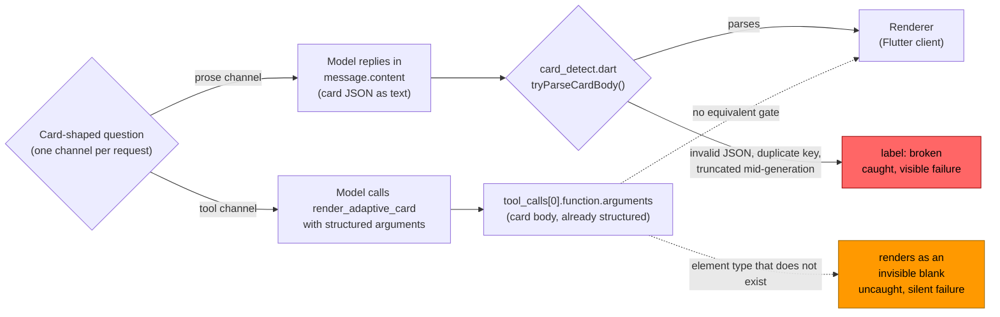

# The Ollama tool channel fixed malformed JSON and still lost on half the models

In
[`freemansoft/Flutter-AdaptiveCards`](https://github.com/freemansoft/Flutter-AdaptiveCards)
a demonstration Dart chat server hands a question to a local Ollama model. It
asks for the answer as Adaptive Card JSON, a tree of typed UI components called
elements (`TextBlock`, `Table`, `Input.ChoiceSet`). A Flutter client renders
that card as interactive UI rather than as text. By default the card comes back
in the model's message body, as JSON text inside `message.content`, which the
chat server parses to recover the card.

Ollama also offers a second route, the tool channel. The request body declares
a `render_adaptive_card` function and a schema for its arguments, in the
standard tool-calling format. Nothing ever runs that function. It exists only
to give the model a schema to answer into. When the model uses it, the response
carries the card in `message.tool_calls[0].function.arguments`, normally
already decoded into a structure rather than as text the server has to parse.
The model, the question, and the requested card are the same on both routes.
Does a card that arrives through the tool call come out better than one asked
for in the message body?

Every figure below comes from
[`ModelBehavior.md`](https://github.com/freemansoft/Flutter-AdaptiveCards/blob/main/adaptive_chat_server_dart/ModelBehavior.md),
a lab notebook in that repository.

## The Ollama tool channel drove malformed JSON to zero on all eight models

Across the 800 calls those eight models made through the tool channel, not one
set of arguments failed to parse. No unexpected-character errors, no arrays
missing their `[ ]`, no cards truncated mid-generation, and no duplicate keys. We sometimes see each of these on the
prose channel. On four of those same eight models the tool channel still scored
worse than prose did, and nothing shipped. The reason is a subtraction: the
channel removed one failure family and added two others, and on four models the
additions outweighed the removal.

## Terms used in this article

| Term                                | What it means here                                                                                                                                                                                                                                                                                                                                                                      |
| ----------------------------------- | --------------------------------------------------------------------------------------------------------------------------------------------------------------------------------------------------------------------------------------------------------------------------------------------------------------------------------------------------------------------------------------- |
| **Channel**                         | Where the model's reply travels. `prose` puts the card JSON as text in `message.content`. `tool` puts it in the arguments of a `render_adaptive_card` call. The name comes from the `--channel` flag of the probe `shape_ab.dart`; Ollama itself has no name for the distinction.                                                                                                       |
| **Shape case**, `n/25`              | 25 questions, each paired with the Adaptive Card element types that would answer it. A case passes when the reply uses one of them, so the score measures shape coverage rather than accuracy: a model can answer correctly in prose and still score low.                                                                                                                               |
| **Seeded** and **unseeded**         | Seeded prepends a synthetic two-turn card exchange to the conversation, so a card is already the established format. Unseeded omits it. The Ollama tool channel cannot be seeded, and the next section explains why.                                                                                                                                                                    |
| **Cold-start** and **with-history** | The question asked first, or asked with ordinary exchanges already in the conversation.                                                                                                                                                                                                                                                                                                 |
| **Win**, **unaffected**, **loss**   | Verdicts on a model's tool-channel score against its own unseeded prose score, compared separately for cold-start and with-history. Win: better by more than 1 case on at least one condition, and worse on neither. Loss: worse by more than 1 case on at least one condition. Unaffected: neither. Both unaffected rows move by 1 case or less, inside the notebook's ±1 noise floor. |

## Both channels are judged by the same code, against unseeded prose only

[`tool/model_probes/shape_ab.dart`](https://github.com/freemansoft/Flutter-AdaptiveCards/blob/main/adaptive_chat_server_dart/tool/model_probes/shape_ab.dart)
`--channel tool` runs the same 25 shape cases through a `render_adaptive_card`
function. It converts the call's arguments into the reply string a prose answer
would have carried, so the same code judges both channels, prose and tool. The
run took place on 2026-08-21 against the eight models that a separate
capability probe,
[`tool_call_probe.dart`](https://github.com/freemansoft/Flutter-AdaptiveCards/blob/main/adaptive_chat_server_dart/tool/model_probes/tool_call_probe.dart),
had rated `supported` out of the roster of fifteen. The first article in this
series describes the four-way split that produced those eight. Conditions:
`--samples 2`, `t=0`, cold-start and with-history, and unseeded. In each
channel, a case counts as passed only if both of its two runs passed.

**The probe compares each tool run against that model's recorded `unaided`
run, the unseeded prose channel, never the seeded one.** The Ollama tool
channel cannot be seeded. The seed is itself a prose-channel artifact: a
synthetic assistant turn holding raw card JSON as text. Grafted onto a
tool-call conversation, it would not represent either channel cleanly.
`shape_ab.dart` turns the seed on by default and refuses `--channel tool`
unless `--no-seed-card` is also passed. Scoring the tool channel against a
seeded prose baseline would hand prose an advantage the tool channel cannot
have. Shape figures elsewhere in this series are seeded unless they say
otherwise, and the second article, which measures what the seed is worth,
carries both. None of the figures below is seeded.

The two channels also do not share a system prompt. The probe sends
[`card_system_prompt.txt`](https://github.com/freemansoft/Flutter-AdaptiveCards/blob/main/adaptive_chat_server_dart/assets/card_system_prompt.txt) on the prose channel and
the shorter [`card_tool_prompt.txt`](https://github.com/freemansoft/Flutter-AdaptiveCards/blob/main/adaptive_chat_server_dart/assets/card_tool_prompt.txt) on the tool
channel. The prose prompt says the whole reply must be a raw card fragment,
which is false when a tool is offered. Nothing here separates the
channel's effect from the shorter prompt's, so every delta below carries that
difference.

The probe uses one channel for a whole run, and the server uses only the prose
channel, so no question goes down both paths. The two paths differ in what
stands between the model and the renderer:

The prose path has a detector that can reject a malformed body and label it
`broken`. The tool path has nothing equivalent. Arguments that name an element
type that does not exist are still well-formed arguments, so they pass straight
through. That asymmetry is why the malformed-JSON column below reads zero on
every model while some of the same models score worse overall. Zero malformed
JSON is not the same as zero broken cards.

## Two wins, two unaffected, four losses

Cold-start and with-history scores are out of 25 cases each, unseeded, `t=0`,
`--samples 2`, from
[the tool-channel section](https://github.com/freemansoft/Flutter-AdaptiveCards/blob/main/adaptive_chat_server_dart/ModelBehavior.md#the-tool-channel-measured-against-prose)
of the notebook. The verdict column applies the win, unaffected, and loss rules
from the terms table.

| Model                        | Tool cold | Prose cold |   Δ | Tool w/ history | Prose w/ history |   Δ | Verdict    |
| ---------------------------- | --------: | ---------: | --: | --------------: | ---------------: | --: | ---------- |
| `qwen3-coder:30b`            |        19 |         16 |  +3 |              20 |               14 |  +6 | **win**    |
| `qwen3.5:9b`                 |        17 |         17 |   0 |              21 |               17 |  +4 | **win**    |
| `qwen3.6:27b-coding-nvfp4`   |        24 |         23 |  +1 |              24 |               24 |   0 | unaffected |
| `qwen3.8:27b-nvfp4`          |        22 |         23 |  −1 |              24 |               24 |   0 | unaffected |
| `nemotron-3.5-lightning:30b` |        18 |         21 |  −3 |               9 |               13 |  −4 | loss       |
| `gpt-oss:20b`                |        20 |         18 |  +2 |              20 |               25 |  −5 | loss       |
| `nemotron-3-nano:30b`        |        12 |         16 |  −4 |              11 |               16 |  −5 | loss       |
| `nemotron-3-nano:4b`         |         4 |          9 |  −5 |               5 |                7 |  −2 | loss       |

The two `unaffected` rows are the same result on either side of an arbitrary
line. **±1 is inside the notebook's own noise floor.** The 2026-08-20
re-measurement moved ten of twelve steady models by ±1 with nothing about them
changing. A row that reads `+1` and a row that reads `−1` are indistinguishable
from each other and from zero. Only `qwen3-coder:30b`'s +6 and
`qwen3.5:9b`'s +4 are gains worth relying on, and only the four losses are
large enough to act on.

The table reads as a contradiction. The channel removed a whole failure family
from every row, and half the rows got worse anyway. The failure buckets in the
next section account for it.

## Every failed call, bucketed by its label

The decomposition costs no model calls. It re-scores the same results JSON,
bucketing every failed call by the `label` the judge wrote at the time. Each
channel is **100 calls**: 25 cases × 2 samples × cold-start and with-history.
Of those, 96 ask for a card and 4 are the negative control: one case, run four
times, that wants a plain prose answer. The headline `n/25` counts a case as
passing only when every sample of it passed, so these per-call buckets are a
finer view of the same runs, not a second metric.

Four buckets, by `label` prefix:

- `malformed`: `broken: invalid JSON`, `broken: duplicate-key`.
- `declined`: `label == prose` on a case that wanted a card.
- `wrong-shape`: `wrong-shape:`, `no-input:`, `unwanted-card:`.
- `infra`: `broken: HTTP 500`, `broken: timeout`. Listed separately because
  the channel does not cause it.

Both tables count failed calls per 100 calls per channel, from
[the failure decomposition](https://github.com/freemansoft/Flutter-AdaptiveCards/blob/main/adaptive_chat_server_dart/ModelBehavior.md#why-it-did-not-pay--the-failure-decomposition)
in the notebook. The prose channel first:

| Model                        | Verdict    | malformed | declined | wrong-shape | infra |
| ---------------------------- | ---------- | --------: | -------: | ----------: | ----: |
| `qwen3-coder:30b`            | win        |        21 |        0 |          18 |     0 |
| `qwen3.5:9b`                 | win        |        18 |        0 |          14 |     0 |
| `qwen3.6:27b-coding-nvfp4`   | unaffected |         6 |        0 |           0 |     0 |
| `qwen3.8:27b-nvfp4`          | unaffected |         0 |        2 |           3 |     0 |
| `nemotron-3.5-lightning:30b` | loss       |         8 |       16 |           8 |     0 |
| `gpt-oss:20b`                | loss       |         1 |        4 |           3 |     3 |
| `nemotron-3-nano:30b`        | loss       |        10 |        4 |          22 |     0 |
| `nemotron-3-nano:4b`         | loss       |         6 |       52 |          10 |     0 |

The Ollama tool channel, same models and same 100 calls each. The decline rate
is the `declined` column as a share of the 96 card-asking calls. Recovered is
the malformed calls prose lost and the tool channel did not; paid is what it
added in declines and wrong-shape calls:

| Model                        | Verdict    | malformed | declined | wrong-shape | infra | Decline rate | Recovered | Paid |
| ---------------------------- | ---------- | --------: | -------: | ----------: | ----: | -----------: | --------: | ---: |
| `qwen3-coder:30b`            | win        |         0 |        3 |          18 |     0 |           3% |        21 |    3 |
| `qwen3.5:9b`                 | win        |         0 |        2 |          22 |     0 |           2% |        18 |   10 |
| `qwen3.6:27b-coding-nvfp4`   | unaffected |         0 |        0 |           4 |     0 |           0% |         6 |    4 |
| `qwen3.8:27b-nvfp4`          | unaffected |         0 |        4 |           4 |     0 |           4% |         0 |    3 |
| `nemotron-3.5-lightning:30b` | loss       |         0 |       30 |          16 |     0 |          31% |         8 |   22 |
| `gpt-oss:20b`                | loss       |         0 |       11 |           3 |     5 |          11% |         1 |    7 |
| `nemotron-3-nano:30b`        | loss       |         0 |       20 |          34 |     0 |          21% |        10 |   28 |
| `nemotron-3-nano:4b`         | loss       |         0 |       48 |          32 |     2 |          50% |         6 |   18 |

**The `malformed` column is zero on all eight models in the tool channel.**
Moving the card out of the message body removes the serialization burden. That
is the effect the channel promised, and it held on every row, including the
three where prose lost 18, 21, and 10 calls to it.

Two costs replace it.

The first is **declining to call the tool at all**. In the prose channel the
model has already committed to emitting something. The tool channel adds a
decision point ahead of every card. The four qwen models decline on 0–4% of
card cases. Three of the four losses decline more often on the tool channel
than in prose: 16 calls per 100 to 30, 4 to 11, and 4 to 20.
`nemotron-3-nano:4b` is the exception, declining on 48 tool calls against 52 in
prose, so the channel added no declines there and its loss comes from element
choice instead.

The second is **weaker element choice**. Filling a schema argument appears to
favor the cheapest legal filler. That is an inference from the labels, and
nothing here measures the mechanism. `nemotron-3-nano:30b` gains 12 wrong-shape
failures, labeled `{TextBlock} want {Chart.Line}`, `{TextBlock} want
{CodeBlock}`, and `{} want {FactSet, Table}`. `nemotron-3-nano:4b` gains 22.

**The outcome is a subtraction: what the channel recovers in malformed
failures, minus what it pays in declines and wrong-shape calls.** The last two
columns carry it, and it accounts for all eight rows, including the two the ±1
noise floor leaves unexplained on the headline numbers. The wins recover far
more than they pay, `qwen3-coder:30b` 21 against 3, and the three nemotron
losses reverse that. `qwen3.8:27b-nvfp4` had nothing to recover and still paid
3, which is the small loss its "unaffected" absorbs, while `gpt-oss:20b`
recovers 1 against 7 and reads as a loss. Neither side is a property of size or
family.

As a rule for the next roster: **the tool channel helps a model that selects
the right card but fails to serialize it.** It does not help a model whose
failures are about selecting the wrong card, and it costs a model that is
reluctant to commit to a card at all.

## Model size does not separate wins from losses

`qwen3-coder:30b` is a win and `nemotron-3-nano:30b` is a loss. Both are
mixture-of-experts models in the same size class: 30B parameters in total, 3B
of them active for any one token. The pair matches on size, not necessarily on
the rest of its LLM architecture. It shows that size alone does not separate
the groups, and it leaves architecture as a whole untested.

The chat template is a better candidate, on the evidence of one pair of builds.
It ships as part of the model build, in the same download as the weights. It is
neither the weights nor the architecture. It is the text template that formats
the conversation into the prompt the weights see, and it decides how tool
definitions go in and how a tool call comes back out. `nemotron-3-nano:30b` and
the `hf.co/unsloth/Nemotron-3-Nano-30B-A3B-GGUF:latest` build share base weights
under different templates.
[The tool-calling capability probe](https://github.com/freemansoft/Flutter-AdaptiveCards/blob/main/adaptive_chat_server_dart/ModelBehavior.md#not-a-card-test-the-tool-calling-canary)
rates one `supported` and the other `supportedButDeclines`, so on that probe
the packaging changed the verdict where the weights did not. The unsloth build
is not one of the eight in the shape run, so this is evidence about willingness
to call the tool, not about win or loss.

Fine-tuning for tool use does not guarantee a card-tool call.
`llama3-groq-tool-use:8b` is fine-tuned for tool use and does not reach for the
card tool at all.

One variable is still untested. **Every probe in the notebook sends
`think: false` unconditionally, so all sixteen runs above (eight models × two
channels) are thinking-off.** That setting switches off the separate reasoning
pass on models that have one. A thinking-on variant is the one configuration of
this measurement not yet run, and the notebook lists it as open work.

## A one-request gate over-predicts willingness

The capability probe rated all eight of these models `supported` on a single
card request. Across 25 cases, four of them
decline on 11–50% of card requests. "Will call the card tool once" and "will
reach for it reliably" are separate properties, in the same way the probe
itself found "can call a tool" and "uses it for a card" to be separate. A
one-request gate measures the weaker of the two.

## The Ollama tool channel converts detected failures into silent ones

[`lib/src/card_detect.dart`](https://github.com/freemansoft/Flutter-AdaptiveCards/blob/main/adaptive_chat_server_dart/lib/src/card_detect.dart)
catches a malformed prose card and surfaces it as `broken`. Nothing on the tool
side runs the equivalent check. A tool call carrying an invented element type
is well-formed arguments that render as an invisible blank.
`nemotron-3-nano:4b`'s tool channel produced eight calls labeled
`no-input: got {Input, TextBlock}`, where `Input` is not an element type. The
shape probe catches those only because it scores against an expected element
set. A user would see nothing.

## The server kept the message-body channel, because the measured value of the Ollama tool channel was low

The server has no `--reply-channel` flag and still asks for card JSON in the
message body. Four of the eight models that can use the channel score worse on
it, so it could not be the default. Two wins among the eight models able to use
the channel, from a roster of fifteen, did not justify a second code path
through the reply loop.

What ships is the measurement,
[`tool/model_probes/tool_channel.dart`](https://github.com/freemansoft/Flutter-AdaptiveCards/blob/main/adaptive_chat_server_dart/tool/model_probes/tool_channel.dart)
and `shape_ab.dart --channel tool`, so the finding can be re-checked when the
roster or a model's tool support changes. Re-check it on that trigger and not
otherwise. The run is roughly 800 serial model calls across eight models, three
of them 18–25 GB, and it took hours of wall clock.

The repo is
[https://github.com/freemansoft/Flutter-AdaptiveCards](https://github.com/freemansoft/Flutter-AdaptiveCards),
and the lab notebook every figure above came from is
[https://github.com/freemansoft/Flutter-AdaptiveCards/blob/main/adaptive_chat_server_dart/ModelBehavior.md](https://github.com/freemansoft/Flutter-AdaptiveCards/blob/main/adaptive_chat_server_dart/ModelBehavior.md).
