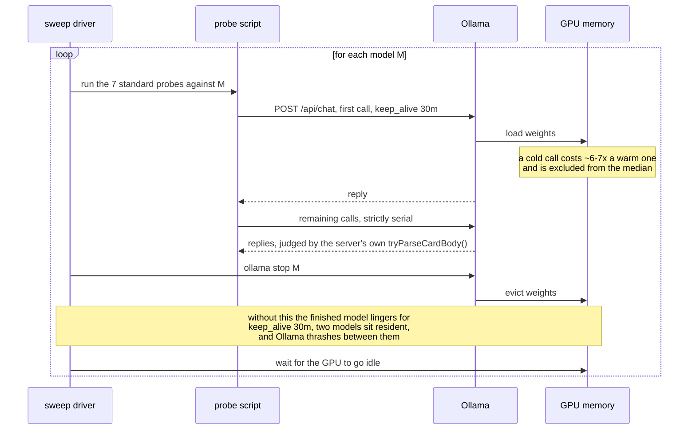

# The measurement was wrong, in a way that looked exactly like a slow model

In
[`freemansoft/Flutter-AdaptiveCards`](https://github.com/freemansoft/Flutter-AdaptiveCards)
a demonstration Dart chat server hands a question to a local Ollama model and
asks for the answer as Adaptive Card JSON, which a Flutter app renders. A
directory of probes measures which models manage it. Every lesson below came
from a measurement that went wrong, and none of them is about a model.

## Fifty-two stalled calls, and nothing about the model had changed

`granite4.1:3b` came back from a sweep on 2026-08-20 with **52 stalled calls**.
It scored **12/25** on the shape set with conversation history, seeded, meaning
with the synthetic card exchange the server prepends to history, and `n/a` on
the cascade probe. The cascade probe asks whether a follow-up turn can edit the
card the model just sent without dropping its contents. Read as a model result,
that is a 2.0 GB model failing badly. It was not. Nothing about the model had
changed, and nothing about it needed fixing.

## One model resident at a time, because a stall does not name its cause

[`sweep.sh`](https://github.com/freemansoft/Flutter-AdaptiveCards/blob/main/adaptive_chat_server_dart/tool/model_probes/sweep.sh)
runs the seven standard probes against one model, unloads it, and waits for the
GPU to idle before the next model starts. The last two steps look like
housekeeping. They are not.

Probes send `keep_alive: 30m`, so a finished model stays resident for half an
hour unless something evicts it. The first version of the 2026-08-20 sweep
omitted the `ollama stop`. Two models sat in memory together and Ollama thrashed
between them. That was the working explanation at the time for the first column
below.

| 2026-08-20, `granite4.1:3b`     | first run, no `ollama stop` | re-run with unload, idle machine |
| ------------------------------- | --------------------------- | -------------------------------- |
| stalled calls                   | 52                          | `n/a`                            |
| shape set, seeded, with history | 12/25                       | **17/25**                        |
| cascade probe                   | `n/a`                       | **3/3**                          |
| wall clock, whole sweep         | 124 min                     | **7 min**                        |

The re-run reproduces the model's earlier published figures. It does not prove
that co-residency caused the stalls. A sweep on 2026-09-01 recorded the same
**52 stalls** on this model with the server log showing one resident runner, in
a pattern that matches a queue cascade
([mechanism below](#twenty-nine-of-thirty-one-recorded-stalls-were-queue-not-model)).
The exact repeat, 52 both times eleven days apart, has no explanation yet, so
both accounts stay on the record. Either way, keep **one model resident at a
time**. It is a correctness requirement, not a performance tip. The notebook's
[sweep section](https://github.com/freemansoft/Flutter-AdaptiveCards/blob/main/adaptive_chat_server_dart/ModelBehavior.md#the-sweep-and-why-the-unload-step-matters)
has the full account and
[`tool/model_probes/README.md`](https://github.com/freemansoft/Flutter-AdaptiveCards/blob/main/adaptive_chat_server_dart/tool/model_probes/README.md)
the procedure.

A stalled call says nothing about its own cause. The reply just takes longer.
Before concluding that a model stalls, check `ollama ps` for anything resident
that should not be, and re-run on an idle machine. Probes bound each call with
`--timeout`, which defaults to 180 s. The 2026-08-20 sweep used 120 s for the
shape and cascade sets. A reply that overruns the bound scores as a failure.
Before that bound existed, `granite4.1:3b` once generated for **16 minutes** on
one `table` case while the rest of the sweep waited behind it.

Under Ollama 0.32.14 the bound changes one figure, and only for `granite4.1:3b`
unaided. Seeded, it costs nothing.

| `granite4.1:3b`, Ollama 0.32.14, shape set | unbounded | 120 s ceiling |
| ------------------------------------------ | --------- | ------------- |
| seeded                                     | 17/25     | 17/25         |
| unaided                                    | 13/25     | 9/25          |
| stalls in 100 calls, seeded / unaided      | `n/a`     | 2 / 11        |

Unaided, the model answers at length in prose until it hits the ceiling. Those
stalls reproduce on an idle machine, so that row belongs to the model. The scope
is narrow. On that runtime nine of fifteen models recorded zero stalls, and no
other model recorded more than two.

## Twenty-nine of thirty-one recorded stalls were queue, not model

Upgrading Ollama from 0.32.14 to 0.33.2 raised two models' recorded stall counts
on the same machine, weights and probes, one from 2 to 31 and the other from 13
to 52. That looked like a runtime regression. For one model it was not, and for
the other the question is still open.

Here is the mechanism. `OLLAMA_NUM_PARALLEL=1` gives this host one generation
slot. When a call times out, the probe abandons the connection, but the server
log shows the generation kept running. Why the disconnect did not cancel it is
still open. An isolated reproduction cancels correctly. Every later
call queues behind the runaway and scores as its own stall. A stall count then
measures how long the runaway ran, divided by the timeout. It does not count
slow calls. One hour-long runaway under a 120 s ceiling costs roughly thirty
recorded stalls.

A cascade leaves fingerprints a slow model does not. The stalls sit in one
contiguous block instead of scattering through the run. The server log shows a
queue draining: 27 requests completed within 37 seconds, with start times
exactly 120 s apart and durations descending in two-minute steps. A long-timeout
re-run confirmed it for `llama3.2:latest`. Raising the ceiling to 7200 s
resolved **31** recorded stalls into **2** slow calls, at 64.4 and 62.1 minutes,
both on the same case and both ending in invalid JSON.

The ceiling was never the thing to fix. The usability bar is a reply under a
minute, so a generation running over an hour has already failed for every
purpose a chat server serves. Raising the ceiling converts a fast failure into a
slow one. 120 s is already twice that bar, and lowering it would record the same
failures for less wall clock. What needed attention was what happened after the
ceiling. The abandoned generation kept running.

## The same harness change reproduced the published figures for one model and not the other

The harness change sends an unload (`keep_alive: 0`) the moment a call times
out, instead of only abandoning the client connection. The notebook labels runs
**before runner eviction** and **after runner eviction**. Ollama 0.33.2, the
weights, the prompt and seed digests, and the machine stayed constant.

| Before → after runner eviction   | `llama3.2:latest` | `granite4.1:3b` |
| -------------------------------- | ----------------- | --------------- |
| seeded stalls                    | 12 → 2            | 14 → 14         |
| seeded wall clock                | 26.2 → 6.5 min    | 30.1 → 30.0 min |
| seeded shape score, cold start   | 15/25 → 15/25     | 17/25 → 17/25   |
| seeded shape score, with history | 12/25 → 15/25     | 12/25 → 12/25   |
| unaided stalls                   | 19 → 0            | 32, after only  |

`llama3.2:latest` reproduces its published figures exactly. `granite4.1:3b`
does not move. The unchanged count looked like proof that the stalls were the
model's own. It is not. The after-eviction unaided run stalls on calls 0 to
20, the probe's opening cases, and again on calls 89 to 99. The first call after
the block took 86 seconds, which is a queued call draining, not a reload. The
contiguous-block signature is still there. "Unchanged by eviction" fits an
eviction that never took effect just as well.

Nothing in the server log shows the unload canceling a running generation.

| Unload evidence, Ollama 0.33.2                   | What the log shows                                                           |
| ------------------------------------------------ | ---------------------------------------------------------------------------- |
| `keep_alive: 0` sent 3 s into an 18 s generation | ran to 20.9 s                                                                |
| the same test, `ollama stop` from the CLI        | ran to 16.3 s                                                                |
| 53 unloads during the `granite4.1:3b` run        | answered in about 8 ms each; one generation ran 70 minutes, queue draining   |
| 2 stalled calls during the `llama3.2:latest` run | terminated server-side at exactly 2m0s, each in the same second as an unload |

Whether that last coincidence is cause is still open.

So the pair does not settle artifact against regression. Nothing about
`granite4.1:3b` under 0.33.2 is settled. The notebook records its 14 seeded
and 32 unaided stalls, and the coverage figures they produce, as cascade-damaged
rather than as a model measurement. What is settled comes from the other
machine. The M5's clean run under Ollama 0.33.1 records seeded 17/25 both cold
and with history and cascade 3/3, matching the model's clean 0.32.14 figures,
so nothing points to a 0.33.x regression. Two things stay open: whether a
runaway generation can be canceled at all, and whether the unload on timeout
does anything.

## Sweep position moved a number more than the effect it was meant to explain

A hot-against-cold control for a separate cross-host investigation held one
model, one host and one runtime fixed. Cold, at position 0 after 29 minutes
idle, `qwen3.5:9b` medians **4924 ms**. Hot, seven seconds after an eight-hour
sweep, it medians **7563 ms**. That is a **1.54x** spread from sweep position
alone, larger than the cross-machine effect the control was meant to explain.
A single row in a serial sweep can report its position rather than the thing
compared.

## Two failures blamed on the model belonged to the harness

A stall is a harness mistake in timing. These two are harness mistakes in
judging. The first looked like broken JSON from the model. Dumping the bytes
showed zero real newlines and **11 correctly escaped** ones. The JSON was valid,
and the server's own fence-stripping heuristic in
[`card_detect.dart`](https://github.com/freemansoft/Flutter-AdaptiveCards/blob/main/adaptive_chat_server_dart/lib/src/card_detect.dart)
corrupted it after arrival. Dump the bytes before theorizing about what produced
them.

The second is sharper, because the harness worked exactly as written. One model
scored **0/3** on tables. The replies were valid, complete, renderable Tables,
one of them laid out as a 2×2 grid, and the probe's `rows >= 3` success
criterion scored it a failure. The assertion was wrong. The model was not.

## A null result means nothing until you know the message arrived

The quieter mistake is a lever that measured as doing nothing when its
instructions may never have arrived. The lever repeated the card instructions
in a second `system` message placed _after_ the conversation history. That
produced nothing measurable. The obvious reading is that repetition does not
help. That reading is not available, because Ollama chat templates vary in
whether a second `system` message reaches the model at all.

A delivery check on 2026-08-18 injected an additive reminder into the four
models that screen prompt edits. It came back **delivered** on
`gpt-oss:20b` and **unconfirmed** on `qwen2.5-coder:7b` and `granite4.1:8b`.
From outside, a message the template dropped and a message the model ignored
look the same, so the ledger records the lever as **no effect / unmeasurable**
rather than as a clean negative. The probe itself has to be additive. An earlier
version asked the model to "disregard the question, reply with only the word
BANANA" and nulled on all four models. **"The model resisted a contradiction"
and "the message never arrived" look identical.**

## A silently truncated prompt read as a broken cache

Ollama 0.33.3 added `prompt_eval_cached_count`, which reports how many prompt
tokens the runner served from its prefix cache instead of re-evaluating. The
first probe built on it appeared to show the cache barely working: turn after
turn, it reused **4 of 4,098** prompt tokens. The fault was the probe's
configuration.
The probe's system prompt tokenized to roughly 15k against an 8,192-token
`num_ctx`, and Ollama silently truncated it to half the window, with no error or
warning. Every turn was a different slice of the oversized prompt, so nothing
matched. The tell was `prompt_eval_count` sitting at exactly **4,098 on every
turn** of a growing conversation. A prompt that grows cannot keep a constant
token count. The server's own overflow detector now warns on this at request
time, confirmed against a live server.

Sized to fit, the same probe shows the cache has a large effect on prefill, the
prompt-processing pass before the first output token. These figures are Apple
M5 / 16 GB, Ollama 0.33.3, `llama3.2:latest`, `t=0`:

| Pattern                                 | cached / prompt | prefill          |
| --------------------------------------- | --------------- | ---------------- |
| identical request repeated              | 2,142 / 2,143   | 2,017 ms → 18 ms |
| growing conversation, turns 2–3         | all but ~15     | ~94 ms per turn  |
| retry after aborting a call mid-prefill | 2,443 / 2,444   | 29 ms            |

A conversation turn pays prefill only for its new tokens. A retry after an
aborted call costs a warm repeat, not a cold prefill. The client cannot tell
whether Ollama 0.33.0 resumed a partially evaluated prompt through its
prefill restore points, or the abandoned request completed server-side. The
price is the same either way. The prefill timings were always readable. What
0.33.3 added is the cached count saying _why_ a prefill was cheap, which turned
a plausible "broken cache" reading into a measurable configuration error.

The pattern reproduces on a second host, and mostly on a second model. This is
an Apple M1 Max / 64 GB on the same Ollama 0.33.3, adding `qwen3.8:27b-nvfp4`,
which at ~18 GB is too large for the M5:

| Pattern, M1 Max / 64 GB                 | `llama3.2:latest` | `qwen3.8:27b-nvfp4`                       |
| --------------------------------------- | ----------------- | ----------------------------------------- |
| identical request repeated              | 2079 ms → 12 ms   | agrees                                    |
| growing conversation                    | as on the M5      | agrees                                    |
| fresh question, same system prompt      | 87 ms             | `cached=4` of roughly 3,177 tokens, ~40 s |
| cache survival after interleaving       | 39 ms             | agrees                                    |
| retry after aborting a call mid-prefill | 30 ms (M5: 29 ms) | unstable: 148 ms, then 18,154 ms          |

`llama3.2:latest` reproduced the M5 pattern on every reading.
`qwen3.8:27b-nvfp4` agreed on three of five patterns. On retry-after-abort it
was unstable, caching most of the prompt on one run and under two-thirds on the
repeat, where `llama3.2`'s retry cost did not move. The miss is the fresh
question. On an idle-machine run and its repeat, it came back as a full cold
prefill, indistinguishable from the model's first cold call. Reusing a shared
system prompt across a fresh question is a normal chat-server turn. For one
model that reuse is free. For the other it is not.

The full figures, including cross-conversation reuse and the
interleaved-request rows, are in
[the prompt-cache section](https://github.com/freemansoft/Flutter-AdaptiveCards/blob/main/adaptive_chat_server_dart/ModelBehavior.md#prompt-cache-reuse-and-retry-cost-measured-with-prompt_eval_cached_count)
of the notebook.

## Both the judge and the published table come out of code

The probes judge replies with the server's **own** `tryParseCardBody`,
`cardParseFailureReason` and `checkNoDuplicateJsonKeys`. A probe with its own
idea of "looks like a card" could report a pass rate the running server
disagrees with. The performance table gets the same treatment.
[`perf_table.py`](https://github.com/freemansoft/Flutter-AdaptiveCards/blob/main/adaptive_chat_server_dart/tool/model_probes/perf_table.py)
derives every figure from the recorded runs, so nobody types a number and a
re-run diffs against the table. Deriving it caught **two figures that had
already drifted**. `qwen3.8:27b-nvfp4` read 4.4 s against a recorded 4339 ms.
`llama3-chatqa:8b` read 0.3 s where **253 ms and 248 ms**, a 2% difference,
should have printed as "0.3 s" and "0.2 s" beside a 1.0x ratio. Re-reading the
table would have found neither.

Sharing the judge shares its blind spot. `tryParseCardBody` knows two things
about Adaptive Cards: the literal `AdaptiveCard`, which it unwraps to a body,
and the rule that a lone object carry a non-empty `type` string. It does not
validate the element vocabulary, the closed set of component types a card may
use, and it does not check any element's required fields. So
`{"type": "Bogus.Element"}` and an `Input.ChoiceSet` with no `choices` both
score as cards. A vocabulary check does exist. `unknownElementTypes` reads the
legal type enum out of the shipped `card_schema.json` and walks the body at any
depth. But it sits in the server's request path, it only warns, and the probes
never call it. An invented element type therefore passes every set that does
not name the element it expects, and reaches the user as an invisible blank. It
is the one user-visible failure no score in this series counts. The cheapest
fix is to say so beside the scores.

## Discarding ten models' numbers left three findings standing

Once a whole batch of measurements is wrong, the question is what to keep.
Discard the numbers, keep what they taught. Two dated sweeps, six small models
on 2026-08-14 and four large ones on 2026-08-16, ran the everyday and stress
sets at `--samples 1`, one call per case, before the shape probe existed. The
2026-08-20 re-measurement superseded them and **disagrees with them on eight of
the ten models**, occasionally by five everyday cases. Nothing about the models
changed. The notebook marks them do-not-quote. They survive only in git history
and the result files, where a provenance question can still reach them.

Three findings survived them.

- **The easy set does not discriminate.** In those superseded runs, quoted here
  for the method and not as current scores, `nemotron-3-nano:4b` and
  `llama3-groq-tool-use:8b` scored 6/7 on the everyday set, then fell to 2/5
  and 1/5 on the cases that break models. That is why the stress and shape sets
  exist.
- **Every failure was malformed JSON, not a wrong element choice**, in three
  families the detector has to survive: truncation, scaling with reply length;
  an extra closing bracket before the next sibling (`}] ,{`); and a missing
  `{"type":` wrapper on the first array element (`["TextBlock","text":…`).
- **The build is a variable, not just the model family.** The `hf.co/unsloth`
  Nemotron GGUF and the Ollama-library `nemotron-3-nano:30b` scored identically
  on the everyday set and diverged on stress.

A failure mode outlasts the number that first exposed it.

## Eleven rules, each the residue of a wrong measurement

None of these came first. Each is what a bad measurement left behind.

| Rule                                                                                                          | The measurement behind it                                                        |
| ------------------------------------------------------------------------------------------------------------- | -------------------------------------------------------------------------------- |
| Keep one model resident at a time                                                                             | 52 stalls with two models resident, then 52 again with one; the cause stays open |
| Re-run a suspicious row on an idle machine before publishing it                                               | the same row scoring 17/25 and 3/3 once the machine was quiet                    |
| Run a corrective harness change on every candidate row, and confirm in the server log that it took effect     | eviction fixed one model's run and not the other's                               |
| Separate queued calls from slow ones before trusting a stall count                                            | 29 of 31 recorded stalls were queue                                              |
| Never raise a timeout ceiling to capture a failure that already missed the usability bar it exists to enforce | a 64.4-minute reply fails at any ceiling                                         |
| Control sweep position before reading a single row's ratio as the effect under test                           | a 1.54x spread from position alone                                               |
| Distrust a shipped assertion as readily as the model it judges                                                | `rows >= 3` scoring a valid 2×2 Table a failure                                  |
| Establish delivery before reading a null result, with a probe that does not contradict the prompt             | delivery unconfirmed on two screening models                                     |
| Check for silent truncation before reading any token-level number                                             | `prompt_eval_count` pinned at 4,098 every turn                                   |
| Judge with the detector you ship, and derive published tables from the recorded runs                          | two published figures had already drifted                                        |
| Record what you threw away and why, so a discarded number is not quoted back from git history                 | ten models' numbers, marked do-not-quote                                         |

The repository is
[https://github.com/freemansoft/Flutter-AdaptiveCards](https://github.com/freemansoft/Flutter-AdaptiveCards),
and the lab notebook every figure above comes from is at
[https://github.com/freemansoft/Flutter-AdaptiveCards/blob/main/adaptive_chat_server_dart/ModelBehavior.md](https://github.com/freemansoft/Flutter-AdaptiveCards/blob/main/adaptive_chat_server_dart/ModelBehavior.md).
