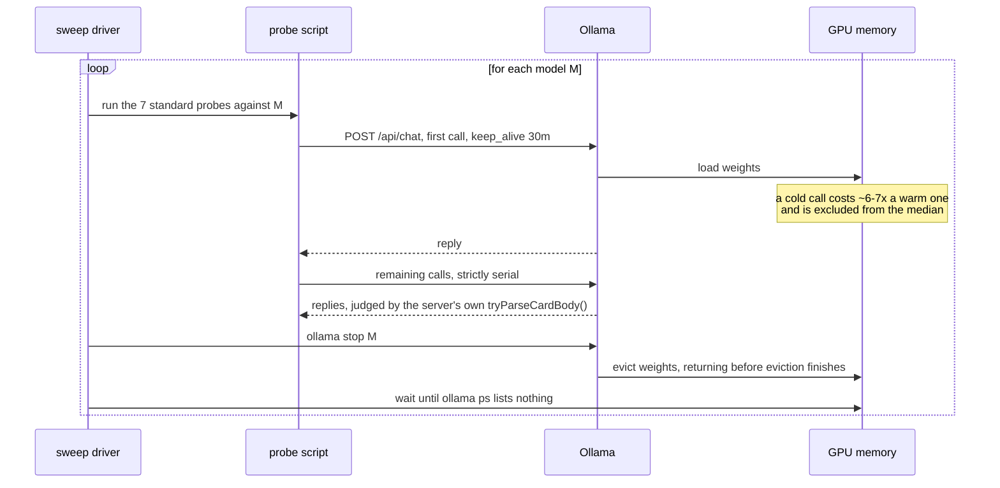
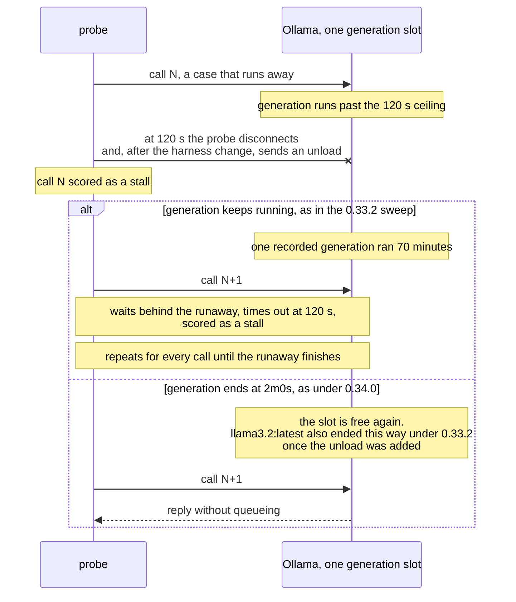
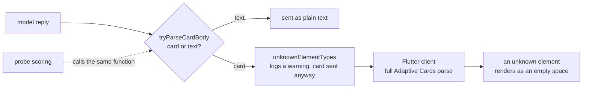

# Eight measurement rules from a local-model benchmark on Ollama

In
[`freemansoft/Flutter-AdaptiveCards`](https://github.com/freemansoft/Flutter-AdaptiveCards)
a demonstration Flutter client sends questions to a Dart chat server. The
server passes each one to a local Ollama model and asks for the answer as
Adaptive Card JSON. The client renders the card that comes back. To measure
which models manage that, a directory of probes sends a fixed set of questions
straight to Ollama, one model at a time. Each probe builds its requests the way
the chat server does and judges every reply with the server's own card
detector.

Several of those results looked like something a model did when the cause
was the test setup: the machine, the Ollama runtime, the harness or the probe.
Each rule below is a check that stops one of those mistakes before reaching a
published number. Five of the eight rules come from a measurement that went
wrong. The other three guard against a known weakness in the setup: the
per-call time limit, the point in a long run where a model is measured, and
what the card detector cannot see.

The rules come first, grouped by when they apply. After them, one section per
rule describes the measurement behind it. One incident dates from Ollama
0.32.14. Every other figure was measured under Ollama 0.33.x or 0.34.0. Most
are from one Apple M1 Max / 64 GB host. Each figure traces to
[`ModelBehavior.md`](https://github.com/freemansoft/Flutter-AdaptiveCards/blob/main/adaptive_chat_server_dart/ModelBehavior.md),
the lab notebook in that repository.

## Terms used in this article

The article uses these words with a specific meaning. Probe and flag names are
the repository's own.

| Term                             | What it means here                                                                                                                                                                                                                                       |
| -------------------------------- | -------------------------------------------------------------------------------------------------------------------------------------------------------------------------------------------------------------------------------------------------------- |
| **Sweep**                        | One run of the seven standard probes against one model, driven by `sweep.sh`. A full sweep of every model runs them one model after another.                                                                                                             |
| **Probe**                        | One script that sends a fixed set of questions to one model and scores each reply. The seven standard probes are a `format` check, a tool-calling check, an everyday set, a stress set, the seeded and unaided shape runs, and the follow-up-edit probe. |
| **Shape set**, `n/25`            | The 25 questions of `shape_ab.dart`, each paired with the Adaptive Card element types that would answer it. A case passes when the reply uses one of them.                                                                                               |
| **`--samples 2`**                | Every case runs twice and passes only if both runs pass. The noise floor on an `n/25` score is ±1 case.                                                                                                                                                  |
| **Cold start**, **with history** | The question asked first, or asked after two ordinary prose turns replayed the way the chat server sends history.                                                                                                                                        |
| **Seeded**, **unaided**          | Seeded runs put a short synthetic card exchange ahead of the history, as the chat server does. Unaided runs leave it out. Shape figures are seeded unless stated otherwise.                                                                              |
| **Follow-up-edit probe**         | `cascade_ab.dart`: turn 1 asks for a pick-one list, turn 2 asks to make it multi-select without restating the items. Scored out of 3 cases.                                                                                                              |
| **Stall**                        | A call that overruns the probe's per-call ceiling (`--timeout`, 120 s for the shape and follow-up-edit probes in every sweep here) and scores as a failure.                                                                                              |
| **Runner**                       | The Ollama process that holds one model's weights in memory and generates for it.                                                                                                                                                                        |
| **Harness**                      | The probe scripts and the sweep driver: everything between the model and a recorded figure except Ollama itself.                                                                                                                                         |
| **Queue cascade**                | One abandoned generation that keeps running on the server, so every later call waits behind it and records its own stall.                                                                                                                                |

## Eight rules, grouped by when they apply

Run these eight checks before trusting a local-model measurement on Ollama.
They are grouped by the point in a benchmark where each applies. The third
column says what goes wrong when the check is skipped. The last column names
the section below that holds the measurement.

| When                              | Rule                                                                                             | What goes wrong without it                                       | Evidence below                                                                               |
| --------------------------------- | ------------------------------------------------------------------------------------------------ | ---------------------------------------------------------------- | -------------------------------------------------------------------------------------------- |
| Before a sweep                    | Keep one model resident, and wait for the last one to finish evicting                            | a busy machine's stalls read as a slow model                     | `granite4.1:3b` recorded 52 stalls under Ollama 0.32.14 while another runner was evicting    |
| Before a sweep                    | Anchor the per-call ceiling to what a user would wait for                                        | a raised ceiling turns fast failures into hour-long ones         | The two calls a long ceiling captured still ended in invalid JSON                            |
| Reading results                   | Separate queued calls from slow ones before trusting a stall count                               | one runaway generation is recorded as dozens of stalls           | One runaway generation was recorded as many stalls under Ollama 0.33.2                       |
| Reading results                   | Control sweep position before reading one row's ratio as the effect under test                   | position alone moves a median further than most host differences | Sweep position moved one median by 1.54x                                                     |
| Reading results                   | Check `prompt_eval_count` for silent truncation before reading any token-level number            | a truncated prompt reads as a broken cache                       | An oversized system prompt is cut short without a warning                                    |
| After a harness or runtime change | Run a corrective change on every affected row, and confirm in the server log that it took effect | a fix that worked for one model is assumed to work for all       | One model's stalls cleared after the unload was added, under Ollama 0.33.2                   |
| After a harness or runtime change | List every input that changed before crediting a result to the runtime                           | a prompt edit is read as a runtime fix                           | A runaway cost `granite4.1:3b` one stall, not a cascade, under Ollama 0.34.0                 |
| When reporting                    | Judge with the detector you ship, and state beside the scores what it cannot see                 | an invented element type would score as a card                   | The probes score with the chat server's card detector, which checks shape and not vocabulary |

## `granite4.1:3b` recorded 52 stalls under Ollama 0.32.14 while another runner was evicting

_Evidence for: keep one model resident, and wait for the last one to finish
evicting._

On 2026-08-20, under Ollama 0.32.14, a sweep on the M1 Max recorded **52
stalls** for `granite4.1:3b`. The previous model's runner had not finished
evicting. It sat at 168% CPU reporting `Stopping...` while this model's probes
ran. The comparison below sets that run beside a re-run on an idle machine.
The gap between the columns is what the busy machine cost.

| `granite4.1:3b`, M1 Max, Ollama 0.32.14 | previous runner still evicting | idle machine              |
| --------------------------------------- | ------------------------------ | ------------------------- |
| stalls, whole sweep                     | 52                             | 13 (2 seeded, 11 unaided) |
| shape set, seeded, with history         | 12/25                          | **17/25**                 |
| follow-up-edit probe                    | `n/a`                          | **3/3**                   |
| whole sweep                             | 124 min                        | **33.9 min**              |

The idle-machine run reproduced the model's earlier figures. From the probe's
side a stall looks the same either way: the reply takes longer. The notebook's
[sweep section](https://github.com/freemansoft/Flutter-AdaptiveCards/blob/main/adaptive_chat_server_dart/ModelBehavior.md#the-sweep-and-why-the-unload-step-matters)
has the full account.

[`sweep.sh`](https://github.com/freemansoft/Flutter-AdaptiveCards/blob/main/adaptive_chat_server_dart/tool/model_probes/sweep.sh)
now waits for eviction. It runs the seven standard probes against one model,
then unloads it. Probes send `keep_alive: 30m`, so a finished model stays
resident until something evicts it, and `ollama stop` returns while eviction
is still under way. The driver therefore polls `ollama ps` until nothing is
listed before the next model starts.

The wait is the step the 2026-08-20 sweep lacked. A shape probe started during
the eviction window measured 3171 ms per call. The same probe, model and 25
cases measured 1324 ms on a quiet machine. A model sitting idle in memory did
not have that effect. Across 3,555 calls the slow-but-successful rate was 5.0%
with the previous model unloaded and 5.1% without, so only the stall counts
moved.

## One runaway generation was recorded as many stalls under Ollama 0.33.2

_Evidence for: separate queued calls from slow ones._

On 2026-09-01 the wait was in place. A full sweep on the M1 Max under Ollama
0.33.2 still recorded 52 stalls for `granite4.1:3b`, and **31** for
`llama3.2:latest`. Both are small models, 2.0 GB and 1.9 GB. `granite4.1:3b`'s
sweep took 123.5 minutes, against 10.2 for `qwen3-coder:30b` at eight times
the weight. Ollama logged one loaded runner on all 48 model loads that day. A
busy machine cannot explain these counts.

`OLLAMA_NUM_PARALLEL=1` gives this host one generation slot. When a call
overruns the ceiling, the probe abandons the connection. In the 0.33.2 sweep
the server log shows the generation kept running anyway. Every later call
queues behind it and records its own stall. The count then measures how long
the runaway ran, divided by 120 s. One hour-long runaway costs about thirty
stalls.

The diagram follows one runaway call and the call after it. The two branches
are the two outcomes the recorded runs show. Which one happens decides whether
a runaway costs one stall or dozens.

A stall count caused by one runaway generation looks different from one caused
by a model that is slow on each call. The checks below tell them apart. The
queue-cascade column is what the 0.33.2 runs showed. The slow-model column is
the pattern expected, and none of these runs produced it.

| Check                    | Queue cascade, as recorded                          | Slow model, as expected              |
| ------------------------ | --------------------------------------------------- | ------------------------------------ |
| stall position           | contiguous blocks that cross probe boundaries       | scattered through the run            |
| server log               | 27 requests completing within 37 s                  | each request ends near its own start |
| start times              | 120 s apart, durations descending in 2-minute steps | no pattern                           |
| the same sweep, repeated | the same calls stall, index for index               | the count varies                     |
| a long ceiling           | most stalls vanish                                  | the same calls stay slow             |

The server-log readings, including the runner count, were recorded at the
time. Those logs have since rotated. `granite4.1:3b`'s 52 stalls fall in two
blocks. The first is 35 stalls, from the end of the seeded probe into the
start of the unaided one. The second is 17, from the end of the unaided probe
through the follow-up-edit probe. A generation the server log timed at 70
minutes accounts for the first block at 120 s a stall. The second block's
generation was not timed.

A one-off re-run of `llama3.2:latest` with `--timeout 7200` resolved **31**
recorded stalls into **2** slow calls. Both were the same case, at 64.4 and
62.1 minutes, and both ended in invalid JSON. The unaided shape run's 19
stalls resolved to zero. The August count of 52 could have been a cascade too.
Those server logs are gone, so which cause produced it is not recoverable. The
notebook's
[cascade section](https://github.com/freemansoft/Flutter-AdaptiveCards/blob/main/adaptive_chat_server_dart/ModelBehavior.md#stalls-are-a-queueing-cascade-not-a-runtime-difference)
holds the full record for this section and the next two.

## One model's stalls cleared after the unload was added, under Ollama 0.33.2

_Evidence for: confirm in the server log that a harness change took effect._

The harness was then changed to send an unload (`keep_alive: 0`) the moment a
call times out, instead of only abandoning the connection. The unload was meant
to end the runaway generation, so the next call would load the model fresh and
run instead of waiting behind it. The notebook labels the runs **before runner
eviction** and **after runner eviction**. Ollama 0.33.2, the weights, the
prompt and seed digests, and the M1 Max stayed constant.

The comparison below tests whether that change stops a runaway from turning
into many stalls. It measures the two affected models without the unload and
again with it. One model's stalls fall and the other's do not.

| M1 Max, Ollama 0.33.2, before → after | `llama3.2:latest` | `granite4.1:3b` |
| ------------------------------------- | ----------------- | --------------- |
| seeded stalls                         | 12 → 2            | 14 → 14         |
| seeded shape probe, wall clock        | 26.2 → 6.5 min    | 30.1 → 30.0 min |
| seeded shape score, cold start        | 15/25 → 15/25     | 17/25 → 17/25   |
| seeded shape score, with history      | 12/25 → 15/25     | 12/25 → 12/25   |
| unaided stalls                        | 19 → 0            | 32 → 32         |
| follow-up-edit stalls                 | 0 → 0             | 6 → 6           |

`llama3.2:latest` lost almost all of its stalls, and its with-history score
rose from 12/25 to 15/25. `granite4.1:3b` does not move at all. Its two runs
stall on the same 52 calls, index for index:

- calls 86 to 99 of the seeded probe;
- calls 0 to 20 and 89 to 99 of the unaided probe;
- all 6 calls of the follow-up-edit probe.

In the run after eviction, the first call after call 20 took 86 seconds. That
is a queued call draining, not a model load. An eviction that never took
effect would leave the run unchanged in the same way.

The observations below are everything recorded about what an unload does to a
generation that is already running. No row shows an unload canceling a
generation on its own. Row four is ambiguous.

| Unload evidence                                             | What the log shows                                                                            |
| ----------------------------------------------------------- | --------------------------------------------------------------------------------------------- |
| 0.33.2: `keep_alive: 0` sent 3 s into an 18 s generation    | ran to 20.9 s                                                                                 |
| 0.33.2: the same test with `ollama stop`                    | ran to 16.3 s                                                                                 |
| 0.33.2: 53 unloads during the `granite4.1:3b` run           | answered in about 8 ms each; one generation ran 70 minutes with calls queued behind it        |
| 0.33.2: 2 stalls during the `llama3.2:latest` run           | ended server-side at 2m0s, each in the same second as an unload                               |
| 0.34.0: `keep_alive: 0` sent 3 s into an 18 s generation    | ran to 20.5 s and 19.6 s, all 1150 tokens                                                     |
| 0.34.0: the same test with `ollama stop`                    | ran to 20.1 s and 20.0 s, all 1150 tokens                                                     |
| 0.34.0: client disconnect 3 s into the same generation      | ended at 3.0 s with a 500, both times                                                         |
| 0.34.0: a two-token request sent 3 s into a live generation | waited 13.9 s; on an idle server it returns in 0.1 s                                          |
| 0.34.0: the same request sent right after a disconnect      | returned in 0.1 s, both times                                                                 |
| 0.34.0: 2 runaways during a `granite4.1:3b` run             | ended server-side at 2m0s with a 500, in the same second as the probe's disconnect and unload |

In row four the probe drops its connection and sends the unload in the same
second, so either could have ended those two calls. The 0.34.0 rows repeat the
direct test twice each. The target is a fixed 1150-token generation that runs
18.4 s and 17.2 s undisturbed. Neither unload shortens it. A client disconnect
does end it: the last two rows show the generation slot is free again at once.
The last row is the probe's own disconnect doing the same during a sweep,
which the next section describes. The generations the 0.33.2 sweep abandoned
kept running after the probe disconnected. Why they did is still unexplained.

## A runaway cost `granite4.1:3b` one stall, not a cascade, under Ollama 0.34.0

_Evidence for: list every input that changed before crediting a result to the
runtime._

On 2026-09-18 the sweep driver re-ran `granite4.1:3b` on the M1 Max under
Ollama 0.34.0 and recorded no stall. Two inputs had changed since the 0.33.2
run: the runtime, and the card system prompt, which gained an `Input.Rating`
element on 2026-09-07. A second 0.34.0 run sent the old prompt, so only the
runtime differs from the 0.33.2 column. The three columns below separate the
two changes. They cover the two shape probes, which is where 46 of the 52
stalls fell.

| `granite4.1:3b`, M1 Max, shape probes | 0.33.2, old prompt | 0.34.0, old prompt | 0.34.0, new prompt |
| ------------------------------------- | ------------------ | ------------------ | ------------------ |
| stalls, seeded / unaided              | 14 / 32            | **1 / 1**          | **0 / 0**          |
| seeded, cold / with history           | 17/25, 12/25       | 17/25, 17/25       | 17/25, 15/25       |
| unaided, cold / with history          | 7/25, 9/25         | 11/25, 12/25       | 10/25, 12/25       |
| wall clock, seeded / unaided          | 30.0 / 67.7 min    | 5.5 / 5.1 min      | 2.7 / 3.3 min      |

The old prompt still produces a runaway under 0.34.0, on the same cases as
before. They are `table` in the seeded probe and `facts` in the unaided one.
Each runaway now costs one stall. The server log shows both requests ending at
2m0s with a 500, in the same second the probe disconnected and sent its
unload. The next calls took 13.5 s and 9.9 s, so nothing queued. The new
prompt produces no runaway on either case, and the longest of its 200 calls
took 9.2 s.

Each change removed a different part of the 52 stalls. The runtime change
stopped one runaway from becoming a cascade, and the prompt edit removed the
runaway. Reading the first 0.34.0 run alone would have credited both to the
runtime. Which change inside 0.34.0 lets a disconnect end the generation is
not identified.

A clean run of this model exists on a second host, an Apple M5 / 16 GB under
Ollama 0.33.1. With the old prompt, the 0.34.0 scores match it on all four
figures. The new prompt's seeded with-history score is 15/25, two below that
and past the ±1 noise floor. In the full new-prompt sweep the follow-up-edit
probe scored 2/3, where the M5 scored 3/3. Its one miss answered turn 1 with
an `Input.Rating`, the element the prompt edit added. The whole sweep took 8
minutes, against 124 under 0.33.2.

## The two calls a long ceiling captured still ended in invalid JSON

_Evidence for: anchor the ceiling to what a user would wait for._

Probes bound each call with `--timeout`, which defaults to 180 s. Every sweep
here used 120 s for the shape and follow-up-edit probes. The notebook treats a
reply that takes more than about a minute as unusable, so 120 s is already
twice that. The slowest model on the M1 Max under 0.33.2, `gpt-oss:20b`,
medians 7.2 s per call.

The one-off `--timeout 7200` run is how the two hour-long calls were found,
and it stays a diagnostic. Adopting a long ceiling for every sweep would not
help. Both long calls still ended in invalid JSON, so the longer wait
recovered no card. It would turn each fast failure into a slow one.

## Sweep position moved one median by 1.54x

_Evidence for: control sweep position._

Every row of a serial sweep is measured at a different point in it. A control
on the M1 Max under Ollama 0.33.2 re-ran `qwen3.5:9b` at two positions. Cold,
at position 0 after 29 minutes idle, it medians **4924 ms**. Hot, seven
seconds after an eight-hour sweep, it medians **7563 ms**. That is a **1.54x**
spread from sweep position alone.

Both hosts were measured on 0.33.x. Their medians differ by 1.15x to 1.44x on
seven of the eight models they share. The eighth, `llama3-chatqa:8b`, reads
2.32x on medians of 107 ms and 248 ms. Position moved `qwen3.5:9b` by more
than any of the seven. A single row's host ratio can therefore report where
the model sat in its sweep rather than which host ran it.

The size of the effect is not settled. Two position controls on the M5
disagree. `granite4.1:8b` ran 1.20x slower right after a sweep.
`qwen2.5-coder:7b` measured 1.03x after 31 minutes idle, slightly slower cold.
The notebook's
[performance section](https://github.com/freemansoft/Flutter-AdaptiveCards/blob/main/adaptive_chat_server_dart/ModelBehavior.md#performance-by-host-and-runtime)
has all three controls.

## An oversized system prompt is cut short without a warning

_Evidence for: check `prompt_eval_count` for silent truncation._

Ollama 0.33.3 reports `prompt_eval_cached_count`, the number of prompt tokens
the runner served from its prefix cache. The first probe built on it reported
near-zero reuse on calls that should have shared a long prefix. The probe's
system prompt tokenized to roughly 15k against an 8,192-token `num_ctx`.
Ollama cut it to half the window plus the template header, with no error. That
is consistent with each turn evaluating a different slice of the prompt, which
would leave the cache nothing to match.

The sign was `prompt_eval_count` sitting at **4,098 on every turn** of a
growing conversation. Oversized history behaves differently: the notebook
records a history message that does not fit being dropped whole. Both show up
only in `prompt_eval_count`. Sized to fit, the same probe produced the
readings that the prompt-cache article in this series reports. The chat
server's overflow check now warns at request time, confirmed against a live
server.

## The probes score with the chat server's card detector, which checks shape and not vocabulary

_Evidence for: judge with the detector you ship, and say what it cannot see._

The chat server decides whether a model's reply is a card or plain text with
one function, `tryParseCardBody`. The probes import and call the same function,
so a card that passes a probe is a card the server would send as a card. A
separate test copy could drift and report pass rates the server disagrees
with.

The diagram shows the three checks a model's reply meets on its way to the
user, in order, and where the probes attach. Only the first changes where a
reply goes. The second logs a warning, and the third renders what it cannot
use as a blank. The diagram shows the chat server's default path, with no
`format` constraint.

The detector's job is only to decide card or text. It checks that a reply has
the shape of a card, not that its element types exist or that each element
has its required fields. So `{"type": "Bogus.Element"}` and an
`Input.ChoiceSet` with no `choices` both score as cards. The Flutter client
does the full Adaptive Cards parse, and renders an unknown element as an empty
space.

A second server check, `unknownElementTypes`, compares each element type
against the shipped `card_schema.json` and logs a warning. Since 2026-09-16
the shape probes record its result on every call, but no score counts it. The
0.34.0 `granite4.1:3b` runs are the only ones in this article that carry it:
250 replies parsed as cards, and none used an unknown type.

The repository is
[https://github.com/freemansoft/Flutter-AdaptiveCards](https://github.com/freemansoft/Flutter-AdaptiveCards),
and the lab notebook every figure above comes from is at
[https://github.com/freemansoft/Flutter-AdaptiveCards/blob/main/adaptive_chat_server_dart/ModelBehavior.md](https://github.com/freemansoft/Flutter-AdaptiveCards/blob/main/adaptive_chat_server_dart/ModelBehavior.md).
