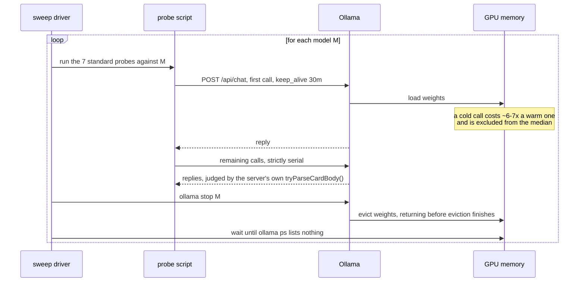
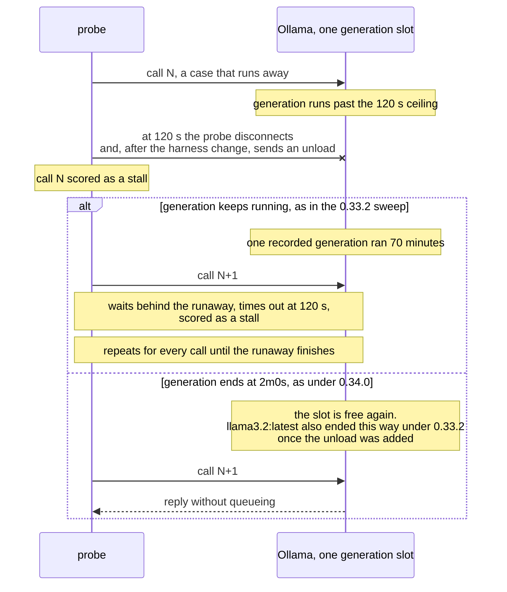
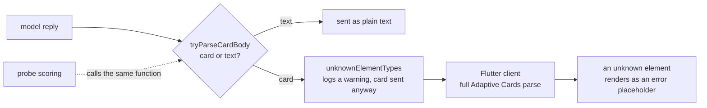

# Eight measurement rules from a local-model benchmark on Ollama

In
[`freemansoft/Flutter-AdaptiveCards`](https://github.com/freemansoft/Flutter-AdaptiveCards)
a demonstration Flutter client sends questions to a Dart chat server. The
server passes each one to a local Ollama model and asks for the answer as
Adaptive Card JSON. The client renders the card that comes back. To measure
which models manage that, a directory of probes sends a fixed set of questions
straight to Ollama, one model at a time. Each probe builds its requests the way
the chat server does and judges every reply with the server's own card
detector.

The test setup caused several of those results: the machine, the Ollama
runtime, the harness or the probe. Each looked like something a model did.
Each rule below is a check that stops one of those mistakes before reaching a
published number. Five of the eight rules come from a measurement that went
wrong. The other three guard against known weaknesses in the setup. Those are the
per-call time limit, where in a long run a model is measured, and what the
card detector cannot see.

The rules come first, grouped by when they apply. After them, one section per
rule describes the measurement behind it. One incident dates from Ollama
0.32.14. The rest were measured under 0.33.x, 0.34.0 or 0.35.1. Four rules
now rest on 0.35.1 figures from an Apple M5 / 16 GB. The others come from an
Apple M1 Max / 64 GB. Each figure traces to
[`ModelBehavior.md`](https://github.com/freemansoft/Flutter-AdaptiveCards/blob/main/adaptive_chat_server_dart/ModelBehavior.md),
the lab notebook in that repository.

## Terms used in this article

Show the terms

The article uses these words with a specific meaning. Probe and flag names are
the repository's own.

| Term                             | What it means here                                                                                                                                                                                                                                       |
| -------------------------------- | -------------------------------------------------------------------------------------------------------------------------------------------------------------------------------------------------------------------------------------------------------- |
| **Sweep**                        | One run of the seven standard probes against one model, driven by `sweep.sh`. A full sweep of every model runs them one model after another.                                                                                                             |
| **Probe**                        | One script that sends a fixed set of questions to one model and scores each reply. The seven standard probes are a `format` check, a tool-calling check, an everyday set, a stress set, the seeded and unaided shape runs, and the follow-up-edit probe. |
| **Shape set**, `n/25`            | The 25 questions of `shape_ab.dart`, each paired with the Adaptive Card element types that would answer it. A case passes when the reply uses one of them.                                                                                               |
| **`--samples 2`**                | Every case runs twice and passes only if both runs pass. Three repeat runs of one model moved no case at all, so the ±1 noise floor assumed below is a loose upper bound.                                                                                |
| **Cold start**, **with history** | The question asked first, or asked after two ordinary prose turns replayed the way the chat server sends history.                                                                                                                                        |
| **Seeded**, **unaided**          | Seeded runs put a short synthetic card exchange ahead of the history, as the chat server does. Unaided runs leave it out. Shape figures are seeded unless stated otherwise.                                                                              |
| **Follow-up-edit probe**         | `cascade_ab.dart`: turn 1 asks for a pick-one list, turn 2 asks to make it multi-select without restating the items. Scored out of 3 cases.                                                                                                              |
| **Stall**                        | A call that overruns the probe's per-call ceiling (`--timeout`, 120 s for the shape and follow-up-edit probes in every sweep here) and scores as a failure.                                                                                              |
| **Runner**                       | The Ollama process that holds one model's weights in memory and generates for it.                                                                                                                                                                        |
| **Harness**                      | The probe scripts and the sweep driver: everything between the model and a recorded figure except Ollama itself.                                                                                                                                         |
| **Queue cascade**                | One abandoned generation that keeps running on the server, so every later call waits behind it and records its own stall.                                                                                                                                |

## Eight rules, grouped by when they apply

Run these eight checks before trusting a local-model measurement on Ollama.
They are grouped by the point in a benchmark where each applies. The third
column says what goes wrong when the check is skipped. The last column names
the section below that holds the measurement.

| When                              | Rule                                                                                                 | What goes wrong without it                                       | Evidence below                                                                               |
| --------------------------------- | ---------------------------------------------------------------------------------------------------- | ---------------------------------------------------------------- | -------------------------------------------------------------------------------------------- |
| Before a sweep                    | Keep one model resident, and wait for the last one to finish evicting                                | a busy machine's stalls read as a slow model                     | `granite4.1:3b` recorded 52 stalls under Ollama 0.32.14 while another runner was evicting    |
| Before a sweep                    | Anchor the per-call ceiling to what a user would wait for                                            | a raised ceiling turns fast failures into hour-long ones         | The two calls a long ceiling captured still ended in invalid JSON                            |
| Reading results                   | Before blaming the model for a stall count, check whether one runaway call queued the rest behind it | one runaway generation is recorded as dozens of stalls           | One runaway generation was recorded as many stalls under Ollama 0.33.2                       |
| Reading results                   | Before comparing one model's speed across hosts, measure it at the same point in each sweep          | position alone moves a median further than most host differences | Sweep position moved a median 1.29x and moved no shape score                                 |
| Reading results                   | Check `prompt_eval_count` for silent truncation before reading any token-level number                | a truncated prompt reads as a broken cache                       | An oversized system prompt is cut to half the window, with no warning                        |
| After a harness or runtime change | Run a corrective change on every affected row, and confirm in the server log that it took effect     | a fix that worked for one model is assumed to work for all       | One model's stalls cleared after the unload was added, under Ollama 0.33.2                   |
| After a harness or runtime change | List every input that changed before crediting a result to the runtime                               | a prompt edit is read as a runtime fix                           | A runtime upgrade would have been credited with a prompt edit's fix                          |
| When reporting                    | Judge with the detector you ship, and state beside the scores what it cannot see                     | an invented element type would score as a card                   | The probes score with the chat server's card detector, which checks shape and not vocabulary |

## The measurements behind each rule

Each section below holds the measurement behind one rule. The first four
follow the stall incidents in the order they happened. The other four take the
remaining rules.

### `granite4.1:3b` recorded 52 stalls under Ollama 0.32.14 while another runner was evicting

_Evidence for: keep one model resident, and wait for the last one to finish
evicting._

A sweep on the M1 Max recorded **52 stalls** for `granite4.1:3b` on 2026-08-20,
under Ollama 0.32.14. The previous model's runner had not finished
evicting. It sat at 168% CPU reporting `Stopping...` while this model's probes
ran. The comparison below sets that run beside a re-run on an idle machine.
The gap between the columns measures what the busy machine cost.

| `granite4.1:3b`, M1 Max, Ollama 0.32.14 | previous runner still evicting | idle machine              |
| --------------------------------------- | ------------------------------ | ------------------------- |
| stalls, whole sweep                     | 52                             | 13 (2 seeded, 11 unaided) |
| shape set, seeded, with history         | 12/25                          | **17/25**                 |
| follow-up-edit probe                    | `n/a`                          | **3/3**                   |
| whole sweep                             | 124 min                        | **33.9 min**              |

The idle-machine run reproduced the model's earlier figures. The notebook's
[sweep section](https://github.com/freemansoft/Flutter-AdaptiveCards/blob/main/adaptive_chat_server_dart/ModelBehavior.md#the-sweep-and-why-the-unload-step-matters)
has the full account.

[`sweep.sh`](https://github.com/freemansoft/Flutter-AdaptiveCards/blob/main/adaptive_chat_server_dart/tool/model_probes/sweep.sh)
now waits for eviction. `ollama stop` returns while eviction is still under
way, so the driver polls until nothing is resident before the next model
starts.

```mermaid
sequenceDiagram
  participant D as sweep driver
  participant P as probe script
  participant O as Ollama
  participant V as GPU memory

  loop for each model M
    D->>P: run the 7 standard probes against M
    P->>O: POST /api/chat, first call, keep_alive 30m
    O->>V: load weights
    Note over V: a cold call costs ~6-7x a warm one<br/>and is excluded from the median
    O-->>P: reply
    P->>O: remaining calls, strictly serial
    O-->>P: replies, judged by the server's own tryParseCardBody()
    D->>O: ollama stop M
    O->>V: evict weights, returning before eviction finishes
    D->>V: wait until ollama ps lists nothing
  end
```

A probe started during the eviction window measured 3171 ms per call, against
1324 ms on a quiet machine. The slow-but-successful rate across 3,555 calls
moved only from 5.0% to 5.1%, so only the stall counts changed.

### One runaway generation was recorded as many stalls under Ollama 0.33.2

_Evidence for: before blaming the model for a stall count, check whether one
runaway call queued the rest behind it._

The wait was in place by 2026-09-01. A full sweep on the M1 Max under Ollama
0.33.2 still recorded 52 stalls for `granite4.1:3b`, and **31** for
`llama3.2:latest`. Ollama logged one loaded runner on all 48 model loads that day. A
busy machine cannot explain these counts.

`OLLAMA_NUM_PARALLEL=1` gives this host one generation slot. When a call
overruns the ceiling, the probe abandons the connection. In the 0.33.2 sweep
the server log shows the generation kept running anyway. Every later call
queues behind it and records its own stall. The count then measures how long
the runaway ran, divided by 120 s. One hour-long runaway costs about thirty
stalls.

The two branches are the two outcomes the recorded runs show.

```mermaid
sequenceDiagram
  participant P as probe
  participant O as Ollama, one generation slot

  P->>O: call N, a case that runs away
  Note over O: generation runs past the 120 s ceiling
  P-xO: at 120 s the probe disconnects<br/>and, after the harness change, sends an unload
  Note over P: call N scored as a stall
  alt generation keeps running, as in the 0.33.2 sweep
    Note over O: one recorded generation ran 70 minutes
    P->>O: call N+1
    Note over P,O: waits behind the runaway, times out at 120 s,<br/>scored as a stall
    Note over P,O: repeats for every call until the runaway finishes
  else generation ends at 2m0s, as under 0.34.0
    Note over O: the slot is free again.<br/>llama3.2:latest also ended this way under 0.33.2<br/>once the unload was added
    P->>O: call N+1
    O-->>P: reply without queueing
  end
```

One runaway generation leaves a different trace than a model slow on every
call. None of these runs produced the right-hand pattern.

| Check                    | Queue cascade, as recorded                          | Slow model, as expected              |
| ------------------------ | --------------------------------------------------- | ------------------------------------ |
| stall position           | contiguous blocks that cross probe boundaries       | scattered through the run            |
| server log               | 27 requests completing within 37 s                  | each request ends near its own start |
| start times              | 120 s apart, durations descending in 2-minute steps | no pattern                           |
| the same sweep, repeated | the same calls stall, index for index               | the count varies                     |
| a long ceiling           | most stalls vanish                                  | the same calls stay slow             |

`granite4.1:3b`'s 52 stalls fall in two blocks of 35 and 17, each crossing a
probe boundary. A generation the server log timed at 70 minutes accounts for
the first at 120 s a stall.

What becomes of an abandoned request is measurable on a later sweep whose log
survives. Ollama records a duration per request. Summing a model's durations and
dividing by the wall clock of its window counts how many were open at once. A
probe sending one call at a time, against a server configured for one
generation, should sit at or below 1.

| Model's window in one sweep | Summed duration | Wall clock | Open at once |
| --------------------------- | --------------- | ---------- | ------------ |
| `granite4.1:8b`             | 36.4 min        | 46.5 min   | 0.78x        |
| `qwen2.5-coder:7b`          | 31.2 min        | 41.4 min   | 0.75x        |
| `qwen3.5:9b`                | 35.6 min        | 45.7 min   | 0.78x        |
| `llama3.2:latest`           | 901.8 min       | 125.0 min  | **7.21x**    |
| `granite4.1:3b`             | 2379.6 min      | 320.9 min  | **7.41x**    |

Three models sit at 0.75x to 0.78x. Their summed duration lands within a few
percent of what each probe recorded for itself, which validates the method. Those two sit above 7x. Ollama held about seven requests open at once while
the probe sent them one at a time. A request the probe abandons is retained,
and they accumulate. That is the queue a stall count sits on top of, and the
reason a count taken at the client cannot see it.

A one-off re-run of `llama3.2:latest` with `--timeout 7200` resolved **31**
recorded stalls into **2** slow calls. Both were the same case, at 64.4 and
62.1 minutes, and both ended in invalid JSON. The unaided shape run's 19
stalls resolved to zero. The
notebook's
[cascade section](https://github.com/freemansoft/Flutter-AdaptiveCards/blob/main/adaptive_chat_server_dart/ModelBehavior.md#stalls-are-a-queueing-cascade-not-a-runtime-difference)
holds the full record for this section and the next two.

### One model's stalls cleared after the unload was added, under Ollama 0.33.2

_Evidence for: run a corrective change on every affected row, and confirm in
the server log that it took effect._

The harness was then changed to send an unload (`keep_alive: 0`) the moment a
call times out, instead of only abandoning the connection. The next call would
then load the model fresh rather than wait behind the runaway. Ollama 0.33.2,
the weights, the prompt and seed digests, and the M1 Max stayed constant. The
notebook labels the two runs **before runner eviction** and **after runner
eviction**.

| M1 Max, Ollama 0.33.2, before → after | `llama3.2:latest` | `granite4.1:3b` |
| ------------------------------------- | ----------------- | --------------- |
| seeded stalls                         | 12 → 2            | 14 → 14         |
| seeded shape probe, wall clock        | 26.2 → 6.5 min    | 30.1 → 30.0 min |
| seeded shape score, cold start        | 15/25 → 15/25     | 17/25 → 17/25   |
| seeded shape score, with history      | 12/25 → 15/25     | 12/25 → 12/25   |
| unaided stalls                        | 19 → 0            | 32 → 32         |
| follow-up-edit stalls                 | 0 → 0             | 6 → 6           |

`llama3.2:latest` lost almost all of its stalls, and its with-history score
rose from 12/25 to 15/25. `granite4.1:3b` does not move at all. Its two runs
stall on the same 52 calls, index for index, across both shape probes and all
six follow-up-edit calls. In the run after eviction the first call after the
block took 86 seconds, which is a queued call draining rather than a model
load. The unload never took effect on that row.

Two of those calls ended in the same second as an unload, leaving the unload
and the probe's disconnect as equal candidates. The table separates the two
actions by ten seconds, so the server log attributes each termination to one of
them. Ollama 0.35.1, against a fixed 1,150-token generation that runs 16.7 s
undisturbed.

| Action, 3 s into the generation             | The generation                                                        | Slot free after |
| ------------------------------------------- | --------------------------------------------------------------------- | --------------- |
| nothing                                     | ran 16,687 ms, 858 tokens                                             | n/a             |
| probe disconnect, next call on a new client | threw at 3,007 ms; the server logged a 500 at 3.005 s                 | **59 ms**       |
| probe disconnect, next call on the same one | threw at 3,003 ms                                                     | **68 ms**       |
| unload, connection left open                | acknowledged in 2.19 ms, then **ran to 16,506 ms and all 858 tokens** | n/a             |
| disconnect, then unload ten seconds later   | threw at 3,004 ms; the unload reached a finished request              | **113 ms**      |

The disconnect ends the generation and frees the slot in under 70 ms, whichever
connection the next call uses. The unload does not: the server acknowledges it
in milliseconds and the generation finishes anyway. So the unload never ended
those two calls, and the sweep's abandoned generations kept running after the
probe disconnected. The section above measures what became of them.

### A runtime upgrade would have been credited with a prompt edit's fix

_Evidence for: list every input that changed before crediting a result to the
runtime._

The sweep driver re-ran `granite4.1:3b` on the M1 Max on 2026-09-18, under
Ollama 0.34.0, and recorded no stall. Two inputs had changed since the 0.33.2
run: the runtime, and the card system prompt, which gained an `Input.Rating`
element on 2026-09-07. A second 0.34.0 run sent the old prompt, so only the
runtime differs from the 0.33.2 column. The three columns below separate the
two changes. They cover the two shape probes, where 46 of the 52
stalls fell.

| `granite4.1:3b`, M1 Max, shape probes | 0.33.2, old prompt | 0.34.0, old prompt | 0.34.0, new prompt |
| ------------------------------------- | ------------------ | ------------------ | ------------------ |
| stalls, seeded / unaided              | 14 / 32            | **1 / 1**          | **0 / 0**          |
| seeded, cold / with history           | 17/25, 12/25       | 17/25, 17/25       | 17/25, 15/25       |
| unaided, cold / with history          | 7/25, 9/25         | 11/25, 12/25       | 10/25, 12/25       |
| wall clock, seeded / unaided          | 30.0 / 67.7 min    | 5.5 / 5.1 min      | 2.7 / 3.3 min      |

The old prompt still produces a runaway under 0.34.0, on the same cases as
before. They are `table` in the seeded probe and `facts` in the unaided one.
Each runaway now costs one stall. The server log shows both requests ending at
2m0s with a 500, in the same second the probe disconnected and sent its
unload. The next calls took 13.5 s and 9.9 s, so nothing queued. The new
prompt produces no runaway on either case, and the longest of its 200 calls
took 9.2 s.

Each change removed a different part of the 52 stalls on that host. The
runtime change stopped one runaway from becoming a cascade, and the prompt
edit removed the runaway. Reading the first 0.34.0 run alone would have
credited both to the runtime.

Neither half travels, which is the stronger form of the rule. On the M5 under
Ollama 0.35.1 this model recorded **56** stalls with the new prompt. That
sweep's log holds 37 requests queued for up to 115.8 minutes. So there the
prompt edit did not remove the runaway, and the later runtime did not stop a
cascade forming. The same sweep recorded **0** stalls for it on the M1 Max.
Across the four runs the count reads 52, 1, 0 and 56, following neither the
host nor the runtime.

A later run isolates the prompt edit on one host and one runtime. The old prompt scores 18/25 cold and 16/25 with history on the M5 under 0.35.1.
The new prompt scores 15/25 and 15/25, so the edit costs 3 cases cold and 1
with history.

### The two calls a long ceiling captured still ended in invalid JSON

_Evidence for: anchor the per-call ceiling to what a user would wait for._

Probes bound each call with `--timeout`, which defaults to 180 s. Every sweep
here used 120 s for the shape and follow-up-edit probes. The notebook treats a
reply that takes more than about a minute as unusable, so 120 s is already
twice that. The slowest of the eight models measured on that host medians 4.68 s per call.

The one-off `--timeout 7200` run found the two hour-long calls, and it stays
a diagnostic. Adopting a long ceiling for every sweep would not
help. Both long calls still ended in invalid JSON, so the longer wait
recovered no card. It would turn each fast failure into a slow one.

### Sweep position moved a median 1.29x and moved no shape score

_Evidence for: before comparing one model's speed across hosts, measure it at
the same point in each sweep._

Every row of a serial sweep is measured at a different point in it. A series on the M5
under Ollama 0.35.1 ran one model's shape probe three times back to back, with
no idle gap. Position was the only thing that changed. Free memory was read at
each start.

| `granite4.1:8b`, three runs | Free at start | Median  | Cold start | With history |
| --------------------------- | ------------- | ------- | ---------- | ------------ |
| position 0                  | 2.79 GB       | 3378 ms | 24/25      | 20/25        |
| position 1                  | 1.42 GB       | 3574 ms | 24/25      | 20/25        |
| position 2                  | 0.16 GB       | 4346 ms | 24/25      | 20/25        |

The median climbs **1.29x** and no score moves. Free memory falls across the
same three runs, and this series does not separate it from position. So the
effect is real on that host and at least as large as the **1.20x** an earlier
control reported.

The same eight models differ by 1.14x to 1.78x across hosts on one runtime.
Position moved this model by more than six of those eight. A single row's host
ratio can therefore report where the model sat in its sweep rather than which
host ran it.

The two figures want different error bars. Those three runs put the spread on
a shape score at **zero cases**, eroding the same four cases each time. A
median needs a position control; a score does not. The notebook's
[performance section](https://github.com/freemansoft/Flutter-AdaptiveCards/blob/main/adaptive_chat_server_dart/ModelBehavior.md#performance-by-host-and-runtime)
has every control.

### An oversized system prompt is cut to half the window, with no warning

_Evidence for: check `prompt_eval_count` for silent truncation before reading
any token-level number._

Ollama reports `prompt_eval_cached_count`, the number of prompt tokens the
runner served from its prefix cache. The first probe built on it reported
near-zero reuse on calls that should have shared a long prefix. Its system
prompt tokenized to roughly 15k against an 8,192-token `num_ctx`, and Ollama
cut it with no error.

How much it cuts is a formula. The table sends one 13,349-token prompt at four
window sizes, on Ollama 0.35.1. Every call answered HTTP 200.

| `num_ctx` requested | `prompt_eval_count` | `num_ctx / 2 + 2` |
| ------------------- | ------------------- | ----------------- |
| 4,096               | 2,050               | 2,050             |
| 8,192               | **4,098**           | 4,098             |
| 16,384              | 8,194               | 8,194             |
| 32,768              | 16,386              | 16,386            |

Half the window plus the template header, decided by the window rather than by
the prompt, with `prompt_eval_cached_count` at 0 throughout. Under a window it
fits, the same prompt reports its true 13,349. So the sign is a
`prompt_eval_count` that holds constant while the history grows. Oversized
history behaves differently: a message that does not fit is dropped whole.
Both show up only in `prompt_eval_count`.

The chat server now warns at request time. The warning estimates tokens as
characters divided by four, and checks the requested window rather than the
allocated one. It did not fire on the three history drops the notebook
measured.

### The probes score with the chat server's card detector, which checks shape and not vocabulary

_Evidence for: judge with the detector you ship, and state beside the scores
what it cannot see._

The chat server decides whether a model's reply is a card or plain text with
one function, `tryParseCardBody`. The probes import and call the same function,
so a card that passes a probe is a card the server would send as a card.

The diagram shows the three checks a reply meets on its way to the user, and
where the probes attach. It follows the chat server's default path, with no
`format` constraint. Only the first changes where a reply goes.

```mermaid
flowchart LR
  R[model reply] --> D{tryParseCardBody<br/>card or text?}
  D -- text --> T[sent as plain text]
  D -- card --> U[unknownElementTypes<br/>logs a warning, card sent anyway]
  U --> C[Flutter client<br/>full Adaptive Cards parse]
  C --> B[an unknown element<br/>renders as an error placeholder]
  P[probe scoring] -. calls the same function .-> D
```

The detector's job is only to decide card or text. It checks that a reply has
the shape of a card, not that its element types exist or that each element
has its required fields. So `{"type": "Bogus.Element"}` and an
`Input.ChoiceSet` with no `choices` both score as cards. The Flutter client
does the full Adaptive Cards parse, and renders an unknown element as an error
placeholder naming the type.

A second server check, `unknownElementTypes`, compares each element type
against the shipped `card_schema.json` and logs a warning. The shape probes
record its result on every call, and no score counts it. Across two hosts on
one runtime, **2,278** replies parsed as cards. Twelve used a type the schema
does not carry, all from one model: `Input.Paragraph` answering a text case,
`Chart.ProgressRing` answering a gauge case. The same twelve calls on both
hosts.

All twelve already counted as failures, on shape rather than vocabulary. Each
reply also lacked the element type its case wanted, so the shape criterion
caught them by coincidence. The blind spot is therefore narrower and worse
than it looks. A model inventing a type that sits in the set its case wanted
would still pass. Nothing here measures how often that happens.

The repository is
[https://github.com/freemansoft/Flutter-AdaptiveCards](https://github.com/freemansoft/Flutter-AdaptiveCards),
and the lab notebook every figure above comes from is at
[https://github.com/freemansoft/Flutter-AdaptiveCards/blob/main/adaptive_chat_server_dart/ModelBehavior.md](https://github.com/freemansoft/Flutter-AdaptiveCards/blob/main/adaptive_chat_server_dart/ModelBehavior.md).
