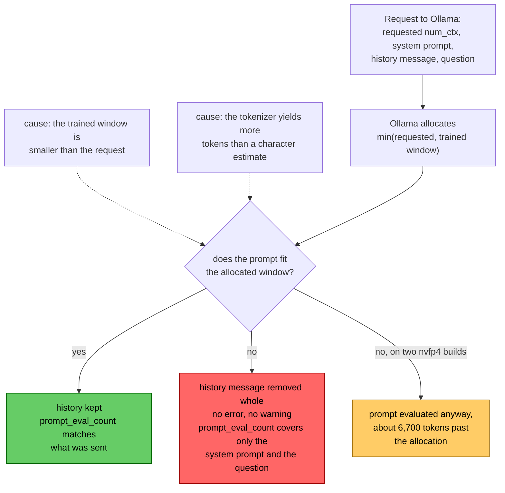

# Ollama drops an oversized history message whole, and nothing tells you

In [`freemansoft/Flutter-AdaptiveCards`](https://github.com/freemansoft/Flutter-AdaptiveCards) a demonstration Dart chat server hands a question to a local Ollama
model. It asks for the answer as Adaptive Card JSON, a strict,
closed-vocabulary schema that a Flutter client renders as interactive UI
rather than as text. A directory of probes measures which local models manage
that and how well. Every one of those probes had been asking its question into
a nearly empty context window. Each call carried a system prompt, one question, and at
most a short seed exchange. A real conversation fills the window. What changes when it is full?

Two findings came out of filling it, measured on an Apple M1 Max with 64 GB
and an Apple M5 with 16 GB. Both hosts ran Ollama 0.33.3, and the M1 Max
results reproduced under Ollama 0.34.0.

- **What the runner allocates follows one rule**, with no counterexample in
  fifty-one runs across the two Ollama versions. It is often not what the
  request asked for.
- **A history message larger than the window is removed, not trimmed.** The
  model gets none of it, and the failure is silent: no error and no warning.

Neither shows up in the reply. `ollama ps` shows the first, and comparing
`prompt_eval_count` with the size of what was sent shows the second.

Both are properties of the Ollama runtime, not of any model. What a full window does to
a model's own behavior is a separate question, and a companion article measures
it.

The diagram follows one request. Only one of the three outcomes happens to it.

Every figure comes from
[`ModelBehavior.md`](https://github.com/freemansoft/Flutter-AdaptiveCards/blob/main/adaptive_chat_server_dart/ModelBehavior.md),
the lab notebook in that repository.

## Terms used in this article

| Term                    | What it means here                                                                                                                                                                                                                                                               |
| ----------------------- | -------------------------------------------------------------------------------------------------------------------------------------------------------------------------------------------------------------------------------------------------------------------------------- |
| **`num_ctx`**           | The context window an Ollama request asks for, in tokens. It is a request, not a guarantee.                                                                                                                                                                                      |
| **Trained window**      | The context length a model was trained at, reported by `ollama show`. `llama3-chatqa:8b` is 8192; `qwen3.5:9b` is 262144.                                                                                                                                                        |
| **`prompt_eval_count`** | The token count Ollama reports for the prompt it evaluated. Compared with the size of what was sent, it shows what the model received, and this article turns on it.                                                                                                             |
| **Shape score**, `n/25` | 25 test cases, one question each, paired with the Adaptive Card element types that would answer it. Scored on one thing: did the reply use one of them? This is shape coverage, not accuracy, and a model can be correct in prose and score low. Figures here are `--samples 1`. |
| **Filler**              | A block of deterministic nonsense sent as one user message ahead of the question, followed by a one-word assistant reply, `Understood.`. The probe sizes it to a token target, so a run can ask what a model does with a window that is mostly used.                             |

## The allocated window is `min(requested, trained window)`

The probe asks Ollama for a window large enough to hold its filler plus the
card system prompt. It then reads Ollama's `/api/ps` to find out what the runner gave it. Every row below requested 35851 tokens. That is 28000 for the filler, an
estimated 3755 for the card system prompt, and a 4096-token margin for the
question and the reply.

| Model                     | Trained window | Allocated | Clamped |
| ------------------------- | -------------- | --------- | ------- |
| `llama3.2:latest`         | 131072         | 35851     | no      |
| `granite4.1:8b`           | 131072         | 35851     | no      |
| `granite4.1:3b`           | 131072         | 35851     | no      |
| `nemotron-3-nano:4b`      | 262144         | 35851     | no      |
| `qwen3.5:9b`              | 262144         | 35851     | no      |
| `qwen2.5-coder:7b`        | 32768          | **32768** | yes     |
| `llama3-groq-tool-use:8b` | 8192           | **8192**  | yes     |
| `llama3-chatqa:8b`        | 8192           | **8192**  | yes     |

Every clamp lands on that model's own trained window, none at an intermediate
value. No model received less than its window could hold. Thirty-one runs
across both hosts produced no counterexample under Ollama 0.33.3. That includes
six models too large for the 16 GB machine, measured on the M1 Max. They asked
for 35851 against windows of 131072 and above and received 35851.

Twenty more runs on the M1 Max under Ollama 0.34.0 follow the same rule. The
fourteen-model sweep repeated there, and every allocation, prompt token count
and score came back the same.

Host memory does not enter into it. The 16 GB M5 and the 64 GB M1 Max return
identical allocations for all eight models, the three clamps included. The M5 also allocated a full **65536**-token window on request for `qwen3.5:9b`,
so a clamp is not a memory ceiling in disguise.

The practical form of the rule: if you ask for more context than the model was
trained for, you silently get the trained window. Check `ollama ps` after the
first call to find out.

## A history message that does not fit is removed whole

The probe sent the same filler to every model and requested a 35851-token
window for each. The table shows what Ollama allocated and how many prompt
tokens each model then evaluated.

| Model                     | Allocated | Prompt tokens evaluated | History |
| ------------------------- | --------- | ----------------------- | ------- |
| `llama3.2:latest`         | 35851     | 29546                   | kept    |
| `granite4.1:8b`           | 35851     | 29536                   | kept    |
| `granite4.1:3b`           | 35851     | 29536                   | kept    |
| `nemotron-3-nano:4b`      | 35851     | **4374**                | dropped |
| `qwen3.5:9b`              | 35851     | **3965**                | dropped |
| `qwen2.5-coder:7b`        | 32768     | **3850**                | dropped |
| `llama3-groq-tool-use:8b` | 8192      | **3825**                | dropped |
| `llama3-chatqa:8b`        | 8192      | **3819**                | dropped |

A model that trimmed the history to fit would report a prompt count near its
window. The five droppers report between 3819 and 4374 tokens, which is the
system prompt and the question and nothing else. Ollama removed the history message in full.

For the three droppers with windows of 32768 and above, the message was larger
than the 28000 tokens the probe intended. The next section measures by how
much.

These eight are the models a 16 GB host can hold, and both hosts returned the
same outcome for each. The M1 Max also ran six larger models. Three of them,
`qwen3-coder:30b`, `nemotron-3-nano:30b` and `nemotron-3.5-lightning:30b`, also
dropped the filler, which makes eight droppers of fourteen models on that host.

The response carries no error and no warning. The reply reads as an ordinary
answer to a question asked with no history, which is what it is. In this probe
the history was one oversized message, so all of it went. Which turns Ollama
removes from a long conversation of many small messages is not something these
runs measured.

A system prompt that overflows behaves differently. Ollama cuts it short rather
than removing it, which the
[measurement-hygiene article](https://joe.blog.freemansoft.com/2026/09/eight-measurement-rules-from-local.html) in this series records at 4,098 evaluated
tokens against an 8,192-token window.

`prompt_eval_count` is the detection method, and it is cheap: it arrives on
every reply. A count far below the size of what was sent is the tell. Here that
was 4374 tokens reported for a prompt `nemotron-3-nano:4b` counts at 46287. A
count that stays flat while a conversation grows is a second sign.

## The same text is 4.30 characters per token on one model and 2.74 on another

Three of the five drops above look like they should not have happened. Two
models with an 8192 window could not have held the history under any policy.
The other three had windows of 32768 and above and discarded it anyway. The
notebook first recorded that as unexplained behavior. The cause is that the probe sized the filler in **characters**, against an
assumed 4.0 characters per token. That number is close for some tokenizers and a third too high for others.

A 28000-token target becomes 112,005 characters under that assumption. With the
card system prompt added, every model received the same 127,024 characters. The
table below divides that figure by the tokens each model reported evaluating.

| Model                      | Tokens for the same text | Characters per token |
| -------------------------- | ------------------------ | -------------------- |
| `llama3.2:latest`          | 29546                    | 4.30                 |
| `granite4.1:8b`            | 29536                    | 4.30                 |
| `gpt-oss:20b`              | 29616                    | 4.29                 |
| `qwen3.5:9b`               | 42540                    | 2.99                 |
| `qwen3.8:27b-nvfp4`        | 42542                    | 2.99                 |
| `qwen3.6:27b-coding-nvfp4` | 42538                    | 2.99                 |
| `nemotron-3-nano:4b`       | 46287                    | 2.74                 |

Three unrelated model families agree at about 4.30. Three Qwen builds render the
identical text 44% denser, and `nemotron-3-nano:4b` denser still. The filler
reads `filler-term123 means concept861.`, which is heavy on digits, and
tokenizers split digit strings differently.

Two rows need a note:

- **`qwen3.5:9b`** is measured on the M5, in a run that requested a
  65536-token window, large enough to hold the text.
- **`qwen2.5-coder:7b`** has no row at all. Its 32768-token trained window
  cannot hold the text under any request. A short calibration sample puts its
  tokenizer at 3.08 characters per token, which makes the text about 41,000
  tokens.

So wherever the 4.0 assumption under-counted, the probe sized a window too
small for its own filler. The prompt overflowed, Ollama dropped the message, and the
archive recorded a model discarding history it appeared to have room for. The control that settled it gave each model a filler that fits the window it
is allocated. All of them kept it. A later run under Ollama 0.34.0 gave the two
8192-window models a filler that fits as well, 2500 tokens, and both kept it
too. Across ten models, none dropped a message it had room for.

The chat server in this repository now checks for overflow on every reply, and
it estimates the tokens it sent at four characters each. For the 127,024-character prompt that estimate is about 31,750 tokens, under a 35851-token window, where
`nemotron-3-nano:4b` counts 46287. The check would not have fired on any of the
three drops this section explains.

Two habits come out of that.

- **Size context in tokens the model reports**, not in a proxy you chose.
  Characters, bytes and words are all proxies, and each one is wrong by a
  different amount on each tokenizer.
- **When a run shows something you cannot account for, check the code that
  produced the reading.** Do that before concluding the model or the runtime
  did something strange. Here that reading was three models throwing away history
  they had room for, and the probe's own filler sizing produced it.

The [measurement-hygiene article](https://joe.blog.freemansoft.com/2026/09/eight-measurement-rules-from-local.html) in this series reaches the same rule
from a different mistake.

## Two `nvfp4` builds evaluate about 6,700 tokens past their allocation

`qwen3.8:27b-nvfp4` and `qwen3.6:27b-coding-nvfp4` never dropped the filler.
Ollama's `/api/ps` reported the same 35851-token allocation for them as for
every other model, and they evaluated 42542 and 42538 tokens. Both still
answered in cards.

Whether those extra tokens cost the two builds anything needs a baseline, and
neither had an empty-window score. Later runs on the M1 Max under Ollama 0.34.0
supplied one, and a full window that fits for comparison. The
empty run kept the 35851-token request and sent no filler. The fitting run sent
about 48,500 tokens inside a 65536-token allocation.

| Model                      | Empty window        | Overrunning 35851    | Full, inside 65536   |
| -------------------------- | ------------------- | -------------------- | -------------------- |
| `qwen3.8:27b-nvfp4`        | 3972 tokens → 21/25 | 42542 tokens → 17/25 | 48539 tokens → 16/25 |
| `qwen3.6:27b-coding-nvfp4` | 3968 tokens → 23/25 | 42538 tokens → 21/25 | 48535 tokens → 20/25 |

The overrunning runs score within one case of the full window that fits, so
running past the allocation shows no cost of its own. Both filled conditions
score below the empty window, by four and five cases for `qwen3.8:27b-nvfp4`
and by two and three for `qwen3.6:27b-coding-nvfp4`. That is a cost of a full
window, not of the overrun, and the companion article reads it.

So the allocation rule describes what the runner allocates, not what it
enforces, and on these builds the two come apart. No mechanism is established
here. Both are `nvfp4` builds, which the notebook already records as changing
their behavior under Ollama's `format` constraint between runtime versions. A
runner-specific difference is consistent with the readings, without being
shown.

## Four checks for running a model with a full window

Each check below is cheap, and each catches a failure the Ollama response
itself never reports.

| Check                                                    | Why                                                                                                                        |
| -------------------------------------------------------- | -------------------------------------------------------------------------------------------------------------------------- |
| Compare `ollama ps` against the `num_ctx` you asked for  | You get `min(requested, trained window)`, silently, and a model's trained window is often far below what you assumed.      |
| Read `prompt_eval_count` on every reply                  | A count well below what you sent, or flat across a growing conversation, is how a dropped history message shows.           |
| Size context in tokens, not in characters or bytes       | The same text is 4.30 characters per token on one tokenizer and 2.74 on another, enough to overflow a window sized for it. |
| Measure a model at the context length you will run it at | A full window costs some models a quarter to a third of their coverage, which the companion article decomposes.            |

Ollama's response has no field saying a message was removed. Comparing
`prompt_eval_count` with the size of what you sent is the check that shows it.

The repository is
[https://github.com/freemansoft/Flutter-AdaptiveCards](https://github.com/freemansoft/Flutter-AdaptiveCards),
and the lab notebook these figures come from is
[https://github.com/freemansoft/Flutter-AdaptiveCards/blob/main/adaptive_chat_server_dart/ModelBehavior.md](https://github.com/freemansoft/Flutter-AdaptiveCards/blob/main/adaptive_chat_server_dart/ModelBehavior.md).
