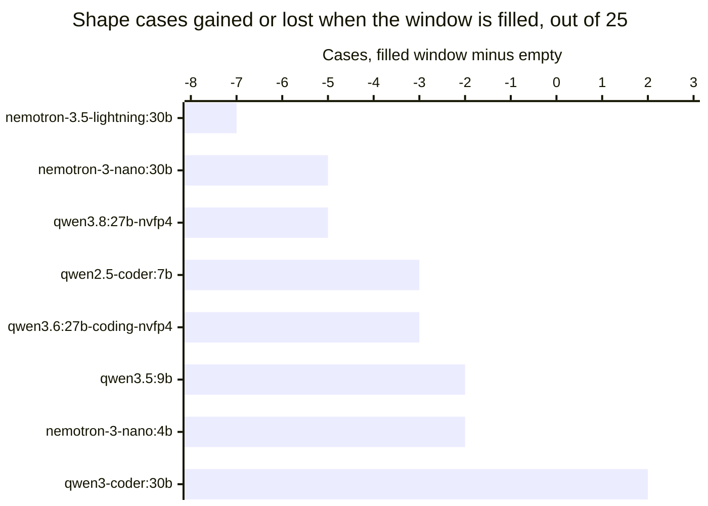

# A full context breaks three local models, each in a different way

In [`freemansoft/Flutter-AdaptiveCards`](https://github.com/freemansoft/Flutter-AdaptiveCards) a demonstration Dart chat server hands a question to a local Ollama
model. It asks for the answer as Adaptive Card JSON, a strict,
closed-vocabulary schema that a Flutter client renders as interactive UI
rather than as text. A directory of probes measures which local models manage
that, and how well. The probe scores each reply on whether it used an element
type that would answer the question. Every one of those probes had been asking
into a nearly empty window: a system prompt, one question, and at most a short
seed exchange.

What does a model do when its context is genuinely full? An ongoing
conversation fills it, so that is the condition a chat user is in. The probe measured eight models twice, once with an empty window and once
carrying roughly 48,500 tokens of history. The host was an Apple M1 Max with
64 GB, running Ollama 0.33.3 and 0.34.0. Five models move by three cases or
fewer. Three lose a quarter to a third of their shape coverage. Each of those three
fails a different way, so no single check catches them.

Every figure is transcribed from
[`ModelBehavior.md`](https://github.com/freemansoft/Flutter-AdaptiveCards/blob/main/adaptive_chat_server_dart/ModelBehavior.md),
the lab notebook in that repository.

## Terms used in this article

| Term                    | What it means here                                                                                                                                                                                                                                                                        |
| ----------------------- | ----------------------------------------------------------------------------------------------------------------------------------------------------------------------------------------------------------------------------------------------------------------------------------------- |
| **Shape score**, `n/25` | 25 test cases, one question each, paired with the Adaptive Card element types that would answer it. Scored on one thing: did the reply use one of them? This is shape coverage, not accuracy, and a model can be entirely correct in prose and score low. Figures here are `--samples 1`. |
| **Filler**              | A block of deterministic nonsense the probe prepends as conversation history, sized to a token target, so a run can ask what a model does with a window that is mostly used.                                                                                                              |
| **`prompt_eval_count`** | The token count Ollama reports for the prompt it actually evaluated. It is how each run below proves it delivered the history it meant to.                                                                                                                                                |
| **Empty window**        | The same 25 cases with no history at all. It is the comparison column throughout, and it is the condition nearly every published local-model score is measured under.                                                                                                                     |

**Every run below verified its fill size.** Sizing history is harder than it
looks. The filler is generated text, and the same text runs 4.30 characters
per token on one tokenizer and 2.74 on another. That gap is enough to overflow
a window sized for it, and Ollama then discards the whole history silently. A
companion article covers what Ollama does with context parameters, and how it
removes history that does not fit whole rather than trimming it. That article
also covers how the defect surfaced and got fixed. Every run here reports the
token count it actually delivered, in the **Prompt tokens** column.

## Four models are unaffected and three lose about a third

The probe gave each model a filler calibrated to its own tokenizer, sized to fit
the window Ollama actually allocates it. The **Empty window** column is the same 25 cases with no history. Six rows read
it from an Ollama 0.33.3 run, and the two `nvfp4` rows from a later 0.34.0 one.

| Model                        | Prompt tokens | Pass      | Empty window |
| ---------------------------- | ------------- | --------- | ------------ |
| `qwen3-coder:30b`            | 48459         | 20/25     | 18/25        |
| `qwen3.6:27b-coding-nvfp4`   | 48535         | 20/25     | 23/25\*      |
| `qwen2.5-coder:7b`           | 24721         | 19/25     | 22/25        |
| `qwen3.5:9b`                 | 48537         | 16/25     | 18/25        |
| `qwen3.8:27b-nvfp4`          | 48539         | **16/25** | 21/25\*      |
| `nemotron-3.5-lightning:30b` | 48600         | **13/25** | 20/25        |
| `nemotron-3-nano:30b`        | 48611         | **12/25** | 17/25        |
| `nemotron-3-nano:4b`         | 48559         | **6/25**  | 8/25         |

\* These two builds emptied their window for the first time on a later run,
under Ollama 0.34.0. Their two arms therefore come from different runtimes. The
pairing holds because the filled run itself repeats on 0.34.0 and returns the
same 16/25 and 20/25, verdict for verdict. Until that run both rows carried an
already-full reading in this column, and both were read as unaffected.

The three bars at minus five and beyond are the finding. Everything to their
right is a single-sample run moving by two or three cases in both directions,
which is noise.

`nemotron-3.5-lightning:30b` and `nemotron-3-nano:30b` give up about a third of
their coverage for nothing but a full window, and `qwen3.8:27b-nvfp4` a quarter.
`qwen3-coder:30b` gains two cases carrying the same load.

`qwen2.5-coder:7b`'s minus three does not belong beside the others. It carries
24721 tokens where the rest carry about 48,500. Its trained window caps it at
32768, so a larger request changes nothing for it. It takes a smaller filler
instead, running its allocated window about three quarters full. Its bar is a
smaller experiment, not a smaller model failing harder.

The three losses reproduced at a second prompt size, which is what makes them
worth acting on. An earlier run of the same control carried between 42,500 and
46,300 tokens and returned 13, 12 and 6 for the three Nemotron models. The run
above carries 48,500 and returns 13, 12 and 6 again. `qwen3.8:27b-nvfp4` scores
17/25 at 42,542 tokens and 16/25 at 48,539, against 21/25 empty. Two prompt
sizes landing on the same counts is a stronger reading than either alone. None
of the smaller movements reproduce that way.

A later run repeated three of these rows on a second machine, a 16 GB Apple
M5. Those three are every model in the table it can hold.

| Model                | Prompt tokens | M1 Max | M5    |
| -------------------- | ------------- | ------ | ----- |
| `nemotron-3-nano:4b` | 48559         | 6/25   | 6/25  |
| `qwen3.5:9b`         | 48537         | 16/25  | 16/25 |
| `qwen2.5-coder:7b`   | 24721         | 19/25  | 20/25 |

The prompt counts are identical to the digit and two of the three scores are
unchanged. One case across three models is the noise floor. Identical prompt
counts are expected, since a tokenizer is a property of the model and not of the
machine. The scores are generated text, and they held.

## The three big losers fail in three different ways

A lost case is not one thing. Sorting each run's 25 verdicts by what the judge
said turns the three largest losses into three different problems. The columns
carry the three failure kinds this section is about, so a row does not sum to 25.

| Model                        | Pass     | No card at all | Card, wrong element | Card, does not parse |
| ---------------------------- | -------- | -------------- | ------------------- | -------------------- |
| `nemotron-3.5-lightning:30b` | 20 to 13 | **1 to 10**    | 1 to 0              | 3 to 2               |
| `nemotron-3-nano:30b`        | 17 to 12 | 0 to 0         | **4 to 8**          | 2 to 2               |
| `qwen3.8:27b-nvfp4`          | 21 to 16 | 2 to 2         | 0 to 0              | **0 to 7**           |
| `qwen2.5-coder:7b`           | 22 to 19 | 0 to 3         | 2 to 1              | 0 to 0               |
| `nemotron-3-nano:4b`         | 8 to 6   | 14 to 14       | 0 to 0              | 1 to 2               |

`nemotron-3.5-lightning:30b` **stops producing cards**. All eight cases it loses
come back as prose. It answers the question in plain text instead of emitting
card JSON at all. On an empty window it did that once in twenty-five.

`nemotron-3-nano:30b` keeps producing cards and **picks worse elements**. Its replies are valid card JSON every time, with a static `TextBlock` put
where the question asked for an interactive input:

- `got {TextBlock} want {Input.Time}`, where the question asked for a time.
- `want {Input.ChoiceSet}`, where it asked the reader to pick from a set.
- `want {Input.Toggle}`, where it asked for a yes or no.

Each case asks the model to collect something, and it displays something
instead.

`qwen3.8:27b-nvfp4` picks the right elements and **stops emitting parseable
JSON**. Every case it loses is a body the parser rejects, 0 on an empty window
and 7 on a full one. `qwen3.6:27b-coding-nvfp4` fails the same way at a third
the size, 2 to 5, which a single sample does not separate from noise.

The differences decide which defense works. Any check that asks whether the reply parsed as a card catches two of the
three. It sees the model that reverts to prose and the one that emits broken
JSON, and most applications already have that check. Broken
JSON is also the one failure a retry helps, since the next attempt is a fresh
sample of the same request. A model that returns a well-formed card with the
wrong element type passes that check and no retry is triggered. It reaches the
user as a screen that renders correctly and cannot be filled in. Catching that
one means validating the reply against what was asked for, not just against the
schema.

`nemotron-3-nano:4b` is in the table so the finding can exclude it. Its prose
count does not move, 14 to 14, because it was already answering most cases in
prose on an empty window. Its two lost cases are ordinary single-sample
movement, not a context effect.

`qwen2.5-coder:7b` is the one hint that the effect starts below a full window.
It reverts to prose on three cases while carrying 24721 tokens, roughly half
what the others carry.

The two Nemotron patterns look like weakening instruction adherence over a long
context. Each is specifically a failure to follow the system prompt. One ignored
the instruction to answer as a card, the other the element palette. Ordinary
question answering is intact in both, since a prose reply and a `TextBlock` card
both answer what was asked. `qwen3.8:27b-nvfp4` does not fit that account: a
body that stops parsing is a generation failure rather than an instruction
ignored. These runs do not test either mechanism. Establishing one would mean
moving the instruction, or sweeping the fill across sizes to see whether the
loss scales. Neither run exists yet.

## A ranking taken on an empty window reorders on a full one

Score on an empty window does not predict capacity under a full one, and the
reordering is large enough to change a choice. On an empty context
`nemotron-3.5-lightning:30b` scores 20/25 and `qwen3.5:9b` scores 18/25. On a
full one the order reverses, 13 against 16.

A leaderboard, or a local benchmark that asks short questions, ranks models on
the empty-window column. For a chat application that is the wrong column, and
nothing in a published score says which way a model moves when the window
fills.

| Check                                                       | Why                                                                                                                                               |
| ----------------------------------------------------------- | ------------------------------------------------------------------------------------------------------------------------------------------------- |
| Measure at the context length you will run at               | Three of eight models here lose a quarter to a third of their coverage on a full window, and the empty-window score does not predict which three. |
| Validate the reply against the request, not just the schema | A well-formed card with a `TextBlock` where an input belongs passes every structural check and fails the user.                                    |
| Re-measure after a model swap, not just after a prompt edit | The three models that lose here sit beside five that hold, on the same prompt and the same fill.                                                  |

Two caveats apply to all of it.

Every figure is a single-sample run. A movement of two or three cases is noise,
and only the two five-case losses and the seven-case one are large enough to
read.

The shape of the effect is only partly measured. A later run on that same M5
took the three models it can hold to a second fill level, with the window held
constant. It found no threshold. Pooled coverage falls between a near-empty
window and a half-filled one, and then not at all between half and full. So
the cost is neither proportional to how full the window is nor a cliff at some
particular depth. That covers three models. None of them are the 30-billion-
parameter Nemotron builds that carry the largest losses here, so for those the
question stands.

The repository is
[https://github.com/freemansoft/Flutter-AdaptiveCards](https://github.com/freemansoft/Flutter-AdaptiveCards),
and the lab notebook these figures are read from is
[https://github.com/freemansoft/Flutter-AdaptiveCards/blob/main/adaptive_chat_server_dart/ModelBehavior.md](https://github.com/freemansoft/Flutter-AdaptiveCards/blob/main/adaptive_chat_server_dart/ModelBehavior.md).
