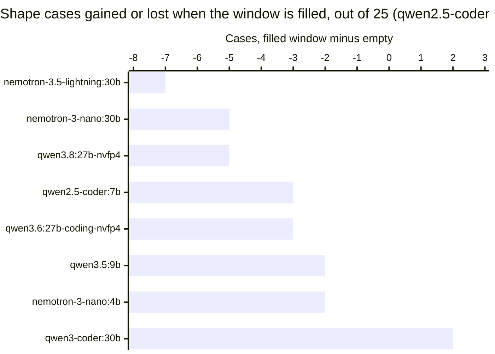
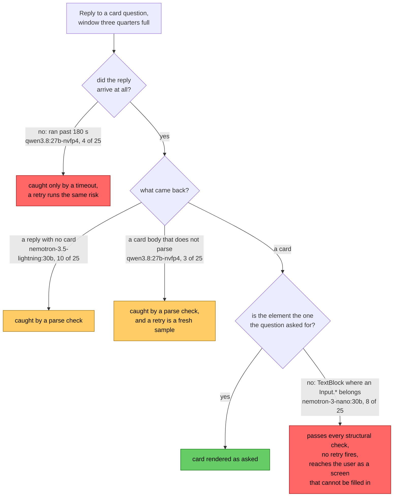

# A full context window costs three of eight local models 5 to 7 of 25 card test cases

In
[`freemansoft/Flutter-AdaptiveCards`](https://github.com/freemansoft/Flutter-AdaptiveCards)
a demonstration Dart chat server hands a question to a local Ollama model. It
asks for the answer as Adaptive Card JSON, a strict, closed-vocabulary schema
that a Flutter client renders as interactive UI rather than as text. A set of
probes in that repository puts identical questions to different local models.
[`context_fill_probe.dart`](https://github.com/freemansoft/Flutter-AdaptiveCards/blob/main/adaptive_chat_server_dart/tool/model_probes/context_fill_probe.dart)
is the probe that produced every figure in this article. It runs 25 test cases,
one question each. A test case passes only if the reply used an element type
that would answer the question. Every other probe in that set had been asking
into a nearly empty window. That window holds a system prompt, one question,
and at most a short canned exchange showing the model the shape of a card.

The probe simulates a long conversation by filling three quarters of the window
with generated text. It measured eight models twice, once with no history at
all and once carrying roughly 48,500 tokens of prompt for seven of the eight.
The host was an Apple M1 Max with 64 GB, under Ollama 0.33.3, with two
empty-window cells from a later 0.34.0 run. Five models move by three cases or
fewer out of 25, in both directions. Three lose 5, 5 and 7 cases. Each of those
three fails a different way, so no single validation check catches them. Two
models also swap places between the two conditions.

Every figure is transcribed from
[`ModelBehavior.md`](https://github.com/freemansoft/Flutter-AdaptiveCards/blob/main/adaptive_chat_server_dart/ModelBehavior.md),
the lab notebook in that repository.

## Terms used in this article

| Term                    | What it means here                                                                                                                                                                                                                                                                                                                                                                                          |
| ----------------------- | ----------------------------------------------------------------------------------------------------------------------------------------------------------------------------------------------------------------------------------------------------------------------------------------------------------------------------------------------------------------------------------------------------------- |
| **Window**              | The context window: the number of tokens Ollama allocates to one request, which holds the system prompt, the history and the question.                                                                                                                                                                                                                                                                      |
| **Trained window**      | The largest context window a model was built for. Ollama allocates `min(requested, trained window)`, so a request cannot exceed it.                                                                                                                                                                                                                                                                         |
| **Empty window**        | The same 25 cases with no history: the card system prompt and the question, about 4,000 tokens depending on the tokenizer. It is the comparison column throughout.                                                                                                                                                                                                                                          |
| **Full window**         | The same 25 cases with a filler history sized so the prompt fills about three quarters of the window Ollama allocates: roughly 48,500 of 65,536 tokens, or 24,721 of 32,768 for `qwen2.5-coder:7b`. A **near-empty** window, used once in the caveats, is a third condition at about an eighth.                                                                                                             |
| **Arm**                 | One of the two conditions a model is measured under, empty window or full window.                                                                                                                                                                                                                                                                                                                           |
| **Filler**              | A block of deterministic nonsense the probe prepends as conversation history, sized to a token target, so a run can ask what a model does with a window that is mostly used.                                                                                                                                                                                                                                |
| **Shape score**, `n/25` | 25 test cases, one question each, paired with the Adaptive Card element types that would answer it. Scored on one thing: did the reply use one of them? What it measures is **shape coverage**, not accuracy, and the article reports a change in it as cases gained or lost out of 25. A model can be correct in prose and score low. One of the 25 asks for prose, so a card is the failure on that case. |
| **The judge**           | `judgeShape`, the function that assigns each reply one verdict. The repository's other card-shape probes score with the same function, so these verdicts are comparable with theirs.                                                                                                                                                                                                                        |
| **`--samples 1`**       | Each case runs once and is scored on that one reply. Most figures in the notebook are `--samples 2`, where a case passes only if both runs pass, A one-case difference between two runs is therefore noise, where `--samples 2` figures carry a tighter floor.                                                                                                                                              |
| **`prompt_eval_count`** | The token count Ollama reports for the prompt it evaluated. The **Prompt tokens, full** column holds it, and it is how each run proves it delivered the history it meant to.                                                                                                                                                                                                                                |

**Every run below verified its fill size**, and reports the token count it
delivered in the **Prompt tokens, full** column. Tokenizers differ enough that
a filler sized in characters can overflow a window and be discarded whole, with
no error. The companion article [Ollama silently drops a history message larger
than its context
window](https://joe.blog.freemansoft.com/2026/09/ollama-silently-drops-history-message.html)
covers that defect and its fix.

## Five of eight models hold on a full window

The probe gave each model a filler calibrated to its own tokenizer, sized to
fit the window Ollama allocates it. **Empty window** and **Full window** hold
the shape score under each condition. All of it comes from
`context_fill_probe.dart` at `--samples 1` on the M1 Max, under Ollama 0.33.3
except the two starred cells.

| Model                        | Empty window | Full window | Prompt tokens, full | Window, full |
| ---------------------------- | ------------ | ----------- | ------------------- | ------------ |
| `qwen3-coder:30b`            | 18/25        | 20/25       | 48459               | 65536        |
| `qwen3.6:27b-coding-nvfp4`   | 23/25\*      | 20/25       | 48535               | 65536        |
| `qwen2.5-coder:7b`           | 22/25        | 19/25       | 24721               | 32768        |
| `qwen3.5:9b`                 | 18/25        | 16/25       | 48537               | 65536        |
| `qwen3.8:27b-nvfp4`          | 21/25\*      | **16/25**   | 48539               | 65536        |
| `nemotron-3.5-lightning:30b` | 20/25        | **13/25**   | 48600               | 65536        |
| `nemotron-3-nano:30b`        | 17/25        | **12/25**   | 48611               | 65536        |
| `nemotron-3-nano:4b`         | 8/25         | 6/25        | 48559               | 65536        |

\* The 0.34.0 empty-window run measured these two builds on an empty window for
the first time, so their two arms come from different runtimes. The pairing
holds because a 0.34.0 repeat of the full-window run returns the same 16/25 and
20/25, matching all 25 verdicts case for case. Before it, the **Empty window**
column held a reading for both builds that had itself been taken under a filled
window, which is why the notebook read both as unaffected.

The other six rows read their empty-window figure from the pre-calibration
sweep. Five runs appear in this article, and they differ in what they asked for
and in what the model received.

| Run                          | What it asked for, and what reached the model                                                                                                            |
| ---------------------------- | -------------------------------------------------------------------------------------------------------------------------------------------------------- |
| the pre-calibration sweep    | A 28,000-token filler sized in characters, into a 35,851-token window. It overflowed, Ollama dropped it whole, and about 4,000 tokens reached the model. |
| the uncalibrated fit control | The same filler into a 65,536-token window, where it fit. About 42,600 tokens reached the model.                                                         |
| the calibrated fit control   | A filler sized per tokenizer to fill the window. About 48,500 tokens, and the **Full window** column above.                                              |
| the M5 fit control           | The calibrated fit control on a 16 GB Apple M5, plus a half-fill level.                                                                                  |
| the 0.34.0 empty-window run  | The two `nvfp4` builds with no history, under Ollama 0.34.0.                                                                                             |

So the two arms differ in window size as well as in history: every empty-window
run asked for 35,851 tokens against 65,536 for the filled runs. The exception
is `qwen2.5-coder:7b`, whose trained window caps both arms at 32,768.

The chart plots each model's full-window score minus its empty-window score.
Three bars run past minus five; the rest sit within noise.

`nemotron-3.5-lightning:30b` loses 8 of the 20 cases it passed on an empty
window and wins 1 back, for a net of 7. `nemotron-3-nano:30b` loses 8 of its 17
and wins 3 back, for 5. `qwen3.8:27b-nvfp4` loses 7 of its 21 and wins 2 back,
for 5. The table and the chart carry the net figures. The model, the 25
questions and the judge are the same in both arms. `qwen3-coder:30b` gains two
cases under the same load.

`nemotron-3-nano:4b`'s 6/25 is the lowest in the table, and it was already
lowest at 8/25 empty. Its two lost cases are noise. `qwen2.5-coder:7b`'s minus
three does not belong beside the others. Its trained window caps it at 32768,
so its filler is smaller too. It runs three quarters full like every other
model, but on 24,721 tokens rather than about 48,500. Its bar comes from half
the token load.

## Both Nemotron losses repeat at a second prompt size and on a second host

The uncalibrated fit control carried about 42,600 tokens for the two Nemotron
builds and returned 13/25 and 12/25. The run above carries 48,500 and returns
13/25 and 12/25 again. `qwen3.8:27b-nvfp4` reproduces the same way from the
pre-calibration sweep: 17/25 at 42,542 tokens and 16/25 at 48,539, against
21/25 empty. None of the Qwen movements reproduce that way.

The M5 fit control repeated three of these rows under the same Ollama 0.33.3.
Those three are every model in the table above that a 16 GB Apple M5 can hold.

| Model                | Prompt tokens, full | M1 Max, full window | M5, full window |
| -------------------- | ------------------- | ------------------- | --------------- |
| `nemotron-3-nano:4b` | 48559               | 6/25                | 6/25            |
| `qwen3.5:9b`         | 48537               | 16/25               | 16/25           |
| `qwen2.5-coder:7b`   | 24721               | 19/25               | 20/25           |

Each model evaluated the same prompt on both hosts, token for token, so
**Prompt tokens, full** appears once: a tokenizer belongs to the model, not the
machine. Two of the three scores match exactly, and the third differs by
one case, which is the noise floor.

## The three models lose cases in three different ways

A lost case is not one thing. Sorting each run's 25 verdicts by what the judge
said turns the losses of 7, 5 and 5 cases into three different problems. The
judge assigns one of five failure verdicts:

- `prose`, a reply with no card in it.
- `no-input`, a valid card that shows something where the case asked it to
  collect something.
- `wrong-shape`, a card using the wrong element.
- `broken`, a reply the probe could not score as a card at all, either because
  it did not parse or because it never finished.
- `unwanted-card`, a card returned for the one case that asks for prose. It
  appears once in the table below.

Each cell below reads empty window first, then full. Same host, probe and
sample count as the table above, including the two 0.34.0 readings.

| Model                        | Shape score | `prose`     | `no-input` | `wrong-shape` | `broken`   |
| ---------------------------- | ----------- | ----------- | ---------- | ------------- | ---------- |
| `nemotron-3.5-lightning:30b` | 20 to 13    | **1 to 10** | 1 to 0     | 0 to 0        | 3 to 2     |
| `nemotron-3-nano:30b`        | 17 to 12    | 0 to 0      | **4 to 8** | 2 to 3        | 2 to 2     |
| `qwen3.8:27b-nvfp4`          | 21 to 16    | 2 to 2      | 0 to 0     | 1 to 0        | **0 to 7** |
| `qwen2.5-coder:7b`           | 22 to 19    | 0 to 3      | 2 to 1     | 1 to 2        | 0 to 0     |
| `nemotron-3-nano:4b`         | 8 to 6      | 14 to 14    | 0 to 0     | 2 to 3        | 1 to 2     |
| `qwen3.6:27b-coding-nvfp4`   | 23 to 20    | 0 to 0      | 0 to 0     | 0 to 0        | 2 to 5     |

Each row sums to 25 in both arms, except `qwen3.8:27b-nvfp4`'s empty-window
figures, which sum to 24 because its twenty-fifth verdict is that
`unwanted-card`.

`nemotron-3-nano:4b`'s `prose` count does not move, 14 to 14. It was already
answering 14 of 25 cases in prose before the window was filled.

`qwen2.5-coder:7b` is the one hint that the loss starts below 48,500 tokens. It
reverts to prose on three cases while carrying 24721 tokens, three quarters of
its own smaller window.

`nemotron-3.5-lightning:30b` **stops producing cards**. All eight cases it
loses come back as prose. A ninth comes from the case it had answered with a
static `TextBlock`, which is why its `prose` column reads 1 to 10. On an empty
window it answered in prose once in twenty-five.

`nemotron-3-nano:30b` keeps producing cards and **replaces inputs with static
text**. It substitutes on eight cases with the window full, against four when
empty, and every one is valid card JSON. Seven of the eight put a static
`TextBlock` where the question asked for an interactive input:

- `got {TextBlock} want {Input.Time}`, where the question asked for a time.
- `got {TextBlock} want {Input.ChoiceSet}`, where it asked the reader to pick
  from a set.
- `got {TextBlock} want {Input.ChoiceSet, Input.Toggle}`, where it asked for a
  yes or no.

Its other verdicts do not all parse. Two replies in each arm are `broken`, so
the substitution is what the full window changed.

`qwen3.8:27b-nvfp4` picks the right elements and **stops finishing its
replies**. Its `broken` count goes 0 on an empty window to 7 on a full one, and
those seven are not one failure. Four ran past the probe's 180-second ceiling
and the judge scored them as stalls; three returned a body that does not parse.
`qwen3.6:27b-coding-nvfp4` goes 2 to 5 on the same verdict. It gains stalls and
no malformed bodies, on three of the four cases that stalled on
`qwen3.8:27b-nvfp4`.

## A parse check catches two of the four failures

Those three patterns produce four kinds of failure, because
`qwen3.8:27b-nvfp4`'s replies fail in two ways. The diagram follows one reply
down to the outcome the user sees. Each count is out of the 25 cases, on a full
window.

A check that asks whether the reply parsed as a card catches two of the four.
It sees the model that reverts to prose and the bodies that do not parse. An
application that renders cards has to run that check anyway. That check does
not see a stall, which needs a timeout of its own. Nor does a retry help there,
since the request already ran 180 seconds under a full window. A well-formed
card with the wrong element type passes the parse check and triggers no retry
at all. It reaches the user as a screen that renders correctly and cannot be
filled in. Catching that one means validating the reply against what was asked
for, not just against the schema.

Both Nemotron patterns are failures to follow the system prompt: one ignores
the instruction to answer as a card, the other the element types it allows.
Ordinary question answering stays intact in both. That looks like weakening
instruction adherence over a long context. `qwen3.8:27b-nvfp4` does not fit
that account: a reply that stalls or stops parsing is a generation failure, and
it is the pattern both builds of that quantization show. Nothing here tests
either mechanism, and the notebook lists what would.

## Two models swap places between an empty window and a full one

Score on an empty window does not predict the score on a full one. On an empty
window `nemotron-3.5-lightning:30b` scores 20/25 and `qwen3.5:9b` scores 18/25.
On a full one the order reverses, 13/25 against 16/25.

For a chat application, the empty-window column is the wrong one to choose on.
It does not say which way a model moves when the window fills.

## Three models score the same at half fill and at full

Every figure above is a single-sample run. A movement of two or three cases is
noise, and only the two five-case losses and the seven-case one are large
enough to read.

The M5 fit control also took those same three models to a third fill level,
holding the window constant across the two filled levels. Their shape scores,
added together, run 47/75 near-empty, 42/75 at half fill and 42/75 full. Half a
window costs the same as a full one, so the cost neither grows with occupancy
nor switches on at one depth. The first step carries a qualifier. The
near-empty reading does not match the other two. It comes from the M5's own
pre-calibration sweep, at a smaller allocated window for two of the three. The
five-case fall between it and half fill is therefore not established, and
settling it needs `--samples 2` and more models. No 30-billion-parameter
Nemotron build fits a 16 GB host, so how the loss scales with fill is untested
on the two models that lose the most.

## Four checks for a chat application that fills its window

Two of these change how you measure a model, and two change what your
application does with a reply.

| Check                                                                    | Why                                                                                                                           |
| ------------------------------------------------------------------------ | ----------------------------------------------------------------------------------------------------------------------------- |
| Measure at the context length you will run at                            | Three of eight models here lose 5 to 7 of 25 cases on a full window, and the empty-window score does not predict which three. |
| Validate the reply against the request, not just the schema              | A well-formed card with a `TextBlock` where an input belongs passes every structural check and fails the user.                |
| Give a card request a timeout of its own                                 | Four of the seven cases `qwen3.8:27b-nvfp4` loses never returned inside 180 seconds.                                          |
| Rank models based on the expected context window, not on short questions | `qwen3.5:9b` scores 2 cases below `nemotron-3.5-lightning:30b` on an empty window and 3 above it on a full one.               |

The repository is
[https://github.com/freemansoft/Flutter-AdaptiveCards](https://github.com/freemansoft/Flutter-AdaptiveCards),
and the lab notebook these figures are read from is
[https://github.com/freemansoft/Flutter-AdaptiveCards/blob/main/adaptive_chat_server_dart/ModelBehavior.md](https://github.com/freemansoft/Flutter-AdaptiveCards/blob/main/adaptive_chat_server_dart/ModelBehavior.md).
