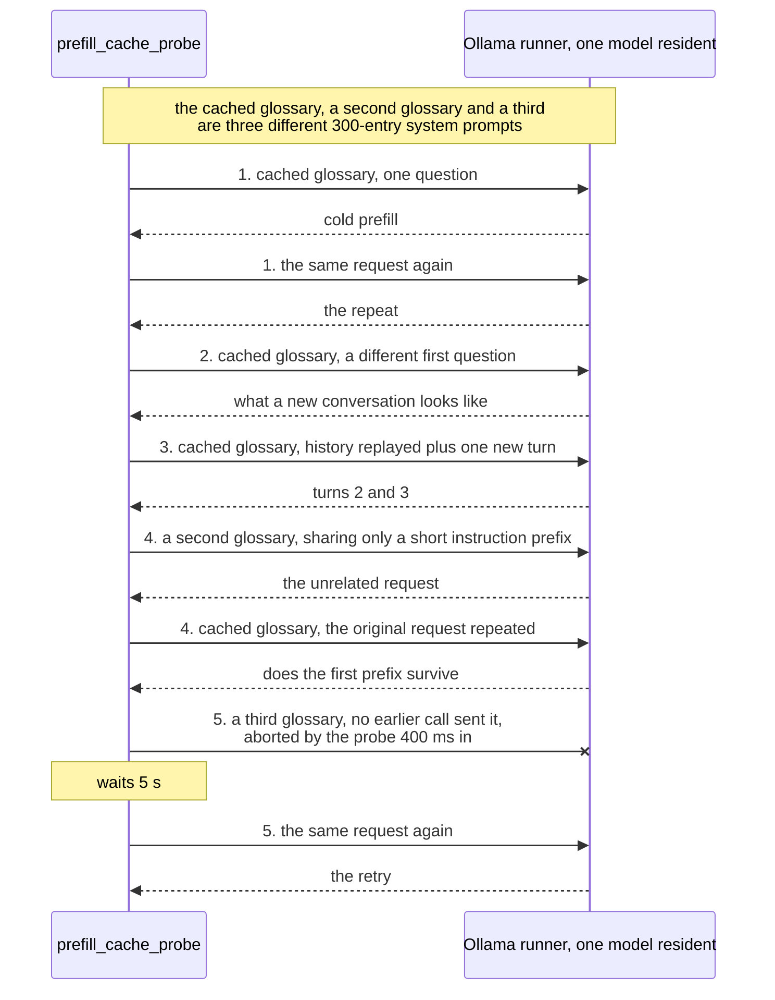
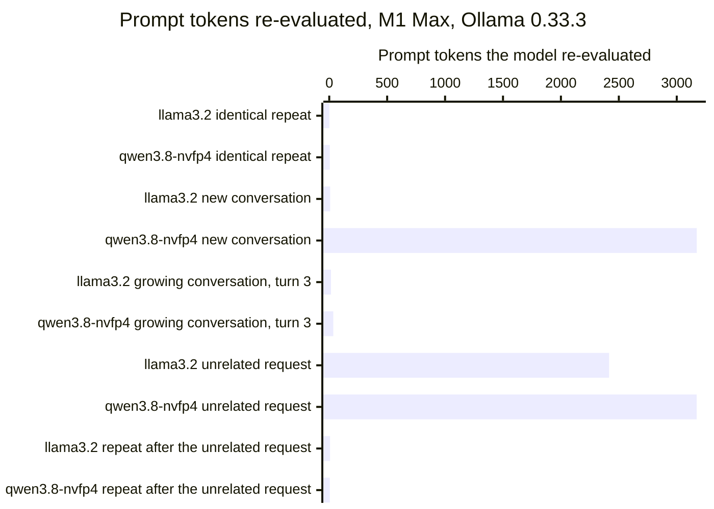

# Ollama's prompt cache reused a shared system prompt on one model and not on the other

In
[`freemansoft/Flutter-AdaptiveCards`](https://github.com/freemansoft/Flutter-AdaptiveCards)
a demonstration Dart chat server asks a local Ollama model for an answer as
Adaptive Card JSON. That is a strict, closed-vocabulary schema, and a Flutter
app renders it as interactive UI rather than as text. The request is expensive
before the model writes anything. The card system prompt that describes the
element vocabulary runs to a few thousand tokens, and the chat server replays
the whole conversation on every turn.

Ollama keeps a prefix cache, so a request whose opening tokens match an earlier
one does not have to process them again. How much does that cache save a chat
server, and when does it miss? Ollama 0.33.3 reports
`prompt_eval_cached_count` on every reply, which is the field that measures it.
Every reading below comes from
[`ModelBehavior.md`](https://github.com/freemansoft/Flutter-AdaptiveCards/blob/main/adaptive_chat_server_dart/ModelBehavior.md),
the lab notebook in that repository.

## Terms used in this article

The article uses these words with a specific meaning. Field names are Ollama's
own.

| Term                           | What it means here                                                                                                                                  |
| ------------------------------ | --------------------------------------------------------------------------------------------------------------------------------------------------- |
| **Runner**                     | The process Ollama starts to serve one loaded model. The prefix cache belongs to it, so unloading the model discards the cache.                     |
| **Prefill**                    | The pass in which the model processes the prompt, before it produces the first output token. Ollama reports its duration as `prompt_eval_duration`. |
| **Prefix cache**               | Prompt tokens the runner has already processed and kept. A new request reuses them as far as its opening tokens match.                              |
| **`prompt_eval_count`**        | The number of prompt tokens Ollama reports for a request.                                                                                           |
| **`prompt_eval_cached_count`** | How many of those tokens came from the prefix cache. Ollama 0.33.3 reports it on every reply.                                                       |
| **Cold prefill**               | A prefill with nothing useful in the cache.                                                                                                         |
| **`num_ctx`**                  | The context window the request asks for, in tokens. Every run here asks for 8,192.                                                                  |

## The probe sends five request patterns a chat server produces

[`prefill_cache_probe.dart`](https://github.com/freemansoft/Flutter-AdaptiveCards/blob/main/adaptive_chat_server_dart/tool/model_probes/prefill_cache_probe.dart)
builds its own system prompts rather than sending the card one, each a
synthetic glossary of 300 entries. It builds three of them. Three patterns
share one glossary, called the cached glossary below. The unrelated request and
the retry each carry their own, sharing only a short instruction prefix with
it. The probe sends these to one model at a time and records the token counts
and the prefill time for each call. Every run is at temperature 0 with one
model resident. The patterns are the ones a chat server sends:

- the same request twice;
- the cached glossary with a different first question, which is what a new
  conversation looks like;
- a conversation that grows by one turn at a time, with the history replayed;
- an unrelated request between two identical ones, as when two users share a
  server, carrying a second glossary;
- a retry after the probe aborts a call 400 ms in, waits 5 s, and sends it
  again, on a third glossary no earlier call has sent.

A glossary replaces the card system prompt so that the probe can vary it.
Both run to a few thousand tokens. The readings below are therefore about
reusing a long system prompt at that scale, not about the card prompt itself.

Each glossary is sized to fit the window on purpose. A first version of the
probe sent a prompt larger than `num_ctx`. Ollama cut it short without an
error, and every cache figure read near zero. The
[measurement-hygiene article](https://joe.blog.freemansoft.com/2026/09/eight-measurement-rules-from-local.html)
in this series covers that mistake. The check is that `prompt_eval_count` grows
when the history does.

## `llama3.2:latest` reused the cache on every pattern but the unrelated request, on both hosts

The readings below show how much of each request the prefix cache served, and
the prefill time that was left. Compare each cached count with its prompt
count, and each prefill with the cold one in the first row. In the prefill
column, figures separated by commas are separate runs of the probe. Every run
in this article is recorded in the notebook's
[prompt-cache section](https://github.com/freemansoft/Flutter-AdaptiveCards/blob/main/adaptive_chat_server_dart/ModelBehavior.md#prompt-cache-reuse-and-retry-cost-measured-with-prompt_eval_cached_count).

The first table is an Apple M5 / 16 GB under Ollama 0.33.3.

| Pattern, M5, `llama3.2:latest`                         | prompt / cached          | prefill                  |
| ------------------------------------------------------ | ------------------------ | ------------------------ |
| identical request repeated                             | 2143 / 2142              | 2017 ms cold, then 18 ms |
| cached glossary, a different question                  | 2144 / 2136              | 60 ms                    |
| growing conversation, turns 2 and 3                    | 2166 / 2150, 2188 / 2173 | ~94 ms per turn          |
| the original request repeated after an unrelated one   | 2143 / 2136              | 55 ms                    |
| retry after aborting mid-prefill (400 ms in, 5 s wait) | 2444 / 2443              | 29 ms                    |

The run is from 2026-09-03. It is a spot measurement transcribed from terminal
output, taken before the probe could archive a run. Its Ollama version
therefore comes from the notebook's record of the session rather than from a
recorded `ollama --version`.

A conversation turn pays prefill for its new tokens only. Turns 2 and 3
re-evaluated about 15 tokens each, so history size does not set the per-turn
cost. A new conversation re-evaluated about 8 tokens. On this model the cost
of a large system prompt is paid once per loaded model, not once per
conversation.

The same probe ran on an Apple M1 Max / 64 GB under the same Ollama 0.33.3.
That changes the host and holds the model fixed. This table splits the growing
conversation into its two turns, because both were timed separately here.

| Pattern, M1 Max, `llama3.2:latest`                     | prompt / cached | prefill                  |
| ------------------------------------------------------ | --------------- | ------------------------ |
| identical request repeated                             | 2143 / 2142     | 2079 ms cold, then 12 ms |
| cached glossary, a different question                  | 2144 / 2136     | 87 ms, 42 ms             |
| growing conversation, turn 2                           | 2166 / 2150     | 54 ms                    |
| growing conversation, turn 3                           | 2188 / 2173     | 53 ms                    |
| the unrelated request itself                           | 2444 / 28       | 2170 ms                  |
| the original request repeated after it                 | 2143 / 2136     | 39 ms                    |
| retry after aborting mid-prefill (400 ms in, 5 s wait) | 2444 / 2443     | 30 ms                    |

`llama3.2:latest` reproduced the M5 pattern on every row the two tables share.
The M1 Max table adds one the M5 run did not record separately: the unrelated
request itself. It reused 28 of 2,444 tokens and paid a full cold prefill. That
is expected. Its glossary shares only a short instruction prefix with the
cached one, so there is little to reuse.

## `qwen3.8:27b-nvfp4` re-evaluated a byte-identical system prompt on every new conversation

The next readings hold the host fixed and change the model.
`qwen3.8:27b-nvfp4` is a build Ollama reports as `nvfp4` quantization. At
16.9 GB it is too large for the M5's 16 GB, so it ran on the M1 Max only,
under the same Ollama 0.33.3.

| Pattern, M1 Max, `qwen3.8:27b-nvfp4`                   | prompt / cached                       | prefill                               |
| ------------------------------------------------------ | ------------------------------------- | ------------------------------------- |
| identical request repeated                             | 3176 / 3171                           | 37779 ms cold, then 133 ms and 158 ms |
| cached glossary, a different question                  | 3177 / 4, 3177 / 4, 3177 / 4          | 40426 ms, 40377 ms, 37615 ms          |
| growing conversation, turn 2                           | 3207 / 3172                           | 812 ms                                |
| growing conversation, turn 3                           | 3237 / 3202                           | 804 ms                                |
| the unrelated request itself                           | 3176 / 4, 3176 / 4, 3176 / 4          | 40381 ms, 40604 ms, 37815 ms          |
| the original request repeated after it                 | 3176 / 3171, 3176 / 3171, 3176 / 3171 | 215 ms, 205 ms, 198 ms                |
| retry after aborting mid-prefill (400 ms in, 5 s wait) | 3477 / 3472, 3477 / 2063, 3477 / 3472 | 148 ms, 18154 ms, 142 ms              |

All the M1 Max runs are from 2026-09-04 and 2026-09-05. The
`qwen3.8:27b-nvfp4` probe was repeated in full on that same M1 Max when it was
idle, after its first misses, to rule out a one-off contention artifact. The
whole glossary request counts 3,176 tokens for this model and 2,143 for
`llama3.2:latest`. That is the denser tokenization Qwen builds show on the same
text elsewhere in the notebook.

The chart below plots what each pattern cost in work rather than in time. Each
bar is prompt tokens minus cached tokens, which is what the model had to
re-evaluate. A short bar means the cache served the request. Prefill time spans
12 ms to 40 seconds across these two models, so a chart of milliseconds would
show only that the larger model is slower.

Three readings hold for the larger model. An identical repeat drops from about
38 seconds to under 200 ms. A growing conversation pays about 800 ms per turn,
far below its own cold prefill. The original request stays cached after an
unrelated one. The unrelated request itself is a near-total miss on this model
too, 4 cached tokens of 3,176. The reason is the same one it is on the smaller
model.

The new-conversation pattern is the miss that is not expected. The cached
glossary is byte-identical and only the short question differs.
`llama3.2:latest` reused 2,136 of 2,144 tokens. `qwen3.8:27b-nvfp4` reused 4 of
3,177 on three independent runs and paid a full cold prefill each time, about
40 seconds. An unarchived fourth run read the same.

## The retry after an abort is cheap on `llama3.2:latest` and unstable on `qwen3.8:27b-nvfp4`

The retry sends a third glossary no earlier call had sent, so only the aborted
call could have filled the cache. On `llama3.2:latest` it cost 29 ms on the M5
and 30 ms on the M1 Max, against a cold prefill of about 2,000 ms. The probe
cannot tell whether the runner kept the partial work or the abandoned request
finished server-side during the 5 s wait. The price of the retry is the same
either way.

On `qwen3.8:27b-nvfp4` the same step is unstable. Two counted runs read 148 ms
and 142 ms with 3,472 of 3,477 tokens cached. One read 18,154 ms with 2,063 of
3,477 cached. Three readings are not a rate. A plausible reason is that the
amount of prefill finished before the abort lands varies from run to run. The
probe does not observe server-side progress, so that is not confirmed.

## A new conversation costs `llama3.2:latest` tens of milliseconds and `qwen3.8:27b-nvfp4` about 40 seconds

On `llama3.2:latest` a new conversation costs 42 to 87 ms of prefill on the M1
Max, and 60 ms on the M5, once the glossary is cached. On `qwen3.8:27b-nvfp4` it
costs about 40 seconds, the same as the first request after a model load. A
server that starts many short conversations on that model pays the whole system
prompt every time. Within one conversation, both models reuse the cache on
every turn.

The cause of the miss is not established. The probe reports
`prompt_eval_cached_count`, not the runner's matching rule. A model-specific
or quantization-specific rule, an effect of prompt length past about 3,000
tokens, and a limit on cached sequences are each consistent with it. None is
confirmed.

These readings cover one model on two hosts and a second model on one host,
all under one Ollama version. How many prefixes the runner keeps, and what it
evicts under memory pressure, were not probed.

The repository is
[https://github.com/freemansoft/Flutter-AdaptiveCards](https://github.com/freemansoft/Flutter-AdaptiveCards),
and the lab notebook every figure above comes from is at
[https://github.com/freemansoft/Flutter-AdaptiveCards/blob/main/adaptive_chat_server_dart/ModelBehavior.md](https://github.com/freemansoft/Flutter-AdaptiveCards/blob/main/adaptive_chat_server_dart/ModelBehavior.md).
