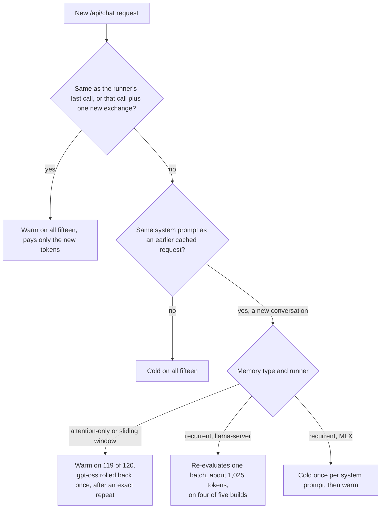
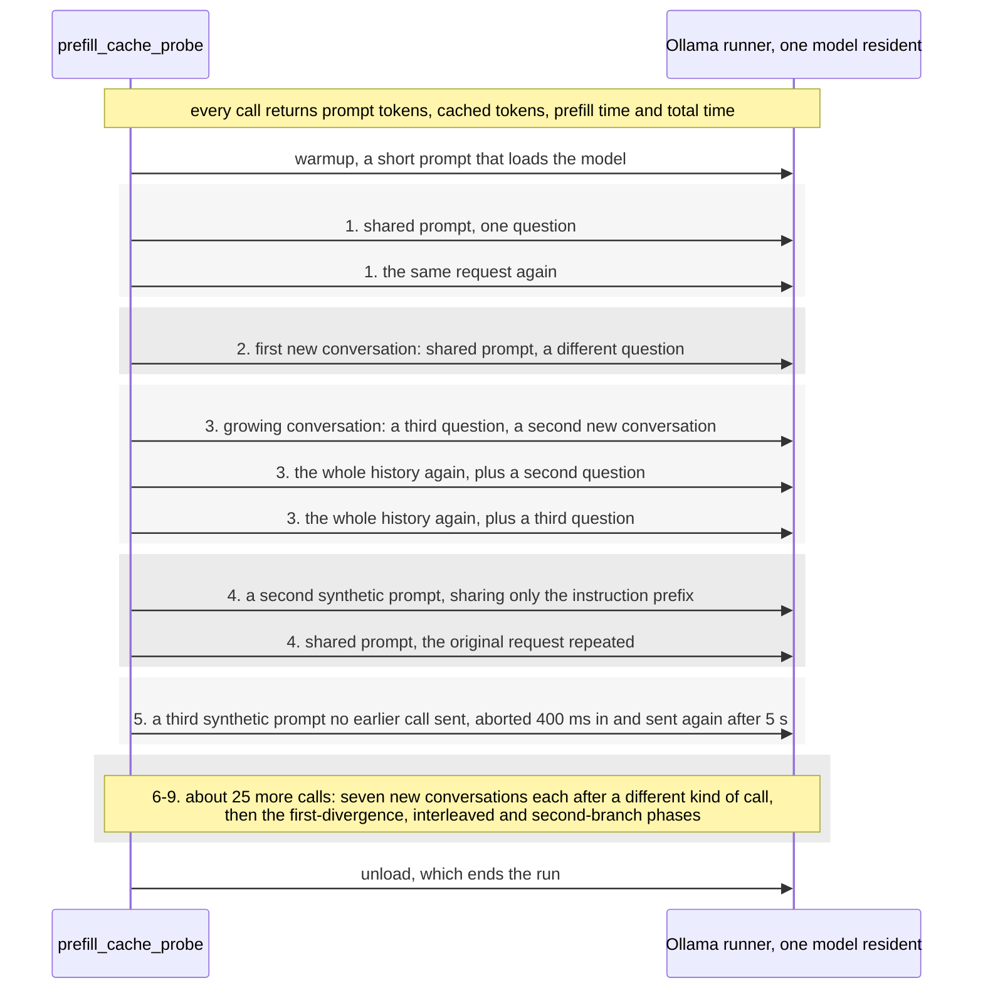
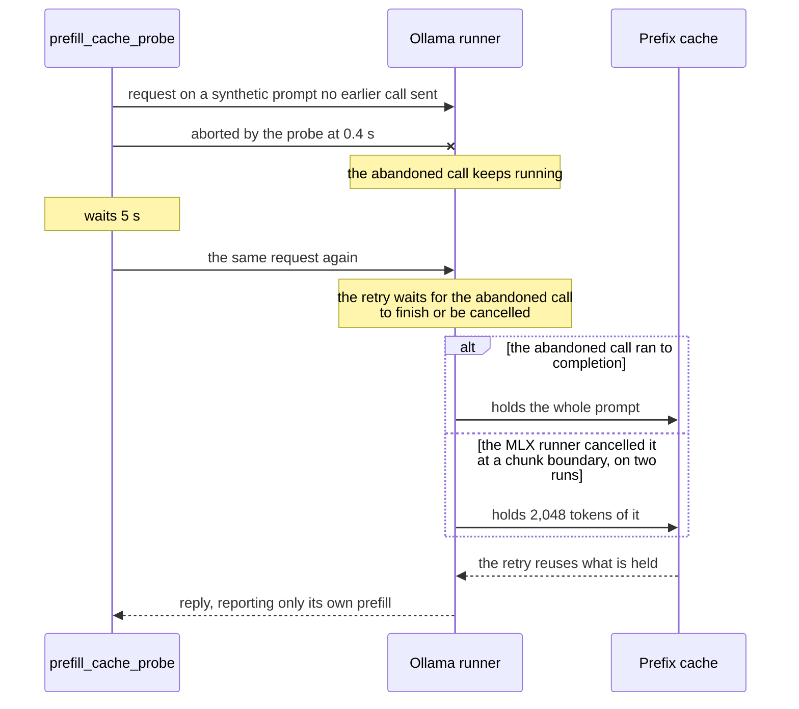

# On Ollama, a model's memory type and its runner decide how much of the cached prompt a new conversation reuses

In
[`freemansoft/Flutter-AdaptiveCards`](https://github.com/freemansoft/Flutter-AdaptiveCards)
a demonstration Dart chat server asks a local Ollama model for an answer as
Adaptive Card JSON. That is a strict, closed-vocabulary schema, which a Flutter
app renders as interactive UI. The card system prompt that describes the
element vocabulary is about 3,755 tokens. The chat server replays up to
ten prior exchanges on every turn.

Each Ollama runner keeps a prefix cache, so a request whose opening tokens
match an earlier one does not have to process them again. Ollama 0.33.3 and
later report, in `prompt_eval_cached_count`, how many of a reply's prompt
tokens came from that cache. A chat server can read from that field how much
of each prompt the cache served and where it missed. Every reading below comes
from
[`ModelBehavior.md`](https://github.com/freemansoft/Flutter-AdaptiveCards/blob/main/adaptive_chat_server_dart/ModelBehavior.md),
the lab notebook in that repository.

**A new conversation reuses a cached system prompt on some models and not on
others.** The split follows how the model stores its context. A probe
measured fifteen local models on an Apple M1 Max under Ollama 0.34.0:

- Eight of the fifteen store one attention entry per token, the key and value
  vectors a runner can truncate at any position. A new conversation keeps the
  entries up to where it diverges and drops the rest. These eight reused the
  cached prompt on all but one of 120 new conversations.
- Five carry a running state from token to token instead. That state cannot be
  rewound to an arbitrary token, only restored from a checkpoint the runner
  saved earlier. `llama-server` prints `llama_memory_recurrent` when it loads
  one. Four re-evaluated the last 1,024 or 1,025 tokens on every new
  conversation, and the unsloth Nemotron build did so on a third of them.
- Two carry the same running state on Ollama's MLX runner, which prints no
  such line: their memory type comes from the runner's model code. They
  re-evaluated the whole prompt on the first new conversation per system
  prompt, and almost none of it afterward.

The diagram sorts a request by what it shares with the runner's last call:



## Terms used in this article

| Term                       | What it means here                                                                                                                                                                                                                                                     |
| -------------------------- | ---------------------------------------------------------------------------------------------------------------------------------------------------------------------------------------------------------------------------------------------------------------------- |
| **Runner**                 | The process Ollama starts to serve one loaded model: `llama-server` for the thirteen GGUF builds here, the MLX runner for the two safetensors builds. Ollama's server log names the one it starts, and the prefix cache belongs to it.                                 |
| **Prefill**                | The pass in which the model processes the prompt, before it produces the first output token. Ollama reports its duration as `prompt_eval_duration`.                                                                                                                    |
| **Cold** and **warm**      | A cold request has almost none of its prompt served from the prefix cache, and pays a cold prefill. A warm request has nearly all of it.                                                                                                                               |
| **New conversation**       | A request carrying a system prompt the runner has already processed, followed by a question it has not seen. It is how a chat server opens a second conversation on the same system prompt.                                                                            |
| **Synthetic prompt**       | A system prompt the probe builds in place of the card one, as a glossary of numbered entries. The shared one carries most requests; the others differ from it by a tag word.                                                                                           |
| **Memory type**            | How a model's layers hold the context they have read: an attention entry per token, or a recurrent running state. `llama-server` prints which at load. Not the host's RAM.                                                                                             |
| **Attention-only memory**  | Layers that keep a key and a value vector per token, the KV cache. The store is indexed by position, so a runner can reuse any leading run of a cached prompt. Seven models here; `gpt-oss:20b` keeps the same per-token store behind a sliding window, defined below. |
| **Recurrent memory**       | Layers that carry a running state from token to token instead of keeping a vector per token. The state cannot be rewound to an arbitrary token. `llama-server` prints `llama_memory_recurrent` when it loads such a model.                                             |
| **Context checkpoint**     | A saved copy of that state at one token position. A runner can resume a recurrent model only from a checkpoint. `llama-server` logs each one it creates and restores; the MLX runner calls the same thing a snapshot.                                                  |
| **Batch**                  | The unit `llama-server` prefills a prompt in. Ollama starts it with `-b 1024 -ub 1024`, a 1,024-token batch and micro-batch, and the runner echoes `n_batch = 1024`.                                                                                                   |
| **Sliding window**         | Attention layers that see only the last few tokens, 128 in `gpt-oss:20b`. `llama-server` handles them with the same checkpoints.                                                                                                                                       |
| **First-divergence phase** | Three new conversations on each of two synthetic prompts no earlier call sent. Arm `delta` goes straight there from the first request; arm `echo` sends the same request twice first.                                                                                  |
| **Interleaved phase**      | Two three-turn conversations alternating on one system prompt, as when a chat server serves two users.                                                                                                                                                                 |
| **Second branch**          | Four single-question requests on the shared synthetic prompt: two different questions, the first one again, then a third. It asks whether the runner keeps one restorable branch per prompt or several.                                                                |

## The probe sends the request shapes a chat server produces, in nine phases

[`prefill_cache_probe.dart`](https://github.com/freemansoft/Flutter-AdaptiveCards/blob/main/adaptive_chat_server_dart/tool/model_probes/prefill_cache_probe.dart)
builds its own system prompts rather than sending the card one. Each is a
glossary of 300 numbered entries, and each question, such as `Define
alpha-term20.`, asks for one of them. The tag word is `alpha` here:

```txt
You are a helpful assistant. Answer briefly. Reference glossary: alpha-term0
means concept0. alpha-term1 means concept7. alpha-term2 means concept14. ...
```

The `alpha` prompt is the shared synthetic prompt below. The probe sends them to
Ollama one model at a time, at temperature 0 and with thinking off. A warmup
call loads the model first, so a cold prefill below is the cost of the prompt,
not of the model load. The diagram
gives the nine phases in call order:



The 300-entry shared prompt comes to 2,127 to 3,479 tokens depending on the
tokenizer, against the card system prompt's estimated 3,755. Four models then
ran the whole probe on that 15 KB card prompt: `llama3.2:latest`, `qwen3.5:9b`,
`nemotron-3-nano:4b` and `qwen3.8:27b-nvfp4`. The card prompt gave the same
shape. `llama3.2:latest` re-evaluated 7 to 8 tokens, `qwen3.5:9b` and
`nemotron-3-nano:4b` 1,025, and `qwen3.8:27b-nvfp4` paid one cold first new
conversation per prompt. The probe sizes each synthetic prompt to fit the
8,192-token context window every run asks for. An earlier version overflowed it
and every cache figure read near zero, the mistake the [measurement-hygiene
article](https://joe.blog.freemansoft.com/2026/09/eight-measurement-rules-from-local.html)
covers.

All fifteen models ran the nine phases on 2026-09-23 and 2026-09-24, one
client, one request at a time. The same four ran them twice, and `qwen3.5:9b`
at four more prompt lengths. Every token count in all nine phases repeated
between the two runs, except the retry's on `qwen3.8:27b-nvfp4`.

## An exact repeat or a growing-conversation turn stays warm on all fifteen models

On Ollama, an immediate exact repeat left 1 to 5 tokens uncached. Each turn that extends
the conversation re-evaluated only its new exchange, 10 to 40 tokens. The
length of the history does not set the per-turn cost.

## A new conversation stays warm on eight models and re-evaluates tokens on seven, by memory type

Every row is one model's nine-phase run on the M1 Max under Ollama 0.34.0, and
each cell gives cached tokens, then the prefill time. A new conversation
shares all but 5 to 17 of the prompt's tokens with the cached one.

| Model                                  | Memory         | Runner         | Cold prefill, first request | First new conversation, 3 calls                | Later new conversations, 12                       |
| -------------------------------------- | -------------- | -------------- | --------------------------- | ---------------------------------------------- | ------------------------------------------------- |
| `llama3.2:latest`                      | attention-only | `llama-server` | 1.9–3.1 s                   | 2,136, 42–46 ms                                | 2,136, 39–71 ms                                   |
| `qwen3-coder:30b`                      | attention-only | `llama-server` | 4.1–5.9 s                   | 3,167, 76–103 ms                               | 3,167–3,168, 78–120 ms                            |
| `qwen2.5-coder:7b`                     | attention-only | `llama-server` | 8.6–9.9 s                   | 3,167, 106–137 ms                              | 3,167–3,168, 99–142 ms                            |
| `llama3-chatqa:8b`                     | attention-only | `llama-server` | 4.7–6.2 s                   | 2,121, 103–139 ms                              | 2,121, 76–106 ms                                  |
| `llama3-groq-tool-use:8b`              | attention-only | `llama-server` | 4.7–6.0 s                   | 2,126, 120–136 ms                              | 2,126, 113–137 ms                                 |
| `granite4.1:3b`                        | attention-only | `llama-server` | 2.2–3.3 s                   | 2,124, 49–58 ms                                | 2,124, 46–85 ms                                   |
| `granite4.1:8b`                        | attention-only | `llama-server` | 7.1–8.4 s                   | 2,124, 137–180 ms                              | 2,124, 130–185 ms                                 |
| `gpt-oss:20b`                          | sliding window | `llama-server` | 2.4–3.4 s                   | 2,182, 67–86 ms                                | 2,182 on 11 (59–89 ms); 1,162 once (1.68 s)       |
| `qwen3.5:9b`                           | recurrent      | `llama-server` | 8.9–10.7 s                  | 2,154, 3.69–3.98 s                             | 2,154–2,155, 3.41–4.20 s                          |
| `nemotron-3-nano:4b`                   | recurrent      | `llama-server` | 5.8–6.4 s                   | 2,454, 1.95–1.99 s                             | 2,454–2,455, 1.94–2.12 s                          |
| `nemotron-3-nano:30b`                  | recurrent      | `llama-server` | 4.1–5.1 s                   | 2,153, 1.34–1.73 s                             | 2,153–2,154, 1.50–1.70 s                          |
| `nemotron-3.5-lightning:30b`           | recurrent      | `llama-server` | 4.2–5.4 s                   | 2,153, 1.39–1.79 s                             | 2,153–2,154, 1.72–1.80 s                          |
| `unsloth/Nemotron-3-Nano-30B-A3B-GGUF` | recurrent      | `llama-server` | 4.1–5.4 s                   | 3,162 once (157 ms); 2,154 twice (1.41–1.75 s) | 3,162 on 9 (154–183 ms); 2,154 on 3 (1.87–1.92 s) |
| `qwen3.8:27b-nvfp4`                    | recurrent      | MLX            | 35.2–36.0 s                 | 4–15, 35.5–37.1 s                              | 3,166–3,167, 376–415 ms                           |
| `qwen3.6:27b-coding-nvfp4`             | recurrent      | MLX            | 33.8–35.3 s                 | 5–16, 34.3–34.7 s                              | 3,167–3,168, 409–432 ms                           |

Source: the notebook's [recurrent-memory section](https://github.com/freemansoft/Flutter-AdaptiveCards/blob/main/adaptive_chat_server_dart/ModelBehavior.md#recurrent-memory-models-lose-part-of-a-cached-prefix-on-llama-server-too-the-runner-sets-how-much), and the archived runs under
[`results-m1max-64gb-ollama0340/`](https://github.com/freemansoft/Flutter-AdaptiveCards/tree/main/adaptive_chat_server_dart/tool/model_probes/results-m1max-64gb-ollama0340).

The seven attention-only models were warm on every new conversation.
`gpt-oss:20b`, the sliding-window build, was warm on 14 of 15. Its one miss,
after an exact repeat, is a checkpoint restore the `llama-server` section below
accounts for.

Four of the recurrent builds re-evaluated the last 1,024 or 1,025 tokens on
every new conversation, the first included. That cost about a third of their
cold prefill. The fifth, the unsloth Nemotron build, did so on 5 of its 15; an
extra checkpoint explains that below. The two MLX builds paid a full cold
prefill for the first new conversation on each synthetic prompt, and were warm
after it.

## `llama-server` resumes a recurrent model from a checkpoint one batch back

`llama-server` saved two checkpoints while processing the shared synthetic
prompt on `qwen3.5:9b`, 3,178 tokens. One sits at 2,154 tokens, one batch
before the end, and one 4 tokens from the end. A new conversation shares 3,167
tokens with that prompt and diverges before the later checkpoint. Ollama's
server log shows `llama-server` trying it and falling back:

```
checking checkpoint with [3173, 3173] against 3167...
checking checkpoint with [2153, 2153] against 3167...
restored context checkpoint (pos_min = 2153, ..., n_tokens = 2154, ...)
```

The new conversation's 3,179-token request therefore re-evaluates 1,025 tokens.
An exact repeat or a growing-conversation turn restores the checkpoint at the
end of the previous call and stays warm. An exact repeat after an unrelated
synthetic prompt restores the one-batch-back checkpoint instead, `qwen3.5:9b`
reusing 2,154 of 3,178. The unrelated prompt itself reused at most 28 tokens,
and the attention-only builds stayed warm on the repeat. The attention-only
builds log no checkpoints. `gpt-oss:20b`'s sliding-window layers use the same
ones. `llama-server` restored a checkpoint at 1,162 tokens three times: after an
exact repeat, after the unrelated prompt, and once in the interleaved phase.
Nothing in the log explains why. A request with nothing to restore, a first
request or one on an unrelated synthetic prompt, gets a different line:

```
forcing full prompt re-processing due to lack of cache data (likely due to SWA or hybrid/recurrent memory …)
```

The rollback is one batch, not a share of the prompt. `--entries` moved
`qwen3.5:9b`'s prompt from 1,008 to 4,812 tokens, and from 1,549 tokens up the
re-evaluated count stayed at 1,025. `nemotron-3-nano:4b` matches at 1,700 and
3,479 tokens. The card system prompt rolled back the same 1,025, which a
positional checkpoint predicts and a content-sensitive one does not. A
1,008-token prompt is shorter than one batch and holds no checkpoint before
the divergence. `qwen3.5:9b` re-evaluates all of it, 3.57 s against the 2.23 s
its own cold prefill cost.

The unsloth Nemotron build saves a third checkpoint 16 tokens from the end.
An exact repeat or a growing-conversation turn drops it; after any other call
`llama-server` restores from there. Nothing in the runner's output says why it
places one there for this build and not for the Ollama-library ones.

## Ollama's MLX runner pays one extra cold prefill per system prompt

The MLX runner logs a `prefix_cache` line for each request. In it, `matched`
counts the leading tokens that agree with a cached request, and `cached` counts
the tokens the runner reused. On `qwen3.8:27b-nvfp4` the first new conversation
logs `total=3179 matched=3166 cached=4`: the runner found the shared prefix
and restored 4 of them. Later new conversations log `matched=3166
cached=3166`, and `qwen3.6:27b-coding-nvfp4` logs the same shape at 3167.

The runner's source says why. Its prefix cache, in
[`prefix_cache.go`](https://github.com/ollama/ollama/blob/v0.34.0/x/mlxrunner/prefix_cache.go)
at v0.34.0, is a trie. In that prefix tree, each cached prompt is a path of
token runs from the root. Recurrent layers keep a snapshot only at the end of a
trie node, where attention layers can be restored to any position. A request
that diverges inside a node has nothing to restore, so the runner prefills from
the start. During that prefill it schedules a snapshot at the branch point, "so
future requests diverging here can restore instead of re-evaluating". The
runner's [Qwen3.5 model
code](https://github.com/ollama/ollama/blob/v0.34.0/x/models/qwen3_5/qwen3_5.go)
is recurrent by construction: gated-delta recurrent layers interleaved with
full-attention layers. `ollama show` reports both `nvfp4` builds as that Qwen3.5
architecture.

The first-divergence phase compares the two runners side by side. Each cell
reads prompt / cached, prefill time in parentheses:

| Model               | Arm   | first request      | exact repeat | new conv 1          | new conv 2  | new conv 3  |
| ------------------- | ----- | ------------------ | ------------ | ------------------- | ----------- | ----------- |
| `llama3.2:latest`   | delta | 2143 / 28 (2.9 s)  |              | 2143 / 2136 (45 ms) | 2143 / 2136 | 2143 / 2136 |
| `llama3.2:latest`   | echo  | 2143 / 28 (3.1 s)  | 2143 / 2142  | 2143 / 2136 (46 ms) | 2143 / 2136 | 2143 / 2136 |
| `qwen3.5:9b`        | delta | 3178 / 0 (10.6 s)  |              | 3178 / 2154 (3.9 s) | 3178 / 2154 | 3179 / 2154 |
| `qwen3.5:9b`        | echo  | 3178 / 0 (10.7 s)  | 3178 / 3174  | 3178 / 2154 (4.0 s) | 3178 / 2154 | 3179 / 2154 |
| `qwen3.8:27b-nvfp4` | delta | 3178 / 15 (35.3 s) |              | 3178 / 15 (35.5 s)  | 3178 / 3166 | 3179 / 3166 |
| `qwen3.8:27b-nvfp4` | echo  | 3178 / 15 (35.2 s) | 3178 / 3173  | 3178 / 15 (36.1 s)  | 3178 / 3166 | 3179 / 3166 |

Source: the `first-divergence` phase of the archived nine-phase runs under
[`results-m1max-64gb-ollama0340/`](https://github.com/freemansoft/Flutter-AdaptiveCards/tree/main/adaptive_chat_server_dart/tool/model_probes/results-m1max-64gb-ollama0340).

`qwen3.8:27b-nvfp4` pays its cold prefill once per synthetic prompt, with or
without an exact repeat before it, and about 400 ms after. An exact repeat after
an unrelated synthetic prompt was warm on both MLX builds, at 3,173 and 3,174 of
3,178 tokens. The prompt had already paid its one cold divergence.

A sixteenth model repeats the shape at a different quantization.
`mvincig11/semif-qwen3.5-4b-mlx-4bit` is an `int4` safetensors build on the same
MLX runner, against the two `nvfp4` builds above. Its exact repeat is warm at
3,174 of 3,178 tokens, its first new conversation cold at 5 of 3,179, and the
second warm at 3,167. Nothing here tests the architecture. Two attention-only
controls failed to load: the MLX runner refused a safetensors `gpt-oss`, and
`ollama create` rejected an MLX 4-bit Llama.

## Two conversations on one recurrent `llama-server` build pay a batch per turn

A chat server with two users runs two conversations against one system prompt.
Each request replays its own conversation's history, so each one diverges from
the request the Ollama runner served last. Two phases send that shape on the shared
synthetic prompt, the interleaved phase and the second branch. Every cell
below is the number of prompt tokens the runner re-evaluated on one request,
the prompt count minus the cached count. A range spans the phase's requests,
and "each" means every request read the same:

| Model                                 | Runner         | Memory         | Interleaved phase         | Second-branch phase |
| ------------------------------------- | -------------- | -------------- | ------------------------- | ------------------- |
| `llama3.2:latest`                     | `llama-server` | attention-only | 7 to 58                   | 7 each              |
| `qwen3-coder:30b`                     | `llama-server` | attention-only | 8 to 148                  | 8 each              |
| `gpt-oss:20b`                         | `llama-server` | sliding window | 5 to 25, and one 1,025    | 5 each              |
| `qwen3.5:9b`                          | `llama-server` | recurrent      | 1,019 to 1,080 every turn | 929 each            |
| `nemotron-3-nano:4b`                  | `llama-server` | recurrent      | 1,021 to 1,058 every turn | 957 each            |
| `nemotron-3-nano:30b`                 | `llama-server` | recurrent      | 1,024 to 1,056 every turn | 961 each            |
| `nemotron-3.5-lightning:30b`          | `llama-server` | recurrent      | 1,024 to 1,050 every turn | 961 each            |
| unsloth Nemotron GGUF                 | `llama-server` | recurrent      | 17 to 80                  | 17 each             |
| `qwen3.8:27b-nvfp4`                   | MLX            | recurrent      | 13 to 22                  | 5 to 13             |
| `mvincig11/semif-qwen3.5-4b-mlx-4bit` | MLX            | recurrent      | 12 to 82                  | 4 to 12             |

Source: the notebook's [interleaved-conversations
section](https://github.com/freemansoft/Flutter-AdaptiveCards/blob/main/adaptive_chat_server_dart/ModelBehavior.md#the-rollback-is-one-batch-the-mlx-miss-is-not-the-nvfp4-quantization-and-interleaved-conversations-pay-per-turn).

Four of the five recurrent builds on `llama-server` pay a batch on every turn of
the pair. They pay most of one again on every call of a second branch. The
unsloth Nemotron build stays within 80 tokens on both shapes, from its extra
checkpoint. The MLX builds re-evaluated 12 to 82 tokens on the interleaved turns
and 4 to 13 on a second branch.

## A retry's cost is the remainder of the abandoned call, not its own prefill

This is the one phase whose result the memory type does not sort. The retry
sends a synthetic prompt no earlier call had sent, so only the abandoned call
could have filled the cache. The probe's abort does not end that call on the
Ollama runner at once:



| Model                      | Cold prefill | Warm call, total | Retry: prefill, total                     |
| -------------------------- | ------------ | ---------------- | ----------------------------------------- |
| `llama3.2:latest`          | 1.9–3.1 s    | 0.12 s           | 24 ms, 153 ms                             |
| `granite4.1:3b`            | 2.2–3.3 s    | 0.13 s           | 27 ms, 175 ms                             |
| `gpt-oss:20b`              | 2.4–3.4 s    | 1.27 s           | 22 ms, 1.24 s                             |
| `nemotron-3-nano:30b`      | 4.1–5.1 s    | 0.14 s           | 49 ms, 0.27 s                             |
| `nemotron-3-nano:4b`       | 5.8–6.4 s    | 0.27 s           | 54 ms, 2.20 s                             |
| `granite4.1:8b`            | 7.1–8.4 s    | 0.29 s           | 36 ms, 4.76 s                             |
| `qwen2.5-coder:7b`         | 8.6–9.9 s    | 0.28 s           | 27 ms, 5.72 s                             |
| `qwen3.5:9b`               | 8.9–10.7 s   | 0.76 s           | 76 ms, 8.12 s                             |
| `qwen3.6:27b-coding-nvfp4` | 33.8–35.3 s  | 0.91 s           | 175 ms, 34.4 s                            |
| `qwen3.8:27b-nvfp4`        | 35.2–36.0 s  | 0.80 s           | 152 ms, 35.2 s; 16.3 s, 34.3 s on one run |

Source: the notebook's [retry account](https://github.com/freemansoft/Flutter-AdaptiveCards/blob/main/adaptive_chat_server_dart/ModelBehavior.md#recurrent-memory-models-lose-part-of-a-cached-prefix-on-llama-server-too-the-runner-sets-how-much).

A retry with nothing in its way costs what a warm call costs, so the wait is the
retry's total minus the warm call's total. On four of the ten that difference is
under 0.2 s. The probe sends the retry 5.4 s after the abandoned call started,
its 0.4 s abort plus the 5 s pause. Those four models' cold prefills of 1.9 to
5.1 s fit inside that 5.4 s. On the other six the retry waits, from 1.9 s on
`nemotron-3-nano:4b` to 34.4 s on `qwen3.8:27b-nvfp4`. On the tabulated run no
retry's own prefill exceeds 175 ms, so the prefill field reports none of the
wait. `gpt-oss:20b`'s warm call runs to 1.27 s because the model spends the
reply cap on thinking.

No `llama-server` log records a termination of the abandoned call. On those
models the retry's total runs long by about what the abandoned prefill had left
to do. Two MLX logs record `Request terminated error="context canceled"` part
way through it. The retry that followed reported 2,063 and 2,064 cached tokens:
the 2,048-token chunk the MLX runner prefills in, plus the tokens the request
already shared. `prefillChunkSize` in the runner's
[`pipeline.go`](https://github.com/ollama/ollama/blob/v0.34.0/x/mlxrunner/pipeline.go)
sets that chunk. `qwen3.8:27b-nvfp4`'s retry read 3,474 cached on the
tabulated run, where nothing was terminated, and 2,063 on the other, with
16.3 s of prefill. The MLX runner checks for a cancelled request only between
chunks and keeps the chunks it has finished for the retry. Why the cancellation
reached that runner on one run and not the other is not in the log.

## Four checks for a chat server on a shared system prompt

| Check                                                                                                         | Why                                                                                                                                                                                                                                                                                                                                                                                                                         |
| ------------------------------------------------------------------------------------------------------------- | --------------------------------------------------------------------------------------------------------------------------------------------------------------------------------------------------------------------------------------------------------------------------------------------------------------------------------------------------------------------------------------------------------------------------- |
| Read the model's memory type from Ollama's server log before relying on the cache                             | `llama-server` prints `llama_memory_recurrent` when it loads a recurrent model, and the same log records which runner it started for the model, `using llama-server for model` or `mlx runner is ready`. The attention-only and sliding-window builds on `llama-server` paid only the new tokens on 119 of 120 new conversations, so the memory type is a selection criterion.                                              |
| Budget a recurrent model's new-conversation cost by runner, and do not shorten the system prompt to reduce it | On `llama-server` the charge is one 1,024-token batch per divergence, from 1,549 to 4,812 prompt tokens: a fifth of a 4,800-token prompt and all of a 1,000-token one, and a prompt under one batch holds no checkpoint and costs more than its cold prefill. On the MLX builds the charge is one extra cold prefill per system prompt. A throwaway request with a different question absorbs it; an exact repeat does not. |
| Expect two active conversations to pay per turn on a recurrent `llama-server` build                           | Alternating turns re-evaluated 1,019 to 1,080 tokens each on four of the five, against 18 to 40 for consecutive turns of one conversation. A server that serves several users at once from one of those four pays a batch on every turn; an attention-only build does not.                                                                                                                                                  |
| Log `prompt_eval_cached_count` and `total_duration` on every reply, not `prompt_eval_duration` alone          | The cached count is the only field that separates a served prefix from a re-evaluated one. A retry's own prefill read 175 ms or less while its total waited up to 34.4 s behind the abandoned call, so a client timeout shorter than the model's cold request buys nothing on a retry. Set the timeout past the model's cold request.                                                                                       |

The probe did not measure how many cached prefixes a runner keeps, or what it
evicts under memory pressure. It did not measure replies longer than its
60-token cap or with thinking on. Every figure is one
host, one Ollama version, one batch size and one requested context window of
8,192 tokens.

The repository is
[https://github.com/freemansoft/Flutter-AdaptiveCards](https://github.com/freemansoft/Flutter-AdaptiveCards),
and the lab notebook every figure above comes from is at
[https://github.com/freemansoft/Flutter-AdaptiveCards/blob/main/adaptive_chat_server_dart/ModelBehavior.md](https://github.com/freemansoft/Flutter-AdaptiveCards/blob/main/adaptive_chat_server_dart/ModelBehavior.md).
