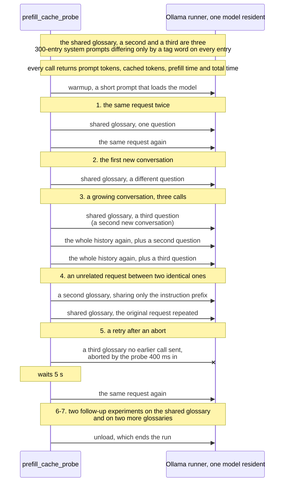
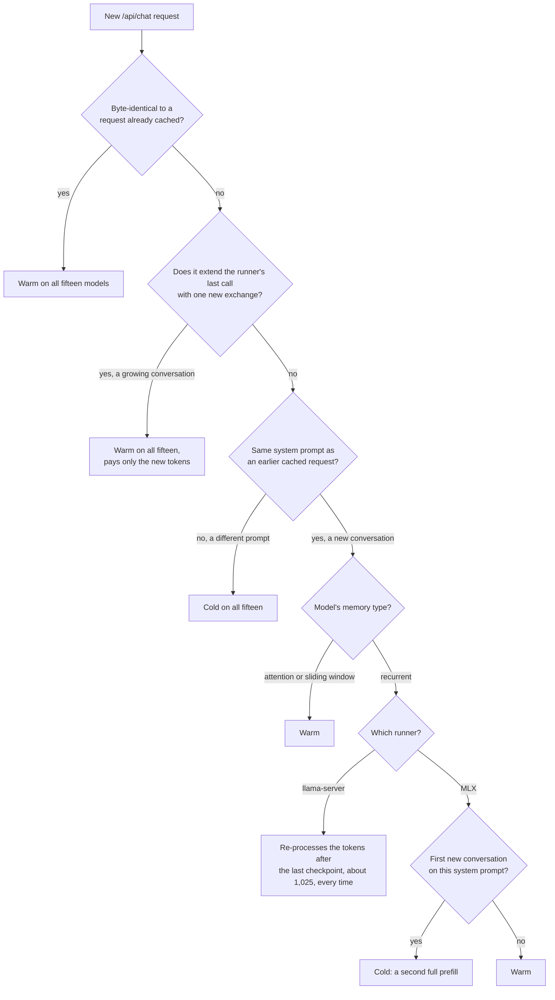
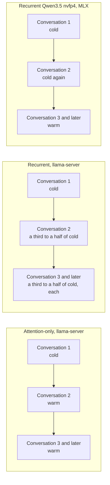
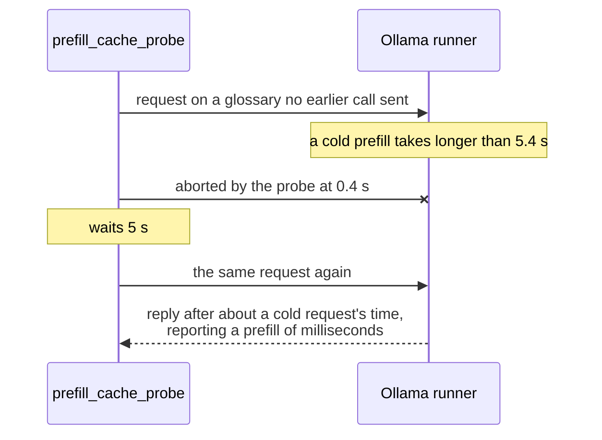

# Recurrent-memory models on Ollama re-process a cached system prompt for new conversations

In
[`freemansoft/Flutter-AdaptiveCards`](https://github.com/freemansoft/Flutter-AdaptiveCards)
a demonstration Dart chat server asks a local Ollama model for an answer as
Adaptive Card JSON. That is a strict, closed-vocabulary schema, and a Flutter
app renders it as interactive UI rather than as text. The request is expensive.
The card system prompt that describes the element vocabulary is estimated at
3,755 tokens. The chat server replays up to ten prior exchanges on every
turn.

Ollama keeps a prefix cache, so a request whose opening tokens match an earlier
one does not have to process them again. How much does that cache save a chat
server, and when does it miss? Ollama 0.33.3 and later report
`prompt_eval_cached_count` on every reply, which is the field that measures it.
Every reading below comes from
[`ModelBehavior.md`](https://github.com/freemansoft/Flutter-AdaptiveCards/blob/main/adaptive_chat_server_dart/ModelBehavior.md),
the lab notebook in that repository.

**Whether a new conversation reuses the cache depends on the model's memory
type.** A probe measured fifteen local models on one Apple M1 Max under Ollama
0.34.0. The eight with attention-only memory reused a cached system prompt for
new conversations on all but one call. The seven with recurrent memory did not:
five confirmed recurrent by `llama-server`'s own log, and two inferred from
their model family. On Ollama's `llama-server`, four of the five re-processed
the last 1,025 tokens of the prompt on every new conversation, a third to a
half of a cold prefill. The fifth did so on some. On Ollama's MLX runner, two
re-processed the whole prompt for the first new conversation and almost none of
it afterward.

## Terms used in this article

The article uses these words with a specific meaning. Field names are Ollama's
own.

| Term                           | What it means here                                                                                                                                                                                                                          |
| ------------------------------ | ------------------------------------------------------------------------------------------------------------------------------------------------------------------------------------------------------------------------------------------- |
| **Runner**                     | The process Ollama starts to serve one loaded model. Here it is `llama-server` for the thirteen GGUF builds and the MLX runner for the two safetensors builds. Ollama's server log names the one it starts. The prefix cache belongs to it. |
| **Prefill**                    | The pass in which the model processes the prompt, before it produces the first output token. Ollama reports its duration as `prompt_eval_duration`.                                                                                         |
| **Prefix cache**               | Prompt tokens the runner has already processed and kept. A new request can reuse the opening run of tokens it shares with a cached request, as far as the runner can restore it.                                                            |
| **`prompt_eval_count`**        | The number of prompt tokens Ollama reports for a request.                                                                                                                                                                                   |
| **`prompt_eval_cached_count`** | How many of those tokens came from the prefix cache.                                                                                                                                                                                        |
| **Cold** and **warm**          | A cold prefill is one the cache serves almost none of. A warm request has nearly all of its prompt served from the cache.                                                                                                                   |
| **New conversation**           | A request carrying a system prompt the runner has already processed, followed by a question it has not seen. It is how a chat server opens a second conversation on the same system prompt.                                                 |
| **Recurrent memory**           | Layers that carry a running state from token to token instead of keeping an entry per token. The state cannot be rewound to an arbitrary token. `llama-server` prints `llama_memory_recurrent` when it loads such a model.                  |
| **Context checkpoint**         | A saved copy of that state at one token position. A runner can resume a recurrent model only from a checkpoint. `llama-server` logs each one it creates and restores.                                                                       |
| **Sliding window**             | Attention layers that see only the last few tokens, 128 in `gpt-oss:20b`. `llama-server` handles them with the same checkpoints.                                                                                                            |
| **`num_ctx`**                  | The context window the request asks for, in tokens. Every run here asks for 8,192.                                                                                                                                                          |

## The probe sends five request patterns, then two follow-up experiments

[`prefill_cache_probe.dart`](https://github.com/freemansoft/Flutter-AdaptiveCards/blob/main/adaptive_chat_server_dart/tool/model_probes/prefill_cache_probe.dart)
builds its own system prompts rather than sending the card one. Each is a
synthetic glossary of 300 entries, and they differ only in a tag word that
prefixes every entry. The first, the shared glossary, carries most of the
requests. The probe sends them to one model at a time, at temperature 0. It
records the token counts, the prefill time and the total time of each call. A
warmup call loads the model first, so a cold prefill below is the cost of the
prompt, not of the model load. The first four patterns are shapes a chat server
produces. The fifth prices a retry after a timeout:

- the same request twice;
- the shared glossary with a different question, a new conversation;
- a conversation that grows by one exchange at a time, with the history
  replayed;
- an unrelated request between two identical ones, as when two users share a
  server, carrying a second glossary;
- a retry after the probe aborts a call 400 ms in, waits 5 s, and sends it
  again, on a third glossary.



With patterns 2 and 3, the follow-up experiments bring the probe to fifteen
new conversations per model, three of them the first on their glossary. A glossary replaces the card system prompt
so that the probe can vary it:

```txt
You are a helpful assistant. Answer briefly. Reference glossary: alpha-term0
means concept0. alpha-term1 means concept7. alpha-term2 means concept14. ...
```

Three hundred entries come to about 2,130 to 3,480 tokens depending on the
tokenizer, against the card prompt's estimated 3,755. The readings are about
reusing a long system prompt at that scale, not about the card prompt itself.
The probe sizes each glossary to fit the window. A first version sent a prompt
larger than `num_ctx`, Ollama truncated it without an error, and every cache
figure read near zero. The [measurement-hygiene
article](https://joe.blog.freemansoft.com/2026/09/eight-measurement-rules-from-local.html)
covers that mistake.

## Exact repeats and growing conversations reuse the cache on all fifteen models

Each model ran the full probe once on 2026-09-21 or 2026-09-22.
`llama3.2:latest`, `qwen3-coder:30b`, `qwen3.8:27b-nvfp4` and
`qwen3.6:27b-coding-nvfp4` also ran the first five or six phases twice more,
and every token count repeated except the retry's. On every model, an exact
repeat left 1 to 5 tokens uncached. Each turn of a growing conversation
re-evaluated only its new exchange, 10 to 37 tokens. The length of the history
does not set the per-turn cost. On the recurrent models on `llama-server`, the
log shows the runner restoring the checkpoint it saved at the end of the
previous call. The unrelated request reused at most 28 tokens and paid a full
prefill of its own prompt.

`llama3.2:latest` and `qwen3.8:27b-nvfp4` first ran the five patterns under
Ollama 0.33.3, on 2026-09-04 and 2026-09-05. Under 0.34.0 every token count in
those runs repeated, except the retry's.

## A new conversation's cost depends on the memory type

The memory type comes from `llama-server`'s load output in Ollama's server log.
Each cell gives cached tokens, then the prefill time. Prompts ran 2,128 to 3,479
tokens, and a new conversation shares all but about 10 of them with the cached
prompt:

| Model                                  | Memory               | Runner         | Cold first request | First new conversation, 3 calls              | Later new conversations, 12                  |
| -------------------------------------- | -------------------- | -------------- | ------------------ | -------------------------------------------- | -------------------------------------------- |
| `llama3.2:latest`                      | attention            | `llama-server` | 1.9–2.9 s          | 2,136, 42–69 ms                              | 2,136, 39–71 ms                              |
| `qwen3-coder:30b`                      | attention            | `llama-server` | 4.1–7.1 s          | 3,167, 75–109 ms                             | 3,167–3,168, 73–118 ms                       |
| `qwen2.5-coder:7b`                     | attention            | `llama-server` | 7.3–9.3 s          | 3,167, 101–134 ms                            | 3,167–3,168, 103–134 ms                      |
| `llama3-chatqa:8b`                     | attention            | `llama-server` | 4.1–5.9 s          | 2,121, 98–139 ms                             | 2,121, 75–103 ms                             |
| `llama3-groq-tool-use:8b`              | attention            | `llama-server` | 4.1–5.9 s          | 2,126, 90–123 ms                             | 2,126, 94–134 ms                             |
| `granite4.1:3b`                        | attention            | `llama-server` | 2.2–3.2 s          | 2,124, 49–55 ms                              | 2,124, 46–75 ms                              |
| `granite4.1:8b`                        | attention            | `llama-server` | 5.7–7.8 s          | 2,124, 123–175 ms                            | 2,124, 118–174 ms                            |
| `gpt-oss:20b`                          | sliding window       | `llama-server` | 2.4–3.1 s          | 2,187, 60–73 ms                              | 2,187 on 11; 1,167 once (1.6 s)              |
| `qwen3.5:9b`                           | recurrent            | `llama-server` | 8.7–11.0 s         | 2,152, 3.4–4.0 s                             | 2,152–2,153, 3.2–3.8 s                       |
| `nemotron-3-nano:4b`                   | recurrent            | `llama-server` | 5.4–6.4 s          | 2,454, 2.0 s                                 | 2,454–2,455, 2.0–2.1 s                       |
| `nemotron-3-nano:30b`                  | recurrent            | `llama-server` | 4.0–5.3 s          | 2,153, 1.6–1.8 s                             | 2,153–2,154, 1.7–1.9 s                       |
| `nemotron-3.5-lightning:30b`           | recurrent            | `llama-server` | 4.2–5.2 s          | 2,153, 1.7 s                                 | 2,153–2,154, 1.7–1.8 s                       |
| `unsloth/Nemotron-3-Nano-30B-A3B-GGUF` | recurrent            | `llama-server` | 4.1–5.0 s          | 2,154 twice (1.5–1.7 s); 3,162 once (0.17 s) | 3,162 on 9 (0.17–0.18 s); 2,154 on 3 (1.8 s) |
| `qwen3.8:27b-nvfp4`                    | recurrent (inferred) | MLX            | 35.4–37.2 s        | 4–15, 36.5–37.8 s                            | 3,166–3,167, 398–432 ms                      |
| `qwen3.6:27b-coding-nvfp4`             | recurrent (inferred) | MLX            | 35.7–36.4 s        | 5–16, 35.3–36.7 s                            | 3,167–3,168, 417–491 ms                      |

All seven attention-only models were warm on every new conversation. So was
`gpt-oss:20b`, except once, when `llama-server` rolled it back to a checkpoint
at 1,167 tokens. The four Ollama-library recurrent builds on `llama-server`
reused about 2,150 to 2,450 tokens on every new conversation, the first
included, and re-processed the last 1,025. That cost 1.6 to 4.0 s against 4.0
to 11.0 s cold, a third to a half. The unsloth build of the same Nemotron
weights did so when the call before was an exact repeat or an extension. After
any other call it restored almost the whole prompt. The two MLX-served builds
paid a full cold prefill for the first new conversation on each glossary and
reused almost the whole prompt after that.

## Recurrent models resume only from a saved checkpoint, and the runners save them differently

`llama-server` logs why a recurrent model loses tokens. On the first new
conversation for `qwen3.5:9b` it prints `forcing full prompt re-processing due
to lack of cache data (likely due to SWA or hybrid/recurrent memory …)`. The
next line reads `restored context checkpoint (… n_tokens = 2152 …)`. While
processing the prompt it had created two checkpoints: one at 2,152 tokens,
1,025 before the end, and one at the end. A new conversation diverges about 10
tokens from the end, which makes the end checkpoint unusable, so the runner
resumes from 2,152. The log does not say why the unsloth Nemotron build
sometimes keeps a closer checkpoint.

The MLX runner logs a `prefix_cache` line for each request. For the first new
conversation it reads `matched=3166 cached=4`, and for later ones `matched=3166
cached=3166`. That is consistent with the runner keeping a restorable state
only at the end of a processed prompt. It would then add one at the point of
divergence once a request has diverged there. The policy is inferred from the
log, not read from source. `llama-server` confirms recurrent memory for the
GGUF build of the Qwen3.5 family (`qwen35`). For the MLX builds (`qwen3_5`) it
is inferred from the family.

A `first-divergence` experiment shows the two policies side by side. It sends
three new conversations on each of two glossaries the model had not yet seen.
Arm `delta` goes straight from the first request to them. Arm `echo` sends the
same request twice first. Each cell reads prompt / cached, with the prefill
time in parentheses where it matters:

| Model               | Arm   | first request      | exact repeat | new conversation 1     | 2           | 3           |
| ------------------- | ----- | ------------------ | ------------ | ---------------------- | ----------- | ----------- |
| `llama3.2:latest`   | delta | 2143 / 28 (2.8 s)  |              | 2143 / 2136 (46 ms)    | 2143 / 2136 | 2143 / 2136 |
| `llama3.2:latest`   | echo  | 2143 / 28 (2.9 s)  | 2143 / 2142  | 2143 / 2136 (69 ms)    | 2143 / 2136 | 2143 / 2136 |
| `qwen3.5:9b`        | delta | 3176 / 0 (11.0 s)  |              | 3176 / 2152 (3.4 s)    | 3176 / 2152 | 3177 / 2152 |
| `qwen3.5:9b`        | echo  | 3176 / 0 (9.9 s)   | 3176 / 3172  | 3176 / 2152 (3.4 s)    | 3176 / 2152 | 3177 / 2152 |
| `qwen3.8:27b-nvfp4` | delta | 3176 / 15 (37.2 s) |              | **3176 / 15 (36.5 s)** | 3176 / 3166 | 3177 / 3166 |
| `qwen3.8:27b-nvfp4` | echo  | 3176 / 15 (36.9 s) | 3176 / 3171  | **3176 / 15 (36.8 s)** | 3176 / 3166 | 3177 / 3166 |

The attention-only model is warm from the first new conversation. The recurrent
model on `llama-server` pays the same partial cost on every one. The recurrent
build on MLX pays a full prefill once, with or without an exact repeat before
it, and nothing after. An `ordering` experiment sent seven more new
conversations on the shared glossary. Each followed an exact repeat, another
new conversation, a growing conversation, or a request on another glossary.
What came just before a new conversation mattered only for the unsloth Nemotron
build, and once for `gpt-oss:20b`, whose rollback followed an exact repeat.



Over a model load, the three groups pay for a system prompt differently:



## The fifteen models leave two questions open

Every MLX-served model measured is an `nvfp4` build of the Qwen3.5 family. The
runs show a recurrent architecture losing cache on both runners, and the two
runners losing different amounts. They do not separate the MLX runner's
checkpoint policy from the `nvfp4` quantization, since no other quantization
ran on MLX. A checkpoint policy is a runner behavior, which makes the runner
the likelier cause, but no run has shown it. An attention-only model served on
the MLX runner would test the policy directly. None is installed.

The eleven models added on 2026-09-22 ran once each, from one client sending
requests one at a time. The 1,025-token rollback is where `llama-server`
placed its checkpoint for prompts of this size, and a different prompt length
may move it.

## A retry after an abort costs about a cold request when the prefill outlasts the wait

The retry sends a glossary no earlier call had sent, so only the aborted call
could have filled the cache. Nearly every retry reused almost the whole prompt,
but the prefill time alone understates what it cost. The total time of the
call includes any wait behind the abandoned prefill. On a model whose cold
prefill outlasts the probe's timing, the sequence runs:



| Model                      | Cold prefill | Retry: prefill, total                      |
| -------------------------- | ------------ | ------------------------------------------ |
| `llama3.2:latest`          | 1.9–2.9 s    | 36 ms, 157 ms                              |
| `granite4.1:3b`            | 2.2–3.2 s    | 28 ms, 177 ms                              |
| `gpt-oss:20b`              | 2.4–3.1 s    | 19 ms, 1.0 s                               |
| `nemotron-3-nano:30b`      | 4.0–5.3 s    | 68 ms, 2.2 s                               |
| `granite4.1:8b`            | 5.7–7.8 s    | 35 ms, 4.1 s                               |
| `qwen2.5-coder:7b`         | 7.3–9.3 s    | 31 ms, 5.0 s                               |
| `qwen3.5:9b`               | 8.7–11.0 s   | 103 ms, 10.5 s                             |
| `qwen3.8:27b-nvfp4`        | 35.3–37.2 s  | 156 ms to 17.6 s, 37.4–42.8 s (three runs) |
| `qwen3.6:27b-coding-nvfp4` | 35.7–39.2 s  | 142–179 ms, 43.9–47.3 s (three runs)       |

The retry's total grows with how much of the abandoned prefill the 0.4 s abort
and 5 s wait leave uncovered, on both runners. That is consistent with the
retry waiting for the abandoned prefill to finish; the probe does not observe
server-side progress directly. On `qwen3.8:27b-nvfp4` the retry also cached
only 2,063 tokens on two of three runs. A fourth run, with a 200-entry
glossary, stopped there too (2,063 of 2,292). A stopping point that does not
move with prompt length is consistent with a restore boundary inside the MLX
runner, which is not confirmed.

## Three checks for a chat server on a shared system prompt

Read `prompt_eval_cached_count` and the total time on every reply. The cached
count is the only field that separates a served prefix from a re-evaluated
one, and the prefill time alone can hide a wait.

Check each model's memory type before counting on the cache for new
conversations. `llama-server` prints `llama_memory_recurrent` in Ollama's
server log when it loads a recurrent model, and the log names the runner.

For a recurrent model, budget the new-conversation cost by runner. On
`llama-server` it was a third to a half of a cold prefill on every new
conversation. On the MLX builds measured here it was one extra full prefill per
system prompt per model load. How many cached prefixes a runner keeps, and what
it evicts under memory pressure, were not measured.

The repository is
[https://github.com/freemansoft/Flutter-AdaptiveCards](https://github.com/freemansoft/Flutter-AdaptiveCards),
and the lab notebook every figure above comes from is at
[https://github.com/freemansoft/Flutter-AdaptiveCards/blob/main/adaptive_chat_server_dart/ModelBehavior.md](https://github.com/freemansoft/Flutter-AdaptiveCards/blob/main/adaptive_chat_server_dart/ModelBehavior.md).
