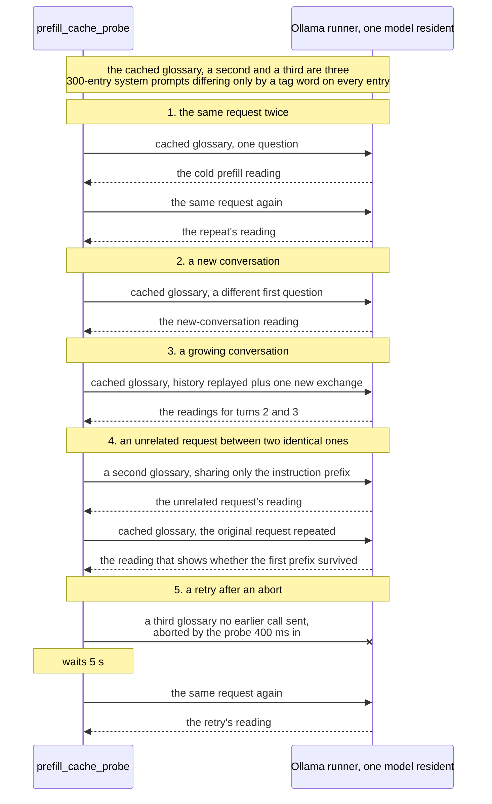
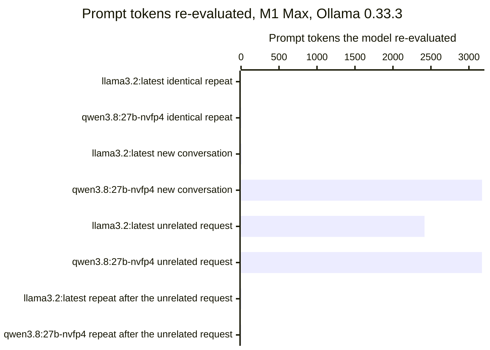

# Ollama's prompt cache reused a shared system prompt across conversations on one model and not on the other

In
[`freemansoft/Flutter-AdaptiveCards`](https://github.com/freemansoft/Flutter-AdaptiveCards)
a demonstration Dart chat server asks a local Ollama model for an answer as
Adaptive Card JSON. That is a strict, closed-vocabulary schema, and a Flutter
app renders it as interactive UI rather than as text. The request is expensive.
The card system prompt that describes the element vocabulary is estimated at
about 3,755 tokens. The chat server replays up to ten prior exchanges on every
turn.

Ollama keeps a prefix cache, so a request whose opening tokens match an earlier
one does not have to process them again. How much does that cache save a chat
server, and when does it miss? Ollama 0.33.3 reports
`prompt_eval_cached_count` on every reply, which is the field that measures it.
Every reading below comes from
[`ModelBehavior.md`](https://github.com/freemansoft/Flutter-AdaptiveCards/blob/main/adaptive_chat_server_dart/ModelBehavior.md),
the lab notebook in that repository.

**The answer differs by model.** `llama3.2:latest` reused a cached system
prompt on every pattern the probe sent. A second conversation cost it tens of
milliseconds instead of two seconds. `qwen3.8:27b-nvfp4` reused the same prompt
inside a conversation. It missed entirely at the start of a new one, paying
about 40 seconds of prefill every time. Both models ran under Ollama 0.33.3.

## Terms used in this article

The article uses these words with a specific meaning. Field names are Ollama's
own.

| Term                           | What it means here                                                                                                                                  |
| ------------------------------ | --------------------------------------------------------------------------------------------------------------------------------------------------- |
| **Runner**                     | The process Ollama starts to serve one loaded model. The prefix cache belongs to it rather than to the server as a whole.                           |
| **Prefill**                    | The pass in which the model processes the prompt, before it produces the first output token. Ollama reports its duration as `prompt_eval_duration`. |
| **Prefix cache**               | Prompt tokens the runner has already processed and kept. A new request reuses them as far as its opening tokens match.                              |
| **`prompt_eval_count`**        | The number of prompt tokens Ollama reports for a request.                                                                                           |
| **`prompt_eval_cached_count`** | How many of those tokens came from the prefix cache. Ollama 0.33.3 reports it on every reply.                                                       |
| **Cold prefill**               | A prefill the cache serves almost none of. This is about the cache, not about history: a request with no history can still reuse a cached prefix.   |
| **`num_ctx`**                  | The context window the request asks for, in tokens. Every run here asks for 8,192.                                                                  |

## The probe sends five request patterns a chat server produces

[`prefill_cache_probe.dart`](https://github.com/freemansoft/Flutter-AdaptiveCards/blob/main/adaptive_chat_server_dart/tool/model_probes/prefill_cache_probe.dart)
builds its own system prompts rather than sending the card one, each a
synthetic glossary of 300 entries. The three it builds are identical except for
a tag word that prefixes every entry. They therefore tokenize to within a few
hundred tokens of each other, and all three share the same short instruction
prefix. Four of the five patterns send the first, called the cached glossary
below. The unrelated request sends the second and the retry the third. The
probe sends these to one model at a time and records the token counts and the
prefill time for each call. Every run is at temperature 0 with one model
resident. The patterns are the ones a chat server sends:

- the same request twice;
- the cached glossary with a different first question, which is what a new
  conversation looks like;
- a conversation that grows by one exchange at a time, with the history
  replayed;
- an unrelated request between two identical ones, as when two users share a
  server, carrying a second glossary;
- a retry after the probe aborts a call 400 ms in, waits 5 s, and sends it
  again, on a third glossary no earlier call has sent.

A glossary replaces the card system prompt so that the probe can vary it. The
glossary measures 2,143 tokens on `llama3.2:latest` and 3,176 on
`qwen3.8:27b-nvfp4`, against the card prompt's estimated 3,755. The readings
below are therefore about reusing a long system prompt at that scale, not about
the card prompt itself. The probe also asks for a smaller window than the chat
server does, 8,192 tokens against 16,384.

The probe sizes each glossary to fit the window on purpose. A first version of
the probe sent a prompt larger than `num_ctx`. Ollama cut it short without an
error, and every cache figure read near zero. The
[measurement-hygiene article](https://joe.blog.freemansoft.com/2026/09/eight-measurement-rules-from-local.html)
in this series covers that mistake. The check is that `prompt_eval_count` grows
when the history does.

## `llama3.2:latest` paid its system prompt once per resident model, not once per conversation

The readings below show how much of each request the prefix cache served, and
how much prefill time remained. Compare each cached count with its prompt
count, and each prefill with the cold one in the first row. Figures separated
by commas are separate runs of the probe, except in a growing-conversation row,
where they are the successive turns. An arrow runs from a cold prefill to the
warm repeat that followed it in the same run. The notebook's
[prompt-cache section](https://github.com/freemansoft/Flutter-AdaptiveCards/blob/main/adaptive_chat_server_dart/ModelBehavior.md#prompt-cache-reuse-and-retry-cost-measured-with-prompt_eval_cached_count)
records every run in this article.

The first table holds readings from an Apple M5 / 16 GB, recorded as Ollama
0.33.3.

| Pattern, M5, `llama3.2:latest`                         | prompt / cached          | prefill         |
| ------------------------------------------------------ | ------------------------ | --------------- |
| identical request repeated                             | 2143 / 2142              | 2017 ms → 18 ms |
| new conversation: a different question                 | 2144 / 2136              | 60 ms           |
| growing conversation, turns 2 and 3                    | 2166 / 2150, 2188 / 2173 | ~94 ms per turn |
| the original request repeated after an unrelated one   | 2143 / 2136              | 55 ms           |
| retry after aborting mid-prefill (400 ms in, 5 s wait) | 2444 / 2443              | 29 ms           |

The M5 run is from 2026-09-03, a single run taken before the probe could
archive one and transcribed from terminal output. No result file stamps its
Ollama version. The 0.33.3 attribution is the notebook's record of the session,
and the same host's archived sweeps five days earlier ran 0.33.1.

A conversation step pays prefill for its new tokens only. The model
re-evaluated about 15 tokens on each of turns 2 and 3, so history size does not
set the per-step cost. The probe's `turn-2` and `turn-3` each add the model's
reply and one new question. A step here is an exchange rather than a single
message. A new conversation cost the model 8 re-evaluated tokens, so a second
conversation starts warm.

The same probe ran on an Apple M1 Max / 64 GB under the same Ollama 0.33.3,
holding the model fixed and changing the host. The M1 Max run timed each
turn, so this table gives the growing conversation a row apiece.

| Pattern, M1 Max, `llama3.2:latest`                     | prompt / cached | prefill         |
| ------------------------------------------------------ | --------------- | --------------- |
| identical request repeated                             | 2143 / 2142     | 2079 ms → 12 ms |
| new conversation: a different question                 | 2144 / 2136     | 87 ms, 42 ms    |
| growing conversation, turn 2                           | 2166 / 2150     | 54 ms           |
| growing conversation, turn 3                           | 2188 / 2173     | 53 ms           |
| the unrelated request itself                           | 2444 / 28       | 2170 ms         |
| the original request repeated after an unrelated one   | 2143 / 2136     | 39 ms           |
| retry after aborting mid-prefill (400 ms in, 5 s wait) | 2444 / 2443     | 30 ms           |

`llama3.2:latest` reproduced the M5 pattern on every row the two tables share.
The M1 Max table adds one the M5 run did not record separately: the unrelated
request itself. It reused 28 of 2,444 tokens and paid close to a full cold
prefill, 2,170 ms. That is expected. Its glossary shares only a short
instruction prefix with the cached one, so there is little to reuse. Every
such reading in the notebook,
across both models, lands within 15% of what a cold prefill cost in the same
run. The identical-repeat row carries one run. The 2026-09-05 archived run read
1900 ms → 11 ms for it, and matched this table on every other row it repeated.

## An identical repeat and a growing conversation reuse the cache on both models

The probe ran once more on the same M1 Max, this time against a second model.
`qwen3.8:27b-nvfp4` is a build Ollama reports as `nvfp4` quantization. At
16.9 GB it is too large for the M5's 16 GB, so it ran on the M1 Max only,
under the same Ollama 0.33.3. `llama3.2:latest` is a 1.9 GB `Q4_K_M` build, so
the two differ by about nine times in size as well as in quantization.

| Pattern, M1 Max, `qwen3.8:27b-nvfp4`                   | prompt / cached                       | prefill                      |
| ------------------------------------------------------ | ------------------------------------- | ---------------------------- |
| identical request repeated                             | 3176 / 3171                           | 37779 ms → 133 ms, 158 ms    |
| new conversation: a different question                 | 3177 / 4, 3177 / 4, 3177 / 4          | 40426 ms, 40377 ms, 37615 ms |
| growing conversation, turn 2                           | 3207 / 3172                           | 812 ms                       |
| growing conversation, turn 3                           | 3237 / 3202                           | 804 ms                       |
| the unrelated request itself                           | 3176 / 4, 3176 / 4, 3176 / 4          | 40381 ms, 40604 ms, 37815 ms |
| the original request repeated after an unrelated one   | 3176 / 3171, 3176 / 3171, 3176 / 3171 | 215 ms, 205 ms, 198 ms       |
| retry after aborting mid-prefill (400 ms in, 5 s wait) | 3477 / 3472, 3477 / 2063, 3477 / 3472 | 148 ms, 18154 ms, 142 ms     |

All the M1 Max runs are from 2026-09-04 and 2026-09-05. The new-conversation
and unrelated-request rows came back as misses, so the probe ran its five
patterns again on the same host with nothing else running. A second reading
rules out a one-off scheduling or contention artifact. The identical-repeat and growing-conversation rows carry the
2026-09-04 runs. On the 2026-09-05 archived run they read 34277 ms → 183 ms,
768 ms and 770 ms. Ollama reports 3,176 tokens for this model's whole glossary
request and 2,143 for `llama3.2:latest`. The
[dropped-history article](https://joe.blog.freemansoft.com/2026/09/ollama-silently-drops-history-message.html)
in this series measures the same two builds on a different shared text, at 2.99
and 4.30 characters per token. The gap here is consistent with it.

Three readings hold for the larger model. An identical repeat falls from 34 to
38 seconds to under 200 ms. A growing conversation pays 812 ms and 804 ms for
its two turns, against a cold prefill in the tens of seconds. The original
request stays cached after an unrelated one.

The fourth reading is the unrelated request itself, a near-total miss on this
model too at 4 cached tokens of 3,176. The cause is the same as on
`llama3.2:latest`: a glossary that shares only the instruction prefix.

The chart below plots what four of the patterns cost in work rather than in
time. Each bar is prompt tokens minus cached tokens, which is what each model
had to re-evaluate. A short bar means the cache served the request. Prefill
time spans 12 ms to 40 seconds across these two models, so a chart of
milliseconds would show only that the larger model is slower. The chart leaves
the growing conversation out, because at 15 and 35 re-evaluated tokens it is
indistinguishable from the other hits at this scale.

Three of the eight bars are tall. Two are the unrelated request on each model,
which is expected. The third is a new conversation on `qwen3.8:27b-nvfp4`.

## `qwen3.8:27b-nvfp4` re-evaluated a byte-identical system prompt on every new conversation

**Unlike the unrelated request, this miss has no structural explanation.** The
cached glossary is byte-identical and only the short question differs.
`llama3.2:latest` reused 2,136 of 2,144 tokens. `qwen3.8:27b-nvfp4` reused 4 of
3,177 on three independent runs and paid a cold prefill each time, 37.6 to
40.4 seconds. An unarchived same-day rerun read 4 cached tokens as well, at
36,685 ms; the notebook records it as corroboration rather than a fourth
measurement.

The cost of that miss is the whole system prompt. On `llama3.2:latest` a new
conversation costs 42 to 87 ms of prefill on the M1 Max and 60 ms on the M5,
once the glossary is cached. On `qwen3.8:27b-nvfp4` it costs a full cold
prefill, the same as the first request after a model load. A chat server that
starts
many short conversations on that model pays the full prefill every time. Within
one conversation, both models reuse the cache on every exchange.

The cause is not established. The probe reports `prompt_eval_cached_count`, not
the runner's matching rule. Three explanations fit the readings:

- a matching rule specific to the model or to the `nvfp4` quantization;
- a prompt-length effect above roughly 3,000 tokens, where `llama3.2:latest`
  sends 2,144 tokens and `qwen3.8:27b-nvfp4` sends 3,177;
- a limit on how many prefixes the runner keeps.

Separating them needs a probe that varies prompt length on one model.

## The retry after an abort cost a warm repeat on `llama3.2:latest` and varied by two orders of magnitude on `qwen3.8:27b-nvfp4`

The retry sends a third glossary no earlier call had sent, so only the aborted
call could have filled the cache. On `llama3.2:latest` it cost 29 ms on the M5
and 30 ms on the M1 Max, against a cold prefill of about 2,000 ms.

On `qwen3.8:27b-nvfp4` the same step varied. Two counted runs read 148 ms and
142 ms with 3,472 of 3,477 tokens cached, and an unarchived same-day rerun read
142 ms as well. A third counted run read 18,154 ms with 2,063 of 3,477 cached.
Three counted readings do not establish a rate.

The probe aborts at a fixed 400 ms and waits a fixed 5 s, and those constants
mean different things to the two models. On `llama3.2:latest` the abort lands a
fifth of the way into a 2,079 ms prefill. The wait is more than twice the whole
prefill, so the abandoned call could have finished server-side before the retry
went out. On `qwen3.8:27b-nvfp4` the abort lands 1% of the way into a
37,779 ms prefill, and 5 s cannot finish it. **The two arms are not the same
experiment**, and the spread between them is at least partly those constants
rather than the models. How much prefill completed before each abort landed is
a plausible reason for the variance within the larger model's runs. The probe
does not observe server-side progress, so neither reading is confirmed.

## Three checks for a chat server that reuses a system prompt

Two of these change how you measure a model, and one changes what the server
budgets for.

| Check                                                            | Why                                                                                                                                      |
| ---------------------------------------------------------------- | ---------------------------------------------------------------------------------------------------------------------------------------- |
| Read `prompt_eval_cached_count` on every reply                   | It is the only signal that separates a served prefix from a re-evaluated one, and nothing else in the reply reports it.                  |
| Measure the new-conversation pattern rather than assuming it     | The same server code paid the prompt once per resident model on `llama3.2:latest` and once per conversation on `qwen3.8:27b-nvfp4`.      |
| Budget a first question at cold-prefill cost on an untried model | That is 2 seconds on one of these models and about 40 on the other, and no field in the reply predicts which behavior a model will show. |

These readings cover one model on two hosts and a second model on one host. The
M1 Max runs are stamped Ollama 0.33.3 in their result files; the M5 run is not
stamped. The probe did not measure how many prefixes the runner keeps, or what
it evicts under memory pressure.

The repository is
[https://github.com/freemansoft/Flutter-AdaptiveCards](https://github.com/freemansoft/Flutter-AdaptiveCards),
and the lab notebook every figure above comes from is at
[https://github.com/freemansoft/Flutter-AdaptiveCards/blob/main/adaptive_chat_server_dart/ModelBehavior.md](https://github.com/freemansoft/Flutter-AdaptiveCards/blob/main/adaptive_chat_server_dart/ModelBehavior.md).
