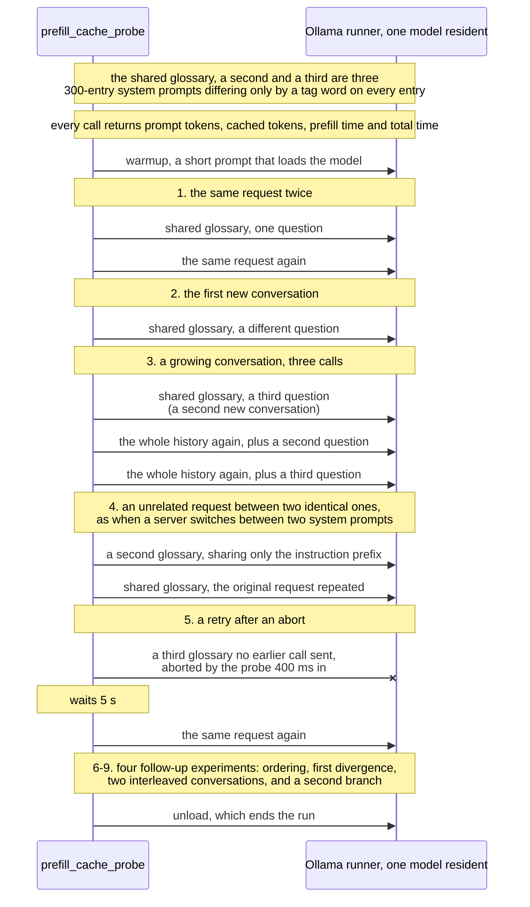
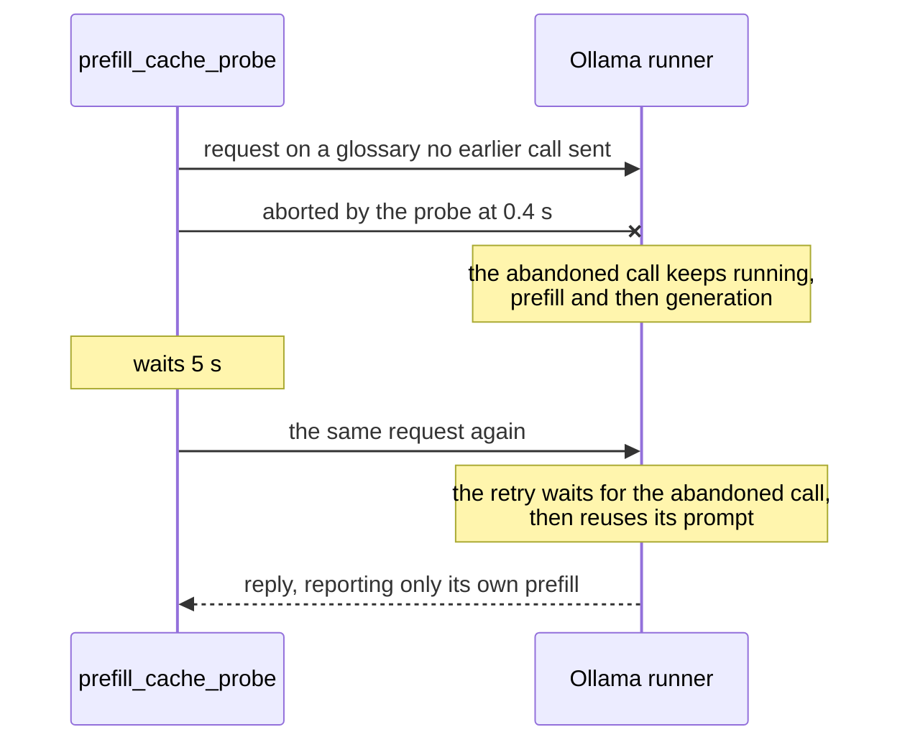
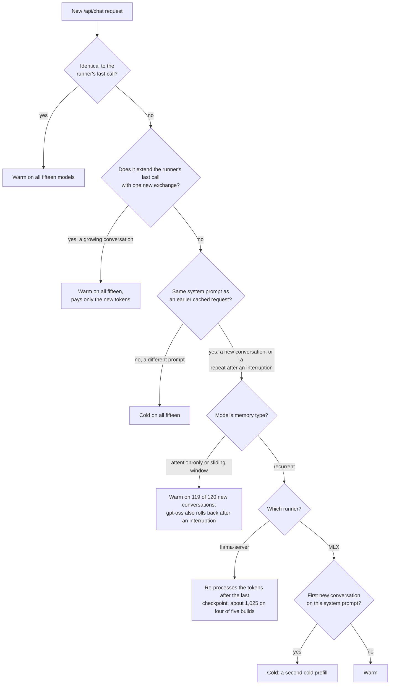

# On Ollama, a model's memory type decides whether a new conversation reuses the cached system prompt

In
[`freemansoft/Flutter-AdaptiveCards`](https://github.com/freemansoft/Flutter-AdaptiveCards)
a demonstration Dart chat server asks a local Ollama model for an answer as
Adaptive Card JSON. That is a strict, closed-vocabulary schema, and a Flutter
app renders it as interactive UI rather than as text. Each request carries a
long prompt.
The card system prompt that describes the element vocabulary is estimated at
3,755 tokens. The chat server replays up to ten prior exchanges on every
turn.

Ollama keeps a prefix cache, so a request whose opening tokens match an earlier
one does not have to process them again. How much does that cache save a chat
server, and when does it miss? Ollama 0.33.3 and later report
`prompt_eval_cached_count` on every reply, which is the field that measures it.
Every reading below comes from
[`ModelBehavior.md`](https://github.com/freemansoft/Flutter-AdaptiveCards/blob/main/adaptive_chat_server_dart/ModelBehavior.md),
the lab notebook in that repository.

**A new conversation reuses a cached system prompt on some models and not on
others, and the split follows how the model stores its context.** A probe
measured fifteen local models on one Apple M1 Max under Ollama 0.34.0. Eight
store context as attention entries, one token at a time, and they reused the
cached prompt on 119 of 120 new conversations. The other seven carry a running
state, which a runner can restore only from a saved checkpoint. On Ollama's
`llama-server` runner, four of them re-processed the last 1,024 or 1,025 tokens
of the request on every new conversation. That is a fixed cost: a quarter of a
4,800-token prompt, and all of a 1,000-token one. A fifth did so on some. On
Ollama's MLX runner, two re-processed the whole prompt for the first new
conversation on a system prompt and almost none of it afterward.

## Terms used in this article

The article uses these words with a specific meaning. Field names are Ollama's
own.

| Term                           | What it means here                                                                                                                                                                                                                          |
| ------------------------------ | ------------------------------------------------------------------------------------------------------------------------------------------------------------------------------------------------------------------------------------------- |
| **Runner**                     | The process Ollama starts to serve one loaded model. Here it is `llama-server` for the thirteen GGUF builds and the MLX runner for the two safetensors builds. Ollama's server log names the one it starts. The prefix cache belongs to it. |
| **Prefill**                    | The pass in which the model processes the prompt, before it produces the first output token. Ollama reports its duration as `prompt_eval_duration`.                                                                                         |
| **Prefix cache**               | Prompt tokens the runner has already processed and kept. A new request can reuse the opening run of tokens it shares with a cached request, as far as the runner can restore it.                                                            |
| **`prompt_eval_cached_count`** | How many of those tokens came from the prefix cache.                                                                                                                                                                                        |
| **Cold** and **warm**          | A cold request has almost none of its prompt served from the cache. A warm request has nearly all of it.                                                                                                                                    |
| **New conversation**           | A request carrying a system prompt the runner has already processed, followed by a question it has not seen. It is how a chat server opens a second conversation on the same system prompt.                                                 |
| **Attention-only memory**      | Layers that keep an entry per token, so a runner can reuse any leading run of a cached prompt. Seven models here, plus `gpt-oss:20b`, which adds a sliding window.                                                                          |
| **Recurrent memory**           | Layers that carry a running state from token to token instead of keeping an entry per token. The state cannot be rewound to an arbitrary token. `llama-server` prints `llama_memory_recurrent` when it loads such a model.                  |
| **Context checkpoint**         | A saved copy of that state at one token position. A runner can resume a recurrent model only from a checkpoint. `llama-server` logs each one it creates and restores.                                                                       |
| **Sliding window**             | Attention layers that see only the last few tokens, 128 in `gpt-oss:20b`. `llama-server` handles them with the same checkpoints.                                                                                                            |
| **`num_ctx`**                  | The context window the request asks for, in tokens. Every run here asks for 8,192.                                                                                                                                                          |

## The probe sends the five request shapes a chat server produces

[`prefill_cache_probe.dart`](https://github.com/freemansoft/Flutter-AdaptiveCards/blob/main/adaptive_chat_server_dart/tool/model_probes/prefill_cache_probe.dart)
builds its own system prompts rather than sending the card one. Each is a
synthetic glossary of 300 entries, and they differ only in a tag word that
prefixes every entry. The first, the shared glossary, carries most of the
requests. The probe sends them to one model at a time, at temperature 0. It
records the token counts, the prefill time and the total time of each call. A
warmup call loads the model first, so a cold prefill below is the cost of the
prompt, not of the model load. The first four patterns are shapes a chat server
produces, and the fifth measures what a retry after a timeout costs. The
diagram gives the call order, which matters because each call's cache state is
what the next one meets:



Eleven of the fifteen models ran the probe once, on 2026-09-22, from one client
sending requests one at a time. Two later experiments, on interleaved
conversations and on a second divergence branch, ran on 2026-09-23 against six
of the fifteen, and the sections that use them say so. `llama3.2:latest`, `qwen3-coder:30b` and the
two `nvfp4` builds ran the first five or six patterns twice more on 2026-09-21.
`llama3.2:latest` and `qwen3.8:27b-nvfp4` ran a third time at a different
glossary length. Every token count repeated except the retry's.

The probe opens fifteen new conversations per model, counting patterns 2 and 3
and the two follow-up experiments. Three of them are the first on their
glossary, and the tables report those three apart from the other twelve. A glossary replaces the card system prompt
so that the probe can vary it:

```txt
You are a helpful assistant. Answer briefly. Reference glossary: alpha-term0
means concept0. alpha-term1 means concept7. alpha-term2 means concept14. ...
```

Three hundred entries of the shared glossary come to 2,127 to 3,479 tokens
depending on the tokenizer, against the card system prompt's estimated 3,755.
Four models then ran the whole probe again on the chat server's own card system
prompt, 15 KB of prose, rules and a JSON schema, and every figure below held: 8
re-evaluated tokens on `llama3.2:latest`, 1,025 on both recurrent builds, and
one cold first new conversation on `qwen3.8:27b-nvfp4`. The checkpoint is
positional, so what sits at the boundary does not matter. The probe sizes each
glossary to fit `num_ctx`. An earlier version overflowed it, Ollama truncated
the prompt silently, and every cache figure read near zero. The
[measurement-hygiene
article](https://joe.blog.freemansoft.com/2026/09/eight-measurement-rules-from-local.html)
covers that mistake.

## Repeating the runner's last call reuses the cache on all fifteen models

A request the runner has just processed comes back warm on every model. An
immediate exact repeat left 1 to 5 tokens uncached. Each turn of a growing
conversation re-evaluated only its new exchange, 10 to 37 tokens. The length of
the history does not set the per-turn cost. Ollama's server log shows
`llama-server` restoring, for each of those turns, the checkpoint it saved at
the end of the previous call.

## Eight models stay warm on a new conversation and seven do not, by memory type

Every row comes from that model's seven-phase run on an Apple M1 Max under
Ollama 0.34.0. Each cell gives cached tokens, then the prefill time. Prompts ran 2,127 to
3,479 tokens, and a new conversation shares all but 5 to 11 of them with the
cached prompt. Columns count the three new conversations that open a glossary
apart from the twelve that follow one:

| Model                                  | Memory               | Runner         | Cold first request | First new conversation, 3 calls              | Later new conversations, 12                  |
| -------------------------------------- | -------------------- | -------------- | ------------------ | -------------------------------------------- | -------------------------------------------- |
| `llama3.2:latest`                      | attention            | `llama-server` | 1.9–2.9 s          | 2,136, 42–69 ms                              | 2,136, 39–71 ms                              |
| `qwen3-coder:30b`                      | attention            | `llama-server` | 4.1–7.1 s          | 3,167, 75–109 ms                             | 3,167–3,168, 73–118 ms                       |
| `qwen2.5-coder:7b`                     | attention            | `llama-server` | 7.3–9.3 s          | 3,167, 101–134 ms                            | 3,167–3,168, 103–134 ms                      |
| `llama3-chatqa:8b`                     | attention            | `llama-server` | 4.1–5.9 s          | 2,121, 98–139 ms                             | 2,121, 75–103 ms                             |
| `llama3-groq-tool-use:8b`              | attention            | `llama-server` | 4.1–5.9 s          | 2,126, 90–123 ms                             | 2,126, 94–134 ms                             |
| `granite4.1:3b`                        | attention            | `llama-server` | 2.2–3.2 s          | 2,124, 49–55 ms                              | 2,124, 46–75 ms                              |
| `granite4.1:8b`                        | attention            | `llama-server` | 5.7–7.8 s          | 2,124, 123–175 ms                            | 2,124, 118–174 ms                            |
| `gpt-oss:20b`                          | sliding window       | `llama-server` | 2.4–3.1 s          | 2,187, 60–73 ms                              | 2,187 on 11; 1,167 once (1.6 s)              |
| `qwen3.5:9b`                           | recurrent            | `llama-server` | 8.7–11.0 s         | 2,152, 3.4–4.0 s                             | 2,152–2,153, 3.2–3.8 s                       |
| `nemotron-3-nano:4b`                   | recurrent            | `llama-server` | 5.4–6.4 s          | 2,454, 2.0 s                                 | 2,454–2,455, 2.0–2.1 s                       |
| `nemotron-3-nano:30b`                  | recurrent            | `llama-server` | 4.0–5.3 s          | 2,153, 1.6–1.8 s                             | 2,153–2,154, 1.7–1.9 s                       |
| `nemotron-3.5-lightning:30b`           | recurrent            | `llama-server` | 4.2–5.2 s          | 2,153, 1.7 s                                 | 2,153–2,154, 1.7–1.8 s                       |
| `unsloth/Nemotron-3-Nano-30B-A3B-GGUF` | recurrent            | `llama-server` | 4.1–5.0 s          | 2,154 twice (1.5–1.7 s); 3,162 once (0.17 s) | 3,162 on 9 (0.17–0.18 s); 2,154 on 3 (1.8 s) |
| `qwen3.8:27b-nvfp4`                    | recurrent (inferred) | MLX            | 35.4–37.2 s        | 4–15, 36.5–37.8 s                            | 3,166–3,167, 398–432 ms                      |
| `qwen3.6:27b-coding-nvfp4`             | recurrent (inferred) | MLX            | 35.7–36.4 s        | 5–16, 35.3–36.7 s                            | 3,167–3,168, 417–491 ms                      |

Source: the notebook's [recurrent-memory section](https://github.com/freemansoft/Flutter-AdaptiveCards/blob/main/adaptive_chat_server_dart/ModelBehavior.md#recurrent-memory-models-lose-part-of-a-cached-prefix-on-llama-server-too-the-runner-sets-how-much), and the archived runs under
[`results-m1max-64gb-ollama0340/`](https://github.com/freemansoft/Flutter-AdaptiveCards/tree/main/adaptive_chat_server_dart/tool/model_probes/results-m1max-64gb-ollama0340).

All seven attention-only models were warm on every new conversation.
`gpt-oss:20b` was warm on 14 of 15, and once `llama-server` rolled it back to a
checkpoint at 1,167 tokens. Two other new conversations after the same kind of
call were warm, so one event does not attribute it.

Four of the recurrent builds reused 2,152 to 2,455 tokens on every new
conversation, the first included, and re-processed the last 1,024 or 1,025. On
these 3,177 to 3,479-token prompts that cost 1.6 to 4.0 s against 4.0 to 11.0 s
cold, about a third, and the share grows as the prompt shrinks. The fifth is
the unsloth build of the same Nemotron weights as `nemotron-3-nano:30b`. It did
so on a third of its new conversations and restored almost the whole prompt on
the rest. The two `nvfp4` builds on Ollama's MLX runner paid a cold prefill for
the first new conversation on each glossary. Later ones reused almost all of
the prompt, at 398 to 491 ms.

An interruption does not move any model across the split. The probe sent an
unrelated glossary between two identical requests. The second of those requests
came back warm on nine models. Those are the seven attention-only builds and
the two on Ollama's MLX runner, which reused 3,171 and 3,172 of 3,176 tokens.
The five recurrent builds on `llama-server` paid their new-conversation price
again, `qwen3.5:9b` reusing 2,152 of 3,176 tokens. `gpt-oss:20b` fell back to
the same 1,167-token checkpoint it used on its one cold new conversation. The
unrelated glossary itself reused at most 28 tokens and paid a cold prefill of
its own prompt.

## `llama-server` resumes a recurrent model from a checkpoint one batch back

Ollama's server log carries `llama-server`'s account of what it reused.
Processing the shared glossary on `qwen3.5:9b`, a 3,176-token prompt, it saved
two checkpoints: one at 2,152 tokens and one 4 tokens from the end. Ollama
starts `llama-server` with `-b 1024 -ub 1024`, and the first checkpoint sits
one such batch before the end.

A new conversation then diverges about 10 tokens from the end of that prompt,
before the later checkpoint. The log shows `llama-server` trying that one and
falling back:

```
checking checkpoint with [3171, 3171] against 3167...
checking checkpoint with [2151, 2151] against 3167...
restored context checkpoint (pos_min = 2151, ..., n_tokens = 2152, ...)
```

Its 3,177-token request therefore re-processes 1,025 tokens. A request with
nothing to restore gets a different line. That covers a first request and a
request on an unrelated glossary: `forcing full prompt re-processing due to
lack of cache data (likely due to SWA or hybrid/recurrent memory …)`. The
rollback is one batch, not a share of the prompt. `--entries` moved
`qwen3.5:9b`'s prompt from 1,007 to 4,811 tokens, and the tokens it
re-processed stayed at 1,025 across that range. `nemotron-3-nano:4b` matches at
both sizes measured. The exception is instructive. A 1,007-token prompt is
shorter than one batch, so it holds no checkpoint before the divergence, and
the model re-processes all of it for more than its own cold prefill costs. No
run varied the batch size itself.

The unsloth Nemotron build saves a third checkpoint 16 tokens from the end. An
exact repeat or a growing-conversation turn drops it, and that build then falls
back 1,025 tokens like the others; after any other call it restores from the
closer checkpoint. Why `llama-server` places one there for this build is not in
its output.

## Ollama's MLX runner pays one extra cold prefill per system prompt

The MLX runner logs a `prefix_cache` line for each request. In it, `matched`
counts the leading tokens that agree with a cached request, and `cached` counts
the tokens the runner reused. On `qwen3.8:27b-nvfp4` the first new conversation
logs `matched=3166 cached=4`, so the runner found the shared prefix and
restored almost none of it. Later new conversations log `matched=3166
cached=3166`. `qwen3.6:27b-coding-nvfp4` logs the same shape at 3167.

Those readings fit a runner that keeps a checkpoint only at the end of a
processed prompt. It would add one at a point of divergence after a request has
diverged there. That reading is an inference from those lines; the MLX runner's
source has not been checked against it. The recurrent memory of these two
builds is an inference too. `llama-server` reports it for the GGUF build of the
same Qwen3.5 model family, whose architecture metadata reads `qwen35`; the two
MLX builds report `qwen3_5` instead.

A `first-divergence` experiment compares the two runners side by side. It sends
three new conversations on each of two glossaries the model had not yet seen.
Arm `delta` goes straight from the first request to them. Arm `echo` sends the
same request twice first. Each cell reads prompt / cached, with the prefill
time in parentheses where it matters:

| Model               | Arm   | first request      | exact repeat | new conversation 1  | 2           | 3           |
| ------------------- | ----- | ------------------ | ------------ | ------------------- | ----------- | ----------- |
| `llama3.2:latest`   | delta | 2143 / 28 (2.8 s)  |              | 2143 / 2136 (46 ms) | 2143 / 2136 | 2143 / 2136 |
| `llama3.2:latest`   | echo  | 2143 / 28 (2.9 s)  | 2143 / 2142  | 2143 / 2136 (69 ms) | 2143 / 2136 | 2143 / 2136 |
| `qwen3.5:9b`        | delta | 3176 / 0 (11.0 s)  |              | 3176 / 2152 (3.4 s) | 3176 / 2152 | 3177 / 2152 |
| `qwen3.5:9b`        | echo  | 3176 / 0 (9.9 s)   | 3176 / 3172  | 3176 / 2152 (3.4 s) | 3176 / 2152 | 3177 / 2152 |
| `qwen3.8:27b-nvfp4` | delta | 3176 / 15 (37.2 s) |              | 3176 / 15 (36.5 s)  | 3176 / 3166 | 3177 / 3166 |
| `qwen3.8:27b-nvfp4` | echo  | 3176 / 15 (36.9 s) | 3176 / 3171  | 3176 / 15 (36.8 s)  | 3176 / 3166 | 3177 / 3166 |

Source: the notebook's [phase-7 table](https://github.com/freemansoft/Flutter-AdaptiveCards/blob/main/adaptive_chat_server_dart/ModelBehavior.md#recurrent-memory-models-lose-part-of-a-cached-prefix-on-llama-server-too-the-runner-sets-how-much).

`qwen3.8:27b-nvfp4` pays its cold prefill once, with or without an exact repeat
before it, and about 400 ms after. The other two rows reproduce their sections'
results.

An `ordering` experiment sent seven more new conversations on the shared
glossary, each after a different kind of call. Only the unsloth build's result
moved, along with `gpt-oss:20b`'s single rollback.

## Two conversations on one system prompt pay per turn, on `llama-server`

A chat server with two users runs two conversations against one system prompt.
Each turn replays its own history, so each one diverges from the conversation
the runner served last. A phase that alternates two three-turn conversations
puts that shape on the probe for the first time. Re-evaluated tokens per call,
at 300 entries:

| Model                                 | Runner         | Memory    | Two conversations, six turns | Second branch, four calls |
| ------------------------------------- | -------------- | --------- | ---------------------------- | ------------------------- |
| `llama3.2:latest`                     | `llama-server` | attention | 7 to 58                      | 7 each                    |
| `gpt-oss:20b`                         | `llama-server` | sliding   | 5 to 25, and one 1,025       | 5 each                    |
| `qwen3.5:9b`                          | `llama-server` | recurrent | 1,024 to 1,042 every turn    | 988 each                  |
| `nemotron-3-nano:4b`                  | `llama-server` | recurrent | 1,022 to 1,059 every turn    | 958 each                  |
| `qwen3.8:27b-nvfp4`                   | MLX            | recurrent | 11 to 37                     | 5 to 11                   |
| `mvincig11/semif-qwen3.5-4b-mlx-4bit` | MLX            | recurrent | 10 to 22                     | 4 to 10                   |

Source: the notebook's [interleaved-conversations
section](https://github.com/freemansoft/Flutter-AdaptiveCards/blob/main/adaptive_chat_server_dart/ModelBehavior.md#the-rollback-is-one-batch-the-mlx-miss-is-not-the-nvfp4-quantization-and-interleaved-conversations-pay-per-turn).

The two runners part company here. A recurrent model on `llama-server` pays a
batch on every turn of the pair, so the cost is per turn rather than per
conversation. The same architecture on Ollama's MLX runner stays warm, which
fits a runner that keeps a checkpoint at each divergence point it has already
served. A second branch on one system prompt is cheap on both, once its point
has been visited.

## The MLX result is not about the quantization, and the architecture is untested

The quantization is ruled out. `mvincig11/semif-qwen3.5-4b-mlx-4bit` is an
`int4` safetensors build that Ollama also serves on its MLX runner, and it
repeats the shape exactly: a warm exact repeat at 3,172 of 3,176 tokens, a cold
first new conversation at 3,177 / 5, and a warm second one at 3,167. Two
quantizations, one runner, one behaviour. The architecture is not ruled out,
because every model this runtime serves on MLX here is a `qwen3_5` build. Two
attempts at an attention-only control failed on the runtime rather than on the
measurement. Ollama routes `pd95/gptoss-mlx:20b-mxfp4`, a safetensors
`gpt-oss`, to the MLX runner, which refuses it: `unsupported architecture:
GptOssForCausalLM`. An MLX 4-bit Llama build does not import at all, since
`ollama create` rejects its packed tensors with `unknown data type: U32`.

## A retry's cost is the remainder of the abandoned call, not its own prefill

The retry sends a glossary no earlier call had sent, so only the aborted call
could have filled the cache. Nearly every retry reused almost the whole prompt.
Ollama's server log shows the abandoned call running to completion, prefill and
generation, before the retry starts. The aborted `qwen3.6:27b-coding-nvfp4`
request returned a 200 after 44.3 s:



| Model                      | Cold prefill | Retry: prefill, total                      |
| -------------------------- | ------------ | ------------------------------------------ |
| `llama3.2:latest`          | 1.9–2.9 s    | 36 ms, 157 ms; 796 ms, 1.59 s on one run   |
| `granite4.1:3b`            | 2.2–3.2 s    | 28 ms, 177 ms                              |
| `gpt-oss:20b`              | 2.4–3.1 s    | 19 ms, 1.0 s                               |
| `nemotron-3-nano:30b`      | 4.0–5.3 s    | 68 ms, 2.2 s                               |
| `granite4.1:8b`            | 5.7–7.8 s    | 35 ms, 4.1 s                               |
| `qwen2.5-coder:7b`         | 7.3–9.3 s    | 31 ms, 5.0 s                               |
| `qwen3.5:9b`               | 8.7–11.0 s   | 103 ms, 10.5 s                             |
| `qwen3.8:27b-nvfp4`        | 35.3–37.2 s  | 156 ms to 17.6 s, 37.4–42.8 s (three runs) |
| `qwen3.6:27b-coding-nvfp4` | 35.7–39.2 s  | 142–179 ms, 43.9–47.3 s (three runs)       |

Source: the notebook's [retry account](https://github.com/freemansoft/Flutter-AdaptiveCards/blob/main/adaptive_chat_server_dart/ModelBehavior.md#recurrent-memory-models-lose-part-of-a-cached-prefix-on-llama-server-too-the-runner-sets-how-much).

The retry's total tracks what the 0.4 s abort and 5 s pause left of the
abandoned call, on both runners. A model that finishes inside the pause retries
in milliseconds. One that does not pays the remainder, up to 47.3 s on
`qwen3.6:27b-coding-nvfp4`, whose own cold request takes 40.4 to 44.3 s.

The two `nvfp4` rows span three runs, in both columns, which is why their cold
figures are wider here than in the table above. On `qwen3.8:27b-nvfp4` the
retry cached 2,063 tokens on three runs of four, at two glossary sizes. The MLX
runner prefills in 2,048-token chunks and its log shows the abort landing at
the first boundary, so the retry resumes from those 2,048 tokens plus the 15 it
already shared.

Fifteen models, sorted by what a request shares with the runner's last call:



## Three checks for a chat server on a shared system prompt

Each check costs one line of code or one look at a log, and each catches a cost
the reply itself does not report.

| Check                                                             | Why                                                                                                                                                                                                                                                                             |
| ----------------------------------------------------------------- | ------------------------------------------------------------------------------------------------------------------------------------------------------------------------------------------------------------------------------------------------------------------------------- |
| Read each model's memory type before relying on the cache         | `llama-server` prints `llama_memory_recurrent` in Ollama's server log for a recurrent model, and the same log names the runner Ollama started.                                                                                                                                  |
| Budget a recurrent model's new-conversation cost by runner        | On `llama-server` it is a fixed 1,025 tokens per divergence, a quarter of a 4,800-token prompt and all of a 1,000-token one, charged on every turn when two conversations interleave. On the two `nvfp4` builds it was one extra cold prefill per system prompt per model load. |
| Read `prompt_eval_cached_count` and the total time on every reply | The cached count is the only field that separates a served prefix from a re-evaluated one. The prefill time alone can hide a wait behind another call.                                                                                                                          |

The probe did not measure how many cached prefixes a runner keeps, or what it
evicts under memory pressure.

The repository is
[https://github.com/freemansoft/Flutter-AdaptiveCards](https://github.com/freemansoft/Flutter-AdaptiveCards),
and the lab notebook every figure above comes from is at
[https://github.com/freemansoft/Flutter-AdaptiveCards/blob/main/adaptive_chat_server_dart/ModelBehavior.md](https://github.com/freemansoft/Flutter-AdaptiveCards/blob/main/adaptive_chat_server_dart/ModelBehavior.md).
