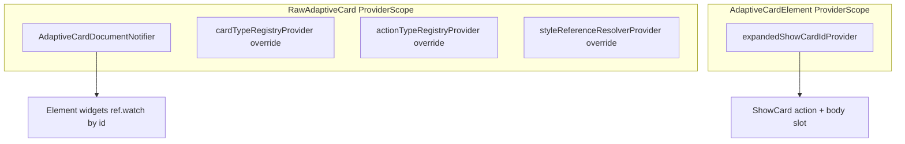
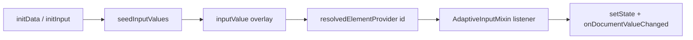
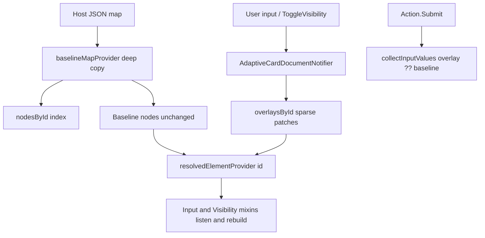

# Reactive Riverpod in `flutter_adaptive_cards_fs`

`flutter_adaptive_cards_fs` uses **Riverpod (v3.x)** internally as the reactive source of truth for:

- Card JSON (baseline) + runtime overlays (inputs, visibility, ChoiceSet choices)
- Per-card UI state (e.g. show-card expanded/collapsed)

This is intentionally **library-owned**: the package installs its own `ProviderScope` per rendered card subtree. Host apps do not need to depend on Riverpod directly unless they want to integrate with the library at a deeper level.

## Provider scopes

There are two nested scopes, matching the natural boundaries already present in the widget tree:

- **Raw card scope** (one per `RawAdaptiveCard`)
  - registries (`CardTypeRegistry`, `ActionTypeRegistry`) via `cardTypeRegistryProvider` / `actionTypeRegistryProvider`
  - `ReferenceResolver` via `styleReferenceResolverProvider` — **HostConfig + theme-aware values only** (not registries)
  - document notifier (baseline JSON + overlays)
- **Per-card-element scope** (one per `AdaptiveCardElement`)
  - show-card UI state for that card instance
  - optional nested document fork when rendering nested card subtrees



## Document model: baseline + overlays

The document notifier stores:

- **Baseline JSON**: deep-copied map loaded from the host.
- **Index**: `id -> baseline node` lookup for O(1) targeting.
- **Overlays**: sparse per-id runtime state (e.g. `isVisible`, `inputValue`, `choices`).

Widgets render from a **resolved** view (baseline merged with overlays) via family providers like `resolvedElementProvider(id)`.

### Why overlays?

Runtime state like user input and visibility should not mutate the host’s map in place:

- makes reset semantics unclear
- causes aliasing if the host reuses a map instance
- makes reactive updates expensive (deep tree rebuilds)

Instead, overlays isolate runtime changes while keeping baseline patches (host/template refresh) possible.

## How overlays change values initialized from the adaptive map

### Two layers

| Layer | Source | Mutated at runtime? |
| --- | --- | --- |
| **Baseline** | Deep copy of host JSON (`baselineMapProvider` → `AdaptiveCardDocument.baseline`) | No |
| **Overlay** | Sparse `overlaysById[id]` entries (`ElementOverlay`) | Yes |

Each overlay holds optional patches for that element id:

- `isVisible` — overrides baseline `"isVisible"`
- `inputValue` — overrides baseline `"value"` on input elements
- `choices` — overrides baseline `"choices"` on `Input.ChoiceSet`
- `queryCount` / `querySkip` — session overrides merged into baseline `"choices.data"` (typeahead pagination)
- `querySearchText` — typeahead search text (overlay only; not merged into resolved JSON)

Implementation: [`adaptive_card_document.dart`](../packages/flutter_adaptive_cards_fs/lib/src/riverpod/adaptive_card_document.dart), [`adaptive_card_document_notifier.dart`](../packages/flutter_adaptive_cards_fs/lib/src/riverpod/adaptive_card_document_notifier.dart).

### Initialization (first paint and initData)

Widgets seed local state from the **original** `adaptiveMap` at construction (e.g. `AdaptiveInputMixin.initState()` reads `adaptiveMap['value']`). Host-provided [`initData`](../../packages/flutter_adaptive_cards_fs/README.md#loading-data-into-fields-outside-of-the-adaptivecard-json-with-initdata--initinput) is applied via `seedInputValues` on the document notifier (post-frame), not by walking the element tree.

#### Why `initInput` does not call `setState` on the card

Previously, `RawAdaptiveCardState.initInput` walked the element tree and each input’s `initInput(map)` called `setState` locally to update controllers and other widget state. That pushed data **into** each widget and made each widget responsible for its own rebuild.

The overlay model inverts that flow:

1. **`initInput` / `seedInputValues` only write overlays** — `RawAdaptiveCardState.initInput` delegates to `AdaptiveCardDocumentNotifier.seedInputValues`; per-input `initInput` overrides call `setDocumentInputValue`. Neither path calls `setState` on the card or input directly.
2. **Inputs already subscribe in `didChangeDependencies`** — `AdaptiveInputMixin` (and `AdaptiveChoiceSet` for `choices`) registers a `container.listen` on `resolvedElementProvider(id)`.
3. **The listener calls `setState` on the input widget** — when the overlay changes, the listener runs `setState(() { … onDocumentValueChanged(…) })`, which syncs controllers and other local UI state.

So rebuilds still happen via `setState`; the call site moved from `initInput` to the resolved-element listener. That keeps one reactive path for `initData`, user typing, `ResetInputs`, and `ToggleVisibility` without tree walks.



**Timing:** `_AdaptiveCardDocumentLifecycle` seeds `initData` in a post-frame callback after inputs have mounted and registered their listeners.

**When the UI may not update:** the listener skips rebuild if the resolved value equals the current `value`; `initInput` is a no-op if `documentContainer` is not registered yet; or the id is not in `nodesById`.

### Runtime writes (user input, actions)

Changes go **only** into overlays via the document notifier:

| Action | Notifier API | Overlay field |
| --- | --- | --- |
| User edits an input | `setInputValue(id, value)` | `inputValue` |
| Host initData / late binding | `seedInputValues(map)` | `inputValue` per id |
| Dynamic ChoiceSet options | `setChoices(id, choices)` / `appendChoices(id, choices)` | `choices` |
| Typeahead pagination (optional) | `setDataQuerySession(id, count:, skip:, searchText:)` | `queryCount`, `querySkip`, `querySearchText` |
| ToggleVisibility / set visibility | `setVisibility(id, visible: …)` / `toggleVisibility(id)` | `isVisible` |
| ResetInputs | `resetAllInputs()` | clears `inputValue` and `choices` on input ids (keeps `isVisible`) |
| Submit / Execute | `collectInputValues()` | reads overlay ?? baseline `"value"` |
| Host loadInput API | `RawAdaptiveCardState.loadInput(id, map)` | delegates to `setChoices` |

The host’s map instance is never mutated in place.

### Resolved view (what widgets and actions read)

`resolvedElementProvider(id)` merges baseline node + overlay into a **new** map copy:

```dart
final merged = Map<String, dynamic>.from(baselineNode);
if (overlay?.isVisible != null) merged['isVisible'] = overlay!.isVisible;
if (overlay?.inputValue != null) merged['value'] = overlay!.inputValue;
if (overlay?.choices != null) merged['choices'] = overlay!.choices;
// queryCount/querySkip merge into choices.data when present
```

Effective value rules:

- **Visibility**: overlay `isVisible` if set, else baseline `"isVisible"` (default `true`).
- **Input value**: overlay `inputValue` if set, else baseline `"value"`.
- **ChoiceSet choices**: overlay `choices` if set, else baseline `"choices"`.

### Keeping UI in sync

`AdaptiveInputMixin`, `AdaptiveVisibilityMixin`, and `AdaptiveChoiceSet` subscribe to `resolvedElementProvider(id)` in `didChangeDependencies`. When an overlay changes (typing, reset, ToggleVisibility, dynamic choices), the listener updates local state/controllers so the widget rebuilds without walking the element tree.

Input widgets call `setDocumentInputValue(...)` on user edits; reset clears overlays so resolved values fall back to baseline again.



## Actions and inputs

- **ToggleVisibility**: writes to document notifier (`toggleVisibility(id)`); affected widgets rebuild via `ref.watch`.
- **ShowCard**: uses a card-local provider (`expandedShowCardIdProvider`) rather than widget identity.
- **Submit/Execute/ResetInputs**: collect/reset values from the document notifier rather than walking the Flutter element tree.

## Host callbacks

Host callbacks (`onSubmit`, `onExecute`, `onOpenUrl`, `onChange`, …) remain on `InheritedAdaptiveCardHandlers`. These are host integration points, not reactive document state.
