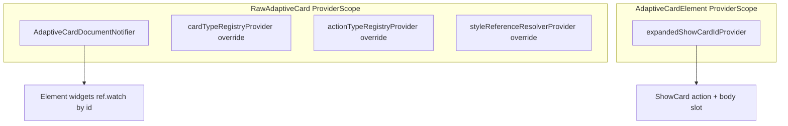
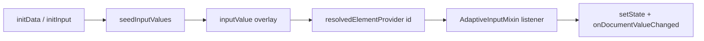
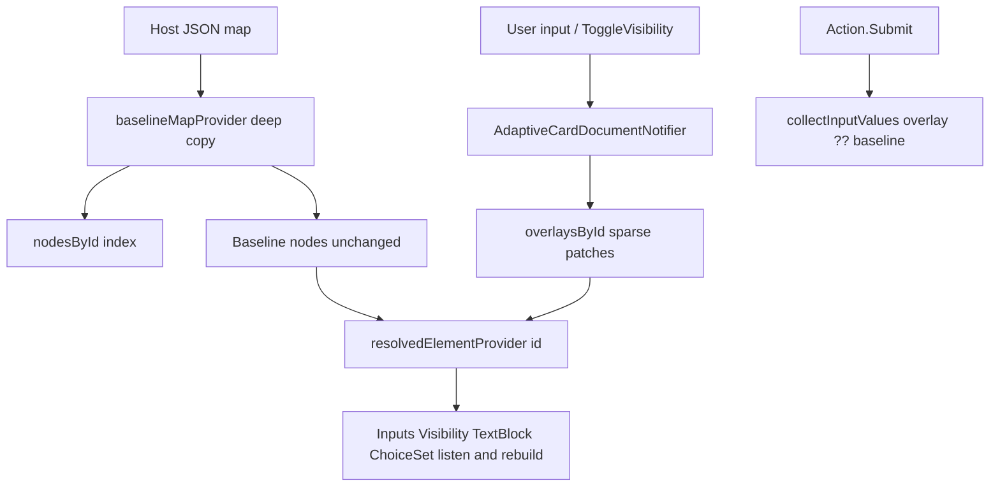

# Reactive Riverpod in `flutter_adaptive_cards_fs`

`flutter_adaptive_cards_fs` uses **Riverpod (v3.x)** internally as the reactive source of truth for:

- Card JSON (baseline) + runtime overlays (inputs, visibility, ChoiceSet choices, TextBlock text, validation, action `isEnabled`)
- Per-card UI state (e.g. show-card expanded/collapsed)

This is intentionally **library-owned**: the package installs its own `ProviderScope` per rendered card subtree. Host apps do not need to depend on Riverpod directly unless they want to integrate with the library at a deeper level.

## Provider scopes

There are two nested scopes, matching the natural boundaries already present in the widget tree:

- **Raw card scope** (one per `RawAdaptiveCard`)
  - registries (`CardTypeRegistry`, `ActionTypeRegistry`) via `cardTypeRegistryProvider` / `actionTypeRegistryProvider`
  - `ReferenceResolver` via `styleReferenceResolverProvider` — **HostConfig + theme-aware values only** (not registries)
  - document notifier (baseline JSON + overlays)
- **Per-card-element scope** (one per `AdaptiveCardElement`)
  - show-card UI state for that card instance
  - optional nested document fork when rendering nested card subtrees



## Document model: baseline + overlays

The document notifier stores:

- **Baseline JSON**: deep-copied map loaded from the host, stored as `_baselineMap` on `RawAdaptiveCardState` and passed to `baselineMapProvider` on each build (same instance until `widget.map` changes). This prevents host rebuilds from producing a new baseline reference every frame and wiping overlays.
- **Index**: `id -> baseline node` lookup for O(1) targeting.
- **Overlays**: sparse per-id runtime state (`ElementOverlay` + `ActionOverlay`; see field list below).

Widgets render from a **resolved** view (baseline merged with overlays) via family providers like `resolvedElementProvider(id)`.

### Why overlays?

Runtime state like user input and visibility should not mutate the host’s map in place:

- makes reset semantics unclear
- causes aliasing if the host reuses a map instance
- makes reactive updates expensive (deep tree rebuilds)

Instead, overlays isolate runtime changes while keeping baseline patches (host/template refresh) possible.

## How overlays change values initialized from the adaptive map

### Two layers

| Layer | Source | Mutated at runtime? |
| --- | --- | --- |
| **Baseline** | Deep copy of host JSON (`baselineMapProvider` → `AdaptiveCardDocument.baseline`) | No |
| **Overlay** | Sparse `overlaysById[id]` entries (`ElementOverlay`) | Yes |

Each overlay holds optional patches for that element id:

- `isVisible` — overrides baseline `"isVisible"`
- `inputValue` — overrides baseline `"value"` on input elements
- `choices` — overrides baseline `"choices"` on `Input.ChoiceSet`
- `queryCount` / `querySkip` — session overrides merged into baseline `"choices.data"` (typeahead pagination)
- `querySearchText` — typeahead search text (overlay only; not merged into resolved JSON)
- `errorMessage` — overrides baseline `"errorMessage"` on input elements (host validation)
- `isInvalid` — merged into resolved `"isInvalid"` (host-driven validation flag)
- `text` — overrides baseline `"text"` on elements such as `TextBlock` (dynamic status, i18n)

**Action overlays** (`actionOverlaysById`, `ActionOverlay`):

- `isEnabled` — overrides baseline `"isEnabled"` on `Action.*` nodes (AC 1.5; default `true` when absent)

Implementation: [`adaptive_card_document.dart`](../packages/flutter_adaptive_cards_fs/lib/src/riverpod/adaptive_card_document.dart), [`adaptive_card_document_notifier.dart`](../packages/flutter_adaptive_cards_fs/lib/src/riverpod/adaptive_card_document_notifier.dart).

### Initialization (first paint and initData)

Widgets seed local state from the **original** `adaptiveMap` at construction (e.g. `AdaptiveInputMixin.initState()` reads `adaptiveMap['value']`). Host-provided [`initData`](../../packages/flutter_adaptive_cards_fs/README.md#loading-data-into-fields-outside-of-the-adaptivecard-json-with-initdata--initinput) is applied via `seedInputValues` on the document notifier (post-frame), not by walking the element tree.

#### Why `initInput` does not call `setState` on the card

Previously, `RawAdaptiveCardState.initInput` walked the element tree and each input’s `initInput(map)` called `setState` locally to update controllers and other widget state. That pushed data **into** each widget and made each widget responsible for its own rebuild.

The overlay model inverts that flow:

1. **`initInput` / `seedInputValues` only write overlays** — `RawAdaptiveCardState.initInput` delegates to `AdaptiveCardDocumentNotifier.seedInputValues`; per-input `initInput` overrides call `setDocumentInputValue`. Neither path calls `setState` on the card or input directly.
2. **Elements subscribe in `didChangeDependencies`** — `AdaptiveInputMixin`, `AdaptiveChoiceSet`, `AdaptiveVisibilityMixin`, and `AdaptiveTextBlock` register a `container.listen` on `resolvedElementProvider(id)` (actions use `resolvedActionProvider`).
3. **The listener calls `setState` on the input widget** — when the overlay changes, the listener runs `setState(() { … onDocumentValueChanged(…) })`, which syncs controllers and other local UI state.

So rebuilds still happen via `setState`; the call site moved from `initInput` to the resolved-element listener. That keeps one reactive path for `initData`, user typing, `ResetInputs`, and `ToggleVisibility` without tree walks.



**Timing:** `_AdaptiveCardDocumentLifecycle` seeds `initData` in a post-frame callback after inputs have mounted and registered their listeners.

**When the UI may not update:** the listener skips rebuild if the resolved value equals the current `value`; `initInput` is a no-op if `documentContainer` is not registered yet; or the id is not in `nodesById`.

### Runtime writes (user input, actions)

Changes go **only** into overlays via the document notifier:

| Action | Notifier API | Overlay field |
| --- | --- | --- |
| User edits an input | `setInputValue(id, value)` | `inputValue` |
| Host initData / late binding | `seedInputValues(map)` | `inputValue` per id |
| Dynamic ChoiceSet options | `setChoices(id, choices)` / `appendChoices(id, choices)` | `choices` |
| Typeahead pagination (optional) | `setDataQuerySession(id, count:, skip:, searchText:)` | `queryCount`, `querySkip`, `querySearchText` |
| ToggleVisibility / set visibility | `setVisibility(id, visible: …)` / `toggleVisibility(id)` | `isVisible` |
| Host validation after submit | `setInputError(id, errorMessage:, isInvalid:)` / `clearInputError(id)` | `errorMessage`, `isInvalid` |
| ResetInputs | `resetAllInputs()` | clears `inputValue`, `choices`, and validation on **`Input.*`** ids only; preserves `isVisible`, TextBlock `text`, and `actionOverlaysById` |
| Submit / Execute | `collectInputValues()` | reads overlay ?? baseline `"value"` (no error fields in payload) |
| Host loadInput API | `RawAdaptiveCardState.loadInput(id, map)` | delegates to `setChoices` |
| Enable/disable actions | `setActionEnabled(id, enabled:)` / `setActionsEnabled(map)` | `ActionOverlay.isEnabled` |
| Replace TextBlock text | `setText(id, text)` / `clearText(id)` | `text` |
| Host helpers | `RawAdaptiveCardState.setInputError` / `setActionEnabled` / `setText` / `clearText` | delegates to document notifier |

The host’s map instance is never mutated in place.

### Resolved view (what widgets and actions read)

`resolvedElementProvider(id)` merges baseline node + overlay into a **new** map copy:

```dart
final merged = Map<String, dynamic>.from(baselineNode);
if (overlay?.isVisible != null) merged['isVisible'] = overlay!.isVisible;
if (overlay?.inputValue != null) merged['value'] = overlay!.inputValue;
if (overlay?.choices != null) merged['choices'] = overlay!.choices;
if (overlay?.errorMessage != null) merged['errorMessage'] = overlay!.errorMessage;
if (overlay?.isInvalid != null) merged['isInvalid'] = overlay!.isInvalid;
if (overlay?.text != null) merged['text'] = overlay!.text;
// queryCount/querySkip merge into choices.data when present
```

`resolvedActionProvider(id)` merges baseline action node + `actionOverlaysById[id]` (returns `null` if the id is missing or not an `Action.*` type). Effective `isEnabled` is overlay value if set, else baseline (default enabled when absent).

Effective value rules:

- **Visibility**: overlay `isVisible` if set, else baseline `"isVisible"` (default `true`).
- **Input value**: overlay `inputValue` if set, else baseline `"value"`.
- **ChoiceSet choices**: overlay `choices` if set, else baseline `"choices"`.
- **TextBlock text**: overlay `text` if set, else baseline `"text"` (display still runs `parseTextString` / `DateTimeUtils.formatText` in the widget).

### Keeping UI in sync

`AdaptiveInputMixin`, `AdaptiveVisibilityMixin`, `AdaptiveChoiceSet`, and **`AdaptiveTextBlock`** subscribe to `resolvedElementProvider(id)` in `didChangeDependencies`. When an overlay changes (typing, reset, ToggleVisibility, dynamic choices, validation, text replacement), the listener updates local state/controllers so the widget rebuilds without walking the element tree.

`AdaptiveActionStateMixin` (used by `IconButtonAction`) and `Action.ShowCard` subscribe to `resolvedActionProvider(id)` for `isEnabled`.

Input widgets call `setDocumentInputValue(...)` on user edits (which clears validation overlays); reset clears input overlays so resolved values fall back to baseline again.



## Actions and inputs

- **ToggleVisibility**: writes to document notifier (`toggleVisibility(id)`); affected widgets rebuild via `ref.watch`.
- **ShowCard**: uses a card-local provider (`expandedShowCardIdProvider`) rather than widget identity.
- **Submit/Execute/ResetInputs**: collect/reset values from the document notifier rather than walking the Flutter element tree.

## Host callbacks

Host callbacks (`onSubmit`, `onExecute`, `onOpenUrl`, `onChange`, …) remain on `InheritedAdaptiveCardHandlers`. These are host integration points, not reactive document state.

## Overlay test coverage

### Verdict

| Layer | Confidence |
| --- | --- |
| **Notifier + merge providers** | High — `test/riverpod/adaptive_card_document_notifier_test.dart` |
| **Widget tests per `Input.*` / `Action.*`** | Partial — representative paths, not every type |

The overlay **model** is well guarded; adding a new overlay field still requires notifier tests plus at least one focused widget test for the element types that consume it. A fuller matrix and gap list also lives in the agent skill [adaptive-cards-element-registry](../.agents/skills/adaptive-cards-element-registry/SKILL.md#overlay-test-coverage) (for implementers).

### Primary test files

| Concern | Test file |
| --- | --- |
| Notifier contract (inputs, visibility, choices, validation, text, actions) | `test/riverpod/adaptive_card_document_notifier_test.dart` |
| `initData` / `initInput` | `test/inputs/init_data_overlay_test.dart` |
| ChoiceSet `loadInput` / `appendChoices` / reset | `test/inputs/choice_set_overlay_test.dart`, `test/inputs/action_reset_inputs_test.dart` |
| Data.Query session merge | `test/inputs/choice_set_data_query_test.dart` |
| Input validation overlays | `test/inputs/input_error_overlay_test.dart` |
| TextBlock `text` | `test/elements/text_block_text_overlay_test.dart` |
| Visibility / ToggleVisibility | `test/elements/is_visible_test.dart` |
| Action `isEnabled` (Submit) | `test/actions/action_enabled_overlay_test.dart`, sample `test/samples/v1.5/action_is_enabled.json` |
| Action `isEnabled` (ShowCard) | `test/actions/show_card_enabled_overlay_test.dart` |

### How to add tests

1. **Notifier** — `ProviderContainer` with `baselineMapProvider.overrideWithValue(...)`, assert `resolvedElementProvider` / `resolvedActionProvider` and `overlaysById`.
2. **Widget** — `getTestWidgetFromMap` / `getTestWidgetFromPath`, key-first finders (`generateWidgetKey`, `generateAdaptiveWidgetKey`); see [adaptive-cards-testing skill](../.agents/skills/adaptive-cards-testing/SKILL.md#reactive-document-tests-overlays-submit-reset).
3. **Host API** — delegate tests on `RawAdaptiveCardState` (`setText`, `setInputError`, `clearInputError`, `setActionEnabled`, …).

### Remaining gaps (optional)

- Validation overlay widget tests for `Input.Date`, `Input.Time`, `Input.Rating` (Text and Number covered in `input_error_overlay_test.dart`).
- `setActionEnabled` on action types beyond Submit and ShowCard.
- Input-value overlay surviving `RawAdaptiveCard.rebuild()` (visibility and TextBlock covered).

Regression command:

```bash
cd packages/flutter_adaptive_cards_fs
fvm flutter test test/riverpod/adaptive_card_document_notifier_test.dart
fvm flutter test test/inputs/init_data_overlay_test.dart
fvm flutter test test/inputs/choice_set_overlay_test.dart
fvm flutter test test/inputs/input_error_overlay_test.dart
fvm flutter test test/elements/text_block_text_overlay_test.dart
fvm flutter test test/elements/is_visible_test.dart
fvm flutter test test/actions/action_enabled_overlay_test.dart
fvm flutter test test/actions/show_card_enabled_overlay_test.dart
```

## Overlay backlog

This section is a **planning inventory**: which JSON properties are already driven by document overlays today, and which are reasonable candidates for future work. It is not a roadmap commitment; new overlays should follow the same patterns (`ElementOverlay` / `ActionOverlay`, merge in `resolvedElementProvider` or `resolvedActionProvider`, widget listeners, notifier + host APIs, tests).

### Already implemented

| Target | Overlay / provider |
| --- | --- |
| Any element with `id` | `isVisible` → `resolvedElementProvider` |
| `Input.*` | `inputValue`, `errorMessage`, `isInvalid`, `choices`, query session fields (`queryCount`, `querySkip`, `querySearchText`) |
| `TextBlock` | `text` → `resolvedElementProvider` (`setText` / `clearText`) |
| `Action.*` | `isEnabled` → `resolvedActionProvider` |

### Recommended future overlays (prioritized)

**Body / display elements**

| Property | Element(s) | Host use case | Priority |
| --- | --- | --- | --- |
| `url` | `Image`, `Media` | Signed URL rotation | Medium |
| `text` | `Badge` (extension) | Dynamic badge label | Low (reuse `ElementOverlay.text` + listener if needed) |

**Inputs — defer**

| Property | Notes |
| --- | --- |
| `placeholder`, `label` | Hint/label changes without changing submit `value` |
| `isRequired` | Conditional required-field validation |
| `choices.data.parameters` | Typeahead parameter binding (separate from count/skip session fields) |

**Actions — defer**

| Property | Notes |
| --- | --- |
| `title` | Button label updates (`AdaptiveActionMixin` reads `adaptiveMap` today) |
| `tooltip`, `iconUrl` | Runtime UX tweaks on actions |
| `mode`, `style` | AC 1.5+; lower host demand |

**Session-only (overlay field present, not merged into resolved JSON)**

- `querySearchText` — ChoiceSet typeahead search text (existing pattern; merged `count`/`skip` go into `choices.data`)
