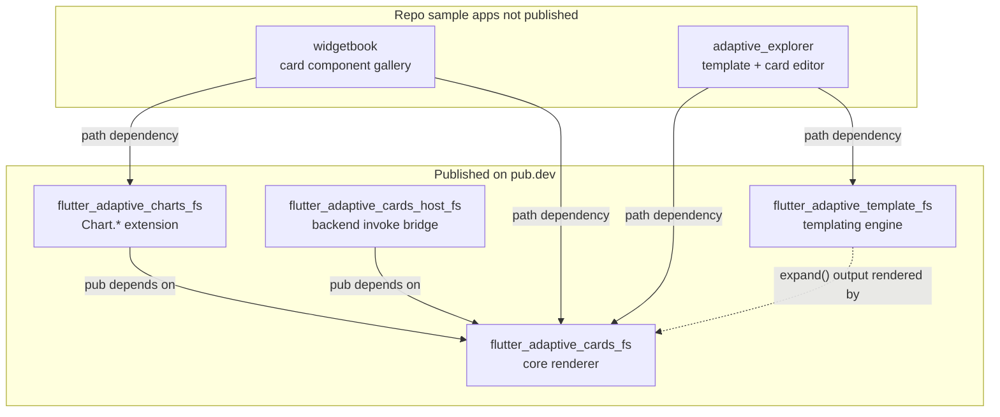
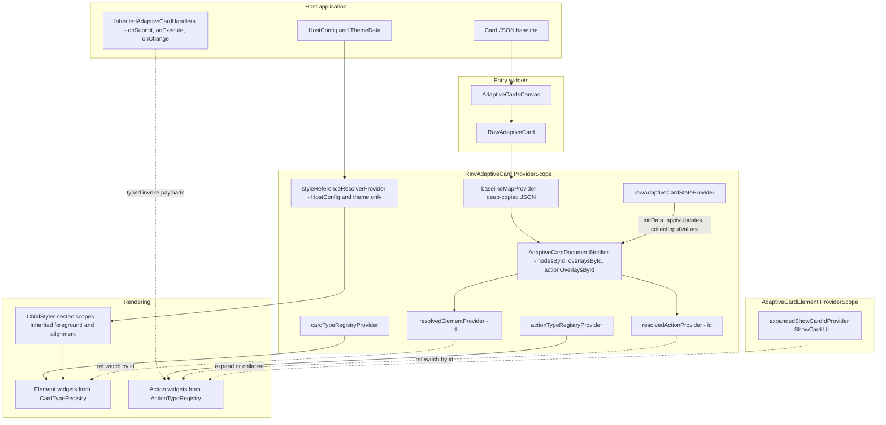

# Architecture Overview

**Status**: ✅ Current | **Category**: Architecture

This document provides a high-level overview of the system architecture for the Flutter Adaptive Cards monorepo.

## Monorepo layout

**App package dependencies** (from each app’s `pubspec.yaml`):

| App | `flutter_adaptive_cards_fs` | `flutter_adaptive_charts_fs` | `flutter_adaptive_template_fs` | `flutter_adaptive_cards_host_fs` |
| --- | --- | --- | --- | --- |
| **widgetbook** | yes | yes | — | — |
| **adaptive_explorer** | yes | — | yes | — |

`widgetbook` registers chart elements via `CardChartsRegistry.additionalChartElements` on `CardTypeRegistry` (see `generic_page.dart`, `chart_knobs_page.dart`, and related use cases). It does not pull in templating or the backend host package. `flutter_adaptive_cards_host_fs` is for production host apps; no in-repo sample app depends on it yet.

## Core library component model

One card subtree combines **four concerns**: JSON parsing into widgets (registries), **runtime state** (document overlays), **styling** (HostConfig via `ReferenceResolver`), and **host callbacks** (`InheritedAdaptiveCardHandlers`). The widget tree and Riverpod state stay aligned by element `id`.

Deeper dives: [reactive-riverpod.md](./reactive-riverpod.md) (overlay merge and provider scopes), [adaptive-style.md](./adaptive-style.md#style-inheritance-data-flow) (style pipeline), [actions-architecture.md](./actions-architecture.md) (action dispatch), [backend-host-integration.md](./backend-host-integration.md) (optional invoke round-trip).

## Package Structure

The repository is organized as a monorepo containing multiple related packages:

- **`flutter_adaptive_cards_fs`**: The core library that parses Adaptive Card JSON into Flutter widgets. It handles element rendering, layout, styling via HostConfig, and user interactions.
- **`flutter_adaptive_charts_fs`**: A supplemental library for rendering charting components (e.g., bar charts, pie charts) as extensions to the standard Adaptive Cards schema. **Not part of the core package** — see [optional-packages-and-extensions.md](./optional-packages-and-extensions.md).
- **`flutter_adaptive_template_fs`**: The templating engine that merges data JSON into template JSON (Adaptive Cards Templating language). **Not part of the core package** — see [optional-packages-and-extensions.md](./optional-packages-and-extensions.md).
- **`flutter_adaptive_cards_host_fs`**: Optional backend invoke bridge (PlainJson and Teams adapters, HTTP client, `AdaptiveCardBackendHandlers`). **Not part of the core package** — see [backend-host-integration.md](./backend-host-integration.md) and [optional-packages-and-extensions.md](./optional-packages-and-extensions.md).
- **`adaptive_explorer`**: A design studio desktop application that allows developers to author, preview, and debug Adaptive Cards, templates, and data payloads.

## Widget Hierarchy

When an Adaptive Card is rendered, the JSON is recursively parsed into a hierarchy of Flutter widgets:

1. **`AdaptiveCardsCanvas`**: Host entry widget that loads card JSON (asset, network, or in-memory) and builds a **`RawAdaptiveCard`** when content is ready.
2. **`RawAdaptiveCard`**: Installs the card-scoped `ProviderScope` (document notifier, registries, `ReferenceResolver`) and renders the parsed root element tree inside a `Card`.
3. **`AdaptiveCardElement`**: Represents the `AdaptiveCard` JSON root (`body`, `actions`), applying padding, background, and action layout. Root **`refresh`** (v1.4+) shows a manual refresh affordance and can auto-fire when **`expires`** is past; hosts handle **`onRefresh`** / **`RefreshActionInvoke`** — see [actions-architecture.md](./actions-architecture.md#root-card-refresh-payload).
4. **Containers and Elements**: Elements like `AdaptiveColumnSet`, `AdaptiveContainer`, `AdaptiveTextBlock`, `AdaptiveRichTextBlock`, `AdaptiveIcon`, and `AdaptiveImage` are rendered as individual Flutter widgets (often wrapping standard Flutter widgets like `Column`, `Row`, `Text`, and `Image`).
5. **Inputs**: Form inputs (`Input.Text`, `Input.Date`, etc.) use Flutter form controls. **Initial** values come from the adaptive map at widget construction; **runtime** values, validation, and visibility are stored in Riverpod document **overlays** (baseline JSON is never mutated). Inputs sync via `AdaptiveInputMixin` + `resolvedElementProvider(id)`. See [`reactive-riverpod.md`](reactive-riverpod.md#how-overlays-change-values-initialized-from-the-adaptive-map).
6. **Display elements**: `TextBlock`, `RichTextBlock`, and other elements with natural ids can use the same overlay model (e.g. runtime `text` replacement via `setText` / `resolvedElementProvider`).
7. **Actions**: The action bar (e.g., `Action.Submit`, `Action.OpenUrl`) is typically rendered at the bottom of the card or within an `ActionSet`. Actions trigger callbacks routed through `GenericAction` handlers and, for default behaviors, `InheritedAdaptiveCardHandlers`. Submit/Execute/Refresh payloads are typed invoke objects, not raw maps. AC 1.5 `isEnabled` is reactive via `resolvedActionProvider(id)`.

## State and dependency injection

`flutter_adaptive_cards_fs` uses **Riverpod (v3.x)** internally for card-scoped dependency injection and **reactive** document/UI state. The library installs its own `ProviderScope` per rendered card subtree, so host apps do not need to set up Riverpod to use the package.

See [`reactive-riverpod.md`](reactive-riverpod.md) for the scope map, provider architecture, and **baseline + overlay** document model.

### Document overlays (elements and actions)

Runtime changes (input values, visibility, TextBlock text, validation, ChoiceSet choices, action enabled state) do not mutate the host JSON. The document notifier keeps a deep-copied **baseline** (cached on `RawAdaptiveCardState` so host rebuilds do not reset overlays) plus sparse **overlays** (`overlaysById`, `actionOverlaysById`); widgets read merged maps via `resolvedElementProvider(id)` and `resolvedActionProvider(id)`. Submit and reset use the notifier (`collectInputValues`, `resetAllInputs`). Details: [How overlays change values](reactive-riverpod.md#how-overlays-change-values-initialized-from-the-adaptive-map). Test inventory: [Overlay test coverage](reactive-riverpod.md#overlay-test-coverage).

### Where state actually lives

| Concern | Mechanism |
| --- | --- |
| Card JSON + runtime overlays | Riverpod document notifier (`ElementOverlay` + `ActionOverlay` tables) |
| Show-card expanded/collapsed state | Riverpod per-`AdaptiveCardElement` UI notifier |
| Host callbacks (`onSubmit`, `onChange`, …) | `InheritedAdaptiveCardHandlers` |
| `CardTypeRegistry` / `ActionTypeRegistry` | Riverpod `cardTypeRegistryProvider` / `actionTypeRegistryProvider` (overridden per raw-card scope) |
| `ReferenceResolver` (HostConfig / theme) | Riverpod `styleReferenceResolverProvider` (overridden at card root and per subtree by `ChildStyler`; **does not** carry registries) |
| Root card scope (`RawAdaptiveCardState`) | Riverpod `rawAdaptiveCardStateProvider` |
| Theme / `HostConfig` updates | `ReferenceResolver` rebuilt when host/theme changes; `ProviderScope` keyed on brightness so descendants re-resolve styles |

### Style inheritance

Container foreground context and horizontal alignment flow down the element tree via **`ChildStyler`** nested `ProviderScope` overrides. Container **background** colors use each element's own `style` property only. See [Style inheritance data flow](adaptive-style.md#style-inheritance-data-flow) and [Resolver field lifecycle](adaptive-style.md#resolver-field-lifecycle) in `adaptive-style.md`.

### Inherited scopes

Host callbacks remain an `InheritedWidget` (`InheritedAdaptiveCardHandlers`). Most other cross-cutting services and reactive state live in Riverpod providers scoped to the card subtree.

### Consumer API

From the perspective of a host integrating `flutter_adaptive_cards_fs`:

1. Provide JSON and `HostConfig` via `AdaptiveCardsCanvas` (or `RawAdaptiveCard`).
2. Optionally pass custom `CardTypeRegistry` / `ActionTypeRegistry`, or wrap the tree with `InheritedAdaptiveCardHandlers` for submit/execute/open-url/change callbacks.
3. Wrap the card with **`InheritedAdaptiveCardHandlers`** for Submit, Execute, OpenUrl, Refresh, and input **`onChange`** callbacks. All callbacks receive typed invoke payloads: **`SubmitActionInvoke`**, **`ExecuteActionInvoke`**, **`RefreshActionInvoke`**, **`OpenUrlActionInvoke`**, **`OpenUrlDialogActionInvoke`**, and **`InputChangeInvoke`**. **`AdaptiveCardsCanvas`** accepts **`onChange`** directly (same **`InputChangeInvoke`** type); it does **not** expose Submit/Execute/OpenUrl/Refresh handlers on the widget itself.

For backend round-trips, optional **`AdaptiveCardBackendHandlers`** from **`flutter_adaptive_cards_host_fs`** wires the same callbacks to a flow-service — see [backend-host-integration.md](./backend-host-integration.md).

No third-party DI package is required at the app level.

## Optional packages and third-party isolation

Charts and templating live in **separate packages** so apps that do not use those features do not pull in **fl_chart** or the templating evaluator. Optional extensions register through `CardTypeRegistry.addedElements` (for example `CardChartsRegistry.additionalChartElements`).

See [optional-packages-and-extensions.md](./optional-packages-and-extensions.md) for the full strategy, consumer checklist, and rules for future extension packages. Chart chrome, semantic colors, and **`Chart.Gauge`** were completed in the [June 2026 plan](./superpowers/plans/2026-06-08-refresh-icon-charts-text-features.plan.md) (workstreams D–F).

## Extension Points

The architecture is designed to be extensible:

- **`CardTypeRegistry`**: Allows consumers to register custom parsers and widgets for new element types (e.g., adding a custom `MyCompany.MapWidget`, or merging chart/gauge registries from optional packages).
- **`ActionTypeRegistry`**: Allows consumers to override default action behaviors or add support for custom action types.
- **`HostConfig`**: Provides a robust theming system to ensure the rendered cards match the host application's branding and design language.

## Diagram canon

Canonical diagrams live in **current** docs (`Architecture-Overview.md`, `reactive-riverpod.md`, `adaptive-style.md`, `form-inputs.md`, `backend-host-integration.md`) and in each **package README** under **Package structure**. Plans and specs under `docs/plans/` and `docs/superpowers/specs/` are design history — promote a diagram to canon only when the behavior is shipped and the canonical doc owns the topic.

| Source diagram | Promote to canon? | Canonical home | Notes |
| --- | --- | --- | --- |
| Style inheritance `flowchart TD` | **Yes** (done) | [adaptive-style.md](./adaptive-style.md#style-inheritance-data-flow) | HostConfig → `ReferenceResolver` → `ChildStyler` |
| Resolver field lifecycle `sequenceDiagram` | **Yes** (done) | [adaptive-style.md](./adaptive-style.md#resolver-field-lifecycle) | Nested emphasis container example |
| Provider scopes `flowchart TB` | **Yes** (done) | [reactive-riverpod.md](./reactive-riverpod.md#provider-scopes) | Raw card vs element scope |
| Baseline + overlay merge `flowchart TB` | **Yes** (done) | [reactive-riverpod.md](./reactive-riverpod.md#how-overlays-change-values-initialized-from-the-adaptive-map) | Host map → resolved providers |
| initData → overlay `flowchart LR` | **Yes** (done) | [reactive-riverpod.md](./reactive-riverpod.md#why-initinput-does-not-call-setstate-on-the-card) + [package README](../packages/flutter_adaptive_cards_fs/README.md) | Seeding without `setState` on card |
| Parallel widget tree + Riverpod `flowchart TB` | **Yes** (done) | [package README](../packages/flutter_adaptive_cards_fs/README.md#parallel-trees-widget-tree-and-riverpod-state) | Widget/id alignment detail |
| Backend invoke pipeline `flowchart LR` | **Yes** (done) | [backend-host-integration.md](./backend-host-integration.md#architecture) | `flutter_adaptive_cards_host_fs` |
| Dependent ChoiceSet `sequenceDiagram` | **Yes** (done) | [form-inputs.md](./form-inputs.md#dependent-choiceset-country--city) | ResetInputs + host `onChange` |
| Reset semantics `flowchart TB` | **Yes** (done) | [package README](../packages/flutter_adaptive_cards_fs/README.md#reset-semantics) + [reactive-riverpod.md](./reactive-riverpod.md#reset-semantics) | Factory reset paths |
| Monorepo + core component (this doc) | **Yes** (new) | This document | Single map of packages and runtime concerns |
| Registries vs resolver decouple `flowchart LR` | **No** | Stay in [plan](./plans/2026-06-01-decouple_registries_from_resolver_bedb3732.plan.md) | Migration “before/after”; behavior is described in tables here and in `reactive-riverpod.md` |
| Riverpod utilization assessment | **No** | Stay in plan | Assessment artifact, not runtime docs |
| Per-feature overlay plans (TextBlock, ChoiceSet loop, validation, dynamic properties) | **No** | Stay in plans/specs | Covered by reactive-riverpod + form-inputs prose/tables |
| FactSet facts overlay `flowchart LR` | **No** | [reactive-riverpod.md](./reactive-riverpod.md) table only | Small overlay field; no separate diagram needed |
| initData date fix `flowchart LR` | **No** | [package README](../packages/flutter_adaptive_cards_fs/README.md#seeding-values-initdata--initinput) prose | Edge-case behavior, not architecture |
| Backend host design spec diagram | **Duplicate** | Use [backend-host-integration.md](./backend-host-integration.md) | Spec mirrors canonical guide |
| HostConfig style pipeline spec (2 diagrams) | **Duplicate** | Use [adaptive-style.md](./adaptive-style.md) | Spec explicitly targets adaptive-style.md |
| SDUI consumption `sequenceDiagram` | **Optional** | [package README](../packages/flutter_adaptive_cards_fs/README.md#consumption-patterns) | Product/flow context, not library internals |
| Container/foreground color `flowchart` (2) | **Optional** | Package README only | Theme mapping detail; link from [adaptive-style.md](./adaptive-style.md) if needed |
