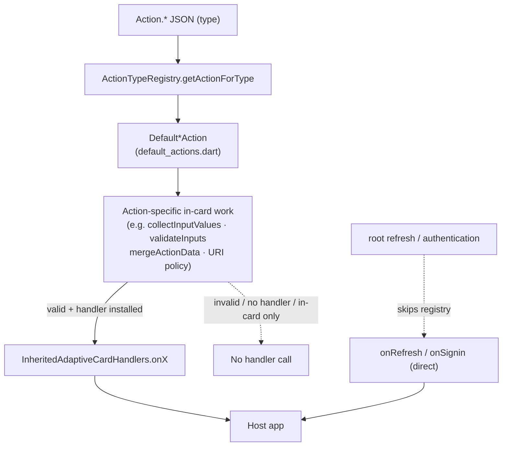
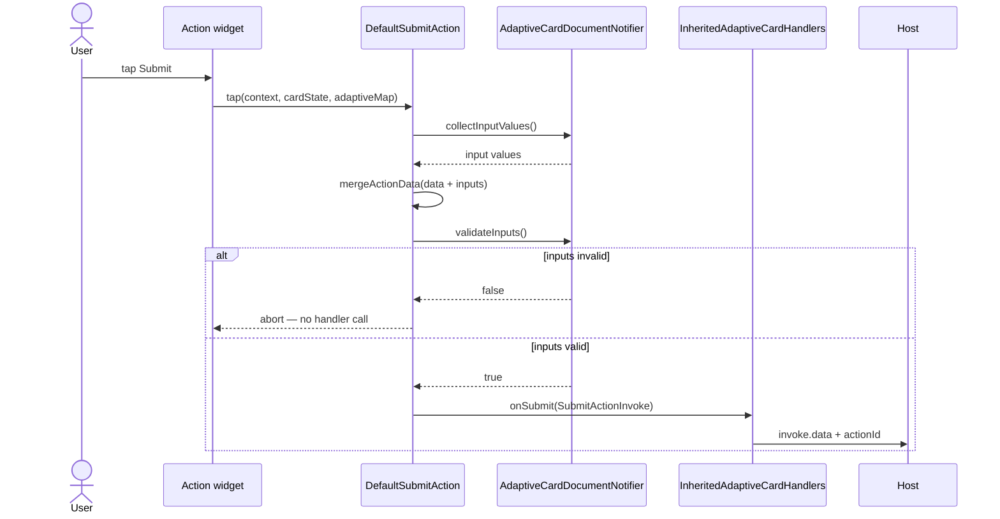

# Actions Architecture & Flow 🔧

## Overview ✅

This document describes how the Adaptive Cards action system is organized and how an action flows from parsing to execution. The design separates abstract **Generic** action interfaces from concrete **Default** implementations so you can plug in custom behavior easily.

---

## Key Concepts 💡

- **Generic action interfaces** (e.g., `GenericSubmitAction`, `GenericExecuteAction`, `GenericActionOpenUrl`, `GenericPopoverAction`) live in `lib/src/action/generic_action.dart` and define the public contract (the `tap()` signature).
- **Default implementations** (e.g., `DefaultSubmitAction`, `DefaultExecuteAction`) live in `lib/src/action/default_actions.dart` and provide the package-provided behavior.
- **ActionTypeRegistry** (`lib/src/action/action_type_registry.dart`) maps the parsed `Map<String, dynamic>` (the action map) to an appropriate `GenericAction` instance.
- **Runtime invocation**: Action widgets invoke `action.tap(...)` at tap time, passing the current `adaptiveMap` so Default implementations remain stateless and reusable.

---

## Typical Flow (high level) ▶️

1. JSON parsing: card JSON is parsed; actions are represented as `Map<String, dynamic>` with a `type` field like `"Action.Submit"`.
2. Registry lookup: `ActionTypeRegistry.getActionForType(map: parsedMap)` selects a `GenericAction` instance.
3. Widget wiring: the element/action widget stores the `GenericAction` reference and uses it to handle user interaction.
4. Tap-time execution: when the user taps, the widget calls `action.tap(context: ..., rawAdaptiveCardState: ..., adaptiveMap: parsedMap)`.
5. Response: the `tap()` implementation performs validation, handler delegation (via `InheritedAdaptiveCardHandlers`), or other effects (e.g., `rawAdaptiveCardState.toggleVisibility`).

---

## Action dispatch overview

Two layers cooperate on every action. **`GenericAction`** (the `Default*Action` resolved by `ActionTypeRegistry`) is the in-card dispatch strategy — its `.tap()` does the in-card work (collect input values, `validateInputs()`, merge `data`, apply the URI policy) and **then may** forward to a host callback on **`InheritedAdaptiveCardHandlers`**. The `GenericAction` is the gatekeeper; the host handler is the outbound edge. Per-action payload details are in the sections below; this is the map.



A tapped `Action.Submit`, end to end:



Which `GenericAction` handles each type, and which host handler (if any) it forwards to:

| JSON `type`               | `GenericAction` default impl (core)      | Handler it forwards to                                             |
| ------------------------- | ---------------------------------------- | ------------------------------------------------------------------ |
| `Action.Submit`           | `DefaultSubmitAction`                    | `onSubmit` — only if `validateInputs()` passes + handler installed |
| `Action.Execute`          | `DefaultExecuteAction`                   | `onExecute` — same gating                                          |
| `Action.OpenUrl`          | `DefaultOpenUrlAction`                   | `onOpenUrl` (else launches the URL itself)                         |
| `Action.OpenUrlDialog`    | `DefaultOpenUrlDialogAction`             | `onOpenUrlDialog` (else shows dialog itself)                       |
| `Action.Http`             | `DefaultHttpAction`                      | `onHttp` — only if non-null                                        |
| `Action.ToggleVisibility` | `DefaultToggleVisibilityAction`          | **none** — done in-card (mutates document state)                   |
| `Action.ResetInputs`      | `DefaultResetInputsAction`               | **none** — in-card reset                                           |
| `Action.Popover`          | `DefaultPopoverAction`                   | **none** — renders nested card in a dialog, in-card                |
| `Action.ShowCard`         | special-cased (root card only)           | **none** — in-card UI toggle                                       |
| root `refresh`            | **no `GenericAction`** (not in registry) | `onRefresh` (direct)                                               |
| root `authentication`     | **no `GenericAction`** (not in registry) | `onSignin` (direct)                                                |

Three cases fall out of this:

1. **Both run (GenericAction → handler):** Submit, Execute, OpenUrl, OpenUrlDialog, Http — the `Default*Action` does in-card work, then calls the host callback.
2. **Only the GenericAction:** ToggleVisibility, ResetInputs, Popover, and root-card ShowCard have no matching host callback (handled entirely in-card); Submit/Execute also stop here when validation fails or no handler is installed.
3. **Only the handler (no GenericAction):** root `refresh` → `onRefresh` and root `authentication` → `onSignin` skip the registry and call the handler directly.

> Source of truth: the type→class map in `lib/src/action/action_type_registry.dart` and each `Default*Action.tap` in `lib/src/action/default_actions.dart`.

---

## Host action callbacks

Submit, Execute, and OpenUrl are **not** configured on `AdaptiveCardsCanvas` or `AdaptiveCardsCanvasState`. Wrap the card with **`InheritedAdaptiveCardHandlers`**.

## Action.Submit payload

When **`DefaultSubmitAction`** runs:

1. Start from action JSON **`data`** (object or empty).
2. If **`associatedInputs`** is not **`"none"`** (default / omitted = **`"auto"`**), merge **`collectInputValues()`** (input ids overwrite duplicate keys in `data`). When **`"none"`**, invoke **`data`** is action JSON **`data`** only — no input values.
3. Build **`SubmitActionInvoke`** with merged **`data`** and action **`id`** (`actionId`).
4. Call **`InheritedAdaptiveCardHandlers.onSubmit(invoke)`**.

## Action.Execute payload

When **`DefaultExecuteAction`** runs:

1. Start from action JSON **`data`** (object or empty).
2. If **`associatedInputs`** is not **`"none"`** (default / omitted = **`"auto"`**), merge **`collectInputValues()`** (input ids overwrite duplicate keys in `data`). When **`"none"`**, invoke **`data`** is action JSON **`data`** only — no input values.
3. Build **`ExecuteActionInvoke`** with merged **`data`**, action **`verb`**, and action **`id`** (`actionId`).
4. Call **`InheritedAdaptiveCardHandlers.onExecute(invoke)`**.

Hosts route Teams-style Execute actions on **`invoke.verb`**. Per-action **`associatedInputs`** on Submit and Execute follows the same **`auto`** / **`none`** semantics as **`Data.Query`** — see [Dependent ChoiceSet (country → city)](form-inputs.md#dependent-choiceset-country--city).

## Action.OpenUrl payload

When **`DefaultOpenUrlAction`** runs:

1. Build **`OpenUrlActionInvoke`** with action **`url`** (or `altUrl` from selectAction routing) and optional action **`id`** (`actionId`).
2. Call **`InheritedAdaptiveCardHandlers.onOpenUrl(invoke)`**.

## Action.OpenUrlDialog payload

When **`DefaultOpenUrlDialogAction`** runs:

1. Build **`OpenUrlDialogActionInvoke`** with action **`url`** and optional action **`id`** (`actionId`).
2. Call **`InheritedAdaptiveCardHandlers.onOpenUrlDialog(invoke)`**.

## Action.Http payload (deprecated/legacy)

> **Deprecated/legacy:** `Action.Http` was the original Adaptive Cards HTTP action model (schema v1.0). It was superseded by `Action.Execute` (the [Universal Action Model](https://learn.microsoft.com/en-us/adaptive-cards/authoring-cards/universal-action-model), schema v1.4) and no longer renders in newer SDKs/schemas, but is still used by [Outlook Actionable Messages](https://learn.microsoft.com/en-us/outlook/actionable-messages/adaptive-card). Prefer `Action.Execute`/`Action.Submit` for new cards. The core library forwards the request and **never performs it**; wire `flutter_adaptive_cards_host_fs` (`AdaptiveHttpExecutor`) for the actual transport.

When **`DefaultHttpAction`** runs:

1. **`validateInputs`** — abort (marking fields) if any required/regex/range input is invalid, like `Action.Submit`.
2. **`collectInputValues()`**, then resolve **`{{inputId.value}}`** substitution (via `substituteInputValues`) in **`url`**, **`body`**, and each header **`value`**.
3. Gate the resolved **`url`** through the active **URI policy** (`InheritedAdaptiveCardSecurityPolicy.uriPolicy`); abort on denial, like `Action.OpenUrl`.
4. Debug-flag card-controlled sensitive headers (`Authorization`/`Cookie`). The header still forwards; the host decides.
5. Build **`HttpActionInvoke`** (`method`, resolved `url`/`body`/`headers`, raw `inputValues`, optional `actionId`) and call **`InheritedAdaptiveCardHandlers.onHttp(invoke)`** (nullable).

On the host side, `AdaptiveCardBackendHandlers.httpExecutor` performs the GET/POST and honors the Outlook response conventions: `CARD-UPDATE-IN-BODY: true` replaces the rendered card (reusing `onCardReplaced` + `cardValidator`), and `CARD-ACTION-STATUS` surfaces a failure message via `onError`.

## Input onChange payload

When an input value changes, **`RawAdaptiveCardState.changeValue`** builds **`InputChangeInvoke`** (`inputId`, `value`, `dataQuery`, `cardState`) and calls the host **`onChange`** handler (from **`AdaptiveCardsCanvas.onChange`** or **`InheritedAdaptiveCardHandlers.onChange`**).

## Root card `refresh` payload

When the root card JSON defines **`refresh.action`**, the library may fire a refresh invoke in two cases:

1. **Manual** — the user taps the refresh affordance (top-right icon on the root card).
2. **Auto-expire** — once after the first frame when **`refresh.expires`** is in the past.

Auto-refresh is gated by **`refresh.userIds`**: when that list is non-empty, auto-refresh runs only when **`AdaptiveCardsCanvas.currentUserId`** (exposed via **`currentUserIdProvider`**) is in the list. Manual refresh is not gated by **`userIds`**.

The invoke is built like **`Action.Execute`**: merge nested action **`data`** with **`collectInputValues()`** (honoring **`associatedInputs`** on the nested action), then:

1. Build **`RefreshActionInvoke`** with merged **`data`**, action **`verb`**, and optional action **`id`** (`actionId`).
2. Call **`InheritedAdaptiveCardHandlers.onRefresh(invoke)`** when set; otherwise fall back to **`onExecute`** with the same merged payload as **`ExecuteActionInvoke`**.

The library does not perform bot round-trips; the host replaces card JSON when refresh completes (for example by updating the map passed to **`RawAdaptiveCard`**).

Implemented in [workstream B](./superpowers/plans/2026-06-08-refresh-icon-charts-text-features.plan.md#workstream-b--refresh-property-v14) of the June 2026 plan. **Example (widgetbook sample):** **AdaptiveCard → Refresh** (`widgetbook/lib/refresh_demo_page.dart`).

## Root card `authentication` sign-in (`onSignin` / `SigninActionInvoke`)

When the root card JSON defines an **`authentication`** object (v1.4+), the library parses it into an **`AuthenticationConfig`** (see `lib/src/models/authentication_config.dart`) and renders a **`_AuthenticationRegion`** below the card body.

### Tap → `onSignin` handoff

For each button in `authentication.buttons` where `type == "signin"`:

1. Build **`SigninActionInvoke`** from the button (`value` = sign-in URL, `connectionName` = `authentication.connectionName`).
2. Call **`InheritedAdaptiveCardHandlers.onSignin(invoke)`** when set.
3. **Fallback:** when `onSignin` is null and `invoke.value` starts with `http`, call **`onOpenUrl`** with the sign-in URL. A non-URL value with no handler is a debug-logged no-op.

### `onOpenUrl` fallback

```
button tap
  → _triggerSignin(button)
      onSignin != null → onSignin(SigninActionInvoke)
      onSignin == null && value.startsWith('http') → onOpenUrl(OpenUrlActionInvoke(url: value))
      otherwise → debug log, no-op
```

The library does not perform SSO token exchange; `tokenExchangeResource` is parsed and preserved on `AuthenticationConfig` for host use. The host package `flutter_adaptive_cards_host_fs` provides `completeSignin(state:)` for the full Bot Framework round-trip (Phase 2).

## Backend invoke round-trips (optional host package)

When the host POSTs invoke payloads to a flow-service and applies server-driven patches, wrap the card with optional **`flutter_adaptive_cards_host_fs`** (`AdaptiveCardBackendHandlers`) instead of hand-wiring each callback. Full detail: [backend-host-integration.md](./backend-host-integration.md); why it is a separate package: [optional-packages-and-extensions.md](./optional-packages-and-extensions.md#why-backend-invoke-is-a-separate-package).

---

## Design Rationale 🔍

- Keeping `Generic*` as abstract interfaces lets consumers implement custom actions without depending on concrete names.
- Making `Default*` actions stateless (no stored `adaptiveMap`) allows them to be `const` and reused, and forces data to be passed at call time so behavior is deterministic.
- The `DefaultActionTypeRegistry` is the default bridge that returns `Default*` instances; users can provide their own `ActionTypeRegistry` to return custom implementations.

---

## How to implement a custom action ✍️

Step-by-step recipe (implement a `Generic*` interface, provide a custom `ActionTypeRegistry`,
register it) now lives in [`custom-action-recipe.md`](custom-action-recipe.md) (**how-to**). The
**Design Rationale** section above explains why the `Generic*` / `Default*` split makes custom
actions pluggable.

---

## Action.OpenUrlDialog Behavior 🌐

`Action.OpenUrlDialog` is a specific action type that displays content from a URL within a dialog.

### Core Logic Action.OpenUrlDialog

1. **Fetch Content**: When triggered, the action performs an HTTP GET request to the specified `url`.
   **Content Negotiation**:
   - It checks the `Content-Type` header of the response.
   - It attempts to parse the response body as JSON.
     **Display Strategy**:
   - **JSON Content**: If the response is valid Adaptive Card JSON (typically `application/json`), the card is rendered directly within the dialog.
   - **Web Content (Fallback)**: If the response is NOT JSON (e.g., standard HTML web page) or parsing fails:
     - The action **automatically launches the system default browser** to the target URL using `url_launcher`.
     - The dialog closes automatically to provide a seamless transition.
   - **Error Handling**: Network errors or other failures may display an error message in the dialog or trigger the fallback mechanism depending on the failure type.

## Action.Popover Behavior 🗳️

`Action.Popover` is a project-specific action that renders an inline Adaptive Card inside a modal dialog (no spec source; not part of the Microsoft schema).

### Core Logic Action.Popover

1. The action map must contain a `"card"` key whose value is a nested Adaptive Card JSON object.
2. When tapped, `DefaultPopoverAction.tap()` calls `showDialog`, wrapping the nested card in `AdaptivePopoverContainer` → `RawAdaptiveCard`. The nested card inherits the host's `HostConfig`.
3. If `"card"` is absent or null, the action is a no-op.

`AdaptivePopoverContainer` is defined in `lib/src/cards/actions/popover_container.dart` (a thin `StatelessWidget` marker). It is re-exported from `popover.dart` for backward compatibility. The split avoids a circular import: `default_actions.dart` → `popover_container.dart` (no further deps); `popover.dart` → `default_actions.dart` via `generic_action.dart` → `action_type_registry.dart` → `default_actions.dart`.

`Action.Popover` fully follows the `GenericPopoverAction` / `DefaultPopoverAction` registry pattern — hosts can replace `DefaultPopoverAction` by providing a custom `ActionTypeRegistry`.

---

## Action `isEnabled` (AC 1.5)

Runtime enable/disable does not mutate action JSON. Hosts call `RawAdaptiveCardState.setActionEnabled` or `setActionsEnabled`; merged state is read via `resolvedActionProvider(id)`. Submit and other actions that use `IconButtonAction` + `AdaptiveActionStateMixin` react to overlay changes; `Action.ShowCard` watches the same provider for its expand button.

Tests: [`test/actions/submit_overlay_test.dart`](../packages/flutter_adaptive_cards_fs/test/actions/submit_overlay_test.dart), [`test/actions/show_card_overlay_test.dart`](../packages/flutter_adaptive_cards_fs/test/actions/show_card_overlay_test.dart). See [Overlay test coverage](reactive-riverpod.md#overlay-test-coverage).

---

## Action.ResetInputs (Teams extension)

`Action.ResetInputs` factory-resets input overlays to baseline JSON. **`targetInputIds`** (optional array of input ids) limits which fields are reset; when omitted, all inputs reset. An empty array is a no-op.

**`DefaultResetInputsAction`** delegates to **`executeResetInputsAction`** in `lib/src/action/reset_inputs_executor.dart`.

Input elements may embed **`valueChangedAction`** with `{ "type": "Action.ResetInputs", "targetInputIds": [...] }` so changing one field resets dependents (e.g. country → city). **`AdaptiveInputMixin.notifyUserInputValueChanged`** handles this from each input widget.

Reset clears dependent **values** to baseline JSON only; repopulating dependent **choices** is a separate **host `onChange`** concern — see [Dependent ChoiceSet (country → city)](form-inputs.md#dependent-choiceset-country--city).

Tests: [`test/inputs/action_reset_inputs_test.dart`](../packages/flutter_adaptive_cards_fs/test/inputs/action_reset_inputs_test.dart), [`test/inputs/action_reset_inputs_targeted_test.dart`](../packages/flutter_adaptive_cards_fs/test/inputs/action_reset_inputs_targeted_test.dart), [`test/inputs/value_changed_action_reset_test.dart`](../packages/flutter_adaptive_cards_fs/test/inputs/value_changed_action_reset_test.dart). **Example (widgetbook sample):** **Actions.Reset (targeted)**; **Input.ChoiceSet → Value changed action (host cascade)** and **Value changed action (Teams Data.Query)** ([`dependent_choice_set_demo_page.dart`](../widgetbook/lib/dependent_choice_set_demo_page.dart)).

Spec: [`docs/superpowers/specs/2026-06-04-action-resetinputs-targetinputids-design.md`](superpowers/specs/2026-06-04-action-resetinputs-targetinputids-design.md).

---

## Tests & Migration Notes ⚠️

- Existing consumers should continue to rely on `Generic*` types; concrete `Default*` classes are only used by the default registry.
- Non-golden tests run with: `fvm flutter test --exclude-tags=golden` (golden tests are tagged as `['golden']`).
- Golden tests are platform-specific and stored in subdirectories (e.g., `gold_files/linux/`, `gold_files/macos/`).
- If you previously relied on passing `adaptiveMap` into action constructors, migrate to calling `tap(..., adaptiveMap: ...)` instead.

---

## Files of interest 🔎

- `lib/src/action/generic_action.dart` — abstract `Generic*` interfaces
- `lib/src/action/default_actions.dart` — concrete `Default*` implementations
- `lib/src/action/reset_inputs_executor.dart` — `Action.ResetInputs` / `targetInputIds` dispatch
- `lib/src/action/action_type_registry.dart` — default registry mapping action types to implementations
- `lib/src/cards/actions/*` — action widgets and call sites
- `lib/src/cards/actions/popover_container.dart` — `AdaptivePopoverContainer` marker widget (extracted to avoid circular import between `default_actions.dart` and `popover.dart`)

---

## Quick Tips ✨

- Prefer implementing a `Generic*` interface over subclassing a `Default*` class unless you need to reuse internal Default logic.
- Keep action implementations side-effect aware and idempotent when possible to simplify testing.

---

If you'd like, I can add example unit tests that cover each `Default*` behavior and a short migration note in `CHANGELOG.md`.
