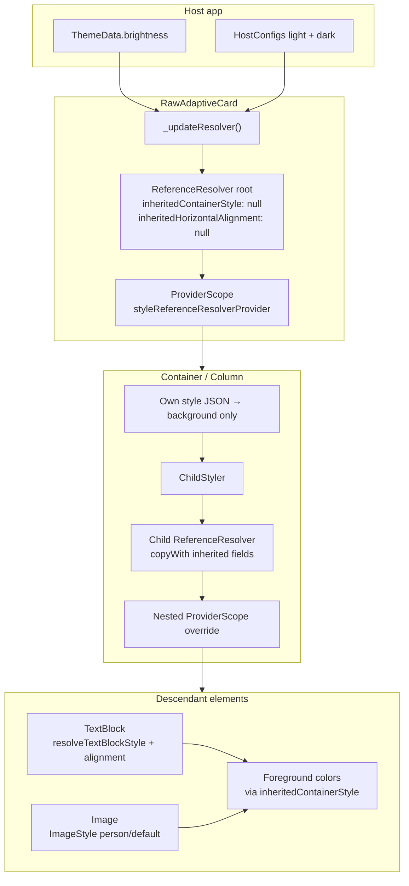
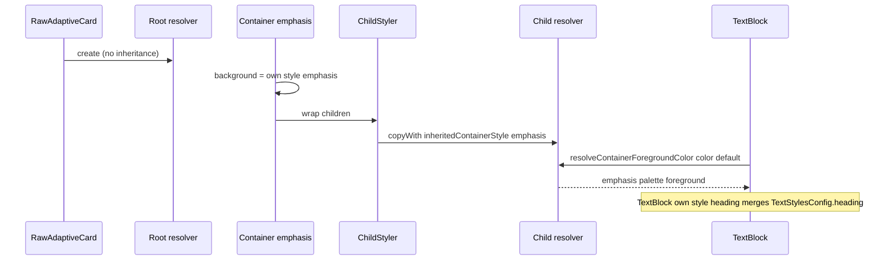

# HostConfig style pipeline

**Status**: ✅ Current | **Category**: Architecture

How parsed HostConfig JSON flows through `ReferenceResolver` into element rendering: container style inheritance, text/image style resolution, and the resolver facade pattern widgets use at build time.

**Related docs:**

| Topic                                                          | Document                                                                                                                |
| -------------------------------------------------------------- | ----------------------------------------------------------------------------------------------------------------------- |
| Theme-derived color fallbacks, brightness, serialization tests | [hostconfig.md](./hostconfig.md)                                                                                        |
| Monorepo placement and diagram canon                           | [Architecture-Overview.md](./Architecture-Overview.md)                                                                  |
| Agent playbook for styling work                                | [`.agents/skills/adaptive-cards-hostconfig-theme/SKILL.md`](../.agents/skills/adaptive-cards-hostconfig-theme/SKILL.md) |

**Official schema:** [host-config.json](https://github.com/microsoft/AdaptiveCards/blob/main/schemas/host-config.json) · package copy: [`host_config_schema.json`](../packages/flutter_adaptive_cards_fs/lib/src/hostconfig/host_config_schema.json)

---

## Model and parsing

HostConfig JSON deserializes into typed Dart classes under `packages/flutter_adaptive_cards_fs/lib/src/hostconfig/`. The root `HostConfig` object references nested configs (`containerStyles`, `foregroundColors`, `textStyles`, `fontSizes`, `spacing`, …).

Microsoft's `"default"` blocks in the schema define per-context defaults when a property is omitted — for example `TextStylesConfig.heading` vs `columnHeader` supply different default weight/size pairs for the same `TextStyleConfig` shape.

**Sample HostConfig JSON:** [Microsoft HostConfig samples](https://github.com/microsoft/AdaptiveCards/tree/main/samples/HostConfig)

**Serialization tests:** one fixture file per entity under `test/hostconfig/` — see [hostconfig-testing.md — Serialization test requirements](./hostconfig-testing.md#serialization-test-requirements).

---

## ReferenceResolver facade

At render time, `ReferenceResolver` (scoped via Riverpod `styleReferenceResolverProvider`) is the **only** surface element widgets should use for HostConfig values. Do not import underlying config classes directly in element code.

Resolution combines:

1. Explicit values from the active `HostConfig` (`hostConfigs.current`)
2. **`ThemeColorFallbacks`** when colors are omitted — see [hostconfig.md](./hostconfig.md#theme-derived-color-fallbacks)
3. Inherited container foreground context and alignment from parent `ChildStyler` scopes (below)

**Prefer resolver methods** over static config helpers:

```dart
// PREFER: resolver facade (production ImageSet pattern)
styleResolver.getImageSetConfig()?.imageSize(sizeDescription);

// AVOID: bypassing the resolver with static helpers + raw config objects
ImageSizesConfig.resolveImageSizes(
  ref.read(styleReferenceResolverProvider).getImageSizesConfig()!,
  sizeDescription,
);
```

Key resolver responsibilities include spacing, font sizes/weights, container foreground/background colors, badge styles, progress/chart colors, text block style merge, and image person/default style.

---

## Extension elements

Teams and hub extensions (`Chart.*`, `Badge`, `Carousel`, `ProgressBar`, `ProgressRing`, `TabSet`, …) follow the same resolver pattern as spec containers and elements. Badge uses `filled` / `tint` style names (not container `default` / `emphasis`) via `badgeStyles` on the resolver.

---

## Style inheritance data flow

HostConfig styling is applied through `ReferenceResolver`, scoped per card via Riverpod `styleReferenceResolverProvider`. Containers and columns wrap descendants with **`ChildStyler`**, which creates a nested `ProviderScope` override so children inherit foreground palette context and horizontal alignment without inheriting the parent's **background** color.

- **`inheritedContainerStyle`**: pushed by `ChildStyler`; used by `resolveContainerForegroundColor()` when an element's `color` is `default`.
- **Element `style` JSON**: each container's own property; used only for that element's `resolveContainerBackgroundColor()`.
- **`resolveTextBlockStyle()`**: merges `TextStylesConfig` defaults (`heading`, `columnHeader`) with per-element JSON overrides.
- **`resolveImageIsPerson()`**: true only when Image `style` is `person`.
- **`AdaptiveCardBrightnessMode`**: optional host override on `AdaptiveCardsCanvas` / `RawAdaptiveCard` (`auto`, `light`, `dark`). Brightness selection and theme fallbacks: [hostconfig.md — Brightness selection](./hostconfig.md#brightness-selection).



### Resolver field lifecycle

This sequence shows emphasis container background vs foreground inheritance for a nested `TextBlock` with `style: heading`.



`styleReferenceResolverProvider` is **overridden per subtree** by `ChildStyler` (nested `ProviderScope`), not only at the card root — see also [reactive-riverpod.md — Provider scopes](./reactive-riverpod.md#provider-scopes).

---

## Key implementation files

| File                                     | Role                                                        |
| ---------------------------------------- | ----------------------------------------------------------- |
| `lib/src/reference_resolver.dart`        | Resolution facade; `copyWith` for inheritance               |
| `lib/src/additional.dart`                | `ChildStyler` — nested `ProviderScope` + inherited resolver |
| `lib/src/hostconfig/host_config.dart`    | Parsed HostConfig graph                                     |
| `lib/src/flutter_raw_adaptive_card.dart` | Root resolver + scope overrides                             |
