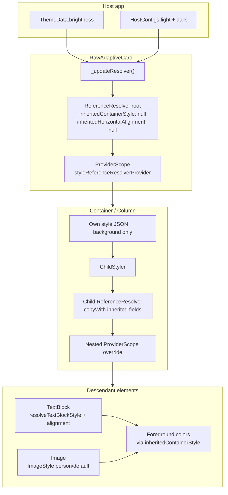
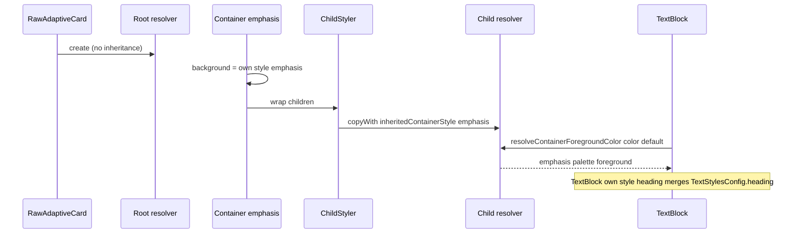

# HostConfig style pipeline completion

**Date:** 2026-06-06  
**Status:** **Archived / implemented.** Canonical docs: [`adaptive-style.md`](../../adaptive-style.md) (style inheritance), [`hostconfig.md`](../../hostconfig.md) (theme fallbacks, tests).

## Summary

Complete the HostConfig style pipeline in `flutter_adaptive_cards_fs` by wiring parsed config into rendering, fixing container style inheritance (`ChildStyler` is currently a no-op), separating **own background style** from **inherited foreground context**, implementing `TextBlockStyle` and `ImageStyle` resolution, inheriting `horizontalAlignment` from parent containers, and hardening existing brightness-based HostConfig switching.

## Problem

| Gap                            | Today                                                                                                                                   |
| ------------------------------ | --------------------------------------------------------------------------------------------------------------------------------------- |
| `ChildStyler`                  | Stub — returns `child` unchanged; TODO never implemented                                                                                |
| `ReferenceResolver.copyWith()` | Exists but is **never called**                                                                                                          |
| Container background           | Child with `style: "default"` inherits parent emphasis **background** (README open issue)                                               |
| `TextBlockStyle`               | `TextStylesConfig` parsed; `resolveTextBlockStyle()` missing; heading HostConfig defaults not applied                                   |
| `ImageStyle`                   | `loadIsPerson()` treats any non-`default` style as `person`                                                                             |
| `horizontalAlignment`          | Resolvers default to `left` when omitted; spec requires inheritance from parent container                                               |
| Dark mode                      | `Theme.of(context).brightness` switching exists in `_updateResolver()` but descendants may cache stale resolved values; no host opt-out |
| Documentation                  | Skill/docs describe `copyWith(style:)` on containers but implementation is missing; no data-flow diagram for style inheritance          |

## Approaches considered

### A. Extend `ReferenceResolver` + implement `ChildStyler` (**chosen**)

Push inherited state through `ReferenceResolver.copyWith()` and override `styleReferenceResolverProvider` in `ChildStyler`. Elements keep using `styleResolver` via `ProviderScopeMixin`.

**Pros:** Matches existing Riverpod architecture; smallest element churn; aligns with hostconfig-theme skill.
**Cons:** `copyWith` needs explicit inherit-vs-explicit-default semantics.

### B. Parallel `InheritedStyleScope` widget

**Pros:** Flutter-native rebuild propagation.
**Cons:** Dual styling mechanisms alongside Riverpod resolver.

### C. Immutable `StyleContext` stack

**Pros:** Clearest unset vs default vs named style semantics.
**Cons:** Largest refactor for marginal gain over A.

## Architecture

### Split “own style” from “inherited context”

`currentContainerStyle` is overloaded today — used for both container background and descendant foreground colors.

**Two fields on `ReferenceResolver`:**

| Field                     | Set by                                                         | Used for                                                                |
| ------------------------- | -------------------------------------------------------------- | ----------------------------------------------------------------------- |
| `inheritedContainerStyle` | Parent `ChildStyler` after applying parent's effective context | `resolveContainerForegroundColor()` when element `color` is default     |
| Element `style` JSON      | Each container's own `adaptiveMap['style']`                    | `resolveContainerBackgroundColor(style: …)` for **that** container only |

**Background rule:** Only the element's own `style` property selects its background. Omitted or `"default"` → default container background (card surface), **not** parent emphasis.

**Foreground rule:** Unset element `color` → use `inheritedContainerStyle` to pick the foreground palette.

**`ChildStyler`:**

1. Read parent resolver from `styleReferenceResolverProvider`.
2. Compute `inheritedContainerStyle` from parent's context and this container's `style`.
3. Compute `inheritedHorizontalAlignment` from this container's `horizontalAlignment` ?? parent's inherited value.
4. `ProviderScope` override with `parent.copyWith(...)`.
5. Wrap `child`.

**Containers using `ChildStyler`:** `AdaptiveContainer`, `AdaptiveColumn` (already wrapped). Verify `AdaptiveColumnSet` / nested paths pass scoped resolver to column children.

### TextBlockStyle resolution

Add `ResolvedTextStyle resolveTextBlockStyle(...)` on `ReferenceResolver`:

- Inputs: `styleName` (`default` \| `heading` \| `columnHeader`), plus optional element overrides (`size`, `weight`, `color`, `fontType`, `isSubtle`).
- Merge order: element JSON overrides HostConfig `TextStylesConfig` defaults for that style name.
- Wire in `AdaptiveTextBlock` for `Text` and `MarkdownStyleSheet`.
- Keep `Semantics(header: true)` when `style == 'heading'`.
- Table header cells: apply `columnHeader` when rendering header text.

### ImageStyle resolution

- `resolveImageIsPerson(imageStyle)` → true only when `imageStyle == 'person'`.
- Read Image `style` from `adaptiveMap['style']` only (ImageStyle enum), not container style mixin.
- Respect `backgroundColor` JSON with person clipping per spec.

### Horizontal alignment inheritance

Add `inheritedHorizontalAlignment` to `ReferenceResolver`.

```dart
String resolveEffectiveHorizontalAlignment(String? elementValue) =>
    elementValue ?? inheritedHorizontalAlignment ?? 'left';
```

Apply in `TextBlock`, `Image`, `Column`, `ColumnSet`, `Container` (where spec applies), `Table` / `TableCell`.

`ChildStyler` pushes alignment when the container sets `horizontalAlignment`.

### Dark mode hardening

Brightness switching already runs in `RawAdaptiveCardState._updateResolver()` via `Theme.of(context).brightness`.

| Gap                                                    | Fix                                                                                                                                            |
| ------------------------------------------------------ | ---------------------------------------------------------------------------------------------------------------------------------------------- |
| Stale cached styles in element `didChangeDependencies` | Rebuild card subtree when brightness changes (e.g. `setState` + resolver identity key on `ProviderScope`, or `rebuild()` on brightness change) |
| Host override                                          | Optional `brightnessMode: auto \| light \| dark` on `RawAdaptiveCard` / `AdaptiveCardsCanvas`                                                  |
| Tests                                                  | Widget tests toggling `ThemeData(brightness: …)` with distinct light/dark HostConfig colors                                                    |

## Style inheritance data flow

Canonical diagram for docs (also embedded in [`docs/adaptive-style.md`](../../adaptive-style.md) after implementation):



### Resolver field lifecycle



## Error handling

- Unknown `TextBlock.style` → treat as `"default"` (debug log).
- Unknown container `style` → null background + fallback foreground (existing).
- Missing HostConfig subsection → `FallbackConfigs` (unchanged).

## Testing

| Area                                                           | Test type                   |
| -------------------------------------------------------------- | --------------------------- |
| Nested emphasis → child `style: default` background            | Widget + golden             |
| Foreground inherits emphasis in nested text                    | Widget                      |
| `style: heading` applies HostConfig heading size/weight        | Resolver unit + golden      |
| Image `person` vs `default`                                    | Widget                      |
| ColumnSet `horizontalAlignment: center` inherited by TextBlock | Widget                      |
| Theme brightness flip updates colors                           | Widget with `Theme` wrapper |

New file: `packages/flutter_adaptive_cards_fs/test/style/inheritance_test.dart`.

## Out of scope

- `bleed` property
- Action fallback / `requires` gating
- RichTextBlock
- Replacing flutter_markdown

## Implementation plan

### Phase 1 — Resolver model

1. Rename / add fields on `ReferenceResolver`: `inheritedContainerStyle`, `inheritedHorizontalAlignment`; deprecate overloaded `currentContainerStyle` usage.
2. Update `copyWith` to accept optional inherited fields (null = keep parent value).
3. Split `resolveContainerBackgroundColor` to use element `style` only.
4. Update `resolveContainerForegroundColor` to use `inheritedContainerStyle`.
5. Add `resolveTextBlockStyle`, `resolveImageIsPerson`, `resolveEffectiveHorizontalAlignment`.
6. Update alignment helpers to use effective alignment.

### Phase 2 — Widget wiring

1. Implement `ChildStyler` with nested `ProviderScope`.
2. Update `AdaptiveContainer`, `AdaptiveColumn`, `column_set` as needed.
3. Update `AdaptiveTextBlock`, `AdaptiveImage`, `AdaptiveTable` headers.
4. Harden `_updateResolver` + brightness opt-out + subtree refresh.

### Phase 3 — Tests

1. Unit tests for resolver merge rules.
2. Widget tests per table above.
3. Goldens for heading style + nested container backgrounds (if stable).

### Phase 4 — Documentation updates

Update docs so the style pipeline and data-flow diagrams are discoverable and match implementation. **Do not mark docs done until diagrams and `ChildStyler` behavior match code.**

#### Diagram copy checklist (required)

Copy the two mermaid blocks **verbatim** from the [Style inheritance data flow](#style-inheritance-data-flow) section of **this spec** into user-facing docs. Source of truth during implementation is this file; after copy, `docs/adaptive-style.md` becomes the canonical published location.

| #   | Diagram                                          | Source in this spec                          | Copy into                                           | Anchor heading                   |
| --- | ------------------------------------------------ | -------------------------------------------- | --------------------------------------------------- | -------------------------------- |
| 1   | **Style inheritance data flow** (`flowchart TD`) | Lines under `## Style inheritance data flow` | [`docs/adaptive-style.md`](../../adaptive-style.md) | `## Style inheritance data flow` |
| 2   | **Resolver field lifecycle** (`sequenceDiagram`) | Lines under `### Resolver field lifecycle`   | [`docs/adaptive-style.md`](../../adaptive-style.md) | `### Resolver field lifecycle`   |

**Copy procedure:**

1. Add a new top-level section **Style inheritance data flow** to `docs/adaptive-style.md` (after HostConfig / ReferenceResolver intro, or at end if structure is unclear).
2. Paste diagram **1** (`flowchart TD` …) under that heading, unchanged.
3. Add subsection **Resolver field lifecycle** immediately below.
4. Paste diagram **2** (`sequenceDiagram` …) under that subsection, unchanged.
5. Add brief prose before each diagram explaining what it shows (2–4 sentences each); do not alter mermaid node labels or edges.
6. Run a diff against this spec to confirm the two ` ```mermaid ` blocks match byte-for-byte (except optional trailing newline).
7. In other docs, **link** to `docs/adaptive-style.md#style-inheritance-data-flow` and `#resolver-field-lifecycle` rather than duplicating the diagrams—unless the skill README requires an inline copy (see table below).

| Document                                                                                                                      | Updates                                                                                                                                                                                                                                                          |
| ----------------------------------------------------------------------------------------------------------------------------- | ---------------------------------------------------------------------------------------------------------------------------------------------------------------------------------------------------------------------------------------------------------------- |
| [`docs/adaptive-style.md`](../../adaptive-style.md)                                                                           | **Required:** copy both diagrams per checklist above; document `inheritedContainerStyle` vs own `style` for background; document `resolveTextBlockStyle` and alignment inheritance; remove/fix any `copyWith(style:)` examples that imply unimplemented behavior |
| [`docs/Architecture-Overview.md`](../../Architecture-Overview.md)                                                             | Add subsection under styling / Riverpod: short prose summary + links to both diagram anchors in `adaptive-style.md` (do not duplicate mermaid here)                                                                                                              |
| [`docs/reactive-riverpod.md`](../../reactive-riverpod.md)                                                                     | Note that `styleReferenceResolverProvider` is **overridden per subtree** by `ChildStyler` (nested `ProviderScope`), not only at card root; link to `adaptive-style.md#style-inheritance-data-flow`                                                               |
| [`docs/Implementation-Status.md`](../../Implementation-Status.md)                                                             | Move TextBlockStyle / ImageStyle / container style inheritance items from Known Gaps when implemented; update `_Last Updated_`                                                                                                                                   |
| [`.agents/skills/adaptive-cards-hostconfig-theme/SKILL.md`](../../../.agents/skills/adaptive-cards-hostconfig-theme/SKILL.md) | Replace stale dark-mode limitation if fixed; document `ChildStyler`, inherited fields, `resolveTextBlockStyle`; link to both diagram anchors (or paste diagram 1 only if skill must be self-contained offline); fix `copyWith` example to match new API          |
| [`packages/flutter_adaptive_cards_fs/README.md`](../../../packages/flutter_adaptive_cards_fs/README.md)                       | Remove or strike through open TODO for container style unset once fixed; link to `docs/adaptive-style.md#style-inheritance-data-flow`                                                                                                                            |
| [`packages/flutter_adaptive_cards_fs/CHANGELOG.md`](../../../packages/flutter_adaptive_cards_fs/CHANGELOG.md)                 | Unreleased entry summarizing style pipeline completion; mention new style-inheritance diagrams in `docs/adaptive-style.md`                                                                                                                                       |

**Documentation acceptance criteria:**

- Both mermaid diagrams are copied verbatim into `docs/adaptive-style.md` and render in GitHub preview or IDE.
- `diff` of mermaid blocks: spec ↔ `adaptive-style.md` shows no semantic changes to diagram content.
- `Architecture-Overview`, `reactive-riverpod`, and README link to the diagram anchors; they do not contain divergent copies.
- No doc claims `ChildStyler` or `copyWith` work until Phase 2 lands.
- Skill and Architecture docs cross-link to the canonical diagram section in `adaptive-style.md`.

## Files touched (estimate)

| File                                                                        | Change                                                                        |
| --------------------------------------------------------------------------- | ----------------------------------------------------------------------------- |
| `lib/src/reference_resolver.dart`                                           | Inherited fields, text/image/alignment resolvers, background/foreground split |
| `lib/src/additional.dart`                                                   | Implement `ChildStyler`                                                       |
| `lib/src/cards/elements/text_block.dart`                                    | `resolveTextBlockStyle`                                                       |
| `lib/src/cards/elements/image.dart`                                         | ImageStyle fix                                                                |
| `lib/src/cards/containers/container.dart`, `column.dart`, `column_set.dart` | Background + ChildStyler                                                      |
| `lib/src/flutter_raw_adaptive_card.dart`                                    | Brightness hardening                                                          |
| `lib/src/cards/containers/table.dart`                                       | `columnHeader` on headers                                                     |
| `test/style/inheritance_test.dart`                                          | New                                                                           |
| `docs/adaptive-style.md`                                                    | Copy both mermaid diagrams from this spec (Phase 4 checklist) + prose         |
| Other docs (see Phase 4 table)                                              | Links to diagram anchors; pipeline description                                |

## Verification

```bash
cd packages/flutter_adaptive_cards_fs
fvm flutter test test/style/
fvm flutter test --exclude-tags=golden
fvm flutter analyze
```

After doc updates, `diff` the two mermaid blocks in `docs/adaptive-style.md` against the [Style inheritance data flow](#style-inheritance-data-flow) section of this spec (diagram copy checklist, Phase 4).
