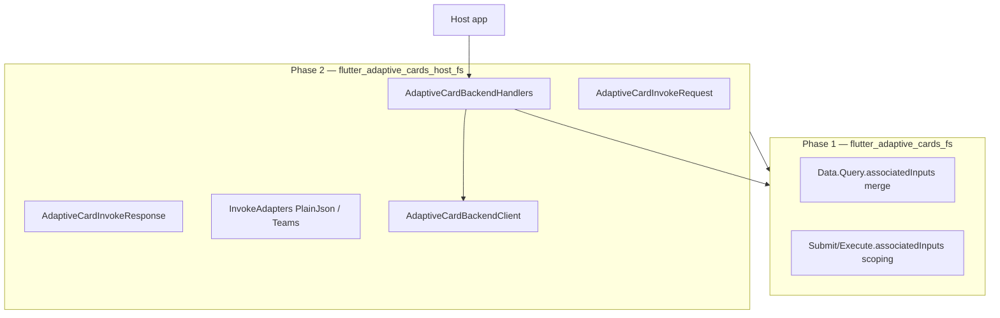

# Backend Host Integration Design

**Status:** **Archived / implemented.** Canonical guide: [`backend-host-integration.md`](../../backend-host-integration.md). Implementation plan: [`2026-06-07-backend-host-integration.plan.md`](../../superpowers/plans/2026-06-07-backend-host-integration.plan.md).

## Problem

Hosts integrating `flutter_adaptive_cards_fs` with a backend (custom flow-services or Teams-shaped APIs) reimplement the same glue on every project:

- **Outbound:** Map `SubmitActionInvoke`, `ExecuteActionInvoke`, and `InputChangeInvoke` into HTTP request bodies.
- **Inbound:** Parse server JSON into `applyUpdates`, validation errors, or full card replacement.
- **Dynamic inputs:** Teams `Data.Query.associatedInputs` is parsed but ignored; dependent-input demos require manual sibling-value tracking.

The renderer exposes strong primitives but no round-trip pipeline.

## Goals

1. **Phase 1 (core):** Teams-correct invoke payloads from the renderer (`associatedInputs` for `Data.Query`, `Action.Submit`, `Action.Execute`).
2. **Phase 2 (host package):** Optional `flutter_adaptive_cards_host_fs` with request serialization, response parsing, `applyTo(cardState)`, and handler wiring.

## Non-goals

- Full Bot Framework Activity / conversation state management
- OAuth / Teams SSO on `Action.Execute`
- Server-side choice fetching inside the renderer
- Container-scoped `associatedInputs: auto` for Submit/Execute (follow-up)
- Filtered ChoiceSet `onChange` on every typeahead keystroke (Phase 1b)

## Architecture



Phase 2 depends on Phase 1 but Phase 1 ships standalone value.

---

## Phase 1 — Renderer: `associatedInputs`

### Data.Query (`choices.data`)

| Rule          | Behavior                                                                                                                                |
| ------------- | --------------------------------------------------------------------------------------------------------------------------------------- |
| Parse         | `"auto"` \| `"none"` on `choices.data`; default **`"auto"`** when omitted                                                               |
| Trigger       | `Input.ChoiceSet` selection calls `changeValue` with a `DataQuery`                                                                      |
| Merge         | When `associatedInputs != "none"`, merge all other input ids from `collectInputValues()` into `DataQuery.parameters` (input id → value) |
| Exclude       | Firing input id is never copied into `parameters`                                                                                       |
| Author params | JSON `parameters` are preserved; sibling values overwrite on key collision                                                              |

`InputChangeInvoke.dataQuery` becomes backend-ready without host-side sibling tracking.

### Action.Submit / Action.Execute

| `associatedInputs`  | Behavior                                                                                     |
| ------------------- | -------------------------------------------------------------------------------------------- |
| omitted or `"auto"` | Merge all card input values into action `data` (inputs win on key collision — existing rule) |
| `"none"`            | Only action JSON `data`; no `collectInputValues()` merge                                     |

**MVP limitation:** Card-wide collection for `auto`. Container-scoped `auto` (Teams nested containers) is a documented follow-up.

### Files (Phase 1)

| File                                   | Change                                              |
| -------------------------------------- | --------------------------------------------------- |
| `lib/src/models/data_query.dart`       | `associatedInputs` field; `withMergedSiblingInputs` |
| `lib/src/utils/associated_inputs.dart` | **New** — shared merge helpers                      |
| `lib/src/cards/inputs/choice_set.dart` | Enrich `dataQuery` before `changeValue`             |
| `lib/src/action/default_actions.dart`  | Honor `associatedInputs` on Submit/Execute          |
| Tests + Widgetbook handler + docs      | Close Known Gaps                                    |

---

## Phase 2 — Host package

### Package

- **Name:** `flutter_adaptive_cards_host_fs`
- **Location:** `packages/flutter_adaptive_cards_host_fs`
- **Depends on:** `flutter_adaptive_cards_fs`, `http`
- **Workspace:** Add to root `pubspec.yaml` `workspace:` list

### AdaptiveCardInvokeRequest (outbound)

Immutable envelope from library invoke types:

```dart
enum AdaptiveCardInvokeKind { submit, execute, inputChange, openUrl, openUrlDialog }

class AdaptiveCardInvokeRequest {
  const AdaptiveCardInvokeRequest({
    required this.kind,
    this.actionId,
    this.verb,
    this.data = const {},
    this.inputId,
    this.value,
    this.dataQuery,
    this.url,
  });

  factory AdaptiveCardInvokeRequest.fromSubmit(SubmitActionInvoke invoke);
  factory AdaptiveCardInvokeRequest.fromExecute(ExecuteActionInvoke invoke);
  factory AdaptiveCardInvokeRequest.fromInputChange(InputChangeInvoke invoke);
  factory AdaptiveCardInvokeRequest.fromOpenUrl(OpenUrlActionInvoke invoke);
  factory AdaptiveCardInvokeRequest.fromOpenUrlDialog(OpenUrlDialogActionInvoke invoke);
}
```

### Invoke adapters

| Adapter                  | Role                                             |
| ------------------------ | ------------------------------------------------ |
| `PlainJsonInvokeAdapter` | Default flat map for custom flow-services        |
| `TeamsInvokeAdapter`     | Bot Framework–shaped Execute / input invoke maps |

Adapters are pure `toMap` / `fromMap`; no network.

### AdaptiveCardInvokeResponse (inbound)

Effects parsed from backend JSON:

```dart
sealed class AdaptiveCardInvokeEffect {}

class ReplaceCardEffect extends AdaptiveCardInvokeEffect {
  ReplaceCardEffect(this.card);
  final Map<String, dynamic> card;
}

class ApplyPatchesEffect extends AdaptiveCardInvokeEffect {
  ApplyPatchesEffect(this.elements);
  final List<AdaptiveElementUpdate> elements;
}

class SetInputErrorsEffect extends AdaptiveCardInvokeEffect {
  SetInputErrorsEffect(this.errors);
  final Map<String, String> errors;
}

class NoOpEffect extends AdaptiveCardInvokeEffect {}
```

**Apply order:** `ApplyPatches` → `SetInputErrors` → `ReplaceCard` (replace requires host `onCardReplaced`).

### Default PlainJson response contract

```json
{
  "type": "adaptiveCard.invokeResponse",
  "effects": [
    { "type": "applyPatches", "elements": [{ "id": "city", "choices": [{ "title": "Paris", "value": "paris" }] }] },
    { "type": "setInputErrors", "errors": { "email": "Invalid format" } }
  ]
}
```

Shorthand full replacement:

```json
{
  "type": "adaptiveCard.invokeResponse",
  "card": { "type": "AdaptiveCard", "version": "1.5", "body": [] }
}
```

`TeamsInvokeResponseAdapter` maps common Bot Framework attachment / task shapes into the same effect types.

### AdaptiveCardBackendClient

```dart
abstract class AdaptiveCardBackendClient {
  Future<Map<String, dynamic>> post(Map<String, dynamic> body);
}
```

Reference: `HttpAdaptiveCardBackendClient` using `http` POST + JSON decode.

### AdaptiveCardBackendHandlers

Factory producing `InheritedAdaptiveCardHandlers` that:

1. Build `AdaptiveCardInvokeRequest` from invoke callback
2. Serialize via adapter
3. `client.post`
4. Parse `AdaptiveCardInvokeResponse`
5. `response.applyTo(cardState)`; call `onCardReplaced` for `ReplaceCardEffect`

Hosts may pass `onError` for network/parse failures. Individual callbacks can be overridden.

### Error handling

| Case                                   | Behavior                                              |
| -------------------------------------- | ----------------------------------------------------- |
| Network failure                        | `onError`; card unchanged                             |
| Malformed response                     | `AdaptiveCardInvokeResponseParseException`; `onError` |
| Unknown effect `type`                  | Skip in release; log in debug                         |
| `ReplaceCard` without `onCardReplaced` | `StateError` in `applyTo`                             |

---

## Testing

| Layer       | Coverage                                                                                                        |
| ----------- | --------------------------------------------------------------------------------------------------------------- |
| Phase 1     | `associated_inputs_test`, extend `choice_set_data_query_test`, `execute_verb_test`, `dependent_choice_set_test` |
| Phase 2     | Request factories, adapter round-trip, response parser, `applyTo` widget tests with mock client                 |
| Integration | Widgetbook Option 2 + mock `HttpAdaptiveCardBackendClient`                                                      |

Verification (full suite): repo `fvm flutter analyze`; `packages/flutter_adaptive_cards_fs` and `packages/flutter_adaptive_cards_host_fs` test with `--exclude-tags=golden`.

---

## References

- [Teams dependent inputs](https://learn.microsoft.com/en-us/microsoftteams/platform/task-modules-and-cards/cards/dynamic-search#dependent-inputs)
- [Action.Execute UAM](https://learn.microsoft.com/en-us/adaptive-cards/authoring-cards/universal-action-model)
- Existing plan: [`docs/plans/2026-06-05-dependent_choiceset_demos_fefa38f7.plan.md`](../../plans/2026-06-05-dependent_choiceset_demos_fefa38f7.plan.md) Phase 2
- [`docs/actions-architecture.md`](../../actions-architecture.md)
- [`docs/form-inputs.md`](../../form-inputs.md)
