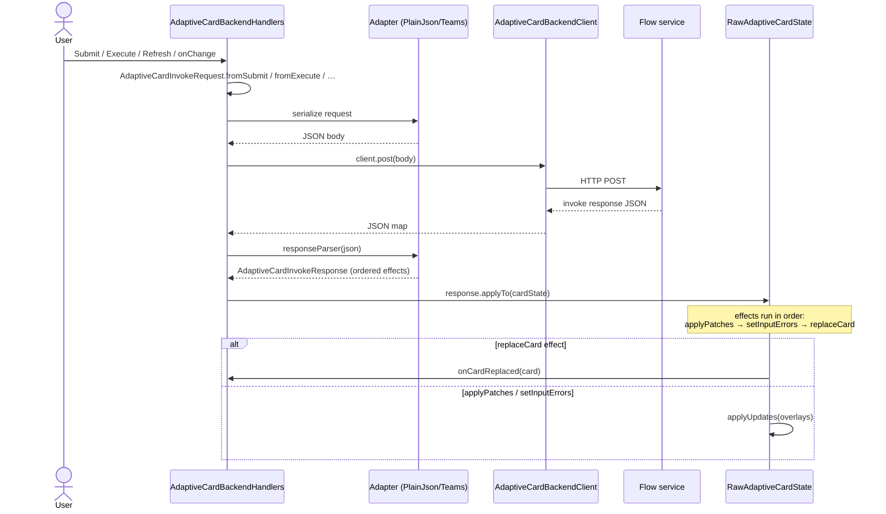
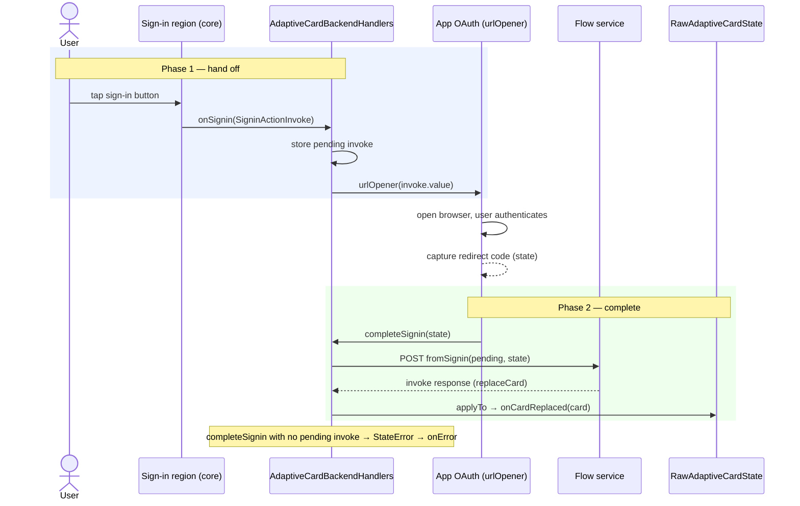

# Backend Host Integration

**Status**: ✅ Current | **Category**: How-to (integration guide)

This document describes how to connect **`flutter_adaptive_cards_fs`** to a backend flow-service (custom REST API or Teams/Bot Framework–shaped invoke). Implementation lives in optional package **`flutter_adaptive_cards_host_fs`**.

**Related:**

- [optional-packages-and-extensions.md](./optional-packages-and-extensions.md) — why the host package is separate from core
- [actions-architecture.md](./actions-architecture.md) — typed invoke callbacks on `InheritedAdaptiveCardHandlers`
- [form-inputs.md](./form-inputs.md) — `associatedInputs` and dependent ChoiceSets
- [reactive-riverpod.md](./reactive-riverpod.md#server-driven-patches-host-package) — how response effects map to overlays
- [Package README](../packages/flutter_adaptive_cards_host_fs/README.md) — API quick reference
- Design history: [archived spec](./archive/specs/2026-06-07-backend-host-integration-design.md) · [implementation plan](./superpowers/plans/2026-06-07-backend-host-integration.plan.md)

---

## When to use which layer

| Need                                                                                | Package                                                 |
| ----------------------------------------------------------------------------------- | ------------------------------------------------------- |
| Render cards; wire callbacks manually                                               | **`flutter_adaptive_cards_fs`** only                    |
| Teams-correct invoke **payloads** (`associatedInputs` on Submit/Execute/Data.Query) | Core (Phase 1 — always available)                       |
| Serialize → POST → parse → apply patches automatically                              | **`flutter_adaptive_cards_host_fs`** (Phase 2 — opt in) |

Phase 2 depends on Phase 1 but Phase 1 is useful without the host package.

---

## Architecture


1. User triggers Submit, Execute, Refresh, or input `onChange`.
2. **`AdaptiveCardBackendHandlers`** builds **`AdaptiveCardInvokeRequest`**, serializes via adapter, **`POST`s** through **`AdaptiveCardBackendClient`**.
3. Response JSON parses to **`AdaptiveCardInvokeResponse`** with ordered **effects**.
4. **`response.applyTo(cardState)`** writes overlays via core APIs (`applyUpdates`, validation errors) or calls **`onCardReplaced`** for full card JSON.

The round-trip over time:



On failure at any step (`post`, parse, apply), the error routes to **`onError`** and the rendered card is left unchanged.

---

## Quick start

```dart
import 'dart:developer';

import 'package:flutter/material.dart';
import 'package:flutter_adaptive_cards_fs/flutter_adaptive_cards_fs.dart';
import 'package:flutter_adaptive_cards_host_fs/flutter_adaptive_cards_host_fs.dart';

final cardKey = GlobalKey<RawAdaptiveCardState>();

AdaptiveCardBackendHandlers(
  client: HttpAdaptiveCardBackendClient(
    endpoint: Uri.parse('https://api.example.com/adaptive-card/invoke'),
  ),
  cardKey: cardKey,
  onError: (error) => log('invoke failed', error: error),
).wrap(
  RawAdaptiveCard.fromMap(
    key: cardKey,
    map: cardJson,
    hostConfigs: HostConfigs(),
  ),
  onCardReplaced: (map) => setState(() => cardJson = map),
);
```

**Requirements:**

- The same **`GlobalKey<RawAdaptiveCardState>`** on **`AdaptiveCardBackendHandlers`** and **`RawAdaptiveCard`** (Submit/Execute/Refresh resolve state from the key).
- **`InputChangeInvoke`** uses **`invoke.cardState`** directly (no key lookup).
- Provide **`onCardReplaced`** when the backend may return full replacement card JSON.

---

## Wire protocol (payloads, adapters, response effects)

The request payloads core builds (`associatedInputs` on `Data.Query` / Submit / Execute / `refresh`), the request adapters (PlainJson / Teams), the response contract, effect apply order, and the error table are documented in the reference companion: [`backend-invoke-reference.md`](backend-invoke-reference.md).

---

## Trust boundary & security

There are **two** untrusted edges, each guarded independently:

```txt
Card JSON ──▶ renderer (flutter_adaptive_cards_fs)
              guarded by AdaptiveUriPolicy / AdaptiveFetchPolicy
              (OpenUrl, markdown, OpenUrlDialog, network card, images, media)

Backend response ──▶ host bridge (flutter_adaptive_cards_host_fs)
              guarded by maxResponseBytes (decodeJsonMapWithLimit)
              + optional cardValidator on replaceCard
```

- **Card → renderer:** untrusted card-controlled URLs are validated by **`AdaptiveUriPolicy`** (scheme allowlist + loopback/private-host blocking) and remote fetches are bounded by **`AdaptiveFetchPolicy`** (byte cap + timeout). See the `flutter_adaptive_cards_fs` README _Security_ section.
- **Backend → host:** the response body is size-capped by **`HttpAdaptiveCardBackendClient.maxResponseBytes`** (throws **`AdaptiveJsonTooLargeException`**), and a **`replaceCard`** payload can be screened with an **`AdaptiveCardValidator`** (`cardValidator` on **`applyTo`** / **`wrap`**) before it renders.
- **Do not** log **`AdaptiveCardBackendException.body`** in production; it may contain attacker-controlled content.

---

## Root card refresh

**`AdaptiveCardBackendHandlers`** wires **`onRefresh`** the same as Execute: builds **`AdaptiveCardInvokeRequest`** from **`RefreshActionInvoke`**, POSTs, applies effects. Host replaces card JSON when the response includes **`replaceCard`** or patches fields in place.

**Example (widgetbook sample):** **AdaptiveCard → Refresh** (`widgetbook/lib/refresh_demo_page.dart`).

---

## Sign-in (authentication)

Cards with a root **`authentication`** object render a sign-in region (prompt text + buttons). When a button is tapped, core dispatches **`SigninActionInvoke`** to **`onSignin`**.

**`AdaptiveCardBackendHandlers`** handles the full round-trip:

1. User taps the sign-in button → core calls **`onSignin`** → the handler stores the pending invoke and opens `invoke.value` (the sign-in URL) via **`urlOpener`**.
2. Your app captures the OAuth redirect code (the _magic state_ / verification code).
3. Call **`handlers.completeSignin(state: '<code>')`** → POSTs a **`signin`** invoke (`AdaptiveCardInvokeKind.signin`) with the connection name and state, parses the response as a normal effect pipeline, and applies a **`replaceCard`** effect to swap in the authenticated card.

This is a **two-phase** flow — the app's OAuth step happens between them:



```dart
final cardKey = GlobalKey<RawAdaptiveCardState>();
final handlers = AdaptiveCardBackendHandlers(
  client: myClient,
  cardKey: cardKey,
  urlOpener: (url) async {
    // open in an in-app browser / external browser and capture the redirect
    final code = await myAuthFlow.open(url);
    await handlers.completeSignin(state: code);
  },
  onError: (e) => log('sign-in failed', error: e),
);

handlers.wrap(
  RawAdaptiveCard.fromMap(key: cardKey, map: cardJson, hostConfigs: HostConfigs()),
  onCardReplaced: (map) => setState(() => cardJson = map),
);
```

**Teams:** `completeSignin` serializes via `TeamsInvokeAdapter` when it is set as `requestAdapter`, emitting `signin/verifyState` with `value.state` set to the captured code.

**PlainJson shape:**

```json
{
  "kind": "signin",
  "connectionName": "myConn",
  "url": "https://login...",
  "value": "<code>"
}
```

**Error cases:** if `completeSignin` is called before any sign-in button has been tapped, `onError` receives a `StateError`. Network/parse failures follow the normal `onError` path.

---

## Custom transport

Implement **`AdaptiveCardBackendClient`** for gRPC, WebSocket, or in-memory tests:

```dart
class MockBackendClient implements AdaptiveCardBackendClient {
  @override
  Future<Map<String, dynamic>> post(Map<String, dynamic> body) async {
    return {'type': 'adaptiveCard.invokeResponse', 'effects': []};
  }
}
```

Tests: `packages/flutter_adaptive_cards_host_fs/test/`.

---

## Consumer checklist

```yaml
dependencies:
  flutter_adaptive_cards_fs: ^0.10.0
  flutter_adaptive_cards_host_fs: ^0.10.0
```

1. Add both packages.
2. Create shared **`GlobalKey<RawAdaptiveCardState>`**.
3. Wrap **`RawAdaptiveCard`** with **`AdaptiveCardBackendHandlers.wrap(...)`**.
4. Implement **`onCardReplaced`** if the server can return full card JSON.
5. Handle **`onError`** for network/parse failures.
6. (Optional) Switch to **`TeamsInvokeAdapter`** for Bot Framework APIs.

---

## Verification

```bash
cd packages/flutter_adaptive_cards_host_fs
fvm flutter test
```

Core **`associatedInputs`** tests live in `packages/flutter_adaptive_cards_fs/test/utils/associated_inputs_test.dart` and related input tests.

---

_Last updated: 2026-06-09_
