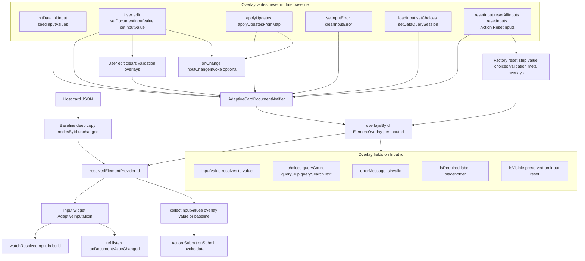
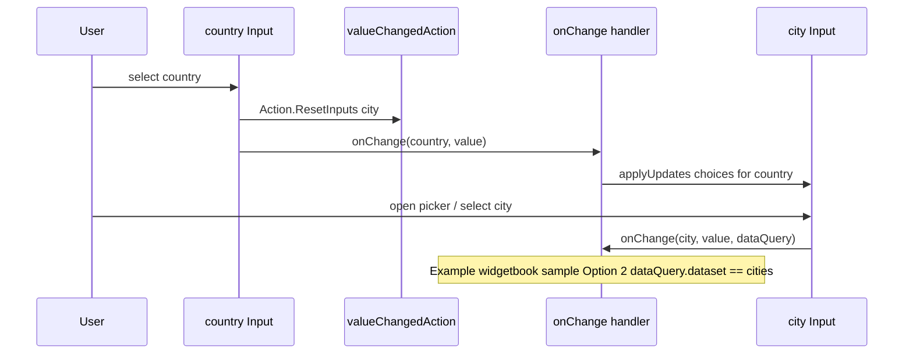

# This project uses Flutter form for all AdaptiveCard Input types

All input types have a choice of using basic flutter widgets or using flutter form widgets. This project is standardizing on flutter forms.

## Runtime values (baseline + overlays)

Input **initial** values come from the card JSON (`adaptiveMap['value']`) when the widget is first built. User edits and programmatic reset/submit do **not** mutate that map.

Runtime state is stored in Riverpod document **overlays** keyed by input id:

- User typing → `setInputValue(id, value)` → overlay `inputValue`
- Submit → `collectInputValues()` returns `overlay.inputValue ?? baseline['value']` per input id
- Reset → `resetAllInputs()` (or per-id `resetInput(id)`) clears **input** overlays so UI matches **baseline JSON** for `value`, `choices`, validation, **`isRequired`**, **`label`**, and **`placeholder`**. See [Reset semantics in reactive-riverpod.md](reactive-riverpod.md#reset-semantics).

`AdaptiveInputMixin` listens to `resolvedElementProvider(id)` so controllers stay in sync when overlays change. New inputs must call `setDocumentInputValue(...)` on change and handle `onDocumentValueChanged` when syncing controllers from document updates.

For the full overlay model (all element types), see [`overlay-properties-by-type.md`](overlay-properties-by-type.md) and [`reactive-riverpod.md`](reactive-riverpod.md). The diagram below is **input-only**.

## Input overlay architecture

`Input.*` widgets never mutate host JSON at runtime. Each input `id` has a baseline node in `nodesById` plus an optional sparse `ElementOverlay` in `overlaysById`. The widget reads a **resolved** map from `resolvedElementProvider(id)` (baseline merged with overlay patches). User typing and host APIs write overlays through `AdaptiveCardDocumentNotifier`; Submit reads merged values via `collectInputValues()`.



| Phase          | Path                                                          | Result                                                                                                                   |
| -------------- | ------------------------------------------------------------- | ------------------------------------------------------------------------------------------------------------------------ |
| **Load**       | Host JSON → baseline copy; registry builds `Input.*` widgets  | Initial display from baseline `value`, `choices`, `label`, …                                                             |
| **Seed**       | `initData` / `initInput` → `seedInputValues` / `applyUpdates` | Overlay patches only (post-frame after mount)                                                                            |
| **Edit**       | User input → `setDocumentInputValue` → `setInputValue`        | `inputValue` overlay; validation overlays cleared                                                                        |
| **Host patch** | `applyUpdates`, `setInputError`, `loadInput`, …               | Choices, validation, dynamic label/required, etc.                                                                        |
| **Submit**     | `collectInputValues()`                                        | `overlay.inputValue ?? baseline['value']` per input id                                                                   |
| **Reset**      | `resetInput` / `resetAllInputs` / `Action.ResetInputs`        | Value, choices, validation, `isRequired`, `label`, `placeholder` → baseline; `isVisible` and typeahead session preserved |

Deeper dives: [initData vs applyUpdates](#initdata--initinput-vs-applyupdates), [Reset behavior](#reset-behavior-resetallinputs--resetinput--resetinputs), [Dependent ChoiceSet](#dependent-choiceset-country--city) (sequence diagram), [reactive-riverpod.md — Reset semantics](reactive-riverpod.md#reset-semantics).

## Host-driven validation and bulk updates

After submit or server-side checks, hosts can set validation overlays without mutating card JSON:

- `RawAdaptiveCardState.setInputError(id, message:, isInvalid: true)` → document notifier `setInputError`
- `RawAdaptiveCardState.clearInputError(id)` → clears overlay `errorMessage` and `isInvalid`
- `RawAdaptiveCardState.applyUpdates(...)` / `applyUpdatesFromMap(...)` → batch validation, visibility, choices, values, and action `isEnabled` in one call

Example remote validation after `onSubmit` (wire on **`InheritedAdaptiveCardHandlers`**, not on **`AdaptiveCardsCanvas`**). Use **`invoke.data`** for merged input values; use **`invoke.actionId`** when routing by action `id`:

```dart
onSubmit: (SubmitActionInvoke invoke) async {
  final errors = await validate(invoke.data);
  invoke.cardState.applyUpdates(
    elements: errors.entries.map(
      (e) => AdaptiveElementUpdate(
        id: e.key,
        errorMessage: e.value,
        isInvalid: true,
      ),
    ),
  );
},
```

`AdaptiveInputMixin` merges overlay `errorMessage` / `isInvalid` / `isRequired` into the resolved listener; `showValidationError` drives `loadErrorMessage`. User edits call `setInputValue`, which clears validation overlays so typing dismisses host errors.

## initData / initInput vs applyUpdates

| Scenario                          | API                                                      |
| --------------------------------- | -------------------------------------------------------- |
| Simple prefill at card load       | `initData: {'name': 'Jane'}`                             |
| Async value-only late bind        | `cardState.initInput({'name': fetched})`                 |
| Rich load-time or handler patches | `cardState.applyUpdates(...)` or `applyUpdatesFromMap`   |
| Patch-map `initData`              | `initData: {'state': {'choices': [...], 'value': 'CA'}}` |

`seedInputValues` is implemented as value-only `applyUpdates` (single revision bump).

See [`reactive-riverpod.md`](reactive-riverpod.md#how-overlays-change-values-initialized-from-the-adaptive-map). For an **input-only** end-to-end diagram, see [`form-inputs.md` — Input overlay architecture](form-inputs.md#input-overlay-architecture).

## Reset behavior (`resetAllInputs` / `resetInput` / `resetInputs`)

`Action.ResetInputs` uses **`executeResetInputsAction`**: omitted **`targetInputIds`** → **`resetAllInputs()`**; non-empty list → **`resetInputs(ids)`**; empty **`[]`** → no-op. Hosts can reset one field with **`resetInput(id)`** (notifier; mixin delegates for widget sync).

Input elements may define **`valueChangedAction`** with embedded **`Action.ResetInputs`** (Teams dependent-input pattern). When the user changes the field, listed targets are factory-reset. **`Input.ChoiceSet`**, **`Input.Date`**, **`Input.Time`**, and **`Input.Toggle`** fire immediately; **`Input.Text`** and **`Input.Number`** fire on focus loss or editing complete (not each keystroke).

Both APIs use the same **factory reset to baseline** for `Input.*` elements:

- **Cleared:** `value`, `choices`, `errorMessage`, `isInvalid`, **`isRequired`**, **`label`**, **`placeholder`** (overlay removed → baseline JSON wins)
- **Preserved on that input:** `isVisible`, typeahead session (`queryCount` / `querySkip` / `querySearchText`)
- **Not reset:** TextBlock text, Image url, action `isEnabled`, other non-input overlays

To restore host-driven state after reset, call `initInput`, `applyUpdates`, or `applyUpdatesFromMap` again.

Full detail: [Reset semantics](reactive-riverpod.md#reset-semantics). Specs: [`2026-06-03-overlay-reset-semantics-design.md`](superpowers/specs/2026-06-03-overlay-reset-semantics-design.md), [`2026-06-04-action-resetinputs-targetinputids-design.md`](superpowers/specs/2026-06-04-action-resetinputs-targetinputids-design.md).

## Dependent ChoiceSet (country → city)

Teams/Bot Framework [dependent inputs](https://learn.microsoft.com/en-us/microsoftteams/platform/task-modules-and-cards/cards/dynamic-search#dependent-inputs) combine two mechanisms:

1. **Card JSON — reset only:** Parent input (e.g. `country`) defines `valueChangedAction` → `Action.ResetInputs` with `targetInputIds: ["city"]`. Changing country factory-resets the city **value** (and other overlays) to baseline JSON. It does **not** change the city **choices** list.
2. **Host — repopulate choices:** Wire `onChange` on `RawAdaptiveCard` / `AdaptiveCardsCanvas` and call `applyUpdates` (or `loadInput`) with country-specific choices for the dependent field.

`valueChangedAction` reset runs inside the library before your `onChange` handler; use `onChange` to restore dependent choices after reset.

End-to-end flow (library behavior; **example** host handler in widgetbook samples):



```dart
onChange: (InputChangeInvoke invoke) {
  if (invoke.inputId == 'country') {
    invoke.cardState.applyUpdates(
      elements: [
        AdaptiveElementUpdate(
          id: 'city',
          choices: citiesForCountry(invoke.value),
          clearValue: true,
          clearError: true,
        ),
      ],
    );
  }
},
```

**Example (widgetbook sample):** demos (shared handler — [`widgetbook/lib/dependent_choice_set_demo_page.dart`](../widgetbook/lib/dependent_choice_set_demo_page.dart)):

| Use case                                    | Sample JSON                                                                                | What differs                                                                        |
| ------------------------------------------- | ------------------------------------------------------------------------------------------ | ----------------------------------------------------------------------------------- |
| **Value changed action (host cascade)**     | `widgetbook/lib/samples/inputs/input_choice_set/value_changed_action_filtered.json`        | City is **compact** with static baseline choices in JSON                            |
| **Value changed action (Teams Data.Query)** | `widgetbook/lib/samples/inputs/input_choice_set/value_changed_action_dependent_query.json` | City is **filtered** with `choices.data` (`Data.Query`, `associatedInputs: "auto"`) |

Shared handler `handleDependentChoiceSetChange`:

- **`id == 'country'`** — runs for **both** demos: `applyUpdates` with `citiesByCountry` (via `invoke.inputId`, `invoke.value`, `invoke.cardState`).
- **`invoke.inputId == 'city' && invoke.dataQuery?.dataset == 'cities'`** — runs for **Option 2 only** (city has `choices.data`); Option 1 never hits this branch because `dataQuery` is null.

**`associatedInputs` (implemented):** When city `choices.data` sets `associatedInputs: "auto"` (default when omitted), sibling input values are merged into `invoke.dataQuery.parameters` on `InputChangeInvoke`. The changing input id is excluded; other card inputs (e.g. `country`) appear as parameter keys. Option 2 handlers can read the parent country from `invoke.dataQuery?.parameters['country']` when the city field fires `onChange` (filtered open, selection, or typeahead). Country change still preloads city choices via the shared country branch; `parameters['country']` complements that for Teams-style Data.Query callbacks.

Tests: `test/inputs/cascade_choice_set_test.dart`, `test/inputs/value_changed_action_reset_test.dart`, `test/inputs/choice_set_data_query_test.dart`, `test/inputs/dependent_choice_set_test.dart`.

## Backend invoke round-trips (optional host package)

When the server returns dynamic choices, validation errors, or a full card replacement, wrap the card with **`flutter_adaptive_cards_host_fs`** (`AdaptiveCardBackendHandlers`) instead of hand-wiring every callback. **`associatedInputs`** on the card JSON ensures **`InputChangeInvoke.dataQuery.parameters`** already includes sibling values (e.g. `country`) before serialization — so the backend does not need a separate client-side merge.

Full setup (`.wrap` usage, `onSubmit` / `onExecute` / `onRefresh` / `onChange` serialization, response-effect ordering, error handling, and Teams adapters): [backend-host-integration.md](backend-host-integration.md). Overlay mapping: [reactive-riverpod.md — Server-driven patches](reactive-riverpod.md#server-driven-patches-host-package).

## Compact ChoiceSet style (`style: "compact"`, single-select)

Single-select compact inputs render with Material 3 [`DropdownMenu`](https://api.flutter.dev/flutter/material/DropdownMenu-class.html) (not the legacy `DropdownButton`). This gives **type-ahead keyboard navigation** — typing a character jumps to the matching choice and pressing Enter selects it — matching the web renderer's native `<select>` behavior.

The displayed text is driven by the widget's `TextEditingController`, kept in sync with the resolved single selection (selected choice **title**, or empty when none). Selection still stores choice **values**, identical to filtered and expanded styles. Multi-select compact (`isMultiSelect: true`) renders as checkboxes, not a dropdown.

Tests: `test/inputs/choice_set_test.dart` (compact selection + type-ahead keyboard selection).

## Filtered ChoiceSet style (`style: "filtered"`)

Filtered inputs open a typeahead modal ([`ChoiceFilter`](../packages/flutter_adaptive_cards_fs/lib/src/cards/inputs/choice_filter.dart)) over resolved `choices`:

| Surface                          | Uses                                  |
| -------------------------------- | ------------------------------------- |
| Modal list labels                | Choice **titles** (`choices[].title`) |
| Typeahead search                 | Case-insensitive match on **titles**  |
| Read-only field after pick       | Selected choice **title**             |
| `onChange`, submit, `Data.Query` | Choice **values** (`choices[].value`) |

Values are never shown in the filter UI unless a title happens to equal its value. Host `onChange` and `collectInputValues()` always receive stored **values**, consistent with compact and expanded styles.

Tests: `test/inputs/choice_filter_test.dart`, `test/inputs/choice_set_test.dart` (filtered modal + title search).

---

Dedicated overlay tests (beyond per-input layout tests under `test/inputs/`):

| Concern                                                           | File                                                                                                                  |
| ----------------------------------------------------------------- | --------------------------------------------------------------------------------------------------------------------- |
| `initData` / `initInput` / `applyUpdates`                         | `test/inputs/text_overlay_test.dart`, `test/adaptive_card_overlay_test.dart`, `test/riverpod/apply_updates_test.dart` |
| Host validation (`setInputError`, `clearInputError`, edit clears) | `test/inputs/text_overlay_test.dart`, `test/inputs/number_overlay_test.dart`                                          |
| ChoiceSet dynamic choices                                         | `test/inputs/choice_set_overlay_test.dart`                                                                            |
| Cascaded country → dependent ChoiceSet                            | `test/inputs/cascade_choice_set_test.dart`                                                                            |
| Notifier contract                                                 | `test/riverpod/adaptive_card_document_notifier_test.dart`                                                             |
| Targeted reset / `valueChangedAction`                             | `test/inputs/action_reset_inputs_targeted_test.dart`, `test/inputs/value_changed_action_reset_test.dart`              |

See [Overlay test coverage](reactive-riverpod.md#overlay-test-coverage) for the full list and gaps.

## Input.xxx Adaptive card inputs

- AdaptiveCard inputs are located in `flutter_adaptive_cards_fs/lib/src/cards/inputs`. Each class there should have its own associated unit test class in `flutter_adaptive_cards_fs/test/inputs`.

## Input.Text recipes (phone filtering, password reveal)

Task recipes for `Input.Text` — phone-style character filtering and the password
masking / reveal toggle — now live in [`input-text-recipes.md`](input-text-recipes.md)
(**how-to**). The password reveal toggle's runtime overlay APIs
(`setRevealPasswordEnabled` / `clearRevealPasswordEnabled`) and its
`Action.ResetInputs` preservation policy are documented there.

## Accessibility (screen readers)

The visible label rendered by `loadLabel` is a **sibling** widget above the
control, so on its own a screen reader announces it as a separate, unlinked
node. Inputs associate the label with the field so focusing the control
announces its name:

- **Label → field association.** `Input.Text` / `Input.Number` / `Input.Date`
  wrap their field with `labelInputSemantics(...)` (a layout-neutral
  `MergeSemantics` + `Semantics(label:)`) and exclude the visible label from the
  semantics tree with `ExcludeSemantics`. `Input.Time` (a picker button that
  previously had **no** label at all) now renders `loadLabel` and merges it onto
  the button. `Input.Toggle`, `Input.Rating`, and `Input.ChoiceSet` already
  merge their label onto the control. The helpers live in
  [`utils.dart`](../packages/flutter_adaptive_cards_fs/lib/src/utils/utils.dart)
  (`inputSemanticsLabel`, `labelInputSemantics`).
- **Required state is spoken.** The visible label marks required fields only
  with a `*` glyph. `inputSemanticsLabel` appends `", required"` to the spoken
  name so assistive technology conveys it explicitly.
- **Validation errors are live regions.** `loadErrorMessage` wraps the error
  text in `Semantics(liveRegion: true, …)`, so a screen reader announces the
  message when it appears (e.g. after `setInputError`) without the user
  re-focusing the field.

Progress indicators (`ProgressBar`, `ProgressRing`) expose their completion
percentage — and, for the ring, its author `label` — via the Flutter
indicators' built-in `semanticsLabel` / `semanticsValue`.

Regression tests:
[`input_label_semantics_test.dart`](../packages/flutter_adaptive_cards_fs/test/input_label_semantics_test.dart),
[`input_error_and_progress_a11y_test.dart`](../packages/flutter_adaptive_cards_fs/test/input_error_and_progress_a11y_test.dart),
[`accessibility_semantics_test.dart`](../packages/flutter_adaptive_cards_fs/test/accessibility_semantics_test.dart).

## Component field implementations

All of the data entry components in lib/src/cards/inputs should be form componets instead of plain flutter inputs.

- Existing Flutter widget text inputs, selection inputs and the other types should be replaced with their form equivalent where possible

## Unit tests

Input unit tests should be created for all input components and include the following.

- Layout for all display option combinations including labels, separators, tooltips and others where they exists. The test files should ahve the same name as the input class file with an added `_test.dart`.
- Input validation for mandatory fields and the messages.
- Loading from JSON. Card json specifications can be a JSON file or a `map` that is the same as the map loaded from json.
- Initial values loaded from the source json and validated.
- Changing values in an input via UI action should result in the same value via the component API.
- For classes like choice_set, all of the combinations that change layout are tested. `compact`, `multiselect` and their JSON equivalents "compact" and "isMultiSelect".
- Adaptive component widget keys should be validated along with the input field widget keys.
- IDs in the json should be validated against the actual form input ids.

## Widget key naming

Input widget-key generation (adaptive wrapper key, inner field key, selector keys) is
documented in [`AdaptiveWidget-Key-Generation.md`](AdaptiveWidget-Key-Generation.md).
Historical pre-2026-01-30 key-naming notes are archived at
[`archive/specs/form-inputs-key-naming-2026-01-30.md`](archive/specs/form-inputs-key-naming-2026-01-30.md).
