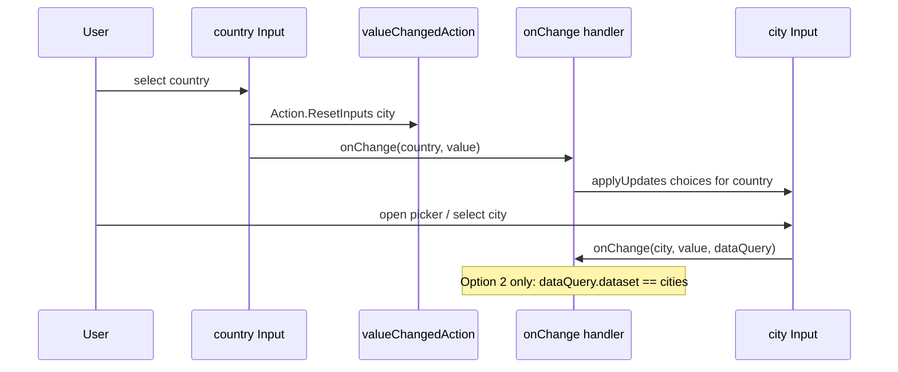

# This project uses Flutter form for all AdaptiveCard Input types

All input types have a choice of using basic flutter widgets or using flutter form widgets. This project is standardizing on flutter forms.

## Runtime values (baseline + overlays)

Input **initial** values come from the card JSON (`adaptiveMap['value']`) when the widget is first built. User edits and programmatic reset/submit do **not** mutate that map.

Runtime state is stored in Riverpod document **overlays** keyed by input id:

- User typing → `setInputValue(id, value)` → overlay `inputValue`
- Submit → `collectInputValues()` returns `overlay.inputValue ?? baseline['value']` per input id
- Reset → `resetAllInputs()` (or per-id `resetInput(id)`) clears **input** overlays so UI matches **baseline JSON** for `value`, `choices`, validation, **`isRequired`**, **`label`**, and **`placeholder`**. See [Reset semantics in reactive-riverpod.md](reactive-riverpod.md#reset-semantics).

`AdaptiveInputMixin` listens to `resolvedElementProvider(id)` so controllers stay in sync when overlays change. New inputs must call `setDocumentInputValue(...)` on change and handle `onDocumentValueChanged` when syncing controllers from document updates.

## Host-driven validation and bulk updates

After submit or server-side checks, hosts can set validation overlays without mutating card JSON:

- `RawAdaptiveCardState.setInputError(id, message:, isInvalid: true)` → document notifier `setInputError`
- `RawAdaptiveCardState.clearInputError(id)` → clears overlay `errorMessage` and `isInvalid`
- `RawAdaptiveCardState.applyUpdates(...)` / `applyUpdatesFromMap(...)` → batch validation, visibility, choices, values, and action `isEnabled` in one call

Example remote validation after `onSubmit`:

```dart
onSubmit: (data) async {
  final errors = await validate(data);
  cardState.applyUpdates(
    elements: errors.entries.map(
      (e) => AdaptiveElementUpdate(
        id: e.key,
        errorMessage: e.value,
        isInvalid: true,
      ),
    ),
  );
},
```

`AdaptiveInputMixin` merges overlay `errorMessage` / `isInvalid` / `isRequired` into the resolved listener; `showValidationError` drives `loadErrorMessage`. User edits call `setInputValue`, which clears validation overlays so typing dismisses host errors.

## initData / initInput vs applyUpdates

| Scenario                          | API                                                      |
| --------------------------------- | -------------------------------------------------------- |
| Simple prefill at card load       | `initData: {'name': 'Jane'}`                             |
| Async value-only late bind        | `cardState.initInput({'name': fetched})`                 |
| Rich load-time or handler patches | `cardState.applyUpdates(...)` or `applyUpdatesFromMap`   |
| Patch-map `initData`              | `initData: {'state': {'choices': [...], 'value': 'CA'}}` |

`seedInputValues` is implemented as value-only `applyUpdates` (single revision bump).

See [`reactive-riverpod.md`](reactive-riverpod.md#how-overlays-change-values-initialized-from-the-adaptive-map).

## Reset behavior (`resetAllInputs` / `resetInput` / `resetInputs`)

`Action.ResetInputs` uses **`executeResetInputsAction`**: omitted **`targetInputIds`** → **`resetAllInputs()`**; non-empty list → **`resetInputs(ids)`**; empty **`[]`** → no-op. Hosts can reset one field with **`resetInput(id)`** (notifier; mixin delegates for widget sync).

Input elements may define **`valueChangedAction`** with embedded **`Action.ResetInputs`** (Teams dependent-input pattern). When the user changes the field, listed targets are factory-reset. **`Input.ChoiceSet`**, **`Input.Date`**, **`Input.Time`**, and **`Input.Toggle`** fire immediately; **`Input.Text`** and **`Input.Number`** fire on focus loss or editing complete (not each keystroke).

Both APIs use the same **factory reset to baseline** for `Input.*` elements:

- **Cleared:** `value`, `choices`, `errorMessage`, `isInvalid`, **`isRequired`**, **`label`**, **`placeholder`** (overlay removed → baseline JSON wins)
- **Preserved on that input:** `isVisible`, typeahead session (`queryCount` / `querySkip` / `querySearchText`)
- **Not reset:** TextBlock text, Image url, action `isEnabled`, other non-input overlays

To restore host-driven state after reset, call `initInput`, `applyUpdates`, or `applyUpdatesFromMap` again.

Full detail: [Reset semantics](reactive-riverpod.md#reset-semantics). Specs: [`2026-06-03-overlay-reset-semantics-design.md`](superpowers/specs/2026-06-03-overlay-reset-semantics-design.md), [`2026-06-04-action-resetinputs-targetinputids-design.md`](superpowers/specs/2026-06-04-action-resetinputs-targetinputids-design.md).

## Dependent ChoiceSet (country → city)

Teams/Bot Framework [dependent inputs](https://learn.microsoft.com/en-us/microsoftteams/platform/task-modules-and-cards/cards/dynamic-search#dependent-inputs) combine two mechanisms:

1. **Card JSON — reset only:** Parent input (e.g. `country`) defines `valueChangedAction` → `Action.ResetInputs` with `targetInputIds: ["city"]`. Changing country factory-resets the city **value** (and other overlays) to baseline JSON. It does **not** change the city **choices** list.
2. **Host — repopulate choices:** Wire `onChange` on `RawAdaptiveCard` / `AdaptiveCardsCanvas` and call `applyUpdates` (or `loadInput`) with country-specific choices for the dependent field.

`valueChangedAction` reset runs inside the library before your `onChange` handler; use `onChange` to restore dependent choices after reset.

End-to-end flow (both Widgetbook demos):



```dart
onChange: (id, value, dataQuery, cardState) {
  if (id == 'country') {
    cardState.applyUpdates(
      elements: [
        AdaptiveElementUpdate(
          id: 'city',
          choices: citiesForCountry(value),
          clearValue: true,
          clearError: true,
        ),
      ],
    );
  }
},
```

**Widgetbook demos** (both use the same handler — [`widgetbook/lib/dependent_choice_set_demo_page.dart`](../widgetbook/lib/dependent_choice_set_demo_page.dart)):

| Use case                                    | Sample JSON                                                                                | What differs                                                                        |
| ------------------------------------------- | ------------------------------------------------------------------------------------------ | ----------------------------------------------------------------------------------- |
| **Value changed action (host cascade)**     | `widgetbook/lib/samples/inputs/input_choice_set/value_changed_action_filtered.json`        | City is **compact** with static baseline choices in JSON                            |
| **Value changed action (Teams Data.Query)** | `widgetbook/lib/samples/inputs/input_choice_set/value_changed_action_dependent_query.json` | City is **filtered** with `choices.data` (`Data.Query`, `associatedInputs: "auto"`) |

Shared handler `handleDependentChoiceSetChange`:

- **`id == 'country'`** — runs for **both** demos: `applyUpdates` with `citiesByCountry`.
- **`id == 'city' && dataQuery?.dataset == 'cities'`** — runs for **Option 2 only** (city has `choices.data`); Phase 1 logs in debug. Option 1 never hits this branch because `dataQuery` is null.

**Gap (planned):** `choices.data.associatedInputs: "auto"` is parsed but not applied — sibling input values are not merged into `DataQuery` for `onChange` yet. Phase 1 preloads city choices on country change; a future library change will let the city branch read `dataQuery.parameters['country']` instead.

Tests: `test/inputs/cascade_choice_set_test.dart`, `test/inputs/value_changed_action_reset_test.dart`, `test/inputs/choice_set_data_query_test.dart`, `test/inputs/dependent_choice_set_test.dart`.

## Filtered ChoiceSet style (`style: "filtered"`)

Filtered inputs open a typeahead modal ([`ChoiceFilter`](../packages/flutter_adaptive_cards_fs/lib/src/cards/inputs/choice_filter.dart)) over resolved `choices`:

| Surface                          | Uses                                  |
| -------------------------------- | ------------------------------------- |
| Modal list labels                | Choice **titles** (`choices[].title`) |
| Typeahead search                 | Case-insensitive match on **titles**  |
| Read-only field after pick       | Selected choice **title**             |
| `onChange`, submit, `Data.Query` | Choice **values** (`choices[].value`) |

Values are never shown in the filter UI unless a title happens to equal its value. Host `onChange` and `collectInputValues()` always receive stored **values**, consistent with compact and expanded styles.

Tests: `test/inputs/choice_filter_test.dart`, `test/inputs/choice_set_test.dart` (filtered modal + title search).

---

Dedicated overlay tests (beyond per-input layout tests under `test/inputs/`):

| Concern                                                           | File                                                                                                     |
| ----------------------------------------------------------------- | -------------------------------------------------------------------------------------------------------- |
| `initData` / `initInput` / `applyUpdates`                         | `test/inputs/init_data_overlay_test.dart`, `test/riverpod/apply_updates_test.dart`                       |
| Host validation (`setInputError`, `clearInputError`, edit clears) | `test/inputs/input_error_overlay_test.dart` (Input.Text, Input.Number)                                   |
| ChoiceSet dynamic choices                                         | `test/inputs/choice_set_overlay_test.dart`                                                               |
| Cascaded country → dependent ChoiceSet                            | `test/inputs/cascade_choice_set_test.dart`                                                               |
| Notifier contract                                                 | `test/riverpod/adaptive_card_document_notifier_test.dart`                                                |
| Targeted reset / `valueChangedAction`                             | `test/inputs/action_reset_inputs_targeted_test.dart`, `test/inputs/value_changed_action_reset_test.dart` |

See [Overlay test coverage](reactive-riverpod.md#overlay-test-coverage) for the full list and gaps.

## Input.xxx Adaptive card inputs

- AdaptiveCard inputs are located in `flutter_adaptive_cards_fs/lib/src/cards/inputs`. Each class there should have its own associated unit test class in `flutter_adaptive_cards_fs/test/inputs`.

## Component field implementations

All of the data entry components in lib/src/cards/inputs should be form componets instead of plain flutter inputs.

- Existing Flutter widget text inputs, selection inputs and the other types should be replaced with their form equivalent where possible

## Unit tests

Input unit tests should be created for all input components and include the following.

- Layout for all display option combinations including labels, separators, tooltips and others where they exists. The test files should ahve the same name as the input class file with an added `_test.dart`.
- Input validation for mandatory fields and the messages.
- Loading from JSON. Card json specifications can be a JSON file or a `map` that is the same as the map loaded from json.
- Initial values loaded from the source json and validated.
- Changing values in an input via UI action should result in the same value via the component API.
- For classes like choice_set, all of the combinations that change layout are tested. `compact`, `multiselect` and their JSON equivalents "compact" and "isMultiSelect".
- Adaptive component widget keys should be validated along with the input field widget keys.
- IDs in the json should be validated against the actual form input ids.

## Key naming changes 2026 Jan 30

Keys should match the following.

- An adaptive card's widget key is the id geven for the adaptive card plus `_adaptive` using the function `generateAdaptiveWidgetKey()`
- The widget key for the actual input field is the id given to the adaptive card using `generateWidgetKey()`
- The widget key for the actual value/display widget for any non-input widgets should be generated using `generateAdaptiveWidgetKey()`

Example:

- An DateInput field map in the JSON has an `id` of `lastname`.
- The Adaptive input card widget Key would be `lastName_adaptive`
- The actual input field inside the card would have a lastname of `lastName` so that when the field is submitted the key for the fields value would be `lastname`.
- Selectors inside field bound to possible selections would have a widget key name of `lastName_<item_key>` or `lastName_<item_value`>

### Previous conventions

This key naming scheme was previously soething like the following

- An DateInput the field map in the JSON has an `id` of `lastname`.
- The Adaptive input card widget Key would be `lastName_adaptive`
- The actual input field inside the card would have a lastname of `lastName`
- Selectors inside field bound to possible selections would have a widget key name of `lastName_<item_key>` or `lastName_<item_value`>
