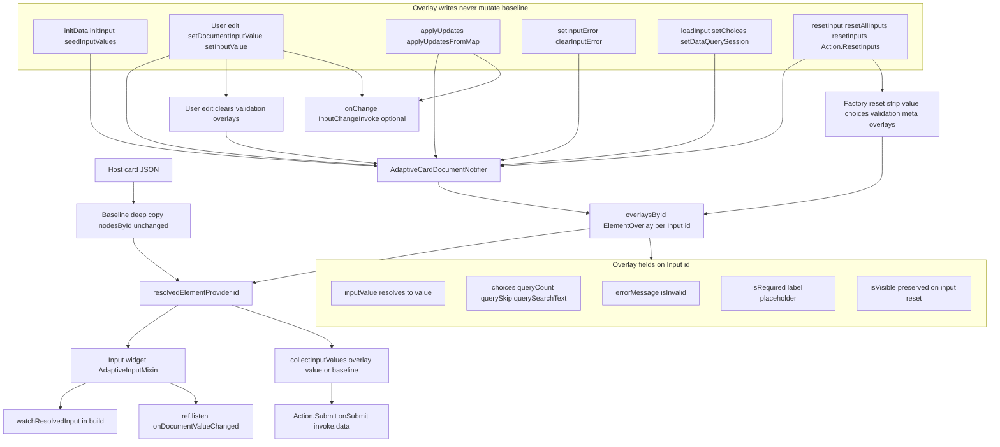
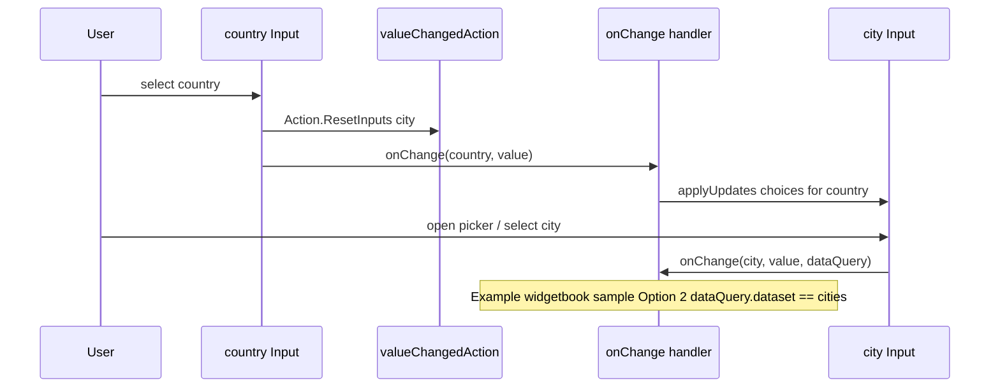

# This project uses Flutter form for all AdaptiveCard Input types

All input types have a choice of using basic flutter widgets or using flutter form widgets. This project is standardizing on flutter forms.

## Runtime values (baseline + overlays)

Input **initial** values come from the card JSON (`adaptiveMap['value']`) when the widget is first built. User edits and programmatic reset/submit do **not** mutate that map.

Runtime state is stored in Riverpod document **overlays** keyed by input id:

- User typing → `setInputValue(id, value)` → overlay `inputValue`
- Submit → `collectInputValues()` returns `overlay.inputValue ?? baseline['value']` per input id
- Reset → `resetAllInputs()` (or per-id `resetInput(id)`) clears **input** overlays so UI matches **baseline JSON** for `value`, `choices`, validation, **`isRequired`**, **`label`**, and **`placeholder`**. See [Reset semantics in reactive-riverpod.md](reactive-riverpod.md#reset-semantics).

`AdaptiveInputMixin` listens to `resolvedElementProvider(id)` so controllers stay in sync when overlays change. New inputs must call `setDocumentInputValue(...)` on change and handle `onDocumentValueChanged` when syncing controllers from document updates.

For the full overlay model (all element types), see [`overlay-properties-by-type.md`](overlay-properties-by-type.md) and [`reactive-riverpod.md`](reactive-riverpod.md). The diagram below is **input-only**.

## Input overlay architecture

`Input.*` widgets never mutate host JSON at runtime. Each input `id` has a baseline node in `nodesById` plus an optional sparse `ElementOverlay` in `overlaysById`. The widget reads a **resolved** map from `resolvedElementProvider(id)` (baseline merged with overlay patches). User typing and host APIs write overlays through `AdaptiveCardDocumentNotifier`; Submit reads merged values via `collectInputValues()`.



| Phase          | Path                                                          | Result                                                                                                                   |
| -------------- | ------------------------------------------------------------- | ------------------------------------------------------------------------------------------------------------------------ |
| **Load**       | Host JSON → baseline copy; registry builds `Input.*` widgets  | Initial display from baseline `value`, `choices`, `label`, …                                                             |
| **Seed**       | `initData` / `initInput` → `seedInputValues` / `applyUpdates` | Overlay patches only (post-frame after mount)                                                                            |
| **Edit**       | User input → `setDocumentInputValue` → `setInputValue`        | `inputValue` overlay; validation overlays cleared                                                                        |
| **Host patch** | `applyUpdates`, `setInputError`, `loadInput`, …               | Choices, validation, dynamic label/required, etc.                                                                        |
| **Submit**     | `collectInputValues()`                                        | `overlay.inputValue ?? baseline['value']` per input id                                                                   |
| **Reset**      | `resetInput` / `resetAllInputs` / `Action.ResetInputs`        | Value, choices, validation, `isRequired`, `label`, `placeholder` → baseline; `isVisible` and typeahead session preserved |

Deeper dives: [initData vs applyUpdates](#initdata--initinput-vs-applyupdates), [Reset behavior](#reset-behavior-resetallinputs--resetinput--resetinputs), [Dependent ChoiceSet](#dependent-choiceset-country--city) (sequence diagram), [reactive-riverpod.md — Reset semantics](reactive-riverpod.md#reset-semantics).

## Host-driven validation and bulk updates

After submit or server-side checks, hosts can set validation overlays without mutating card JSON:

- `RawAdaptiveCardState.setInputError(id, message:, isInvalid: true)` → document notifier `setInputError`
- `RawAdaptiveCardState.clearInputError(id)` → clears overlay `errorMessage` and `isInvalid`
- `RawAdaptiveCardState.applyUpdates(...)` / `applyUpdatesFromMap(...)` → batch validation, visibility, choices, values, and action `isEnabled` in one call

Example remote validation after `onSubmit` (wire on **`InheritedAdaptiveCardHandlers`**, not on **`AdaptiveCardsCanvas`**). Use **`invoke.data`** for merged input values; use **`invoke.actionId`** when routing by action `id`:

```dart
onSubmit: (SubmitActionInvoke invoke) async {
  final errors = await validate(invoke.data);
  invoke.cardState.applyUpdates(
    elements: errors.entries.map(
      (e) => AdaptiveElementUpdate(
        id: e.key,
        errorMessage: e.value,
        isInvalid: true,
      ),
    ),
  );
},
```

`AdaptiveInputMixin` merges overlay `errorMessage` / `isInvalid` / `isRequired` into the resolved listener; `showValidationError` drives `loadErrorMessage`. User edits call `setInputValue`, which clears validation overlays so typing dismisses host errors.

## initData / initInput vs applyUpdates

| Scenario                          | API                                                      |
| --------------------------------- | -------------------------------------------------------- |
| Simple prefill at card load       | `initData: {'name': 'Jane'}`                             |
| Async value-only late bind        | `cardState.initInput({'name': fetched})`                 |
| Rich load-time or handler patches | `cardState.applyUpdates(...)` or `applyUpdatesFromMap`   |
| Patch-map `initData`              | `initData: {'state': {'choices': [...], 'value': 'CA'}}` |

`seedInputValues` is implemented as value-only `applyUpdates` (single revision bump).

See [`reactive-riverpod.md`](reactive-riverpod.md#how-overlays-change-values-initialized-from-the-adaptive-map). For an **input-only** end-to-end diagram, see [`form-inputs.md` — Input overlay architecture](form-inputs.md#input-overlay-architecture).

## Reset behavior (`resetAllInputs` / `resetInput` / `resetInputs`)

`Action.ResetInputs` uses **`executeResetInputsAction`**: omitted **`targetInputIds`** → **`resetAllInputs()`**; non-empty list → **`resetInputs(ids)`**; empty **`[]`** → no-op. Hosts can reset one field with **`resetInput(id)`** (notifier; mixin delegates for widget sync).

Input elements may define **`valueChangedAction`** with embedded **`Action.ResetInputs`** (Teams dependent-input pattern). When the user changes the field, listed targets are factory-reset. **`Input.ChoiceSet`**, **`Input.Date`**, **`Input.Time`**, and **`Input.Toggle`** fire immediately; **`Input.Text`** and **`Input.Number`** fire on focus loss or editing complete (not each keystroke).

Both APIs use the same **factory reset to baseline** for `Input.*` elements:

- **Cleared:** `value`, `choices`, `errorMessage`, `isInvalid`, **`isRequired`**, **`label`**, **`placeholder`** (overlay removed → baseline JSON wins)
- **Preserved on that input:** `isVisible`, typeahead session (`queryCount` / `querySkip` / `querySearchText`)
- **Not reset:** TextBlock text, Image url, action `isEnabled`, other non-input overlays

To restore host-driven state after reset, call `initInput`, `applyUpdates`, or `applyUpdatesFromMap` again.

Full detail: [Reset semantics](reactive-riverpod.md#reset-semantics). Specs: [`2026-06-03-overlay-reset-semantics-design.md`](superpowers/specs/2026-06-03-overlay-reset-semantics-design.md), [`2026-06-04-action-resetinputs-targetinputids-design.md`](superpowers/specs/2026-06-04-action-resetinputs-targetinputids-design.md).

## Dependent ChoiceSet (country → city)

Teams/Bot Framework [dependent inputs](https://learn.microsoft.com/en-us/microsoftteams/platform/task-modules-and-cards/cards/dynamic-search#dependent-inputs) combine two mechanisms:

1. **Card JSON — reset only:** Parent input (e.g. `country`) defines `valueChangedAction` → `Action.ResetInputs` with `targetInputIds: ["city"]`. Changing country factory-resets the city **value** (and other overlays) to baseline JSON. It does **not** change the city **choices** list.
2. **Host — repopulate choices:** Wire `onChange` on `RawAdaptiveCard` / `AdaptiveCardsCanvas` and call `applyUpdates` (or `loadInput`) with country-specific choices for the dependent field.

`valueChangedAction` reset runs inside the library before your `onChange` handler; use `onChange` to restore dependent choices after reset.

End-to-end flow (library behavior; **example** host handler in widgetbook samples):



```dart
onChange: (InputChangeInvoke invoke) {
  if (invoke.inputId == 'country') {
    invoke.cardState.applyUpdates(
      elements: [
        AdaptiveElementUpdate(
          id: 'city',
          choices: citiesForCountry(invoke.value),
          clearValue: true,
          clearError: true,
        ),
      ],
    );
  }
},
```

**Example (widgetbook sample):** demos (shared handler — [`widgetbook/lib/dependent_choice_set_demo_page.dart`](../widgetbook/lib/dependent_choice_set_demo_page.dart)):

| Use case                                    | Sample JSON                                                                                | What differs                                                                        |
| ------------------------------------------- | ------------------------------------------------------------------------------------------ | ----------------------------------------------------------------------------------- |
| **Value changed action (host cascade)**     | `widgetbook/lib/samples/inputs/input_choice_set/value_changed_action_filtered.json`        | City is **compact** with static baseline choices in JSON                            |
| **Value changed action (Teams Data.Query)** | `widgetbook/lib/samples/inputs/input_choice_set/value_changed_action_dependent_query.json` | City is **filtered** with `choices.data` (`Data.Query`, `associatedInputs: "auto"`) |

Shared handler `handleDependentChoiceSetChange`:

- **`id == 'country'`** — runs for **both** demos: `applyUpdates` with `citiesByCountry` (via `invoke.inputId`, `invoke.value`, `invoke.cardState`).
- **`invoke.inputId == 'city' && invoke.dataQuery?.dataset == 'cities'`** — runs for **Option 2 only** (city has `choices.data`); Option 1 never hits this branch because `dataQuery` is null.

**`associatedInputs` (implemented):** When city `choices.data` sets `associatedInputs: "auto"` (default when omitted), sibling input values are merged into `invoke.dataQuery.parameters` on `InputChangeInvoke`. The changing input id is excluded; other card inputs (e.g. `country`) appear as parameter keys. Option 2 handlers can read the parent country from `invoke.dataQuery?.parameters['country']` when the city field fires `onChange` (filtered open, selection, or typeahead). Country change still preloads city choices via the shared country branch; `parameters['country']` complements that for Teams-style Data.Query callbacks.

Tests: `test/inputs/cascade_choice_set_test.dart`, `test/inputs/value_changed_action_reset_test.dart`, `test/inputs/choice_set_data_query_test.dart`, `test/inputs/dependent_choice_set_test.dart`.

## Backend invoke round-trips (optional host package)

When the server returns dynamic choices, validation errors, or a full card replacement, use **`flutter_adaptive_cards_host_fs`** instead of hand-wiring every callback:

```dart
AdaptiveCardBackendHandlers(
  client: HttpAdaptiveCardBackendClient(endpoint: uri),
  cardKey: cardKey,
  onError: (e) => showError(e),
).wrap(
  RawAdaptiveCard.fromMap(key: cardKey, map: cardJson, hostConfigs: hostConfigs),
  onCardReplaced: (map) => setState(() => cardJson = map),
);
```

**What the host package handles:**

| Callback    | Serialized as                                                          | Typical server response                |
| ----------- | ---------------------------------------------------------------------- | -------------------------------------- |
| `onSubmit`  | `kind: submit` + merged `data`                                         | `setInputErrors` or `replaceCard`      |
| `onExecute` | `kind: execute` + `verb` + `data`                                      | `applyPatches` (e.g. new `choices`)    |
| `onRefresh` | same as execute                                                        | `replaceCard` with refreshed JSON      |
| `onChange`  | `kind: inputChange` + `dataQuery` with **`associatedInputs`** siblings | `applyPatches` for dependent ChoiceSet |

**`associatedInputs`** on the card JSON ensures **`InputChangeInvoke.dataQuery.parameters`** already includes sibling values (e.g. `country`) before serialization — the backend does not need a separate client-side merge.

For response effect ordering, error handling, and Teams adapters, see [backend-host-integration.md](backend-host-integration.md). Overlay mapping: [reactive-riverpod.md — Server-driven patches](reactive-riverpod.md#server-driven-patches-host-package).

Tests: `packages/flutter_adaptive_cards_host_fs/test/`.

## Filtered ChoiceSet style (`style: "filtered"`)

Filtered inputs open a typeahead modal ([`ChoiceFilter`](../packages/flutter_adaptive_cards_fs/lib/src/cards/inputs/choice_filter.dart)) over resolved `choices`:

| Surface                          | Uses                                  |
| -------------------------------- | ------------------------------------- |
| Modal list labels                | Choice **titles** (`choices[].title`) |
| Typeahead search                 | Case-insensitive match on **titles**  |
| Read-only field after pick       | Selected choice **title**             |
| `onChange`, submit, `Data.Query` | Choice **values** (`choices[].value`) |

Values are never shown in the filter UI unless a title happens to equal its value. Host `onChange` and `collectInputValues()` always receive stored **values**, consistent with compact and expanded styles.

Tests: `test/inputs/choice_filter_test.dart`, `test/inputs/choice_set_test.dart` (filtered modal + title search).

---

Dedicated overlay tests (beyond per-input layout tests under `test/inputs/`):

| Concern                                                           | File                                                                                                                  |
| ----------------------------------------------------------------- | --------------------------------------------------------------------------------------------------------------------- |
| `initData` / `initInput` / `applyUpdates`                         | `test/inputs/text_overlay_test.dart`, `test/adaptive_card_overlay_test.dart`, `test/riverpod/apply_updates_test.dart` |
| Host validation (`setInputError`, `clearInputError`, edit clears) | `test/inputs/text_overlay_test.dart`, `test/inputs/number_overlay_test.dart`                                          |
| ChoiceSet dynamic choices                                         | `test/inputs/choice_set_overlay_test.dart`                                                                            |
| Cascaded country → dependent ChoiceSet                            | `test/inputs/cascade_choice_set_test.dart`                                                                            |
| Notifier contract                                                 | `test/riverpod/adaptive_card_document_notifier_test.dart`                                                             |
| Targeted reset / `valueChangedAction`                             | `test/inputs/action_reset_inputs_targeted_test.dart`, `test/inputs/value_changed_action_reset_test.dart`              |

See [Overlay test coverage](reactive-riverpod.md#overlay-test-coverage) for the full list and gaps.

## Input.xxx Adaptive card inputs

- AdaptiveCard inputs are located in `flutter_adaptive_cards_fs/lib/src/cards/inputs`. Each class there should have its own associated unit test class in `flutter_adaptive_cards_fs/test/inputs`.

## Input.Text — phone style and character filtering

`Input.Text` with `style: "tel"` sets `keyboardType: TextInputType.phone` on the underlying `TextFormField`. This only controls which virtual keyboard appears on iOS/Android; it does **not** filter characters. On desktop or in widget tests (`tester.enterText` bypasses the keyboard entirely), any character can be typed regardless of keyboard type.

There has never been a `FilteringTextInputFormatter` for phone inputs in this codebase. The only formatter applied to all `Input.Text` fields is `LengthLimitingTextInputFormatter(maxLength)`.

**Validation is submit-time only.** The `regex` field in the card JSON is checked inside `TextFormField.validator`, which runs when `Form.validate()` is called at submit. It is not checked keystroke-by-keystroke. The sequence for a phone field with `regex: "^\(\d{3}\) \d{3}-\d{4}$"`:

1. User types `AAA` → accepted into the field, no error shown
2. User submits → `Form.validate()` → regex fails → error message rendered
3. User resumes typing → validation overlays cleared (see [Edit phase above](#input-overlay-architecture))

This matches the Adaptive Cards spec, which specifies `regex` as a validation rule, not an input filter.

**If you want to block non-phone characters at entry time**, add a conditional `FilteringTextInputFormatter` in `text.dart` alongside the existing length formatter:

```dart
inputFormatters: [
  LengthLimitingTextInputFormatter(maxLength),
  if (inputStyle == TextInputType.phone)
    FilteringTextInputFormatter.allow(RegExp(r'[\d\+\-\(\)\. ]')),
],
```

This silently drops any character not matching the allowlist as it is typed. Be aware that `style: "tel"` is optional in the card JSON — a field can carry a phone `regex` without `style: "tel"`, in which case `inputStyle` would be `null` and this guard would not fire. The guard would need to also inspect the `regex` pattern, or be applied unconditionally for fields with any `regex`.

## Input.Text — password masking and reveal toggle

`Input.Text` with `"style": "password"` obscures typed characters using Flutter's `obscureText: true`. This is **client-side only**: the submitted value is always the clear-text string (the overlay `inputValue` / baseline `value` are never encoded). Password fields are forced single-line regardless of `isMultiline`; autocorrect and suggestions are disabled; the system keyboard type is set to `TextInputType.visiblePassword`.

### Eye-icon reveal toggle

An optional eye-icon button in the field suffix lets users temporarily reveal what they typed. Whether the toggle is shown follows a **three-source precedence** (highest wins):

| Priority | Source | Symbol |
| -------- | ------ | ------ |
| 1 (highest) | Per-element runtime overlay | `ElementOverlay.revealPasswordEnabled` (bool?) via `ResolvedInputState.revealPasswordEnabledOverride` |
| 2 | HostConfig `inputs.text.revealPasswordEnabled` | `TextInputConfig.revealPasswordEnabled` on `InputsConfig.text` |
| 3 (fallback) | `FallbackConfigs.inputsConfig` | `FallbackConfigs.inputsConfig.text.revealPasswordEnabled` (defaults `true`) |

The widget resolves effective availability as:
`(getInputsConfig() ?? FallbackConfigs.inputsConfig).text.revealPasswordEnabled`
with the overlay checked first by `ResolvedInputState.revealPasswordEnabledOverride`.

The HostConfig field `inputs.text.revealPasswordEnabled` is **non-standard** (not in the Microsoft spec); it lives on the new `TextInputConfig` class nested under `InputsConfig.text`. By default the reveal toggle is enabled for all password fields.

### Overlay and reset behavior

The per-element reveal toggle can be set or cleared at runtime:

- **Set:** `AdaptiveCardDocumentNotifier.setRevealPasswordEnabled(id, enabled)` / `RawAdaptiveCardState.setRevealPasswordEnabled(id, enabled)`
- **Clear:** `AdaptiveCardDocumentNotifier.clearRevealPasswordEnabled(id)` / `RawAdaptiveCardState.clearRevealPasswordEnabled(id)`

Unlike value and validation overlays, `revealPasswordEnabled` is **preserved** (not cleared) by `Action.ResetInputs` / `resetInput` / `resetAllInputs` — the same preservation policy as `isVisible` and typeahead session fields. See [Reset semantics in reactive-riverpod.md](reactive-riverpod.md#reset-semantics).

## Component field implementations

All of the data entry components in lib/src/cards/inputs should be form componets instead of plain flutter inputs.

- Existing Flutter widget text inputs, selection inputs and the other types should be replaced with their form equivalent where possible

## Unit tests

Input unit tests should be created for all input components and include the following.

- Layout for all display option combinations including labels, separators, tooltips and others where they exists. The test files should ahve the same name as the input class file with an added `_test.dart`.
- Input validation for mandatory fields and the messages.
- Loading from JSON. Card json specifications can be a JSON file or a `map` that is the same as the map loaded from json.
- Initial values loaded from the source json and validated.
- Changing values in an input via UI action should result in the same value via the component API.
- For classes like choice_set, all of the combinations that change layout are tested. `compact`, `multiselect` and their JSON equivalents "compact" and "isMultiSelect".
- Adaptive component widget keys should be validated along with the input field widget keys.
- IDs in the json should be validated against the actual form input ids.

## Key naming changes 2026 Jan 30

Keys should match the following.

- An adaptive card's widget key is the id geven for the adaptive card plus `_adaptive` using the function `generateAdaptiveWidgetKey()`
- The widget key for the actual input field is the id given to the adaptive card using `generateWidgetKey()`
- The widget key for the actual value/display widget for any non-input widgets should be generated using `generateAdaptiveWidgetKey()`

Example:

- An DateInput field map in the JSON has an `id` of `lastname`.
- The Adaptive input card widget Key would be `lastName_adaptive`
- The actual input field inside the card would have a lastname of `lastName` so that when the field is submitted the key for the fields value would be `lastname`.
- Selectors inside field bound to possible selections would have a widget key name of `lastName_<item_key>` or `lastName_<item_value`>

### Previous conventions

This key naming scheme was previously soething like the following

- An DateInput the field map in the JSON has an `id` of `lastname`.
- The Adaptive input card widget Key would be `lastName_adaptive`
- The actual input field inside the card would have a lastname of `lastName`
- Selectors inside field bound to possible selections would have a widget key name of `lastName_<item_key>` or `lastName_<item_value`>
