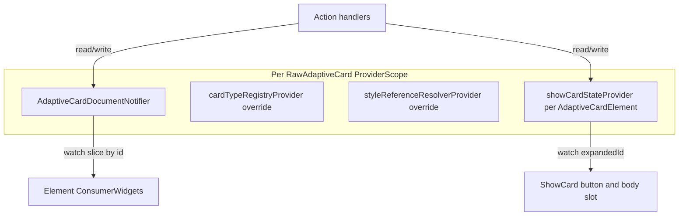
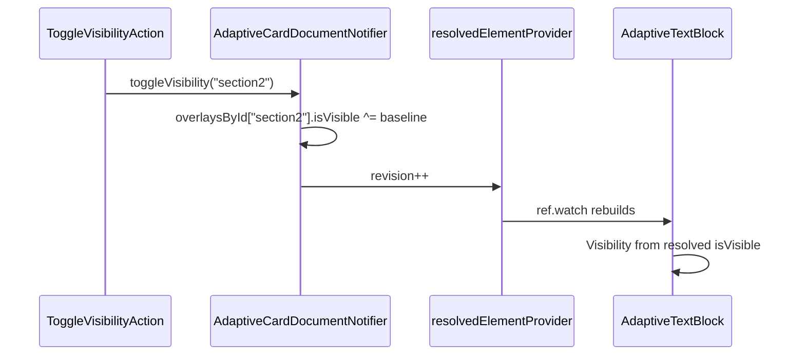

# Reactive Riverpod in flutter_adaptive_cards_fs

## Scope (confirmed)

All work lives in [`packages/flutter_adaptive_cards_fs`](packages/flutter_adaptive_cards_fs). Policy in [`AGENTS.md`](AGENTS.md) and [`doc/replace-riverpod.md`](doc/replace-riverpod.md) will be updated to **allow and endorse** Riverpod usage for reactive card state (not merely DI) within this package. Host apps do not need their own `ProviderScope` if the library wraps each card subtree internally (same ergonomics as today).

## Option B selected (breaking policy reversal)

This plan explicitly accepts a **breaking** architectural change for `flutter_adaptive_cards_fs`:

- **Riverpod is allowed inside the library** (reactive document + UI state), and `AGENTS.md` will be updated accordingly.
- This introduces a **new transitive dependency** (`flutter_riverpod`) for all consumers, so treat this as a **major version** change unless the project’s release policy says otherwise.

Before any deeper migration, the first success gate is: **package compiles and `fvm flutter analyze` is clean** with the new dependency and corrected source files.

## Terminology: two different “registries”

| Name | Role today | After this change |
| --- | --- | --- |
| **`CardTypeRegistry`** | Maps JSON `type` → widget factory ([`registry.dart`](packages/flutter_adaptive_cards_fs/lib/src/registry.dart)) | **Keep** — not replaced by Riverpod; may be exposed via a non-reactive `Provider` override per card scope |
| **`_registeredCards` on `AdaptiveCardElementState`** | Registers widgets by id in [`adaptive_card_element.dart`](packages/flutter_adaptive_cards_fs/lib/src/cards/adaptive_card_element.dart); **never read**, only written | **Remove** — show-card already uses `targetCard` reference + `currentCard` ([`show_card.dart`](packages/flutter_adaptive_cards_fs/lib/src/cards/actions/show_card.dart)) |

Do not conflate eliminating the **widget instance registry** with eliminating **`CardTypeRegistry`**.

## Why the previous Riverpod removal did not solve this

Pre-0.8.0 [`riverpod_providers.dart`](packages/flutter_adaptive_cards_fs) (see commit `196d762`) only **overrode** `Provider`s with existing `State` objects — equivalent to today’s [`InheritedReferenceResolver`](packages/flutter_adaptive_cards_fs/lib/src/inherited_reference_resolver.dart). [`CHANGELOG.md`](packages/flutter_adaptive_cards_fs/CHANGELOG.md) notes it was “not used in any reactive fashion.”

Reactive updates today are **imperative**:

- Inputs / visibility: `AdaptiveInputMixin` / `AdaptiveVisibilityMixin` + `setState` ([`adaptive_mixins.dart`](packages/flutter_adaptive_cards_fs/lib/src/adaptive_mixins.dart))
- Toggle visibility: `RawAdaptiveCardState.toggleVisibility` walks the element tree ([`flutter_raw_adaptive_card.dart`](packages/flutter_adaptive_cards_fs/lib/src/flutter_raw_adaptive_card.dart) ~191–225)
- Submit / reset: `visitChildElements` in [`default_actions.dart`](packages/flutter_adaptive_cards_fs/lib/src/action/default_actions.dart)
- Map replacement: only when parent passes a new `map` → `didUpdateWidget` rebuilds root element ([`flutter_raw_adaptive_card.dart`](packages/flutter_adaptive_cards_fs/lib/src/flutter_raw_adaptive_card.dart) ~92–99)

A **Notifier-backed document model** lets code mutate JSON/runtime fields and have only affected elements rebuild via `ref.watch`.

## Target architecture



### 1. Card document: baseline map + runtime overlay (recommended)

**Do not mutate the host’s map in place for runtime behavior.** The notifier keeps two layers and widgets read a **resolved** view.

#### What gets modified vs overlaid

| Kind of change | Storage | Written by | Visible in debug JSON? |
| --- | --- | --- | --- |
| Host loads / replaces card | `baseline` (full tree, deep-copied on ingest) | `AdaptiveCardsCanvas` / `RawAdaptiveCard` | Yes (baseline only) |
| Host patches structure/content (API refresh, templating) | `baseline` node at `id` (immutable patch) | `patchBaselineElement(id, partial)` or `replaceBaseline(map)` | Yes, after patch |
| User typing, choice selection | **Overlay** `inputValues[id]` | `setInputValue(id, value)` | No (unless you opt into `exportOverlaysToMap()`) |
| ToggleVisibility / programmatic hide | **Overlay** `visibility[id]` | `setVisibility` / `toggleVisibility` | No |
| ResetInputs | Clear overlay entry for input ids; UI falls back to `baseline['value']` | `resetInput(id)` or `resetAllInputs()` | No |
| ShowCard expand/collapse | **Separate UI state** (not JSON) | `ShowCardUiNotifier` per `AdaptiveCardElement` scope | N/A (not Adaptive Cards schema) |

**Rationale:** Today [`AdaptiveInputMixin`](packages/flutter_adaptive_cards_fs/lib/src/adaptive_mixins.dart) copies `adaptiveMap['value']` into `value` and [`AdaptiveVisibilityMixin`](packages/flutter_adaptive_cards_fs/lib/src/adaptive_mixins.dart) keeps `isVisible` only in `State` — the JSON on the widget is already a stale snapshot. Overlays make that explicit, preserve a clean baseline for reset/export, and avoid aliasing if the host reuses the same `Map` instance.

#### Where overlays are stored

Inside the **raw-card** `AdaptiveCardDocumentNotifier` state (one instance per `ProviderScope` on `RawAdaptiveCard`):

```dart
@immutable
class AdaptiveCardDocument {
  /// Deep-copied card JSON from the host. Replaced wholesale on reload.
  final Map<String, dynamic> baseline;

  /// Built when baseline is set: element id -> reference into baseline tree.
  final Map<String, Map<String, dynamic>> nodesById;

  /// Only ids that differ from baseline at runtime. Sparse.
  final Map<String, ElementOverlay> overlaysById;

  final int revision; // bump on any change for Riverpod equality
}

@immutable
class ElementOverlay {
  final bool? isVisible;      // null = use baseline isVisible
  final dynamic inputValue;   // null = use baseline value
}
```

- **`baseline` + `nodesById`**: structural/source JSON. `nodesById` is rebuilt whenever `baseline` changes (walk tree once, register every natural `id` — same rules as `idIsNatural` today).
- **`overlaysById`**: side table keyed by element `id`, lives **only in notifier state** (not inside the nested maps of `baseline`). Missing key means “no runtime overrides for this id.”
- **Show-card UI** (`expandedShowCardId`): **not** in `AdaptiveCardDocument` — stored in a small `ShowCardUiNotifier` overridden on each inner `AdaptiveCardElement` `ProviderScope`, because it is presentation state for one card instance, not element JSON.

Nested `AdaptiveCardElement` cards (show-card targets, nested adaptive cards): each inner scope gets either a **forked** `AdaptiveCardDocument` whose `baseline` is the nested `card` map (preferred), or a scoped view into the parent document — plan default is **fork per inner card** so forms and show-card state stay isolated.

#### Resolved element view (what widgets watch)

Family provider:

```dart
@riverpod
Map<String, dynamic> resolvedElement(Ref ref, String id) {
  final doc = ref.watch(adaptiveCardDocumentProvider);
  final node = doc.nodesById[id]!; // baseline fragment
  final overlay = doc.overlaysById[id];
  return _merge(node, overlay); // shallow copy + apply overrides
}
```

Merge rules (effective map for rendering):

- Start with `Map<String, dynamic>.from(node)` (copy so widgets never mutate baseline).
- If `overlay.isVisible != null` → set `isVisible` on the copy.
- If `overlay.inputValue != null` → set `value` on the copy (inputs).
- All other keys come from baseline only.

Elements use `ref.watch(resolvedElementProvider(id))` instead of `widget.adaptiveMap` for reactive fields; static schema keys (`type`, `label`, `style`) still come from the same resolved map so a baseline patch updates labels too.

#### Write paths

```dart
// Host / library structural updates (mutates baseline copy inside notifier)
void replaceBaseline(Map<String, dynamic> map);
void patchBaselineElement(String id, Map<String, dynamic> partial);

// Runtime (mutates overlaysById only)
void setInputValue(String id, dynamic value);
void setVisibility(String id, bool visible);
void toggleVisibility(String id);
void clearOverlay(String id);
void resetAllInputs(); // remove inputValue entries; visibility overlays unchanged unless reset policy says otherwise
```

`patchBaselineElement` deep-merges into the node in `baseline` and rebuilds `nodesById` if structure changes (child added/removed). That triggers rebuild for watchers of affected ids via `revision`.

**Optional host sync:** `onChange` can fire with `(id, value)` from overlay writes without writing into the host’s original map. If the host wants a single JSON blob, expose `AdaptiveCardDocument.exportMerged()` that deep-merges all overlays into a copy of `baseline` for submit/debug — submit action uses overlay input table directly (faster than materializing full JSON).

#### Reactive flow (example: ToggleVisibility)



No element-tree walk; any widget watching that id updates.

#### Migration from today’s duplicate state

| Today | After |
| --- | --- |
| `widget.adaptiveMap` fixed at construct | `resolvedElementProvider(id)` |
| `AdaptiveInputMixin.value` + controller | `setInputValue` → overlay; controller synced in `build` from resolved `value` |
| `AdaptiveVisibilityMixin.isVisible` + setState | overlay + watch resolved `isVisible` |
| `initInput(hostMap)` | seed overlays from host map or patch baseline `value` fields |
| `appendInput(submitMap)` | read `overlaysById` + baseline ids for inputs in scope |

During migration, writes go to the notifier only; local `setState` shrinks to controller/formatting concerns until inputs are fully consumer-driven.

#### What we are explicitly not doing

- **Not** writing `isVisible` / live `value` back into `baseline` on every keystroke (avoids dirty baseline, broken reset, and host map aliasing).
- **Not** storing overlays inside random nested `Map` nodes in the tree (hard to watch, easy to desync from `nodesById`).
- **Not** using the removed `_registeredCards` map — ids in `nodesById` / overlays replace lookup-by-widget.

### 2. Provider layout (nested scopes)

Mirror existing tree boundaries from [`doc/replace-riverpod.md`](doc/replace-riverpod.md):

| Scope | Providers |
| --- | --- |
| **Raw card** (today `rawCardScopeOf`) | `adaptiveCardDocumentProvider`, `cardTypeRegistryProvider`, `actionTypeRegistryProvider`, `styleReferenceResolverProvider`, `rawAdaptiveCardStateProvider` (facade for pickers/dialogs if still needed) |
| **Per `AdaptiveCardElement`** (today `elementScopeOf`) | `adaptiveCardElementScopeProvider` (form key, show-card id, optional child document fork for nested cards) |

Install **`ProviderScope` + overrides** in:

- [`RawAdaptiveCardState.build`](packages/flutter_adaptive_cards_fs/lib/src/flutter_raw_adaptive_card.dart) — outer scope, seed document from `widget.map`
- [`AdaptiveCardElementState.build`](packages/flutter_adaptive_cards_fs/lib/src/cards/adaptive_card_element.dart) — inner scope per nested card

Hosts keep using `AdaptiveCardsCanvas` unchanged; scope is internal.

### 3. Element widgets become consumers

Evolve ~40 `State` classes using [`ProviderScopeMixin`](packages/flutter_adaptive_cards_fs/lib/src/adaptive_mixins.dart):

- Rename or replace mixin with `AdaptiveCardConsumerMixin` extending `ConsumerState`
- **`build` / `didChangeDependencies`**: `final slice = ref.watch(adaptiveElementProvider(widget.id))` instead of reading frozen `widget.adaptiveMap` only
- **Writes** (input onChanged, visibility): `ref.read(adaptiveCardDocumentProvider.notifier).setInputValue(...)` instead of only `setState`

`CardTypeRegistry.getElement(map:)` can take map from watched slice so structural JSON edits re-instantiate children when type/path changes (same as today’s `didUpdateWidget` on root).

### 4. Replace imperative targeting

| Feature | Today | Riverpod |
| --- | --- | --- |
| **Action.ToggleVisibility** | Tree walk in `toggleVisibility` | `notifier.toggleVisibility(elementId)`; targets `ref.watch` visibility |
| **Action.ShowCard** | `registerCardWidget` + `showCard(AdaptiveCardElement)` identity | `setExpandedShowCard(targetId)`; body slot builds target when id matches; no widget map |
| **Action.Submit / Execute / ResetInputs** | `visitChildElements` + mixins | Read input values from document notifier (single collect method) |
| **Host `onChange`** | `changeValue` on `RawAdaptiveCardState` | Notifier patch + optional callback from notifier listener |

### 5. What to do with `InheritedReferenceResolver`

**Phased:**

1. **Phase A** — Add Riverpod alongside inherited scopes; mixin reads `ref` first, falls back to inherited during migration.
2. **Phase B** — Remove DI fields from `InheritedReferenceResolver` (keep only if still needed for `InheritedWidget` notify for theme — or watch `Theme` directly).
3. **Phase C** — Delete redundant inherited scope if fully superseded.

`InheritedAdaptiveCardHandlers` stays as-is (host callbacks are not card document state).

## AGENTS.md and doc updates

Update [`AGENTS.md`](AGENTS.md) state-management section (~lines 43–51) to explicitly allow Riverpod usage in `flutter_adaptive_cards_fs`:

- **Do** use `ProviderScope` per `RawAdaptiveCard` / nested `AdaptiveCardElement` (library-owned).
- **Do** use `Notifier` / `ref.watch` for JSON and per-id runtime state; prefer patching the document over element-tree walks.
- **Do** keep `CardTypeRegistry` / `ActionTypeRegistry` as override providers per card scope.
- **Do not** use a side-channel widget registry (`registerCardWidget`) for show-card or visibility.
- Remove/replace the blanket “do not add Riverpod” line with a rule that Riverpod **is allowed** in this package specifically for reactive document + UI state (and document the provider names, scope diagram, and migration notes in new [`doc/reactive-riverpod.md`](doc/reactive-riverpod.md)).
- Revise [`doc/replace-riverpod.md`](doc/replace-riverpod.md) from “removal completed” to “reactive reintroduction” or merge into the new doc.
- Update [`doc/Architecture-Overview.md`](doc/Architecture-Overview.md) state table and diagram.

## Dependency and API impact

- Add `flutter_riverpod` to [`packages/flutter_adaptive_cards_fs/pubspec.yaml`](packages/flutter_adaptive_cards_fs/pubspec.yaml) — **transitive** for all consumers (major semver bump).
- Export minimal public types if hosts need to patch document: e.g. `AdaptiveCardDocumentController` wrapping `ref.read(...notifier)` from a `GlobalKey` or callback from `AdaptiveCardsCanvas`.
- **Breaking:** Internal; public canvas API can remain stable if scope is internal.

## Implementation phases (recommended order)

0. **Build-green gate (required)** — add `flutter_riverpod`, fix any malformed/duplicated riverpod-based source files, then run `fvm flutter analyze` (and fix issues) so the migration proceeds on a stable baseline.
1. **Policy + skeleton** — internal `ProviderScope` on `RawAdaptiveCard`, `AdaptiveCardDocumentNotifier` with `patchElement` / `setVisibility`, AGENTS + new doc, changelog entry.
2. **Toggle visibility path** — Wire `DefaultToggleVisibilityAction` to notifier; convert `AdaptiveVisibilityMixin` elements to `ref.watch` visibility; delete tree-walk methods when tests pass.
3. **Show card path** — `expandedShowCardId` provider; remove `_registeredCards`, `registerCardWidget`, manual `registerCardWidget` in show_card; tests in existing show-card / registry areas.
4. **Input collection** — Centralize submit/execute/reset to read from document; reduce `visitChildElements` duplication.
5. **Full element migration** — Convert remaining elements from `widget.adaptiveMap`-only to watched slices; optional deep equality / `select` to limit rebuilds.
6. **Cleanup** — Remove `InheritedReferenceResolver` DI duplication; rename `ProviderScopeMixin` → `AdaptiveCardScopeMixin` (Consumer-based) to avoid confusion with Riverpod’s `ProviderScope`.

## Risks and mitigations

| Risk | Mitigation |
| --- | --- |
| Rebuild storms when whole map changes | `select` / family providers by `id`; immutable patches per element |
| Nested `AdaptiveCardElement` scopes | Separate notifier instance per inner `ProviderScope` override (fork document subtree) |
| Duplicate state during migration | Single write path in notifier; widgets read-only from `ref.watch` |
| Test churn | Migrate [`adaptive-cards-testing`](.agents/skills/adaptive-cards-testing/SKILL.md) helpers to pump with `ProviderScope` + overrides |
| Charts package | [`flutter_adaptive_charts_fs`](packages/flutter_adaptive_charts_fs) uses `ProviderScopeMixin` — align in same release or follow-up PR |

## Success criteria

- Mutating element JSON or `isVisible` via notifier updates UI without `registerCardWidget` or `visitChildElements` for those features.
- `_registeredCards` and `registerCardWidget` / `unregisterCardWidget` removed.
- `CardTypeRegistry` still supports custom types.
- `fvm flutter analyze` and existing widget/golden tests pass (updated for ProviderScope).
- AGENTS.md documents the new pattern; no conflicting “do not add Riverpod” rule.

## Out of scope (unless you expand later)

- Replacing `CardTypeRegistry` with Riverpod codegen.
- Templating package (`flutter_adaptive_template_fs`) reactive binding.
- Host-app-specific state management patterns.
