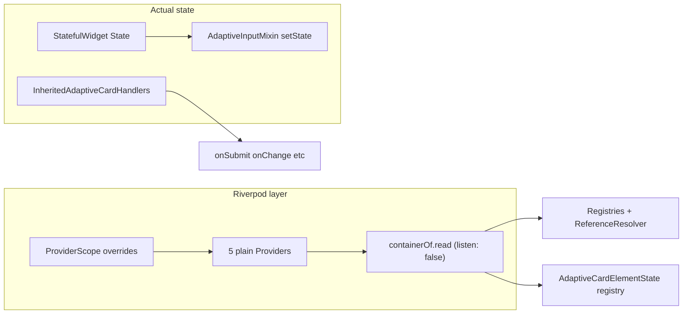

# Is Riverpod leveraged to its potential?

**Verdict: No.** The package uses Riverpod as a **scoped service locator**, not as a state-management framework. That is a valid pattern for this codebase, but it means most of Riverpod’s strengths are unused—and you still pay the dependency and API surface cost.

---

## What the package actually uses

| Capability | Used? | Where |
|------------|-------|--------|
| `Provider` + `overrideWithValue` | Yes | [`riverpod_providers.dart`](packages/flutter_adaptive_cards_fs/lib/src/riverpod_providers.dart), [`flutter_raw_adaptive_card.dart`](packages/flutter_adaptive_cards_fs/lib/src/flutter_raw_adaptive_card.dart), [`adaptive_card_element.dart`](packages/flutter_adaptive_cards_fs/lib/src/cards/adaptive_card_element.dart) |
| Nested `ProviderScope` | Yes | Outer = card root; inner = per `AdaptiveCardElement` |
| `ProviderScope.containerOf(...).read` | Yes | [`adaptive_mixins.dart`](packages/flutter_adaptive_cards_fs/lib/src/adaptive_mixins.dart) (`ProviderScopeMixin`), [`utils.dart`](packages/flutter_adaptive_cards_fs/lib/src/utils/utils.dart), [`default_actions.dart`](packages/flutter_adaptive_cards_fs/lib/src/action/default_actions.dart) |
| `listen: false` everywhere | Yes | No reactive subscriptions |
| `ref.watch` / `ConsumerWidget` | **No** | — |
| `Notifier` / `AsyncNotifier` / `StateNotifier` | **No** | — |
| Provider `family` / `autoDispose` | **No** | — |
| Async/data fetching via providers | **No** | `DataQuery` / network handled outside providers |
| Input values / visibility state | **No** | [`AdaptiveInputMixin`](packages/flutter_adaptive_cards_fs/lib/src/adaptive_mixins.dart) + per-widget `setState` (e.g. [`choice_set.dart`](packages/flutter_adaptive_cards_fs/lib/src/cards/inputs/choice_set.dart), [`text.dart`](packages/flutter_adaptive_cards_fs/lib/src/cards/inputs/text.dart)) |
| Host action callbacks | **No** (Riverpod) | [`InheritedAdaptiveCardHandlers`](packages/flutter_adaptive_cards_fs/lib/src/action/action_handler.dart) |

**~40+** element/action states use [`ProviderScopeMixin`](packages/flutter_adaptive_cards_fs/lib/src/adaptive_mixins.dart) only to **read** shared services—not to publish reactive state.

---

## Misalignment with docs and AGENTS.md

- [`doc/Architecture-Overview.md`](doc/Architecture-Overview.md) claims `StateNotifierProvider`, input tracking in Riverpod, and `ConsumerWidget`—**none of this exists** in code.
- Root [`AGENTS.md`](AGENTS.md) recommends `ConsumerWidget` / `AsyncNotifier` for this project—**inconsistent** with library implementation.
- [`doc/replace-riverpod.md`](doc/replace-riverpod.md) accurately describes current usage (recent draft).

---

## Is the current pattern “wrong”?

**For this library’s goals, the DI usage is reasonable:**

- Deep adaptive tree needs registries, `ReferenceResolver`, and per-card `AdaptiveCardElementState` without drilling constructors through every element type.
- Extension packages (charts) can mix in `ProviderScopeMixin` and inherit the outer scope.
- Values are **stable references** overridden once per scope; `listen: false` is correct—there is nothing to “watch” on the provider side.

**Where it under-delivers vs Riverpod’s potential:**

1. **No reactive invalidation** — Theme/`HostConfig` updates rebuild via `RawAdaptiveCardState.setState` and widget lifecycle, not provider listeners. Riverpod’s rebuild optimization is unused.
2. **Duplicate dependency-injection models** — Riverpod for services + `InheritedWidget` for handlers + dead [`InheritedReferenceResolver`](packages/flutter_adaptive_cards_fs/lib/src/inherited_reference_resolver.dart). Consumers must understand two mechanisms.
3. **Imperative `containerOf` in `StatelessWidget`s** — Works, but bypasses Riverpod’s widget integration (`Consumer`, `ref`) and is harder to test/mock than explicit `InheritedWidget` or constructor injection.
4. **Transitive dependency** — [`pubspec.yaml`](packages/flutter_adaptive_cards_fs/pubspec.yaml) pulls `flutter_riverpod` for all consumers even though the public API does not export it ([`flutter_adaptive_cards_fs.dart`](packages/flutter_adaptive_cards_fs/lib/flutter_adaptive_cards_fs.dart) exports canvas, host config, registry only).

---

## Would “using Riverpod more” help?

| Hypothetical adoption | Likely benefit | Fit for adaptive cards |
|----------------------|----------------|------------------------|
| Move input state to `NotifierProvider` | Centralized input map, testable reads | High refactor cost; current mixin + `Form` validation works |
| `ref.watch(styleReferenceResolverProvider)` on theme change | Auto-rebuild on resolver change | Marginal; `didChangeDependencies` + `setState` already handle theme |
| Replace `InheritedAdaptiveCardHandlers` with providers | Single DI story | Possible, but hosts already know `InheritedWidget`; breaking change |
| `ConsumerWidget` for elements | Idiomatic Riverpod | Large churn; elements are already `StatefulWidget` by design |

**Conclusion:** Pushing further into Riverpod would be **architectural churn** with little gain unless you want host apps to integrate via `ProviderScope` and custom providers—which the library deliberately hides today.

---

## Recommendation summary

| Goal | Recommendation |
|------|----------------|
| **Minimize dependencies** (per [`replace-riverpod.md`](doc/replace-riverpod.md)) | **Remove Riverpod**; replace with `InheritedWidget` scopes (partially already there for handlers). Low risk because features are not tied to Riverpod reactivity. |
| **Keep Riverpod** | Treat it as **DI only**—document that explicitly; fix Architecture/AGENTS docs; do **not** invest in Notifiers/Consumers unless product requirements change. |
| **Maximize Riverpod** | Only justified if you want hosts to override providers, share async card state app-wide, or unit-test via `ProviderContainer`—none of which are requirements today. |

---

## Optional follow-up work (if you want to act on this)

1. **Docs** — Align [`Architecture-Overview.md`](doc/Architecture-Overview.md) and [`AGENTS.md`](AGENTS.md) with actual patterns (or point to [`replace-riverpod.md`](doc/replace-riverpod.md)).
2. **Spike** — Prototype one `InheritedWidget` scope replacing outer `ProviderScope` to validate removal effort (see “What removal would need to replace” in replace-riverpod doc).
3. **Consolidate handlers** — If keeping Riverpod, consider moving `InheritedAdaptiveCardHandlers` into the same scope model for one DI story (optional, breaking).

No code changes are proposed in this assessment; confirm if you want a removal spike or doc-only updates next.
